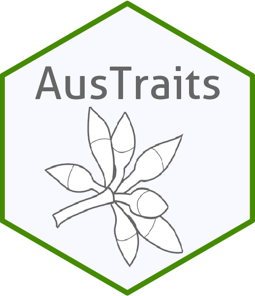

<!-- README.md is generated from README.Rmd. Please edit that file -->

```{r, include = FALSE}
knitr::opts_chunk$set(
  collapse = TRUE,
  comment = "#>",
  fig.path = "man/figures/README-",
  out.width = "100%",
  message = FALSE,
  warning = FALSE
)

library(stringr)
library(dplyr)
```

# austraits 

<!-- badges: start -->
[](https://github.com/traitecoevo/austraits/actions)
[](https://codecov.io/gh/traitecoevo/austraits)
<!-- badges: end -->

`austraits` allow users to access, explore and wrangle data from the AusTraits database in `R`. This package includes several functions such as filtering and pivoting the dataset that we expect will come in handy. In our vignette, we have also included some tutorials that uses our functions as well as `tidyverse` functions to create more data outputs and summaries - see browseVignettes("austraits")

### Installation

The package is not on CRAN yet and is still under active development. You can install the development version of austraits from [GitHub](https://github.com/traitecoevo/austraits) with:

```{r setup, results = 'hide'}
#install.packages("remotes")
remotes::install_github("traitecoevo/austraits", build_vignettes = TRUE)

library(austraits) 
```


### Extracting by study
```{r extract_study}
#Extract a single study
zanne_09 <- extract_dataset(austraits, "Zanne_2009") 

#Extract multiple studies
# Filtering multiple studies by same lead author (e.g. Falster) and assigning it to an object
dataset_ids <- austraits$methods$dataset_id %>% unique() #All possible dataset_ids 
falster_ids <- dataset_ids[str_which(dataset_ids, "Falster")]  # Extracting dataset_ids with lead author "Falster" 

falster_studies <- extract_dataset(austraits, falster_ids)
```

### Extracting by trait
```{r extract, warning = FALSE}
# Extract one particular trait and assigning it to an object
sla_data <- extract_trait(austraits, "specific_leaf_area")

# Extracting all leaf associated data and assigning it to an object
traits <- austraits$traits$trait_name %>% unique()  #All possible traits 
leaf_traits <- traits[str_which(traits, "leaf")] # Extracting data where "leaf" occurs in the trait_name

leaf_data <- extract_trait(austraits, leaf_traits) 
```

### Pivoting between long/wide

```{r pivot, include = FALSE}

```

### Joining site information and plotting site information

```{r site}
# Join site based information 
(austraits %>% join_sites)$traits %>% plot_site_locations()
```

