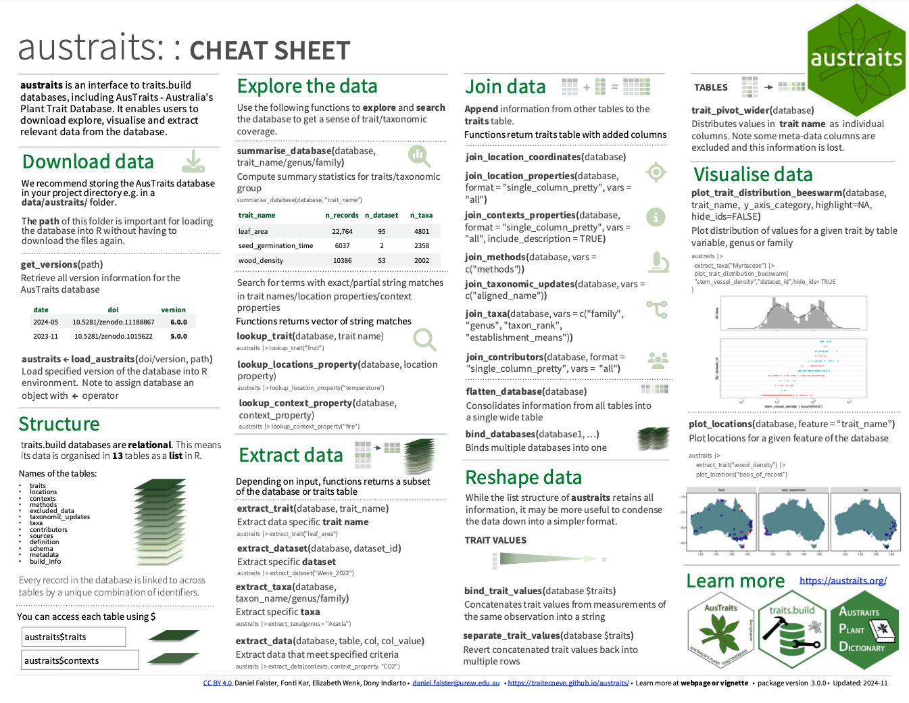

<!-- README.md is generated from README.Rmd. Please edit that file -->

# austraits 

<!-- badges: start -->

[](https://github.com/traitecoevo/austraits/actions/workflows/R-CMD-check.yml)
[](https://codecov.io/gh/traitecoevo/austraits)
[](https://doi.org/10.1038/s41597-021-01006-6)
[](https://lifecycle.r-lib.org/articles/stages.html#stable)
[](https://app.codecov.io/gh/traitecoevo/austraits?branch=master)
<!-- badges: end -->

`austraits` allow users to **access, explore and wrangle data** from
[traits.build](https://github.com/traitecoevo/traits.build) relational
databases. It is also an R interface to
[AusTraits](https://austraits.org/), the Australian plant trait
database. This package contains functions for joining data from various
tables, filtering to specific records, combining multiple databases and
visualising the distribution of the data. We expect this package will
assist users in working with `traits.build` databases.

### Installation

This package is not on CRAN yet and is still under active development.
For the current stable release of `austraits`, which has full
capabilities of the functions used in vignettes (e.g. plotting
functions), use:

``` r
#install.packages("remotes")
remotes::install_github("traitecoevo/austraits", dependencies = TRUE, upgrade = "ask")

library(austraits) 
```

For a lightweight installation where dependencies for plotting and
producing the vignettes will not be installed, use:

``` r
remotes::install_github("traitecoevo/austraits", upgrade = "ask")
```

### Details for AusTraits users

#### Retrieve AusTraits data

- **For R users**, the AusTraits database can be accessed through the
  `austraits` package using `load_austraits()`

- **For Python or other users**, the [Zenodo
  download](https://zenodo.org/record/5112001#collapseTwo) includes a
  `.zip` file containing all the data in plain text (`.csv` files) and
  associated meta-data

#### Backwards compatibility with past AusTraits versions

From September 2024, `austraits` functions were revamped to support all
[traits.build](https://github.com/traitecoevo/traits.build) compiled
databases, rather than being linked to
[austraits.build](https://github.com/traitecoevo/austraits.build).

Versions of `austraits.build` (the AusTraits plant trait database) **\<
5.0 are no longer supported** by the latest version of the package. If
you are working with an older version of AusTraits, please install an
older version of austraits:

For `austraits.build` versions 4.2 and older:

``` r
#install.packages("remotes")
remotes::install_github("traitecoevo/austraits@v2.2.2", dependencies = TRUE, upgrade = "ask")

library(austraits)
```

Note, if you are unsure what version of AusTraits you are working with,
run:

``` r
austraits$build_info$version
```

### Getting started 👀

We highly recommend taking a look at our [Getting Started
tutorial](https://traitecoevo.github.io/austraits/) on our website
before jumping into the `austraits` R package!

If you prefer to view this vignette in R, we recommend installing the
package with `build_vignettes = TRUE`.

``` r
remotes::install_github("traitecoevo/austraits", 
                        dependencies = TRUE, upgrade = "ask", 
                        build_vignettes = TRUE)

vignette("austraits")
```

### Cheat sheet

<a href="https://github.com/traitecoevo/austraits/tree/develop/inst/cheatsheet/austraits-cheatsheet.pdf"></a>

### Learn more about AusTraits

AusTraits is a relational database, you can learn more about it’s
structure from the [traits.build
book](https://traitecoevo.github.io/traits.build-book/AusTraits_tutorial.html).

You can also learn about the definitions of each plant trait with the
[AusTraits Plant Dictionary!](https://w3id.org/APD)

### Show us some support 💚

Please consider citing `austraits`, we would super appreciate it!

``` r
citation("austraits")
#> To cite austraits in publications use:
#> 
#>   Falster, D., Gallagher, R., Wenk, E.H. et al. AusTraits, a curated
#>   plant trait database for the Australian flora. Sci Data 8, 254
#>   (2021). https://doi.org/10.1038/s41597-021-01006-6
#> 
#> A BibTeX entry for LaTeX users is
#> 
#>   @Article{,
#>     title = {AusTraits, a curated plant trait database for the Australian flora},
#>     author = {Daniel Falster and Rachael Gallagher and Elizabeth Wenk et al.},
#>     journal = {Scientific Data},
#>     year = {2021},
#>     volume = {8},
#>     number = {1},
#>     pages = {254 - 274},
#>     url = {https://doi.org/10.1038/s41597-021-01006-6},
#>   }
```

### Behind the scenes 🛠

Check out
[austraits.build](https://github.com/traitecoevo/austraits.build?tab=readme-ov-file),
if you are interested in how AusTraits the database is managed and
created

### Find a bug? 🐛

Thank you for finding it! Head over to the GitHub Issues tab and let us
know about it! We will try to get to it as soon as we can!
