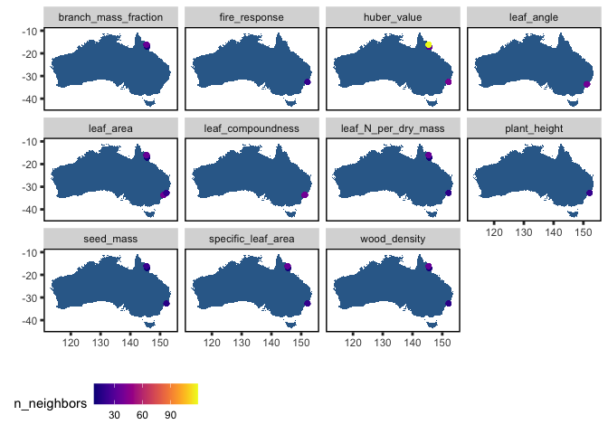

<!-- README.md is generated from README.Rmd. Please edit that file -->

austraits
=========

<!-- badges: start -->

<!-- badges: end -->

`austraits` allow users to access, explore and wrangle data from the
AusTraits database in `R`. This package includes several functions such
as filtering and pivoting the dataset that we expect will come in handy.
In our vignette, we have also included some tutorials that uses our
functions as well as `tidyverse` functions to create more data outputs
and summaries - see browseVignettes(“austraits”)

### Installation

The package is not on CRAN yet and is still under active development.
You can install the development version of austraits from
[GitHub](https://github.com/traitecoevo/austraits) with:

    #> gtable       (NA -> 0.3.0) [CRAN]
    #> colorspace   (NA -> 2.0-1) [CRAN]
    #> viridisLite  (NA -> 0.4.0) [CRAN]
    #> RColorBrewer (NA -> 1.1-2) [CRAN]
    #> munsell      (NA -> 0.5.0) [CRAN]
    #> labeling     (NA -> 0.4.2) [CRAN]
    #> farver       (NA -> 2.1.0) [CRAN]
    #> withr        (NA -> 2.4.2) [CRAN]
    #> scales       (NA -> 1.1.1) [CRAN]
    #> isoband      (NA -> 0.2.4) [CRAN]
    #> gridExtra    (NA -> 2.3  ) [CRAN]
    #> ggplot2      (NA -> 3.3.4) [CRAN]
    #> vipor        (NA -> 0.4.5) [CRAN]
    #> beeswarm     (NA -> 0.4.0) [CRAN]
    #> cpp11        (NA -> 0.2.7) [CRAN]
    #> viridis      (NA -> 0.6.1) [CRAN]
    #> ggpointde... (NA -> 0.1.0) [CRAN]
    #> forcats      (NA -> 0.5.1) [CRAN]
    #> ggbeeswarm   (NA -> 0.6.0) [CRAN]
    #> assertthat   (NA -> 0.2.1) [CRAN]
    #> tidyr        (NA -> 1.1.3) [CRAN]
    #> 
    #>   There is a binary version available but the source version is later:
    #>         binary source needs_compilation
    #> ggplot2  3.3.3  3.3.4             FALSE
    #> 
    #> 
    #> The downloaded binary packages are in
    #>  /var/folders/24/8k48jl6d249_n_qfxwsl6xvm0000gn/T//Rtmp27jri2/downloaded_packages
    #> * checking for file ‘/private/var/folders/24/8k48jl6d249_n_qfxwsl6xvm0000gn/T/Rtmp27jri2/remotes84c12e1f0c3/traitecoevo-austraits-bf72bc4/DESCRIPTION’ ... OK
    #> * preparing ‘austraits’:
    #> * checking DESCRIPTION meta-information ... OK
    #> * installing the package to build vignettes
    #> * creating vignettes ... OK
    #> * checking for LF line-endings in source and make files and shell scripts
    #> * checking for empty or unneeded directories
    #> * building ‘austraits_0.0.0.9000.tar.gz’

How to use
----------

### Extracting by study

    #Extract a single study
    zanne_09 <- extract_dataset(austraits, "Zanne_2009") 

    #Extract multiple studies
    # Filtering multiple studies by same lead author (e.g. Falster) and assigning it to an object
    dataset_ids <- austraits$methods$dataset_id %>% unique() #All possible dataset_ids 
    falster_ids <- dataset_ids[str_which(dataset_ids, "Falster")]  # Extracting dataset_ids with lead author "Falster" 

    falster_studies <- extract_dataset(austraits, falster_ids)

### Extracting by trait

    # Extract one particular trait and assigning it to an object
    sla_data <- extract_trait(austraits, "specific_leaf_area")

    # Extracting all leaf associated data and assigning it to an object
    traits <- austraits$traits$trait_name %>% unique()  #All possible traits 
    leaf_traits <- traits[str_which(traits, "leaf")] # Extracting data where "leaf" occurs in the trait_name

    leaf_data <- extract_trait(austraits, leaf_traits) 

### Pivoting between long/wide

### Joining site information and plotting site information

    # Join site based information 
    (austraits %>% join_sites)$traits %>% plot_site_locations()

