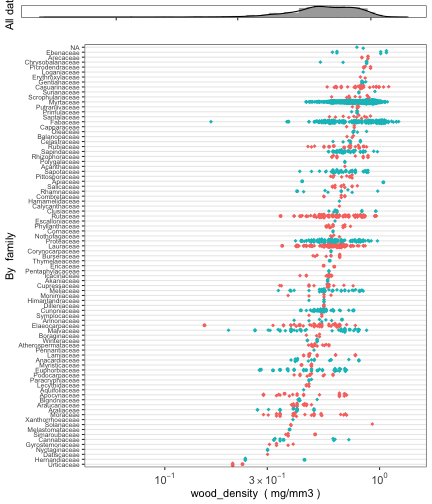
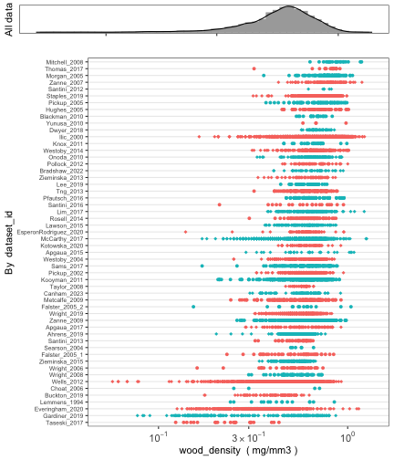

The `austraits` package is designed to aid users in accessing data from [AusTraits](https://zenodo.org/record/5112001), a curated plant trait database for the Australian flora. This package contains several core functions to wrangle and visualise data. Below, we include a tutorial to illustrate how to use these functions in greater detail.

**Note that we are using a reduced subset of v.3.0.2, so the version number and number of records and species will not be match your values**

## Getting started
`austraits` is still under development. To install the current version from GitHub: 


```r
#install.packages("remotes")
remotes::install_github("traitecoevo/austraits", dependencies = TRUE, upgrade = "ask")

# Load the austraits package
library(austraits)
```

### Loading AusTraits database

By default, `load_austraits` will download AusTraits to a specified path e.g. `data/austraits` and will reload it from this location in the future. You can set `update = TRUE` so the austrait versions are downloaded fresh from [Zenodo](https://zenodo.org/record/3568429). Note that `load_austraits` will happily accept a DOI of a particular version.


```r
austraits <- load_austraits(version = "3.0.2", path = "data/austraits")
```

You can check out different versions and their associated DOI of AusTraits by using: 


```r
get_versions(path = "data/austraits")
```

The AusTraits object is a very *long* list with various of elements. If you are not familiar with working with lists in R, we recommend having a quick look at this [tutorial](https://www.tutorialspoint.com/r/r_lists.htm). To learn more about the structure of `austraits`, check out the [structure of the database](https://traitecoevo.github.io/austraits/articles/structure.html). 


```r
austraits
```

```
#> This is version 0.0.0.900 of austraits!
#>  
#> This object contains a total of 5859 records for 1245 species and 33 traits.
#> 
#> This object is a 'list' with the following components:
#> 
#>  - `traits`: A table containing measurements of plant traits.
#> - `sites`: A table containing observations of site characteristics associated with information in `traits`. Cross referencing between the two dataframes is possible using combinations of the variables `dataset_id`, `site_name`.
#> - `contexts`: A table containing observations of contextual characteristics associated with information in `traits`. Cross referencing between the two dataframes is possible using combinations of the variables `dataset_id`, `context_name`.
#> - `methods`: A table containing details on methods with which data were collected, including time frame and source.
#> - `excluded_data`: A table of data that did not pass quality test and so were excluded from the master dataset.
#> - `taxa`: A table containing details on taxa associated with information in `traits`. This information has been sourced from the APC (Australian Plant Census) and APNI (Australian Plant Names Index) and is released under a CC-BY3 license.
#> - `definitions`: A copy of the definitions for all tables and terms. Information included here was used to process data and generate any documentation for the study.
#> - `sources`: Bibtex entries for all primary and secondary sources in the compilation.
#> - `contributors`: A table of people contributing to each study.
#> - `taxonomic_updates`: A table of all taxonomic changes implemented in the construction of AusTraits. Changes are determined by comapring against the APC (Australian Plant Census) and APNI (Australian Plant Names Index).
#> - `build_info`: A description of the computing environment used to create this version of the dataset, including version number, git commit and R session_info.
#> 
#> To access a component, try using the $ e.g. austraits$traits
```

## Descriptive summaries of traits and taxa

AusTraits contains 33 plant traits. Check out [definitions of the traits](https://traitecoevo.github.io/austraits/articles/dictionary.html) to learn more about how each trait is defined. 

Have a look at what trait or taxa we have with: 


```r
summarise_austraits(austraits, "trait_name") %>% head()
```

```
#>            trait_name n_records n_dataset n_taxa percent_total
#>  branch_mass_fraction        45         1     45      0.007680
#>     fire_cued_seeding         5         1      5      0.000853
#>         fire_response        73         2     72      0.012500
#>        flowering_time        31         1     31      0.005290
#>           huber_value       193         2     57      0.032900
#>            leaf_angle        38         1     38      0.006490
```

```r
summarise_austraits(austraits, "family") %>% head()
```

```
#>         family n_records n_dataset n_taxa percent_total
#>    Acanthaceae         1         1      1      0.000171
#>     Akaniaceae         3         1      1      0.000512
#>  Anacardiaceae        20         2      7      0.003410
#>     Annonaceae        15         2      5      0.002560
#>       Apiaceae        17         1      2      0.002900
#>    Apocynaceae        32         3      9      0.005460
```

```r
summarise_austraits(austraits, "genus") %>% head()
```

```
#>       genus n_records n_dataset n_taxa percent_total
#>      Acacia       184         4     77      0.031400
#>   Aceratium         5         1      3      0.000854
#>      Ackama        10         1      2      0.001710
#>   Acradenia         3         1      2      0.000512
#>  Acronychia        21         3      7      0.003590
#>   Actinotus        10         1      1      0.001710
```

Interested in a specific trait? Try `lookup_trait`


```r
lookup_trait(austraits, "leaf") %>% head()
```

```
#> [1] "leaf_angle"              "leaf_area"               "leaf_compoundness"      
#> [4] "leaf_N_per_dry_mass"     "specific_leaf_area"      "leaf_cell_wall_fraction"
```

## Extracting data

In most cases, users would like to extract a subset of `austraits` for their own research purposes.`extract_dataset` subsets a particular study, whereas `extract_trait`subsets by certain traits. Note that the other tables and elements of the AusTraits data are extracted too, not just the main trait table. See `?extract_dataset` and `?extract_trait` for more details

### Extracting by study

Filtering **one particular study** and assigning it to an object


```r
subset_data <- extract_dataset(austraits, "Falster_2005_2")

subset_data$traits %>% head()
```

```
#> # A tibble: 6 × 12
#>   dataset_id    taxon_name site_name context_name observation_id trait_name value unit  date  value_type
#>   <chr>         <chr>      <chr>     <chr>        <chr>          <chr>      <chr> <chr> <chr> <fct>     
#> 1 Falster_2005… Acacia lo… Myall_La… <NA>         Falster_2005_… fire_resp… fire… <NA>  2002… expert_me…
#> 2 Falster_2005… Acacia lo… Myall_La… <NA>         Falster_2005_… huber_val… 0.00… mm2_… 2002… site_mean 
#> 3 Falster_2005… Acacia lo… Myall_La… <NA>         Falster_2005_… huber_val… 0.00… mm2_… 2002… site_mean 
#> 4 Falster_2005… Acacia lo… Myall_La… <NA>         Falster_2005_… huber_val… 0.00… mm2_… 2002… site_mean 
#> 5 Falster_2005… Acacia lo… Myall_La… <NA>         Falster_2005_… huber_val… 0.00… mm2_… 2002… site_mean 
#> 6 Falster_2005… Acacia lo… Myall_La… <NA>         Falster_2005_… leaf_area  1761  mm2   2002… site_mean 
#> # … with 2 more variables: replicates <chr>, original_name <chr>
```

Filtering **multiple studies by two different lead authors**  and assigning it to an object


```r
subset_multi_studies <- extract_dataset(austraits, 
                                        dataset_id = c("Thompson_2001","Ilic_2000"))
 
subset_multi_studies$traits %>% head()
```

```
#> # A tibble: 6 × 12
#>   dataset_id taxon_name    site_name context_name observation_id trait_name value unit  date  value_type
#>   <chr>      <chr>         <chr>     <chr>        <chr>          <chr>      <chr> <chr> <chr> <fct>     
#> 1 Ilic_2000  Acacia acrad… <NA>      <NA>         Ilic_2000_0001 wood_dens… 0.904 mg/m… <NA>  unknown   
#> 2 Ilic_2000  Acacia acumi… <NA>      <NA>         Ilic_2000_0002 wood_dens… 0.895 mg/m… <NA>  unknown   
#> 3 Ilic_2000  Acacia acumi… <NA>      <NA>         Ilic_2000_0003 wood_dens… 1.008 mg/m… <NA>  unknown   
#> 4 Ilic_2000  Acacia adsur… <NA>      <NA>         Ilic_2000_0004 wood_dens… 0.887 mg/m… <NA>  unknown   
#> 5 Ilic_2000  Acacia ampli… <NA>      <NA>         Ilic_2000_0005 wood_dens… 0.568 mg/m… <NA>  unknown   
#> 6 Ilic_2000  Acacia aneura <NA>      <NA>         Ilic_2000_0006 wood_dens… 1.035 mg/m… <NA>  unknown   
#> # … with 2 more variables: replicates <chr>, original_name <chr>
```

Filtering **multiple studies by same lead author** (e.g. Falster) and assigning it to an object.  


```r
# First, we need to identify all studies with an id that includes "Falster"

( dataset_ids <- austraits$methods$dataset_id %>% unique() %>% subset(., grepl("Falster",.))) 
```

```
#> [1] "Falster_2003"   "Falster_2005_1" "Falster_2005_2"
```

```r
# Then we extract
data_falster_studies <- extract_dataset(austraits, dataset_ids)

data_falster_studies$traits %>% head()
```

```
#> # A tibble: 6 × 12
#>   dataset_id   taxon_name  site_name context_name observation_id trait_name value unit  date  value_type
#>   <chr>        <chr>       <chr>     <chr>        <chr>          <chr>      <chr> <chr> <chr> <fct>     
#> 1 Falster_2003 Acacia myr… Ku-ring-… <NA>         Falster_2003_… leaf_angle 66.1  degr… <NA>  site_mean 
#> 2 Falster_2003 Acacia myr… Ku-ring-… <NA>         Falster_2003_… leaf_area  319   mm2   <NA>  site_mean 
#> 3 Falster_2003 Acacia myr… Ku-ring-… <NA>         Falster_2003_… leaf_comp… simp… <NA>  <NA>  expert_me…
#> 4 Falster_2003 Acacia sua… Ku-ring-… <NA>         Falster_2003_… leaf_angle 71.7  degr… <NA>  site_mean 
#> 5 Falster_2003 Acacia sua… Ku-ring-… <NA>         Falster_2003_… leaf_area  562   mm2   <NA>  site_mean 
#> 6 Falster_2003 Acacia sua… Ku-ring-… <NA>         Falster_2003_… leaf_comp… simp… <NA>  <NA>  expert_me…
#> # … with 2 more variables: replicates <chr>, original_name <chr>
```

### Extracting by taxonomic level


```r
# By family 
proteaceae <- extract_taxa(austraits, family = "Proteaceae")
# Checking that only taxa in Proteaceae have been extracted
proteaceae$taxa$family %>% unique()
```

```
#> [1] "Proteaceae"
```

```r
# By genus 
acacia <- extract_taxa(austraits, genus = "Acacia")
# Checking that only taxa in Acacia have been extracted
acacia$traits$taxon_name %>% unique() %>% head()
```

```
#> [1] "Acacia myrtifolia" "Acacia suaveolens" "Acacia floribunda" "Acacia celsa"      "Acacia longifolia"
#> [6] "Acacia terminalis"
```

### Extracting by trait

Filtering **one particular trait** and assigning it to an object


```r
data_wood_dens <- extract_trait(austraits, "wood_density")

head(data_wood_dens$traits)
```

```
#> # A tibble: 6 × 12
#>   dataset_id    taxon_name site_name context_name observation_id trait_name value unit  date  value_type
#>   <chr>         <chr>      <chr>     <chr>        <chr>          <chr>      <dbl> <chr> <chr> <fct>     
#> 1 Falster_2005… Acacia ce… Atherton  <NA>         Falster_2005_… wood_dens… 0.498 mg/m… 2002… site_mean 
#> 2 Falster_2005… Acronychi… Atherton  <NA>         Falster_2005_… wood_dens… 0.525 mg/m… 2002… site_mean 
#> 3 Falster_2005… Alphitoni… Atherton  <NA>         Falster_2005_… wood_dens… 0.413 mg/m… 2002… site_mean 
#> 4 Falster_2005… Glochidio… Atherton  <NA>         Falster_2005_… wood_dens… 0.566 mg/m… 2002… site_mean 
#> 5 Falster_2005… Homalanth… Atherton  <NA>         Falster_2005_… wood_dens… 0.319 mg/m… 2002… site_mean 
#> 6 Falster_2005… Melicope … Atherton  <NA>         Falster_2005_… wood_dens… 0.346 mg/m… 2002… site_mean 
#> # … with 2 more variables: replicates <chr>, original_name <chr>
```

Combining `lookup_trait` with `extract_trait` to obtain **all traits with 'leaf' in the trait name** and assigning it to an object. Note we use the `.` notation to pass on the `lookup_trait` results to `extract_trait`


```r
data_leaf <- lookup_trait(austraits, "leaf") %>% extract_trait(austraits, .) 

head(data_leaf$traits)
```

```
#> # A tibble: 6 × 12
#>   dataset_id   taxon_name  site_name context_name observation_id trait_name value unit  date  value_type
#>   <chr>        <chr>       <chr>     <chr>        <chr>          <chr>      <dbl> <chr> <chr> <fct>     
#> 1 Falster_2003 Acacia myr… Ku-ring-… <NA>         Falster_2003_… leaf_angle  66.1 degr… <NA>  site_mean 
#> 2 Falster_2003 Acacia myr… Ku-ring-… <NA>         Falster_2003_… leaf_area  319   mm2   <NA>  site_mean 
#> 3 Falster_2003 Acacia myr… Ku-ring-… <NA>         Falster_2003_… leaf_comp…  NA   <NA>  <NA>  expert_me…
#> 4 Falster_2003 Acacia sua… Ku-ring-… <NA>         Falster_2003_… leaf_angle  71.7 degr… <NA>  site_mean 
#> 5 Falster_2003 Acacia sua… Ku-ring-… <NA>         Falster_2003_… leaf_area  562   mm2   <NA>  site_mean 
#> 6 Falster_2003 Acacia sua… Ku-ring-… <NA>         Falster_2003_… leaf_comp…  NA   <NA>  <NA>  expert_me…
#> # … with 2 more variables: replicates <chr>, original_name <chr>
```

## Join data from other tables and elements

Once users have extracted the data they want, they may want to merge other study details into the main `traits` dataframe for their analyses. For example, users may require taxonomic information for a phylogenetic analysis. This is where the `join_` functions come in. 
There are five `join_` functions in total, each designed to append specific information from other tables and elements in the `austraits` object. Their suffixes refer to the type of information that is joined, e.g. `join_taxonomy` appends taxonomic information to the `traits` dataframe. See `?join_all` for more details. 


```r
# Join taxonomic information 
(data_leaf %>% join_taxonomy)$traits %>% head()
```

```
#> # A tibble: 6 × 16
#>   dataset_id   taxon_name  site_name context_name observation_id trait_name value unit  date  value_type
#>   <chr>        <chr>       <chr>     <chr>        <chr>          <chr>      <dbl> <chr> <chr> <fct>     
#> 1 Falster_2003 Acacia myr… Ku-ring-… <NA>         Falster_2003_… leaf_angle  66.1 degr… <NA>  site_mean 
#> 2 Falster_2003 Acacia myr… Ku-ring-… <NA>         Falster_2003_… leaf_area  319   mm2   <NA>  site_mean 
#> 3 Falster_2003 Acacia myr… Ku-ring-… <NA>         Falster_2003_… leaf_comp…  NA   <NA>  <NA>  expert_me…
#> 4 Falster_2003 Acacia sua… Ku-ring-… <NA>         Falster_2003_… leaf_angle  71.7 degr… <NA>  site_mean 
#> 5 Falster_2003 Acacia sua… Ku-ring-… <NA>         Falster_2003_… leaf_area  562   mm2   <NA>  site_mean 
#> 6 Falster_2003 Acacia sua… Ku-ring-… <NA>         Falster_2003_… leaf_comp…  NA   <NA>  <NA>  expert_me…
#> # … with 6 more variables: replicates <chr>, original_name <chr>, family <chr>, genus <chr>,
#> #   taxonRank <chr>, acceptedNameUsageID <chr>
```

```r
# Join methodological information 
(data_leaf %>% join_methods)$traits %>% head()
```

```
#> # A tibble: 6 × 16
#>   dataset_id   taxon_name  site_name context_name observation_id trait_name value unit  date  value_type
#>   <chr>        <chr>       <chr>     <chr>        <chr>          <chr>      <dbl> <chr> <chr> <fct>     
#> 1 Falster_2003 Acacia myr… Ku-ring-… <NA>         Falster_2003_… leaf_angle  66.1 degr… <NA>  site_mean 
#> 2 Falster_2003 Acacia myr… Ku-ring-… <NA>         Falster_2003_… leaf_area  319   mm2   <NA>  site_mean 
#> 3 Falster_2003 Acacia myr… Ku-ring-… <NA>         Falster_2003_… leaf_comp…  NA   <NA>  <NA>  expert_me…
#> 4 Falster_2003 Acacia sua… Ku-ring-… <NA>         Falster_2003_… leaf_angle  71.7 degr… <NA>  site_mean 
#> 5 Falster_2003 Acacia sua… Ku-ring-… <NA>         Falster_2003_… leaf_area  562   mm2   <NA>  site_mean 
#> 6 Falster_2003 Acacia sua… Ku-ring-… <NA>         Falster_2003_… leaf_comp…  NA   <NA>  <NA>  expert_me…
#> # … with 6 more variables: replicates <chr>, original_name <chr>, methods <chr>,
#> #   year_collected_start <chr>, year_collected_end <chr>, collection_type <chr>
```

```r
# Join site based information 
(data_leaf %>% join_sites)$traits %>% head()
```

```
#> # A tibble: 6 × 14
#>   dataset_id   taxon_name  site_name context_name observation_id trait_name value unit  date  value_type
#>   <chr>        <chr>       <chr>     <chr>        <chr>          <chr>      <dbl> <chr> <chr> <fct>     
#> 1 Falster_2003 Acacia myr… Ku-ring-… <NA>         Falster_2003_… leaf_angle  66.1 degr… <NA>  site_mean 
#> 2 Falster_2003 Acacia myr… Ku-ring-… <NA>         Falster_2003_… leaf_area  319   mm2   <NA>  site_mean 
#> 3 Falster_2003 Acacia myr… Ku-ring-… <NA>         Falster_2003_… leaf_comp…  NA   <NA>  <NA>  expert_me…
#> 4 Falster_2003 Acacia sua… Ku-ring-… <NA>         Falster_2003_… leaf_angle  71.7 degr… <NA>  site_mean 
#> 5 Falster_2003 Acacia sua… Ku-ring-… <NA>         Falster_2003_… leaf_area  562   mm2   <NA>  site_mean 
#> 6 Falster_2003 Acacia sua… Ku-ring-… <NA>         Falster_2003_… leaf_comp…  NA   <NA>  <NA>  expert_me…
#> # … with 4 more variables: replicates <chr>, original_name <chr>, `latitude (deg)` <chr>,
#> #   `longitude (deg)` <chr>
```

```r
# Join context information 
(data_leaf %>% join_contexts)$traits %>% head()
```

```
#> # A tibble: 6 × 12
#>   dataset_id   taxon_name  site_name context_name observation_id trait_name value unit  date  value_type
#>   <chr>        <chr>       <chr>     <chr>        <chr>          <chr>      <dbl> <chr> <chr> <fct>     
#> 1 Falster_2003 Acacia myr… Ku-ring-… <NA>         Falster_2003_… leaf_angle  66.1 degr… <NA>  site_mean 
#> 2 Falster_2003 Acacia myr… Ku-ring-… <NA>         Falster_2003_… leaf_area  319   mm2   <NA>  site_mean 
#> 3 Falster_2003 Acacia myr… Ku-ring-… <NA>         Falster_2003_… leaf_comp…  NA   <NA>  <NA>  expert_me…
#> 4 Falster_2003 Acacia sua… Ku-ring-… <NA>         Falster_2003_… leaf_angle  71.7 degr… <NA>  site_mean 
#> 5 Falster_2003 Acacia sua… Ku-ring-… <NA>         Falster_2003_… leaf_area  562   mm2   <NA>  site_mean 
#> 6 Falster_2003 Acacia sua… Ku-ring-… <NA>         Falster_2003_… leaf_comp…  NA   <NA>  <NA>  expert_me…
#> # … with 2 more variables: replicates <chr>, original_name <chr>
```

```r
# Alternatively users can join *all* information 
(data_leaf %>% join_all)$traits %>% head()
```

```
#> # A tibble: 6 × 22
#>   dataset_id   taxon_name  site_name context_name observation_id trait_name value unit  date  value_type
#>   <chr>        <chr>       <chr>     <chr>        <chr>          <chr>      <dbl> <chr> <chr> <fct>     
#> 1 Falster_2003 Acacia myr… Ku-ring-… <NA>         Falster_2003_… leaf_angle  66.1 degr… <NA>  site_mean 
#> 2 Falster_2003 Acacia myr… Ku-ring-… <NA>         Falster_2003_… leaf_area  319   mm2   <NA>  site_mean 
#> 3 Falster_2003 Acacia myr… Ku-ring-… <NA>         Falster_2003_… leaf_comp…  NA   <NA>  <NA>  expert_me…
#> 4 Falster_2003 Acacia sua… Ku-ring-… <NA>         Falster_2003_… leaf_angle  71.7 degr… <NA>  site_mean 
#> 5 Falster_2003 Acacia sua… Ku-ring-… <NA>         Falster_2003_… leaf_area  562   mm2   <NA>  site_mean 
#> 6 Falster_2003 Acacia sua… Ku-ring-… <NA>         Falster_2003_… leaf_comp…  NA   <NA>  <NA>  expert_me…
#> # … with 12 more variables: replicates <chr>, original_name <chr>, `latitude (deg)` <chr>,
#> #   `longitude (deg)` <chr>, family <chr>, genus <chr>, taxonRank <chr>, acceptedNameUsageID <chr>,
#> #   methods <chr>, year_collected_start <chr>, year_collected_end <chr>, collection_type <chr>
```

## Visualising data by site

`plot_site_locations` graphically summarises where trait data was collected from and how much data is available. The legend refers to the number of neighbouring points: the warmer the colour, the more data that is available. This function only works for studies that are geo-referenced. Users must first use `join_sites` to append latitude and longitude information into the trait dataframe before plotting


```r
data_wood_dens <- data_wood_dens %>% join_sites()
plot_site_locations(data_wood_dens$traits)
```


## Visualising data distribution and variance

`plot_trait_distribution` creates histograms and [beeswarm plots](https://github.com/eclarke/ggbeeswarm) for specific traits to help users visualise the variance of the data. Users can specify whether to create separate beeswarm plots at the level of taxonomic family or for each `dataset_id`


```r
austraits %>% plot_trait_distribution_beeswarm("wood_density", "family")
```



```r
austraits %>% plot_trait_distribution_beeswarm("wood_density", "dataset_id")
```



### Pivotting from long to wide format

The table of traits in AusTraits comes in long format, where data for all traits are in two columns called `trait_name` and `value`. You can convert this to wide format, where each trait is in a separate column, using the function `trait_pivot_wider`. This will produce 5 separate lists (`value`, `unit`, `date`, `value_type` and `replicates`). The trait values are stored in the `value` list.

Note that in some cases, there are *multiple observations* for some traits, e.g. huber values. This can prevent pivoting from long format to wide. In these circumstances, we suggest using `bind_trait_values` which joins multiple observations together into a string.


```r
data_wide_bound <- data_falster_studies$traits %>%
  bind_trait_values() %>% # Joining multiple obs with `--`
  trait_pivot_wider() #Pivot wide

data_wide_bound$value # The trait values table
```

```
#> # A tibble: 103 × 17
#>    dataset_id   taxon_name   site_name context_name observation_id leaf_angle leaf_area leaf_compoundne…
#>    <chr>        <chr>        <chr>     <chr>        <chr>          <chr>      <chr>     <chr>           
#>  1 Falster_2003 Acacia myrt… Ku-ring-… <NA>         Falster_2003_… 66.1       319       simple          
#>  2 Falster_2003 Acacia suav… Ku-ring-… <NA>         Falster_2003_… 71.7       562       simple          
#>  3 Falster_2003 Angophora h… Ku-ring-… <NA>         Falster_2003_… 50.8       1590      simple          
#>  4 Falster_2003 Banksia mar… Ku-ring-… <NA>         Falster_2003_… 53.1       198       simple          
#>  5 Falster_2003 Banksia obl… Ku-ring-… <NA>         Falster_2003_… 45         1061      simple          
#>  6 Falster_2003 Boronia pin… Ku-ring-… <NA>         Falster_2003_… 43.9       151       simple          
#>  7 Falster_2003 Conospermum… Ku-ring-… <NA>         Falster_2003_… 72.3       1363      simple          
#>  8 Falster_2003 Epacris pul… Ku-ring-… <NA>         Falster_2003_… 42.9       5         simple          
#>  9 Falster_2003 Eriostemon … Ku-ring-… <NA>         Falster_2003_… 62.1       102       simple          
#> 10 Falster_2003 Corymbia gu… Ku-ring-… <NA>         Falster_2003_… 59.3       1111      simple          
#> # … with 93 more rows, and 9 more variables: branch_mass_fraction <chr>, huber_value <chr>,
#> #   leaf_N_per_dry_mass <chr>, seed_mass <chr>, specific_leaf_area <chr>, wood_density <chr>,
#> #   fire_response <chr>, plant_height <chr>, original_name <chr>
```

```r
# Check out the 'bounded' trait values
data_wide_bound$value %>% 
  select(-c(1:5)) %>% #Excluding values that are not traits so we can see which columns contains bounded values
  filter_all(.vars_predicate = any_vars(str_detect(., "--"))) 
```

```
#> # A tibble: 55 × 12
#>    leaf_angle leaf_area leaf_compoundness branch_mass_fraction huber_value    leaf_N_per_dry_… seed_mass
#>    <chr>      <chr>     <chr>             <chr>                <chr>          <chr>            <chr>    
#>  1 <NA>       2786      <NA>              0.67                 0.00033590863… 21.4             10.3     
#>  2 <NA>       14302     <NA>              0.48                 0.00013227513… 24.3             <NA>     
#>  3 <NA>       6820      <NA>              0.42                 0.00023041474… 16.3             27.2     
#>  4 <NA>       3209      <NA>              0.41                 0.00050175614… 13.7             10.41    
#>  5 <NA>       10682     <NA>              0.47                 0.00046816479… 22               7        
#>  6 <NA>       6955      <NA>              0.58                 0.00023803856… 26.8             1.61     
#>  7 <NA>       5228      <NA>              0.58                 0.00059311981… 16.4             176.1    
#>  8 <NA>       6806      <NA>              0.42                 0.00016644474… 15.4             8.35     
#>  9 <NA>       11157     <NA>              0                    0.00020092425… 17.9             23.09    
#> 10 <NA>       3401      <NA>              0.34                 0.00023142791… 11.1             <NA>     
#> # … with 45 more rows, and 5 more variables: specific_leaf_area <chr>, wood_density <chr>,
#> #   fire_response <chr>, plant_height <chr>, original_name <chr>
```

If you would like to revert the bounded trait values, you have to use `trait_pivot_longer` first, then: 


```r
data_wide_bound %>% 
  trait_pivot_longer() %>% 
  separate_trait_values(., austraits$definitions)
```

```
#> # A tibble: 691 × 12
#>    dataset_id   taxon_name site_name context_name observation_id trait_name value unit  date  value_type
#>    <chr>        <chr>      <chr>     <chr>        <chr>          <chr>      <chr> <chr> <chr> <fct>     
#>  1 Falster_2003 Acacia my… Ku-ring-… <NA>         Falster_2003_… leaf_angle 66.1  degr… <NA>  <NA>      
#>  2 Falster_2003 Acacia my… Ku-ring-… <NA>         Falster_2003_… leaf_area  319   mm2   <NA>  <NA>      
#>  3 Falster_2003 Acacia my… Ku-ring-… <NA>         Falster_2003_… leaf_comp… simp… <NA>  <NA>  <NA>      
#>  4 Falster_2003 Acacia su… Ku-ring-… <NA>         Falster_2003_… leaf_angle 71.7  degr… <NA>  <NA>      
#>  5 Falster_2003 Acacia su… Ku-ring-… <NA>         Falster_2003_… leaf_area  562   mm2   <NA>  <NA>      
#>  6 Falster_2003 Acacia su… Ku-ring-… <NA>         Falster_2003_… leaf_comp… simp… <NA>  <NA>  <NA>      
#>  7 Falster_2003 Angophora… Ku-ring-… <NA>         Falster_2003_… leaf_angle 50.8  degr… <NA>  <NA>      
#>  8 Falster_2003 Angophora… Ku-ring-… <NA>         Falster_2003_… leaf_area  1590  mm2   <NA>  <NA>      
#>  9 Falster_2003 Angophora… Ku-ring-… <NA>         Falster_2003_… leaf_comp… simp… <NA>  <NA>  <NA>      
#> 10 Falster_2003 Banksia m… Ku-ring-… <NA>         Falster_2003_… leaf_angle 53.1  degr… <NA>  <NA>      
#> # … with 681 more rows, and 2 more variables: replicates <chr>, original_name <chr>
```

Alternatively, if you don't want to bind the trait values, you can give `summarise_trait_means` a go, which computes means with multiple observations. Note that this method condenses the traits table and you won't be able to revert it back unless you `load_austraits` again


```r
data_wide_summarised <- data_falster_studies$traits %>%
  summarise_trait_means() %>% 
  trait_pivot_wider()

data_wide_summarised$value %>% head()
```

```
#> # A tibble: 6 × 17
#>   dataset_id   taxon_name    site_name context_name observation_id leaf_angle leaf_area leaf_compoundne…
#>   <chr>        <chr>         <chr>     <chr>        <chr>               <dbl>     <dbl>            <dbl>
#> 1 Falster_2003 Acacia myrti… Ku-ring-… <NA>         Falster_2003_…       66.1       319               NA
#> 2 Falster_2003 Acacia suave… Ku-ring-… <NA>         Falster_2003_…       71.7       562               NA
#> 3 Falster_2003 Angophora hi… Ku-ring-… <NA>         Falster_2003_…       50.8      1590               NA
#> 4 Falster_2003 Banksia marg… Ku-ring-… <NA>         Falster_2003_…       53.1       198               NA
#> 5 Falster_2003 Banksia oblo… Ku-ring-… <NA>         Falster_2003_…       45        1061               NA
#> 6 Falster_2003 Boronia pinn… Ku-ring-… <NA>         Falster_2003_…       43.9       151               NA
#> # … with 9 more variables: branch_mass_fraction <dbl>, leaf_N_per_dry_mass <dbl>, seed_mass <dbl>,
#> #   specific_leaf_area <dbl>, wood_density <dbl>, huber_value <dbl>, fire_response <dbl>,
#> #   plant_height <dbl>, original_name <chr>
```

