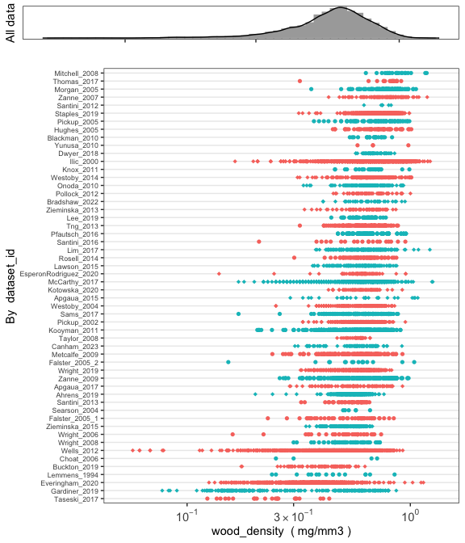

`austraits` allow users to **access, explore and wrangle data** from [traits.build](https://github.com/traitecoevo/traits.build) relational databases. It is also an R interface to [AusTraits](https://austraits.org/), the Australian plant trait database. This package contains functions for joining data from various tables, filtering to specific records, combining multiple databases and visualising the distribution of the data. Below, we've include a tutorial using the AusTraits database to illustrate how some these functions work together to generate useful outputs.

## Install and load `austraits`
`austraits` is still under development. To install the current version from GitHub: 


``` r
#install.packages("remotes")
remotes::install_github("traitecoevo/austraits", dependencies = TRUE, upgrade = "ask")

# Load the austraits package
library(austraits)
```

### Retrieve AusTraits database

We will use the latest AusTraits database as an example database. 

We can download the AusTraits database by calling `load_austraits()`. This function will download AusTraits to a specified path. By default it is `data/austraits`. The function will reload the database from this location in the future. You can set `update = TRUE` so the database is downloaded fresh from [Zenodo](https://zenodo.org/record/3568429). Note that `load_austraits()` will happily accept a DOI of a particular version.


``` r
austraits <- load_austraits(version = "6.0.0", path = "data/austraits")
```

You can check out different versions of AusTraits and their associated DOI by using: 


``` r
get_versions(path = "data/austraits")
```


```
#> # A tibble: 6 × 4
#>   publication_date doi                     version id      
#>   <date>           <chr>                   <chr>   <chr>   
#> 1 2024-05-14       10.5281/zenodo.11188867 6.0.0   11188867
#> 2 2023-11-19       10.5281/zenodo.10156222 5.0.0   10156222
#> 3 2023-09-18       10.5281/zenodo.8353840  4.2.0   8353840 
#> 4 2023-01-30       10.5281/zenodo.7583087  4.1.0   7583087 
#> 5 2022-11-27       10.5281/zenodo.7368074  4.0.0   7368074 
#> 6 2021-07-14       10.5281/zenodo.5112001  3.0.2   5112001
```

AusTraits, like all traits.build databases, is a relational database. In R, it is a very *large* list with multiple tables. If you are not familiar with working with lists in R, we recommend having a quick look at this [tutorial](https://www.tutorialspoint.com/r/r_lists.htm). To learn more about the structure of `austraits`, check out the [structure of the database](https://traitecoevo.github.io/austraits/articles/structure.html). 


``` r
austraits
```

```
#> ── This is 6.0.0 of AusTraits: a curated plant trait database for the Australian flora! ───────────────────────────────
#> ℹ This database is built using traits.build version 1.1.0.9000
#> ℹ This database contains a total of 1726024 records, for 33494 taxa and 497 traits.
#> 
#> ── This object is a 'list' with the following components: ──
#> 
#> • traits: A table containing measurements of traits.
#> • locations: A table containing observations of location/site characteristics associated with information in `traits`.
#> Cross referencing between the two dataframes is possible using combinations of the variables `dataset_id`,
#> `location_name`.
#> • contexts: A table containing observations of contextual characteristics associated with information in `traits`.
#> Cross referencing between the two dataframes is possible using combinations of the variables `dataset_id`, `link_id`,
#> and `link_vals`.
#> • methods: A table containing details on methods with which data were collected, including time frame and source.
#> Cross referencing with the `traits` table is possible using combinations of the variables `dataset_id`, `trait_name`.
#> • excluded_data: A table of data that did not pass quality test and so were excluded from the master dataset.
#> • taxonomic_updates: A table of all taxonomic changes implemented in the construction of AusTraits. Changes are
#> determined by comapring against the APC (Australian Plant Census) and APNI (Australian Plant Names Index).
#> • taxa: A table containing details on taxa associated with information in `traits`. This information has been sourced
#> from the APC (Australian Plant Census) and APNI (Australian Plant Names Index) and is released under a CC-BY3 license.
#> • contributors: A table of people contributing to each study.
#> • sources: Bibtex entries for all primary and secondary sources in the compilation.
#> • definitions: A copy of the definitions for all tables and terms. Information included here was used to process data
#> and generate any documentation for the study.
#> • schema: A copy of the schema for all tables and terms. Information included here was used to process data and
#> generate any documentation for the study.
#> • metadata: Metadata associated with the dataset, including title, creators, license, subject, funding sources.
#> • build_info: A description of the computing environment used to create this version of the dataset, including version
#> number, git commit and R session_info.
#> ℹ To access a component, try using the $ e.g. austraits$traits
```

## Descriptive summaries of traits and taxa

AusTraits contains 497 plant traits. Check out [definitions of the traits](https://w3id.org/APD) to learn more about how each trait is defined. 

Have a look at data coverage by trait or taxa with: 


``` r
summarise_database(austraits, "trait_name") 
```

```
#> # A tibble: 497 × 5
#>    trait_name                    n_records n_dataset n_taxa percent_total
#>    <chr>                             <int>     <int>  <int>         <dbl>
#>  1 accessory_cost_fraction              47         1     47     0.0000272
#>  2 accessory_cost_mass                  47         1     47     0.0000272
#>  3 atmospheric_CO2_concentration       840         4    121     0.000487 
#>  4 bark_Al_per_dry_mass                 70         1     10     0.0000406
#>  5 bark_B_per_dry_mass                  70         1     10     0.0000406
#>  6 bark_C_per_dry_mass                 229         2     27     0.000133 
#>  7 bark_Ca_per_dry_mass                104         3     21     0.0000603
#>  8 bark_Cu_per_dry_mass                 70         1     10     0.0000406
#>  9 bark_Fe_per_dry_mass                 70         1     10     0.0000406
#> 10 bark_K_per_dry_mass                 104         3     21     0.0000603
#> # ℹ 487 more rows
```

``` r
summarise_database(austraits, "family") 
```

```
#> # A tibble: 310 × 5
#>    family           n_records n_dataset n_taxa percent_total
#>    <chr>                <int>     <int>  <int>         <dbl>
#>  1 Acanthaceae           3719        57    149     0.00216  
#>  2 Achariaceae            162        14      3     0.0000939
#>  3 Actinidiaceae          186        16      3     0.000108 
#>  4 Agapanthaceae          107        13      3     0.000062 
#>  5 Aizoaceae             5004        63    102     0.0029   
#>  6 Akaniaceae             123        16      1     0.0000713
#>  7 Alismataceae           892        30     20     0.000517 
#>  8 Alliaceae              561        19     18     0.000325 
#>  9 Alseuosmiaceae         318        13      3     0.000184 
#> 10 Alstroemeriaceae       175        15      2     0.000101 
#> # ℹ 300 more rows
```

``` r
summarise_database(austraits, "genus") 
```

```
#> # A tibble: 3,177 × 5
#>    genus        n_records n_dataset n_taxa percent_total
#>    <chr>            <int>     <int>  <int>         <dbl>
#>  1 (Dockrillia          3         2      1    0.00000174
#>  2 Abelia              16         4      1    0.00000928
#>  3 Abelmoschus        271        19      8    0.000157  
#>  4 Abildgaardia        74         7      2    0.0000429 
#>  5 Abrodictyum        123        14      3    0.0000713 
#>  6 Abroma              39         7      2    0.0000226 
#>  7 Abrophyllum        181        19      3    0.000105  
#>  8 Abrotanella        183        18      4    0.000106  
#>  9 Abrus              202        26      3    0.000117  
#> 10 Abutilon          1975        52     54    0.00115   
#> # ℹ 3,167 more rows
```

## Quickly look up data

Interested in a specific trait or context property, but unsure what terms we use? Try our `lookup_` functions.


``` r
lookup_trait(austraits, "leaf") %>% head()
```

```
#> [1] "leaf_compoundness" "leaf_phenology"    "leaf_length"       "leaf_width"        "leaf_margin"      
#> [6] "leaf_shape"
```

``` r
lookup_context_property(austraits, "fire") %>% head() 
```

```
#> [1] "fire intensity"     "fire history"       "fire response type" "fire severity"     
#> [5] "fire season"
```

``` r
lookup_location_property(austraits, "temperature") %>% head()
```

```
#> [1] "temperature, max (C)"             "temperature, MAT (C)"            
#> [3] "temperature, mean summer max (C)" "temperature, mean winter max (C)"
#> [5] "temperature, max MAT (C)"         "temperature, min MAT (C)"
```

## Extracting data

In most cases, users would like to extract a subset of a database for their research purposes. 

- `extract_dataset()` filters for a particular study
- `extract_trait()` filters for a certain trait
- `extract_taxa()` filters for a specific taxon

Note you can supply a vector to each of these functions to filter for more than one study/trait/taxa. All our `extract_` function supports partial matching e.g. `extract_trait("leaf")` would return all traits containing `leaf`. 

If you would like to extract from other tables or columns, use [`extract_data`](#extract-data)

All `extract_` functions simultaneously filter across all tables in the database.

### Extracting by dataset

Filtering **one particular dataset** and assigning it to an object


``` r
one_study <- extract_dataset(austraits, "Falster_2005_2")

one_study$traits 
```

```
#> # A tibble: 165 × 26
#>    dataset_id     taxon_name   observation_id trait_name value unit  entity_type value_type basis_of_value
#>    <chr>          <chr>        <chr>          <chr>      <chr> <chr> <chr>       <chr>      <chr>         
#>  1 Falster_2005_2 Acacia long… 01             huber_val… 0.00… mm2{… population  mean       measurement   
#>  2 Falster_2005_2 Acacia long… 01             huber_val… 0.00… mm2{… population  mean       measurement   
#>  3 Falster_2005_2 Acacia long… 01             huber_val… 0.00… mm2{… population  mean       measurement   
#>  4 Falster_2005_2 Acacia long… 01             huber_val… 0.00… mm2{… population  mean       measurement   
#>  5 Falster_2005_2 Acacia long… 01             leaf_N_pe… 23.2  mg/g  population  mean       measurement   
#>  6 Falster_2005_2 Acacia long… 01             leaf_area  1761  mm2   population  mean       measurement   
#>  7 Falster_2005_2 Acacia long… 01             leaf_mass… 128   g/m2  population  mean       measurement   
#>  8 Falster_2005_2 Acacia long… 01             plant_hei… 4     m     population  maximum    measurement   
#>  9 Falster_2005_2 Acacia long… 01             resprouti… fire… <NA>  population  mode       expert_score  
#> 10 Falster_2005_2 Acacia long… 01             seed_dry_… 14    mg    population  mean       measurement   
#> # ℹ 155 more rows
#> # ℹ 17 more variables: replicates <chr>, basis_of_record <chr>, life_stage <chr>, population_id <chr>,
#> #   individual_id <chr>, repeat_measurements_id <chr>, temporal_context_id <chr>, source_id <chr>,
#> #   location_id <chr>, entity_context_id <chr>, plot_context_id <chr>, treatment_context_id <chr>,
#> #   collection_date <chr>, measurement_remarks <chr>, method_id <chr>, method_context_id <chr>,
#> #   original_name <chr>
```

Filtering **multiple datasets** and assigning it to an object


``` r
multi_studies <- extract_dataset(austraits, 
                                        dataset_id = c("Thompson_2001","Ilic_2000"))
 
multi_studies$traits 
```

```
#> # A tibble: 2,209 × 26
#>    dataset_id taxon_name       observation_id trait_name value unit  entity_type value_type basis_of_value
#>    <chr>      <chr>            <chr>          <chr>      <chr> <chr> <chr>       <chr>      <chr>         
#>  1 Ilic_2000  Acacia acradenia 0001           wood_dens… 0.904 mg/m… individual  raw        measurement   
#>  2 Ilic_2000  Acacia acuminata 0002           wood_dens… 0.895 mg/m… individual  raw        measurement   
#>  3 Ilic_2000  Acacia acuminata 0003           wood_dens… 1.008 mg/m… individual  raw        measurement   
#>  4 Ilic_2000  Acacia adsurgens 0004           wood_dens… 0.887 mg/m… individual  raw        measurement   
#>  5 Ilic_2000  Acacia alleniana 0005           wood_dens… 0.56  mg/m… individual  raw        measurement   
#>  6 Ilic_2000  Acacia ampliceps 0006           wood_dens… 0.568 mg/m… individual  raw        measurement   
#>  7 Ilic_2000  Acacia aneura    0007           wood_dens… 1.035 mg/m… individual  raw        measurement   
#>  8 Ilic_2000  Acacia aneura    0008           wood_dens… 1.019 mg/m… individual  raw        measurement   
#>  9 Ilic_2000  Acacia aneura    0009           wood_dens… 0.861 mg/m… individual  raw        measurement   
#> 10 Ilic_2000  Acacia aneura    0010           wood_dens… 0.996 mg/m… individual  raw        measurement   
#> # ℹ 2,199 more rows
#> # ℹ 17 more variables: replicates <chr>, basis_of_record <chr>, life_stage <chr>, population_id <chr>,
#> #   individual_id <chr>, repeat_measurements_id <chr>, temporal_context_id <chr>, source_id <chr>,
#> #   location_id <chr>, entity_context_id <chr>, plot_context_id <chr>, treatment_context_id <chr>,
#> #   collection_date <chr>, measurement_remarks <chr>, method_id <chr>, method_context_id <chr>,
#> #   original_name <chr>
```

Filtering **multiple datasets by same lead author** (e.g. Falster) and assigning it to an object.  


``` r
falster_studies <- extract_dataset(austraits, "Falster")

falster_studies$traits 
```

```
#> # A tibble: 685 × 26
#>    dataset_id   taxon_name     observation_id trait_name value unit  entity_type value_type basis_of_value
#>    <chr>        <chr>          <chr>          <chr>      <chr> <chr> <chr>       <chr>      <chr>         
#>  1 Falster_2003 Acacia florib… 01             leaf_area  142   mm2   population  mean       measurement   
#>  2 Falster_2003 Acacia florib… 01             leaf_incl… 57    deg   population  mean       measurement   
#>  3 Falster_2003 Acacia florib… 02             leaf_comp… simp… <NA>  species     mode       expert_score  
#>  4 Falster_2003 Acacia myrtif… 03             leaf_area  319   mm2   population  mean       measurement   
#>  5 Falster_2003 Acacia myrtif… 03             leaf_incl… 66.1  deg   population  mean       measurement   
#>  6 Falster_2003 Acacia myrtif… 04             leaf_comp… simp… <NA>  species     mode       expert_score  
#>  7 Falster_2003 Acacia suaveo… 05             leaf_area  562   mm2   population  mean       measurement   
#>  8 Falster_2003 Acacia suaveo… 05             leaf_incl… 71.7  deg   population  mean       measurement   
#>  9 Falster_2003 Acacia suaveo… 06             leaf_comp… simp… <NA>  species     mode       expert_score  
#> 10 Falster_2003 Angophora his… 07             leaf_area  1590  mm2   population  mean       measurement   
#> # ℹ 675 more rows
#> # ℹ 17 more variables: replicates <chr>, basis_of_record <chr>, life_stage <chr>, population_id <chr>,
#> #   individual_id <chr>, repeat_measurements_id <chr>, temporal_context_id <chr>, source_id <chr>,
#> #   location_id <chr>, entity_context_id <chr>, plot_context_id <chr>, treatment_context_id <chr>,
#> #   collection_date <chr>, measurement_remarks <chr>, method_id <chr>, method_context_id <chr>,
#> #   original_name <chr>
```

### Extracting by taxonomy


``` r
# By family 
proteaceae <- extract_taxa(austraits, family = "Proteaceae")
# Checking that only taxa in Proteaceae have been extracted
proteaceae$taxa$family %>% unique()
```

```
#> [1] "Proteaceae"
```

``` r
# By genus 
acacia <- extract_taxa(austraits, genus = "Acacia")
# Checking that only taxa in Acacia have been extracted
acacia$traits$taxon_name %>% unique() %>% head()
```

```
#> [1] "Acacia abbatiana"                        "Acacia abbreviata"                      
#> [3] "Acacia abrupta"                          "Acacia acanthaster"                     
#> [5] "Acacia acanthoclada subsp. acanthoclada" "Acacia acanthoclada subsp. glaucescens"
```

``` r
acacia$taxa$genus %>% unique()
```

```
#> [1] "Acacia"
```

### Extracting by trait 


``` r
data_fruit <- extract_trait(austraits, "fruit")

data_fruit$traits 
```

```
#> # A tibble: 216,465 × 26
#>    dataset_id taxon_name       observation_id trait_name value unit  entity_type value_type basis_of_value
#>    <chr>      <chr>            <chr>          <chr>      <chr> <chr> <chr>       <chr>      <chr>         
#>  1 ABRS_1981  Ceratophyllum d… 0566           fruit_len… 4     mm    species     minimum    measurement   
#>  2 ABRS_1981  Ceratophyllum d… 0566           fruit_len… 6     mm    species     maximum    measurement   
#>  3 ABRS_1981  Ceratophyllum d… 0566           fruit_wid… 3     mm    species     minimum    measurement   
#>  4 ABRS_1981  Ceratophyllum d… 0566           fruit_wid… 3.5   mm    species     maximum    measurement   
#>  5 ABRS_1981  Conospermum pet… 0680           fruit_len… 2.5   mm    species     minimum    measurement   
#>  6 ABRS_1981  Conospermum pet… 0680           fruit_wid… 3     mm    species     minimum    measurement   
#>  7 ABRS_1981  Proiphys amboin… 3182           fruit_len… 15    mm    species     minimum    measurement   
#>  8 ABRS_1981  Proiphys amboin… 3182           fruit_len… 30    mm    species     maximum    measurement   
#>  9 ABRS_1981  Proiphys amboin… 3182           fruit_wid… 15    mm    species     minimum    measurement   
#> 10 ABRS_1981  Proiphys amboin… 3182           fruit_wid… 30    mm    species     maximum    measurement   
#> # ℹ 216,455 more rows
#> # ℹ 17 more variables: replicates <chr>, basis_of_record <chr>, life_stage <chr>, population_id <chr>,
#> #   individual_id <chr>, repeat_measurements_id <chr>, temporal_context_id <chr>, source_id <chr>,
#> #   location_id <chr>, entity_context_id <chr>, plot_context_id <chr>, treatment_context_id <chr>,
#> #   collection_date <chr>, measurement_remarks <chr>, method_id <chr>, method_context_id <chr>,
#> #   original_name <chr>
```

Combining `lookup_trait` with `extract_trait` to obtain **all traits with 'leaf' in the trait name** and assigning it to an object. Note we use the `.` notation to pass on the `lookup_trait` results to `extract_trait`


``` r
leaf <- lookup_trait(austraits, "leaf") %>% extract_trait(austraits, .) 

leaf$traits
```

```
#> # A tibble: 511,952 × 26
#>    dataset_id taxon_name       observation_id trait_name value unit  entity_type value_type basis_of_value
#>    <chr>      <chr>            <chr>          <chr>      <chr> <chr> <chr>       <chr>      <chr>         
#>  1 ABRS_1981  Acanthocarpus c… 0001           leaf_comp… simp… <NA>  species     mode       expert_score  
#>  2 ABRS_1981  Acanthocarpus h… 0002           leaf_comp… simp… <NA>  species     mode       expert_score  
#>  3 ABRS_1981  Acanthocarpus p… 0003           leaf_comp… simp… <NA>  species     mode       expert_score  
#>  4 ABRS_1981  Acanthocarpus p… 0004           leaf_comp… simp… <NA>  species     mode       expert_score  
#>  5 ABRS_1981  Acanthocarpus r… 0005           leaf_comp… simp… <NA>  species     mode       expert_score  
#>  6 ABRS_1981  Acanthocarpus r… 0006           leaf_comp… simp… <NA>  species     mode       expert_score  
#>  7 ABRS_1981  Acanthocarpus v… 0007           leaf_comp… simp… <NA>  species     mode       expert_score  
#>  8 ABRS_1981  Acer pseudoplat… 0008           leaf_phen… deci… <NA>  species     mode       expert_score  
#>  9 ABRS_1981  Acidonia microc… 0009           leaf_comp… comp… <NA>  species     mode       expert_score  
#> 10 ABRS_1981  Callitris acumi… 0010           leaf_comp… simp… <NA>  species     mode       expert_score  
#> # ℹ 511,942 more rows
#> # ℹ 17 more variables: replicates <chr>, basis_of_record <chr>, life_stage <chr>, population_id <chr>,
#> #   individual_id <chr>, repeat_measurements_id <chr>, temporal_context_id <chr>, source_id <chr>,
#> #   location_id <chr>, entity_context_id <chr>, plot_context_id <chr>, treatment_context_id <chr>,
#> #   collection_date <chr>, measurement_remarks <chr>, method_id <chr>, method_context_id <chr>,
#> #   original_name <chr>
```

### Extracting from other tables {#extract-data}

You may want to extract data from tables that have specific column values. For example calling the code below will return data where "fire" is mentioned in the `context_property` column


``` r
data_fire <- extract_data(austraits, 
                          table =  "contexts",
                          col =  "context_property", 
                          col_value = "fire")

data_fire
```

```
#> $traits
#> # A tibble: 1,822 × 26
#>    dataset_id    taxon_name    observation_id trait_name value unit  entity_type value_type basis_of_value
#>    <chr>         <chr>         <chr>          <chr>      <chr> <chr> <chr>       <chr>      <chr>         
#>  1 Campbell_2006 Acacia falci… 001            bud_bank_… basa… <NA>  population  mode       expert_score  
#>  2 Campbell_2006 Acacia falci… 001            resprouti… resp… <NA>  population  mode       expert_score  
#>  3 Campbell_2006 Acacia falci… 001            seedbank_… soil… <NA>  population  mode       expert_score  
#>  4 Campbell_2006 Acacia falci… 002            post_fire… post… <NA>  population  mode       expert_score  
#>  5 Campbell_2006 Acacia falci… 003            dispersers ants  <NA>  species     mode       expert_score  
#>  6 Campbell_2006 Acacia falci… 003            plant_gro… tree  <NA>  species     mode       expert_score  
#>  7 Campbell_2006 Acacia irror… 004            bud_bank_… none  <NA>  population  mode       expert_score  
#>  8 Campbell_2006 Acacia irror… 004            resprouti… fire… <NA>  population  mode       expert_score  
#>  9 Campbell_2006 Acacia irror… 004            seedbank_… soil… <NA>  population  mode       expert_score  
#> 10 Campbell_2006 Acacia irror… 005            post_fire… post… <NA>  population  mode       expert_score  
#> # ℹ 1,812 more rows
#> # ℹ 17 more variables: replicates <chr>, basis_of_record <chr>, life_stage <chr>, population_id <chr>,
#> #   individual_id <chr>, repeat_measurements_id <chr>, temporal_context_id <chr>, source_id <chr>,
#> #   location_id <chr>, entity_context_id <chr>, plot_context_id <chr>, treatment_context_id <chr>,
#> #   collection_date <chr>, measurement_remarks <chr>, method_id <chr>, method_context_id <chr>,
#> #   original_name <chr>
#> 
#> $locations
#> # A tibble: 200 × 5
#>    dataset_id    location_id location_name                                     location_property    value 
#>    <chr>         <chr>       <chr>                                             <chr>                <chr> 
#>  1 Campbell_2006 01          Mummel Gulf National Park                         description          New E…
#>  2 Campbell_2006 01          Mummel Gulf National Park                         latitude (deg)       -31.3 
#>  3 Campbell_2006 01          Mummel Gulf National Park                         longitude (deg)      151.9 
#>  4 Campbell_2006 01          Mummel Gulf National Park                         fire history         The f…
#>  5 Campbell_2006 01          Mummel Gulf National Park                         georeference remarks <NA>  
#>  6 Campbell_2006 01          Mummel Gulf National Park                         locality             Mumme…
#>  7 Campbell_2006 02          Mummel Gulf National Park, Washpool National Park description          New E…
#>  8 Campbell_2006 02          Mummel Gulf National Park, Washpool National Park latitude (deg)       -31.3 
#>  9 Campbell_2006 02          Mummel Gulf National Park, Washpool National Park longitude (deg)      151.9 
#> 10 Campbell_2006 02          Mummel Gulf National Park, Washpool National Park fire history         The s…
#> # ℹ 190 more rows
#> 
#> $contexts
#> # A tibble: 232 × 7
#>    dataset_id  context_property          category       value               description  link_id link_vals
#>    <chr>       <chr>                     <chr>          <chr>               <chr>        <chr>   <chr>    
#>  1 Kubiak_2009 time to flowering type    entity_context from resprouting    Time from f… entity… 03       
#>  2 Prior_2022  DBH (cm) [mean (min-max)] entity_context 37.6                <NA>         entity… 115      
#>  3 Prior_2022  DBH (cm) [mean (min-max)] entity_context 21.8 (21.2 - 22.4)  <NA>         entity… 084      
#>  4 Prior_2022  DBH (cm) [mean (min-max)] entity_context 25.6                <NA>         entity… 091      
#>  5 Prior_2022  DBH (cm) [mean (min-max)] entity_context 34.6 (16.7 - 52.1)  <NA>         entity… 106      
#>  6 Prior_2022  DBH (cm) [mean (min-max)] entity_context 29.6 (13.2 - 37.9)  <NA>         entity… 100      
#>  7 Prior_2022  DBH (cm) [mean (min-max)] entity_context 36.5 (11.2 - 82.1)  <NA>         entity… 110      
#>  8 Prior_2022  DBH (cm) [mean (min-max)] entity_context 39.25 (14.4 - 56.1) <NA>         entity… 119      
#>  9 Prior_2022  DBH (cm) [mean (min-max)] entity_context 27.1 (15.2 - 71.9)  <NA>         entity… 094      
#> 10 Prior_2022  DBH (cm) [mean (min-max)] entity_context 24.85 (11.4 - 42.6) <NA>         entity… 087      
#> # ℹ 222 more rows
#> 
#> $methods
#> # A tibble: 38 × 15
#>    dataset_id    trait_name             methods method_id description sampling_strategy source_primary_key
#>    <chr>         <chr>                  <chr>   <chr>     <chr>       <chr>             <chr>             
#>  1 Campbell_2006 plant_growth_form      Vegeta… 01        Study inve… The area selecte… Campbell_2006     
#>  2 Campbell_2006 dispersers             Life h… 01        Study inve… The area selecte… Campbell_2006     
#>  3 Campbell_2006 seedbank_location      Respon… 01        Study inve… The area selecte… Campbell_2006     
#>  4 Campbell_2006 bud_bank_location      Respon… 01        Study inve… The area selecte… Campbell_2006     
#>  5 Campbell_2006 resprouting_capacity   Respon… 01        Study inve… The area selecte… Campbell_2006     
#>  6 Campbell_2006 post_fire_recruitment  Respon… 01        Study inve… The area selecte… Campbell_2006     
#>  7 Cernusak_2006 stem_dark_respiration… Stem C… 01        Measuremen… The stem CO2 eff… Cernusak_2006     
#>  8 Cernusak_2006 leaf_photosynthetic_r… Photos… 01        Measuremen… The stem CO2 eff… Cernusak_2006     
#>  9 Cernusak_2006 leaf_stomatal_conduct… Photos… 01        Measuremen… The stem CO2 eff… Cernusak_2006     
#> 10 Cernusak_2006 leaf_intercellular_CO… Photos… 01        Measuremen… The stem CO2 eff… Cernusak_2006     
#> # ℹ 28 more rows
#> # ℹ 8 more variables: source_primary_citation <chr>, source_secondary_key <chr>,
#> #   source_secondary_citation <chr>, source_original_dataset_key <chr>,
#> #   source_original_dataset_citation <chr>, data_collectors <chr>, assistants <chr>,
#> #   dataset_curators <chr>
#> 
#> $excluded_data
#> # A tibble: 0 × 27
#> # ℹ 27 variables: error <chr>, dataset_id <chr>, taxon_name <chr>, observation_id <chr>,
#> #   trait_name <chr>, value <chr>, unit <chr>, entity_type <chr>, value_type <chr>, basis_of_value <chr>,
#> #   replicates <chr>, basis_of_record <chr>, life_stage <chr>, population_id <chr>, individual_id <chr>,
#> #   repeat_measurements_id <chr>, temporal_context_id <chr>, source_id <chr>, location_id <chr>,
#> #   entity_context_id <chr>, plot_context_id <chr>, treatment_context_id <chr>, collection_date <chr>,
#> #   measurement_remarks <chr>, method_id <chr>, method_context_id <chr>, original_name <chr>
#> 
#> $taxonomic_updates
#> # A tibble: 35 × 7
#>    dataset_id     original_name         aligned_name taxonomic_resolution taxon_name aligned_name_taxon_id
#>    <chr>          <chr>                 <chr>        <chr>                <chr>      <chr>                
#>  1 Nicholson_2017 Acacia -unidentified  Acacia sp. … genus                Acacia sp… <NA>                 
#>  2 Thomas_2017    Acacia bractybotrya   Acacia brac… species              Acacia br… https://id.biodivers…
#>  3 Campbell_2006  Acacia ulicifolia*    Acacia ulic… species              Acacia ul… https://id.biodivers…
#>  4 Nicholson_2017 Allocasuarina -unide… Allocasuari… genus                Allocasua… <NA>                 
#>  5 Campbell_2006  Banksia spinulosa*    Banksia spi… species              Banksia s… https://id.biodivers…
#>  6 Yang_2023      Burnettia             Burnettia    <NA>                 Burnettia  <NA>                 
#>  7 Yang_2023      Caladenia             Caladenia    <NA>                 Caladenia  <NA>                 
#>  8 Yang_2023      Corybas               Corybas      <NA>                 Corybas    <NA>                 
#>  9 Campbell_2006  Denhamia celestroides Denhamia ce… species              Denhamia … https://id.biodivers…
#> 10 Campbell_2006  Dodonaea megazyga*    Dodonaea me… species              Dodonaea … https://id.biodivers…
#> # ℹ 25 more rows
#> # ℹ 1 more variable: aligned_name_taxonomic_status <chr>
#> 
#> $taxa
#> # A tibble: 454 × 16
#>    taxon_name   taxon_rank taxonomic_status taxonomic_dataset taxon_name_alternati…¹ genus family binomial
#>    <chr>        <chr>      <chr>            <chr>             <chr>                  <chr> <chr>  <chr>   
#>  1 Acacia acra… species    accepted         APC               Acacia umbellata (tax… Acac… Fabac… Acacia …
#>  2 Acacia bive… species    accepted         APC               <NA>                   Acac… Fabac… Acacia …
#>  3 Acacia brac… species    accepted         APC               <NA>                   Acac… Fabac… Acacia …
#>  4 Acacia cate… subspecies accepted         APC               <NA>                   Acac… Fabac… Acacia …
#>  5 Acacia deal… species    accepted         APC               <NA>                   Acac… Fabac… Acacia …
#>  6 Acacia falc… species    accepted         APC               <NA>                   Acac… Fabac… Acacia …
#>  7 Acacia irro… species    accepted         APC               <NA>                   Acac… Fabac… Acacia …
#>  8 Acacia long… subspecies accepted         APC               <NA>                   Acac… Fabac… Acacia …
#>  9 Acacia maid… species    accepted         APC               <NA>                   Acac… Fabac… Acacia …
#> 10 Acacia mait… species    accepted         APC               <NA>                   Acac… Fabac… Acacia …
#> # ℹ 444 more rows
#> # ℹ abbreviated name: ¹​taxon_name_alternatives
#> # ℹ 8 more variables: trinomial <chr>, taxon_distribution <chr>, establishment_means <chr>,
#> #   scientific_name <chr>, taxon_id <chr>, taxon_id_genus <chr>, taxon_id_family <chr>,
#> #   scientific_name_id <chr>
#> 
#> $contributors
#> # A tibble: 15 × 6
#>    dataset_id     last_name given_name ORCID               affiliation                     additional_role
#>    <chr>          <chr>     <chr>      <chr>               <chr>                           <chr>          
#>  1 Campbell_2006  Campbell  Monica     unknown             unknown                         <NA>           
#>  2 Campbell_2006  Clarke    Peter      <NA>                University of New England, Aus… <NA>           
#>  3 Cernusak_2006  Cernusak  Lucas      0000-0002-7575-5526 College of Science and Enginee… contact        
#>  4 Kubiak_2009    Kubiak    P. J.      <NA>                <NA>                            <NA>           
#>  5 Nicholson_2017 Nicholson Áine       <NA>                University of Tasmania, Austra… <NA>           
#>  6 Nicholson_2017 Prior     Lynda      0000-0002-5511-2320 University of Tasmania, Austra… contact        
#>  7 Nicholson_2017 Bowman    David      0000-0001-8075-124X University of Tasmania, Austra… <NA>           
#>  8 Prior_2022     Prior     Lynda      0000-0002-5511-2320 University of Tasmania, Austra… <NA>           
#>  9 Prior_2022     Wood      Sam        <NA>                University of Tasmania, Austra… contact        
#> 10 Thomas_2017    Thomas    Freya      0000-0001-9926-6295 University of Melbourne, Austr… contact        
#> 11 Thomas_2017    Vesk      Peter      0000-0003-2008-7062 University of Melbourne, Austr… <NA>           
#> 12 Yang_2023      Yang      Sophie     0000-0001-7328-345X Evolution & Ecology Research C… contact        
#> 13 Yang_2023      Wenk      Elizabeth  0000-0001-5640-5910 Evolution & Ecology Research C… <NA>           
#> 14 Yang_2023      Coleman   David      0000-0002-1773-6597 Evolution & Ecology Research C… <NA>           
#> 15 Purdie_1976    Purdie    Rosemary   <NA>                unknown                         <NA>           
#> 
#> $sources
#> [1] M. L. Campbell and P. J. Clarke. "Response of montane wet sclerophyll forest understorey
#> species to fire- evidence from high and low intensity fires". In: _Proceedings of the Linnean
#> Society of New South Wales_ 127 (2006), pp. 63-73. DOI: unknown.
#> 
#> [2] L. A. Cernusak, L. B. Hutley, J. Beringer, et al. "Stem and leaf gas exchange and their
#> responses to fire in a north Australian tropical savanna". In: _Plant, Cell and Environment_
#> 29.4 (2006), pp. 632-646. DOI: 10.1111/j.1365-3040.2005.01442.x.
#> 
#> [3] P. J. Kubiak. "Fire responses of bushland plants after the January 1994 wildfires in
#> northern Sydney". In: _Cunninghamia_ 11.1 (2009), pp. 131-165.
#> 
#> [4] A. Nicholson, L. D. Prior, G. L. W. Perry, et al. "High post-fire mortality of resprouting
#> woody plants in Tasmanian Mediterranean-type vegetation". In: _International Journal of
#> Wildland Fire_ 26 (2017), pp. 532-537. DOI: http://dx.doi.org/10.1071/WF16211.
#> 
#> [5] L. D. Prior, S. M. Foyster, J. M. Furlaud, et al. "Using permanent forest plots to
#> evaluate the resilience to fire of Tasmania's tall wet eucalypt forests". In: _Forest Ecology
#> and Management_ 505 (2022), p. 119922. DOI: 10.1016/j.foreco.2021.119922.
#> 
#> [6] R. W. Purdie and R. O. Slatyer. "Vegetation succession after fire in sclerophyll woodland
#> communities in south-eastern Australia". In: _Australian Journal of Ecology_ 1 (1976), pp.
#> 223-236.
#> 
#> [7] F. M. Thomas and P. A. Vesk. "Are trait-growth models transferable? Predicting
#> multi-species growth trajectories between ecosystems using plant functional traits". In: _PLOS
#> ONE_ 12.5 (2017), p. e0176959. DOI: 10.1371/journal.pone.0176959.
#> 
#> [8] F. M. Thomas and P. A. Vesk. "Growth races in The Mallee: Height growth in woody plants
#> examined with a trait-based model". In: _Austral Ecology_ 42.7 (2017), pp. 790-800. DOI:
#> 10.1111/aec.12501.
#> 
#> [9] S. Yang. "Unpublished data: Fire response traits scored from national and state floras and
#> the taxonomic literature, University of New South Wales". 2023.
#> 
#> $definitions
#> $definitions$accessory_cost_fraction
#> $definitions$accessory_cost_fraction$label
#> [1] "Seed accessory cost fraction"
#> 
#> $definitions$accessory_cost_fraction$description
#> [1] "A reproductive shoot system [PO:0025082] biomass allocation [EnvThes:21360] trait which is one minus the ratio [PATO:0001470] of total plant seed [PO:0009010] dry [PATO:0001824] mass [PATO:0000125] to total plant reproductive shoot system tissue dry mass where reproductive tissues include all flower buds [PO:0000056], flowers [PO:0009046], fruits [PO:0009001], dispersal [EnvThes:21038] tissues, and seeds produced during the developmental process involved in reproduction [GO:0003006].;The fraction of total reproductive investment required to mature a seed that is invested in non-seed tissues. It is calculated as one minus, the ratio of total biomass investment in seeds to total biomass investment in all reproductive tissues, including flower buds, flowers, fruits, dispersal tissues, aborted seeds, and successfully matured seeds."
#> 
#> $definitions$accessory_cost_fraction$type
#> [1] "numeric"
#> 
#> $definitions$accessory_cost_fraction$units
#> [1] "mg/mg"
#> 
#> $definitions$accessory_cost_fraction$allowed_values_min
#> [1] 0.01
#> 
#> $definitions$accessory_cost_fraction$allowed_values_max
#> [1] 1
#> 
#> $definitions$accessory_cost_fraction$entity_URI
#> [1] "https://w3id.org/APD/traits/trait_0012221"
#> 
#> 
#> $definitions$accessory_cost_mass
#> $definitions$accessory_cost_mass$label
#> [1] "Seed accessory cost mass"
#> 
#> $definitions$accessory_cost_mass$description
#> [1] "A reproductive shoot system [PO:0025082] biomass allocation [EnvThes:21360] trait which is the sum of the dry [PATO:0001824] mass [PATO:0000125] of all flower buds [PO:0000055], flowers [PO:0009046], fruits [PO:0009001], aborted seeds, and dispersal [EnvThes:21038] tissues produced during the developmental process involved in reproduction [GO:0003006], but excludes mature [PATO:0001701] seed [PO:0009010] dry mass.;The mass of seed accessory costs, which is the total biomass investment in all reproductive tissues, excluding biomass invested in successfully matured seeds; it includes all biomass invested in flower buds, flowers, fruits, dispersal tissues and aborted seeds."
#> 
#> $definitions$accessory_cost_mass$type
#> [1] "numeric"
#> 
#> $definitions$accessory_cost_mass$units
#> [1] "mg"
#> 
#> $definitions$accessory_cost_mass$allowed_values_min
#> [1] 0.01
#> 
#> $definitions$accessory_cost_mass$allowed_values_max
#> [1] 10000
#> 
#> $definitions$accessory_cost_mass$entity_URI
#> [1] "https://w3id.org/APD/traits/trait_0012222"
#> 
#> 
#> $definitions$atmospheric_CO2_concentration
#> $definitions$atmospheric_CO2_concentration$label
#> [1] "Ambient CO2 concentration (ca)"
#> 
#> $definitions$atmospheric_CO2_concentration$description
#> [1] "The atmospheric carbon dioxide [ENVO:01000451] concentration [PATO:0000033].;Atmospheric CO2 concentration (external CO2 concentration); ca."
#> 
#> $definitions$atmospheric_CO2_concentration$comments
#> [1] "This is not a trait itself, but will often be used to calculate traits related to photosynthetic rates and therefore is recorded."
#> 
#> $definitions$atmospheric_CO2_concentration$type
#> [1] "numeric"
#> 
#> $definitions$atmospheric_CO2_concentration$units
#> [1] "umol{CO2}/mol"
#> 
#> $definitions$atmospheric_CO2_concentration$allowed_values_min
#> [1] 50
#> 
#> $definitions$atmospheric_CO2_concentration$allowed_values_max
#> [1] 2000
#> 
#> $definitions$atmospheric_CO2_concentration$entity_URI
#> [1] "https://w3id.org/APD/traits/trait_0020315"
#> 
#> 
#> $definitions$bark_Al_per_dry_mass
#> $definitions$bark_Al_per_dry_mass$label
#> [1] "Bark aluminium (Al) content per unit bark dry mass"
#> 
#> $definitions$bark_Al_per_dry_mass$description
#> [1] "The ratio [PATO:0001470] of the mass [PATO:0000125] of aluminium [CHEBI:28984] in bark [PO:0004518] to bark dry mass.;The ratio of the mass of aluminium in bark to bark dry mass."
#> 
#> $definitions$bark_Al_per_dry_mass$type
#> [1] "numeric"
#> 
#> $definitions$bark_Al_per_dry_mass$units
#> [1] "mg/g"
#> 
#> $definitions$bark_Al_per_dry_mass$allowed_values_min
#> [1] 0.01
#> 
#> $definitions$bark_Al_per_dry_mass$allowed_values_max
#> [1] 10
#> 
#> $definitions$bark_Al_per_dry_mass$entity_URI
#> [1] "https://w3id.org/APD/traits/trait_0000612"
#> 
#> 
#> $definitions$bark_ash_per_dry_mass
#> $definitions$bark_ash_per_dry_mass$label
#> [1] "Bark ash content per unit bark dry mass"
#> 
#> $definitions$bark_ash_per_dry_mass$description
#> [1] "The ratio [PATO:0001470] of the mass [PATO:0000125] of bark [PO:0004518] ash [ENVO:02000090] remaining after a combustion process [ENVO:01000839] to the bark dry mass before the combustion process.;The ratio of the mass of bark ash remaining after a combustion process to the bark dry mass before the combustion process."
#> 
#> $definitions$bark_ash_per_dry_mass$type
#> [1] "numeric"
#> 
#> $definitions$bark_ash_per_dry_mass$units
#> [1] "g/g"
#> 
#> $definitions$bark_ash_per_dry_mass$allowed_values_min
#> [1] 1e-04
#> 
#> $definitions$bark_ash_per_dry_mass$allowed_values_max
#> [1] 1
#> 
#> $definitions$bark_ash_per_dry_mass$entity_URI
#> [1] "https://w3id.org/APD/traits/trait_0002824"
#> 
#> 
#> $definitions$bark_B_per_dry_mass
#> $definitions$bark_B_per_dry_mass$label
#> [1] "Bark boron (B) content per unit bark dry mass"
#> 
#> $definitions$bark_B_per_dry_mass$description
#> [1] "The ratio [PATO:0001470] of the mass [PATO:0000125] of boron [CHEBI:27560] in bark [PO:0004518] to bark dry mass.;The ratio of the mass of boron in bark to bark dry mass."
#> 
#> $definitions$bark_B_per_dry_mass$type
#> [1] "numeric"
#> 
#> $definitions$bark_B_per_dry_mass$units
#> [1] "mg/g"
#> 
#> $definitions$bark_B_per_dry_mass$allowed_values_min
#> [1] 0.001
#> 
#> $definitions$bark_B_per_dry_mass$allowed_values_max
#> [1] 1
#> 
#> $definitions$bark_B_per_dry_mass$entity_URI
#> [1] "https://w3id.org/APD/traits/trait_0000614"
#> 
#> 
#> $definitions$bark_C_per_dry_mass
#> $definitions$bark_C_per_dry_mass$label
#> [1] "Bark carbon (C) content per unit bark dry mass"
#> 
#> $definitions$bark_C_per_dry_mass$description
#> [1] "The ratio [PATO:0001470] of the mass [PATO:0000125] of carbon [CHEBI:27594] in bark [PO:0004518] to bark dry mass.;The ratio of the mass of carbon in bark to bark dry mass."
#> 
#> $definitions$bark_C_per_dry_mass$type
#> [1] "numeric"
#> 
#> $definitions$bark_C_per_dry_mass$units
#> [1] "mg/g"
#> 
#> $definitions$bark_C_per_dry_mass$allowed_values_min
#> [1] 50
#> 
#> $definitions$bark_C_per_dry_mass$allowed_values_max
#> [1] 750
#> 
#> $definitions$bark_C_per_dry_mass$entity_URI
#> [1] "https://w3id.org/APD/traits/trait_0000616"
#> 
#> 
#> $definitions$bark_Ca_per_dry_mass
#> $definitions$bark_Ca_per_dry_mass$label
#> [1] "Bark calcium (Ca) content per unit bark dry mass"
#> 
#> $definitions$bark_Ca_per_dry_mass$description
#> [1] "The ratio [PATO:0001470] of the mass [PATO:0000125] of calcium [CHEBI:22984] in bark [PO:0004518] to bark dry mass.;The ratio of the mass of calcium in bark to bark dry mass."
#> 
#> $definitions$bark_Ca_per_dry_mass$type
#> [1] "numeric"
#> 
#> $definitions$bark_Ca_per_dry_mass$units
#> [1] "mg/g"
#> 
#> $definitions$bark_Ca_per_dry_mass$allowed_values_min
#> [1] 0.1
#> 
#> $definitions$bark_Ca_per_dry_mass$allowed_values_max
#> [1] 100
#> 
#> $definitions$bark_Ca_per_dry_mass$entity_URI
#> [1] "https://w3id.org/APD/traits/trait_0000618"
#> 
#> 
#> $definitions$bark_cellulose_per_dry_mass
#> $definitions$bark_cellulose_per_dry_mass$label
#> [1] "Bark cellulose content per unit bark dry mass"
#> 
#> $definitions$bark_cellulose_per_dry_mass$description
#> [1] "The ratio [PATO:0001470] of the mass [PATO:0000125] of cellulose [CHEBI:62967] in bark [PO:0004518] to bark dry mass.;The ratio of the mass of cellulose in bark to bark dry mass."
#> 
#> $definitions$bark_cellulose_per_dry_mass$type
#> [1] "numeric"
#> 
#> $definitions$bark_cellulose_per_dry_mass$units
#> [1] "mg/mg"
#> 
#> $definitions$bark_cellulose_per_dry_mass$allowed_values_min
#> [1] 0.1
#> 
#> $definitions$bark_cellulose_per_dry_mass$allowed_values_max
#> [1] 1
#> 
#> $definitions$bark_cellulose_per_dry_mass$entity_URI
#> [1] "https://w3id.org/APD/traits/trait_0002224"
#> 
#> 
#> $definitions$bark_Cu_per_dry_mass
#> $definitions$bark_Cu_per_dry_mass$label
#> [1] "Bark copper (Cu) content per unit bark dry mass"
#> 
#> $definitions$bark_Cu_per_dry_mass$description
#> [1] "The ratio [PATO:0001470] of the mass [PATO:0000125] of copper [CHEBI:28694] in bark [PO:0004518] to bark dry mass.;The ratio of the mass of copper in bark to bark dry mass."
#> 
#> $definitions$bark_Cu_per_dry_mass$type
#> [1] "numeric"
#> 
#> $definitions$bark_Cu_per_dry_mass$units
#> [1] "mg/g"
#> 
#> $definitions$bark_Cu_per_dry_mass$allowed_values_min
#> [1] 1e-04
#> 
#> $definitions$bark_Cu_per_dry_mass$allowed_values_max
#> [1] 1
#> 
#> $definitions$bark_Cu_per_dry_mass$entity_URI
#> [1] "https://w3id.org/APD/traits/trait_0000626"
#> 
#> 
#> $definitions$bark_delta13C
#> $definitions$bark_delta13C$label
#> [1] "Bark stable carbon isotope composition (delta13C)"
#> 
#> $definitions$bark_delta13C$description
#> [1] "Carbon stable isotope ratio [ECSO:00001142], d13C [ECSO:00000669], of bark [PO:0004518].;Carbon stable isotope ratio, d13C, of bark."
#> 
#> $definitions$bark_delta13C$comments
#> [1] "delta13C is calculated as the ratio of, 13C/12C in a sample to 13C/12C in a standard, minus 1. The result is expressed in parts per thousand, commonly referred to as per mille. A more negative value for delta13C indicates the sample has a lower ratio of 13C/12C relative to the standard."
#> 
#> $definitions$bark_delta13C$type
#> [1] "numeric"
#> 
#> $definitions$bark_delta13C$units
#> [1] "{delta}[ppth]"
#> 
#> $definitions$bark_delta13C$allowed_values_min
#> [1] -50
#> 
#> $definitions$bark_delta13C$allowed_values_max
#> [1] 0
#> 
#> $definitions$bark_delta13C$entity_URI
#> [1] "https://w3id.org/APD/traits/trait_0003011"
#> 
#> 
#> $definitions$bark_delta15N
#> $definitions$bark_delta15N$label
#> [1] "Bark stable nitrogen isotope composition (delta15N)"
#> 
#> $definitions$bark_delta15N$description
#> [1] "Nitrogen stable isotope ratio [ECSO:00001737], d15N [ECSO:00001738], of bark [PO:0004518].;Nitrogen stable isotope ratio, d15N, of bark."
#> 
#> $definitions$bark_delta15N$comments
#> [1] "delta15N is calculated as the ratio of, 15N/14N in a sample to 15N/14N in a standard, minus 1. The result is expressed in parts per thousand, commonly referred to as per mille. A lower value for delta15N indicates the sample has a lower ratio of 15N/14N relative to the standard."
#> 
#> $definitions$bark_delta15N$type
#> [1] "numeric"
#> 
#> $definitions$bark_delta15N$units
#> [1] "{delta}[ppth]"
#> 
#> $definitions$bark_delta15N$allowed_values_min
#> [1] -25
#> 
#> $definitions$bark_delta15N$allowed_values_max
#> [1] 75
#> 
#> $definitions$bark_delta15N$entity_URI
#> [1] "https://w3id.org/APD/traits/trait_0003031"
#> 
#> 
#> $definitions$bark_density
#> $definitions$bark_density$label
#> [1] "Bark density"
#> 
#> $definitions$bark_density$description
#> [1] "The ratio [PATO:0001470] of bark [PO:0004518] dry [PATO:0001824] mass [PATO:0000125] to the corresponding fresh [EnvThes:21976] bark volume [PATO:0000918].;The ratio of bark dry mass to bark fresh volume."
#> 
#> $definitions$bark_density$type
#> [1] "numeric"
#> 
#> $definitions$bark_density$units
#> [1] "mg/mm3"
#> 
#> $definitions$bark_density$allowed_values_min
#> [1] 0.1
#> 
#> $definitions$bark_density$allowed_values_max
#> [1] 1.1
#> 
#> $definitions$bark_density$entity_URI
#> [1] "https://w3id.org/APD/traits/trait_0012013"
#> 
#> 
#> $definitions$bark_dry_mass_per_surface_area
#> $definitions$bark_dry_mass_per_surface_area$label
#> [1] "Bark dry mass per unit bark surface area"
#> 
#> $definitions$bark_dry_mass_per_surface_area$description
#> [1] "The ratio [PATO:0001470] of bark [PO:0004518] dry [PATO:0001824] mass [PATO:0000125] to the corresponding bark surface area [EnvThes:21564].;The ratio of bark dry mass to bark surface area."
#> 
#> $definitions$bark_dry_mass_per_surface_area$type
#> [1] "numeric"
#> 
#> $definitions$bark_dry_mass_per_surface_area$units
#> [1] "g/cm2"
#> 
#> $definitions$bark_dry_mass_per_surface_area$allowed_values_min
#> [1] 0.01
#> 
#> $definitions$bark_dry_mass_per_surface_area$allowed_values_max
#> [1] 1
#> 
#> $definitions$bark_dry_mass_per_surface_area$entity_URI
#> [1] "https://w3id.org/APD/traits/trait_0012014"
#> 
#> 
#> $definitions$bark_Fe_per_dry_mass
#> $definitions$bark_Fe_per_dry_mass$label
#> [1] "Bark iron (Fe) content per unit bark dry mass"
#> 
#> $definitions$bark_Fe_per_dry_mass$description
#> [1] "The ratio [PATO:0001470] of the mass [PATO:0000125] of iron [CHEBI:18248] in bark [PO:0004518] to bark dry mass.;The ratio of the mass of iron in bark to bark dry mass."
#> 
#> $definitions$bark_Fe_per_dry_mass$type
#> [1] "numeric"
#> 
#> $definitions$bark_Fe_per_dry_mass$units
#> [1] "mg/g"
#> 
#> $definitions$bark_Fe_per_dry_mass$allowed_values_min
#> [1] 0.001
#> 
#> $definitions$bark_Fe_per_dry_mass$allowed_values_max
#> [1] 10
#> 
#> $definitions$bark_Fe_per_dry_mass$entity_URI
#> [1] "https://w3id.org/APD/traits/trait_0000628"
#> 
#> 
#> $definitions$bark_K_per_dry_mass
#> $definitions$bark_K_per_dry_mass$label
#> [1] "Bark potassium (K) content per unit bark dry mass"
#> 
#> $definitions$bark_K_per_dry_mass$description
#> [1] "The ratio [PATO:0001470] of the mass [PATO:0000125] of potassium [CHEBI:26216] in bark [PO:0004518] to bark dry mass.;The ratio of the mass of potassium in bark to bark dry mass."
#> 
#> $definitions$bark_K_per_dry_mass$type
#> [1] "numeric"
#> 
#> $definitions$bark_K_per_dry_mass$units
#> [1] "mg/g"
#> 
#> $definitions$bark_K_per_dry_mass$allowed_values_min
#> [1] 0.01
#> 
#> $definitions$bark_K_per_dry_mass$allowed_values_max
#> [1] 100
#> 
#> $definitions$bark_K_per_dry_mass$entity_URI
#> [1] "https://w3id.org/APD/traits/trait_0000630"
#> 
#> 
#> $definitions$bark_lignin_per_dry_mass
#> $definitions$bark_lignin_per_dry_mass$label
#> [1] "Bark lignin content per unit bark dry mass"
#> 
#> $definitions$bark_lignin_per_dry_mass$description
#> [1] "The ratio [PATO:0001470] of the mass [PATO:0000125] of lignin [CHEBI:6457] in bark [PO:0004518] to bark dry mass.;The ratio of the mass of lignin in bark to bark dry mass."
#> 
#> $definitions$bark_lignin_per_dry_mass$type
#> [1] "numeric"
#> 
#> $definitions$bark_lignin_per_dry_mass$units
#> [1] "mg/mg"
#> 
#> $definitions$bark_lignin_per_dry_mass$allowed_values_min
#> [1] 0.01
#> 
#> $definitions$bark_lignin_per_dry_mass$allowed_values_max
#> [1] 1
#> 
#> $definitions$bark_lignin_per_dry_mass$entity_URI
#> [1] "https://w3id.org/APD/traits/trait_0002250"
#> 
#> 
#> $definitions$bark_Mg_per_dry_mass
#> $definitions$bark_Mg_per_dry_mass$label
#> [1] "Bark magnesium (Mg) content per unit bark dry mass"
#> 
#> $definitions$bark_Mg_per_dry_mass$description
#> [1] "The ratio [PATO:0001470] of the mass [PATO:0000125] of magnesium [CHEBI:25107] in bark [PO:0004518] to bark dry mass.;The ratio of the mass of magnesium in bark to bark dry mass."
#> 
#> $definitions$bark_Mg_per_dry_mass$type
#> [1] "numeric"
#> 
#> $definitions$bark_Mg_per_dry_mass$units
#> [1] "mg/g"
#> 
#> $definitions$bark_Mg_per_dry_mass$allowed_values_min
#> [1] 0.01
#> 
#> $definitions$bark_Mg_per_dry_mass$allowed_values_max
#> [1] 10
#> 
#> $definitions$bark_Mg_per_dry_mass$entity_URI
#> [1] "https://w3id.org/APD/traits/trait_0000632"
#> 
#> 
#> $definitions$bark_Mn_per_dry_mass
#> $definitions$bark_Mn_per_dry_mass$label
#> [1] "Bark manganese (Mn) content per unit bark dry mass"
#> 
#> $definitions$bark_Mn_per_dry_mass$description
#> [1] "The ratio [PATO:0001470] of the mass [PATO:0000125] of manganese [CHEBI:18291] in bark [PO:0004518] to bark dry mass.;The ratio of the mass of manganese in bark to bark dry mass."
#> 
#> $definitions$bark_Mn_per_dry_mass$type
#> [1] "numeric"
#> 
#> $definitions$bark_Mn_per_dry_mass$units
#> [1] "mg/g"
#> 
#> $definitions$bark_Mn_per_dry_mass$allowed_values_min
#> [1] 0.001
#> 
#> $definitions$bark_Mn_per_dry_mass$allowed_values_max
#> [1] 1
#> 
#> $definitions$bark_Mn_per_dry_mass$entity_URI
#> [1] "https://w3id.org/APD/traits/trait_0000634"
#> 
#> 
#> $definitions$bark_modulus_of_elasticity
#> $definitions$bark_modulus_of_elasticity$label
#> [1] "Bark modulus of elasticity"
#> 
#> $definitions$bark_modulus_of_elasticity$description
#> [1] "A bark [PO:0004518] physical quality [PATO:0002079] trait which is the bark's modulus of elasticity [SWEET:propPressure/ModulusOfElasticity], its resistance to being deformed [SWEET:phenSolid/Deform] elastically [PATO:0001031] (non-permanently) when a force [PATO:0001035] is applied.  It is calculated as the ratio of the force applied to bark per unit area (stress) to the bark's deformation (bending).;A measure of stem stiffness and elasticity, which is how much the bark is deformed elastically (bends) under stress. It is calculated as the ratio of the force applied to bark per unit area (stress) to the bark's deformation (bending). The trait is also called Young's modulus for bark."
#> 
#> $definitions$bark_modulus_of_elasticity$type
#> [1] "numeric"
#> 
#> $definitions$bark_modulus_of_elasticity$units
#> [1] "MPa"
#> 
#> $definitions$bark_modulus_of_elasticity$allowed_values_min
#> [1] 10
#> 
#> $definitions$bark_modulus_of_elasticity$allowed_values_max
#> [1] 1e+05
#> 
#> $definitions$bark_modulus_of_elasticity$entity_URI
#> [1] "https://w3id.org/APD/traits/trait_0014017"
#> 
#> 
#> $definitions$bark_morphology_eucalyptus
#> $definitions$bark_morphology_eucalyptus$label
#> [1] "Bark morphology, Eucalyptus"
#> 
#> $definitions$bark_morphology_eucalyptus$description
#> [1] "A bark morphology trait which is the texture [PATO:0000150] of the bark [PO:0004518] of Eucalyptus taxa.;Broad categories that describe the texture of Eucalyptus bark."
#> 
#> $definitions$bark_morphology_eucalyptus$comments
#> [1] "This trait just records the morphology of taxa in the genera Eucalyptus, Corymbia, and Angophora."
#> 
#> $definitions$bark_morphology_eucalyptus$type
#> [1] "categorical"
#> 
#> $definitions$bark_morphology_eucalyptus$allowed_values_levels
#> $definitions$bark_morphology_eucalyptus$allowed_values_levels$eucalypt_box
#> [1] "Eucalyptus, Corymbia or Angophora taxa with \"Box\" type bark."
#> 
#> $definitions$bark_morphology_eucalyptus$allowed_values_levels$eucalypt_gum
#> [1] "Eucalyptus, Corymbia or Angophora taxa with \"Gum\" type bark."
#> 
#> $definitions$bark_morphology_eucalyptus$allowed_values_levels$eucalypt_ironbark
#> [1] "Eucalyptus, Corymbia or Angophora taxa with \"Ironbark\" type bark."
#> 
#> $definitions$bark_morphology_eucalyptus$allowed_values_levels$eucalypt_peppermint
#> [1] "Eucalyptus, Corymbia or Angophora taxa with \"Peppermint\" type bark."
#> 
#> $definitions$bark_morphology_eucalyptus$allowed_values_levels$eucalypt_ribbonbark
#> [1] "Eucalyptus, Corymbia or Angophora taxa with \"Gum\" type bark that sheds in ribbons."
#> 
#> $definitions$bark_morphology_eucalyptus$allowed_values_levels$eucalypt_stocking
#> [1] "Eucalyptus, Corymbia or Angophora taxa with \"Gum\" type bark above a rough barked stocking."
#> 
#> $definitions$bark_morphology_eucalyptus$allowed_values_levels$eucalypt_stringybark
#> [1] "Eucalyptus, Corymbia or Angophora taxa with \"Stringy\" type bark."
#> 
#> 
#> $definitions$bark_morphology_eucalyptus$entity_URI
#> [1] "https://w3id.org/APD/traits/trait_0012010"
#> 
#> 
#> $definitions$bark_N_per_dry_mass
#> $definitions$bark_N_per_dry_mass$label
#> [1] "Bark nitrogen (N) content per unit bark dry mass"
#> 
#> $definitions$bark_N_per_dry_mass$description
#> [1] "The ratio [PATO:0001470] of the mass [PATO:0000125] of nitrogen [CHEBI:25555] in bark [PO:0004518] to bark dry mass.;The ratio of the mass of nitrogen in bark to bark dry mass."
#> 
#> $definitions$bark_N_per_dry_mass$type
#> [1] "numeric"
#> 
#> $definitions$bark_N_per_dry_mass$units
#> [1] "mg/g"
#> 
#> $definitions$bark_N_per_dry_mass$allowed_values_min
#> [1] 0.1
#> 
#> $definitions$bark_N_per_dry_mass$allowed_values_max
#> [1] 100
#> 
#> $definitions$bark_N_per_dry_mass$entity_URI
#> [1] "https://w3id.org/APD/traits/trait_0000638"
#> 
#> 
#> $definitions$bark_Na_per_dry_mass
#> $definitions$bark_Na_per_dry_mass$label
#> [1] "Bark sodium (Na) content per unit bark dry mass"
#> 
#> $definitions$bark_Na_per_dry_mass$description
#> [1] "The ratio [PATO:0001470] of the mass [PATO:0000125] of sodium [CHEBI:26708] in bark [PO:0004518] to bark dry mass.;The ratio of the mass of sodium in bark to bark dry mass."
#> 
#> $definitions$bark_Na_per_dry_mass$type
#> [1] "numeric"
#> 
#> $definitions$bark_Na_per_dry_mass$units
#> [1] "mg/g"
#> 
#> $definitions$bark_Na_per_dry_mass$allowed_values_min
#> [1] 0.01
#> 
#> $definitions$bark_Na_per_dry_mass$allowed_values_max
#> [1] 100
#> 
#> $definitions$bark_Na_per_dry_mass$entity_URI
#> [1] "https://w3id.org/APD/traits/trait_0000640"
#> 
#> 
#> $definitions$bark_P_per_dry_mass
#> $definitions$bark_P_per_dry_mass$label
#> [1] "Bark phosphorus (P) content per unit bark dry mass"
#> 
#> $definitions$bark_P_per_dry_mass$description
#> [1] "The ratio [PATO:0001470] of the mass [PATO:0000125] of phosphorus [CHEBI:28659] in bark [PO:0004518] to bark dry mass.;The ratio of the mass of phosphorus in bark to bark dry mass."
#> 
#> $definitions$bark_P_per_dry_mass$type
#> [1] "numeric"
#> 
#> $definitions$bark_P_per_dry_mass$units
#> [1] "mg/g"
#> 
#> $definitions$bark_P_per_dry_mass$allowed_values_min
#> [1] 0.001
#> 
#> $definitions$bark_P_per_dry_mass$allowed_values_max
#> [1] 10
#> 
#> $definitions$bark_P_per_dry_mass$entity_URI
#> [1] "https://w3id.org/APD/traits/trait_0000644"
#> 
#> 
#> $definitions$bark_photosynthetic_status
#> $definitions$bark_photosynthetic_status$label
#> [1] "Bark photosynthesis"
#> 
#> $definitions$bark_photosynthetic_status$description
#> [1] "A photosynthetic trait [TO:0001015] which indicates whether a plant's bark [PO:0004518] does or does not have a photosynthetic rate greater than zero.;Binary variable indicating whether bark is photosynthetic."
#> 
#> $definitions$bark_photosynthetic_status$type
#> [1] "categorical"
#> 
#> $definitions$bark_photosynthetic_status$allowed_values_levels
#> $definitions$bark_photosynthetic_status$allowed_values_levels$non_photosynthetic_bark
#> [1] "Plant's bark is not photosynthetic."
#> 
#> $definitions$bark_photosynthetic_status$allowed_values_levels$photosynthetic_bark
#> [1] "Plant's bark is photosynthetic."
#> 
#> 
#> $definitions$bark_photosynthetic_status$entity_URI
#> [1] "https://w3id.org/APD/traits/trait_0020222"
#> 
#> 
#> $definitions$bark_S_per_dry_mass
#> $definitions$bark_S_per_dry_mass$label
#> [1] "Bark sulphur (S) content per unit bark dry mass"
#> 
#> $definitions$bark_S_per_dry_mass$description
#> [1] "The ratio [PATO:0001470] of the mass [PATO:0000125] of sulphur [CHEBI:26833] in bark [PO:0004518] to bark dry mass.;The ratio of the mass of sulphur in bark to bark dry mass."
#> 
#> $definitions$bark_S_per_dry_mass$type
#> [1] "numeric"
#> 
#> $definitions$bark_S_per_dry_mass$units
#> [1] "mg/g"
#> 
#> $definitions$bark_S_per_dry_mass$allowed_values_min
#> [1] 0.1
#> 
#> $definitions$bark_S_per_dry_mass$allowed_values_max
#> [1] 100
#> 
#> $definitions$bark_S_per_dry_mass$entity_URI
#> [1] "https://w3id.org/APD/traits/trait_0000646"
#> 
#> 
#> $definitions$bark_tannin_per_dry_mass
#> $definitions$bark_tannin_per_dry_mass$label
#> [1] "Bark tannin content per unit bark dry mass"
#> 
#> $definitions$bark_tannin_per_dry_mass$description
#> [1] "The ratio [PATO:0001470] of the mass [PATO:0000125] of tannins [CHEBI:26848] (polyphenols [CHEBI:26195]) in bark [PO:0004518] to bark dry mass.;The ratio of the mass of tannins (polyphenols) in bark to bark dry mass."
#> 
#> $definitions$bark_tannin_per_dry_mass$comments
#> [1] "Tannins are a specific class of polyphenolic compounds found in plants."
#> 
#> $definitions$bark_tannin_per_dry_mass$type
#> [1] "numeric"
#> 
#> $definitions$bark_tannin_per_dry_mass$units
#> [1] "mg/mg"
#> 
#> $definitions$bark_tannin_per_dry_mass$allowed_values_min
#> [1] 1e-05
#> 
#> $definitions$bark_tannin_per_dry_mass$allowed_values_max
#> [1] 1
#> 
#> $definitions$bark_tannin_per_dry_mass$entity_URI
#> [1] "https://w3id.org/APD/traits/trait_0002255"
#> 
#> 
#> $definitions$bark_thickness
#> $definitions$bark_thickness$label
#> [1] "Bark thickness"
#> 
#> $definitions$bark_thickness$description
#> [1] "A bark morphology trait which is the thickness [PATO:0000915] of the bark [PO:0004518]. The corresponding stem [PO:0009047] diameter [PATO:0001334] should also be recorded so that a scaled measure, the bark thickness to stem diameter ratio, can also be calculated.;Thickness of the bark on the stem."
#> 
#> $definitions$bark_thickness$comments
#> [1] "The corresponding stem diameter should also be recorded so that a scaled measure, the bark thickness to stem diameter ratio, can also be calculated."
#> 
#> $definitions$bark_thickness$type
#> [1] "numeric"
#> 
#> $definitions$bark_thickness$units
#> [1] "mm"
#> 
#> $definitions$bark_thickness$allowed_values_min
#> [1] 0.01
#> 
#> $definitions$bark_thickness$allowed_values_max
#> [1] 200
#> 
#> $definitions$bark_thickness$entity_URI
#> [1] "https://w3id.org/APD/traits/trait_0012011"
#> 
#> 
#> $definitions$bark_thickness_index
#> $definitions$bark_thickness_index$label
#> [1] "Scaled bark thickness"
#> 
#> $definitions$bark_thickness_index$description
#> [1] "A bark morphology trait which is the ratio [PATO:0001470] of two times bark [PO:0004518] thickness [PATO:0000915] to the stem [PO:0009047] diameter [PATO:0001334].;The ratio of two times a single bark thickness measure to stem diameter, to adjust for increasing bark thickness with increasing stem diameter."
#> 
#> $definitions$bark_thickness_index$type
#> [1] "numeric"
#> 
#> $definitions$bark_thickness_index$units
#> [1] "mm/mm"
#> 
#> $definitions$bark_thickness_index$allowed_values_min
#> [1] 0.001
#> 
#> $definitions$bark_thickness_index$allowed_values_max
#> [1] 1
#> 
#> $definitions$bark_thickness_index$entity_URI
#> [1] "https://w3id.org/APD/traits/trait_0012012"
#> 
#> 
#> $definitions$bark_water_content_per_dry_mass
#> $definitions$bark_water_content_per_dry_mass$label
#> [1] "Bark water content per unit bark dry mass"
#> 
#> $definitions$bark_water_content_per_dry_mass$description
#> [1] "The ratio [PATO:0001470] of the mass [PATO:0000125] of water [CHEBI:15377] in bark [PO:0004518] (bark water content [APD:glossary/40014]) to bark dry [PATO:0001824] mass.;The ratio of the mass of water in bark (bark water content) to bark dry mass."
#> 
#> $definitions$bark_water_content_per_dry_mass$type
#> [1] "numeric"
#> 
#> $definitions$bark_water_content_per_dry_mass$units
#> [1] "g/g"
#> 
#> $definitions$bark_water_content_per_dry_mass$allowed_values_min
#> [1] 0.01
#> 
#> $definitions$bark_water_content_per_dry_mass$allowed_values_max
#> [1] 1
#> 
#> $definitions$bark_water_content_per_dry_mass$entity_URI
#> [1] "https://w3id.org/APD/traits/trait_0012015"
#> 
#> 
#> $definitions$bark_water_content_per_saturated_mass
#> $definitions$bark_water_content_per_saturated_mass$label
#> [1] "Bark water content per unit saturated bark mass"
#> 
#> $definitions$bark_water_content_per_saturated_mass$description
#> [1] "A bark mass trait [TO:0000952] which is the ratio [PATO:0001470] of the mass [PATO:0000125] of water [CHEBI:15377] in bark [PO:0004518] to the fresh mass [APD:glossary/40044] of bark that is at maximum [NCIT:C25564] water holding capacity [IOBC:200906064703668091], known as full turgor [PATO:0001620].;The ratio of the mass of water in bark (bark water content) to total bark mass, measured in saturated bark. Saturated bark is bark that has been hydrated to its maximal water holding capacity and is at full turgor."
#> 
#> $definitions$bark_water_content_per_saturated_mass$type
#> [1] "numeric"
#> 
#> $definitions$bark_water_content_per_saturated_mass$units
#> [1] "g/g"
#> 
#> $definitions$bark_water_content_per_saturated_mass$allowed_values_min
#> [1] 0.1
#> 
#> $definitions$bark_water_content_per_saturated_mass$allowed_values_max
#> [1] 10
#> 
#> $definitions$bark_water_content_per_saturated_mass$entity_URI
#> [1] "https://w3id.org/APD/traits/trait_0012016"
#> 
#> 
#> $definitions$bark_Zn_per_dry_mass
#> $definitions$bark_Zn_per_dry_mass$label
#> [1] "Bark zinc (Zn) content per unit bark dry mass"
#> 
#> $definitions$bark_Zn_per_dry_mass$description
#> [1] "The ratio [PATO:0001470] of the mass [PATO:0000125] of zinc [CHEBI:27363] in bark [PO:0004518] to bark dry mass.;The ratio of the mass of zinc in bark to bark dry mass."
#> 
#> $definitions$bark_Zn_per_dry_mass$type
#> [1] "numeric"
#> 
#> $definitions$bark_Zn_per_dry_mass$units
#> [1] "mg/g"
#> 
#> $definitions$bark_Zn_per_dry_mass$allowed_values_min
#> [1] 0.001
#> 
#> $definitions$bark_Zn_per_dry_mass$allowed_values_max
#> [1] 10
#> 
#> $definitions$bark_Zn_per_dry_mass$entity_URI
#> [1] "https://w3id.org/APD/traits/trait_0000652"
#> 
#> 
#> $definitions$branch_mass_fraction
#> $definitions$branch_mass_fraction$label
#> [1] "Side branch dry mass to whole plant dry mass ratio"
#> 
#> $definitions$branch_mass_fraction$description
#> [1] "A plant dry mass trait [TO:0000352] which is the ratio [PATO:0001470] of side branch [PO:0025073] dry [PATO:0001824] mass [PATO:0000125] to whole plant [PO:0000003] dry mass.;The ratio of side branch dry mass to whole plant dry mass. That is, the proportion of total plant biomass that is comprised of all branches off the main shoot axis."
#> 
#> $definitions$branch_mass_fraction$type
#> [1] "numeric"
#> 
#> $definitions$branch_mass_fraction$units
#> [1] "mg/mg"
#> 
#> $definitions$branch_mass_fraction$allowed_values_min
#> [1] 0
#> 
#> $definitions$branch_mass_fraction$allowed_values_max
#> [1] 1
#> 
#> $definitions$branch_mass_fraction$entity_URI
#> [1] "https://w3id.org/APD/traits/trait_0011914"
#> 
#> 
#> $definitions$branch_terminal_twig_cross_sectional_area
#> $definitions$branch_terminal_twig_cross_sectional_area$label
#> [1] "Terminal twig cross-sectional area"
#> 
#> $definitions$branch_terminal_twig_cross_sectional_area$description
#> [1] "A stem morphology trait [TO:0000361] which is the cross-sectional [NCIT:C63795] area [PATO:0001323] of the most distal [PATO:0001234] branch [PO:0025073].;Cross-sectional area of the terminal twig, measured just beyond the final branching node."
#> 
#> $definitions$branch_terminal_twig_cross_sectional_area$type
#> [1] "numeric"
#> 
#> $definitions$branch_terminal_twig_cross_sectional_area$units
#> [1] "mm2"
#> 
#> $definitions$branch_terminal_twig_cross_sectional_area$allowed_values_min
#> [1] 0.05
#> 
#> $definitions$branch_terminal_twig_cross_sectional_area$allowed_values_max
#> [1] 50
#> 
#> $definitions$branch_terminal_twig_cross_sectional_area$entity_URI
#> [1] "https://w3id.org/APD/traits/trait_0011813"
#> 
#> 
#> $definitions$branch_terminal_twig_length
#> $definitions$branch_terminal_twig_length$label
#> [1] "Terminal twig length"
#> 
#> $definitions$branch_terminal_twig_length$description
#> [1] "A stem morphology trait [TO:0000361] which is the length [PATO:0000122] of the most distal [PATO:0001234] branch [PO:0025073].;Length of the terminal twig, the length of stem beyond the final branching node."
#> 
#> $definitions$branch_terminal_twig_length$type
#> [1] "numeric"
#> 
#> $definitions$branch_terminal_twig_length$units
#> [1] "mm"
#> 
#> $definitions$branch_terminal_twig_length$allowed_values_min
#> [1] 1
#> 
#> $definitions$branch_terminal_twig_length$allowed_values_max
#> [1] 1000
#> 
#> $definitions$branch_terminal_twig_length$entity_URI
#> [1] "https://w3id.org/APD/traits/trait_0011814"
#> 
#> 
#> $definitions$bud_bank_location
#> $definitions$bud_bank_location$label
#> [1] "Bud bank location"
#> 
#> $definitions$bud_bank_location$description
#> [1] "The position [PATO:0000140] and distribution [PATO:0000060] of vegetative meristematic tissue [PO:0006079] (buds [PO:0000055]) on a plant [PO:0000003]. These may be buds that allow a plant to regrow following an unfavourable season or buds that survive [EnvThes:21064] a disturbance event [EnvThes:20373] such as a fire, cyclone or drought. In particular, they may be meristematic tissue that survives a fire [ENVO:01000786] and allows the plant to resprout [Cerrado:fire#PlantResprout] following the fire.;The location of buds (meristematic tissue) on a plant that allows it to resprout following a fire, annual unfavourable season, or other disturbance event, such as a drought or cyclone. Trait values include both generic terms and quite specific ones to accommodate the variation in detail provided across datasets."
#> 
#> $definitions$bud_bank_location$comments
#> [1] "There are two other traits with overlapping trait values, but that are distinct trait concepts: `clonal_spread_mechanism` indicates mechanisms and structures a plant actually uses for vegetative spread; not all energy storage organs also allow vegetative spread; `storage_organ` indicates the plant structures where a plant stores excess carbohydrates. See Pausus, Lamont et al. 2018 (doi.org/10.1111/nph.14982) for detailed descriptions of recolonization ability and level of fire protection provided by each regeneration strategy. If specific bud banks only survive some types of disturbance, the disturbance should be specified as a context property."
#> 
#> $definitions$bud_bank_location$type
#> [1] "categorical"
#> 
#> $definitions$bud_bank_location$allowed_values_levels
#> $definitions$bud_bank_location$allowed_values_levels$apical_buds
#> [1] "Plants resprout from above-ground apical meristems. Also termed a caudex. Term refers to palm-like plants with aerial buds that resprout, including grass trees, palms, tree ferns, and pandanus. (Synonyms, aerial apical sprouter)"
#> 
#> $definitions$bud_bank_location$allowed_values_levels$basal_buds
#> [1] "Plants resprout from its base, with buds originating from stem tissue (e.g. lignotuber) and root tissue (root crown) not distinguished between. Most buds designated as being basal are likely to be resprouts from a lignotuber, but this trait value is used if the dataset reported `basal buds` rather than `basal stem buds` or `lignotuber`."
#> 
#> $definitions$bud_bank_location$allowed_values_levels$basal_stem_buds
#> [1] "Plants resprout from the base of the stem. Australian plants with basal stem buds usually have a lignotuber, documented in the trait `storage_organ`. (Synonyms, rootstock, lignotuberous resprouter)"
#> 
#> $definitions$bud_bank_location$allowed_values_levels$`bud-bearing_root`
#> [1] "Root buds produce vertical suckers (from root crown) or adventitious roots. (Synonyms, root-suckering resprouter, adventitious buds)"
#> 
#> $definitions$bud_bank_location$allowed_values_levels$epicormic_buds
#> [1] "Plants resprout from the stem or trunk."
#> 
#> $definitions$bud_bank_location$allowed_values_levels$fleshy_underground_organ
#> [1] "Plants resprouts from buds on a fleshy underground organ that is a taproot tuber, bulb, corm, stem tuber, root tuber, or belowground caudex. (Synonyms, geophyte)"
#> 
#> $definitions$bud_bank_location$allowed_values_levels$none
#> [1] "Plants lack regenerative buds."
#> 
#> $definitions$bud_bank_location$allowed_values_levels$rhizome
#> [1] "Plants resprout from buds on a rhizome, where it is not specified if the rhizome is woody or non-woody."
#> 
#> $definitions$bud_bank_location$allowed_values_levels$rhizome_non_woody
#> [1] "Plants resprout from buds on a fleshy rhizome, rhizophore, or fibrous rhizome."
#> 
#> $definitions$bud_bank_location$allowed_values_levels$rhizome_woody
#> [1] "Plants resprout from buds on a woody rhizome."
#> 
#> $definitions$bud_bank_location$allowed_values_levels$root_crown
#> [1] "Plants resprout from the root crown, the root tissue at the root-stem transition."
#> 
#> $definitions$bud_bank_location$allowed_values_levels$stem_buds
#> [1] "Plants resprout from stem buds; this trait value is separate to epicormic buds. (Synonyms, aerial axillary resprouter)"
#> 
#> $definitions$bud_bank_location$allowed_values_levels$stem_tuber
#> [1] "Plants resprout from buds on a stem tuber."
#> 
#> $definitions$bud_bank_location$allowed_values_levels$stolon
#> [1] "Horizontal branches (stems) resprout from the base of the plant."
#> 
#> $definitions$bud_bank_location$allowed_values_levels$underground_buds
#> [1] "Plants that resprout from underground organ, but the type of organ isn't specified."
#> 
#> 
#> $definitions$bud_bank_location$entity_URI
#> [1] "https://w3id.org/APD/traits/trait_0030513"
#> 
#> 
#> $definitions$bud_length
#> $definitions$bud_length$label
#> [1] "Bud length"
#> 
#> $definitions$bud_length$description
#> [1] "A floral organ morphology trait [TO:0000862] which is the  length [PATO:0000122] of the bud [PO:0000055] from the base of the receptable [PO:0009064] or the base of an inferior ovary [PO:0009072] to the tip of the bud.;Linear dimension from the base to the apex of a bud, even if this is not the longest dimension."
#> 
#> $definitions$bud_length$type
#> [1] "numeric"
#> 
#> $definitions$bud_length$units
#> [1] "cm"
#> 
#> $definitions$bud_length$allowed_values_min
#> [1] 0.01
#> 
#> $definitions$bud_length$allowed_values_max
#> [1] 200
#> 
#> $definitions$bud_length$entity_URI
#> [1] "https://w3id.org/APD/traits/trait_0012301"
#> 
#> 
#> $definitions$bud_width
#> $definitions$bud_width$label
#> [1] "Bud width"
#> 
#> $definitions$bud_width$description
#> [1] "A floral organ morphology trait [TO:0000862] which is the  width [PATO:0000921] of the bud [PO:0000055] from the base of the receptable [PO:0009064] or the base of an inferior ovary [PO:0009072] to the tip of the bud. Width is the greatest linear dimension [PATO:0001708] perpendicular to [PATO:0002434] to the bud length [PATO:0000122];Greatest linear width dimension of a bud, sometimes referred to as 'diameter' in buds where the width and height are identical; orthogonal to the bud length, the base-to-apex dimension."
#> 
#> $definitions$bud_width$type
#> [1] "numeric"
#> 
#> $definitions$bud_width$units
#> [1] "cm"
#> 
#> $definitions$bud_width$allowed_values_min
#> [1] 0.01
#> 
#> $definitions$bud_width$allowed_values_max
#> [1] 200
#> 
#> $definitions$bud_width$entity_URI
#> [1] "https://w3id.org/APD/traits/trait_0012302"
#> 
#> 
#> $definitions$buds_per_inflorescence
#> $definitions$buds_per_inflorescence$label
#> [1] "Buds per inflorescence"
#> 
#> $definitions$buds_per_inflorescence$description
#> [1] "A floral organ morphology trait [TO:0000862] which is the count [NCIT:C25463] of buds [PO:0000055] in an inflorescence [PO:0009049], where an inflorescence can be either a single cluster of flowers or the entire reproductive shoot system [PO:0025082].;The count of buds in an inflorescence, where an inflorescence can be either a single cluster of flowers or the entire reproductive shoot system."
#> 
#> $definitions$buds_per_inflorescence$type
#> [1] "numeric"
#> 
#> $definitions$buds_per_inflorescence$units
#> [1] "{count}/{count}"
#> 
#> $definitions$buds_per_inflorescence$allowed_values_min
#> [1] 1
#> 
#> $definitions$buds_per_inflorescence$allowed_values_max
#> [1] 1000
#> 
#> $definitions$buds_per_inflorescence$entity_URI
#> [1] "https://w3id.org/APD/traits/trait_0012351"
#> 
#> 
#> $definitions$bulk_modulus_of_elasticity
#> $definitions$bulk_modulus_of_elasticity$label
#> [1] "Bulk modulus of elasticity (e)"
#> 
#> $definitions$bulk_modulus_of_elasticity$description
#> [1] "A parameter [STATO:0000034] calculated from a pressure-volume curve [APD:glossary/40124], which is, for a shoot or leaf [PO:0025034], the ratio [PATO:0001470] of the change in cell [CL:0000000] turgor potential (negative turgor pressure [TO:0000701]) over the relative change in cell volume (change in volume/initial volume). It is an estimation of cell wall [GO:0009505] rigidity.;A parameter calculated from a pressure-volume curve which indicates the elasticity or rigidity of cells in leaves. It is the ratio of the change in cell turgor potential to the change in relative cell volume (change in volume/initial volume)."
#> 
#> $definitions$bulk_modulus_of_elasticity$type
#> [1] "numeric"
#> 
#> $definitions$bulk_modulus_of_elasticity$units
#> [1] "MPa"
#> 
#> $definitions$bulk_modulus_of_elasticity$allowed_values_min
#> [1] 0.1
#> 
#> $definitions$bulk_modulus_of_elasticity$allowed_values_max
#> [1] 100
#> 
#> $definitions$bulk_modulus_of_elasticity$entity_URI
#> [1] "https://w3id.org/APD/traits/trait_0021059"
#> 
#> 
#> $definitions$`cell_cross-sectional_area`
#> $definitions$`cell_cross-sectional_area`$label
#> [1] "Cell cross-sectional area"
#> 
#> $definitions$`cell_cross-sectional_area`$description
#> [1] "A plant cell size [TO:0002684] trait which is the cross-sectional [NCIT:C63795] area [PATO:0001323] of a cell [CL:0000000].;Cell cross-sectional area."
#> 
#> $definitions$`cell_cross-sectional_area`$comments
#> [1] "This trait can be used to map the area of cell types that are not already explicitly listed as their own trait. The cell type and tissue/organ being measured needs to be specified under `measurement_remarks` or as a `method_context`."
#> 
#> $definitions$`cell_cross-sectional_area`$type
#> [1] "numeric"
#> 
#> $definitions$`cell_cross-sectional_area`$units
#> [1] "um2"
#> 
#> $definitions$`cell_cross-sectional_area`$allowed_values_min
#> [1] 100
#> 
#> $definitions$`cell_cross-sectional_area`$allowed_values_max
#> [1] 10000
#> 
#> $definitions$`cell_cross-sectional_area`$entity_URI
#> [1] "https://w3id.org/APD/traits/trait_0011526"
#> 
#> 
#> $definitions$clonal_spread_mechanism
#> $definitions$clonal_spread_mechanism$label
#> [1] "Clonal spread mechanism"
#> 
#> $definitions$clonal_spread_mechanism$description
#> [1] "A plant structure morphology trait [TO:0000839] which is the mechanism [NCIT:C25343] plants use for clonal growth [EnvThes:21032] (asexual reproduction [GO:0019954]) or for regeneration [GO:0031099] after a disturbance event [EnvThes:20373];Mechanisms and structures (tissues, organs, or other structures) a plant uses to spread vegetatively, including the production of clones."
#> 
#> $definitions$clonal_spread_mechanism$comments
#> [1] "See `vegetative_reproduction_ability` for a binary description of whether a plant can spread vegetatively. There are two other traits with overlapping trait values, but that are distinct trait concepts: `storage_organ` indicates the plant structures where a plant stores excess carbohydrates; these organs may or may not facilitate clonal spread; `bud_bank_location` indicates the location of meristematic tissue (buds) that allow regeneration following a disturbance or after an annual unfavourable season."
#> 
#> $definitions$clonal_spread_mechanism$type
#> [1] "categorical"
#> 
#> $definitions$clonal_spread_mechanism$allowed_values_levels
#> $definitions$clonal_spread_mechanism$allowed_values_levels$aboveground_clonal
#> [1] "Vegetative buds or plant fragments that can disperse and produce new plants (including axillary buds, bulbils and turions)."
#> 
#> $definitions$clonal_spread_mechanism$allowed_values_levels$adventitious_roots
#> [1] "Adventitious roots can form at nodes on the main roots or aboveground from nodes on stems."
#> 
#> $definitions$clonal_spread_mechanism$allowed_values_levels$belowground_clonal
#> [1] "Plants use an unspecified underground organ for clonal spread."
#> 
#> $definitions$clonal_spread_mechanism$allowed_values_levels$bulb
#> [1] "Below ground storage organ derived from stem (and sometimes leaf) tissue, that divides into new individuals."
#> 
#> $definitions$clonal_spread_mechanism$allowed_values_levels$corm
#> [1] "Below ground organ derived from stem tissue that can function either for vegetative spread or to regenerate following a disturbance."
#> 
#> $definitions$clonal_spread_mechanism$allowed_values_levels$non_clonal
#> [1] "Plant does not display clonal growth."
#> 
#> $definitions$clonal_spread_mechanism$allowed_values_levels$rhizome
#> [1] "Plant has an underground stem that has stem buds and forms adventitious roots at nodes; this stem may be woody or non-woody. Rhizomes are both a mechanism for vegetative spread and a strategy to survive fire."
#> 
#> $definitions$clonal_spread_mechanism$allowed_values_levels$root_buds
#> [1] "Root buds that produce vertical suckers."
#> 
#> $definitions$clonal_spread_mechanism$allowed_values_levels$root_tuber
#> [1] "A swollen root that functions as a storage organ and has buds that allow clonal growth."
#> 
#> $definitions$clonal_spread_mechanism$allowed_values_levels$stem_tuber
#> [1] "A swollen underground stem that functions as a storage organ and has buds that allow clonal growth."
#> 
#> $definitions$clonal_spread_mechanism$allowed_values_levels$stolon
#> [1] "Plants having horizontal branches (stems) from the base of the plant that produce new plants from buds at its tip or nodes."
#> 
#> $definitions$clonal_spread_mechanism$allowed_values_levels$viviparous
#> [1] "Plant produces clonal offspring that grow while still attached to the parent plant."
#> 
#> 
#> $definitions$clonal_spread_mechanism$entity_URI
#> [1] "https://w3id.org/APD/traits/trait_0030511"
#> 
#> 
#> $definitions$competitive_stratum
#> $definitions$competitive_stratum$label
#> [1] "Competitive stratum"
#> 
#> $definitions$competitive_stratum$description
#> [1] "A classification [NCIT:C25161] that indicates the vegetation layer [ENVO:01000355] a taxon [NCIT:C40098] reaches within its community [ECSO:00000310], used to assess competition [EnvThes:21097] within the community.;Categorical descriptions of a taxon's relative stature in its community, used to assess competitive heirarchies within a community."
#> 
#> $definitions$competitive_stratum$type
#> [1] "categorical"
#> 
#> $definitions$competitive_stratum$allowed_values_levels
#> $definitions$competitive_stratum$allowed_values_levels$ground
#> [1] "Graminoids, herbs and ferns reaching maximum heights of c. 0.2-1 m."
#> 
#> $definitions$competitive_stratum$allowed_values_levels$mid
#> [1] "Shrubs reaching maximum heights of c. 1-2 m."
#> 
#> $definitions$competitive_stratum$allowed_values_levels$post_fire_ephemeral
#> [1] "Taxa that avoid competition with other strata by rapidly completing their life cycle after fire; a sub-category of 'ground'."
#> 
#> $definitions$competitive_stratum$allowed_values_levels$upper
#> [1] "Tall shrubs reaching maximum heights of c. 3-5 m."
#> 
#> 
#> $definitions$competitive_stratum$entity_URI
#> [1] "https://w3id.org/APD/traits/trait_0030026"
#> 
#> 
#> $definitions$cotyledon_function
#> $definitions$cotyledon_function$label
#> [1] "Cotyledon function"
#> 
#> $definitions$cotyledon_function$description
#> [1] "A plant embryo morphology trait [TO:0000064] which indicates if the cotyledons [PO:0020030] have a photosynthesis [GO:0015979] or energy [PATO:0001021] storage [OBI:0302893] function [NCIT:C25518].;Binary variable distinguishing between cotyledons that function as leaves and can photosynthesise versus ones that function as energy reserve organs."
#> 
#> $definitions$cotyledon_function$type
#> [1] "categorical"
#> 
#> $definitions$cotyledon_function$allowed_values_levels
#> $definitions$cotyledon_function$allowed_values_levels$foliaceous
#> [1] "Cotyledons are photosynthetic and function as leaves."
#> 
#> $definitions$cotyledon_function$allowed_values_levels$reserve
#> [1] "Cotyledons function as energy reserve organs."
#> 
#> 
#> $definitions$cotyledon_function$entity_URI
#> [1] "https://w3id.org/APD/traits/trait_0010111"
#> 
#> 
#> $definitions$cotyledon_hairs
#> $definitions$cotyledon_hairs$label
#> [1] "Cotyledon hairiness"
#> 
#> $definitions$cotyledon_hairs$description
#> [1] "A plant embryo cotyledon morphology trait [TO:0000775] which is the pilosity [PATO:0000066] of the cotyledons [PO:0020030].;Binary variable distinguishing between glabrous versus hairy cotyledons."
#> 
#> $definitions$cotyledon_hairs$type
#> [1] "categorical"
#> 
#> $definitions$cotyledon_hairs$allowed_values_levels
#> $definitions$cotyledon_hairs$allowed_values_levels$glabrous
#> [1] "Cotyledons lack hairs."
#> 
#> $definitions$cotyledon_hairs$allowed_values_levels$hairy
#> [1] "Cotyledons have hairs."
#> 
#> 
#> $definitions$cotyledon_hairs$entity_URI
#> [1] "https://w3id.org/APD/traits/trait_0010113"
#> 
#> 
#> $definitions$cotyledon_position
#> $definitions$cotyledon_position$label
#> [1] "Cotyledon position at germination"
#> 
#> $definitions$cotyledon_position$description
#> [1] "A plant embryo morphology trait [TO:0000064] which indicates if the cotyledons [PO:0020030] emerge from the seed coat [PO:0009088] at germination [GO:0009845].;Binary variable distinguishing between seedlings where the cotyledon remains within the seed coat versus emerges from the seed coat at germination."
#> 
#> $definitions$cotyledon_position$type
#> [1] "categorical"
#> 
#> $definitions$cotyledon_position$allowed_values_levels
#> $definitions$cotyledon_position$allowed_values_levels$cryptocotylar
#> [1] "A type of seed germination in which the cotyledons remain within the seed coat at germination."
#> 
#> $definitions$cotyledon_position$allowed_values_levels$phanerocotylar
#> [1] "A type of seed germination in which the cotyledons emerge from the seed coat."
#> 
#> 
#> $definitions$cotyledon_position$entity_URI
#> [1] "https://w3id.org/APD/traits/trait_0010112"
#> 
#> 
#> $definitions$diaspore_dry_mass
#> $definitions$diaspore_dry_mass$label
#> [1] "Diaspore dry mass"
#> 
#> $definitions$diaspore_dry_mass$description
#> [1] "A seed morphology trait [TO:0000184] which is the dry [PATO:0001824] mass [PATO:0000125] of a seed [PO:0009010] and the seed dispersal [EnvThes:21042] structures [PATO:0000141].;Dry mass of a plant's dispersal unit, including the seed and any dispersal appendages; synonymous with the term dispersule and often synonymous with the term disseminule."
#> 
#> $definitions$diaspore_dry_mass$comments
#> [1] "Data mapped onto this trait have been very explicitly defined as a 'diaspore'. There will be additional values mapped as either 'seed_dry_mass' or 'fruit_dry_mass' that are also diaspores, but have identified only as being a 'seed' or 'fruit'. In addition, it is expected that some observations in AusTraits mapped onto 'seed_dry_mass' will actually include both the seed and some dispersal tissue, if the two cannot easily be separated."
#> 
#> $definitions$diaspore_dry_mass$type
#> [1] "numeric"
#> 
#> $definitions$diaspore_dry_mass$units
#> [1] "mg"
#> 
#> $definitions$diaspore_dry_mass$allowed_values_min
#> [1] 1e-05
#> 
#> $definitions$diaspore_dry_mass$allowed_values_max
#> [1] 1e+06
#> 
#> $definitions$diaspore_dry_mass$entity_URI
#> [1] "https://w3id.org/APD/traits/trait_0012611"
#> 
#> 
#> $definitions$diaspore_fleshiness
#> $definitions$diaspore_fleshiness$label
#> [1] "Diaspore fleshiness"
#> 
#> $definitions$diaspore_fleshiness$description
#> [1] "A seed morphology trait [TO:0002629] which indicates whether a mature [PATO:0001701] fresh [EnvThes:21976] diaspore is fleshy [PATO:0002351], where a diaspore is a plant's dispersal [EnvThes:21038] unit and includes both the seed [PO:0009010] and the seed dispersal [EnvThes:21042] structures [PATO:0000141].;Binary variable, dividing diaspores (dispersal units) into 'dry' versus 'fleshy' based on whether they have fleshy pericarps, fleshy accessory tissues (such as the receptacle in Podocarpus), or fleshy appendages (e.g. aril, thalamus, receptacle, calyx, rachis or bract or succulent pedicel) when mature. Dispersal units where none of these tissues is fleshy are designated as 'non-fleshy'."
#> 
#> $definitions$diaspore_fleshiness$type
#> [1] "categorical"
#> 
#> $definitions$diaspore_fleshiness$allowed_values_levels
#> $definitions$diaspore_fleshiness$allowed_values_levels$dry
#> [1] "Diaspores where the true fruit, accessory tissues and dispersal appendages are all dry when mature."
#> 
#> $definitions$diaspore_fleshiness$allowed_values_levels$fleshy
#> [1] "Diaspores where either the true fruit, accessory tissues or dispersal appendages are fleshy when mature."
#> 
#> 
#> $definitions$diaspore_fleshiness$entity_URI
#> [1] "https://w3id.org/APD/traits/trait_0012622"
#> 
#> 
#> $definitions$dispersal_appendage
#> $definitions$dispersal_appendage$label
#> [1] "Dispersal appendage"
#> 
#> $definitions$dispersal_appendage$description
#> [1] "A seed morphology trait [TO:0002629] which indicates external [NCIT:C44280] appendages [NCIT:C61460] on the seed [PO:0009010] or the seed's dispersal [OMIT: 0027297] structures [PATO:0000141] whose presumed function [NCIT:C25518] is to facilitate seed dispersal [EnvThes:21042].;External appendages of the dispersule presumed to facilitate seed dispersal away from the parent plant."
#> 
#> $definitions$dispersal_appendage$type
#> [1] "categorical"
#> 
#> $definitions$dispersal_appendage$allowed_values_levels
#> $definitions$dispersal_appendage$allowed_values_levels$aril
#> [1] "Fleshy outgrowth of a seed, that often attracts animals like birds or ants."
#> 
#> $definitions$dispersal_appendage$allowed_values_levels$bracts_and_glumes
#> [1] "When the bracts below the inflorescence are persistent and functional as dispersal appendages. This includes persistent glumes, the modified membranous bracts in the family Poaceae that surround the spikelet of a grass."
#> 
#> $definitions$dispersal_appendage$allowed_values_levels$bristles
#> [1] "Bristle-like projections. Trait value includes awns, which are slender, bristle-like projections in some grasses."
#> 
#> $definitions$dispersal_appendage$allowed_values_levels$elaiosome
#> [1] "Fleshy (often fatty) appendage on seeds that attracts ants."
#> 
#> $definitions$dispersal_appendage$allowed_values_levels$fleshy_reward
#> [1] "Broad term that includes a suite of appendages that provides a fleshy reward to attract dispersers; highest level of resolution available for some studies."
#> 
#> $definitions$dispersal_appendage$allowed_values_levels$floating_seed
#> [1] "Seed that is dispersed by floating on water."
#> 
#> $definitions$dispersal_appendage$allowed_values_levels$floral_parts
#> [1] "When some plant floral parts (the petals, sepals, or style) are persistent and aid in seed and fruit dispersal. This is a broad term not explicitly suggesting a dispersal mechanism."
#> 
#> $definitions$dispersal_appendage$allowed_values_levels$flotation_scales
#> [1] "Scales enhancing flotation, thereby assisting with dispersal."
#> 
#> $definitions$dispersal_appendage$allowed_values_levels$hairs
#> [1] "Modified hairs that aid in seed dispersal."
#> 
#> $definitions$dispersal_appendage$allowed_values_levels$hooks
#> [1] "A rear-facing point, as in a fish hook that aids in seed and fruit dispersal."
#> 
#> $definitions$dispersal_appendage$allowed_values_levels$inflated_parts
#> [1] "When some part of the seed, fruit, or associated tissues is inflated, aiding in seed or fruit dispersal."
#> 
#> $definitions$dispersal_appendage$allowed_values_levels$none
#> [1] "When a fruit and associated tissues lack any dispersal appendages. Includes exarillate and taxa with explicitly deciduous pappus."
#> 
#> $definitions$dispersal_appendage$allowed_values_levels$pappus
#> [1] "The calyx in Asteraceae that has been modified into bristles, hairs, scales or awns that are attached to the apex of the fruit. Taxa assigned this trait value have a persistent pappus that aids in dispersal, often, but not exclusively through wind dispersal. The pappus can also assist with flotation."
#> 
#> $definitions$dispersal_appendage$allowed_values_levels$plumose
#> [1] "Fruit, seed, style, or other floral component that is plumose and assists with dispersal."
#> 
#> $definitions$dispersal_appendage$allowed_values_levels$receptacle
#> [1] "Fleshy receptacle that aids in dispersal."
#> 
#> $definitions$dispersal_appendage$allowed_values_levels$sarcotesta
#> [1] "Fleshy seed coat that aids in dispersal."
#> 
#> $definitions$dispersal_appendage$allowed_values_levels$spines
#> [1] "Spines that aid in dispersal."
#> 
#> $definitions$dispersal_appendage$allowed_values_levels$tumbleweed
#> [1] "Plant growth form, whereby the aboveground plant component detaches from the roots and is readily rolled by wind across the ground, aiding in dispersal."
#> 
#> $definitions$dispersal_appendage$allowed_values_levels$wing_or_plume
#> [1] "Broad term that includes a suite of appendages that aid in wind dispersal; highest level of resolution available for some studies."
#> 
#> $definitions$dispersal_appendage$allowed_values_levels$wings
#> [1] "Referring to wing-like seed extensions that aid in wind dispersal."
#> 
#> 
#> $definitions$dispersal_appendage$entity_URI
#> [1] "https://w3id.org/APD/traits/trait_0012623"
#> 
#> 
#> $definitions$dispersal_syndrome
#> $definitions$dispersal_syndrome$label
#> [1] "Diaspore dispersal syndrome"
#> 
#> $definitions$dispersal_syndrome$description
#> [1] "A classification [NCIT:C25161] based on a taxon's [NCIT:C40098] seed morphology traits [TO:0000184] or fruit morphology traits [TO:0002629] that indicates the taxa (biotic vectors) or abiotic mechanisms [NCIT:C25343] that most likely disperse [OMIT: 0027297] seeds [PO:0009010] and fruit [PO:0009001] away from the parent plant.;Plant dispersal syndromes are generally assigned to species based on suites of diaspore characteristics associated with specific mechanisms of dispersal. Trait values are mostly given as the formal dispersal syndromes ending in 'chory', a suffix meaning 'a specified method of plant dispersal'."
#> 
#> $definitions$dispersal_syndrome$type
#> [1] "categorical"
#> 
#> $definitions$dispersal_syndrome$allowed_values_levels
#> $definitions$dispersal_syndrome$allowed_values_levels$anemochory
#> [1] "Diaspore is dispersed by wind. (Synonyms, wind)"
#> 
#> $definitions$dispersal_syndrome$allowed_values_levels$anthrochory
#> [1] "Diaspore is dispersed by humans, either intentionally or unintentionally."
#> 
#> $definitions$dispersal_syndrome$allowed_values_levels$atelochory
#> [1] "Diaspore dispersal is prevented. (Synonyms, antitelochory)"
#> 
#> $definitions$dispersal_syndrome$allowed_values_levels$autochory
#> [1] "Diaspore is dispersed by methods originating from the parent plant or diaspore."
#> 
#> $definitions$dispersal_syndrome$allowed_values_levels$ballistic
#> [1] "Seeds are launched away from the plant by explosion as soon as the seed capsule opens."
#> 
#> $definitions$dispersal_syndrome$allowed_values_levels$barochory
#> [1] "Diaspores are dispersed without assistance. (Synonyms, gravity, mobile, unassisted, passive)"
#> 
#> $definitions$dispersal_syndrome$allowed_values_levels$chamaechory
#> [1] "Diaspore is dispersed by being rolled along ground surface by wind."
#> 
#> $definitions$dispersal_syndrome$allowed_values_levels$endozoochory
#> [1] "Diaspore is ingested by animals, either intentionally or accidentally, then transported before being deposited. (Synonyms, ingestion)"
#> 
#> $definitions$dispersal_syndrome$allowed_values_levels$epizoochory
#> [1] "Diaspore is dispersed by accidentally attaching itself to the outside of an animal vector. (Synonyms, ectozoochory, exozoochory)"
#> 
#> $definitions$dispersal_syndrome$allowed_values_levels$hydrochory
#> [1] "Diaspore is dispersed on the surface of water. (Synonyms, water)"
#> 
#> $definitions$dispersal_syndrome$allowed_values_levels$myrmecochory
#> [1] "Diaspores have elaiosomes (specialised nutritious appendages) that make them attractive for capture, transport and use by ants or related insects."
#> 
#> $definitions$dispersal_syndrome$allowed_values_levels$undefined
#> [1] "Dispersal mechanism unknown. (Synonyms, unknown)"
#> 
#> $definitions$dispersal_syndrome$allowed_values_levels$zoochory
#> [1] "Diaspore is dispersed by animals, by an undescribed mechanism."
#> 
#> 
#> $definitions$dispersal_syndrome$entity_URI
#> [1] "https://w3id.org/APD/traits/trait_0030211"
#> 
#> 
#> $definitions$dispersal_unit
#> $definitions$dispersal_unit$label
#> [1] "Dispersal unit"
#> 
#> $definitions$dispersal_unit$description
#> [1] "A reproductive shoot system morphology trait [TO:0000786] which is the plant structure [PO:0009011] involved in dispersal [EnvThes:21038], broadly distinguishing between taxa [NCIT:C40098] whose main dispersal units are spores [NCIT:C79672], seeds [PO:0009010] or fruit [PO:0009001].;Broad terms indicating the plant structure involved in dispersal, distinguishing between taxonomic groups whose main dispersal units are spores, seeds, or fruit."
#> 
#> $definitions$dispersal_unit$type
#> [1] "categorical"
#> 
#> $definitions$dispersal_unit$allowed_values_levels
#> $definitions$dispersal_unit$allowed_values_levels$fruit
#> [1] "Dispersal unit is a fruit."
#> 
#> $definitions$dispersal_unit$allowed_values_levels$seed
#> [1] "Dispersal unit is a seed."
#> 
#> $definitions$dispersal_unit$allowed_values_levels$seedling
#> [1] "Dispersal unit is a seedling. (Synonyms, viviparous)"
#> 
#> $definitions$dispersal_unit$allowed_values_levels$spore
#> [1] "Dispersal unit is a spore."
#> 
#> 
#> $definitions$dispersal_unit$entity_URI
#> [1] "https://w3id.org/APD/traits/trait_0012624"
#> 
#> 
#> $definitions$dispersers
#> $definitions$dispersers$label
#> [1] "Diaspore dispersal agents"
#> 
#> $definitions$dispersers$description
#> [1] "The taxa [NCIT:C40098] (biotic vectors) and abiotic mechanisms [NCIT:C25343] that disperse [OMIT: 0027297] seeds [PO:0009010] and fruit [PO:0009001] away from a parent plant.;Dominant diaspore dispersal agents, including both biotic agents (specific taxa) or abiotic mechanisms responsible for dispersing seeds (or other dispersal units) away from the parent plant."
#> 
#> $definitions$dispersers$comments
#> [1] "Allowable terms for biotic dispersal agents include taxa at both the species-level and much broader groupings, reflecting both the different levels of resolution provided by researchers and whether a plant has specific versus broad dispersal agents. Abiotic dispersal mechanisms can likewise be quite general or specific, depending on data availability."
#> 
#> $definitions$dispersers$type
#> [1] "categorical"
#> 
#> $definitions$dispersers$allowed_values_levels
#> $definitions$dispersers$allowed_values_levels$abiotic
#> [1] "Fruits are dispersed by unspecified abiotic mechanisms."
#> 
#> $definitions$dispersers$allowed_values_levels$animals
#> [1] "Animals are an important fruit dispersal agent."
#> 
#> $definitions$dispersers$allowed_values_levels$ants
#> [1] "Ants are an important fruit dispersal agent."
#> 
#> $definitions$dispersers$allowed_values_levels$bats
#> [1] "Bats are an important fruit dispersal agent."
#> 
#> $definitions$dispersers$allowed_values_levels$birds
#> [1] "Birds are an important fruit dispersal agent."
#> 
#> $definitions$dispersers$allowed_values_levels$cassowaries
#> [1] "Cassowaries, in contrast to smaller flying birds, are an important fruit dispersal agent."
#> 
#> $definitions$dispersers$allowed_values_levels$fish
#> [1] "Fish are an important fruit dispersal agent."
#> 
#> $definitions$dispersers$allowed_values_levels$floods
#> [1] "Floods are an important fruit dispersal agent."
#> 
#> $definitions$dispersers$allowed_values_levels$flying_foxes
#> [1] "Flying foxes are an important fruit dispersal agent."
#> 
#> $definitions$dispersers$allowed_values_levels$flying_vertebrates
#> [1] "Flying birds and bats are important fruit dispersal agents."
#> 
#> $definitions$dispersers$allowed_values_levels$garden_refuse
#> [1] "Fruit are dispersed through garden refuse."
#> 
#> $definitions$dispersers$allowed_values_levels$indigenous_people
#> [1] "Indigenous people disperse the fruit through traditional practices."
#> 
#> $definitions$dispersers$allowed_values_levels$insects
#> [1] "Insects are an important fruit dispersal agent."
#> 
#> $definitions$dispersers$allowed_values_levels$invertebrates
#> [1] "Invertebrates are an important fruit dispersal agent."
#> 
#> $definitions$dispersers$allowed_values_levels$mammals
#> [1] "Mammals are an important fruit dispersal agent."
#> 
#> $definitions$dispersers$allowed_values_levels$mammals_domestic
#> [1] "Domesticated ammals are an important fruit dispersal agent."
#> 
#> $definitions$dispersers$allowed_values_levels$`non-flying_vertebrates`
#> [1] "Mammals and non-flying birds (i.e. cassowary, emu) are important fruit dispersal agents."
#> 
#> $definitions$dispersers$allowed_values_levels$passive
#> [1] "There is no special dispersal agent."
#> 
#> $definitions$dispersers$allowed_values_levels$rain
#> [1] "Rain is an important fruit dispersal agent; the diaspore is propelled by action of rain on plant structure or the wetting of the plant structure by rain or dew."
#> 
#> $definitions$dispersers$allowed_values_levels$rodents
#> [1] "Rodents are an important fruit dispersal agent."
#> 
#> $definitions$dispersers$allowed_values_levels$vehicles
#> [1] "Vehicles are an important dispersal agent, such as through mud on tyres."
#> 
#> $definitions$dispersers$allowed_values_levels$vertebrates
#> [1] "Vertebrates are an important fruit dispersal agent."
#> 
#> $definitions$dispersers$allowed_values_levels$water
#> [1] "Water is an important fruit dispersal agent."
#> 
#> $definitions$dispersers$allowed_values_levels$water_currents
#> [1] "Water currents are an important fruit dispersal agent; the diaspore may be either floating or submerged in fresh/saltwater currents."
#> 
#> $definitions$dispersers$allowed_values_levels$wind
#> [1] "Wind is an important fruit dispersal agent."
#> 
#> 
#> $definitions$dispersers$entity_URI
#> [1] "https://w3id.org/APD/traits/trait_0030212"
#> 
#> 
#> $definitions$embryo_colour
#> $definitions$embryo_colour$label
#> [1] "Embryo colour"
#> 
#> $definitions$embryo_colour$description
#> [1] "A plant embryo cotyledon morphology trait [TO:0000775] which is the colour [PATO:0000014] of the plant embryo cotyledon [PO:0025470].;Binary variable distinguishing between embryos that are green versus colourless."
#> 
#> $definitions$embryo_colour$type
#> [1] "categorical"
#> 
#> $definitions$embryo_colour$allowed_values_levels
#> $definitions$embryo_colour$allowed_values_levels$colourless
#> [1] "Colourless embryo."
#> 
#> $definitions$embryo_colour$allowed_values_levels$green
#> [1] "Green embryo."
#> 
#> 
#> $definitions$embryo_colour$entity_URI
#> [1] "https://w3id.org/APD/traits/trait_0010110"
#> 
#> 
#> $definitions$establishment_light_environment_index
#> $definitions$establishment_light_environment_index$label
#> [1] "Canopy light environment required for seedling establishment"
#> 
#> $definitions$establishment_light_environment_index$description
#> [1] "A plant phenological [TO:0000933] life history [ECOCORE:00000018] trait which is an index [NCIT:C25390] that captures the level of photosynthetically active radiation [ENVO:01001864] required by plants for seed germination [GO:0009845] and seedling establishment [EnvThes:20410].;The minimum light environment required by seedlings for establishment, scaled from 0 to 8."
#> 
#> $definitions$establishment_light_environment_index$comments
#> [1] "0 indicates `No direct light, extremely low levels of transmitted/reflected light, such as beneath dense fern or palm fronds close to ground level.`; 0.5 indicates `No direct light, very low levels of transmitted light`; 1 indicates `Rare or no exposure to direct light from lateral sources, and low levels of transmitted light.`; 2 indicates `Low lateral light and low-moderate transmitted light with <10% of inverted cone exposed to lateral sources of direct light, plus low to moderate levels of transmitted light`; 3 indicates `Low-moderate lateral & moderate transmitted light, with <5% exposure of the focal crown to vertical direct light, and <15 % of inverted cone exposed to lateral sources of direct light, plus moderate transmitted light.`; 4 indicates `Moderate lateral light & moderate-high transmitted light, with 5 - 10% exposure of focal crown to direct vertical light, plus 2-20% exposure of inverted cone to lateral sources of direct light, plus moderate to high levels of transmitted light.`; 5 indicates `Moderate vertical light and moderate-high lateral light, with 5 - 20% exposure of focal crown to direct vertical light, plus one or both of, i. 10-40% exposure of 90-degree inverted cone to lateral sources of direct light, ii. exposure to high levels of transmitted light`; 6 indicates `Moderate-High vertical and high lateral light, with 10-30% of vertical projection of the crown exposed to vertical light, and lateral light exposure for > 40% of 90-degree inverted cone`, 7 indicates `High vertical and lateral light, with 30-80% of vertical projection of the crown exposed to vertical light, or exposure to lateral sources of direct light for > 60 % of a 90-degree inverted cone encompassing the focal crown.`; 8 indicates `Full light exposure of crown, with > 80% of the vertical projection of the crown exposed to vertical light.`."
#> 
#> $definitions$establishment_light_environment_index$type
#> [1] "numeric"
#> 
#> $definitions$establishment_light_environment_index$units
#> [1] "{dimensionless}"
#> 
#> $definitions$establishment_light_environment_index$allowed_values_min
#> [1] 0
#> 
#> $definitions$establishment_light_environment_index$allowed_values_max
#> [1] 8
#> 
#> $definitions$establishment_light_environment_index$entity_URI
#> [1] "https://w3id.org/APD/traits/trait_0030219"
#> 
#> 
#> $definitions$fire_exposure_level
#> $definitions$fire_exposure_level$label
#> [1] "Fire exposure level"
#> 
#> $definitions$fire_exposure_level$description
#> [1] "A fire response trait indicating small-scale variation in plant [PO:0000003] habitat [ENVO:01000739] or growing season that protects the plant's shoot systems [PO:0009006] or root system [PO:0025025] from exposure [NCIT:C17941] to fire [ENVO:01000786] or being damaged (scorched) by fire, when a fire occurs nearby.;Trait indicating habitat (or microhabitat) variation that protects the shoot or root system of some taxa from being exposed to fire and scorched by the fire, even when a fire burns nearby."
#> 
#> $definitions$fire_exposure_level$type
#> [1] "categorical"
#> 
#> $definitions$fire_exposure_level$allowed_values_levels
#> $definitions$fire_exposure_level$allowed_values_levels$aquatic_taxon
#> [1] "Plants rarely or never experience fires because they are aquatic."
#> 
#> $definitions$fire_exposure_level$allowed_values_levels$fire_avoidance_among_rocks
#> [1] "Plants rarely experience fires because their habitat is restricted to rocky outcrops or rock pavement."
#> 
#> $definitions$fire_exposure_level$allowed_values_levels$fire_avoidance_in_swamp
#> [1] "Plants rarely experience fires because their habitat is usually saturated, but populations can be catastrophically impacted during severe droughts when the swamps dry out."
#> 
#> $definitions$fire_exposure_level$allowed_values_levels$fire_avoidance_near_water
#> [1] "Plants rarely or never experience fires because their habitat is close to a body of water."
#> 
#> $definitions$fire_exposure_level$allowed_values_levels$seasonal_fire_avoidance
#> [1] "Plants avoid fire by only have above-ground parts during seasons when fire is rare or absent, but populations can be catastrophically impacted if fire occurs during an atypical season."
#> 
#> 
#> $definitions$fire_exposure_level$entity_URI
#> [1] "https://w3id.org/APD/traits/trait_0030651"
#> 
#> 
#> $definitions$fire_flame_duration
#> $definitions$fire_flame_duration$label
#> [1] "Leaf flame duration"
#> 
#> $definitions$fire_flame_duration$description
#> [1] "A fire response trait which is the duration [PATO:0001309] of the portion of fire [ENVO:01000786]-induced combustion [NCIT:C157201] process from the start of combustion until a flame [ENVO:01000789] is no longer visible.;Flame duration for a single leaf, which is the time from the first visible flame until the last visible flame."
#> 
#> $definitions$fire_flame_duration$comments
#> [1] "In wildland environments it will be difficult to measure this trait on an individual taxon; it will instead be a \"community level\" trait. Therefore, this trait will generally be used to document rates of fire spread in experimental situations."
#> 
#> $definitions$fire_flame_duration$type
#> [1] "numeric"
#> 
#> $definitions$fire_flame_duration$units
#> [1] "s"
#> 
#> $definitions$fire_flame_duration$allowed_values_min
#> [1] 0.1
#> 
#> $definitions$fire_flame_duration$allowed_values_max
#> [1] 200
#> 
#> $definitions$fire_flame_duration$entity_URI
#> [1] "https://w3id.org/APD/traits/trait_0030714"
#> 
#> 
#> $definitions$fire_fuel_bed_bulk_density
#> $definitions$fire_fuel_bed_bulk_density$label
#> [1] "Fuel bed bulk density"
#> 
#> $definitions$fire_fuel_bed_bulk_density$description
#> [1] "Fuel bed bulk density (volume density [PATO:0001353]), which is the ratio [PATO:0001470] of the mass [PATO:0000125] of the fuel bed divided by the fuel bed volume [PATO:0000918]; the term `fuel bed` refers to the accumulated plant litter [ENVO:01000628] on the ground [SWEET:realmSoil/Ground], as this is the fuel [CHEBI:33292] that is burnt in a ground fire [ENVO:01000786].;The density of the fuel bed, the plant litter accumulated on the ground. It is calculated as the ratio of the mass of the fuel bed to the fuel bed volume. This trait should be measured on plant litter from a single taxon."
#> 
#> $definitions$fire_fuel_bed_bulk_density$comments
#> [1] "In wildland environments it will be difficult to measure this trait on an individual taxon and fuel bed will instead be a \"community level\" trait. Therefore, this trait will generally be used to document fuel bed bulk density in experimental situations."
#> 
#> $definitions$fire_fuel_bed_bulk_density$type
#> [1] "numeric"
#> 
#> $definitions$fire_fuel_bed_bulk_density$units
#> [1] "g/cm3"
#> 
#> $definitions$fire_fuel_bed_bulk_density$allowed_values_min
#> [1] 0.001
#> 
#> $definitions$fire_fuel_bed_bulk_density$allowed_values_max
#> [1] 1
#> 
#> $definitions$fire_fuel_bed_bulk_density$entity_URI
#> [1] "https://w3id.org/APD/traits/trait_0030710"
#> 
#> 
#> $definitions$fire_fuel_consumption
#> $definitions$fire_fuel_consumption$label
#> [1] "Fuel consumption by fire"
#> 
#> $definitions$fire_fuel_consumption$description
#> [1] "For a given taxon [NCIT:C40098], the proportion [PATO:0001470] of plant biomass [ENVO:01000155] (fuel [CHEBI:33292]) that is consumed by a fire [ENVO:01000786].;Proportion of available plant biomass (live and dead) that is consumed by fire. This trait should be measured on biomass from a single taxon."
#> 
#> $definitions$fire_fuel_consumption$comments
#> [1] "In wildland environments it will be difficult to measure this trait on an individual taxon; it will instead be a \"community level\" trait. Therefore, this trait will generally be used to document fuel consumption in experimental situations."
#> 
#> $definitions$fire_fuel_consumption$type
#> [1] "numeric"
#> 
#> $definitions$fire_fuel_consumption$units
#> [1] "g/g"
#> 
#> $definitions$fire_fuel_consumption$allowed_values_min
#> [1] 0.1
#> 
#> $definitions$fire_fuel_consumption$allowed_values_max
#> [1] 100
#> 
#> $definitions$fire_fuel_consumption$entity_URI
#> [1] "https://w3id.org/APD/traits/trait_0030711"
#> 
#> 
#> $definitions$fire_rate_of_spread
#> $definitions$fire_rate_of_spread$label
#> [1] "Fire rate of spread"
#> 
#> $definitions$fire_rate_of_spread$description
#> [1] "For a given taxon [NCIT:C40098], the horizontal [PATO:0001855] speed [PATO:0000008] of fire [ENVO:01000786] movement [NCIT:C37994].;The horizontal rate of fire spread."
#> 
#> $definitions$fire_rate_of_spread$comments
#> [1] "In wildland environments it will be difficult to measure this trait on an individual taxon; it will instead be a \"community level\" trait. Therefore, this trait will generally be used to document rates of fire spread in experimental situations."
#> 
#> $definitions$fire_rate_of_spread$type
#> [1] "numeric"
#> 
#> $definitions$fire_rate_of_spread$units
#> [1] "cm/s"
#> 
#> $definitions$fire_rate_of_spread$allowed_values_min
#> [1] 0.01
#> 
#> $definitions$fire_rate_of_spread$allowed_values_max
#> [1] 1
#> 
#> $definitions$fire_rate_of_spread$entity_URI
#> [1] "https://w3id.org/APD/traits/trait_0030712"
#> 
#> 
#> $definitions$fire_smoulder_duration
#> $definitions$fire_smoulder_duration$label
#> [1] "Leaf smoulder duration"
#> 
#> $definitions$fire_smoulder_duration$description
#> [1] "A fire response trait which is the duration [PATO:0001309] of the portion of fire [ENVO:01000786]-induced combustion [NCIT:C157201] process from the time when a flame [ENVO:01000789] is no longer visible until smoulder combustion ends.;Smoulder duration for a single leaf, which is the time from the end of the last visible flame until the glowing phase dies out."
#> 
#> $definitions$fire_smoulder_duration$comments
#> [1] "In wildland environments it will be difficult to measure this trait on an individual taxon; it will instead be a \"community level\" trait. Therefore, this trait will generally be used to document rates of fire spread in experimental situations."
#> 
#> $definitions$fire_smoulder_duration$type
#> [1] "numeric"
#> 
#> $definitions$fire_smoulder_duration$units
#> [1] "s"
#> 
#> $definitions$fire_smoulder_duration$allowed_values_min
#> [1] 0.1
#> 
#> $definitions$fire_smoulder_duration$allowed_values_max
#> [1] 1000
#> 
#> $definitions$fire_smoulder_duration$entity_URI
#> [1] "https://w3id.org/APD/traits/trait_0030713"
#> 
#> 
#> $definitions$fire_time_from_fire_to_50_percent_flowering
#> $definitions$fire_time_from_fire_to_50_percent_flowering$label
#> [1] "Time from fire until 50% of individuals are flowering"
#> 
#> $definitions$fire_time_from_fire_to_50_percent_flowering$description
#> [1] "A fire response trait which is the time interval (duration) [PATO:0001309] after a fire [ENVO:01000786] until a 50% of the individuals  [EFO:0000542] of a taxon [NCIT:C40098] in a population  [PCO:0000001] reaches whole plant flowering stage [PO_0007016].;The time interval from a fire until 50% of the individuals in a population produce flowers."
#> 
#> $definitions$fire_time_from_fire_to_50_percent_flowering$comments
#> [1] "This trait can include data that documents the time from a fire until either a resprouter or a fire-killed species first begins flowering, as both have important regeneration and conservation implications. Whenever available, a context property should be added to indicate if data are scoring the time from seed germination or post-fire resprouting to the onset of flowering."
#> 
#> $definitions$fire_time_from_fire_to_50_percent_flowering$type
#> [1] "numeric"
#> 
#> $definitions$fire_time_from_fire_to_50_percent_flowering$units
#> [1] "mo"
#> 
#> $definitions$fire_time_from_fire_to_50_percent_flowering$allowed_values_min
#> [1] 1
#> 
#> $definitions$fire_time_from_fire_to_50_percent_flowering$allowed_values_max
#> [1] 500
#> 
#> $definitions$fire_time_from_fire_to_50_percent_flowering$entity_URI
#> [1] "https://w3id.org/APD/traits/trait_0030655"
#> 
#> 
#> $definitions$fire_time_from_fire_to_50_percent_fruiting
#> $definitions$fire_time_from_fire_to_50_percent_fruiting$label
#> [1] "Time from fire until 50% of individuals are fruiting"
#> 
#> $definitions$fire_time_from_fire_to_50_percent_fruiting$description
#> [1] "A fire response trait which is the time interval (duration) [PATO:0001309] after a fire [ENVO:01000786] until a 50% of the individuals  [EFO:0000542] of a taxon [NCIT:C40098] in a population  [PCO:0000001] produce mature [PATO:0001701] fruit [PO:0009001].;The time interval from a fire until 50% of the individuals in a population produce mature fruit."
#> 
#> $definitions$fire_time_from_fire_to_50_percent_fruiting$type
#> [1] "numeric"
#> 
#> $definitions$fire_time_from_fire_to_50_percent_fruiting$units
#> [1] "mo"
#> 
#> $definitions$fire_time_from_fire_to_50_percent_fruiting$allowed_values_min
#> [1] 1
#> 
#> $definitions$fire_time_from_fire_to_50_percent_fruiting$allowed_values_max
#> [1] 500
#> 
#> $definitions$fire_time_from_fire_to_50_percent_fruiting$entity_URI
#> [1] "https://w3id.org/APD/traits/trait_0030659"
#> 
#> 
#> $definitions$fire_time_from_fire_to_flowering
#> $definitions$fire_time_from_fire_to_flowering$label
#> [1] "Time from fire to first flowering"
#> 
#> $definitions$fire_time_from_fire_to_flowering$description
#> [1] "A fire response trait which is the time interval (duration) [PATO:0001309] after a fire [ENVO:01000786] until one individual [EFO:0000542] of a taxon [NCIT:C40098] in a population  [PCO:0000001] reaches whole plant flowering stage [PO_0007016].;The time interval from a fire until the first individual in a population begins flowering."
#> 
#> $definitions$fire_time_from_fire_to_flowering$comments
#> [1] "This trait can include data that documents the time from a fire until either a resprouter or a fire-killed species first begins flowering, as both have important regeneration and conservation implications. Whenever available, a context property should be added to indicate if data are scoring the time from seed germination or post-fire resprouting to the onset of flowering."
#> 
#> $definitions$fire_time_from_fire_to_flowering$type
#> [1] "numeric"
#> 
#> $definitions$fire_time_from_fire_to_flowering$units
#> [1] "mo"
#> 
#> $definitions$fire_time_from_fire_to_flowering$allowed_values_min
#> [1] 1
#> 
#> $definitions$fire_time_from_fire_to_flowering$allowed_values_max
#> [1] 1000
#> 
#> $definitions$fire_time_from_fire_to_flowering$entity_URI
#> [1] "https://w3id.org/APD/traits/trait_0030654"
#> 
#> 
#> $definitions$fire_time_from_fire_to_flowering_decline
#> $definitions$fire_time_from_fire_to_flowering_decline$label
#> [1] "Time from fire until flowering declines"
#> 
#> $definitions$fire_time_from_fire_to_flowering_decline$description
#> [1] "A fire response trait which is the time interval (duration) [PATO:0001309] after a fire [ENVO:01000786] until the individuals [EFO:0000542] of a taxon [NCIT:C40098] in a population  [PCO:0000001] begin to decrease their level of flowering [PO_0007016].;The time interval from a fire until the degree of flowering by individuals in a population begin to decline."
#> 
#> $definitions$fire_time_from_fire_to_flowering_decline$type
#> [1] "numeric"
#> 
#> $definitions$fire_time_from_fire_to_flowering_decline$units
#> [1] "mo"
#> 
#> $definitions$fire_time_from_fire_to_flowering_decline$allowed_values_min
#> [1] 1
#> 
#> $definitions$fire_time_from_fire_to_flowering_decline$allowed_values_max
#> [1] 1000
#> 
#> $definitions$fire_time_from_fire_to_flowering_decline$entity_URI
#> [1] "https://w3id.org/APD/traits/trait_0030657"
#> 
#> 
#> $definitions$fire_time_from_fire_to_fruiting
#> $definitions$fire_time_from_fire_to_fruiting$label
#> [1] "Time from fire to fruiting"
#> 
#> $definitions$fire_time_from_fire_to_fruiting$description
#> [1] "A fire response trait which is the time interval (duration) [PATO:0001309] after a fire [ENVO:01000786] until one individual [EFO:0000542] of a taxon [NCIT:C40098] in a population  [PCO:0000001] produces mature [PATO:0001701] fruit [PO:0009001].;The time interval from a fire until the first individual in a population produces a mature fruit with viable propagules."
#> 
#> $definitions$fire_time_from_fire_to_fruiting$comments
#> [1] "This trait can include data that documents the time from a fire until either a resprouter or a fire-killed species first begins producing mature fruit, as both have important regeneration and conservation implications. Whenever available, a context property should be added to indicate if data are scoring the time from seed germination or post-fire resprouting to the onset of fruiting."
#> 
#> $definitions$fire_time_from_fire_to_fruiting$type
#> [1] "numeric"
#> 
#> $definitions$fire_time_from_fire_to_fruiting$units
#> [1] "mo"
#> 
#> $definitions$fire_time_from_fire_to_fruiting$allowed_values_min
#> [1] 1
#> 
#> $definitions$fire_time_from_fire_to_fruiting$allowed_values_max
#> [1] 500
#> 
#> $definitions$fire_time_from_fire_to_fruiting$entity_URI
#> [1] "https://w3id.org/APD/traits/trait_0030658"
#> 
#> 
#> $definitions$fire_time_from_fire_to_peak_flowering
#> $definitions$fire_time_from_fire_to_peak_flowering$label
#> [1] "Time from fire to peak flowering"
#> 
#> $definitions$fire_time_from_fire_to_peak_flowering$description
#> [1] "A fire response trait which is the time interval (duration) [PATO:0001309] after a fire [ENVO:01000786] until the individuals [EFO:0000542] of a taxon [NCIT:C40098] in a population  [PCO:0000001] reach maximum flowering [PO_0007016] levels.;The time interval from a fire until the individuals in a population display maximum flowering."
#> 
#> $definitions$fire_time_from_fire_to_peak_flowering$comments
#> [1] "This trait can include data that documents the time from a fire until either a resprouter or a fire-killed species first begins flowering, as both have important regeneration and conservation implications. Whenever available, a context property should be added to indicate if data are scoring the time from seed germination or post-fire resprouting to the onset of flowering."
#> 
#> $definitions$fire_time_from_fire_to_peak_flowering$type
#> [1] "numeric"
#> 
#> $definitions$fire_time_from_fire_to_peak_flowering$units
#> [1] "mo"
#> 
#> $definitions$fire_time_from_fire_to_peak_flowering$allowed_values_min
#> [1] 1
#> 
#> $definitions$fire_time_from_fire_to_peak_flowering$allowed_values_max
#> [1] 1000
#> 
#> $definitions$fire_time_from_fire_to_peak_flowering$entity_URI
#> [1] "https://w3id.org/APD/traits/trait_0030656"
#> 
#> 
#> $definitions$fire_time_to_ignition
#> $definitions$fire_time_to_ignition$label
#> [1] "Fire time to ignition"
#> 
#> $definitions$fire_time_to_ignition$description
#> [1] "A fire response trait which is the time interval (duration) [PATO:0001309] from a leaf's [PO:0025034] exposure [NCIT:C17941] to a flame [ENVO:01000789] until the leaf ignites [APD:glossary/40040].;For a single leaf, the time from an ignition source contacting the leaf until ignition occurs."
#> 
#> $definitions$fire_time_to_ignition$comments
#> [1] "In wildland environments it will be difficult to measure this trait on an individual taxon; it will instead be a \"community level\" trait. Therefore, this trait will generally be used to document rates of fire spread in experimental situations."
#> 
#> $definitions$fire_time_to_ignition$type
#> [1] "numeric"
#> 
#> $definitions$fire_time_to_ignition$units
#> [1] "s"
#> 
#> $definitions$fire_time_to_ignition$allowed_values_min
#> [1] 0.1
#> 
#> $definitions$fire_time_to_ignition$allowed_values_max
#> [1] 100
#> 
#> $definitions$fire_time_to_ignition$entity_URI
#> [1] "https://w3id.org/APD/traits/trait_0030716"
#> 
#> 
#> $definitions$fire_total_burn_duration
#> $definitions$fire_total_burn_duration$label
#> [1] "Leaf flame and smoulder duration"
#> 
#> $definitions$fire_total_burn_duration$description
#> [1] "A fire response trait which is the duration [PATO:0001309] of the entire fire [ENVO:01000786]-induced combustion [NCIT:C157201] process from the time of the start of combustion until smoulder combustion [APD:glossary/40094] ends.;For a single leaf, the sum of flame duration and smoulder duration, which is the time from the first visible flame until the glowing phase dies out."
#> 
#> $definitions$fire_total_burn_duration$comments
#> [1] "In wildland environments it will be difficult to measure this trait on an individual taxon; it will instead be a \"community level\" trait. Therefore, this trait will generally be used to document rates of fire spread in experimental situations."
#> 
#> $definitions$fire_total_burn_duration$type
#> [1] "numeric"
#> 
#> $definitions$fire_total_burn_duration$units
#> [1] "s"
#> 
#> $definitions$fire_total_burn_duration$allowed_values_min
#> [1] 0.1
#> 
#> $definitions$fire_total_burn_duration$allowed_values_max
#> [1] 1500
#> 
#> $definitions$fire_total_burn_duration$entity_URI
#> [1] "https://w3id.org/APD/traits/trait_0030715"
#> 
#> 
#> $definitions$flower_androecium_structural_merism
#> $definitions$flower_androecium_structural_merism$label
#> [1] "Number of androecium parts in each whorl (Androecium structural merism)"
#> 
#> $definitions$flower_androecium_structural_merism$description
#> [1] "An androecium morphology trait [TO:0000994] which is the total count [NCIT:C25463] of stamens [PO:0009029], staminodes [PO:0009077] or stamen bundles (fascicles [NCIT:C79692]) in each floral whorl [PO:0025023].;The number of stamens or stamen bundles (fascicles) in one whorl, considering both fertile stamens and staminodes."
#> 
#> $definitions$flower_androecium_structural_merism$comments
#> [1] "This character is not applicable for spiral or irregular stamen arrangements, nor when there is a single structural stamen (i.e., one stamen, no staminodes; e.g., Chloranthus, Chloranthaceae). Definition derived from Schoenenberger et al. (2020) for their character '332. Androecium structural merism (C1)'"
#> 
#> $definitions$flower_androecium_structural_merism$type
#> [1] "numeric"
#> 
#> $definitions$flower_androecium_structural_merism$units
#> [1] "{count}"
#> 
#> $definitions$flower_androecium_structural_merism$allowed_values_min
#> [1] 0
#> 
#> $definitions$flower_androecium_structural_merism$allowed_values_max
#> [1] 100
#> 
#> $definitions$flower_androecium_structural_merism$entity_URI
#> [1] "https://w3id.org/APD/traits/trait_0012410"
#> 
#> 
#> $definitions$flower_androecium_structural_phyllotaxis
#> $definitions$flower_androecium_structural_phyllotaxis$label
#> [1] "Androecium structural phyllotaxis"
#> 
#> $definitions$flower_androecium_structural_phyllotaxis$description
#> [1] "An androecium morphology trait [TO:0000994] which is the spatial pattern or distribution [PATO:0000060] (phyllotaxy [TO:0006014]) of stamen [PO:0009029], staminodes [PO:0009077] or stamen bundles (fascicles [NCIT:C79692]) in each floral whorl [PO:0025023].;Structural phyllotaxy of the androecium, considering both fertile stamens and staminodes. In cases of stamen fascicles, it is the phyllotaxis of fascicles, not individual stamens that are recorded."
#> 
#> $definitions$flower_androecium_structural_phyllotaxis$comments
#> [1] "This character is not applicable when there is a single structural stamen (i.e., one stamen, no staminodes; e.g., Chloranthus, Chloranthaceae). Definition and trait values derived from Schoenenberger et al. (2020) for their character '330. Androecium structural phyllotaxy (D1)'"
#> 
#> $definitions$flower_androecium_structural_phyllotaxis$type
#> [1] "categorical"
#> 
#> $definitions$flower_androecium_structural_phyllotaxis$allowed_values_levels
#> $definitions$flower_androecium_structural_phyllotaxis$allowed_values_levels$irregular
#> [1] "Stamens and staminodes have an irregular arrangement."
#> 
#> $definitions$flower_androecium_structural_phyllotaxis$allowed_values_levels$spiral
#> [1] "Stamens and staminodes have a spiral arrangement."
#> 
#> $definitions$flower_androecium_structural_phyllotaxis$allowed_values_levels$whorled
#> [1] "Stamens and staminodes arranged in whorls."
#> 
#> 
#> $definitions$flower_androecium_structural_phyllotaxis$entity_URI
#> [1] "https://w3id.org/APD/traits/trait_0012411"
#> 
#> 
#> $definitions$flower_androecium_structural_whorls_count
#> $definitions$flower_androecium_structural_whorls_count$label
#> [1] "Number of androecium structural whorls"
#> 
#> $definitions$flower_androecium_structural_whorls_count$description
#> [1] "An androecium morphology trait [TO:0000994] which is the total count [NCIT:C25463] of whorls [PO:0025023] comprising the androecium [PO:0009061], considering both stamen [PO:0009029] and staminodes [PO:0009077]. If stamens are grouped into fascicles [NCIT:C79692], the trait is the count of whorls of fascicles.;The number of whorls, considering both fertile stamens and staminodes. In cases of stamen fascicles, the count of whorls of fascicles is recorded."
#> 
#> $definitions$flower_androecium_structural_whorls_count$comments
#> [1] "This character is not applicable for spiral or irregular stamen arrangements, or when there is a single structural stamen (i.e., one stamen, no staminodes; e.g., Chloranthus, Chloranthaceae). Definition derived from Schoenenberger et al. (2020) for their character '331. Number of androecium structural whorls (C1)'"
#> 
#> $definitions$flower_androecium_structural_whorls_count$type
#> [1] "numeric"
#> 
#> $definitions$flower_androecium_structural_whorls_count$units
#> [1] "{count}"
#> 
#> $definitions$flower_androecium_structural_whorls_count$allowed_values_min
#> [1] 0
#> 
#> $definitions$flower_androecium_structural_whorls_count$allowed_values_max
#> [1] 100
#> 
#> $definitions$flower_androecium_structural_whorls_count$entity_URI
#> [1] "https://w3id.org/APD/traits/trait_0012412"
#> 
#> 
#> $definitions$flower_anther_attachment
#> $definitions$flower_anther_attachment$label
#> [1] "Anther attachment"
#> 
#> $definitions$flower_anther_attachment$description
#> [1] "An androecium morphology trait [TO:0000994] which indicates how the filament [PO:0009067] is attached to [PATO:0001667] the tissue [CARO:0000043] connecting the two thecae [PO:0009069] (pollen [PO:0025281] sacs) of the anthers [PO:0009066], affecting the spatial pattern [PATO:0000060] of the stamens [PO:0009029].;Anther attachment refers to the area of insertion of the filament on the anther connective (i.e. the tissue connecting the two thecae of an anther)."
#> 
#> $definitions$flower_anther_attachment$comments
#> [1] "Definition and trait values derived from Schoenenberger et al. (2020) for their character '312. Anther attachment (D1)'"
#> 
#> $definitions$flower_anther_attachment$type
#> [1] "categorical"
#> 
#> $definitions$flower_anther_attachment$allowed_values_levels
#> $definitions$flower_anther_attachment$allowed_values_levels$basifixed
#> [1] "Filament attached to the base of the connective. Laminar stamens are classified as basifixed."
#> 
#> $definitions$flower_anther_attachment$allowed_values_levels$dorsifixed
#> [1] "Filament attached to the dorsal side of the anther."
#> 
#> $definitions$flower_anther_attachment$allowed_values_levels$dorsifixed_at_base
#> [1] "Filament attached to the dorsal side of the anther, at the base."
#> 
#> $definitions$flower_anther_attachment$allowed_values_levels$ventrifixed
#> [1] "Filament attached to the ventral side of the anther."
#> 
#> 
#> $definitions$flower_anther_attachment$entity_URI
#> [1] "https://w3id.org/APD/traits/trait_0012413"
#> 
#> 
#> $definitions$flower_anther_connective_extension
#> $definitions$flower_anther_connective_extension$label
#> [1] "Connective extension (apical)"
#> 
#> $definitions$flower_anther_connective_extension$description
#> [1] "An androecium morphology trait [TO:0000994] which is whether anthers [PO:0009066] have protrusions [NCIT:C50710] that extend above the two theca [PO:0009069] (pollen [PO:0025281] sacs), and, if present, the shape [PATO:0000052] and the relative length [PATO:0000122] of the protrusion relative to the length of the entire anther.;Apical (distal) connective extensions (also called 'distal connective protrusions') are sterile anther structures that distally extend beyond the level of the thecae (i.e., the two lateral pairs of pollen sacs of a tetrasporangiate anther)."
#> 
#> $definitions$flower_anther_connective_extension$comments
#> [1] "This trait records both absence or presence of anther connective extensions and also the shape of these extensions in terms of length in relation to the length of the thecae. Definition and trait values derived from Schoenenberger et al. (2020) for their character '314. Connective extension (apical) (D1)'"
#> 
#> $definitions$flower_anther_connective_extension$type
#> [1] "categorical"
#> 
#> $definitions$flower_anther_connective_extension$allowed_values_levels
#> $definitions$flower_anther_connective_extension$allowed_values_levels$absent
#> [1] "Apical connective extensions are lacking."
#> 
#> $definitions$flower_anther_connective_extension$allowed_values_levels$long_extension
#> [1] "Connective extension more than a third but less than length of anther; e.g. Idiospermum australiense."
#> 
#> $definitions$flower_anther_connective_extension$allowed_values_levels$present_general
#> [1] "Apical connective extensions are present but no information on their length relative to the anthers."
#> 
#> $definitions$flower_anther_connective_extension$allowed_values_levels$short_extension
#> [1] "Connective extension less than a third of the length of anther."
#> 
#> $definitions$flower_anther_connective_extension$allowed_values_levels$very_long_extension
#> [1] "Connective extension more than length of anther; e.g. Galbulimima belgraveana."
#> 
#> 
#> $definitions$flower_anther_connective_extension$entity_URI
#> [1] "https://w3id.org/APD/traits/trait_0012414"
#> 
#> 
#> $definitions$flower_anther_dehiscence
#> $definitions$flower_anther_dehiscence$label
#> [1] "Anther dehiscence"
#> 
#> $definitions$flower_anther_dehiscence$description
#> [1] "An androecium morphology trait [TO:0000994] which is the length [PATO:0000122] and shape [PATO:0000052] of the stomia [PO:0020101] that form the anther dehiscence zone [PO:0005011]; stomia are the usually slit-like [PATO:0002482] openings in the anther [PO:0009066] through which pollen [PO:0025281] is released.;Anther dehiscence refers to the type of opening of the anther when releasing its pollen through the stomia."
#> 
#> $definitions$flower_anther_dehiscence$comments
#> [1] "Definition and trait values derived from Schoenenberger et al. (2020) for their character '313. Anther dehiscence (D1)'"
#> 
#> $definitions$flower_anther_dehiscence$type
#> [1] "categorical"
#> 
#> $definitions$flower_anther_dehiscence$allowed_values_levels
#> $definitions$flower_anther_dehiscence$allowed_values_levels$circular
#> [1] "Anther with a transverse slit that goes entirely around the anther."
#> 
#> $definitions$flower_anther_dehiscence$allowed_values_levels$common_stomium_confluent_thecae
#> [1] "The two thecae of a single anther are fused at one end with a single pore through which pollen exits."
#> 
#> $definitions$flower_anther_dehiscence$allowed_values_levels$flap_valvate
#> [1] "Anther with one or more flap-like valves on horizontal hinges, opening vertically."
#> 
#> $definitions$flower_anther_dehiscence$allowed_values_levels$h_valvate
#> [1] "Anther with two valves on longitudinal hinges, opening horizontally as salon doors; when the stomium bifurcates at its distal and/or proximal end and thus a valve is formed."
#> 
#> $definitions$flower_anther_dehiscence$allowed_values_levels$longitudinal_slit
#> [1] "Anther with longitudinal slits that extend along the entire length of each theca."
#> 
#> $definitions$flower_anther_dehiscence$allowed_values_levels$pores_many
#> [1] "Anther with pollen exiting from many pores along its length."
#> 
#> $definitions$flower_anther_dehiscence$allowed_values_levels$poricidal
#> [1] "Anther where dehiscence of longitudinal slits is incomplete, with pollen exiting via a small pore at the tip."
#> 
#> $definitions$flower_anther_dehiscence$allowed_values_levels$short_apical_slits
#> [1] "Anther where dehiscence of longitudinal slits is incomplete and only occurs over a short extent at the apical end of the theca."
#> 
#> $definitions$flower_anther_dehiscence$allowed_values_levels$short_basal_slits
#> [1] "Anther where dehiscence of longitudinal slits is incomplete and only occurs over a short extent at the base of the theca."
#> 
#> $definitions$flower_anther_dehiscence$allowed_values_levels$short_central_slits
#> [1] "Anther where dehiscence of longitudinal slits is incomplete and only occurs over a short extent at the center of the theca."
#> 
#> $definitions$flower_anther_dehiscence$allowed_values_levels$t_valvate
#> [1] "Anther with T-shaped stomium; reduced transverse slit at base."
#> 
#> $definitions$flower_anther_dehiscence$allowed_values_levels$transverse_slit
#> [1] "Anther with horizontal slit."
#> 
#> 
#> $definitions$flower_anther_dehiscence$entity_URI
#> [1] "https://w3id.org/APD/traits/trait_0012415"
#> 
#> 
#> $definitions$flower_anther_orientation
#> $definitions$flower_anther_orientation$label
#> [1] "Anther orientation"
#> 
#> $definitions$flower_anther_orientation$description
#> [1] "An androecium morphology trait [TO:0000994] which is the position [PATO:0000140] and orientation [PATO:0000133] of the stomia [PO:0020101] that form the anther dehiscence zone [PO:0005011]; stomia are the slit-like [PATO:0002482] openings in the anther [PO:0009066] through which pollen [PO:0025281] is released.;Orientation of anther at anthesis."
#> 
#> $definitions$flower_anther_orientation$comments
#> [1] "Anthers of angiosperms are rather uniform in their basic structure. They normally have four microsporangia (pollen sacs) that are arranged pair-wise in two thecae. The two microsporangia of a theca usually release their pollen grains through a common opening (stomium). Often, it is difficult to establish anther orientation clearly in a flower as this is a gradual feature with many intermediate stages. Definition and trait values derived from Schoenenberger et al. (2020) for their character '311. Anther orientation (D1)'"
#> 
#> $definitions$flower_anther_orientation$type
#> [1] "categorical"
#> 
#> $definitions$flower_anther_orientation$allowed_values_levels
#> $definitions$flower_anther_orientation$allowed_values_levels$apical
#> [1] "When thecae are positioned in a transverse position at the tip of the connective and thus dehisce upward in the flower (e.g., Sinofranchetia, Endress and Hufford, 1989)."
#> 
#> $definitions$flower_anther_orientation$allowed_values_levels$extrorse
#> [1] "When the stomia of the thecae face the floral periphery."
#> 
#> $definitions$flower_anther_orientation$allowed_values_levels$introrse
#> [1] "When the stomia of the thecae face the floral centre."
#> 
#> $definitions$flower_anther_orientation$allowed_values_levels$latrorse
#> [1] "When pollen is released toward the side (i.e., toward neighbouring anthers)."
#> 
#> 
#> $definitions$flower_anther_orientation$entity_URI
#> [1] "https://w3id.org/APD/traits/trait_0012416"
#> 
#> 
#> $definitions$flower_colour
#> $definitions$flower_colour$label
#> [1] "Flower colour"
#> 
#> $definitions$flower_colour$description
#> [1] "A floral organ morphology trait [TO:0000862] which is the dominant (primary [NCIT:C25251]) colour [PATO:0000014] of the flower [PO:0009046. The petals [PO:0009032] (corolla [PO:0009059]), sepals [PO:0009031] (calyx [PO:0009060]), or the entire perianth [PO:0009058] may be responsible for the main colour observed.;The dominant flower colour, where the entire flower, the petals, or the sepals may be responsible for the observed colour."
#> 
#> $definitions$flower_colour$comments
#> [1] "Most data mapped to `flower_colour` has probably been scored based on perianth colour, but if a dataset does not differentiate between the two traits it is mapped to `flower_colour`."
#> 
#> $definitions$flower_colour$type
#> [1] "categorical"
#> 
#> $definitions$flower_colour$allowed_values_levels
#> $definitions$flower_colour$allowed_values_levels$black
#> [1] "Flower colour is black."
#> 
#> $definitions$flower_colour$allowed_values_levels$blue_purple
#> [1] "Flower colour is blue or purple."
#> 
#> $definitions$flower_colour$allowed_values_levels$green
#> [1] "Flower colour is green."
#> 
#> $definitions$flower_colour$allowed_values_levels$grey
#> [1] "Flower colour is grey."
#> 
#> $definitions$flower_colour$allowed_values_levels$pink
#> [1] "Flower colour is pink."
#> 
#> $definitions$flower_colour$allowed_values_levels$red_brown
#> [1] "Flower colour is red or brown."
#> 
#> $definitions$flower_colour$allowed_values_levels$white_cream
#> [1] "Flower colour is white or cream."
#> 
#> $definitions$flower_colour$allowed_values_levels$yellow_orange
#> [1] "Flower colour is yellow or orange."
#> 
#> 
#> $definitions$flower_colour$entity_URI
#> [1] "https://w3id.org/APD/traits/trait_0012417"
#> 
#> 
#> $definitions$flower_count_maximum
#> $definitions$flower_count_maximum$label
#> [1] "Maximum flower number"
#> 
#> $definitions$flower_count_maximum$description
#> [1] "A floral organ morphology trait [TO:0000862] which is the maximum [NCIT:C25564] count [NCIT:C25463] of flowers [PO:0009046] on an individual [EFO:0000542].;Maximum flower number produced."
#> 
#> $definitions$flower_count_maximum$type
#> [1] "numeric"
#> 
#> $definitions$flower_count_maximum$units
#> [1] "{count}"
#> 
#> $definitions$flower_count_maximum$allowed_values_min
#> [1] 0
#> 
#> $definitions$flower_count_maximum$allowed_values_max
#> [1] 1e+06
#> 
#> $definitions$flower_count_maximum$entity_URI
#> [1] "https://w3id.org/APD/traits/trait_0012422"
#> 
#> 
#> $definitions$flower_diameter
#> $definitions$flower_diameter$label
#> [1] "Flower diameter"
#> 
#> $definitions$flower_diameter$description
#> [1] "A floral organ morphology trait [TO:0000862] which is the maximum diameter [PATO:0001334] of the flower [PO:0009046] at anthesis [PO:0009068], considering all floral organs, but most commonly the diameter from petal  [PO:0009032] tip to petal tip.;The maximum diameter of the flower at anthesis, considering all floral organs, but most commonly the diameter from petal  tip to petal tip."
#> 
#> $definitions$flower_diameter$type
#> [1] "numeric"
#> 
#> $definitions$flower_diameter$units
#> [1] "cm"
#> 
#> $definitions$flower_diameter$allowed_values_min
#> [1] 0.01
#> 
#> $definitions$flower_diameter$allowed_values_max
#> [1] 200
#> 
#> $definitions$flower_diameter$entity_URI
#> [1] "https://w3id.org/APD/traits/trait_0012420"
#> 
#> 
#> $definitions$flower_fertile_stamens_count
#> $definitions$flower_fertile_stamens_count$label
#> [1] "Number of fertile stamens"
#> 
#> $definitions$flower_fertile_stamens_count$description
#> [1] "A floral organ morphology trait [TO:0000862] which is the count [NCIT:C25463] of fertile [PATO:0000955] stamens [PO:0009029] on a hermaphrodite [PATO:0001340] flower [PO:0009046] or male [PATO:0000384] flower.;Count of fertile stamens in bisexual or male flowers; does not score female flowers."
#> 
#> $definitions$flower_fertile_stamens_count$comments
#> [1] "Definition derived from Schoenenberger et al. (2020) for their character '301. Number of fertile stamens (C1)'"
#> 
#> $definitions$flower_fertile_stamens_count$type
#> [1] "numeric"
#> 
#> $definitions$flower_fertile_stamens_count$units
#> [1] "{count}"
#> 
#> $definitions$flower_fertile_stamens_count$allowed_values_min
#> [1] 0
#> 
#> $definitions$flower_fertile_stamens_count$allowed_values_max
#> [1] 10000
#> 
#> $definitions$flower_fertile_stamens_count$entity_URI
#> [1] "https://w3id.org/APD/traits/trait_0012431"
#> 
#> 
#> $definitions$flower_filament
#> $definitions$flower_filament$label
#> [1] "Filament presence and shape"
#> 
#> $definitions$flower_filament$description
#> [1] "A floral organ morphology trait [TO:0000862] which is whether a filament [PO:0009067] is present [PATO:0000467] or absent [PATO:0000462], and if present, the shape [PATO:0000052] and the relative length [PATO:0000122], width [PATO:0000921], and thickness [PATO:0000915] of the filament.;Trait that considers the absence or presence of the filament, and in the latter case, the shape of the filament. Shape is considered in terms of length and width and is defined in relation to anther length/width."
#> 
#> $definitions$flower_filament$comments
#> [1] "The width of the filament may thus either be broad as in laminar (e.g., Eupomatiaceae) or bulky stamens (e.g., Chloranthaceae), or narrow (filamentous) as found in many core eudicots groups (e.g., Rosaceae). This trait is considered inapplicable when filaments are entirely fused with each other or to the perianth. Definition and trait values derived from Schoenenberger et al. (2020) for their character '305. Filament (D1)'"
#> 
#> $definitions$flower_filament$type
#> [1] "categorical"
#> 
#> $definitions$flower_filament$allowed_values_levels
#> $definitions$flower_filament$allowed_values_levels$absent
#> [1] "No filaments present"
#> 
#> $definitions$flower_filament$allowed_values_levels$fused_into_fascicle_stalks
#> [1] "Special case where the stamens are fused into the stalk of a fascicle of flowers."
#> 
#> $definitions$flower_filament$allowed_values_levels$fused_into_synandrium
#> [1] "Filament structure formed when stamens fused together."
#> 
#> $definitions$flower_filament$allowed_values_levels$long_and_narrow
#> [1] "Filaments have a long and narrow shape. (Synonyms, filiform, slender)"
#> 
#> $definitions$flower_filament$allowed_values_levels$long_and_narrow_divided_in_two
#> [1] "Filaments have a long and narrow shape that is divided in two; e.g. Adoxa."
#> 
#> $definitions$flower_filament$allowed_values_levels$long_and_very_wide
#> [1] "Filaments have a long and very wide shape; for instance, the petal-like (outer) stamens of Nymphaea."
#> 
#> $definitions$flower_filament$allowed_values_levels$long_and_wide
#> [1] "Filaments have a long and wide laminar shape."
#> 
#> $definitions$flower_filament$allowed_values_levels$petaloid
#> [1] "Filaments are long and wide and colorful, e.g. Canna."
#> 
#> $definitions$flower_filament$allowed_values_levels$present_general
#> [1] "Filaments present, with no specific defining characteristics."
#> 
#> $definitions$flower_filament$allowed_values_levels$short_and_narrow
#> [1] "Filaments have a short and narrow shape; subsessile anthers."
#> 
#> $definitions$flower_filament$allowed_values_levels$short_and_wide
#> [1] "Filaments have a short and wide laminar shape."
#> 
#> $definitions$flower_filament$allowed_values_levels$short_general
#> [1] "Filament is short relative to the anther."
#> 
#> 
#> $definitions$flower_filament$entity_URI
#> [1] "https://w3id.org/APD/traits/trait_0012432"
#> 
#> 
#> $definitions$flower_filament_fusion
#> $definitions$flower_filament_fusion$label
#> [1] "Fusion of filaments"
#> 
#> $definitions$flower_filament_fusion$description
#> [1] "A floral organ morphology trait [TO:0000862] which is the proportion [PATO:0001470] of the length [PATO:0000122] of the stamen [PO:0009029] (or staminode [PO:0009077]) filaments [PO:0009067] that is fused [NCIT:C124537] together at anthesis [PO:0009068].;Fusion of stamen (and staminode) filaments among each other at anthesis (congenitally or postgenitally) is recorded on a continuous scale, from 0 (free filaments) to 1 (filaments fused along their entire length)."
#> 
#> $definitions$flower_filament_fusion$comments
#> [1] "Partial fusion is recorded using an approximate number between these two extremes (e.g., 0.1 corresponds to basal fusion, 0.5 to fusion along half of the length of filaments). Definition derived from Schoenenberger et al. (2020) for their character '306. Fusion of filaments (C1)'"
#> 
#> $definitions$flower_filament_fusion$type
#> [1] "numeric"
#> 
#> $definitions$flower_filament_fusion$units
#> [1] "{dimensionless}"
#> 
#> $definitions$flower_filament_fusion$allowed_values_min
#> [1] 0
#> 
#> $definitions$flower_filament_fusion$allowed_values_max
#> [1] 1
#> 
#> $definitions$flower_filament_fusion$entity_URI
#> [1] "https://w3id.org/APD/traits/trait_0012433"
#> 
#> 
#> $definitions$flower_filament_fusion_to_inner_perianth
#> $definitions$flower_filament_fusion_to_inner_perianth$label
#> [1] "Fusion of filaments to inner perianth series"
#> 
#> $definitions$flower_filament_fusion_to_inner_perianth$description
#> [1] "A floral organ morphology trait [TO:0000862] which is the proportion [PATO:0001470] of the length [PATO:0000122] of the stamen [PO:0009029] (or staminode [PO:0009077]) filaments [PO:0009067] that are fused [NCIT:C124537] to the innermost perianth [PO:0009058] organ [PO:0009008] at anthesis [PO:0009068].;The fusion of filaments with the innermost perianth organs at anthesis on a continuous scale, from 0 (filaments completely free from perianth) to 1 (filaments fused along their entire length with the perianth; the 'entire length' of the filament is defined as the distance between the floral base and the joint between filament and anther)."
#> 
#> $definitions$flower_filament_fusion_to_inner_perianth$comments
#> [1] "Partial fusion is recorded using an approximate number between these two extremes (e.g., 0.1 corresponds to basal fusion, 0.5 to fusion along half of the length of perianth parts). If two (or more) stamen whorls (including staminodial whorls) differ in their extent of filament fusion with the perianth, this trait is recorded as a range of values. For example, if the filaments of an outermost stamen whorl are fused, up to 90% of their length, but an inner whorl only up to 50%, the trait is assigned a range of 0.5 to 0.9. The rationale for this is to provide a general trait that allows comparison of fusion among all angiosperms. Definition derived from Schoenenberger et al. (2020) for their character '308. Fusion of filaments to inner perianth series (C1)'"
#> 
#> $definitions$flower_filament_fusion_to_inner_perianth$type
#> [1] "numeric"
#> 
#> $definitions$flower_filament_fusion_to_inner_perianth$units
#> [1] "{dimensionless}"
#> 
#> $definitions$flower_filament_fusion_to_inner_perianth$allowed_values_min
#> [1] 0
#> 
#> $definitions$flower_filament_fusion_to_inner_perianth$allowed_values_max
#> [1] 1
#> 
#> $definitions$flower_filament_fusion_to_inner_perianth$entity_URI
#> [1] "https://w3id.org/APD/traits/trait_0012434"
#> 
#> 
#> $definitions$flower_gynoecium_phyllotaxis
#> $definitions$flower_gynoecium_phyllotaxis$label
#> [1] "Gynoecium phyllotaxis"
#> 
#> $definitions$flower_gynoecium_phyllotaxis$description
#> [1] "A gynoecium [PO:0009062] morphology trait which is either the count [NCIT:C25463] of whorls [PO:0025023] of carpels [PO:0009030] comprising the gynoecium or other descriptors of carpel phyllotaxy [TO:0006014].;Structural phyllotaxy of the gynoecium."
#> 
#> $definitions$flower_gynoecium_phyllotaxis$comments
#> [1] "This trait is not applicable to unicarpellate flowers. Definition and trait values derived from Schoenenberger et al. (2020) for their character '400. Gynoecium phyllotaxy (D1)'"
#> 
#> $definitions$flower_gynoecium_phyllotaxis$type
#> [1] "categorical"
#> 
#> $definitions$flower_gynoecium_phyllotaxis$allowed_values_levels
#> $definitions$flower_gynoecium_phyllotaxis$allowed_values_levels$one_whorl
#> [1] "Flowers with a single whorl of carpels."
#> 
#> $definitions$flower_gynoecium_phyllotaxis$allowed_values_levels$spiral
#> [1] "Flowers with carpels in a spiral arrangement."
#> 
#> $definitions$flower_gynoecium_phyllotaxis$allowed_values_levels$two_or_more_whorls
#> [1] "Flowers with two or more whorls of carpels."
#> 
#> 
#> $definitions$flower_gynoecium_phyllotaxis$entity_URI
#> [1] "https://w3id.org/APD/traits/trait_0012441"
#> 
#> 
#> $definitions$flower_gynoecium_placentation
#> $definitions$flower_gynoecium_placentation$label
#> [1] "Placentation"
#> 
#> $definitions$flower_gynoecium_placentation$description
#> [1] "A floral organ morphology trait [TO:0000862] which is the position [PATO:0000140] of the ovules [PO:0020003] within the ovary [PO:0009072], known as placentation [APD:glossary/40074].;The different types of placentation in apocarpous/unicarpellate and in syncarpous gynoecia."
#> 
#> $definitions$flower_gynoecium_placentation$comments
#> [1] "In apocarpous and unicarpellate gynoecia, placentation is often described as marginal as the ovules are usually attached along the ventral slit (i.e., the zone where the carpel margins become postgenitally closed during carpel development). In syncarpous gynoecia there are three main types of placentation, 1) axile placentation refers to ovaries where the ovules are placed in the angle between carpel flanks in the center of the ovary; 2) in ovaries with parietal placentation the ovules attach to the ovary wall where two carpels meet; 3) in ovaries with free-central placentation the ovules are attached to a central column that emerges from the base of the ovary and protrudes into the non-septate ovary. It is not unusual that syncarpous gynoecia show a transition from proximally axile to a distally parietal placentation (e.g., Polemoniaceae). Basal and apical placentation may occur both in apocarpous/unicarpellate and in syncarpous gynoecia. Usually there is one longitudinal series of ovules attached to each carpel margin. However, both in apocarpous/unicarpellate and in syncarpous gynoecia there may be more than one series of ovules at the flanks of a carpel. These latter cases are referred to as laminar (or laminar-diffuse) placentation (e.g., in some Nymphaeaceae). A placenta that is protruding from its surroundings and has more than two series of ovules (either axile or parietal) is called protruding-diffuse. Definition and trait values derived from Schoenenberger et al. (2020) for their character '412. Placentation (D1)'"
#> 
#> $definitions$flower_gynoecium_placentation$type
#> [1] "categorical"
#> 
#> $definitions$flower_gynoecium_placentation$allowed_values_levels
#> $definitions$flower_gynoecium_placentation$allowed_values_levels$apical
#> [1] "Ovules attach at the top of the ovary; pendulous; in syncarpous gynoecia and apocarpous and unicarpellate gynoecia."
#> 
#> $definitions$flower_gynoecium_placentation$allowed_values_levels$axile
#> [1] "Ovules are placed in the angle between carpel flanks in the center of the ovary; in syncarpous gynoecia."
#> 
#> $definitions$flower_gynoecium_placentation$allowed_values_levels$basal
#> [1] "Ovules attach at the base of the ovary; in syncarpous gynoecia and apocarpous and unicarpellate gynoecia."
#> 
#> $definitions$flower_gynoecium_placentation$allowed_values_levels$free_central
#> [1] "Ovules are attached to a central column that emerges from the base of the ovary and protrudes into the non-septate ovary; in syncarpous gynoecia."
#> 
#> $definitions$flower_gynoecium_placentation$allowed_values_levels$laminar
#> [1] "When there is more than one series of ovules at the flanks of a carpel; in syncarpous gynoecia and apocarpous and unicarpellate gynoecia."
#> 
#> $definitions$flower_gynoecium_placentation$allowed_values_levels$marginal
#> [1] "Ovules attach along the ventral slit; in apocarpous and unicarpellate gynoecia."
#> 
#> $definitions$flower_gynoecium_placentation$allowed_values_levels$parietal
#> [1] "Ovules attach to the ovary wall where two carpels meet; in syncarpous gynoecia."
#> 
#> 
#> $definitions$flower_gynoecium_placentation$entity_URI
#> [1] "https://w3id.org/APD/traits/trait_0012442"
#> 
#> 
#> $definitions$flower_length
#> $definitions$flower_length$label
#> [1] "Flower length"
#> 
#> $definitions$flower_length$description
#> [1] "A floral organ morphology trait [TO:0000862] which is the length [PATO:0000122] of the flower [PO:0009046] from the base of the receptable [PO:0009064] or the base of an inferior ovary [PO:0009072] to the tip of the flower, measured at anthesis [PO:0009068]. It excludes the length of the pedicel [PO:0030112].;The length of the flower."
#> 
#> $definitions$flower_length$type
#> [1] "numeric"
#> 
#> $definitions$flower_length$units
#> [1] "cm"
#> 
#> $definitions$flower_length$allowed_values_min
#> [1] 0.01
#> 
#> $definitions$flower_length$allowed_values_max
#> [1] 200
#> 
#> $definitions$flower_length$entity_URI
#> [1] "https://w3id.org/APD/traits/trait_0012419"
#> 
#> 
#> $definitions$flower_N_per_dry_mass
#> $definitions$flower_N_per_dry_mass$label
#> [1] "Flower nitrogen (N) content per unit flower dry mass"
#> 
#> $definitions$flower_N_per_dry_mass$description
#> [1] "The ratio [PATO:0001470] of the mass [PATO:0000125] of nitrogen [CHEBI:25555] in flowers [PO:0009046] to flower dry mass.;The ratio of the mass of nitrogen in flowers to flower dry mass."
#> 
#> $definitions$flower_N_per_dry_mass$type
#> [1] "numeric"
#> 
#> $definitions$flower_N_per_dry_mass$units
#> [1] "mg/g"
#> 
#> $definitions$flower_N_per_dry_mass$allowed_values_min
#> [1] 0.5
#> 
#> $definitions$flower_N_per_dry_mass$allowed_values_max
#> [1] 100
#> 
#> $definitions$flower_N_per_dry_mass$entity_URI
#> [1] "https://w3id.org/APD/traits/trait_0001038"
#> 
#> 
#> $definitions$flower_orientation
#> $definitions$flower_orientation$label
#> [1] "Floral orientation"
#> 
#> $definitions$flower_orientation$description
#> [1] "A floral organ morphology trait [TO:0000862] which is the position [PATO:0000140] and orientation [PATO:0000133] of the flower [PO:0009046].;The position and orientation of the flower."
#> 
#> $definitions$flower_orientation$type
#> [1] "categorical"
#> 
#> $definitions$flower_orientation$allowed_values_levels
#> $definitions$flower_orientation$allowed_values_levels$down
#> [1] "Flower orientation is pendant, with the floral entrance pointing down."
#> 
#> $definitions$flower_orientation$allowed_values_levels$lateral
#> [1] "Flower orientation is horizontal, with the floral entrance perpendicular to main vertical axis."
#> 
#> $definitions$flower_orientation$allowed_values_levels$mixed
#> [1] "Flower orientation is mixed, with different flowers exhibiting different orientations."
#> 
#> $definitions$flower_orientation$allowed_values_levels$up
#> [1] "Flower orientation is vertical, with the floral entrance pointing up."
#> 
#> 
#> $definitions$flower_orientation$entity_URI
#> [1] "https://w3id.org/APD/traits/trait_0012421"
#> 
#> 
#> $definitions$flower_ovary_fusion
#> $definitions$flower_ovary_fusion$label
#> [1] "Fusion of ovaries"
#> 
#> $definitions$flower_ovary_fusion$description
#> [1] "A floral organ morphology trait [TO:0000862] which, for flowers with multiple carpels, is the proportion [PATO:0001470] of the length [PATO:0000122] of the ovaries [PO:0009072] that are fused [NCIT:C124537] together.;Degree of ovary fusion expressed as a fraction of the total length of the ovary (from the floral base to the apex of the ovary)."
#> 
#> $definitions$flower_ovary_fusion$comments
#> [1] "Fusion of styles and stigmas is not taken into account for this trait. Not applicable when there is a single carpel. Definition derived from Schoenenberger et al. (2020) for their character '403. Fusion of ovaries (C1)'"
#> 
#> $definitions$flower_ovary_fusion$type
#> [1] "numeric"
#> 
#> $definitions$flower_ovary_fusion$units
#> [1] "{dimensionless}"
#> 
#> $definitions$flower_ovary_fusion$allowed_values_min
#> [1] 0
#> 
#> $definitions$flower_ovary_fusion$allowed_values_max
#> [1] 1
#> 
#> $definitions$flower_ovary_fusion$entity_URI
#> [1] "https://w3id.org/APD/traits/trait_0012443"
#> 
#> 
#> $definitions$flower_ovary_position
#> $definitions$flower_ovary_position$label
#> [1] "Ovary position"
#> 
#> $definitions$flower_ovary_position$description
#> [1] "A floral organ morphology trait [TO:0000862] which is the position [PATO:0000140] of the plant ovary [PO:0009072] relative to the other flower [PO:0009046] organs [PO:0009008], in particular whether the ovary is attached above or below the perianth [PO:0009058] organs (the petals [PO:0009032] and sepals [PO:0009031]).;The position of the flower ovary relative to the insertion level of the remaining floral organs."
#> 
#> $definitions$flower_ovary_position$comments
#> [1] "The ovary is the part of the gynoecium where the ovules are produced. The ovary may be located on the receptacle and thus be positioned above the insertion level of the remaining floral organs (i.e., the ovary is superior and the flower is hypogynous). Alternatively, the ovary may be embedded in the receptacle and therefore be located below the insertion level of the remaining floral organs (i.e., the ovary is inferior and the flower is epigynous). Flowers with a hypanthium may either have a superior ovary (perigyny; e.g., many Rosaceae) or an inferior ovary (epiperigyny). It is also possible that the ovary is inferior to a certain degree only, such as half-inferior, if the receptacle is surrounding the ovary to its mid-level. Definition and trait values derived from Schoenenberger et al. (2020) for their character '102. Ovary position (D1)'"
#> 
#> $definitions$flower_ovary_position$type
#> [1] "categorical"
#> 
#> $definitions$flower_ovary_position$allowed_values_levels
#> $definitions$flower_ovary_position$allowed_values_levels$half_inferior
#> [1] "Flower where the receptacle is surrounded by the ovary to its mid-level."
#> 
#> $definitions$flower_ovary_position$allowed_values_levels$inferior
#> [1] "Flower with inferior ovary, where the ovary is embedded in the receptacle and therefore located below the insertion level of the remaining floral organs."
#> 
#> $definitions$flower_ovary_position$allowed_values_levels$one_quarter_inferior
#> [1] "Flower where the receptacle surrounds up to one quarter of the ovary."
#> 
#> $definitions$flower_ovary_position$allowed_values_levels$superior
#> [1] "Flower with superior ovary, where the ovary is positioned above the insertion level of the remaining floral organs."
#> 
#> $definitions$flower_ovary_position$allowed_values_levels$three_quarters_inferior
#> [1] "Flower where the receptacle surrounds more than three quarters of the ovary."
#> 
#> 
#> $definitions$flower_ovary_position$entity_URI
#> [1] "https://w3id.org/APD/traits/trait_0012444"
#> 
#> 
#> $definitions$flower_ovules_per_functional_carpel_count
#> $definitions$flower_ovules_per_functional_carpel_count$label
#> [1] "Number of ovules per functional carpel"
#> 
#> $definitions$flower_ovules_per_functional_carpel_count$description
#> [1] "A floral organ morphology trait [TO:0000862] which is the count [NCIT:C25463] of ovules [PO:0020003] per fertile [PATO:0000955] carpel [PO:0009030].;Number of ovules per carpel recorded as a continuous character (with integer values of 1 and above)."
#> 
#> $definitions$flower_ovules_per_functional_carpel_count$comments
#> [1] "Reduced (sterile) carpels are not taken into account here. Definition derived from Schoenenberger et al. (2020) for their character '411. Number of ovules per functional carpel (C1)'"
#> 
#> $definitions$flower_ovules_per_functional_carpel_count$type
#> [1] "numeric"
#> 
#> $definitions$flower_ovules_per_functional_carpel_count$units
#> [1] "{count}"
#> 
#> $definitions$flower_ovules_per_functional_carpel_count$allowed_values_min
#> [1] 0
#> 
#> $definitions$flower_ovules_per_functional_carpel_count$allowed_values_max
#> [1] 1e+05
#> 
#> $definitions$flower_ovules_per_functional_carpel_count$entity_URI
#> [1] "https://w3id.org/APD/traits/trait_0012445"
#> 
#> 
#> $definitions$flower_perianth_differentiation
#> $definitions$flower_perianth_differentiation$label
#> [1] "Perianth differentiation"
#> 
#> $definitions$flower_perianth_differentiation$description
#> [1] "A floral organ morphology trait [TO:0000862] which indicates whether petals [PO:0009032] and sepals [PO:0009031] are differentiated or identical and the various ways they can be identical or different.;The ways in which perianth organs may look different from each other in a given flower."
#> 
#> $definitions$flower_perianth_differentiation$comments
#> [1] "Typically, outer perianth parts are sepaloid and protect the other floral organs during floral development, while inner organs are often petaloid and play a role in pollinator attraction (Endress, 1994). However, it is also possible that all parts are either sepaloid or petaloid but remain differentiated in shape, size, and/or texture. In case of spiral perianths, differentiation may be continuous (i.e., gradual), whereby two successively initiated organs are very similar or only slightly different, while the outermost and innermost organs at both ends of the spiral are very different from each other (e.g., Chimonanthus). In the special case of perianths consisting of a single whorl, they are scored as undifferentiated. This perianth differentiation trait may be seen as both functional (the parting vs. sharing of functions among perianth parts) and developmental (the expression of a genetic program for different forms of perianth parts vs. a single program for a single type of perianth part morphology). Within-whorl differentiation, whereby organs of the same whorl take different forms, is common in zygomorphic flowers (e.g., Balsaminaceae, Fabaceae, Orchidaceae) but is not taken into account with this trait. This trait is not applicable when the perianth is absent. Definition and trait values derived from Schoenenberger et al. (2020) for their character '234. Perianth differentiation (D1)'"
#> 
#> $definitions$flower_perianth_differentiation$type
#> [1] "categorical"
#> 
#> $definitions$flower_perianth_differentiation$allowed_values_levels
#> $definitions$flower_perianth_differentiation$allowed_values_levels$continuous_differentiation_among_petaloid_tepals
#> [1] "A flower with series of tepals that all resemble petals, which display continuous, gradual differentiation between whorls."
#> 
#> $definitions$flower_perianth_differentiation$allowed_values_levels$continuous_differentiation_among_sepaloid_tepals
#> [1] "A flower with series of tepals that all resemble sepals, which display continuous, gradual differentiation between whorls."
#> 
#> $definitions$flower_perianth_differentiation$allowed_values_levels$continuous_differentiation_outer_sepaloid_inner_petaloid
#> [1] "A flower with multiple whorls, where there is continuous differentiation between the outer sepaloid parts and the inner petaloid parts."
#> 
#> $definitions$flower_perianth_differentiation$allowed_values_levels$marked_differentiation
#> [1] "A flower with marked differentiation between whorls, but without an indication if the perianth whorls are petals, sepals, or tepals."
#> 
#> $definitions$flower_perianth_differentiation$allowed_values_levels$marked_differentiation_among_petaloid_tepals
#> [1] "A flower with tepals that all resemble petals, but with marked differentiation between whorls of tepals."
#> 
#> $definitions$flower_perianth_differentiation$allowed_values_levels$marked_differentiation_among_sepaloid_tepals
#> [1] "A flower with tepals that all resemble sepals, but with marked differentiation between whorls of tepals."
#> 
#> $definitions$flower_perianth_differentiation$allowed_values_levels$marked_differentiation_outer_sepaloid_inner_petaloid
#> [1] "A typical flower with a distinct calyx and corolla."
#> 
#> $definitions$flower_perianth_differentiation$allowed_values_levels$undifferentiated
#> [1] "Flower were all tepals are alike, including flowers with a single, undifferentiated whorl."
#> 
#> $definitions$flower_perianth_differentiation$allowed_values_levels$very_weak_differentiation
#> [1] "A flower with very weak between whorls, but without an indication if the perianth whorls are petals, sepals, or tepals."
#> 
#> $definitions$flower_perianth_differentiation$allowed_values_levels$weak_differentiation
#> [1] "A flower with weak between whorls, but without an indication if the perianth whorls are petals, sepals, or tepals."
#> 
#> 
#> $definitions$flower_perianth_differentiation$entity_URI
#> [1] "https://w3id.org/APD/traits/trait_0012461"
#> 
#> 
#> $definitions$flower_perianth_fusion
#> $definitions$flower_perianth_fusion$label
#> [1] "Fusion of perianth"
#> 
#> $definitions$flower_perianth_fusion$description
#> [1] "A floral organ morphology trait [TO:0000862] which is the proportion [PATO:0001470] of the length [PATO:0000122] of perianth [PO:0009058] parts (sepals [PO:0009031], petals [PO:0009032], and tepals [PO:0009033]) that are fused [NCIT:C124537] together at anthesis [PO:0009068].;Fusion of perianth organs (congenital or postgenital) at anthesis, recorded on a continuous scale, from 0 (free parts) to 1 (parts fused along their entire length)."
#> 
#> $definitions$flower_perianth_fusion$comments
#> [1] "Partial fusion was recorded using an approximate number between these two extremes (e.g., 0.1 corresponds to basal fusion, 0.5 to fusion along half of the length of perianth parts). In case of multiple whorls, this trait records within-whorl fusion. For example, if organs within each whorl are fused along their entire length, a trait value of 1 is recorded. In cases where organs of two whorls are fused into a common tubular structure, such as frequently observed in monocots (e.g., Polygonatum), the perianth is considered to be fused. If the two (or more) whorls differed in their extent of fusion, a range of trait values may be recorded. For example, if the calyx is only basally fused, up to 10% of its length, but the corolla is entirely fused, a range of 0.1 to 1 is recorded as the trait value for the species. Definition derived from Schoenenberger et al. (2020) for their character '204. Fusion of perianth (C1)'"
#> 
#> $definitions$flower_perianth_fusion$type
#> [1] "numeric"
#> 
#> $definitions$flower_perianth_fusion$units
#> [1] "{dimensionless}"
#> 
#> $definitions$flower_perianth_fusion$allowed_values_min
#> [1] 0
#> 
#> $definitions$flower_perianth_fusion$allowed_values_max
#> [1] 1
#> 
#> $definitions$flower_perianth_fusion$entity_URI
#> [1] "https://w3id.org/APD/traits/trait_0012462"
#> 
#> 
#> $definitions$flower_perianth_merism
#> $definitions$flower_perianth_merism$label
#> [1] "Number of perianth parts in each whorl (Perianth merism)"
#> 
#> $definitions$flower_perianth_merism$description
#> [1] "A perianth morphology trait [TO:0000275] which is the count [NCIT:C25463] of perianth [PO:0009058] parts (sepals [PO:0009031], petals [PO:0009032], and tepals [PO:0009033]) in each floral whorl [PO:0025023].;The number of perianth parts in each whorl, recorded as a continuous trait (with integer values of 1 and above)."
#> 
#> $definitions$flower_perianth_merism$comments
#> [1] "Not applicable when perianth phyllotaxis is spiral or irregular or when the perianth is absent. Definition derived from Schoenenberger et al. (2020) for their character '232. Perianth merism (C1)'"
#> 
#> $definitions$flower_perianth_merism$type
#> [1] "numeric"
#> 
#> $definitions$flower_perianth_merism$units
#> [1] "{count}"
#> 
#> $definitions$flower_perianth_merism$allowed_values_min
#> [1] 0
#> 
#> $definitions$flower_perianth_merism$allowed_values_max
#> [1] 50
#> 
#> $definitions$flower_perianth_merism$entity_URI
#> [1] "https://w3id.org/APD/traits/trait_0012463"
#> 
#> 
#> $definitions$flower_perianth_parts_count
#> $definitions$flower_perianth_parts_count$label
#> [1] "Number of perianth parts"
#> 
#> $definitions$flower_perianth_parts_count$description
#> [1] "A perianth morphology trait [TO:0000275] which is the total count [NCIT:C25463] of perianth [PO:0009058] parts, including sepals [PO:0009031], petals [PO:0009032], and any form of tepal [PO:0009033].;The total number of perianth parts, including sepals, petals, or any form of tepal."
#> 
#> $definitions$flower_perianth_parts_count$comments
#> [1] "A value of zero was scored when the perianth is absent. In flowers with perianth whorls fused along their complete length (e.g., Convolvulus), perianth parts are counted based on merism (e.g., if a calyx has 5 distinct sepals and the corolla is entirely fused, then the corolla is often interpreted to consist of five fused petals), anatomy (e.g., number of vascular traces), development (e.g., number of primordia), or comparison with closely related taxa. Definition derived from Schoenenberger et al. (2020) for their character '201. Number of perianth parts (C1)'"
#> 
#> $definitions$flower_perianth_parts_count$type
#> [1] "numeric"
#> 
#> $definitions$flower_perianth_parts_count$units
#> [1] "{count}"
#> 
#> $definitions$flower_perianth_parts_count$allowed_values_min
#> [1] 0
#> 
#> $definitions$flower_perianth_parts_count$allowed_values_max
#> [1] 1000
#> 
#> $definitions$flower_perianth_parts_count$entity_URI
#> [1] "https://w3id.org/APD/traits/trait_0012464"
#> 
#> 
#> $definitions$flower_perianth_phyllotaxis
#> $definitions$flower_perianth_phyllotaxis$label
#> [1] "Perianth phyllotaxis"
#> 
#> $definitions$flower_perianth_phyllotaxis$description
#> [1] "A perianth morphology trait [TO:0000275] which is the phyllotaxy [TO:0006014] of the perianth [PO:0009058] parts (petals [PO:0009032], sepals [PO:0009031], and  tepals [PO:0009033]), at anthesis [PO:0009068];Perianth phyllotaxis at anthesis."
#> 
#> $definitions$flower_perianth_phyllotaxis$comments
#> [1] "Perianth parts may be organised in one or more whorls or along a continuous spiral, usually with wide divergence angles more or less equal to 137.5 degrees. Less frequently, perianth phyllotaxis may be irregular. Perianth phyllotaxis at anthesis may differ from phyllotaxis of perianth part primordia at their inception and it is not uncommon that spirally initiated perianths become whorled later through development. Definition and trait values derived from Schoenenberger et al. (2020) for their character '230. Perianth phyllotaxy (D1)', with more information of differentiating between trait values in this manuscript."
#> 
#> $definitions$flower_perianth_phyllotaxis$type
#> [1] "categorical"
#> 
#> $definitions$flower_perianth_phyllotaxis$allowed_values_levels
#> $definitions$flower_perianth_phyllotaxis$allowed_values_levels$irregular
#> [1] "Perianth parts lacking any symmetrical organisation."
#> 
#> $definitions$flower_perianth_phyllotaxis$allowed_values_levels$spiral
#> [1] "Perianth parts organised along a continuous spiral, usually with wide divergence angles more or less equal to 137.5 degrees, the Fibonacci 'golden angle'."
#> 
#> $definitions$flower_perianth_phyllotaxis$allowed_values_levels$whorled
#> [1] "Perianth parts organised in one or more whorls."
#> 
#> 
#> $definitions$flower_perianth_phyllotaxis$entity_URI
#> [1] "https://w3id.org/APD/traits/trait_0012465"
#> 
#> 
#> $definitions$flower_perianth_symmetry
#> $definitions$flower_perianth_symmetry$label
#> [1] "Symmetry of perianth"
#> 
#> $definitions$flower_perianth_symmetry$description
#> [1] "A perianth morphology trait [TO:0000275] which is the symmetry [PATO:0000965] of the perianth [PO:0009058] (petals [PO:0009032], sepals [PO:0009031], and  tepals [PO:0009033]), whereby a perianth is only considered actinomorphic [PATO:0001328] if all perianth whorls [PO:0025023] are actinomorphic.;Trait capturing the symmetry of the perianth."
#> 
#> $definitions$flower_perianth_symmetry$comments
#> [1] "This trait is applied to the perianth as a whole. In case of flowers with two or more perianth whorls, species are considered actinomorphic if all whorls are actinomorphic and as zygomorphic if one or more whorls are zygomorphic. Trait is not applicable when the perianth is missing. Definition and trait values derived from Schoenenberger et al. (2020) for their character '207. Symmetry of perianth (D1)'"
#> 
#> $definitions$flower_perianth_symmetry$type
#> [1] "categorical"
#> 
#> $definitions$flower_perianth_symmetry$allowed_values_levels
#> $definitions$flower_perianth_symmetry$allowed_values_levels$actinomorphic_general
#> [1] "Perianth displaying radial symmetry."
#> 
#> $definitions$flower_perianth_symmetry$allowed_values_levels$actinomorphic_rotational
#> [1] "Perianth that can be equally divided into three or more identical sections that, when rotated around the center of the flower by some number of degrees, exactly match each other in orientation and shape."
#> 
#> $definitions$flower_perianth_symmetry$allowed_values_levels$actinomorphic_spiral
#> [1] "Perianth lacking a distinct plane of symmetry because their perianth parts are spirally arranged."
#> 
#> $definitions$flower_perianth_symmetry$allowed_values_levels$actinomorphic_strictly_polysymmetric
#> [1] "Polysymmetry, with three or more planes of bilateral symmetry."
#> 
#> $definitions$flower_perianth_symmetry$allowed_values_levels$asymmetric
#> [1] "Perianth lacking any planes of symmetry."
#> 
#> $definitions$flower_perianth_symmetry$allowed_values_levels$disymmetric
#> [1] "Perianth with two orthogonal planes of bilateral symmetry."
#> 
#> $definitions$flower_perianth_symmetry$allowed_values_levels$zygomorphic
#> [1] "Monosymmetric, with a single plane of bilateral symmetry."
#> 
#> 
#> $definitions$flower_perianth_symmetry$entity_URI
#> [1] "https://w3id.org/APD/traits/trait_0012466"
#> 
#> 
#> $definitions$flower_perianth_whorls_count
#> $definitions$flower_perianth_whorls_count$label
#> [1] "Number of perianth whorls"
#> 
#> $definitions$flower_perianth_whorls_count$description
#> [1] "A perianth morphology trait [TO:0000275] which is the count [NCIT:C25463] of floral whorls [PO:0025023] that comprise the perianth [PO:0009058] (petals [PO:0009032], sepals [PO:0009031], and  tepals [PO:0009033]).;The number of perianth whorls as a continuous trait (with integer values of 1 and above)."
#> 
#> $definitions$flower_perianth_whorls_count$comments
#> [1] "Not applicable when perianth phyllotaxis is spiral or irregular or when the perianth is absent. Definition derived from Schoenenberger et al. (2020) for their character '231. Number of perianth whorls (C1)'"
#> 
#> $definitions$flower_perianth_whorls_count$type
#> [1] "numeric"
#> 
#> $definitions$flower_perianth_whorls_count$units
#> [1] "{count}"
#> 
#> $definitions$flower_perianth_whorls_count$allowed_values_min
#> [1] 0
#> 
#> $definitions$flower_perianth_whorls_count$allowed_values_max
#> [1] 15
#> 
#> $definitions$flower_perianth_whorls_count$entity_URI
#> [1] "https://w3id.org/APD/traits/trait_0012467"
#> 
#> 
#> $definitions$flower_pollen_aperture_shape
#> $definitions$flower_pollen_aperture_shape$label
#> [1] "Pollen grain aperture shape"
#> 
#> $definitions$flower_pollen_aperture_shape$description
#> [1] "A floral organ morphology trait [TO:0000862] which is the shape [PATO:0000052], structure [PATO:0000141], and position [PATO:0000140] of the pollen grain [PO:0025281] apertures [GO:0062074].;Pollen grains are often described according to the shape, structure, and position of their apertures. This trait describes the main shape of the many described aperture types."
#> 
#> $definitions$flower_pollen_aperture_shape$comments
#> [1] "Aperture terminology is partly determined by the position of the aperture on the pollen grain (either at the pole or at the equator) and pollen grain polarity, in turn, is determined by the spatial orientation of the microspore in the meiotic tetrad. Definition and trait values derived from Schoenenberger et al. (2020) for their character '5002. Aperture shape (D1)''"
#> 
#> $definitions$flower_pollen_aperture_shape$type
#> [1] "categorical"
#> 
#> $definitions$flower_pollen_aperture_shape$allowed_values_levels
#> $definitions$flower_pollen_aperture_shape$allowed_values_levels$absent
#> [1] "Pollen that lacks an aperture."
#> 
#> $definitions$flower_pollen_aperture_shape$allowed_values_levels$colporus
#> [1] "Pollen aperture shape that combines the groove of colpate and the pore of porate apertures."
#> 
#> $definitions$flower_pollen_aperture_shape$allowed_values_levels$colpus
#> [1] "Pollen aperture shape is elongate and grooved and may be positioned globally or equatorially."
#> 
#> $definitions$flower_pollen_aperture_shape$allowed_values_levels$pore
#> [1] "Pollen aperture shape is round and pore-like and may be positioned globally or equatorially."
#> 
#> $definitions$flower_pollen_aperture_shape$allowed_values_levels$ring_like
#> [1] "Aperture that completely encircles the pollen."
#> 
#> $definitions$flower_pollen_aperture_shape$allowed_values_levels$spiraperturate
#> [1] "Pollen grain with one or more spiral apertures."
#> 
#> $definitions$flower_pollen_aperture_shape$allowed_values_levels$sulcus
#> [1] "Pollen aperture shape is elongate and grooved and positioned at the pole."
#> 
#> $definitions$flower_pollen_aperture_shape$allowed_values_levels$syncolpus
#> [1] "Pollen grain with two or more simple (or compound) colpi, the ends of which join at the pole."
#> 
#> $definitions$flower_pollen_aperture_shape$allowed_values_levels$ulcus
#> [1] "Pollen aperture shape is round and pore-like and positioned at the pole."
#> 
#> 
#> $definitions$flower_pollen_aperture_shape$entity_URI
#> [1] "https://w3id.org/APD/traits/trait_0012471"
#> 
#> 
#> $definitions$flower_pollen_apertures_count
#> $definitions$flower_pollen_apertures_count$label
#> [1] "Number of pollen grain apertures"
#> 
#> $definitions$flower_pollen_apertures_count$description
#> [1] "A floral organ morphology trait [TO:0000862] which is the count [NCIT:C25463] of pollen apertures [GO:0062074] per pollen [PO:0025281] grain.;The number of apertures per pollen grain as a continuous character."
#> 
#> $definitions$flower_pollen_apertures_count$comments
#> [1] "A pollen aperture is a structurally delimited region of the pollen grain wall through which the pollen tube emerges during pollen germination and which plays a role in harmomegathy. A value of zero is scored when pollen is inaperturate (i.e. when there is no distinct aperture). Aperturate pollen is scored with integer values of 1 and above. Definition derived from Schoenenberger et al. (2020) for their character '5000. Number of apertures (C1)'"
#> 
#> $definitions$flower_pollen_apertures_count$type
#> [1] "numeric"
#> 
#> $definitions$flower_pollen_apertures_count$units
#> [1] "{count}"
#> 
#> $definitions$flower_pollen_apertures_count$allowed_values_min
#> [1] 0
#> 
#> $definitions$flower_pollen_apertures_count$allowed_values_max
#> [1] 100
#> 
#> $definitions$flower_pollen_apertures_count$entity_URI
#> [1] "https://w3id.org/APD/traits/trait_0012472"
#> 
#> 
#> $definitions$flower_pollen_length
#> $definitions$flower_pollen_length$label
#> [1] "Pollen grain length"
#> 
#> $definitions$flower_pollen_length$description
#> [1] "A floral organ morphology trait [TO:0000862] which is the length [PATO:0000122] of a pollen [PO:0025281] grain.;The largest dimension of the pollen grain."
#> 
#> $definitions$flower_pollen_length$comments
#> [1] "Palynologists typically describe pollen dimensions (and shape) using two measures, the polar axis (P) and the total breadth or diameter of the equatorial axis. Here we use P or E or another measure, whichever is the longest."
#> 
#> $definitions$flower_pollen_length$type
#> [1] "numeric"
#> 
#> $definitions$flower_pollen_length$units
#> [1] "um"
#> 
#> $definitions$flower_pollen_length$allowed_values_min
#> [1] 0
#> 
#> $definitions$flower_pollen_length$allowed_values_max
#> [1] 1000
#> 
#> $definitions$flower_pollen_length$entity_URI
#> [1] "https://w3id.org/APD/traits/trait_0012473"
#> 
#> 
#> $definitions$flower_structural_carpels_count
#> $definitions$flower_structural_carpels_count$label
#> [1] "Number of structural carpels"
#> 
#> $definitions$flower_structural_carpels_count$description
#> [1] "A floral organ morphology trait [TO:0000862] which is the count [NCIT:C25463] of both fertile [PATO:0000955] and female sterile [PATO:0000892] carpels [PO:0009030] in a hermaphrodite [PATO:0001340] flower [PO:0009046] or female [PATO:0000383] flower.;Number of fertile or sterile carpels in bisexual or female flowers, recorded as a continuous character (with integer values of 1 and above)."
#> 
#> $definitions$flower_structural_carpels_count$comments
#> [1] "Includes the number of co-occurring carpellodes (sterile carpels) because this number is often more easily obtained from the literature than the actual number of fertile carpels. However, the number of carpellodes in male flowers is ignored for this character. In multicarpellate, unilocular gynoecia with complete carpel fusion up to the stigma (e.g., Primula), it may be difficult to assess the number of carpels unequivocally. In such cases, the number of carpels is scored only if it is well established based on atomical or developmental investigations. Similarly, in gynoecia where one or more carpels are reduced (e.g., in the pseudomonomerous gynoecia of some Arecaceae, Stauffer et al., 2002), the total number of structural carpels is only scored when unequivocally determined in the literature. Definition derived from Schoenenberger et al. (2020) for their character '401. Number of structural carpels (C1)'"
#> 
#> $definitions$flower_structural_carpels_count$type
#> [1] "numeric"
#> 
#> $definitions$flower_structural_carpels_count$units
#> [1] "{count}"
#> 
#> $definitions$flower_structural_carpels_count$allowed_values_min
#> [1] 0
#> 
#> $definitions$flower_structural_carpels_count$allowed_values_max
#> [1] 10000
#> 
#> $definitions$flower_structural_carpels_count$entity_URI
#> [1] "https://w3id.org/APD/traits/trait_0012481"
#> 
#> 
#> $definitions$flower_structural_sex_type
#> $definitions$flower_structural_sex_type$label
#> [1] "Floral structural sex"
#> 
#> $definitions$flower_structural_sex_type$description
#> [1] "A floral organ morphology trait [TO:0000862] which is the phenotypic sex [PATO:0001894] of a flower [PO:0009046], indicating whether individual flowers have both male [PATO:0000384] and female [PATO:0000383] reproductive structures [UBERON:0005156] (bisexual) or only one type of reproductive organ (unisexual).;Trait that captures floral sex, distinguishing among three states, bisexual, incompletely unisexual, and unisexual."
#> 
#> $definitions$flower_structural_sex_type$comments
#> [1] "Defined by Schoenenberger et al. (2020) for their character '100. Floral structural sex (D1)'. See the trait 'sex_type' for plant sex type."
#> 
#> $definitions$flower_structural_sex_type$type
#> [1] "categorical"
#> 
#> $definitions$flower_structural_sex_type$allowed_values_levels
#> $definitions$flower_structural_sex_type$allowed_values_levels$bisexual
#> [1] "Hermaphrodite; flowers with both male and female reproductive organs."
#> 
#> $definitions$flower_structural_sex_type$allowed_values_levels$incompletely_unisexual
#> [1] "Male flowers with pistillodes and/or female flowers with staminodes."
#> 
#> $definitions$flower_structural_sex_type$allowed_values_levels$unisexual
#> [1] "Flowers with either male or female reproductive organs."
#> 
#> 
#> $definitions$flower_structural_sex_type$entity_URI
#> [1] "https://w3id.org/APD/traits/trait_0012482"
#> 
#> 
#> $definitions$flower_style_differentiation
#> $definitions$flower_style_differentiation$label
#> [1] "Style differentiation"
#> 
#> $definitions$flower_style_differentiation$description
#> [1] "A floral organ morphology trait [TO:0000862] which is whether a style [PO:0006469] is present [PATO:0000467] or absent [PATO:0000462], and if present, the shape [PATO:0000052] and the length [PATO:0000122], width [PATO:0000921], and thickness [PATO:0000915] of the style relative to the dimensions of the ovary [PO:0009072].;Presence or absence of a style, and, when present, the shape of the style in terms of length and width in relation to ovary length and width."
#> 
#> $definitions$flower_style_differentiation$comments
#> [1] "This trait does not distinguish between fused or free styles. Definition and trait values derived from Schoenenberger et al. (2020) for their character '404. Style differentiation (D1)'"
#> 
#> $definitions$flower_style_differentiation$type
#> [1] "categorical"
#> 
#> $definitions$flower_style_differentiation$allowed_values_levels
#> $definitions$flower_style_differentiation$allowed_values_levels$absent
#> [1] "Stigma sessile."
#> 
#> $definitions$flower_style_differentiation$allowed_values_levels$continuous
#> [1] "When the style is an apical extension of carpel with decurrent stigma."
#> 
#> $definitions$flower_style_differentiation$allowed_values_levels$present_length_and_shape_unknown
#> [1] "Style present but shape unknown."
#> 
#> $definitions$flower_style_differentiation$allowed_values_levels$present_long_and_narrow
#> [1] "Style present, and long and narrow, including long filiform styles."
#> 
#> $definitions$flower_style_differentiation$allowed_values_levels$present_long_and_wide
#> [1] "Style present, and long and wide."
#> 
#> $definitions$flower_style_differentiation$allowed_values_levels$present_petaloid
#> [1] "Style present and petaloid."
#> 
#> $definitions$flower_style_differentiation$allowed_values_levels$present_short_and_narrow
#> [1] "Style present, and short and narrow, including short filiform styles."
#> 
#> $definitions$flower_style_differentiation$allowed_values_levels$present_short_and_thick
#> [1] "Style present, and short and thick."
#> 
#> 
#> $definitions$flower_style_differentiation$entity_URI
#> [1] "https://w3id.org/APD/traits/trait_0012483"
#> 
#> 
#> $definitions$flower_style_fusion
#> $definitions$flower_style_fusion$label
#> [1] "Fusion of styles"
#> 
#> $definitions$flower_style_fusion$description
#> [1] "A floral organ morphology trait [TO:0000862] which is the proportion [PATO:0001470] of the length [PATO:0000122] of styles [PO:0006469] that are fused [NCIT:C124537] together.;The degree of fusion of styles at anthesis, recorded on a continuous scale, from 0 (free styles) to 1 (styles fused along their entire length, but excluding the stigmatic region)."
#> 
#> $definitions$flower_style_fusion$comments
#> [1] "Partial fusion is recorded using an approximate number between these two extremes (e.g., 0.1 corresponds to basal fusion, 0.5 to fusion along half of the total length of the styles). This character is not applicable in unicarpellate flowers. Definition derived from Schoenenberger et al. (2020) for their character '406. Fusion of styles (C1)'"
#> 
#> $definitions$flower_style_fusion$type
#> [1] "numeric"
#> 
#> $definitions$flower_style_fusion$units
#> [1] "{dimensionless}"
#> 
#> $definitions$flower_style_fusion$allowed_values_min
#> [1] 0
#> 
#> $definitions$flower_style_fusion$allowed_values_max
#> [1] 1
#> 
#> $definitions$flower_style_fusion$entity_URI
#> [1] "https://w3id.org/APD/traits/trait_0012484"
#> 
#> 
#> $definitions$flowering_cues
#> $definitions$flowering_cues$label
#> [1] "Environmental flowering cues"
#> 
#> $definitions$flowering_cues$description
#> [1] "Unpredictable, irregular environmental conditions [ENVO_01000203] that are linked to a plant [PO:0000003] producing flowers [PO:0009046].;A plants' flowering response to unpredictable, irregular environmental cues."
#> 
#> $definitions$flowering_cues$comments
#> [1] "Taxa may be scored as having an environmental flowering cue, but also display a season-specific flowering response which is captured in the trait `flowering_time`. For additional details on a plant's post-fire flowering response see also the trait `post_fire_flowering`."
#> 
#> $definitions$flowering_cues$type
#> [1] "categorical"
#> 
#> $definitions$flowering_cues$allowed_values_levels
#> $definitions$flowering_cues$allowed_values_levels$fire
#> [1] "Plants increase flowering in response to fires."
#> 
#> $definitions$flowering_cues$allowed_values_levels$floods
#> [1] "Plants increase flowering in response to floods."
#> 
#> $definitions$flowering_cues$allowed_values_levels$rain
#> [1] "Plants increase flowering in response to rain, but the time of year is not specified."
#> 
#> $definitions$flowering_cues$allowed_values_levels$rain_all_year
#> [1] "Plants increase flowering in response to rain at any time of the year."
#> 
#> $definitions$flowering_cues$allowed_values_levels$rain_autumn
#> [1] "Plants increase flowering in response to autumn rains."
#> 
#> $definitions$flowering_cues$allowed_values_levels$rain_obligate
#> [1] "Plants only flower following rain events."
#> 
#> $definitions$flowering_cues$allowed_values_levels$rain_spring
#> [1] "Plants increase flowering in response to spring rains."
#> 
#> $definitions$flowering_cues$allowed_values_levels$rain_summer
#> [1] "Plants increase flowering in response to summer rains."
#> 
#> $definitions$flowering_cues$allowed_values_levels$rain_winter
#> [1] "Plants increase flowering in response to winter rains."
#> 
#> 
#> $definitions$flowering_cues$entity_URI
#> [1] "https://w3id.org/APD/traits/trait_0030213"
#> 
#> 
#> $definitions$flowering_time
#> $definitions$flowering_time$label
#> [1] "Flowering time, by month"
#> 
#> $definitions$flowering_time$description
#> [1] "The months [UO:0000035] during which a plant [PO:0000003] has open (anthetic) flowers [PO:0009046] and is therefore at the whole plant flowering stage [PO:0007016].;Months during which taxon has open (anthetic) flowers."
#> 
#> $definitions$flowering_time$comments
#> [1] "Trait keyed as a sequences of 12 Ns (not flowering) and Ys (flowering), representing the 12 months, starting with January."
#> 
#> $definitions$flowering_time$type
#> [1] "categorical"
#> 
#> $definitions$flowering_time$entity_URI
#> [1] "https://w3id.org/APD/traits/trait_0030214"
#> 
#> 
#> $definitions$fruit_Ca_per_dry_mass
#> $definitions$fruit_Ca_per_dry_mass$label
#> [1] "Fruit calcium (Ca) content per unit fruit dry mass"
#> 
#> $definitions$fruit_Ca_per_dry_mass$description
#> [1] "The ratio [PATO:0001470] of the mass [PATO:0000125] of calcium [CHEBI:22984] in fruit [PO:0009001] to fruit dry mass.;The ratio of the mass of calcium in fruit to fruit dry mass."
#> 
#> $definitions$fruit_Ca_per_dry_mass$type
#> [1] "numeric"
#> 
#> $definitions$fruit_Ca_per_dry_mass$units
#> [1] "mg/g"
#> 
#> $definitions$fruit_Ca_per_dry_mass$allowed_values_min
#> [1] 0.5
#> 
#> $definitions$fruit_Ca_per_dry_mass$allowed_values_max
#> [1] 100
#> 
#> $definitions$fruit_Ca_per_dry_mass$entity_URI
#> [1] "https://w3id.org/APD/traits/trait_0001118"
#> 
#> 
#> $definitions$fruit_colour
#> $definitions$fruit_colour$label
#> [1] "Fruit colour"
#> 
#> $definitions$fruit_colour$description
#> [1] "A fruit morphology trait [TO:0002629] which is the primary [NCIT:C25251] colour [PATO:0000014] of the exocarp [PO:0009085] of a mature [PATO:0001701] fruit [PO:0009001].;Human visible dominant colour of a fresh fruit's exocarp (outermost layer) at maturity."
#> 
#> $definitions$fruit_colour$comments
#> [1] "If a fruit is multiple colours, they are listed as a space-delimited string."
#> 
#> $definitions$fruit_colour$type
#> [1] "categorical"
#> 
#> $definitions$fruit_colour$allowed_values_levels
#> $definitions$fruit_colour$allowed_values_levels$black
#> [1] "Fruit's exocarp is black."
#> 
#> $definitions$fruit_colour$allowed_values_levels$blue
#> [1] "Fruit's exocarp is blue."
#> 
#> $definitions$fruit_colour$allowed_values_levels$brown
#> [1] "Fruit's exocarp is brown."
#> 
#> $definitions$fruit_colour$allowed_values_levels$cream
#> [1] "Fruit's exocarp is cream."
#> 
#> $definitions$fruit_colour$allowed_values_levels$green
#> [1] "Fruit's exocarp is green."
#> 
#> $definitions$fruit_colour$allowed_values_levels$grey
#> [1] "Fruit's exocarp is grey."
#> 
#> $definitions$fruit_colour$allowed_values_levels$orange
#> [1] "Fruit's exocarp is orange."
#> 
#> $definitions$fruit_colour$allowed_values_levels$pink
#> [1] "Fruit's exocarp is pink."
#> 
#> $definitions$fruit_colour$allowed_values_levels$purple
#> [1] "Fruit's exocarp is purple."
#> 
#> $definitions$fruit_colour$allowed_values_levels$red
#> [1] "Fruit's exocarp is red."
#> 
#> $definitions$fruit_colour$allowed_values_levels$white
#> [1] "Fruit's exocarp is white."
#> 
#> $definitions$fruit_colour$allowed_values_levels$yellow
#> [1] "Fruit's exocarp is yellow."
#> 
#> 
#> $definitions$fruit_colour$entity_URI
#> [1] "https://w3id.org/APD/traits/trait_0012519"
#> 
#> 
#> $definitions$fruit_dehiscence
#> $definitions$fruit_dehiscence$label
#> [1] "Fruit dehiscence"
#> 
#> $definitions$fruit_dehiscence$description
#> [1] "A fruit morphology trait [TO:0002629] which indicates whether mature [PATO:0001701] fruits [PO:0009001] are dehiscent [GO:0009900].;Binary variable, dividing fruits into 'dehiscent' versus 'indehiscent' based on whether the individual fruit units are dehiscent when mature."
#> 
#> $definitions$fruit_dehiscence$type
#> [1] "categorical"
#> 
#> $definitions$fruit_dehiscence$allowed_values_levels
#> $definitions$fruit_dehiscence$allowed_values_levels$dehiscent
#> [1] "Fruits are dehiscent when mature."
#> 
#> $definitions$fruit_dehiscence$allowed_values_levels$indehiscent
#> [1] "Fruits are indehiscent when mature."
#> 
#> 
#> $definitions$fruit_dehiscence$entity_URI
#> [1] "https://w3id.org/APD/traits/trait_0012518"
#> 
#> 
#> $definitions$fruit_dry_mass
#> $definitions$fruit_dry_mass$label
#> [1] "Fruit dry mass"
#> 
#> $definitions$fruit_dry_mass$description
#> [1] "A fruit morphology trait [TO:0002629] which is the dry [PATO:0001824] mass [PATO:0000125] of a fruit [PO:0009001], including seeds [PO:0009010].;Fruit dry mass, including seeds. Fruits will generally be oven-dried."
#> 
#> $definitions$fruit_dry_mass$type
#> [1] "numeric"
#> 
#> $definitions$fruit_dry_mass$units
#> [1] "mg"
#> 
#> $definitions$fruit_dry_mass$allowed_values_min
#> [1] 1e-04
#> 
#> $definitions$fruit_dry_mass$allowed_values_max
#> [1] 1e+06
#> 
#> $definitions$fruit_dry_mass$entity_URI
#> [1] "https://w3id.org/APD/traits/trait_0012511"
#> 
#> 
#> $definitions$fruit_fleshiness
#> $definitions$fruit_fleshiness$label
#> [1] "Fruit fleshiness"
#> 
#> $definitions$fruit_fleshiness$description
#> [1] "A fruit morphology trait [TO:0002629] which indicates whether a mature [PATO:0001701] fresh [EnvThes:21976] fruit [PO:0009001] is fleshy [PATO:0002351].;Binary variable, dividing entire, true fruits into 'dry' versus 'fleshy' based on whether their botanical fruit type is fleshy when mature and fresh."
#> 
#> $definitions$fruit_fleshiness$comments
#> [1] "This trait explicitly refers to fruit fleshiness, not diaspore or seed fleshiness; diaspore fleshiness is a separate trait."
#> 
#> $definitions$fruit_fleshiness$type
#> [1] "categorical"
#> 
#> $definitions$fruit_fleshiness$allowed_values_levels
#> $definitions$fruit_fleshiness$allowed_values_levels$dry
#> [1] "Fruits are dry when mature and fresh."
#> 
#> $definitions$fruit_fleshiness$allowed_values_levels$fleshy
#> [1] "Fruits are fleshy when mature and fresh."
#> 
#> 
#> $definitions$fruit_fleshiness$entity_URI
#> [1] "https://w3id.org/APD/traits/trait_0012517"
#> 
#> 
#> $definitions$fruit_height
#> $definitions$fruit_height$label
#> [1] "Fruit breadth"
#> 
#> $definitions$fruit_height$description
#> [1] "A fruit morphology trait [TO:0002629] which is the height [PATO:0000119] of a fresh [EnvThes:21976] fruit [PO:0009001], where height is the shorter linear width dimension [PATO:0001708] perpendicular to [PATO:0002434] both the fruit length [PATO:0000122] and fruit width [PATO:0000921].;Shorter linear width dimension of a fresh fruit and generally not reported in fruits where the width and height are identical; orthogonal to the length, the base-to-apex dimension."
#> 
#> $definitions$fruit_height$type
#> [1] "numeric"
#> 
#> $definitions$fruit_height$units
#> [1] "mm"
#> 
#> $definitions$fruit_height$allowed_values_min
#> [1] 0.01
#> 
#> $definitions$fruit_height$allowed_values_max
#> [1] 2000
#> 
#> $definitions$fruit_height$entity_URI
#> [1] "https://w3id.org/APD/traits/trait_0012514"
#> 
#> 
#> $definitions$fruit_K_per_dry_mass
#> $definitions$fruit_K_per_dry_mass$label
#> [1] "Fruit potassium (K) content per unit fruit dry mass"
#> 
#> $definitions$fruit_K_per_dry_mass$description
#> [1] "The ratio [PATO:0001470] of the mass [PATO:0000125] of potassium [CHEBI:26216] in fruit [PO:0009001] to fruit dry mass.;The ratio of the mass of potassium in fruit to fruit dry mass."
#> 
#> $definitions$fruit_K_per_dry_mass$type
#> [1] "numeric"
#> 
#> $definitions$fruit_K_per_dry_mass$units
#> [1] "mg/g"
#> 
#> $definitions$fruit_K_per_dry_mass$allowed_values_min
#> [1] 0.5
#> 
#> $definitions$fruit_K_per_dry_mass$allowed_values_max
#> [1] 100
#> 
#> $definitions$fruit_K_per_dry_mass$entity_URI
#> [1] "https://w3id.org/APD/traits/trait_0001130"
#> 
#> 
#> $definitions$fruit_length
#> $definitions$fruit_length$label
#> [1] "Fruit length"
#> 
#> $definitions$fruit_length$description
#> [1] "A fruit morphology trait [TO:0002629] which is the length [PATO:0000122] of a fresh [EnvThes:21976] fruit [PO:0009001] from the fruit proximal end [PO:0008002] (base) to the fruit distal end [PO:0008001] (apex).;Linear dimension from the base to the apex of a fresh fruit, even if this is not the longest dimension."
#> 
#> $definitions$fruit_length$type
#> [1] "numeric"
#> 
#> $definitions$fruit_length$units
#> [1] "mm"
#> 
#> $definitions$fruit_length$allowed_values_min
#> [1] 0.01
#> 
#> $definitions$fruit_length$allowed_values_max
#> [1] 2000
#> 
#> $definitions$fruit_length$entity_URI
#> [1] "https://w3id.org/APD/traits/trait_0012512"
#> 
#> 
#> $definitions$fruit_Mg_per_dry_mass
#> $definitions$fruit_Mg_per_dry_mass$label
#> [1] "Fruit magnesium (Mg) content per unit fruit dry mass"
#> 
#> $definitions$fruit_Mg_per_dry_mass$description
#> [1] "The ratio [PATO:0001470] of the mass [PATO:0000125] of magnesium [CHEBI:25107] in fruit [PO:0009001] to fruit dry mass.;The ratio of the mass of magnesium in fruit to fruit dry mass."
#> 
#> $definitions$fruit_Mg_per_dry_mass$type
#> [1] "numeric"
#> 
#> $definitions$fruit_Mg_per_dry_mass$units
#> [1] "mg/g"
#> 
#> $definitions$fruit_Mg_per_dry_mass$allowed_values_min
#> [1] 0.05
#> 
#> $definitions$fruit_Mg_per_dry_mass$allowed_values_max
#> [1] 10
#> 
#> $definitions$fruit_Mg_per_dry_mass$entity_URI
#> [1] "https://w3id.org/APD/traits/trait_0001132"
#> 
#> 
#> $definitions$fruit_N_per_dry_mass
#> $definitions$fruit_N_per_dry_mass$label
#> [1] "Fruit nitrogen (N) content per unit fruit dry mass"
#> 
#> $definitions$fruit_N_per_dry_mass$description
#> [1] "The ratio [PATO:0001470] of the mass [PATO:0000125] of nitrogen [CHEBI:25555] in fruit [PO:0009001] to fruit dry mass.;The ratio of the mass of nitrogen in fruit to fruit dry mass."
#> 
#> $definitions$fruit_N_per_dry_mass$type
#> [1] "numeric"
#> 
#> $definitions$fruit_N_per_dry_mass$units
#> [1] "mg/g"
#> 
#> $definitions$fruit_N_per_dry_mass$allowed_values_min
#> [1] 0.5
#> 
#> $definitions$fruit_N_per_dry_mass$allowed_values_max
#> [1] 100
#> 
#> $definitions$fruit_N_per_dry_mass$entity_URI
#> [1] "https://w3id.org/APD/traits/trait_0001138"
#> 
#> 
#> $definitions$fruit_P_per_dry_mass
#> $definitions$fruit_P_per_dry_mass$label
#> [1] "Fruit phosphorus (P) content per unit fruit dry mass"
#> 
#> $definitions$fruit_P_per_dry_mass$description
#> [1] "The ratio [PATO:0001470] of the mass [PATO:0000125] of phosphorus [CHEBI:28659] in fruit [PO:0009001] to fruit dry mass.;The ratio of the mass of phosphorus in fruit to fruit dry mass."
#> 
#> $definitions$fruit_P_per_dry_mass$type
#> [1] "numeric"
#> 
#> $definitions$fruit_P_per_dry_mass$units
#> [1] "mg/g"
#> 
#> $definitions$fruit_P_per_dry_mass$allowed_values_min
#> [1] 0.01
#> 
#> $definitions$fruit_P_per_dry_mass$allowed_values_max
#> [1] 10
#> 
#> $definitions$fruit_P_per_dry_mass$entity_URI
#> [1] "https://w3id.org/APD/traits/trait_0001144"
#> 
#> 
#> $definitions$fruit_S_per_dry_mass
#> $definitions$fruit_S_per_dry_mass$label
#> [1] "Fruit sulphur (S) content per unit fruit dry mass"
#> 
#> $definitions$fruit_S_per_dry_mass$description
#> [1] "The ratio [PATO:0001470] of the mass [PATO:0000125] of sulphur [CHEBI:26833] in fruit [PO:0009001] to fruit dry mass.;The ratio of the mass of sulphur in fruit to fruit dry mass."
#> 
#> $definitions$fruit_S_per_dry_mass$type
#> [1] "numeric"
#> 
#> $definitions$fruit_S_per_dry_mass$units
#> [1] "mg/g"
#> 
#> $definitions$fruit_S_per_dry_mass$allowed_values_min
#> [1] 0.05
#> 
#> $definitions$fruit_S_per_dry_mass$allowed_values_max
#> [1] 10
#> 
#> $definitions$fruit_S_per_dry_mass$entity_URI
#> [1] "https://w3id.org/APD/traits/trait_0001146"
#> 
#> 
#> $definitions$fruit_type
#> $definitions$fruit_type$label
#> [1] "Fruit type"
#> 
#> $definitions$fruit_type$description
#> [1] "A fruit morphology trait [TO:0002629] which is the botanical classification [NCIT:C25161] or type [NCIT:C25284] of a fruit [PO:0009001].;Botanical fruit type classification."
#> 
#> $definitions$fruit_type$comments
#> [1] "Although this trait is explicitly for fruit types, it includes a single term `strobilus` to describe the \"fruiting body\" of non-flowering plants."
#> 
#> $definitions$fruit_type$type
#> [1] "categorical"
#> 
#> $definitions$fruit_type$allowed_values_levels
#> $definitions$fruit_type$allowed_values_levels$achene
#> [1] "A simple, dry, indehiscent fruit with a single seed that is attached to the pericarp at one point only. (Synonyms, cypsela)"
#> 
#> $definitions$fruit_type$allowed_values_levels$anthocarp
#> [1] "A ripened ovary surrounded by attached accessory floral tissues; the floral tissues may be fleshy or dry. (Synonyms, accessory_fruit, pseudocarp, diclesium)"
#> 
#> $definitions$fruit_type$allowed_values_levels$berry
#> [1] "A simple, indehiscent fruit with one to many seeds embedded in a fleshy pericarp."
#> 
#> $definitions$fruit_type$allowed_values_levels$capsule
#> [1] "A dry, dehiscent fruit composed of two or more united carpels; different types of capsules distinguished by type of dehiscence (e.g. valves, slits, pores)."
#> 
#> $definitions$fruit_type$allowed_values_levels$caryopsis
#> [1] "A simple, dry, indehiscent fruit with a single seed which is fused to the pericarp at one point only; the fruit type of all Poaceae (Synonyms, grain)"
#> 
#> $definitions$fruit_type$allowed_values_levels$compound_fruit_other
#> [1] "A fruit derived from more than one flower. (Synonyms, aggregate_fruit)"
#> 
#> $definitions$fruit_type$allowed_values_levels$drupe
#> [1] "A simple indehiscent fruit with a hard, stony endocarp and a fleshy mesocarp."
#> 
#> $definitions$fruit_type$allowed_values_levels$follicle
#> [1] "A dry, dehiscent fruit derived from a single carpel that splits along one suture."
#> 
#> $definitions$fruit_type$allowed_values_levels$legume
#> [1] "A dry, dehiscent fruit derived from a single carpel that splits along two sutures; applies to Fabaceae. (Synonyms, pod)"
#> 
#> $definitions$fruit_type$allowed_values_levels$legume_indehiscent
#> [1] "A dry, indehiscent fruit derived from a single carpel; applies to Fabaceae."
#> 
#> $definitions$fruit_type$allowed_values_levels$mericarp
#> [1] "A fruitlet (seed-containing portion of a fruit) that is a half-carpel; the individual fruitlets separate from one another at maturity; a specific type of schizocarp. (In some datasets, term likely refers to any fruitlet derived from a portion of a schizocarp that separates at maturity, not explicitly just a half-carpel.)"
#> 
#> $definitions$fruit_type$allowed_values_levels$multiple_fruit
#> [1] "A fruit composed of several fruitlets developing from a single flower (e.g. raspberries, magnolias); fruits developing from more than one flower are included under compound (aggregate) fruits. (Synonyms, apocarp)"
#> 
#> $definitions$fruit_type$allowed_values_levels$nut
#> [1] "A simple, dry, indehiscent fruit with a single seed and a hard pericarp."
#> 
#> $definitions$fruit_type$allowed_values_levels$nutlet
#> [1] "A diminutive of nut, referring to a simple, dry, indehiscent structure with a single seed that might be an entire fruit (nut; monocarp) or a portion of a fruit, such as the individual components derived from an apocarp (fruit with multiple unfused ovaries) or schizocarp (fruit with multiple ovaries that separate at maturity)."
#> 
#> $definitions$fruit_type$allowed_values_levels$pepo
#> [1] "A fleshy fruit derived from a single ovary that is divided into several carpels, has multiple seeds, and has a tough rind when mature."
#> 
#> $definitions$fruit_type$allowed_values_levels$pome
#> [1] "A fleshy fruit with the bulk of the fleshy tissue derived from flora tissue that surrounds the inferior ovary."
#> 
#> $definitions$fruit_type$allowed_values_levels$pyrene
#> [1] "A fleshy fruit in which the seed(s) are covered by a hard layer of endocarp."
#> 
#> $definitions$fruit_type$allowed_values_levels$samara
#> [1] "A winged, dry fruit."
#> 
#> $definitions$fruit_type$allowed_values_levels$schizocarp
#> [1] "Category that includes all fruits derived from a compound pistil that separate into individual carpellary constituents at maturity; broad terms that includes dry and fleshy fruits, some with accessory tissues, others without. The individual seed-containing units that a schizocarp breaks apart into include mericarps, nutlets, and fruitlets."
#> 
#> $definitions$fruit_type$allowed_values_levels$silique
#> [1] "A type of capsule (dry, dehiscent fruit) where the fruit is divided into two parts by a thin partition; more than three times as long as wide; applies to Brassicaceae (Synonyms, silicle, siliqua)"
#> 
#> $definitions$fruit_type$allowed_values_levels$strobilus
#> [1] "A modified reproductive shoot system found in many nonflowering plants, especially gymnosperms, comprised of overlapping bracts (scales). (Synonyms, cone)"
#> 
#> $definitions$fruit_type$allowed_values_levels$syconium
#> [1] "A fleshy compound fruit, in which the fruitlets are enclosed in accessory material, such as the hollow-centered fruits of Moraceae. (Synonyms, synconium, fig)"
#> 
#> $definitions$fruit_type$allowed_values_levels$syncarp
#> [1] "A compound fruit produced by the adhesion of the fruits from several flowers."
#> 
#> $definitions$fruit_type$allowed_values_levels$utricle
#> [1] "A bladdery or inflated dry fruit with a single seed; essential an achene in which the pericarp is significantly larger than the mature seed."
#> 
#> 
#> $definitions$fruit_type$entity_URI
#> [1] "https://w3id.org/APD/traits/trait_0012516"
#> 
#> 
#> $definitions$fruit_wall_thickness
#> $definitions$fruit_wall_thickness$label
#> [1] "Fruit wall thickness"
#> 
#> $definitions$fruit_wall_thickness$description
#> [1] "A fruit morphology trait [TO:0002629] which is the thickness [PATO:0000915] of the entire pericarp [PO:0009084] (the exocarp [PO:0009085], mesocarp [PO:0009087], and endocarp [PO:0009086] combined), although it often refers just to the fleshy [PATO:0002351] components of the pericarp (most frequently the exocarp and mesocarp).;Fruit wall thickness of a mature fresh fruit. This term sometimes applies explicitly to the entire pericarp (exocarp + mesocarp + endocarp), but more frequently will have a functional meaning, referring to the outer fleshy layer which might be just some components of the peripcarp (most frequently the exocarp and mesocarp)."
#> 
#> $definitions$fruit_wall_thickness$type
#> [1] "numeric"
#> 
#> $definitions$fruit_wall_thickness$units
#> [1] "mm"
#> 
#> $definitions$fruit_wall_thickness$allowed_values_min
#> [1] 0.01
#> 
#> $definitions$fruit_wall_thickness$allowed_values_max
#> [1] 1000
#> 
#> $definitions$fruit_wall_thickness$entity_URI
#> [1] "https://w3id.org/APD/traits/trait_0012515"
#> 
#> 
#> $definitions$fruit_width
#> $definitions$fruit_width$label
#> [1] "Fruit width"
#> 
#> $definitions$fruit_width$description
#> [1] "A fruit morphology trait [TO:0002629] which is the width [PATO:0000921] of a fresh [EnvThes:21976] fruit [PO:0009001], where width is the greatest linear dimension [PATO:0001708] perpendicular to [PATO:0002434] to the fruit length [PATO:0000122] and fruit height [PATO:0000119].;Greatest linear width dimension of a fresh fruit, sometimes referred to as 'diameter' in fruits where the width and height are identical; orthogonal to the fruit length, the base-to-apex dimension."
#> 
#> $definitions$fruit_width$type
#> [1] "numeric"
#> 
#> $definitions$fruit_width$units
#> [1] "mm"
#> 
#> $definitions$fruit_width$allowed_values_min
#> [1] 0.01
#> 
#> $definitions$fruit_width$allowed_values_max
#> [1] 2000
#> 
#> $definitions$fruit_width$entity_URI
#> [1] "https://w3id.org/APD/traits/trait_0012513"
#> 
#> 
#> $definitions$fruiting_time
#> $definitions$fruiting_time$label
#> [1] "Fruiting time, by month"
#> 
#> $definitions$fruiting_time$description
#> [1] "The months [UO:0000035] during which a plant [PO:0000003] produces fruit [PO:0009001] with mature [PATO:0001701] seeds [PO:0009010].;Months during which taxon produces fruit with mature seeds."
#> 
#> $definitions$fruiting_time$comments
#> [1] "Trait keyed as a sequences of 12 Ns (not flowering) and Ys (flowering), representing the 12 months, starting with January."
#> 
#> $definitions$fruiting_time$type
#> [1] "categorical"
#> 
#> $definitions$fruiting_time$entity_URI
#> [1] "https://w3id.org/APD/traits/trait_0030215"
#> 
#> 
#> $definitions$genome_size
#> $definitions$genome_size$label
#> [1] "Plant genome size"
#> 
#> $definitions$genome_size$description
#> [1] "The total mass [PATO:0000125] of chromosomes [NCIT:C13202] that comprise a plant's genome [OMIT:0027643] in a somatic cell [CL:0002371].;Mass of all chromosomes, the genome, in a somatic cell."
#> 
#> $definitions$genome_size$type
#> [1] "numeric"
#> 
#> $definitions$genome_size$units
#> [1] "pg"
#> 
#> $definitions$genome_size$allowed_values_min
#> [1] 0.5
#> 
#> $definitions$genome_size$allowed_values_max
#> [1] 100
#> 
#> $definitions$genome_size$entity_URI
#> [1] "https://w3id.org/APD/traits/trait_0030080"
#> 
#> 
#> $definitions$huber_value
#> $definitions$huber_value$label
#> [1] "Huber value"
#> 
#> $definitions$huber_value$description
#> [1] "A stem morphology trait [TO:0000361] which is the ratio [PATO:0001470] of sapwood [PO:0004513] area [PATO:0001323] to the total distal [PATO:0001234] leaf [PO:0025034] area.;For a single branch, the ratio of sapwood cross-sectional area at the base of the branch to the branch's total leaf area."
#> 
#> $definitions$huber_value$type
#> [1] "numeric"
#> 
#> $definitions$huber_value$units
#> [1] "mm2{sapwood}/mm2{leaf}"
#> 
#> $definitions$huber_value$allowed_values_min
#> [1] 1e-06
#> 
#> $definitions$huber_value$allowed_values_max
#> [1] 0.2
#> 
#> $definitions$huber_value$entity_URI
#> [1] "https://w3id.org/APD/traits/trait_0011911"
#> 
#> 
#> $definitions$hydraulic_safety_margin_50
#> $definitions$hydraulic_safety_margin_50$label
#> [1] "Hydraulic safety margin, 50%"
#> 
#> $definitions$hydraulic_safety_margin_50$description
#> [1] "The difference between the shoot water potential [EnvThes:22311] (tension [PATO:0002284] (water pressure) in  stem [PO:0009047] xylem vessels [PO:0025417]) at which the mean turgor pressure [TO:0000701] of cells [CL:0000000] drops to zero and the water potential at which the hydraulic conductivity [EnvThes:22133] has declined by 50% from the mean maximum [NCIT:C25564] rate [PATO:0000161].;The difference between the stem water potential at turgor loss and the water potential at which 50% of conductivity is lost."
#> 
#> $definitions$hydraulic_safety_margin_50$comments
#> [1] "Alternative definitions for this trait include 1) the difference between the minimum (most negative) observed stem water potential and the water potential at which 50% of conductivity is lost; and 2) the difference between the stem water potential at stomatal closure and the water potential at which 50% of conductivity is lost. If data mapped to this trait use one of these alternate definitions it should be clearly stated in the methods or added as a method context property."
#> 
#> $definitions$hydraulic_safety_margin_50$type
#> [1] "numeric"
#> 
#> $definitions$hydraulic_safety_margin_50$units
#> [1] "MPa"
#> 
#> $definitions$hydraulic_safety_margin_50$allowed_values_min
#> [1] -5
#> 
#> $definitions$hydraulic_safety_margin_50$allowed_values_max
#> [1] 10
#> 
#> $definitions$hydraulic_safety_margin_50$entity_URI
#> [1] "https://w3id.org/APD/traits/trait_0021054"
#> 
#> 
#> $definitions$hydraulic_safety_margin_88
#> $definitions$hydraulic_safety_margin_88$label
#> [1] "Hydraulic safety margin, 88%"
#> 
#> $definitions$hydraulic_safety_margin_88$description
#> [1] "The difference between the shoot water potential [EnvThes:22311] (tension [PATO:0002284] (water pressure) in  stem [PO:0009047] xylem vessels [PO:0025417]) at which the mean turgor pressure [TO:0000701] of cells [CL:0000000] drops to zero  and the water potential at which the hydraulic conductivity [EnvThes:22133] has declined by 88% from the mean maximum [NCIT:C25564] rate [PATO:0000161].;The difference between the stem water potential at turgor loss and the water potential at which 88% of conductivity is lost."
#> 
#> $definitions$hydraulic_safety_margin_88$comments
#> [1] "Alternative definitions for this trait include 1) the difference between the minimum (most negative) observed stem water potential and the water potential at which 88% of conductivity is lost; and 2) the difference between the stem water potential at stomatal closure and the water potential at which 88% of conductivity is lost. If data mapped to this trait use one of these alternate definitions it should be clearly stated in the methods or added as a method context property."
#> 
#> $definitions$hydraulic_safety_margin_88$type
#> [1] "numeric"
#> 
#> $definitions$hydraulic_safety_margin_88$units
#> [1] "MPa"
#> 
#> $definitions$hydraulic_safety_margin_88$allowed_values_min
#> [1] -5
#> 
#> $definitions$hydraulic_safety_margin_88$allowed_values_max
#> [1] 10
#> 
#> $definitions$hydraulic_safety_margin_88$entity_URI
#> [1] "https://w3id.org/APD/traits/trait_0021055"
#> 
#> 
#> $definitions$integrated_plant_transpiration
#> $definitions$integrated_plant_transpiration$label
#> [1] "Integrated plant transpiration"
#> 
#> $definitions$integrated_plant_transpiration$description
#> [1] "Rate [PATO:0000161] of water [CHEBI:15377] loss integrated across an entire plant [PO:0000003], recorded per unit leaf [PO:0025034] area [PATO:0001323] and measured across a duration [PATO:0001309] of at least one day.;The rate of water loss integrated across an entire plant, as calculated across longer periods of time under experimental conditions, recorded per unit leaf area."
#> 
#> $definitions$integrated_plant_transpiration$type
#> [1] "numeric"
#> 
#> $definitions$integrated_plant_transpiration$units
#> [1] "g/cm2{leaf}/d"
#> 
#> $definitions$integrated_plant_transpiration$allowed_values_min
#> [1] 0.01
#> 
#> $definitions$integrated_plant_transpiration$allowed_values_max
#> [1] 1
#> 
#> $definitions$integrated_plant_transpiration$entity_URI
#> [1] "https://w3id.org/APD/traits/trait_0020664"
#> 
#> 
#> $definitions$leaf_absorption
#> $definitions$leaf_absorption$label
#> [1] "Leaf visible light absorption"
#> 
#> $definitions$leaf_absorption$description
#> [1] "A leaf [PO:0025034] optical [NCIT:C16940] properties trait which is the proportion [PATO:0001470] of incoming visible light [NCIT:C17732] that is absorbed [SWEET:procWave/Absorption] by a leaf.;Proportion of incoming visible light (between 400-700 nm) that is absorbed by a leaf."
#> 
#> $definitions$leaf_absorption$type
#> [1] "numeric"
#> 
#> $definitions$leaf_absorption$units
#> [1] "umol/umol"
#> 
#> $definitions$leaf_absorption$allowed_values_min
#> [1] 0.01
#> 
#> $definitions$leaf_absorption$allowed_values_max
#> [1] 1
#> 
#> $definitions$leaf_absorption$entity_URI
#> [1] "https://w3id.org/APD/traits/trait_0011711"
#> 
#> 
#> $definitions$leaf_Al_per_dry_mass
#> $definitions$leaf_Al_per_dry_mass$label
#> [1] "Leaf aluminium (Al) content per unit leaf dry mass"
#> 
#> $definitions$leaf_Al_per_dry_mass$description
#> [1] "The ratio [PATO:0001470] of the mass [PATO:0000125] of aluminium [CHEBI:28984] in a leaf [PO:0025034] to leaf dry mass [TO:0001014].;The ratio of the mass of aluminium in a leaf to leaf dry mass."
#> 
#> $definitions$leaf_Al_per_dry_mass$comments
#> [1] "Includes measurements on leaf analogs, including cladodes and phylloclades."
#> 
#> $definitions$leaf_Al_per_dry_mass$type
#> [1] "numeric"
#> 
#> $definitions$leaf_Al_per_dry_mass$units
#> [1] "mg/kg"
#> 
#> $definitions$leaf_Al_per_dry_mass$allowed_values_min
#> [1] 0.01
#> 
#> $definitions$leaf_Al_per_dry_mass$allowed_values_max
#> [1] 12000
#> 
#> $definitions$leaf_Al_per_dry_mass$entity_URI
#> [1] "https://w3id.org/APD/traits/trait_0000012"
#> 
#> 
#> $definitions$leaf_area
#> $definitions$leaf_area$label
#> [1] "Leaf area"
#> 
#> $definitions$leaf_area$description
#> [1] "A leaf area trait [TO:0000540] which is the 2-D [PATO:0001709] area [PATO:0001323] of the leaf lamina [PO:0020039] and petiole [PO:0020038]. For some species the area of a leaf analogue is reported, possibly a leaflet [PO:0020049], cladode [PO:0025354], or phyllode [PO:0025335].;The 2-dimensional projected (scanned) area of the surface of a leaf or a leaf analogue (leaflet, cladode, phyllode)."
#> 
#> $definitions$leaf_area$comments
#> [1] "This trait includes measurements of leaves and leaf analogues, including leaflets, cladodes, and phyllodes. When a measurement is made on a leaf analogue, the tissue measured should be documented as part of the methods or noted as a `context` or under `measurement_remarks`. Leaflet area can alternatively be mapped to the trait `leaflet_area`. It is most common for leaf area measurements to include the petiole; the measurement methods should indicate if the petiole is included in or excluded from the leaf area measurements. For terete leaves, leaf area should still be recorded as the 2-dimensional projected area."
#> 
#> $definitions$leaf_area$type
#> [1] "numeric"
#> 
#> $definitions$leaf_area$units
#> [1] "mm2"
#> 
#> $definitions$leaf_area$allowed_values_min
#> [1] 0.1
#> 
#> $definitions$leaf_area$allowed_values_max
#> [1] 1e+07
#> 
#> $definitions$leaf_area$entity_URI
#> [1] "https://w3id.org/APD/traits/trait_0011211"
#> 
#> 
#> $definitions$leaf_area_ratio
#> $definitions$leaf_area_ratio$label
#> [1] "Leaf area ratio (LAR)"
#> 
#> $definitions$leaf_area_ratio$description
#> [1] "A leaf area trait [TO:0000540] which is the ratio [PATO:0001470] of a plant's [PO:0000003] total [NCIT:C25304] leaf [PO:0025034] area [PATO:0001323] to total plant dry mass [TO_0000352].;The ratio of total plant leaf area to total plant dry mass; LAR."
#> 
#> $definitions$leaf_area_ratio$comments
#> [1] "Since the total plant dry mass is required for leaf area ratio measurements, this is standardly measured only on young plants or plants grown for experiments where the entire plant can be harvested. It is best practice for leaf area measurements to include the petiole."
#> 
#> $definitions$leaf_area_ratio$type
#> [1] "numeric"
#> 
#> $definitions$leaf_area_ratio$units
#> [1] "mm2/mg"
#> 
#> $definitions$leaf_area_ratio$allowed_values_min
#> [1] 0.05
#> 
#> $definitions$leaf_area_ratio$allowed_values_max
#> [1] 100
#> 
#> $definitions$leaf_area_ratio$entity_URI
#> [1] "https://w3id.org/APD/traits/trait_0011260"
#> 
#> 
#> $definitions$leaf_arrangement
#> $definitions$leaf_arrangement$label
#> [1] "Leaf arrangement"
#> 
#> $definitions$leaf_arrangement$description
#> [1] "A leaf [PO:0025034] spatial pattern [PATO:0000060] trait which is the position [TO:0000541] and arrangement [NCIT:C61532] of leaves between stem nodes [PO:0020141], indicating how leaves align and cluster along the vegetative shoot system [PO:0025607].;Leaf arrangement across stem nodes, indicating the 3-dimensional arrangement of leaves along the length of the stem."
#> 
#> $definitions$leaf_arrangement$comments
#> [1] "Leaf arrangement, as defined for this trait, indicates patterns of leaf arrangement across nodes, including both formal terms (decussate, distichous, spiral) as well as indications of leaf clustering due to variation in internode length. See the trait `leaf phyllotaxis` for terms describing leaf arrangement at a single node. See the trait `stem_growth_habit` for whole-plant leaf pattern terms, such as `rosette`."
#> 
#> $definitions$leaf_arrangement$type
#> [1] "categorical"
#> 
#> $definitions$leaf_arrangement$allowed_values_levels
#> $definitions$leaf_arrangement$allowed_values_levels$clustered
#> [1] "When leaves are in any type of cluster, where the type of cluster is not further specified. The leaves may be clustered toward the base of the plant (a rosette), toward the top of the plant, toward the end of branches, or in distinct tuft (fascicles), but more information is not provided."
#> 
#> $definitions$leaf_arrangement$allowed_values_levels$clustered_basal
#> [1] "When leaves are clustered or crowded to the base of the stem, arranged in a rosette or other basal clustering. (Synonyms, rosette)"
#> 
#> $definitions$leaf_arrangement$allowed_values_levels$crowded
#> [1] "When internode length varies considerably along a stem, such that leaves appear crowded or tufted. (Synonyms, congested)"
#> 
#> $definitions$leaf_arrangement$allowed_values_levels$decussate
#> [1] "When sequential pairs of opposite leaves attach at right angles to the pair above or below."
#> 
#> $definitions$leaf_arrangement$allowed_values_levels$distichous
#> [1] "When alternate or opposite leaves are arranged in two opposite rows."
#> 
#> $definitions$leaf_arrangement$allowed_values_levels$fasciculate
#> [1] "A tight bundle or cluster of leaves attaches to the stem in a single location, generally due to the shortening of internodes. (Synonyms, tufted)"
#> 
#> $definitions$leaf_arrangement$allowed_values_levels$imbricate
#> [1] "When leaves lay tightly against the stem and are overlapping."
#> 
#> $definitions$leaf_arrangement$allowed_values_levels$rosette
#> [1] "When leaves radiate from a central point at or near ground level."
#> 
#> $definitions$leaf_arrangement$allowed_values_levels$scattered
#> [1] "When leaves are attached along the entire length of stem."
#> 
#> $definitions$leaf_arrangement$allowed_values_levels$spiral
#> [1] "When alternate leaves are attached in a progressive spiral pattern along the stem."
#> 
#> 
#> $definitions$leaf_arrangement$entity_URI
#> [1] "https://w3id.org/APD/traits/trait_0011411"
#> 
#> 
#> $definitions$leaf_ash_per_dry_mass
#> $definitions$leaf_ash_per_dry_mass$label
#> [1] "Leaf ash content per unit leaf dry mass"
#> 
#> $definitions$leaf_ash_per_dry_mass$description
#> [1] "The ratio [PATO:0001470] of the mass [PATO:0000125] of leaf [PO:0025034] ash [ENVO:02000090] remaining after a combustion process [ENVO:01000839] to the leaf dry mass before the combustion process.;The ratio of the mass of leaf ash remaining after a combustion process to the leaf dry mass before the combustion process."
#> 
#> $definitions$leaf_ash_per_dry_mass$comments
#> [1] "Includes measurements on leaf analogs, including cladodes and phylloclades."
#> 
#> $definitions$leaf_ash_per_dry_mass$type
#> [1] "numeric"
#> 
#> $definitions$leaf_ash_per_dry_mass$units
#> [1] "g/g"
#> 
#> $definitions$leaf_ash_per_dry_mass$allowed_values_min
#> [1] 1e-04
#> 
#> $definitions$leaf_ash_per_dry_mass$allowed_values_max
#> [1] 1
#> 
#> $definitions$leaf_ash_per_dry_mass$entity_URI
#> [1] "https://w3id.org/APD/traits/trait_0002822"
#> 
#> 
#> $definitions$leaf_B_per_dry_mass
#> $definitions$leaf_B_per_dry_mass$label
#> [1] "Leaf boron (B) content per unit leaf dry mass"
#> 
#> $definitions$leaf_B_per_dry_mass$description
#> [1] "The ratio [PATO:0001470] of the mass [PATO:0000125] of boron [CHEBI:27560] in a leaf [PO:0025034] to leaf dry mass [TO:0001014].;The ratio of the mass of boron in a leaf to leaf dry mass."
#> 
#> $definitions$leaf_B_per_dry_mass$comments
#> [1] "Includes measurements on leaf analogs, including cladodes and phylloclades."
#> 
#> $definitions$leaf_B_per_dry_mass$type
#> [1] "numeric"
#> 
#> $definitions$leaf_B_per_dry_mass$units
#> [1] "mg/kg"
#> 
#> $definitions$leaf_B_per_dry_mass$allowed_values_min
#> [1] 0.01
#> 
#> $definitions$leaf_B_per_dry_mass$allowed_values_max
#> [1] 1000
#> 
#> $definitions$leaf_B_per_dry_mass$entity_URI
#> [1] "https://w3id.org/APD/traits/trait_0000014"
#> 
#> 
#> $definitions$leaf_base_shape
#> $definitions$leaf_base_shape$label
#> [1] "Leaf base shape"
#> 
#> $definitions$leaf_base_shape$description
#> [1] "A leaf shape trait [TO:0000492] which is the variation in shapes and forms of a leaf base [PO:0020040], especially considering the curvature [PATO:0001591] of the leaf margin [PO:0020128] near where it attaches to the petiole [PO:0020038].;The shape of the basal margin of a leaf."
#> 
#> $definitions$leaf_base_shape$type
#> [1] "categorical"
#> 
#> $definitions$leaf_base_shape$allowed_values_levels
#> $definitions$leaf_base_shape$allowed_values_levels$acute
#> [1] "Two sides of the leaf meet at an angle that is less than 90°."
#> 
#> $definitions$leaf_base_shape$allowed_values_levels$attenuate
#> [1] "Basal leaf margin abruptly incurved (concave), the two sides intersecting at an angle of less than 45°."
#> 
#> $definitions$leaf_base_shape$allowed_values_levels$auriculate
#> [1] "Basal leaf margin with two rounded lobes. The leaf margin above the lobes is concave. The petiole attaches in the incised region between the lobes."
#> 
#> $definitions$leaf_base_shape$allowed_values_levels$cordate
#> [1] "Basal leaf margin with two rounded lobes and the petiole attaches in the incised region between the lobes. The leaf margin above the lobes is rounded."
#> 
#> $definitions$leaf_base_shape$allowed_values_levels$cuneate
#> [1] "Basal leaf margin approximately straight, the two sides intersecting at an angle between 45° to 90°."
#> 
#> $definitions$leaf_base_shape$allowed_values_levels$hastate
#> [1] "Basal leaf margin with two lobes oriented outward, such that they are at approximately 90° relative to the central axis and the leaf margin is fairly flat at the base."
#> 
#> $definitions$leaf_base_shape$allowed_values_levels$oblique
#> [1] "The leaf base is asymmetrical, with the midrib not lying in the middle of the leaf where it attaches to the petiole."
#> 
#> $definitions$leaf_base_shape$allowed_values_levels$obtuse
#> [1] "Two sides of the leaf meet at an angle that is greater than 90°."
#> 
#> $definitions$leaf_base_shape$allowed_values_levels$rounded
#> [1] "Basal leaf margin is rounded."
#> 
#> $definitions$leaf_base_shape$allowed_values_levels$sagittate
#> [1] "Basal leaf margin with two lobes oriented downward, away from apex. The petiole attaches in the concave region between the lobes."
#> 
#> $definitions$leaf_base_shape$allowed_values_levels$sheathing
#> [1] "The leaf base is broad and envelops the stem."
#> 
#> $definitions$leaf_base_shape$allowed_values_levels$truncate
#> [1] "The basal leaf margin is cut straight across with the two sides intersecting at approximately 180°."
#> 
#> 
#> $definitions$leaf_base_shape$entity_URI
#> [1] "https://w3id.org/APD/traits/trait_0011312"
#> 
#> 
#> $definitions$leaf_C_per_dry_mass
#> $definitions$leaf_C_per_dry_mass$label
#> [1] "Leaf carbon (C) content per unit leaf dry mass"
#> 
#> $definitions$leaf_C_per_dry_mass$description
#> [1] "The ratio [PATO:0001470] of the mass [PATO:0000125] of carbon [CHEBI:27594] in a leaf [PO:0025034] to leaf dry mass [TO:0001014].;The ratio of the mass of carbon in a leaf to leaf dry mass."
#> 
#> $definitions$leaf_C_per_dry_mass$comments
#> [1] "Includes measurements on leaf analogs, including cladodes and phylloclades."
#> 
#> $definitions$leaf_C_per_dry_mass$type
#> [1] "numeric"
#> 
#> $definitions$leaf_C_per_dry_mass$units
#> [1] "mg/g"
#> 
#> $definitions$leaf_C_per_dry_mass$allowed_values_min
#> [1] 50
#> 
#> $definitions$leaf_C_per_dry_mass$allowed_values_max
#> [1] 750
#> 
#> $definitions$leaf_C_per_dry_mass$entity_URI
#> [1] "https://w3id.org/APD/traits/trait_0000016"
#> 
#> 
#> $definitions$leaf_Ca_per_dry_mass
#> $definitions$leaf_Ca_per_dry_mass$label
#> [1] "Leaf calcium (Ca) content per unit leaf dry mass"
#> 
#> $definitions$leaf_Ca_per_dry_mass$description
#> [1] "The ratio [PATO:0001470] of the mass [PATO:0000125] of calcium [CHEBI:22984] in a leaf [PO:0025034] to leaf dry mass [TO:0001014].;The ratio of the mass of calcium in a leaf to leaf dry mass."
#> 
#> $definitions$leaf_Ca_per_dry_mass$comments
#> [1] "Includes measurements on leaf analogs, including cladodes and phylloclades."
#> 
#> $definitions$leaf_Ca_per_dry_mass$type
#> [1] "numeric"
#> 
#> $definitions$leaf_Ca_per_dry_mass$units
#> [1] "mg/g"
#> 
#> $definitions$leaf_Ca_per_dry_mass$allowed_values_min
#> [1] 0.01
#> 
#> $definitions$leaf_Ca_per_dry_mass$allowed_values_max
#> [1] 1000
#> 
#> $definitions$leaf_Ca_per_dry_mass$entity_URI
#> [1] "https://w3id.org/APD/traits/trait_0000018"
#> 
#> 
#> $definitions$leaf_carotenoid_per_area
#> $definitions$leaf_carotenoid_per_area$label
#> [1] "Leaf carotenoid content per unit leaf area"
#> 
#> $definitions$leaf_carotenoid_per_area$description
#> [1] "The ratio [PATO:0001470] of the mass [PATO:0000125] of carotenoids [CHEBI:23044] in a leaf [PO:0025034] to leaf area [PATO:0001323].;The ratio of the mass of carotenoids in a leaf to leaf area."
#> 
#> $definitions$leaf_carotenoid_per_area$type
#> [1] "numeric"
#> 
#> $definitions$leaf_carotenoid_per_area$units
#> [1] "umol/m2"
#> 
#> $definitions$leaf_carotenoid_per_area$allowed_values_min
#> [1] 10
#> 
#> $definitions$leaf_carotenoid_per_area$allowed_values_max
#> [1] 1000
#> 
#> $definitions$leaf_carotenoid_per_area$entity_URI
#> [1] "https://w3id.org/APD/traits/trait_0002055"
#> 
#> 
#> $definitions$leaf_carotenoid_per_dry_mass
#> $definitions$leaf_carotenoid_per_dry_mass$label
#> [1] "Leaf carotenoid content per unit leaf dry mass"
#> 
#> $definitions$leaf_carotenoid_per_dry_mass$description
#> [1] "The ratio [PATO:0001470] of the mass [PATO:0000125] of carotenoids [CHEBI:23044] in a leaf [PO:0025034] to leaf dry mass [TO:0001014].;The ratio of the mass of carotenoids in a leaf to leaf dry mass."
#> 
#> $definitions$leaf_carotenoid_per_dry_mass$type
#> [1] "numeric"
#> 
#> $definitions$leaf_carotenoid_per_dry_mass$units
#> [1] "mmol/kg"
#> 
#> $definitions$leaf_carotenoid_per_dry_mass$allowed_values_min
#> [1] 0.1
#> 
#> $definitions$leaf_carotenoid_per_dry_mass$allowed_values_max
#> [1] 10
#> 
#> $definitions$leaf_carotenoid_per_dry_mass$entity_URI
#> [1] "https://w3id.org/APD/traits/trait_0002056"
#> 
#> 
#> $definitions$leaf_cell_wall_fraction
#> $definitions$leaf_cell_wall_fraction$label
#> [1] "Leaf cell wall fraction"
#> 
#> $definitions$leaf_cell_wall_fraction$description
#> [1] "A leaf mass trait [TO:0000505] which is the ratio [PATO:0001470] of cell wall [GO:0009505] dry mass to leaf dry mass [TO:0001014].;The ratio of leaf cell wall dry mass to leaf dry mass. This is the fraction of cell wall material that can be recovered from total leaf biomass."
#> 
#> $definitions$leaf_cell_wall_fraction$type
#> [1] "numeric"
#> 
#> $definitions$leaf_cell_wall_fraction$units
#> [1] "mg/mg"
#> 
#> $definitions$leaf_cell_wall_fraction$allowed_values_min
#> [1] 0.1
#> 
#> $definitions$leaf_cell_wall_fraction$allowed_values_max
#> [1] 1
#> 
#> $definitions$leaf_cell_wall_fraction$entity_URI
#> [1] "https://w3id.org/APD/traits/trait_0011268"
#> 
#> 
#> $definitions$leaf_cell_wall_N_per_cell_wall_dry_mass
#> $definitions$leaf_cell_wall_N_per_cell_wall_dry_mass$label
#> [1] "Leaf cell wall nitrogen (N) per unit cell wall dry mass"
#> 
#> $definitions$leaf_cell_wall_N_per_cell_wall_dry_mass$description
#> [1] "The ratio [PATO:0001470] of the mass [PATO:0000125] of nitrogen [CHEBI:25555] in the plant cell wall [GO:0009505] in a leaf [PO:0025034] to the cell wall dry mass in the leaf.;The ratio of the mass of nitrogen in the plant cell wall in a leaf to the cell wall dry mass in the leaf."
#> 
#> $definitions$leaf_cell_wall_N_per_cell_wall_dry_mass$comments
#> [1] "Includes measurements on leaf analogs, including cladodes and phylloclades."
#> 
#> $definitions$leaf_cell_wall_N_per_cell_wall_dry_mass$type
#> [1] "numeric"
#> 
#> $definitions$leaf_cell_wall_N_per_cell_wall_dry_mass$units
#> [1] "mmol{N}/g"
#> 
#> $definitions$leaf_cell_wall_N_per_cell_wall_dry_mass$allowed_values_min
#> [1] 0.1
#> 
#> $definitions$leaf_cell_wall_N_per_cell_wall_dry_mass$allowed_values_max
#> [1] 10
#> 
#> $definitions$leaf_cell_wall_N_per_cell_wall_dry_mass$entity_URI
#> [1] "https://w3id.org/APD/traits/trait_0001511"
#> 
#> 
#> $definitions$leaf_cell_wall_N_per_leaf_N
#> $definitions$leaf_cell_wall_N_per_leaf_N$label
#> [1] "Leaf cell wall nitrogen (N) per unit leaf N content"
#> 
#> $definitions$leaf_cell_wall_N_per_leaf_N$description
#> [1] "The ratio [PATO:0001470] of the mass [PATO:0000125] of nitrogen [CHEBI:25555] in the plant cell wall [GO:0009505] in a leaf [PO:0025034] to the mass of nitrogen in the leaf.;The ratio of the mass of nitrogen in the plant cell wall in a leaf to the mass of nitrogen in the leaf."
#> 
#> $definitions$leaf_cell_wall_N_per_leaf_N$comments
#> [1] "Includes measurements on leaf analogs, including cladodes and phylloclades."
#> 
#> $definitions$leaf_cell_wall_N_per_leaf_N$type
#> [1] "numeric"
#> 
#> $definitions$leaf_cell_wall_N_per_leaf_N$units
#> [1] "mg/mg"
#> 
#> $definitions$leaf_cell_wall_N_per_leaf_N$allowed_values_min
#> [1] 0.01
#> 
#> $definitions$leaf_cell_wall_N_per_leaf_N$allowed_values_max
#> [1] 1
#> 
#> $definitions$leaf_cell_wall_N_per_leaf_N$entity_URI
#> [1] "https://w3id.org/APD/traits/trait_0001512"
#> 
#> 
#> $definitions$leaf_cellulose_per_dry_mass
#> $definitions$leaf_cellulose_per_dry_mass$label
#> [1] "Leaf cellulose content per unit leaf dry mass"
#> 
#> $definitions$leaf_cellulose_per_dry_mass$description
#> [1] "The ratio [PATO:0001470] of the mass [PATO:0000125] of cellulose [CHEBI:62967] in a leaf [PO:0025034] to leaf dry mass [TO:0001014].;The ratio of the mass of cellulose in a leaf to leaf dry mass."
#> 
#> $definitions$leaf_cellulose_per_dry_mass$type
#> [1] "numeric"
#> 
#> $definitions$leaf_cellulose_per_dry_mass$units
#> [1] "mg/mg"
#> 
#> $definitions$leaf_cellulose_per_dry_mass$allowed_values_min
#> [1] 0.01
#> 
#> $definitions$leaf_cellulose_per_dry_mass$allowed_values_max
#> [1] 1
#> 
#> $definitions$leaf_cellulose_per_dry_mass$entity_URI
#> [1] "https://w3id.org/APD/traits/trait_0002024"
#> 
#> 
#> $definitions$leaf_chlorophyll_A_B_ratio
#> $definitions$leaf_chlorophyll_A_B_ratio$label
#> [1] "Ratio of leaf chlorophyll A content to leaf chlorophyll B content"
#> 
#> $definitions$leaf_chlorophyll_A_B_ratio$description
#> [1] "The ratio [PATO:0001470] of the mass [PATO:0000125] of chlorophyll a [CHEBI:18230] in a leaf [PO:0025034] to the mass of chlorophyll b [CHEBI:27888] in the leaf.;The ratio of the mass of chlorophyll a in a leaf to the mass of chlorophyll b in the leaf."
#> 
#> $definitions$leaf_chlorophyll_A_B_ratio$type
#> [1] "numeric"
#> 
#> $definitions$leaf_chlorophyll_A_B_ratio$units
#> [1] "umol/umol"
#> 
#> $definitions$leaf_chlorophyll_A_B_ratio$allowed_values_min
#> [1] 0.1
#> 
#> $definitions$leaf_chlorophyll_A_B_ratio$allowed_values_max
#> [1] 6
#> 
#> $definitions$leaf_chlorophyll_A_B_ratio$entity_URI
#> [1] "https://w3id.org/APD/traits/trait_0002087"
#> 
#> 
#> $definitions$leaf_chlorophyll_A_per_area
#> $definitions$leaf_chlorophyll_A_per_area$label
#> [1] "Leaf chlorophyll A content per unit leaf area"
#> 
#> $definitions$leaf_chlorophyll_A_per_area$description
#> [1] "The ratio [PATO:0001470] of the mass [PATO:0000125] of chlorophyll a [CHEBI:18230] in a leaf [PO:0025034] to leaf area [PATO:0001323].;The ratio of the mass of chlorophyll a in a leaf to leaf area."
#> 
#> $definitions$leaf_chlorophyll_A_per_area$type
#> [1] "numeric"
#> 
#> $definitions$leaf_chlorophyll_A_per_area$units
#> [1] "umol/m2"
#> 
#> $definitions$leaf_chlorophyll_A_per_area$allowed_values_min
#> [1] 50
#> 
#> $definitions$leaf_chlorophyll_A_per_area$allowed_values_max
#> [1] 2000
#> 
#> $definitions$leaf_chlorophyll_A_per_area$entity_URI
#> [1] "https://w3id.org/APD/traits/trait_0002083"
#> 
#> 
#> $definitions$leaf_chlorophyll_A_per_dry_mass
#> $definitions$leaf_chlorophyll_A_per_dry_mass$label
#> [1] "Leaf chlorophyll A content per unit leaf dry mass"
#> 
#> $definitions$leaf_chlorophyll_A_per_dry_mass$description
#> [1] "The ratio [PATO:0001470] of the mass [PATO:0000125] of chlorophyll a [CHEBI:18230] in a leaf [PO:0025034] to leaf dry mass [TO:0001014].;The ratio of the mass of chlorophyll a in a leaf to leaf dry mass."
#> 
#> $definitions$leaf_chlorophyll_A_per_dry_mass$type
#> [1] "numeric"
#> 
#> $definitions$leaf_chlorophyll_A_per_dry_mass$units
#> [1] "mmol/kg"
#> 
#> $definitions$leaf_chlorophyll_A_per_dry_mass$allowed_values_min
#> [1] 0.1
#> 
#> $definitions$leaf_chlorophyll_A_per_dry_mass$allowed_values_max
#> [1] 10
#> 
#> $definitions$leaf_chlorophyll_A_per_dry_mass$entity_URI
#> [1] "https://w3id.org/APD/traits/trait_0002084"
#> 
#> 
#> $definitions$leaf_chlorophyll_B_per_area
#> $definitions$leaf_chlorophyll_B_per_area$label
#> [1] "Leaf chlorophyll B content per unit leaf area"
#> 
#> $definitions$leaf_chlorophyll_B_per_area$description
#> [1] "The ratio [PATO:0001470] of the mass [PATO:0000125] of chlorophyll b [CHEBI:27888] in a leaf [PO:0025034] to leaf area [PATO:0001323].;The ratio of the mass of chlorophyll b in a leaf to leaf area."
#> 
#> $definitions$leaf_chlorophyll_B_per_area$type
#> [1] "numeric"
#> 
#> $definitions$leaf_chlorophyll_B_per_area$units
#> [1] "umol/m2"
#> 
#> $definitions$leaf_chlorophyll_B_per_area$allowed_values_min
#> [1] 10
#> 
#> $definitions$leaf_chlorophyll_B_per_area$allowed_values_max
#> [1] 1000
#> 
#> $definitions$leaf_chlorophyll_B_per_area$entity_URI
#> [1] "https://w3id.org/APD/traits/trait_0002085"
#> 
#> 
#> $definitions$leaf_chlorophyll_B_per_dry_mass
#> $definitions$leaf_chlorophyll_B_per_dry_mass$label
#> [1] "Leaf chlorophyll B content per unit leaf dry mass"
#> 
#> $definitions$leaf_chlorophyll_B_per_dry_mass$description
#> [1] "The ratio [PATO:0001470] of the mass [PATO:0000125] of chlorophyll b [CHEBI:27888] in a leaf [PO:0025034] to leaf dry mass [TO:0001014].;The ratio of the mass of chlorophyll b in a leaf to leaf dry mass."
#> 
#> $definitions$leaf_chlorophyll_B_per_dry_mass$type
#> [1] "numeric"
#> 
#> $definitions$leaf_chlorophyll_B_per_dry_mass$units
#> [1] "mmol/kg"
#> 
#> $definitions$leaf_chlorophyll_B_per_dry_mass$allowed_values_min
#> [1] 0.01
#> 
#> $definitions$leaf_chlorophyll_B_per_dry_mass$allowed_values_max
#> [1] 10
#> 
#> $definitions$leaf_chlorophyll_B_per_dry_mass$entity_URI
#> [1] "https://w3id.org/APD/traits/trait_0002086"
#> 
#> 
#> $definitions$leaf_chlorophyll_index_modified_ND705
#> $definitions$leaf_chlorophyll_index_modified_ND705$label
#> [1] "Modified chlorophyll absorption ratio index 705"
#> 
#> $definitions$leaf_chlorophyll_index_modified_ND705$description
#> [1] "A remote sensing [EnvThes:21762] index [NCIT:C25390] of chlorophyll [CHEBI:28966] absorption [SWEET:procWave/Absorption], which is a ratio [PATO:0001470] that considers the relative reflectance [EnvThes:21580] of different wavelengths off the plant canopy [ENVO:01001242], where a higher value indicates greater chlorophyll absorption. The formula is: (R750-R705)/(R750+R705+2(R445)).;A remote sensing index of chlorophyll absorption, which is a ratio that considers the relative reflectance of different wavelengths off the plant canopy, where a higher value indicates greater chlorophyll absorption. The formula is: (R750-R705)/(R750+R705+2(R445))."
#> 
#> $definitions$leaf_chlorophyll_index_modified_ND705$type
#> [1] "numeric"
#> 
#> $definitions$leaf_chlorophyll_index_modified_ND705$units
#> [1] "{dimensionless}"
#> 
#> $definitions$leaf_chlorophyll_index_modified_ND705$allowed_values_min
#> [1] 0.1
#> 
#> $definitions$leaf_chlorophyll_index_modified_ND705$allowed_values_max
#> [1] 1
#> 
#> $definitions$leaf_chlorophyll_index_modified_ND705$entity_URI
#> [1] "https://w3id.org/APD/traits/trait_0020816"
#> 
#> 
#> $definitions$leaf_chlorophyll_per_area
#> $definitions$leaf_chlorophyll_per_area$label
#> [1] "Leaf total chlorophyll content (chlorophyll A + B) per unit leaf area"
#> 
#> $definitions$leaf_chlorophyll_per_area$description
#> [1] "The ratio [PATO:0001470] of the mass [PATO:0000125] of chlorophyll [CHEBI:28966] in a leaf [PO:0025034] to leaf area [PATO:0001323], where chlorophyll content is the sum of chlorophyll a [CHEBI:18230] and chlorophyll b [CHEBI:27888] content.;The ratio of the mass of chlorophyll in a leaf to leaf area, where chlorophyll content is the sum of chlorophyll a and chlorophyll b content."
#> 
#> $definitions$leaf_chlorophyll_per_area$type
#> [1] "numeric"
#> 
#> $definitions$leaf_chlorophyll_per_area$units
#> [1] "umol/m2"
#> 
#> $definitions$leaf_chlorophyll_per_area$allowed_values_min
#> [1] 10
#> 
#> $definitions$leaf_chlorophyll_per_area$allowed_values_max
#> [1] 2000
#> 
#> $definitions$leaf_chlorophyll_per_area$entity_URI
#> [1] "https://w3id.org/APD/traits/trait_0002081"
#> 
#> 
#> $definitions$leaf_chlorophyll_per_dry_mass
#> $definitions$leaf_chlorophyll_per_dry_mass$label
#> [1] "Leaf total chlorophyll content (chlorophyll A + B) per unit leaf dry mass"
#> 
#> $definitions$leaf_chlorophyll_per_dry_mass$description
#> [1] "The ratio [PATO:0001470] of the mass [PATO:0000125] of chlorophyll [CHEBI:28966] in a leaf [PO:0025034] to leaf dry mass [TO:0001014], where chlorophyll content is the sum of chlorophyll a [CHEBI:18230] and chlorophyll b [CHEBI:27888] content.;The ratio of the mass of chlorophyll in a leaf to leaf dry mass, where chlorophyll content is the sum of chlorophyll a and chlorophyll b content."
#> 
#> $definitions$leaf_chlorophyll_per_dry_mass$type
#> [1] "numeric"
#> 
#> $definitions$leaf_chlorophyll_per_dry_mass$units
#> [1] "mmol/kg"
#> 
#> $definitions$leaf_chlorophyll_per_dry_mass$allowed_values_min
#> [1] 0.1
#> 
#> $definitions$leaf_chlorophyll_per_dry_mass$allowed_values_max
#> [1] 15
#> 
#> $definitions$leaf_chlorophyll_per_dry_mass$entity_URI
#> [1] "https://w3id.org/APD/traits/trait_0002082"
#> 
#> 
#> $definitions$leaf_chloroplast_CO2_concentration
#> $definitions$leaf_chloroplast_CO2_concentration$label
#> [1] "CO2 concentration inside chloroplasts (cc)"
#> 
#> $definitions$leaf_chloroplast_CO2_concentration$description
#> [1] "The concentration [PATO:0000033] of carbon dioxide [ENVO:01000451] inside chloroplasts [GO:0009507] in leaves [PO:0025034].;CO2 concentration inside chloroplasts in leaves; cc."
#> 
#> $definitions$leaf_chloroplast_CO2_concentration$type
#> [1] "numeric"
#> 
#> $definitions$leaf_chloroplast_CO2_concentration$units
#> [1] "umol{CO2}/umol"
#> 
#> $definitions$leaf_chloroplast_CO2_concentration$allowed_values_min
#> [1] 10
#> 
#> $definitions$leaf_chloroplast_CO2_concentration$allowed_values_max
#> [1] 1000
#> 
#> $definitions$leaf_chloroplast_CO2_concentration$entity_URI
#> [1] "https://w3id.org/APD/traits/trait_0020314"
#> 
#> 
#> $definitions$leaf_Cl_per_dry_mass
#> $definitions$leaf_Cl_per_dry_mass$label
#> [1] "Leaf chlorine (Cl) content per unit leaf dry mass"
#> 
#> $definitions$leaf_Cl_per_dry_mass$description
#> [1] "The ratio [PATO:0001470] of the mass [PATO:0000125] of chlorine [CHEBI:23116] in a leaf [PO:0025034] to leaf dry mass [TO:0001014].;The ratio of the mass of chlorine in a leaf to leaf dry mass."
#> 
#> $definitions$leaf_Cl_per_dry_mass$comments
#> [1] "Includes measurements on leaf analogs, including cladodes and phylloclades."
#> 
#> $definitions$leaf_Cl_per_dry_mass$type
#> [1] "numeric"
#> 
#> $definitions$leaf_Cl_per_dry_mass$units
#> [1] "mg/kg"
#> 
#> $definitions$leaf_Cl_per_dry_mass$allowed_values_min
#> [1] 10
#> 
#> $definitions$leaf_Cl_per_dry_mass$allowed_values_max
#> [1] 10000
#> 
#> $definitions$leaf_Cl_per_dry_mass$entity_URI
#> [1] "https://w3id.org/APD/traits/trait_0000020"
#> 
#> 
#> $definitions$leaf_CN_ratio
#> $definitions$leaf_CN_ratio$label
#> [1] "Leaf carbon to nitrogen ratio  (C/N)"
#> 
#> $definitions$leaf_CN_ratio$description
#> [1] "The ratio [PATO:0001470] of the mass [PATO:0000125] of carbon [CHEBI:27594] in a leaf [PO:0025034] to the mass of nitrogen [CHEBI:25555] in the leaf.;The ratio of the mass of carbon in a leaf to the mass of nitrogen in the leaf."
#> 
#> $definitions$leaf_CN_ratio$comments
#> [1] "Includes measurements on leaf analogs, including cladodes and phylloclades."
#> 
#> $definitions$leaf_CN_ratio$type
#> [1] "numeric"
#> 
#> $definitions$leaf_CN_ratio$units
#> [1] "g/g"
#> 
#> $definitions$leaf_CN_ratio$allowed_values_min
#> [1] 10
#> 
#> $definitions$leaf_CN_ratio$allowed_values_max
#> [1] 1000
#> 
#> $definitions$leaf_CN_ratio$entity_URI
#> [1] "https://w3id.org/APD/traits/trait_0000090"
#> 
#> 
#> $definitions$leaf_Co_per_dry_mass
#> $definitions$leaf_Co_per_dry_mass$label
#> [1] "Leaf cobalt (Co) content per unit leaf dry mass"
#> 
#> $definitions$leaf_Co_per_dry_mass$description
#> [1] "The ratio [PATO:0001470] of the mass [PATO:0000125] of cobalt [CHEBI:27638] in a leaf [PO:0025034] to leaf dry mass [TO:0001014].;The ratio of the mass of cobalt in a leaf to leaf dry mass."
#> 
#> $definitions$leaf_Co_per_dry_mass$comments
#> [1] "Includes measurements on leaf analogs, including cladodes and phylloclades."
#> 
#> $definitions$leaf_Co_per_dry_mass$type
#> [1] "numeric"
#> 
#> $definitions$leaf_Co_per_dry_mass$units
#> [1] "ppm"
#> 
#> $definitions$leaf_Co_per_dry_mass$allowed_values_min
#> [1] 0.01
#> 
#> $definitions$leaf_Co_per_dry_mass$allowed_values_max
#> [1] 150
#> 
#> $definitions$leaf_Co_per_dry_mass$entity_URI
#> [1] "https://w3id.org/APD/traits/trait_0000024"
#> 
#> 
#> $definitions$leaf_compoundness
#> $definitions$leaf_compoundness$label
#> [1] "Leaf compoundness"
#> 
#> $definitions$leaf_compoundness$description
#> [1] "A leaf shape trait [TO:0000492] which is whether a leaf [PO:0025034] is a simple leaf [PO:0020042] or is divided into leaflets [PO:0020049] making it a compound leaf [PO:0020043].;A binary trait that indicates whether a leaf lamina is simple or divided into discontinuous leaflets (compound)."
#> 
#> $definitions$leaf_compoundness$comments
#> [1] "See also the trait ‘leaf_division' for more detailed leaf compoundness trait values. Note that there might be some species that grade from deeply lobed simple leaves (see trait `leaf_lobation`)  to compound leaves."
#> 
#> $definitions$leaf_compoundness$type
#> [1] "categorical"
#> 
#> $definitions$leaf_compoundness$allowed_values_levels
#> $definitions$leaf_compoundness$allowed_values_levels$compound
#> [1] "A leaf that is divided into multiple leaflets. [PO:0020043]"
#> 
#> $definitions$leaf_compoundness$allowed_values_levels$simple
#> [1] "A leaf with a single undivided blade. [PO:0020042]"
#> 
#> 
#> $definitions$leaf_compoundness$entity_URI
#> [1] "https://w3id.org/APD/traits/trait_0011316"
#> 
#> 
#> $definitions$leaf_Cr_per_dry_mass
#> $definitions$leaf_Cr_per_dry_mass$label
#> [1] "Leaf chromium (Cr) content per unit leaf dry mass"
#> 
#> $definitions$leaf_Cr_per_dry_mass$description
#> [1] "The ratio [PATO:0001470] of the mass [PATO:0000125] of chromium [CHEBI:28073] in a leaf [PO:0025034] to leaf dry mass [TO:0001014].;The ratio of the mass of chromium in a leaf to leaf dry mass."
#> 
#> $definitions$leaf_Cr_per_dry_mass$comments
#> [1] "Includes measurements on leaf analogs, including cladodes and phylloclades."
#> 
#> $definitions$leaf_Cr_per_dry_mass$type
#> [1] "numeric"
#> 
#> $definitions$leaf_Cr_per_dry_mass$units
#> [1] "ppm"
#> 
#> $definitions$leaf_Cr_per_dry_mass$allowed_values_min
#> [1] 0.01
#> 
#> $definitions$leaf_Cr_per_dry_mass$allowed_values_max
#> [1] 150
#> 
#> $definitions$leaf_Cr_per_dry_mass$entity_URI
#> [1] "https://w3id.org/APD/traits/trait_0000022"
#> 
#> 
#> $definitions$leaf_Cu_per_dry_mass
#> $definitions$leaf_Cu_per_dry_mass$label
#> [1] "Leaf copper (Cu) content per unit leaf dry mass"
#> 
#> $definitions$leaf_Cu_per_dry_mass$description
#> [1] "The ratio [PATO:0001470] of the mass [PATO:0000125] of copper [CHEBI:28694] in a leaf [PO:0025034] to leaf dry mass [TO:0001014].;The ratio of the mass of copper in a leaf to leaf dry mass."
#> 
#> $definitions$leaf_Cu_per_dry_mass$comments
#> [1] "Includes measurements on leaf analogs, including cladodes and phylloclades."
#> 
#> $definitions$leaf_Cu_per_dry_mass$type
#> [1] "numeric"
#> 
#> $definitions$leaf_Cu_per_dry_mass$units
#> [1] "mg/kg"
#> 
#> $definitions$leaf_Cu_per_dry_mass$allowed_values_min
#> [1] 0.01
#> 
#> $definitions$leaf_Cu_per_dry_mass$allowed_values_max
#> [1] 150
#> 
#> $definitions$leaf_Cu_per_dry_mass$entity_URI
#> [1] "https://w3id.org/APD/traits/trait_0000026"
#> 
#> 
#> $definitions$leaf_cuticle_thickness_abaxial
#> $definitions$leaf_cuticle_thickness_abaxial$label
#> [1] "Cuticle thickness on the lower leaf surface"
#> 
#> $definitions$leaf_cuticle_thickness_abaxial$description
#> [1] "A portion of plant tissue morphology trait [TO:0000843] which is the thickness [PATO:0000915] of cuticle [PO:0000022] on the abaxial [PATO:0002046] (lower) leaf lamina [PO:0020039].;Thickness of the cuticle on the lower leaf surface."
#> 
#> $definitions$leaf_cuticle_thickness_abaxial$type
#> [1] "numeric"
#> 
#> $definitions$leaf_cuticle_thickness_abaxial$units
#> [1] "um"
#> 
#> $definitions$leaf_cuticle_thickness_abaxial$allowed_values_min
#> [1] 0.1
#> 
#> $definitions$leaf_cuticle_thickness_abaxial$allowed_values_max
#> [1] 100
#> 
#> $definitions$leaf_cuticle_thickness_abaxial$entity_URI
#> [1] "https://w3id.org/APD/traits/trait_0011510"
#> 
#> 
#> $definitions$leaf_cuticle_thickness_adaxial
#> $definitions$leaf_cuticle_thickness_adaxial$label
#> [1] "Cuticle thickness on the upper leaf surface"
#> 
#> $definitions$leaf_cuticle_thickness_adaxial$description
#> [1] "A portion of plant tissue morphology trait [TO:0000843] which is the thickness [PATO:0000915] of cuticle [PO:0000022] on the adaxial [PATO:0002047] (upper) leaf lamina [PO:0020039].;Thickness of the cuticle on the upper leaf surface."
#> 
#> $definitions$leaf_cuticle_thickness_adaxial$type
#> [1] "numeric"
#> 
#> $definitions$leaf_cuticle_thickness_adaxial$units
#> [1] "um"
#> 
#> $definitions$leaf_cuticle_thickness_adaxial$allowed_values_min
#> [1] 0.1
#> 
#> $definitions$leaf_cuticle_thickness_adaxial$allowed_values_max
#> [1] 100
#> 
#> $definitions$leaf_cuticle_thickness_adaxial$entity_URI
#> [1] "https://w3id.org/APD/traits/trait_0011511"
#> 
#> 
#> $definitions$leaf_dark_respiration_per_area
#> $definitions$leaf_dark_respiration_per_area$label
#> [1] "Leaf respiration rate per unit leaf area, in the dark (Rdark)"
#> 
#> $definitions$leaf_dark_respiration_per_area$description
#> [1] "The cellular respiration [GO:0045333] rate [PATO:0000161] of plant leaves [PO:0025034] in the dark (absence of any photosynthetically active radiation [ENVO:01001864]), recorded per unit leaf area [PATO:0001323].;The respiration rate of a leaf in the dark (absence of photosynthetically active radiation), calculated as the production of CO2 per unit leaf area."
#> 
#> $definitions$leaf_dark_respiration_per_area$comments
#> [1] "Respiration is heavily temperature dependent and the measurement temperature should be specified in the methods or as a context property."
#> 
#> $definitions$leaf_dark_respiration_per_area$type
#> [1] "numeric"
#> 
#> $definitions$leaf_dark_respiration_per_area$units
#> [1] "nmol{CO2}/m2/s"
#> 
#> $definitions$leaf_dark_respiration_per_area$allowed_values_min
#> [1] 1
#> 
#> $definitions$leaf_dark_respiration_per_area$allowed_values_max
#> [1] 15000
#> 
#> $definitions$leaf_dark_respiration_per_area$entity_URI
#> [1] "https://w3id.org/APD/traits/trait_0020510"
#> 
#> 
#> $definitions$leaf_dark_respiration_per_dry_mass
#> $definitions$leaf_dark_respiration_per_dry_mass$label
#> [1] "Leaf respiration rate per unit leaf dry mass, in the dark (Rdark)"
#> 
#> $definitions$leaf_dark_respiration_per_dry_mass$description
#> [1] "The cellular respiration [GO:0045333] rate [PATO:0000161] of plant leaves [PO:0025034] in the dark (absence of any photosynthetically active radiation [ENVO:01001864]), recorded per unit leaf dry mass [TO:0001014].;The respiration rate of a leaf in the dark (absence of photosynthetically active radiation), calculated as the production of CO2 per unit leaf dry mass."
#> 
#> $definitions$leaf_dark_respiration_per_dry_mass$comments
#> [1] "Respiration is heavily temperature dependent and the measurement temperature should be specified in the methods or as a context property."
#> 
#> $definitions$leaf_dark_respiration_per_dry_mass$type
#> [1] "numeric"
#> 
#> $definitions$leaf_dark_respiration_per_dry_mass$units
#> [1] "nmol{CO2}/g/s"
#> 
#> $definitions$leaf_dark_respiration_per_dry_mass$allowed_values_min
#> [1] 0.1
#> 
#> $definitions$leaf_dark_respiration_per_dry_mass$allowed_values_max
#> [1] 1000
#> 
#> $definitions$leaf_dark_respiration_per_dry_mass$entity_URI
#> [1] "https://w3id.org/APD/traits/trait_0020511"
#> 
#> 
#> $definitions$leaf_dark_transpiration_per_area
#> $definitions$leaf_dark_transpiration_per_area$label
#> [1] "Leaf transpiration rate per unit leaf area, in the dark"
#> 
#> $definitions$leaf_dark_transpiration_per_area$description
#> [1] "The transpiration [ENVO:02500035] rate [PATO:0000161] of plant leaves [PO:0025034] in the dark (absence of any photosynthetically active radiation [ENVO:01001864]) and exposed to ambient atmospheric carbon dioxide [ENVO:01000451] concentrations [PATO:0000033], recorded per unit leaf area  [PATO:0001323]. Transpiration rate is the rate at which plants lose water [CHEBI:15377] vapor [NCIT:C63390] through their stomata [PO:0008032].;The rate of water loss from a leaf in the dark (no photosynthetically active radiation) and ambient carbon dioxide concentrations, recorded per unit leaf area."
#> 
#> $definitions$leaf_dark_transpiration_per_area$type
#> [1] "numeric"
#> 
#> $definitions$leaf_dark_transpiration_per_area$units
#> [1] "mmol{H2O}/m2/s"
#> 
#> $definitions$leaf_dark_transpiration_per_area$allowed_values_min
#> [1] 1e-04
#> 
#> $definitions$leaf_dark_transpiration_per_area$allowed_values_max
#> [1] 10
#> 
#> $definitions$leaf_dark_transpiration_per_area$entity_URI
#> [1] "https://w3id.org/APD/traits/trait_0020663"
#> 
#> 
#> $definitions$leaf_delta13C
#> $definitions$leaf_delta13C$label
#> [1] "Leaf stable carbon isotope composition (delta13C)"
#> 
#> $definitions$leaf_delta13C$description
#> [1] "Carbon stable isotope ratio [ECSO:00001142], d13C [ECSO:00000669], of leaves [PO:0025034].;Carbon stable isotope ratio, d13C, of leaves."
#> 
#> $definitions$leaf_delta13C$comments
#> [1] "delta13C is calculated as the ratio of, 13C/12C in a sample to 13C/12C in a standard, minus 1. The result is expressed in parts per thousand, commonly referred to as per mille. A more negative value for delta13C indicates the sample has a lower ratio of 13C/12C relative to the standard."
#> 
#> $definitions$leaf_delta13C$type
#> [1] "numeric"
#> 
#> $definitions$leaf_delta13C$units
#> [1] "{delta}[ppth]"
#> 
#> $definitions$leaf_delta13C$allowed_values_min
#> [1] -50
#> 
#> $definitions$leaf_delta13C$allowed_values_max
#> [1] 0
#> 
#> $definitions$leaf_delta13C$entity_URI
#> [1] "https://w3id.org/APD/traits/trait_0003012"
#> 
#> 
#> $definitions$leaf_delta15N
#> $definitions$leaf_delta15N$label
#> [1] "Leaf stable nitrogen isotope composition (delta15N)"
#> 
#> $definitions$leaf_delta15N$description
#> [1] "Nitrogen stable isotope ratio [ECSO:00001737], d15N [ECSO:00001738], of leaves [PO:0025034].;Nitrogen stable isotope ratio, d15N, of leaves."
#> 
#> $definitions$leaf_delta15N$comments
#> [1] "delta15N is calculated as the ratio of, 15N/14N in a sample to 15N/14N in a standard, minus 1. The result is expressed in parts per thousand, commonly referred to as per mille. A lower value for delta15N indicates the sample has a lower ratio of 15N/14N relative to the standard."
#> 
#> $definitions$leaf_delta15N$type
#> [1] "numeric"
#> 
#> $definitions$leaf_delta15N$units
#> [1] "{delta}[ppth]"
#> 
#> $definitions$leaf_delta15N$allowed_values_min
#> [1] -25
#> 
#> $definitions$leaf_delta15N$allowed_values_max
#> [1] 75
#> 
#> $definitions$leaf_delta15N$entity_URI
#> [1] "https://w3id.org/APD/traits/trait_0003032"
#> 
#> 
#> $definitions$leaf_delta18O
#> $definitions$leaf_delta18O$label
#> [1] "Leaf stable oxygen isotope composition (delta18O)"
#> 
#> $definitions$leaf_delta18O$description
#> [1] "Oxygen stable isotope ratio [ECSO:00001740], d18O [ECSO:00001677], of leaves [PO:0025034].;Oxygen stable isotope ratio, d18O, of leaves."
#> 
#> $definitions$leaf_delta18O$comments
#> [1] "delta18O is calculated as the ratio of, 18O/16O in a sample to 18O/16O in a standard, minus 1. The result is expressed in parts per thousand, commonly referred to as per mille. A lower value for delta18O indicates the sample has a lower ratio of 18O/16O relative to the standard."
#> 
#> $definitions$leaf_delta18O$type
#> [1] "numeric"
#> 
#> $definitions$leaf_delta18O$units
#> [1] "{delta}[ppth]"
#> 
#> $definitions$leaf_delta18O$allowed_values_min
#> [1] -10
#> 
#> $definitions$leaf_delta18O$allowed_values_max
#> [1] 50
#> 
#> $definitions$leaf_delta18O$entity_URI
#> [1] "https://w3id.org/APD/traits/trait_0003072"
#> 
#> 
#> $definitions$leaf_density
#> $definitions$leaf_density$label
#> [1] "Leaf tissue density"
#> 
#> $definitions$leaf_density$description
#> [1] "The ratio [PATO:0001470] of leaf [PO:0025034] dry [PATO:0001824] mass [PATO:0000125] to leaf fresh [EnvThes:21976] volume [PATO:0000918].;The ratio of leaf dry mass to leaf fresh volume."
#> 
#> $definitions$leaf_density$type
#> [1] "numeric"
#> 
#> $definitions$leaf_density$units
#> [1] "mg/mm3"
#> 
#> $definitions$leaf_density$allowed_values_min
#> [1] 0.05
#> 
#> $definitions$leaf_density$allowed_values_max
#> [1] 1.1
#> 
#> $definitions$leaf_density$entity_URI
#> [1] "https://w3id.org/APD/traits/trait_0011232"
#> 
#> 
#> $definitions$leaf_dry_mass
#> $definitions$leaf_dry_mass$label
#> [1] "Leaf dry mass"
#> 
#> $definitions$leaf_dry_mass$description
#> [1] "A leaf mass trait [TO:0000505] which is the dry [PATO:0001824] mass [PATO:0000125] of a leaf [PO:0025034] or leaf analogue (a leaflet [PO:0020049], cladode [PO:0025354], or phyllode [PO:0025335]).;The oven dry mass of a leaf or leaf analogue (leaflet, cladode, phyllode)."
#> 
#> $definitions$leaf_dry_mass$comments
#> [1] "This trait includes measurements of leaves and leaf analogues, including leaflets, cladodes, and phyllodes. When a measurement is made on a leaf analogue, the tissue measured should be documented as part of the methods or noted as a `context` or under `measurement_remarks`. Leaflet dry mass can alternatively be mapped to the trait `leaflet_dry_mass`. It is most common for leaf dry mass measurements to include the petiole; the measurement methods should indicate if the petiole is included in or excluded from the leaf dry mass measurements."
#> 
#> $definitions$leaf_dry_mass$type
#> [1] "numeric"
#> 
#> $definitions$leaf_dry_mass$units
#> [1] "mg"
#> 
#> $definitions$leaf_dry_mass$allowed_values_min
#> [1] 0.01
#> 
#> $definitions$leaf_dry_mass$allowed_values_max
#> [1] 15000
#> 
#> $definitions$leaf_dry_mass$entity_URI
#> [1] "https://w3id.org/APD/traits/trait_0011216"
#> 
#> 
#> $definitions$leaf_dry_matter_content
#> $definitions$leaf_dry_matter_content$label
#> [1] "Leaf dry matter content (LDMC)"
#> 
#> $definitions$leaf_dry_matter_content$description
#> [1] "A leaf mass trait [TO:0000505] which is the ratio [PATO:0001470] of leaf dry mass [TO:0001014] to leaf [PO:0025034] fresh mass [APD:glossary/40044].;The ratio of leaf dry mass to leaf fresh mass; LDMC."
#> 
#> $definitions$leaf_dry_matter_content$comments
#> [1] "Two similar traits are `leaf_water_content_per_dry_mass`, the ratio of leaf water content to leaf dry mass and `leaf_water_content_per_fresh_mass`, the ratio of leaf water content to leaf fresh mass."
#> 
#> $definitions$leaf_dry_matter_content$type
#> [1] "numeric"
#> 
#> $definitions$leaf_dry_matter_content$units
#> [1] "g/g"
#> 
#> $definitions$leaf_dry_matter_content$allowed_values_min
#> [1] 0.001
#> 
#> $definitions$leaf_dry_matter_content$allowed_values_max
#> [1] 2
#> 
#> $definitions$leaf_dry_matter_content$entity_URI
#> [1] "https://w3id.org/APD/traits/trait_0011262"
#> 
#> 
#> $definitions$leaf_epidermal_cell_density_abaxial
#> $definitions$leaf_epidermal_cell_density_abaxial$label
#> [1] "Lower leaf side epidermal cell density"
#> 
#> $definitions$leaf_epidermal_cell_density_abaxial$description
#> [1] "A plant cell morphology trait [TO:0002683] which is the ratio [PATO:0001470] of the count [NCIT:C25463] of epidermal cells [PO:0004013] on the abaxial [PATO:0002046] (lower) side of the leaf lamina [PO:0020039] to leaf lamina area [PATO_0001323].;Epidermal cell density on the lower side of the leaf."
#> 
#> $definitions$leaf_epidermal_cell_density_abaxial$type
#> [1] "numeric"
#> 
#> $definitions$leaf_epidermal_cell_density_abaxial$units
#> [1] "{count}/mm2"
#> 
#> $definitions$leaf_epidermal_cell_density_abaxial$allowed_values_min
#> [1] 100
#> 
#> $definitions$leaf_epidermal_cell_density_abaxial$allowed_values_max
#> [1] 10000
#> 
#> $definitions$leaf_epidermal_cell_density_abaxial$entity_URI
#> [1] "https://w3id.org/APD/traits/trait_0011516"
#> 
#> 
#> $definitions$leaf_epidermal_cell_density_adaxial
#> $definitions$leaf_epidermal_cell_density_adaxial$label
#> [1] "Upper leaf side epidermal cell density"
#> 
#> $definitions$leaf_epidermal_cell_density_adaxial$description
#> [1] "A plant cell morphology trait [TO:0002683] which is the ratio [PATO:0001470] of the count [NCIT:C25463] of epidermal cells [PO:0004013] on the adaxial [PATO:0002047] (upper) side of the leaf lamina [PO:0020039] to leaf lamina area [PATO_0001323].;Epidermal cell density on the upper side of the leaf."
#> 
#> $definitions$leaf_epidermal_cell_density_adaxial$type
#> [1] "numeric"
#> 
#> $definitions$leaf_epidermal_cell_density_adaxial$units
#> [1] "{count}/mm2"
#> 
#> $definitions$leaf_epidermal_cell_density_adaxial$allowed_values_min
#> [1] 100
#> 
#> $definitions$leaf_epidermal_cell_density_adaxial$allowed_values_max
#> [1] 10000
#> 
#> $definitions$leaf_epidermal_cell_density_adaxial$entity_URI
#> [1] "https://w3id.org/APD/traits/trait_0011517"
#> 
#> 
#> $definitions$leaf_epidermal_cell_density_both_sides
#> $definitions$leaf_epidermal_cell_density_both_sides$label
#> [1] "Average leaf epidermal cell density"
#> 
#> $definitions$leaf_epidermal_cell_density_both_sides$description
#> [1] "A plant cell morphology trait [TO:0002683] which is the ratio [PATO:0001470] of the count [NCIT:C25463] of epidermal cells [PO:0004013] to leaf lamina [PO:0020039] area [PATO_0001323], averaged across the abaxial [PATO:0002046] (lower) and adaxial [PATO:0002047] (upper) sides of the leaf lamina.;Epidermal cell density averaged across the upper and lower sides of the leaf."
#> 
#> $definitions$leaf_epidermal_cell_density_both_sides$type
#> [1] "numeric"
#> 
#> $definitions$leaf_epidermal_cell_density_both_sides$units
#> [1] "{count}/mm2"
#> 
#> $definitions$leaf_epidermal_cell_density_both_sides$allowed_values_min
#> [1] 100
#> 
#> $definitions$leaf_epidermal_cell_density_both_sides$allowed_values_max
#> [1] 10000
#> 
#> $definitions$leaf_epidermal_cell_density_both_sides$entity_URI
#> [1] "https://w3id.org/APD/traits/trait_0011515"
#> 
#> 
#> $definitions$leaf_epidermis_Ca_per_fresh_mass
#> $definitions$leaf_epidermis_Ca_per_fresh_mass$label
#> [1] "Leaf epidermis calcium (Ca) content per unit leaf fresh mass"
#> 
#> $definitions$leaf_epidermis_Ca_per_fresh_mass$description
#> [1] "The ratio [PATO:0001470] of the mass [PATO:0000125] of calcium [CHEBI:22984] in epidermal cells [PO:0004013] to epidermal cell fresh mass [APD:glossary/40044].;The ratio of the mass of calcium in epidermal cells to epidermal cell fresh mass."
#> 
#> $definitions$leaf_epidermis_Ca_per_fresh_mass$type
#> [1] "numeric"
#> 
#> $definitions$leaf_epidermis_Ca_per_fresh_mass$units
#> [1] "umol/g"
#> 
#> $definitions$leaf_epidermis_Ca_per_fresh_mass$allowed_values_min
#> [1] 1
#> 
#> $definitions$leaf_epidermis_Ca_per_fresh_mass$allowed_values_max
#> [1] 500
#> 
#> $definitions$leaf_epidermis_Ca_per_fresh_mass$entity_URI
#> [1] "https://w3id.org/APD/traits/trait_0001611"
#> 
#> 
#> $definitions$leaf_epidermis_P_per_fresh_mass
#> $definitions$leaf_epidermis_P_per_fresh_mass$label
#> [1] "Leaf epidermis phosphorus (P) content per unit leaf fresh mass"
#> 
#> $definitions$leaf_epidermis_P_per_fresh_mass$description
#> [1] "The ratio [PATO:0001470] of the mass [PATO:0000125] of phosphorus [CHEBI:28659] in epidermal cells [PO:0004013] to epidermal cell fresh mass [APD:glossary/40044].;The ratio of the mass of phosphorus in epidermal cells to epidermal cell fresh mass."
#> 
#> $definitions$leaf_epidermis_P_per_fresh_mass$type
#> [1] "numeric"
#> 
#> $definitions$leaf_epidermis_P_per_fresh_mass$units
#> [1] "umol/g"
#> 
#> $definitions$leaf_epidermis_P_per_fresh_mass$allowed_values_min
#> [1] 0
#> 
#> $definitions$leaf_epidermis_P_per_fresh_mass$allowed_values_max
#> [1] 10
#> 
#> $definitions$leaf_epidermis_P_per_fresh_mass$entity_URI
#> [1] "https://w3id.org/APD/traits/trait_0001661"
#> 
#> 
#> $definitions$leaf_epidermis_thickness
#> $definitions$leaf_epidermis_thickness$label
#> [1] "Leaf epidermis thickness"
#> 
#> $definitions$leaf_epidermis_thickness$description
#> [1] "A portion of plant tissue morphology trait [TO:0000843] which is the thickness [PATO:0000915] of epidermis [PO:0005679] tissue [CARO:0000043] , in samples where the leaf lamina [PO:0020039] side (abaxial [PATO:0002046] versus adaxial [PATO:0002047]) is not specified.;Thickness of the epidermis, where the leaf lamina side is not specified."
#> 
#> $definitions$leaf_epidermis_thickness$type
#> [1] "numeric"
#> 
#> $definitions$leaf_epidermis_thickness$units
#> [1] "um"
#> 
#> $definitions$leaf_epidermis_thickness$allowed_values_min
#> [1] 1
#> 
#> $definitions$leaf_epidermis_thickness$allowed_values_max
#> [1] 100
#> 
#> $definitions$leaf_epidermis_thickness$entity_URI
#> [1] "https://w3id.org/APD/traits/trait_0011512"
#> 
#> 
#> $definitions$leaf_epidermis_thickness_abaxial
#> $definitions$leaf_epidermis_thickness_abaxial$label
#> [1] "Lower leaf side epidermis thickness"
#> 
#> $definitions$leaf_epidermis_thickness_abaxial$description
#> [1] "A portion of plant tissue morphology trait [TO:0000843] which is the thickness [PATO:0000915] of epidermis [PO:0005679] tissue [CARO:0000043] on the abaxial [PATO:0002046] (lower) side of the leaf lamina [PO:0020039].;Thickness of the epidermis on the lower side of the leaf."
#> 
#> $definitions$leaf_epidermis_thickness_abaxial$type
#> [1] "numeric"
#> 
#> $definitions$leaf_epidermis_thickness_abaxial$units
#> [1] "um"
#> 
#> $definitions$leaf_epidermis_thickness_abaxial$allowed_values_min
#> [1] 1
#> 
#> $definitions$leaf_epidermis_thickness_abaxial$allowed_values_max
#> [1] 100
#> 
#> $definitions$leaf_epidermis_thickness_abaxial$entity_URI
#> [1] "https://w3id.org/APD/traits/trait_0011513"
#> 
#> 
#> $definitions$leaf_epidermis_thickness_adaxial
#> $definitions$leaf_epidermis_thickness_adaxial$label
#> [1] "Upper leaf side epidermis thickness"
#> 
#> $definitions$leaf_epidermis_thickness_adaxial$description
#> [1] "A portion of plant tissue morphology trait [TO:0000843] which is the thickness [PATO:0000915] of epidermis [PO:0005679] tissue [CARO:0000043] on the adaxial [PATO:0002047] (upper) side of the leaf lamina [PO:0020039].;Thickness of the epidermis on the upper side of the leaf."
#> 
#> $definitions$leaf_epidermis_thickness_adaxial$type
#> [1] "numeric"
#> 
#> $definitions$leaf_epidermis_thickness_adaxial$units
#> [1] "um"
#> 
#> $definitions$leaf_epidermis_thickness_adaxial$allowed_values_min
#> [1] 1
#> 
#> $definitions$leaf_epidermis_thickness_adaxial$allowed_values_max
#> [1] 100
#> 
#> $definitions$leaf_epidermis_thickness_adaxial$entity_URI
#> [1] "https://w3id.org/APD/traits/trait_0011514"
#> 
#> 
#> $definitions$leaf_Fe_per_dry_mass
#> $definitions$leaf_Fe_per_dry_mass$label
#> [1] "Leaf iron (Fe) content per unit leaf dry mass"
#> 
#> $definitions$leaf_Fe_per_dry_mass$description
#> [1] "The ratio [PATO:0001470] of the mass [PATO:0000125] of iron [CHEBI:18248] in a leaf [PO:0025034] to leaf dry mass [TO:0001014].;The ratio of the mass of iron in a leaf to leaf dry mass."
#> 
#> $definitions$leaf_Fe_per_dry_mass$comments
#> [1] "Includes measurements on leaf analogs, including cladodes and phylloclades."
#> 
#> $definitions$leaf_Fe_per_dry_mass$type
#> [1] "numeric"
#> 
#> $definitions$leaf_Fe_per_dry_mass$units
#> [1] "mg/kg"
#> 
#> $definitions$leaf_Fe_per_dry_mass$allowed_values_min
#> [1] 1
#> 
#> $definitions$leaf_Fe_per_dry_mass$allowed_values_max
#> [1] 10000
#> 
#> $definitions$leaf_Fe_per_dry_mass$entity_URI
#> [1] "https://w3id.org/APD/traits/trait_0000028"
#> 
#> 
#> $definitions$leaf_fluorescence_fv_over_fm
#> $definitions$leaf_fluorescence_fv_over_fm$label
#> [1] "Leaf maximum quantum yield (Fv/Fm)"
#> 
#> $definitions$leaf_fluorescence_fv_over_fm$description
#> [1] "Maximum [NCIT:C25564] quantum yield [TO:0012004] of photosystem II [GO:0009539], as determined through chlorophyll fluorescence [GO:0090546]. Quantum yield is the ratio [PATO:0001470] of photons [NCIT:C88112] absorbed to photons emitted [SIO:000384] through fluorescence.;A trait that indicates the health of photosystem II in a dark adapted leaf. Quantum yield is calculated as the ratio of variable fluorescence (Fv) to maximum fluorescence (Fm), with a higher value indicating a healthier leaf. Variable fluorescence (Fv) is calculated as the difference in fluorescence between a leaf where all photsystems have been saturated by light (Fm) and a leaf in a dark-adapted state (minimum fluorescence; Fo)."
#> 
#> $definitions$leaf_fluorescence_fv_over_fm$type
#> [1] "numeric"
#> 
#> $definitions$leaf_fluorescence_fv_over_fm$units
#> [1] "{dimensionless}"
#> 
#> $definitions$leaf_fluorescence_fv_over_fm$allowed_values_min
#> [1] 0.2
#> 
#> $definitions$leaf_fluorescence_fv_over_fm$allowed_values_max
#> [1] 1
#> 
#> $definitions$leaf_fluorescence_fv_over_fm$entity_URI
#> [1] "https://w3id.org/APD/traits/trait_0020417"
#> 
#> 
#> $definitions$leaf_fluorescence_quantum_yield
#> $definitions$leaf_fluorescence_quantum_yield$label
#> [1] "Leaf ambient quantum yield"
#> 
#> $definitions$leaf_fluorescence_quantum_yield$description
#> [1] "Ambient quantum yield [TO:0012004] of photosystem II [GO:0009539], as determined through chlorophyll fluorescence [GO:0090546]. Quantum yield is the ratio [PATO:0001470] of photons [NCIT:C88112] absorbed to photons emitted [SIO:000384] through fluorescence.;A trait that indicates the health of photosystem II in a light adapted leaf. Quantum yield is calculated as the ratio of (maximum fluorescence under ambient conditions)-(fluorescence under ambient conditions)/(maximum fluorescence under ambient conditions)."
#> 
#> $definitions$leaf_fluorescence_quantum_yield$type
#> [1] "numeric"
#> 
#> $definitions$leaf_fluorescence_quantum_yield$units
#> [1] "{dimensionless}"
#> 
#> $definitions$leaf_fluorescence_quantum_yield$allowed_values_min
#> [1] 0.01
#> 
#> $definitions$leaf_fluorescence_quantum_yield$allowed_values_max
#> [1] 1
#> 
#> $definitions$leaf_fluorescence_quantum_yield$entity_URI
#> [1] "https://w3id.org/APD/traits/trait_0020418"
#> 
#> 
#> $definitions$leaf_fresh_mass
#> $definitions$leaf_fresh_mass$label
#> [1] "Leaf fresh mass"
#> 
#> $definitions$leaf_fresh_mass$description
#> [1] "A leaf mass trait [TO:0000505] which is the mass [PATO:0000125] of a fresh [EnvThes:21976] leaf [PO:0025034], indicating its mass at the time it is picked. For some species the mass of a leaf analogue is reported, possibly a leaflet [PO:0020049], cladode [PO:0025354], or phyllode [PO:0025335].;The fresh mass of a leaf or leaf analogue (leaflet, cladode, phyllode)."
#> 
#> $definitions$leaf_fresh_mass$comments
#> [1] "This trait includes measurements of leaves and leaf analogues, including leaflets, cladodes, and phyllodes. When a measurement is made on a leaf analogue, the tissue measured should be documented as part of the methods or noted as a `context` or under `measurement_remarks`. It is most common for leaf fresh mass measurements to include the petiole; the measurement methods should indicate if the petiole is included in or excluded from the leaf fresh mass measurements. A source of variation for this trait will be how leaves are stored and if they are partially rehydrated before weighing; these details should be documented in the methods."
#> 
#> $definitions$leaf_fresh_mass$type
#> [1] "numeric"
#> 
#> $definitions$leaf_fresh_mass$units
#> [1] "mg"
#> 
#> $definitions$leaf_fresh_mass$allowed_values_min
#> [1] 0.1
#> 
#> $definitions$leaf_fresh_mass$allowed_values_max
#> [1] 30000
#> 
#> $definitions$leaf_fresh_mass$entity_URI
#> [1] "https://w3id.org/APD/traits/trait_0011218"
#> 
#> 
#> $definitions$leaf_fresh_mass_per_area
#> $definitions$leaf_fresh_mass_per_area$label
#> [1] "Leaf fresh mass per leaf area"
#> 
#> $definitions$leaf_fresh_mass_per_area$description
#> [1] "A leaf area trait [TO:0000540] which is the ratio [PATO:0001470] of the leaf [PO:0025034] fresh mass [APD:glossary/40044]. to the leaf area [PATO:0001323], measured on an entire leaf, including the entire leaf lamina [PO:0020039] and the petiole [PO:0020038].;The ratio of leaf fresh mass to leaf area, measured on an entire leaf including the petiole."
#> 
#> $definitions$leaf_fresh_mass_per_area$comments
#> [1] "Leaf fresh mass per area is explicitly measured on an entire leaf, including the petiole."
#> 
#> $definitions$leaf_fresh_mass_per_area$type
#> [1] "numeric"
#> 
#> $definitions$leaf_fresh_mass_per_area$units
#> [1] "g/m2"
#> 
#> $definitions$leaf_fresh_mass_per_area$allowed_values_min
#> [1] 200
#> 
#> $definitions$leaf_fresh_mass_per_area$allowed_values_max
#> [1] 2000
#> 
#> $definitions$leaf_fresh_mass_per_area$entity_URI
#> [1] "https://w3id.org/APD/traits/trait_0011263"
#> 
#> 
#> $definitions$leaf_glaucousness
#> $definitions$leaf_glaucousness$label
#> [1] "Leaf glaucousness"
#> 
#> $definitions$leaf_glaucousness$description
#> [1] "A leaf morphology trait [TO:0000748] which is the presence or absence of epicuticular wax [PO:0025388] on the leaf lamina [PO:0020039] of a fully expanded adult phase leaf [PO:0006340], giving the leaf lamina surface a white-coloured [PATO:0000014] or blue-coloured waxy [PATO:0002384] appearance, termed glaucous.;Variable describing whether mature adult phase leaves have a glaucous appearance, the colour due to being covered with a smooth, usually whitish to bluish epicuticular wax that can easily be rubbed off."
#> 
#> $definitions$leaf_glaucousness$comments
#> [1] "The accompanying methods should specify if the trait was scored on the upper (adaxial) or lower (abaxial) surface of the leaf; in the absence of any notes, it is assumed the trait was scored on the upper (adaxial) leaf surface."
#> 
#> $definitions$leaf_glaucousness$type
#> [1] "categorical"
#> 
#> $definitions$leaf_glaucousness$allowed_values_levels
#> $definitions$leaf_glaucousness$allowed_values_levels$glaucous
#> [1] "Mature (fully expanded) leaves on adult plants have a waxy coating, giving them a glaucous appearance. (Synonyms, waxy bloom, pruinose)"
#> 
#> $definitions$leaf_glaucousness$allowed_values_levels$not_glaucous
#> [1] "Mature (fully expanded) leaves on adult plants do not have a glaucous appearance."
#> 
#> 
#> $definitions$leaf_glaucousness$entity_URI
#> [1] "https://w3id.org/APD/traits/trait_0011360"
#> 
#> 
#> $definitions$leaf_guard_cell_length
#> $definitions$leaf_guard_cell_length$label
#> [1] "Guard cell length"
#> 
#> $definitions$leaf_guard_cell_length$description
#> [1] "A leaf stomatal complex frequency trait [TO:0000566] which indicates the length [PATO:0000122] of a guard cell [PO:0000293].;Length of guard cells."
#> 
#> $definitions$leaf_guard_cell_length$type
#> [1] "numeric"
#> 
#> $definitions$leaf_guard_cell_length$units
#> [1] "um"
#> 
#> $definitions$leaf_guard_cell_length$allowed_values_min
#> [1] 10
#> 
#> $definitions$leaf_guard_cell_length$allowed_values_max
#> [1] 200
#> 
#> $definitions$leaf_guard_cell_length$entity_URI
#> [1] "https://w3id.org/APD/traits/trait_0011615"
#> 
#> 
#> $definitions$leaf_hairs_adult_leaves
#> $definitions$leaf_hairs_adult_leaves$label
#> [1] "Mature leaf hairiness"
#> 
#> $definitions$leaf_hairs_adult_leaves$description
#> [1] "A leaf pubescence trait [TO:0002722] which is the presence or absence of trichomes [PO:0006504] (hairs) on the leaf lamina [PO:0020039] of a fully expanded adult phase leaf [PO:0006340].;Variable describing whether mature (fully expanded) adult phase leaves on adult plants have hairs (trichomes)."
#> 
#> $definitions$leaf_hairs_adult_leaves$comments
#> [1] "This trait captures the presence or absence of hairs on mature (fully expanded), adult phase leaves on adult plants. Best practice is to sample leaves that are recently fully expanded, since older leaves have often shed many of their hairs. The accompanying methods should specify if the trait was scored on the upper (adaxial) or lower (abaxial) surface of the leaf; in the absence of any notes, it is assumed the trait was scored on the upper (adaxial) leaf surface."
#> 
#> $definitions$leaf_hairs_adult_leaves$type
#> [1] "categorical"
#> 
#> $definitions$leaf_hairs_adult_leaves$allowed_values_levels
#> $definitions$leaf_hairs_adult_leaves$allowed_values_levels$glabrous
#> [1] "Mature (fully expanded) leaves on adult plants do not have hairs (trichomes)."
#> 
#> $definitions$leaf_hairs_adult_leaves$allowed_values_levels$hairy
#> [1] "Mature (fully expanded) leaves on adult plants have hairs (trichomes)."
#> 
#> 
#> $definitions$leaf_hairs_adult_leaves$entity_URI
#> [1] "https://w3id.org/APD/traits/trait_0011361"
#> 
#> 
#> $definitions$leaf_hairs_immature_leaves
#> $definitions$leaf_hairs_immature_leaves$label
#> [1] "Immature leaf hairiness"
#> 
#> $definitions$leaf_hairs_immature_leaves$description
#> [1] "A leaf pubescence trait [TO:0002722] which is the presence or absence of trichomes [PO:0006504] (hairs) on the leaf lamina [PO:0020039] of an adult phase leaf [PO:0006340] still in the vascular leaf expansion stage [PO:0001052].;Variable describing whether immature (still expanding) adult phase leaves on adult plants have hairs (trichomes)."
#> 
#> $definitions$leaf_hairs_immature_leaves$comments
#> [1] "This trait captures the presence or absence of hairs on immature (still expanding) leaves on adult plants. The accompanying methods should specify if the trait was scored on the upper (adaxial) or lower (abaxial) surface of the leaf; in the absence of any notes, it is assumed the trait was scored on the upper (adaxial) leaf surface."
#> 
#> $definitions$leaf_hairs_immature_leaves$type
#> [1] "categorical"
#> 
#> $definitions$leaf_hairs_immature_leaves$allowed_values_levels
#> $definitions$leaf_hairs_immature_leaves$allowed_values_levels$glabrous
#> [1] "Immature (still expanding) leaves do not have hairs (trichomes)."
#> 
#> $definitions$leaf_hairs_immature_leaves$allowed_values_levels$hairy
#> [1] "Immature (still expanding) leaves have hairs (trichomes)."
#> 
#> 
#> $definitions$leaf_hairs_immature_leaves$entity_URI
#> [1] "https://w3id.org/APD/traits/trait_0011363"
#> 
#> 
#> $definitions$leaf_hydraulic_vulnerability
#> $definitions$leaf_hydraulic_vulnerability$label
#> [1] "Leaf xylem pressure, 50% lost conductance (P50)"
#> 
#> $definitions$leaf_hydraulic_vulnerability$description
#> [1] "The tension [PATO:0002284] (water pressure) (water potential [EnvThes:22311])  in leaf [PO:0025034] xylem vessels [PO:0025417] at which the hydraulic conductance [EnvThes:22133] has declined by 50% from the mean maximum [NCIT:C25564] rate [PATO:0000161].;A measure of leaf hydraulic vulnerability, which is the leaf xylem water pressure at which leaf hydraulic conductance has declined by 50% from the mean maximum rate of hydraulic conductance."
#> 
#> $definitions$leaf_hydraulic_vulnerability$type
#> [1] "numeric"
#> 
#> $definitions$leaf_hydraulic_vulnerability$units
#> [1] "MPa"
#> 
#> $definitions$leaf_hydraulic_vulnerability$allowed_values_min
#> [1] -40
#> 
#> $definitions$leaf_hydraulic_vulnerability$allowed_values_max
#> [1] 0
#> 
#> $definitions$leaf_hydraulic_vulnerability$entity_URI
#> [1] "https://w3id.org/APD/traits/trait_0021050"
#> 
#> 
#> $definitions$leaf_hypodermis_Ca_per_fresh_mass
#> $definitions$leaf_hypodermis_Ca_per_fresh_mass$label
#> [1] "Leaf hypodermis calcium (Ca) content per unit leaf fresh mass"
#> 
#> $definitions$leaf_hypodermis_Ca_per_fresh_mass$description
#> [1] "The ratio [PATO:0001470] of the mass [PATO:0000125] of calcium [CHEBI:22984] in the hypodermis [PO:0005051] to hypodermis fresh mass [APD:glossary/40044].;The ratio of the mass of calcium in the hypodermis to hypodermis fresh mass."
#> 
#> $definitions$leaf_hypodermis_Ca_per_fresh_mass$type
#> [1] "numeric"
#> 
#> $definitions$leaf_hypodermis_Ca_per_fresh_mass$units
#> [1] "umol/g"
#> 
#> $definitions$leaf_hypodermis_Ca_per_fresh_mass$allowed_values_min
#> [1] 1
#> 
#> $definitions$leaf_hypodermis_Ca_per_fresh_mass$allowed_values_max
#> [1] 500
#> 
#> $definitions$leaf_hypodermis_Ca_per_fresh_mass$entity_URI
#> [1] "https://w3id.org/APD/traits/trait_0001612"
#> 
#> 
#> $definitions$leaf_hypodermis_P_per_fresh_mass
#> $definitions$leaf_hypodermis_P_per_fresh_mass$label
#> [1] "Leaf hypodermis phosphorus (P) content per unit leaf fresh mass"
#> 
#> $definitions$leaf_hypodermis_P_per_fresh_mass$description
#> [1] "The ratio [PATO:0001470] of the mass [PATO:0000125] of phosphorus [CHEBI:28659] in the hypodermis [PO:0005051] to hypodermis fresh mass [APD:glossary/40044].;The ratio of the mass of phosphorus in the hypodermis to hypodermis fresh mass."
#> 
#> $definitions$leaf_hypodermis_P_per_fresh_mass$type
#> [1] "numeric"
#> 
#> $definitions$leaf_hypodermis_P_per_fresh_mass$units
#> [1] "umol/g"
#> 
#> $definitions$leaf_hypodermis_P_per_fresh_mass$allowed_values_min
#> [1] 0
#> 
#> $definitions$leaf_hypodermis_P_per_fresh_mass$allowed_values_max
#> [1] 10
#> 
#> $definitions$leaf_hypodermis_P_per_fresh_mass$entity_URI
#> [1] "https://w3id.org/APD/traits/trait_0001662"
#> 
#> 
#> $definitions$leaf_hypodermis_thickness_abaxial
#> $definitions$leaf_hypodermis_thickness_abaxial$label
#> [1] "Lower leaf side hypodermis thickness"
#> 
#> $definitions$leaf_hypodermis_thickness_abaxial$description
#> [1] "A portion of plant tissue morphology trait [TO:0000843] which is the thickness [PATO:0000915] of hypodermis [PO:0005051] tissue [CARO:0000043] on the abaxial [PATO:0002046] (lower) side of the leaf lamina [PO:0020039].;Thickness of the hypodermis on the lower side of the leaf."
#> 
#> $definitions$leaf_hypodermis_thickness_abaxial$type
#> [1] "numeric"
#> 
#> $definitions$leaf_hypodermis_thickness_abaxial$units
#> [1] "um"
#> 
#> $definitions$leaf_hypodermis_thickness_abaxial$allowed_values_min
#> [1] 1
#> 
#> $definitions$leaf_hypodermis_thickness_abaxial$allowed_values_max
#> [1] 100
#> 
#> $definitions$leaf_hypodermis_thickness_abaxial$entity_URI
#> [1] "https://w3id.org/APD/traits/trait_0011518"
#> 
#> 
#> $definitions$leaf_hypodermis_thickness_adaxial
#> $definitions$leaf_hypodermis_thickness_adaxial$label
#> [1] "Upper leaf side hypodermis thickness"
#> 
#> $definitions$leaf_hypodermis_thickness_adaxial$description
#> [1] "A portion of plant tissue morphology trait [TO:0000843] which is the thickness [PATO:0000915] of hypodermis [PO:0005051] tissue [CARO:0000043] on the adaxial [PATO:0002047] (upper) side of the leaf lamina [PO:0020039].;Thickness of the hypodermis on the upper side of the leaf."
#> 
#> $definitions$leaf_hypodermis_thickness_adaxial$type
#> [1] "numeric"
#> 
#> $definitions$leaf_hypodermis_thickness_adaxial$units
#> [1] "um"
#> 
#> $definitions$leaf_hypodermis_thickness_adaxial$allowed_values_min
#> [1] 1
#> 
#> $definitions$leaf_hypodermis_thickness_adaxial$allowed_values_max
#> [1] 100
#> 
#> $definitions$leaf_hypodermis_thickness_adaxial$entity_URI
#> [1] "https://w3id.org/APD/traits/trait_0011519"
#> 
#> 
#> $definitions$leaf_inclination_angle
#> $definitions$leaf_inclination_angle$label
#> [1] "Leaf inclination angle"
#> 
#> $definitions$leaf_inclination_angle$description
#> [1] "A leaf position trait [TO:0000541] which is the inclination angle [PATO:0002326] of the adaxial [PATO:0002047] leaf lamina [PO:0020039] surface relative to a horizontal [PATO:0001855] plane, such that an adaxial leaf surface facing the solar zenith [ECSO:00002723] has an angle of 0.;The inclination angle of the upper (adaxial) leaf lamina surface relative to a horizontal plane, such that a leaf surface facing the solar zenith has an angle of 0."
#> 
#> $definitions$leaf_inclination_angle$comments
#> [1] "This trait records the slope of the leaf lamina relative to the ground surface. The angle between a stem and the leaf lamina is a separate trait, `leaf_axil_angle`. Complanate leaves can be scored as having a `leaf_inclination_angle` of 0."
#> 
#> $definitions$leaf_inclination_angle$type
#> [1] "numeric"
#> 
#> $definitions$leaf_inclination_angle$units
#> [1] "deg"
#> 
#> $definitions$leaf_inclination_angle$allowed_values_min
#> [1] -90
#> 
#> $definitions$leaf_inclination_angle$allowed_values_max
#> [1] 90
#> 
#> $definitions$leaf_inclination_angle$entity_URI
#> [1] "https://w3id.org/APD/traits/trait_0011413"
#> 
#> 
#> $definitions$leaf_insoluble_protein_per_area
#> $definitions$leaf_insoluble_protein_per_area$label
#> [1] "Leaf insoluble protein content per unit leaf area"
#> 
#> $definitions$leaf_insoluble_protein_per_area$description
#> [1] "The ratio [PATO:0001470] of the mass [PATO:0000125] of water [CHEBI:15377] insoluble [PATO:0001538] protein [CHEBI:36080] in a leaf [PO:0025034] to leaf area [PATO:0001323].;The ratio of the mass of water insoluble protein in a leaf to leaf area."
#> 
#> $definitions$leaf_insoluble_protein_per_area$type
#> [1] "numeric"
#> 
#> $definitions$leaf_insoluble_protein_per_area$units
#> [1] "g/m2"
#> 
#> $definitions$leaf_insoluble_protein_per_area$allowed_values_min
#> [1] 0.1
#> 
#> $definitions$leaf_insoluble_protein_per_area$allowed_values_max
#> [1] 20
#> 
#> $definitions$leaf_insoluble_protein_per_area$entity_URI
#> [1] "https://w3id.org/APD/traits/trait_0002037"
#> 
#> 
#> $definitions$leaf_intercellular_CO2_concentration_at_Amax
#> $definitions$leaf_intercellular_CO2_concentration_at_Amax$label
#> [1] "Leaf internal CO2 concentration during Amax measurement (ci)"
#> 
#> $definitions$leaf_intercellular_CO2_concentration_at_Amax$description
#> [1] "The intercellular space [PO:0025379] carbon dioxide [CHEBI:16526] concentration [PATO:0000033] of plant leaves [PO:0025034] whose photosystem [GO:0009521] I and II reaction centers [GO:0009538; GO:0009539] are exposed to saturating [NCIT:C61427] photosynthetically active radiation [ENVO:01001864] and saturating atmospheric carbon dioxide [ENVO:01000451] concentrations.;The CO2 concentration in intercellular (interstitial) spaces in a leaf exposed to saturating light (photosynthetically active radiation) levels and saturating carbon dioxide concentrations; ci."
#> 
#> $definitions$leaf_intercellular_CO2_concentration_at_Amax$comments
#> [1] "Leaf temperature and leaf-to-air vapour pressure deficit should be recorded as context properties. If Tleaf and VPD are not reported, it is assumed measurements are made at typical temperature and VPD conditions for the plant."
#> 
#> $definitions$leaf_intercellular_CO2_concentration_at_Amax$type
#> [1] "numeric"
#> 
#> $definitions$leaf_intercellular_CO2_concentration_at_Amax$units
#> [1] "umol{CO2}/mol"
#> 
#> $definitions$leaf_intercellular_CO2_concentration_at_Amax$allowed_values_min
#> [1] 10
#> 
#> $definitions$leaf_intercellular_CO2_concentration_at_Amax$allowed_values_max
#> [1] 1800
#> 
#> $definitions$leaf_intercellular_CO2_concentration_at_Amax$entity_URI
#> [1] "https://w3id.org/APD/traits/trait_0020310"
#> 
#> 
#> $definitions$leaf_intercellular_CO2_concentration_at_Asat
#> $definitions$leaf_intercellular_CO2_concentration_at_Asat$label
#> [1] "Internal CO2 concentration during Asat measurement (ci)"
#> 
#> $definitions$leaf_intercellular_CO2_concentration_at_Asat$description
#> [1] "The intercellular space [PO:0025379] carbon dioxide [CHEBI:16526] concentration [PATO:0000033] of plant leaves [PO:0025034] whose photosystem [GO:0009521] I and II reaction centers [GO:0009538; GO:0009539] are exposed to saturating [NCIT:C61427] photosynthetically active radiation [ENVO:01001864] and ambient atmospheric carbon dioxide [ENVO:01000451] concentrations.;The CO2 concentration in intercellular (interstitial) spaces in a leaf exposed to saturating light (photosynthetically active radiation) levels and ambient carbon dioxide concentrations; ci."
#> 
#> $definitions$leaf_intercellular_CO2_concentration_at_Asat$comments
#> [1] "Leaf temperature and leaf-to-air vapour pressure deficit should be recorded as context properties. If Tleaf and VPD are not reported, it is assumed measurements are made at typical temperature and VPD conditions for the plant."
#> 
#> $definitions$leaf_intercellular_CO2_concentration_at_Asat$type
#> [1] "numeric"
#> 
#> $definitions$leaf_intercellular_CO2_concentration_at_Asat$units
#> [1] "umol{CO2}/mol"
#> 
#> $definitions$leaf_intercellular_CO2_concentration_at_Asat$allowed_values_min
#> [1] 10
#> 
#> $definitions$leaf_intercellular_CO2_concentration_at_Asat$allowed_values_max
#> [1] 1300
#> 
#> $definitions$leaf_intercellular_CO2_concentration_at_Asat$entity_URI
#> [1] "https://w3id.org/APD/traits/trait_0020311"
#> 
#> 
#> $definitions$leaf_intercellular_CO2_concentration_to_atmospheric_CO2_concentration_ratio
#> $definitions$leaf_intercellular_CO2_concentration_to_atmospheric_CO2_concentration_ratio$label
#> [1] "Ratio of internal to external CO2 concentrations (ci/ca)"
#> 
#> $definitions$leaf_intercellular_CO2_concentration_to_atmospheric_CO2_concentration_ratio$description
#> [1] "The ratio [PATO:0001470] of leaf [PO:0025034] intercellular space [PO:0025379] carbon dioxide [CHEBI:16526] concentration [PATO:0000033] to atmospheric carbon dioxide [ENVO:01000451] concentration.;The ratio of the CO2 concentration in intercellular (interstitial) spaces in leaves to the atmospheric CO2 concentration, an indication of stomatal conductance; ci/ca."
#> 
#> $definitions$leaf_intercellular_CO2_concentration_to_atmospheric_CO2_concentration_ratio$type
#> [1] "numeric"
#> 
#> $definitions$leaf_intercellular_CO2_concentration_to_atmospheric_CO2_concentration_ratio$units
#> [1] "umol{CO2_internal}/umol{CO2_ambient}"
#> 
#> $definitions$leaf_intercellular_CO2_concentration_to_atmospheric_CO2_concentration_ratio$allowed_values_min
#> [1] 0.001
#> 
#> $definitions$leaf_intercellular_CO2_concentration_to_atmospheric_CO2_concentration_ratio$allowed_values_max
#> [1] 1.3
#> 
#> $definitions$leaf_intercellular_CO2_concentration_to_atmospheric_CO2_concentration_ratio$entity_URI
#> [1] "https://w3id.org/APD/traits/trait_0020313"
#> 
#> 
#> $definitions$leaf_internal_parenchyma_Ca_per_fresh_mass
#> $definitions$leaf_internal_parenchyma_Ca_per_fresh_mass$label
#> [1] "Leaf internal parenchyma cell calcium (Ca) content per unit leaf fresh mass"
#> 
#> $definitions$leaf_internal_parenchyma_Ca_per_fresh_mass$description
#> [1] "The ratio [PATO:0001470] of the mass [PATO:0000125] of calcium [CHEBI:22984] in parenchyma cells [PO:0000074] to parenchyma cell fresh mass [APD:glossary/40044].;The ratio of the mass of calcium in parenchyma cells to parenchyma cell fresh mass."
#> 
#> $definitions$leaf_internal_parenchyma_Ca_per_fresh_mass$type
#> [1] "numeric"
#> 
#> $definitions$leaf_internal_parenchyma_Ca_per_fresh_mass$units
#> [1] "umol/g"
#> 
#> $definitions$leaf_internal_parenchyma_Ca_per_fresh_mass$allowed_values_min
#> [1] 1
#> 
#> $definitions$leaf_internal_parenchyma_Ca_per_fresh_mass$allowed_values_max
#> [1] 500
#> 
#> $definitions$leaf_internal_parenchyma_Ca_per_fresh_mass$entity_URI
#> [1] "https://w3id.org/APD/traits/trait_0001613"
#> 
#> 
#> $definitions$leaf_internal_parenchyma_P_per_fresh_mass
#> $definitions$leaf_internal_parenchyma_P_per_fresh_mass$label
#> [1] "Leaf internal parenchyma cell phosphorus (P) content per unit leaf fresh mass"
#> 
#> $definitions$leaf_internal_parenchyma_P_per_fresh_mass$description
#> [1] "The ratio [PATO:0001470] of the mass [PATO:0000125] of phosphorus [CHEBI:28659] in parenchyma cells [PO:0000074] to parenchyma cell fresh mass [APD:glossary/40044].;The ratio of the mass of phosphorus in parenchyma cells to parenchyma cell fresh mass."
#> 
#> $definitions$leaf_internal_parenchyma_P_per_fresh_mass$type
#> [1] "numeric"
#> 
#> $definitions$leaf_internal_parenchyma_P_per_fresh_mass$units
#> [1] "umol/g"
#> 
#> $definitions$leaf_internal_parenchyma_P_per_fresh_mass$allowed_values_min
#> [1] 0
#> 
#> $definitions$leaf_internal_parenchyma_P_per_fresh_mass$allowed_values_max
#> [1] 10
#> 
#> $definitions$leaf_internal_parenchyma_P_per_fresh_mass$entity_URI
#> [1] "https://w3id.org/APD/traits/trait_0001663"
#> 
#> 
#> $definitions$leaf_K_per_area
#> $definitions$leaf_K_per_area$label
#> [1] "Leaf potassium (K) content per unit leaf area"
#> 
#> $definitions$leaf_K_per_area$description
#> [1] "The ratio [PATO:0001470] of the mass [PATO:0000125] of potassium [CHEBI:26216] in a leaf [PO:0025034] to leaf area [PATO:0001323].;The ratio of the mass of potassium in a leaf to leaf area."
#> 
#> $definitions$leaf_K_per_area$comments
#> [1] "Includes measurements on leaf analogs, including cladodes and phylloclades."
#> 
#> $definitions$leaf_K_per_area$type
#> [1] "numeric"
#> 
#> $definitions$leaf_K_per_area$units
#> [1] "g/m2"
#> 
#> $definitions$leaf_K_per_area$allowed_values_min
#> [1] 0.1
#> 
#> $definitions$leaf_K_per_area$allowed_values_max
#> [1] 10
#> 
#> $definitions$leaf_K_per_area$entity_URI
#> [1] "https://w3id.org/APD/traits/trait_0000029"
#> 
#> 
#> $definitions$leaf_K_per_dry_mass
#> $definitions$leaf_K_per_dry_mass$label
#> [1] "Leaf potassium (K) content per unit leaf dry mass"
#> 
#> $definitions$leaf_K_per_dry_mass$description
#> [1] "The ratio [PATO:0001470] of the mass [PATO:0000125] of potassium [CHEBI:26216] in a leaf [PO:0025034] to leaf dry mass [TO:0001014].;The ratio of the mass of potassium in a leaf to leaf dry mass."
#> 
#> $definitions$leaf_K_per_dry_mass$comments
#> [1] "Includes measurements on leaf analogs, including cladodes and phylloclades."
#> 
#> $definitions$leaf_K_per_dry_mass$type
#> [1] "numeric"
#> 
#> $definitions$leaf_K_per_dry_mass$units
#> [1] "mg/g"
#> 
#> $definitions$leaf_K_per_dry_mass$allowed_values_min
#> [1] 0.1
#> 
#> $definitions$leaf_K_per_dry_mass$allowed_values_max
#> [1] 100
#> 
#> $definitions$leaf_K_per_dry_mass$entity_URI
#> [1] "https://w3id.org/APD/traits/trait_0000030"
#> 
#> 
#> $definitions$leaf_lamina_division
#> $definitions$leaf_lamina_division$label
#> [1] "Leaf divisions"
#> 
#> $definitions$leaf_lamina_division$description
#> [1] "A leaf shape trait [TO:0000492] which indicates types [NCIT:C25284] of lobed leaves [PO:0025517] and compound leaves [PO:0020043], including the arrangement [NCIT:C61532] of the lobes or leaflets [PO:0020049] with respect to the midrib [PO:0020139] or other primary leaf veins [PO:0025413] and the number of orders of axes [NCIT:C25154] across which there are incisions or divisions.;A trait that captures the types of lobed leaves and compound leaves, including the arrangement of the lobes or leaflets relative to the midrib or other primary veins and the number of orders of axes across which there are incisions or divisions."
#> 
#> $definitions$leaf_lamina_division$comments
#> [1] "This trait provides detailed description of leaf divisions, beyond what is captured in `leaf_compoundness` (simple versus compound) and `leaf_lobation` (entire versus lobed). The term 'divided' is meant to indicate lobing, such as \"trichotomously divided\", but as 'divided' is also used in some context to indicate the divisions of leaves into leaflets, it is avoided as a trait value for this trait."
#> 
#> $definitions$leaf_lamina_division$type
#> [1] "categorical"
#> 
#> $definitions$leaf_lamina_division$allowed_values_levels
#> $definitions$leaf_lamina_division$allowed_values_levels$bipartite
#> [1] "Leaf divided into two lobes."
#> 
#> $definitions$leaf_lamina_division$allowed_values_levels$bipinnate
#> [1] "Leaf that is twice pinnate, having pinnate leaflets that are themselves pinnately divided."
#> 
#> $definitions$leaf_lamina_division$allowed_values_levels$bipinnatifid
#> [1] "Leaf that is twice pinnatifid, with two series of lobes that extend less than half-way to the midrib."
#> 
#> $definitions$leaf_lamina_division$allowed_values_levels$bipinnatipartite
#> [1] "Leaf that is twice pinnatipartite, with two series of lobes that extend more than half-way to the midrib."
#> 
#> $definitions$leaf_lamina_division$allowed_values_levels$bipinnatisect
#> [1] "Leaf that is twice pinnatisect, with two series of lobes that extend nearly to the midrib but the divisions are not separated into distinct leaflets."
#> 
#> $definitions$leaf_lamina_division$allowed_values_levels$dichotomously_lobed
#> [1] "Leaf divided repeatedly into two lobes."
#> 
#> $definitions$leaf_lamina_division$allowed_values_levels$palmately_compound
#> [1] "Leaf divided into leaflets that attach to a central point. (Synonyms, digitate)"
#> 
#> $definitions$leaf_lamina_division$allowed_values_levels$palmately_lobed
#> [1] "Leaf with divisions that radiate from a single point, usually the basal junction of major veins."
#> 
#> $definitions$leaf_lamina_division$allowed_values_levels$pinnately_compound
#> [1] "Leaf divided into leaflets that attach along a central axis. [PATO_0000410]"
#> 
#> $definitions$leaf_lamina_division$allowed_values_levels$pinnately_lobed
#> [1] "Leaf with divisions that are symmetrical across a central axis, usually the midvein."
#> 
#> $definitions$leaf_lamina_division$allowed_values_levels$pinnatifid
#> [1] "Leaf with lobes that extend less than half-way to the midrib."
#> 
#> $definitions$leaf_lamina_division$allowed_values_levels$pinnatipartite
#> [1] "Leaf with lobes that extend more than half-way to the midrib."
#> 
#> $definitions$leaf_lamina_division$allowed_values_levels$pinnatisect
#> [1] "Leaf with lobes that extend nearly to the midrib but the divisions are not separated into distinct leaflets."
#> 
#> $definitions$leaf_lamina_division$allowed_values_levels$trichotomously_lobed
#> [1] "Leaf divided repeatedly into three lobes."
#> 
#> $definitions$leaf_lamina_division$allowed_values_levels$trifoliate
#> [1] "Leaf divided into three leaflets. (Synonyms, ternate, trifoliolate)"
#> 
#> $definitions$leaf_lamina_division$allowed_values_levels$tripartite
#> [1] "Leaf divided into three lobes."
#> 
#> $definitions$leaf_lamina_division$allowed_values_levels$tripinnate
#> [1] "Leaf that is three times pinnate, with pinnate leaflets that are twice more pinnately divided."
#> 
#> 
#> $definitions$leaf_lamina_division$entity_URI
#> [1] "https://w3id.org/APD/traits/trait_0011317"
#> 
#> 
#> $definitions$leaf_lamina_mass_per_area
#> $definitions$leaf_lamina_mass_per_area$label
#> [1] "Leaf lamina mass per area"
#> 
#> $definitions$leaf_lamina_mass_per_area$description
#> [1] "A leaf morphology trait [TO:0000748] which is the ratio [PATO:0001470] of the leaf dry [PATO:0001824] mass [PATO:0000125] to leaf [PO:0025034] area [PATO:0001323], measured on a piece of the leaf lamina [PO:0020039] located away from major leaf lamina veins [PO:0020138].;The ratio of leaf dry mass to leaf area, measured on a piece of the leaf lamina that does not include the petiole or major veins."
#> 
#> $definitions$leaf_lamina_mass_per_area$comments
#> [1] "This trait only includes data made on subsamples of a leaf, usually a leaf punch sample associated with leaf strength measurements or from the herbivory literature. For whole-leaf LMA/SLA data, see the trait `leaf_mass_per_area`"
#> 
#> $definitions$leaf_lamina_mass_per_area$type
#> [1] "numeric"
#> 
#> $definitions$leaf_lamina_mass_per_area$units
#> [1] "g/m2"
#> 
#> $definitions$leaf_lamina_mass_per_area$allowed_values_min
#> [1] 0.1
#> 
#> $definitions$leaf_lamina_mass_per_area$allowed_values_max
#> [1] 500
#> 
#> $definitions$leaf_lamina_mass_per_area$entity_URI
#> [1] "https://w3id.org/APD/traits/trait_0011231"
#> 
#> 
#> $definitions$leaf_lamina_posture
#> $definitions$leaf_lamina_posture$label
#> [1] "Leaf lamina posture (leaf 3-dimensional shape)"
#> 
#> $definitions$leaf_lamina_posture$description
#> [1] "A leaf shape trait [TO:0000492] which is the 3-D shape [PATO:0002266] of the surface [NCIT:C25245] of the leaf lamina [PO:0020039], including its degree of curvature [PATO:0001591] and whether it is bent [PATO:0000617].;The 3-dimension shape of the surface of the leaf lamina, including its degree of curvature and bending."
#> 
#> $definitions$leaf_lamina_posture$type
#> [1] "categorical"
#> 
#> $definitions$leaf_lamina_posture$allowed_values_levels
#> $definitions$leaf_lamina_posture$allowed_values_levels$concave
#> [1] "A longitudinal posture term indicating the leaf lamina is curved upward along the central axis, such that the upper leaf lamina surface is concave."
#> 
#> $definitions$leaf_lamina_posture$allowed_values_levels$conduplicate
#> [1] "A longitudinal posture term indicating the leaf lamina is folded upward along the central axis. (Synonyms, folded)"
#> 
#> $definitions$leaf_lamina_posture$allowed_values_levels$convex
#> [1] "A longitudinal posture term indicating the leaf lamina is curved downward along the central axis, such that the lower leaf lamina surface is concave. (Synonyms, concavoconvex, planoconvex)"
#> 
#> $definitions$leaf_lamina_posture$allowed_values_levels$convolute
#> [1] "Leaf lamina is contorted. (Synonyms, twisted)"
#> 
#> $definitions$leaf_lamina_posture$allowed_values_levels$flat
#> [1] "The leaf lamina is a 2-dimensional plane."
#> 
#> $definitions$leaf_lamina_posture$allowed_values_levels$incurved
#> [1] "Leaf tip is curved upward."
#> 
#> $definitions$leaf_lamina_posture$allowed_values_levels$involute
#> [1] "A longitudinal posture term indicating the outer portions of the leaf lamina are rolled inward or upward."
#> 
#> $definitions$leaf_lamina_posture$allowed_values_levels$plicate
#> [1] "Leaf margin is pleated, with a series of longitudinal folds."
#> 
#> $definitions$leaf_lamina_posture$allowed_values_levels$recurved
#> [1] "Leaf tip is curved outward or downward. [PATO:0002211]"
#> 
#> $definitions$leaf_lamina_posture$allowed_values_levels$revolute
#> [1] "A longitudinal posture term indicating the outer portions of the leaf lamina are rolled outward or downward."
#> 
#> $definitions$leaf_lamina_posture$allowed_values_levels$undulate
#> [1] "The leaf lamina surface is rippled or wavy in its 2-dimensional plane. [PATO:0000967] (Synonyms, wavy, rippled, sinuate)"
#> 
#> 
#> $definitions$leaf_lamina_posture$entity_URI
#> [1] "https://w3id.org/APD/traits/trait_0011319"
#> 
#> 
#> $definitions$leaf_length
#> $definitions$leaf_length$label
#> [1] "Leaf length"
#> 
#> $definitions$leaf_length$description
#> [1] "Length [PATO:0000122] of the leaf [PO:0025034] (including the petiole [PO:0020038]), from the leaf apex [PO:0020137] to the leaf axil [PO:0009023] (leaf base [PO:0020040]).;Length of a leaf or a leaf analogue, from the leaf apex to the leaf axil (base), including the petiole."
#> 
#> $definitions$leaf_length$comments
#> [1] "If a leaf analogue (leaflet, cladode, or phyllode) is measured instead of a true leaf, this should be noted as a `context` or under `measurement_remarks`."
#> 
#> $definitions$leaf_length$type
#> [1] "numeric"
#> 
#> $definitions$leaf_length$units
#> [1] "mm"
#> 
#> $definitions$leaf_length$allowed_values_min
#> [1] 0.1
#> 
#> $definitions$leaf_length$allowed_values_max
#> [1] 1e+05
#> 
#> $definitions$leaf_length$entity_URI
#> [1] "https://w3id.org/APD/traits/trait_0011213"
#> 
#> 
#> $definitions$leaf_lifespan
#> $definitions$leaf_lifespan$label
#> [1] "Leaf lifespan"
#> 
#> $definitions$leaf_lifespan$description
#> [1] "The duration [PATO:0001309] that an individual leaf [PO:0025034] is attached to the stem [PO:0009047] and is physiologically functional [PATO:0001510].;Duration of time that an individual leaf is attached to the stem and physiologically functional; leaf longevity."
#> 
#> $definitions$leaf_lifespan$comments
#> [1] "Leaf lifespan is the inverse of the rate of leaf turnover. For some species, leaflets or other portions of a leaf may be censused rather than the entire leaf lamina. Leaf lifespan can be censused as either the rate of shedding leaves (leaf death) or the rate of formation of new leaves (leaf birth)."
#> 
#> $definitions$leaf_lifespan$type
#> [1] "numeric"
#> 
#> $definitions$leaf_lifespan$units
#> [1] "mo"
#> 
#> $definitions$leaf_lifespan$allowed_values_min
#> [1] 1
#> 
#> $definitions$leaf_lifespan$allowed_values_max
#> [1] 1000
#> 
#> $definitions$leaf_lifespan$entity_URI
#> [1] "https://w3id.org/APD/traits/trait_0030025"
#> 
#> 
#> $definitions$leaf_light_respiration_per_area
#> $definitions$leaf_light_respiration_per_area$label
#> [1] "Leaf respiration rate per unit leaf area, in the light (Rday)"
#> 
#> $definitions$leaf_light_respiration_per_area$description
#> [1] "The cellular respiration [GO:0045333] rate [PATO:0000161] of plant leaves [PO:0025034] exposed to ambient [NCIT:C62306] photosynthetically active radiation [ENVO:01001864] levels, recorded per unit leaf area [PATO:0001323].;The respiration rate of a leaf in ambient light (ambient photosynthetically active radiation), calculated as the production of CO2 per unit leaf area."
#> 
#> $definitions$leaf_light_respiration_per_area$comments
#> [1] "Respiration is heavily temperature dependent and the measurement temperature should be specified in the methods or as a context property."
#> 
#> $definitions$leaf_light_respiration_per_area$type
#> [1] "numeric"
#> 
#> $definitions$leaf_light_respiration_per_area$units
#> [1] "nmol{CO2}/m2/s"
#> 
#> $definitions$leaf_light_respiration_per_area$allowed_values_min
#> [1] 10
#> 
#> $definitions$leaf_light_respiration_per_area$allowed_values_max
#> [1] 10000
#> 
#> $definitions$leaf_light_respiration_per_area$entity_URI
#> [1] "https://w3id.org/APD/traits/trait_0020512"
#> 
#> 
#> $definitions$leaf_lignin_per_dry_mass
#> $definitions$leaf_lignin_per_dry_mass$label
#> [1] "Leaf lignin content per unit leaf dry mass"
#> 
#> $definitions$leaf_lignin_per_dry_mass$description
#> [1] "The ratio [PATO:0001470] of the mass [PATO:0000125] of lignin [CHEBI:6457] in a leaf [PO:0025034] to leaf dry mass [TO:0001014].;The ratio of the mass of lignin in a leaf to leaf dry mass."
#> 
#> $definitions$leaf_lignin_per_dry_mass$type
#> [1] "numeric"
#> 
#> $definitions$leaf_lignin_per_dry_mass$units
#> [1] "mg/g"
#> 
#> $definitions$leaf_lignin_per_dry_mass$allowed_values_min
#> [1] 10
#> 
#> $definitions$leaf_lignin_per_dry_mass$allowed_values_max
#> [1] 1000
#> 
#> $definitions$leaf_lignin_per_dry_mass$entity_URI
#> [1] "https://w3id.org/APD/traits/trait_0002050"
#> 
#> 
#> $definitions$leaf_lobation
#> $definitions$leaf_lobation$label
#> [1] "Leaf lobation"
#> 
#> $definitions$leaf_lobation$description
#> [1] "A leaf shape trait [TO:0000492] which is the presence or absence of leaf lamina lobes [PO:0025517] along the leaf margin [PO:0020128] and how far the lobes extend toward the midrib [PO:0020139].;A trait that indicates whether a leaf lamina or leaflets display any divisions or dissections on a 2-dimensional plane that extend greater than 1/8 of the distance to the midrib."
#> 
#> $definitions$leaf_lobation$comments
#> [1] "For terms pertaining to 2-dimensional leaf lamina divisions and incisions that are less than 1/8 of the distance to the midrib, see the trait `leaf_margin`. See also the trait `leaf_division` for more detailed leaf lobation (and leaf compoundness) trait values. Note that there might be some species that grade from deeply lobed simple leaves to compound leaves."
#> 
#> $definitions$leaf_lobation$type
#> [1] "categorical"
#> 
#> $definitions$leaf_lobation$allowed_values_levels
#> $definitions$leaf_lobation$allowed_values_levels$lobed
#> [1] "Leaf margin has incisions, either rounded or sharp-tipped, that extend more than 1/8 of the distance to the midrib."
#> 
#> $definitions$leaf_lobation$allowed_values_levels$lobed_deep
#> [1] "Leaf margin with lobes that extend more than halfway to the midrib. (Synonyms, parted, divided)"
#> 
#> $definitions$leaf_lobation$allowed_values_levels$lobed_shallow
#> [1] "Leaf margin with lobes that extend less than halfway to the midrib. (Synonyms, cleft, sinuate)"
#> 
#> $definitions$leaf_lobation$allowed_values_levels$unlobed
#> [1] "Leaf margin lacks projections or indentations that extend more than 1/8 of the distance to the midrib."
#> 
#> 
#> $definitions$leaf_lobation$entity_URI
#> [1] "https://w3id.org/APD/traits/trait_0011315"
#> 
#> 
#> $definitions$leaf_margin
#> $definitions$leaf_margin$label
#> [1] "Leaf margin"
#> 
#> $definitions$leaf_margin$description
#> [1] "A leaf shape trait [TO:0000492] which is the edge shape [PATO:0002267] of the leaf margin [PO:0020128], in particular the presence or absence of leaf lamina teeth [PO:0025518] and the shape [PATO:0000052] of the leaf lamina teeth (serrate, dentate, or crenate).;Shape of the leaf margin, referencing incisions or projections in the outermost 1/8 of the leaf lamina."
#> 
#> $definitions$leaf_margin$comments
#> [1] "Terms describing leaf lamina projections and incisions that are greater than 1/8 of the distance to the midrib are captured under the traits `leaf_lobation` and `leaf_division_detailed`."
#> 
#> $definitions$leaf_margin$type
#> [1] "categorical"
#> 
#> $definitions$leaf_margin$allowed_values_levels
#> $definitions$leaf_margin$allowed_values_levels$entire
#> [1] "Leaf margin lacks projections or indentations that extend less than 1/8 of the distance to the midrib."
#> 
#> $definitions$leaf_margin$allowed_values_levels$toothed
#> [1] "Leaf margin has small projections or lobes along the edge of the leaf lamina. This is a broad term that includes serrate, dentate, and crenulate."
#> 
#> $definitions$leaf_margin$allowed_values_levels$toothed_crenate
#> [1] "Type of toothed leaf margin with teeth that are rounded or obtuse, rather than having a sharp apex. [PO:0025519]"
#> 
#> $definitions$leaf_margin$allowed_values_levels$toothed_dentate
#> [1] "Type of toothed leaf margin with sharp teeth that point outwards at right angles to the leaf margin."
#> 
#> $definitions$leaf_margin$allowed_values_levels$toothed_serrate
#> [1] "Type of toothed leaf margin with sharp teeth that are angled toward the tip of the leaf. (Synonyms, saw-toothed)"
#> 
#> 
#> $definitions$leaf_margin$entity_URI
#> [1] "https://w3id.org/APD/traits/trait_0011313"
#> 
#> 
#> $definitions$leaf_margin_posture
#> $definitions$leaf_margin_posture$label
#> [1] "Leaf margin posture"
#> 
#> $definitions$leaf_margin_posture$description
#> [1] "A leaf shape trait [TO:0000492] which is the degree of curvature [PATO:0001591] or curling [PATO:0000405] of the leaf margin [PO:0020128] along the side of the leaf, at the leaf apex [PO:0020137], and at the leaf base [PO:0020040].;The posture (curvature or curling) of the leaf margin."
#> 
#> $definitions$leaf_margin_posture$comments
#> [1] "This trait captures the posture of the leaf margin, where posture refers to the placement of different parts of the leaf's margin relative to a flat plane. This trait's definition and allowable levels will be further refined once more data are available to map onto possible trait values."
#> 
#> $definitions$leaf_margin_posture$type
#> [1] "categorical"
#> 
#> $definitions$leaf_margin_posture$allowed_values_levels
#> $definitions$leaf_margin_posture$allowed_values_levels$flat
#> [1] "Leaf lamina, including margins, is a 2-dimensional plane. [PATO:0000407]"
#> 
#> $definitions$leaf_margin_posture$allowed_values_levels$involute
#> [1] "Leaf margins along the side of the leaf are rolled upward, such that the margin of the adaxial (upper) leaf surface is rolled inward. (Synonyms, inrolled, incurved)"
#> 
#> $definitions$leaf_margin_posture$allowed_values_levels$revolute
#> [1] "Leaf margins along the side of the leaf are rolled under or downward, such that the margin of the abaxial (lower) leaf surface is rolled inward. [PATO:0001963] (Synonyms, recurved)"
#> 
#> $definitions$leaf_margin_posture$allowed_values_levels$undulate
#> [1] "Leaf margins are wavy in their 2-dimensional plane. (Synonyms, wavy, rippled, sinuate)"
#> 
#> 
#> $definitions$leaf_margin_posture$entity_URI
#> [1] "https://w3id.org/APD/traits/trait_0011314"
#> 
#> 
#> $definitions$leaf_mass_fraction
#> $definitions$leaf_mass_fraction$label
#> [1] "Leaf mass fraction"
#> 
#> $definitions$leaf_mass_fraction$description
#> [1] "A leaf mass trait [TO:0000505] which is the ratio [PATO:0001470] of a plant's total leaf dry mass [APD:glossary/40080] to total plant dry mass [TO:0000352].;The ratio of leaf dry mass to total plant dry mass."
#> 
#> $definitions$leaf_mass_fraction$type
#> [1] "numeric"
#> 
#> $definitions$leaf_mass_fraction$units
#> [1] "g/g"
#> 
#> $definitions$leaf_mass_fraction$allowed_values_min
#> [1] 0.01
#> 
#> $definitions$leaf_mass_fraction$allowed_values_max
#> [1] 1
#> 
#> $definitions$leaf_mass_fraction$entity_URI
#> [1] "https://w3id.org/APD/traits/trait_0011261"
#> 
#> 
#> $definitions$leaf_mass_per_area
#> $definitions$leaf_mass_per_area$label
#> [1] "Leaf mass per area"
#> 
#> $definitions$leaf_mass_per_area$description
#> [1] "A leaf morphology trait [TO:0000748] which is the ratio [PATO:0001470] of the leaf dry [PATO:0001824] mass [PATO:0000125] to the leaf [PO:0025034] area [PATO:0001323], measured on an entire leaf, including the entire leaf lamina [PO:0020039] and the petiole [PO:0020038].;The ratio of leaf dry mass to leaf area, measured on an entire leaf including the petiole; LMA. (The inverse of specific leaf area, SLA.)"
#> 
#> $definitions$leaf_mass_per_area$comments
#> [1] "Leaf mass per area includes measurements submitted as `specific_leaf_area` (SLA); they are simply inverted. Leaf mass per area is explicitly measured on an entire leaf, including the petiole. Measurements made on a piece of the leaf lamina, excluding petiole and midrib, are a separate trait `leaf_lamina_mass_per_area`. If measurements are made on the entire leaf lamina, but the petiole is excluded, this should be noted in the methods or under `measurement_remarks`."
#> 
#> $definitions$leaf_mass_per_area$type
#> [1] "numeric"
#> 
#> $definitions$leaf_mass_per_area$units
#> [1] "g/m2"
#> 
#> $definitions$leaf_mass_per_area$allowed_values_min
#> [1] 1
#> 
#> $definitions$leaf_mass_per_area$allowed_values_max
#> [1] 3000
#> 
#> $definitions$leaf_mass_per_area$entity_URI
#> [1] "https://w3id.org/APD/traits/trait_0011230"
#> 
#> 
#> $definitions$leaf_mass_to_stem_mass_ratio
#> $definitions$leaf_mass_to_stem_mass_ratio$label
#> [1] "Leaf dry mass to stem dry mass ratio"
#> 
#> $definitions$leaf_mass_to_stem_mass_ratio$description
#> [1] "A plant dry mass trait [TO:0000352] which is the ratio [PATO:0001470] of a plant's total leaf [PO:0025034] dry [PATO:0001824] mass [PATO:0000125] to its total stem [PO:0009047] and branch [PO:0025073] dry mass.;The ratio of whole plant leaf dry mass to whole plant stem dry mass."
#> 
#> $definitions$leaf_mass_to_stem_mass_ratio$type
#> [1] "numeric"
#> 
#> $definitions$leaf_mass_to_stem_mass_ratio$units
#> [1] "g/g"
#> 
#> $definitions$leaf_mass_to_stem_mass_ratio$allowed_values_min
#> [1] 0.01
#> 
#> $definitions$leaf_mass_to_stem_mass_ratio$allowed_values_max
#> [1] 10
#> 
#> $definitions$leaf_mass_to_stem_mass_ratio$entity_URI
#> [1] "https://w3id.org/APD/traits/trait_0011912"
#> 
#> 
#> $definitions$leaf_mesophyll_conductance_per_area
#> $definitions$leaf_mesophyll_conductance_per_area$label
#> [1] "Leaf mesophyll conductance to carbon dioxide per unit leaf area (gm)"
#> 
#> $definitions$leaf_mesophyll_conductance_per_area$description
#> [1] "The diffusion [NCIT:C82333] rate [PATO:0000161] of carbon dioxide [CHEBI:16526] in plant leaves [PO:0025034] from intercellular spaces [PO:0025379] to chloroplasts [GO:0009507], recorded per unit leaf area [PATO:0001323].;The rate of carbon dioxide movement between sub-stomatal cavities (intracellular space) and chloroplasts, per unit leaf area"
#> 
#> $definitions$leaf_mesophyll_conductance_per_area$type
#> [1] "numeric"
#> 
#> $definitions$leaf_mesophyll_conductance_per_area$units
#> [1] "mol{CO2}/m2/s"
#> 
#> $definitions$leaf_mesophyll_conductance_per_area$allowed_values_min
#> [1] 0.01
#> 
#> $definitions$leaf_mesophyll_conductance_per_area$allowed_values_max
#> [1] 2000
#> 
#> $definitions$leaf_mesophyll_conductance_per_area$entity_URI
#> [1] "https://w3id.org/APD/traits/trait_0020640"
#> 
#> 
#> $definitions$leaf_mesophyll_conductance_per_mass
#> $definitions$leaf_mesophyll_conductance_per_mass$label
#> [1] "Leaf mesophyll conductance to carbon dioxide per unit leaf mass (gm)"
#> 
#> $definitions$leaf_mesophyll_conductance_per_mass$description
#> [1] "The diffusion [NCIT:C82333] rate [PATO:0000161] of carbon dioxide [CHEBI:16526] in plant leaves [PO:0025034] from intercellular spaces [PO:0025379] to chloroplasts [GO:0009507], recorded per unit leaf dry mass [TO:0001014].;The rate of carbon dioxide movement between sub-stomatal cavities (intracellular space) and chloroplasts, per unit leaf mass"
#> 
#> $definitions$leaf_mesophyll_conductance_per_mass$type
#> [1] "numeric"
#> 
#> $definitions$leaf_mesophyll_conductance_per_mass$units
#> [1] "mmol{CO2}/g/s"
#> 
#> $definitions$leaf_mesophyll_conductance_per_mass$allowed_values_min
#> [1] 0.01
#> 
#> $definitions$leaf_mesophyll_conductance_per_mass$allowed_values_max
#> [1] 10
#> 
#> $definitions$leaf_mesophyll_conductance_per_mass$entity_URI
#> [1] "https://w3id.org/APD/traits/trait_0020641"
#> 
#> 
#> $definitions$leaf_Mg_per_dry_mass
#> $definitions$leaf_Mg_per_dry_mass$label
#> [1] "Leaf magnesium (Mg) content per unit leaf dry mass"
#> 
#> $definitions$leaf_Mg_per_dry_mass$description
#> [1] "The ratio [PATO:0001470] of the mass [PATO:0000125] of magnesium [CHEBI:25107] in a leaf [PO:0025034] to leaf dry mass [TO:0001014].;The ratio of the mass of magnesium in a leaf to leaf dry mass."
#> 
#> $definitions$leaf_Mg_per_dry_mass$comments
#> [1] "Includes measurements on leaf analogs, including cladodes and phylloclades."
#> 
#> $definitions$leaf_Mg_per_dry_mass$type
#> [1] "numeric"
#> 
#> $definitions$leaf_Mg_per_dry_mass$units
#> [1] "mg/g"
#> 
#> $definitions$leaf_Mg_per_dry_mass$allowed_values_min
#> [1] 0.01
#> 
#> $definitions$leaf_Mg_per_dry_mass$allowed_values_max
#> [1] 10000
#> 
#> $definitions$leaf_Mg_per_dry_mass$entity_URI
#> [1] "https://w3id.org/APD/traits/trait_0000032"
#> 
#> 
#> $definitions$leaf_Mn_per_dry_mass
#> $definitions$leaf_Mn_per_dry_mass$label
#> [1] "Leaf manganese (Mn) content per unit leaf dry mass"
#> 
#> $definitions$leaf_Mn_per_dry_mass$description
#> [1] "The ratio [PATO:0001470] of the mass [PATO:0000125] of manganese [CHEBI:18291] in a leaf [PO:0025034] to leaf dry mass [TO:0001014].;The ratio of the mass of manganese in a leaf to leaf dry mass."
#> 
#> $definitions$leaf_Mn_per_dry_mass$comments
#> [1] "Includes measurements on leaf analogs, including cladodes and phylloclades."
#> 
#> $definitions$leaf_Mn_per_dry_mass$type
#> [1] "numeric"
#> 
#> $definitions$leaf_Mn_per_dry_mass$units
#> [1] "mg/kg"
#> 
#> $definitions$leaf_Mn_per_dry_mass$allowed_values_min
#> [1] 1
#> 
#> $definitions$leaf_Mn_per_dry_mass$allowed_values_max
#> [1] 20000
#> 
#> $definitions$leaf_Mn_per_dry_mass$entity_URI
#> [1] "https://w3id.org/APD/traits/trait_0000034"
#> 
#> 
#> $definitions$leaf_Mo_per_dry_mass
#> $definitions$leaf_Mo_per_dry_mass$label
#> [1] "Leaf molybdenum (Mo) content per unit leaf dry mass"
#> 
#> $definitions$leaf_Mo_per_dry_mass$description
#> [1] "The ratio [PATO:0001470] of the mass [PATO:0000125] of molybdenum [CHEBI:28685] in a leaf [PO:0025034] to leaf dry mass [TO:0001014].;The ratio of the mass of molybdenum in a leaf to leaf dry mass."
#> 
#> $definitions$leaf_Mo_per_dry_mass$comments
#> [1] "Includes measurements on leaf analogs, including cladodes and phylloclades."
#> 
#> $definitions$leaf_Mo_per_dry_mass$type
#> [1] "numeric"
#> 
#> $definitions$leaf_Mo_per_dry_mass$units
#> [1] "mg/kg"
#> 
#> $definitions$leaf_Mo_per_dry_mass$allowed_values_min
#> [1] 0
#> 
#> $definitions$leaf_Mo_per_dry_mass$allowed_values_max
#> [1] 100
#> 
#> $definitions$leaf_Mo_per_dry_mass$entity_URI
#> [1] "https://w3id.org/APD/traits/trait_0000036"
#> 
#> 
#> $definitions$leaf_N_per_area
#> $definitions$leaf_N_per_area$label
#> [1] "Leaf nitrogen (N) content per unit leaf area"
#> 
#> $definitions$leaf_N_per_area$description
#> [1] "The ratio [PATO:0001470] of the mass [PATO:0000125] of nitrogen [CHEBI:25555] in a leaf [PO:0025034] to leaf area [PATO:0001323].;The ratio of the mass of nitrogen in a leaf to leaf area."
#> 
#> $definitions$leaf_N_per_area$comments
#> [1] "Includes measurements on leaf analogs, including cladodes and phylloclades."
#> 
#> $definitions$leaf_N_per_area$type
#> [1] "numeric"
#> 
#> $definitions$leaf_N_per_area$units
#> [1] "g/m2"
#> 
#> $definitions$leaf_N_per_area$allowed_values_min
#> [1] 0.15
#> 
#> $definitions$leaf_N_per_area$allowed_values_max
#> [1] 50
#> 
#> $definitions$leaf_N_per_area$entity_URI
#> [1] "https://w3id.org/APD/traits/trait_0000037"
#> 
#> 
#> $definitions$leaf_N_per_dry_mass
#> $definitions$leaf_N_per_dry_mass$label
#> [1] "Leaf nitrogen (N) content per unit leaf dry mass"
#> 
#> $definitions$leaf_N_per_dry_mass$description
#> [1] "The ratio [PATO:0001470] of the mass [PATO:0000125] of nitrogen [CHEBI:25555] in a leaf [PO:0025034] to leaf dry mass [TO:0001014].;The ratio of the mass of nitrogen in a leaf to leaf dry mass."
#> 
#> $definitions$leaf_N_per_dry_mass$comments
#> [1] "Includes measurements on leaf analogs, including cladodes and phylloclades."
#> 
#> $definitions$leaf_N_per_dry_mass$type
#> [1] "numeric"
#> 
#> $definitions$leaf_N_per_dry_mass$units
#> [1] "mg/g"
#> 
#> $definitions$leaf_N_per_dry_mass$allowed_values_min
#> [1] 0.5
#> 
#> $definitions$leaf_N_per_dry_mass$allowed_values_max
#> [1] 100
#> 
#> $definitions$leaf_N_per_dry_mass$entity_URI
#> [1] "https://w3id.org/APD/traits/trait_0000038"
#> 
#> 
#> $definitions$leaf_N_resorption
#> $definitions$leaf_N_resorption$label
#> [1] "Leaf nitrogen resorption efficiency"
#> 
#> $definitions$leaf_N_resorption$description
#> [1] "A leaf [PO:0025034] nutrient recycling trait which is one minus the ratio [PATO:0001470] of leaf nitrogen [CHEBI:25555] content in a senescent [PATO:0001487] leaf (leaf litter [ENVO:01000628]) to leaf nitrogen content in a live [PATO:0001421] leaf, indicating what proportion of nitrogen is resorbed [NCIT:C93204] from the senescent leaf before it is shed.;A leaf nutrient recycling trait which is one minus the ratio of leaf nitrogen content in a senescent leaf (leaf litter) to leaf nitrogen content in a live leaf, indicating what proportion of nitrogen is resorbed from the senescent leaf before it is shed."
#> 
#> $definitions$leaf_N_resorption$type
#> [1] "numeric"
#> 
#> $definitions$leaf_N_resorption$units
#> [1] "mg/mg"
#> 
#> $definitions$leaf_N_resorption$allowed_values_min
#> [1] -1.1
#> 
#> $definitions$leaf_N_resorption$allowed_values_max
#> [1] 1
#> 
#> $definitions$leaf_N_resorption$entity_URI
#> [1] "https://w3id.org/APD/traits/trait_0022012"
#> 
#> 
#> $definitions$leaf_Na_per_dry_mass
#> $definitions$leaf_Na_per_dry_mass$label
#> [1] "Leaf sodium (Na) content per unit leaf dry mass"
#> 
#> $definitions$leaf_Na_per_dry_mass$description
#> [1] "The ratio [PATO:0001470] of the mass [PATO:0000125] of sodium [CHEBI:26708] in a leaf [PO:0025034] to leaf dry mass [TO:0001014].;The ratio of the mass of sodium in a leaf to leaf dry mass."
#> 
#> $definitions$leaf_Na_per_dry_mass$comments
#> [1] "Includes measurements on leaf analogs, including cladodes and phylloclades."
#> 
#> $definitions$leaf_Na_per_dry_mass$type
#> [1] "numeric"
#> 
#> $definitions$leaf_Na_per_dry_mass$units
#> [1] "mg/kg"
#> 
#> $definitions$leaf_Na_per_dry_mass$allowed_values_min
#> [1] 1
#> 
#> $definitions$leaf_Na_per_dry_mass$allowed_values_max
#> [1] 20000
#> 
#> $definitions$leaf_Na_per_dry_mass$entity_URI
#> [1] "https://w3id.org/APD/traits/trait_0000040"
#> 
#> 
#> $definitions$leaf_Ni_per_dry_mass
#> $definitions$leaf_Ni_per_dry_mass$label
#> [1] "Leaf nickel (Ni) content per unit leaf dry mass"
#> 
#> $definitions$leaf_Ni_per_dry_mass$description
#> [1] "The ratio [PATO:0001470] of the mass [PATO:0000125] of nickel [CHEBI:28112] in a leaf [PO:0025034] to leaf dry mass [TO:0001014].;The ratio of the mass of nickel in a leaf to leaf dry mass."
#> 
#> $definitions$leaf_Ni_per_dry_mass$comments
#> [1] "Includes measurements on leaf analogs, including cladodes and phylloclades."
#> 
#> $definitions$leaf_Ni_per_dry_mass$type
#> [1] "numeric"
#> 
#> $definitions$leaf_Ni_per_dry_mass$units
#> [1] "mg/kg"
#> 
#> $definitions$leaf_Ni_per_dry_mass$allowed_values_min
#> [1] 0.1
#> 
#> $definitions$leaf_Ni_per_dry_mass$allowed_values_max
#> [1] 100
#> 
#> $definitions$leaf_Ni_per_dry_mass$entity_URI
#> [1] "https://w3id.org/APD/traits/trait_0000042"
#> 
#> 
#> $definitions$leaf_NP_ratio
#> $definitions$leaf_NP_ratio$label
#> [1] "Leaf nitrogen to phosphorus ratio (N/P) per unit leaf dry mass"
#> 
#> $definitions$leaf_NP_ratio$description
#> [1] "The ratio [PATO:0001470] of the mass [PATO:0000125] of nitrogen [CHEBI:25555] in a leaf [PO:0025034] to the mass of phosphorus [CHEBI:28659] in the leaf.;The ratio of the mass of nitrogen in a leaf to the mass of phosphorus in the leaf."
#> 
#> $definitions$leaf_NP_ratio$comments
#> [1] "Includes measurements on leaf analogs, including cladodes and phylloclades."
#> 
#> $definitions$leaf_NP_ratio$type
#> [1] "numeric"
#> 
#> $definitions$leaf_NP_ratio$units
#> [1] "g/g"
#> 
#> $definitions$leaf_NP_ratio$allowed_values_min
#> [1] 1
#> 
#> $definitions$leaf_NP_ratio$allowed_values_max
#> [1] 100
#> 
#> $definitions$leaf_NP_ratio$entity_URI
#> [1] "https://w3id.org/APD/traits/trait_0000091"
#> 
#> 
#> $definitions$leaf_P_per_area
#> $definitions$leaf_P_per_area$label
#> [1] "Leaf phosphorus (P) content per unit leaf area"
#> 
#> $definitions$leaf_P_per_area$description
#> [1] "The ratio [PATO:0001470] of the mass [PATO:0000125] of phosphorus [CHEBI:28659] in a leaf [PO:0025034] to leaf area [PATO:0001323].;The ratio of the mass of phosphorus in a leaf to leaf area."
#> 
#> $definitions$leaf_P_per_area$comments
#> [1] "Includes measurements on leaf analogs, including cladodes and phylloclades."
#> 
#> $definitions$leaf_P_per_area$type
#> [1] "numeric"
#> 
#> $definitions$leaf_P_per_area$units
#> [1] "g/m2"
#> 
#> $definitions$leaf_P_per_area$allowed_values_min
#> [1] 0.005
#> 
#> $definitions$leaf_P_per_area$allowed_values_max
#> [1] 1.2
#> 
#> $definitions$leaf_P_per_area$entity_URI
#> [1] "https://w3id.org/APD/traits/trait_0000043"
#> 
#> 
#> $definitions$leaf_P_per_dry_mass
#> $definitions$leaf_P_per_dry_mass$label
#> [1] "Leaf phosphorus (P) content per unit leaf dry mass"
#> 
#> $definitions$leaf_P_per_dry_mass$description
#> [1] "The ratio [PATO:0001470] of the mass [PATO:0000125] of phosphorus [CHEBI:28659] in a leaf [PO:0025034] to leaf dry mass [TO:0001014].;The ratio of the mass of phosphorus in a leaf to leaf dry mass."
#> 
#> $definitions$leaf_P_per_dry_mass$comments
#> [1] "Includes measurements on leaf analogs, including cladodes and phylloclades."
#> 
#> $definitions$leaf_P_per_dry_mass$type
#> [1] "numeric"
#> 
#> $definitions$leaf_P_per_dry_mass$units
#> [1] "mg/g"
#> 
#> $definitions$leaf_P_per_dry_mass$allowed_values_min
#> [1] 0.03
#> 
#> $definitions$leaf_P_per_dry_mass$allowed_values_max
#> [1] 12
#> 
#> $definitions$leaf_P_per_dry_mass$entity_URI
#> [1] "https://w3id.org/APD/traits/trait_0000044"
#> 
#> 
#> $definitions$leaf_P_resorption
#> $definitions$leaf_P_resorption$label
#> [1] "Leaf phosphorus resorption efficiency"
#> 
#> $definitions$leaf_P_resorption$description
#> [1] "A leaf [PO:0025034] nutrient recycling trait which is one minus the ratio [PATO:0001470] of leaf phosphorus [CHEBI:28659] content in a senescent [PATO:0001487] leaf (leaf litter [ENVO:01000628]) to leaf phosphorus content in a live [PATO:0001421] leaf, indicating what proportion of phosphorus is resorbed [NCIT:C93204] from the senescent leaf before it is shed.;A leaf nutrient recycling trait which is one minus the ratio of leaf phosphorus content in a senescent leaf (leaf litter) to leaf phosphorus content in a live leaf, indicating what proportion of phosphorus is resorbed from the senescent leaf before it is shed."
#> 
#> $definitions$leaf_P_resorption$type
#> [1] "numeric"
#> 
#> $definitions$leaf_P_resorption$units
#> [1] "mg/mg"
#> 
#> $definitions$leaf_P_resorption$allowed_values_min
#> [1] -1.1
#> 
#> $definitions$leaf_P_resorption$allowed_values_max
#> [1] 1
#> 
#> $definitions$leaf_P_resorption$entity_URI
#> [1] "https://w3id.org/APD/traits/trait_0022013"
#> 
#> 
#> $definitions$leaf_palisade_cell_length
#> $definitions$leaf_palisade_cell_length$label
#> [1] "Palisade cell length"
#> 
#> $definitions$leaf_palisade_cell_length$description
#> [1] "A plant cell morphology trait [TO:0002683] which is the length [PATO:0000122] of individual palisade mesophyll cells [PO:0006206].;Length of individual leaf palisade cells."
#> 
#> $definitions$leaf_palisade_cell_length$type
#> [1] "numeric"
#> 
#> $definitions$leaf_palisade_cell_length$units
#> [1] "um"
#> 
#> $definitions$leaf_palisade_cell_length$allowed_values_min
#> [1] 10
#> 
#> $definitions$leaf_palisade_cell_length$allowed_values_max
#> [1] 1000
#> 
#> $definitions$leaf_palisade_cell_length$entity_URI
#> [1] "https://w3id.org/APD/traits/trait_0011522"
#> 
#> 
#> $definitions$leaf_palisade_cell_width
#> $definitions$leaf_palisade_cell_width$label
#> [1] "Palisade cell width"
#> 
#> $definitions$leaf_palisade_cell_width$description
#> [1] "A plant cell morphology trait [TO:0002683] which is the width [PATO:0000921] of individual palisade mesophyll cells [PO:0006206].;Width of individual leaf palisade cells."
#> 
#> $definitions$leaf_palisade_cell_width$type
#> [1] "numeric"
#> 
#> $definitions$leaf_palisade_cell_width$units
#> [1] "um"
#> 
#> $definitions$leaf_palisade_cell_width$allowed_values_min
#> [1] 1
#> 
#> $definitions$leaf_palisade_cell_width$allowed_values_max
#> [1] 50
#> 
#> $definitions$leaf_palisade_cell_width$entity_URI
#> [1] "https://w3id.org/APD/traits/trait_0011523"
#> 
#> 
#> $definitions$leaf_palisade_layer_number
#> $definitions$leaf_palisade_layer_number$label
#> [1] "Number of layers of palisade cells"
#> 
#> $definitions$leaf_palisade_layer_number$description
#> [1] "A portion of plant tissue morphology trait [TO:0000843] which is the count [NCIT:C25463] of cell layers [UBERON:0000119] of palisade mesophyll cells [PO:0006206].;The number of layers of palisade cells in a leaf."
#> 
#> $definitions$leaf_palisade_layer_number$type
#> [1] "numeric"
#> 
#> $definitions$leaf_palisade_layer_number$units
#> [1] "{count}"
#> 
#> $definitions$leaf_palisade_layer_number$allowed_values_min
#> [1] 1
#> 
#> $definitions$leaf_palisade_layer_number$allowed_values_max
#> [1] 10
#> 
#> $definitions$leaf_palisade_layer_number$entity_URI
#> [1] "https://w3id.org/APD/traits/trait_0011524"
#> 
#> 
#> $definitions$leaf_palisade_mesophyll_Ca_per_fresh_mass
#> $definitions$leaf_palisade_mesophyll_Ca_per_fresh_mass$label
#> [1] "Leaf palisade mesophyll cell calcium (Ca) content per unit leaf fresh mass"
#> 
#> $definitions$leaf_palisade_mesophyll_Ca_per_fresh_mass$description
#> [1] "The ratio [PATO:0001470] of the mass [PATO:0000125] of calcium [CHEBI:22984] in palisade mesophyll cells [PO:0006206] to palisade mesophyll cell fresh mass [APD:glossary/40044].;The ratio of the mass of calcium in palisade mesophyll cells to palisade mesophyll cell fresh mass."
#> 
#> $definitions$leaf_palisade_mesophyll_Ca_per_fresh_mass$type
#> [1] "numeric"
#> 
#> $definitions$leaf_palisade_mesophyll_Ca_per_fresh_mass$units
#> [1] "umol/g"
#> 
#> $definitions$leaf_palisade_mesophyll_Ca_per_fresh_mass$allowed_values_min
#> [1] 1
#> 
#> $definitions$leaf_palisade_mesophyll_Ca_per_fresh_mass$allowed_values_max
#> [1] 100
#> 
#> $definitions$leaf_palisade_mesophyll_Ca_per_fresh_mass$entity_URI
#> [1] "https://w3id.org/APD/traits/trait_0001614"
#> 
#> 
#> $definitions$leaf_palisade_mesophyll_P_per_fresh_mass
#> $definitions$leaf_palisade_mesophyll_P_per_fresh_mass$label
#> [1] "Leaf palisade mesophyll cell phosphorus (P) content per unit leaf fresh mass"
#> 
#> $definitions$leaf_palisade_mesophyll_P_per_fresh_mass$description
#> [1] "The ratio [PATO:0001470] of the mass [PATO:0000125] of phosphorus [CHEBI:28659] in palisade mesophyll cells [PO:0006206] to palisade mesophyll cell fresh mass [APD:glossary/40044].;The ratio of the mass of phosphorus in palisade mesophyll cells to palisade mesophyll cell fresh mass."
#> 
#> $definitions$leaf_palisade_mesophyll_P_per_fresh_mass$type
#> [1] "numeric"
#> 
#> $definitions$leaf_palisade_mesophyll_P_per_fresh_mass$units
#> [1] "umol/g"
#> 
#> $definitions$leaf_palisade_mesophyll_P_per_fresh_mass$allowed_values_min
#> [1] 0
#> 
#> $definitions$leaf_palisade_mesophyll_P_per_fresh_mass$allowed_values_max
#> [1] 30
#> 
#> $definitions$leaf_palisade_mesophyll_P_per_fresh_mass$entity_URI
#> [1] "https://w3id.org/APD/traits/trait_0001664"
#> 
#> 
#> $definitions$leaf_palisade_tissue_thickness_abaxial
#> $definitions$leaf_palisade_tissue_thickness_abaxial$label
#> [1] "Lower palisade mesophyll thickness"
#> 
#> $definitions$leaf_palisade_tissue_thickness_abaxial$description
#> [1] "A portion of plant tissue morphology trait [TO:0000843] which is the thickness [PATO:0000915] of palisade mesophyll [PO:0005648] tissue [CARO:0000043] on the abaxial [PATO:0002046] (lower) side of the leaf lamina [PO:0020039].;Thickness of palisade mesophyll tissue on the lower side of the leaf."
#> 
#> $definitions$leaf_palisade_tissue_thickness_abaxial$type
#> [1] "numeric"
#> 
#> $definitions$leaf_palisade_tissue_thickness_abaxial$units
#> [1] "um"
#> 
#> $definitions$leaf_palisade_tissue_thickness_abaxial$allowed_values_min
#> [1] 10
#> 
#> $definitions$leaf_palisade_tissue_thickness_abaxial$allowed_values_max
#> [1] 1000
#> 
#> $definitions$leaf_palisade_tissue_thickness_abaxial$entity_URI
#> [1] "https://w3id.org/APD/traits/trait_0011520"
#> 
#> 
#> $definitions$leaf_palisade_tissue_thickness_adaxial
#> $definitions$leaf_palisade_tissue_thickness_adaxial$label
#> [1] "Upper palisade mesophyll thickness"
#> 
#> $definitions$leaf_palisade_tissue_thickness_adaxial$description
#> [1] "A portion of plant tissue morphology trait [TO:0000843] which is the thickness [PATO:0000915] of palisade mesophyll [PO:0005648] tissue [CARO:0000043] on the adaxial [PATO:0002047] (upper) side of the leaf lamina [PO:0020039].;Thickness of palisade mesophyll tissue on the upper side of the leaf."
#> 
#> $definitions$leaf_palisade_tissue_thickness_adaxial$type
#> [1] "numeric"
#> 
#> $definitions$leaf_palisade_tissue_thickness_adaxial$units
#> [1] "um"
#> 
#> $definitions$leaf_palisade_tissue_thickness_adaxial$allowed_values_min
#> [1] 10
#> 
#> $definitions$leaf_palisade_tissue_thickness_adaxial$allowed_values_max
#> [1] 1000
#> 
#> $definitions$leaf_palisade_tissue_thickness_adaxial$entity_URI
#> [1] "https://w3id.org/APD/traits/trait_0011521"
#> 
#> 
#> $definitions$leaf_pendulousness
#> $definitions$leaf_pendulousness$label
#> [1] "Leaf pendulousness"
#> 
#> $definitions$leaf_pendulousness$description
#> [1] "A leaf position trait [TO:0000541] which indicates whether leaves [PO:0025034] are pendulous [APD:glossary/40066], hanging loosely downward and possessing the ability to flutter.;Binary variable describing whether leaves are pendulous, hanging loosely downward and possessing the ability to flutter."
#> 
#> $definitions$leaf_pendulousness$comments
#> [1] "This is a binary categorical trait, scoring whether leaves are pendulous and therefore hanging loosely downward and able to flutter. Two additional traits, `leaf_inclination_angle` and `leaf_axil_angle` document the actual angle of the leaf lamina relative to, respectively, the solar zenith and the stem."
#> 
#> $definitions$leaf_pendulousness$type
#> [1] "categorical"
#> 
#> $definitions$leaf_pendulousness$allowed_values_levels
#> $definitions$leaf_pendulousness$allowed_values_levels$not_pendulous
#> [1] "Leaves are not pendulous."
#> 
#> $definitions$leaf_pendulousness$allowed_values_levels$pendulous
#> [1] "Leaves are pendulous."
#> 
#> 
#> $definitions$leaf_pendulousness$entity_URI
#> [1] "https://w3id.org/APD/traits/trait_0011414"
#> 
#> 
#> $definitions$leaf_phenol_per_dry_mass
#> $definitions$leaf_phenol_per_dry_mass$label
#> [1] "Total leaf phenolic content per unit leaf dry mass"
#> 
#> $definitions$leaf_phenol_per_dry_mass$description
#> [1] "The ratio [PATO:0001470] of the mass [PATO:0000125] of phenol [CHEBI:33853] in a leaf [PO:0025034] to leaf dry mass [TO:0001014], where phenol content is measured as gallic acid [CHEBI:30778] equivalents.;The ratio of the mass of phenol in a leaf to leaf dry mass, where phenol content is measured as gallic acid equivalents."
#> 
#> $definitions$leaf_phenol_per_dry_mass$type
#> [1] "numeric"
#> 
#> $definitions$leaf_phenol_per_dry_mass$units
#> [1] "mg/g"
#> 
#> $definitions$leaf_phenol_per_dry_mass$allowed_values_min
#> [1] 1
#> 
#> $definitions$leaf_phenol_per_dry_mass$allowed_values_max
#> [1] 1000
#> 
#> $definitions$leaf_phenol_per_dry_mass$entity_URI
#> [1] "https://w3id.org/APD/traits/trait_0002052"
#> 
#> 
#> $definitions$leaf_phenology
#> $definitions$leaf_phenology$label
#> [1] "Leaf phenology"
#> 
#> $definitions$leaf_phenology$description
#> [1] "A whole plant [PO:0000003] phenotype [NCIT:C16977] trait characterising whether there is a part of the year when a plant sheds all leaves [PO:0025034] (shedability [PATO:0001729]) and the environmental conditions [ENVO:01000203] that cause a plant to shed its leaves.;Trait indicating whether a plant retains a leaf canopy throughout the year and what environmental cues are associated with canopy shedding."
#> 
#> $definitions$leaf_phenology$type
#> [1] "categorical"
#> 
#> $definitions$leaf_phenology$allowed_values_levels
#> $definitions$leaf_phenology$allowed_values_levels$brevi_deciduous
#> [1] "Plant briefly loses its entire leaf canopy but flushes a new leaf canopy almost simultaneously to leaf loss."
#> 
#> $definitions$leaf_phenology$allowed_values_levels$cold_deciduous
#> [1] "Plant loses its entire leaf canopy for part of the year, in response to cold."
#> 
#> $definitions$leaf_phenology$allowed_values_levels$deciduous
#> [1] "Plant loses its entire leaf canopy for part of the year, in response to either drought or cold."
#> 
#> $definitions$leaf_phenology$allowed_values_levels$drought_deciduous
#> [1] "Plant loses its entire leaf canopy for part of the year, in response to drought."
#> 
#> $definitions$leaf_phenology$allowed_values_levels$evergreen
#> [1] "Plant retains a leaf canopy throughout the year."
#> 
#> $definitions$leaf_phenology$allowed_values_levels$facultative_drought_deciduous
#> [1] "Plant sometimes loses its leaf canopy for part of the year, in response to drought."
#> 
#> $definitions$leaf_phenology$allowed_values_levels$semi_deciduous
#> [1] "Plant thins, but does not entirely lose, its leaf canopy in response to an environmental cue, usually drought."
#> 
#> 
#> $definitions$leaf_phenology$entity_URI
#> [1] "https://w3id.org/APD/traits/trait_0030024"
#> 
#> 
#> $definitions$leaf_photochemical_reflectance_index
#> $definitions$leaf_photochemical_reflectance_index$label
#> [1] "Photochemical reflectance index (PRI)"
#> 
#> $definitions$leaf_photochemical_reflectance_index$description
#> [1] "A remote sensing [EnvThes:21762] index [NCIT:C25390] of the efficiency [PATO:0001029] with which a whole plant [PO:0000003] uses photosynthetically active radiation [ENVO:01001864], calculated from the reflectance [EnvThes:21580] of radiation [ENVO:01001023] off the plant canopy [ENVO:01001242] at 531 nm (a xanthophyll [CHEBI:27325] band) and 570 nm (a reference band): PRI = (R531 - R570) / (R531 + R570). It is recorded with a spectroradiometer [MOSAIC:00000974] and a higher value indicates a higher radiation use efficiency.;Photochemical reflectance index measures plant responses to stress and the efficiency with which it uses photosynthetically active radiation, by indicating changes in carotenoid pigments in live foliage.  It is calculated from the reflectance of radiation off the plant canopy at 531 nm (a xanthophyll band) and 570 nm (a reference band): PRI = (R531 - R570) / (R531 + R570), with a higher value indicating higher radiation use efficiency."
#> 
#> $definitions$leaf_photochemical_reflectance_index$type
#> [1] "numeric"
#> 
#> $definitions$leaf_photochemical_reflectance_index$units
#> [1] "{dimensionless}"
#> 
#> $definitions$leaf_photochemical_reflectance_index$allowed_values_min
#> [1] -1
#> 
#> $definitions$leaf_photochemical_reflectance_index$allowed_values_max
#> [1] 1
#> 
#> $definitions$leaf_photochemical_reflectance_index$entity_URI
#> [1] "https://w3id.org/APD/traits/trait_0020813"
#> 
#> 
#> $definitions$leaf_photosynthesis_Jmax_over_Vcmax_25C
#> $definitions$leaf_photosynthesis_Jmax_over_Vcmax_25C$label
#> [1] "Leaf Jmax to leaf Vcmax ratio at 25 deg C"
#> 
#> $definitions$leaf_photosynthesis_Jmax_over_Vcmax_25C$description
#> [1] "The ratio [PATO:0001470] of a leaf's [PO:0025034] maximum [NCIT:C25564] electron transport [MESH:D004579] rate [PATO:0000161] to its maximum carboxylation [MOP:0000591] rate, reflecting the trade-off between photosynthetic gain and costs of excess energy dissipation, with the ratio affected by temperature, photosynthetically active radiation [ENVO:01001864] (light), and carbon dioxide [CHEBI:16526] concentration. These are both model parameters [STATO:0000034] derived from a photosynthesis [GO:0015979] A-ci response curve.;Ratio of photosynthetic electron transport capacity (Jmax) to maximum Rubisco activity (carboxylation capacity) (Vcmax). These are model-derived parameters, calculated from an A-ci response curve, reflecting, respectively the component of the curve where photosynthetic rates are limited by the light reactions versus low carbon dioxide concentrations."
#> 
#> $definitions$leaf_photosynthesis_Jmax_over_Vcmax_25C$type
#> [1] "numeric"
#> 
#> $definitions$leaf_photosynthesis_Jmax_over_Vcmax_25C$units
#> [1] "{dimensionless}"
#> 
#> $definitions$leaf_photosynthesis_Jmax_over_Vcmax_25C$allowed_values_min
#> [1] 1
#> 
#> $definitions$leaf_photosynthesis_Jmax_over_Vcmax_25C$allowed_values_max
#> [1] 5
#> 
#> $definitions$leaf_photosynthesis_Jmax_over_Vcmax_25C$entity_URI
#> [1] "https://w3id.org/APD/traits/trait_0020416"
#> 
#> 
#> $definitions$leaf_photosynthesis_Jmax_per_area
#> $definitions$leaf_photosynthesis_Jmax_per_area$label
#> [1] "Leaf Jmax per unit leaf area (Jmax)"
#> 
#> $definitions$leaf_photosynthesis_Jmax_per_area$description
#> [1] "Maximum [NCIT:C25564] electron transport [MESH:D004579] rate [PATO:0000161] through the photosynthetic [GO:0015979] electron transport chain [GO:0022900], recorded per unit leaf [PO:0025034] area [PATO:0001323]. The value is a model parameter [STATO:0000034] derived from the portion of the photosynthesis A-ci response curve at high carbon dioxide concentrations where ATP and NADPH production by the light reactions [GO:0019684] limits the rate of carboxylation [MOP:0000591].;The maximum potential photosynthetic electron transport rate, recorded per unit leaf area. This is a model-derived value, calculated from the portion of an A-ci response curve (curve showing the photosynthetic response to increasing carbon dioxide concentrations) at high carbon dioxide concentrations. This is the portion of the curve where the photosynthetic rate is limited by the rate of  ATP and NADPH production by the light reactions."
#> 
#> $definitions$leaf_photosynthesis_Jmax_per_area$comments
#> [1] "This trait is explicitly for Jmax per leaf area measurements made at a temperature other than 25 deg C. It is essential to record measurement temperature as a context property as Jmax is very sensitive to changes in temperature. Measurements made at 25 deg C should be mapped to `leaf_photosynthesis_Jmax_per_area_25C`"
#> 
#> $definitions$leaf_photosynthesis_Jmax_per_area$type
#> [1] "numeric"
#> 
#> $definitions$leaf_photosynthesis_Jmax_per_area$units
#> [1] "umol/m2/s"
#> 
#> $definitions$leaf_photosynthesis_Jmax_per_area$allowed_values_min
#> [1] 10
#> 
#> $definitions$leaf_photosynthesis_Jmax_per_area$allowed_values_max
#> [1] 800
#> 
#> $definitions$leaf_photosynthesis_Jmax_per_area$entity_URI
#> [1] "https://w3id.org/APD/traits/trait_0020410"
#> 
#> 
#> $definitions$leaf_photosynthesis_Jmax_per_area_25C
#> $definitions$leaf_photosynthesis_Jmax_per_area_25C$label
#> [1] "Leaf Jmax per unit leaf area at 25 deg C (Jmax25)"
#> 
#> $definitions$leaf_photosynthesis_Jmax_per_area_25C$description
#> [1] "Maximum [NCIT:C25564] electron transport [MESH:D004579] rate [PATO:0000161] through the photosynthetic [GO:0015979] electron transport chain [GO:0022900], recorded per unit leaf [PO:0025034] area [PATO:0001323] and measured at 25 Celsius. The value is a model parameter [STATO:0000034] derived from the portion of the photosynthesis A-ci response curve at high carbon dioxide concentrations where ATP and NADPH production by the light reactions [GO:0019684] limits the rate of carboxylation [MOP:0000591].;The maximum potential photosynthetic electron transport rate, measured at 25 Celsius and recorded per unit leaf area. This is a model-derived value, calculated from the portion of an A-ci response curve (curve showing the photosynthetic response to increasing carbon dioxide concentrations) at high carbon dioxide concentrations. This is the portion of the curve where the photosynthetic rate is limited by the rate of  ATP and NADPH production by the light reactions."
#> 
#> $definitions$leaf_photosynthesis_Jmax_per_area_25C$comments
#> [1] "This trait is explicitly for Jmax per leaf area measurements made at a temperature of 25 deg C.  Measurements made at other temperatures should be mapped to `leaf_photosynthesis_Jmax_per_area`"
#> 
#> $definitions$leaf_photosynthesis_Jmax_per_area_25C$type
#> [1] "numeric"
#> 
#> $definitions$leaf_photosynthesis_Jmax_per_area_25C$units
#> [1] "umol/m2/s"
#> 
#> $definitions$leaf_photosynthesis_Jmax_per_area_25C$allowed_values_min
#> [1] 35
#> 
#> $definitions$leaf_photosynthesis_Jmax_per_area_25C$allowed_values_max
#> [1] 800
#> 
#> $definitions$leaf_photosynthesis_Jmax_per_area_25C$entity_URI
#> [1] "https://w3id.org/APD/traits/trait_0020411"
#> 
#> 
#> $definitions$leaf_photosynthesis_Jmax_per_mass
#> $definitions$leaf_photosynthesis_Jmax_per_mass$label
#> [1] "Leaf Jmax per unit leaf mass (Jmax)"
#> 
#> $definitions$leaf_photosynthesis_Jmax_per_mass$description
#> [1] "Maximum [NCIT:C25564] electron transport [MESH:D004579] rate [PATO:0000161] through the photosynthetic [GO:0015979] electron transport chain [GO:0022900], recorded per unit leaf [PO:0025034] mass [PATO:0000125]. The value is a model parameter [STATO:0000034] derived from the portion of the photosynthesis A-ci response curve at high carbon dioxide concentrations where ATP and NADPH production by the light reactions [GO:0019684] limits the rate of carboxylation [MOP:0000591].;The maximum potential photosynthetic electron transport rate, recorded per unit leaf mass. This is a model-derived value, calculated from the portion of an A-ci response curve (curve showing the photosynthetic response to increasing carbon dioxide concentrations) at high carbon dioxide concentrations. This is the portion of the curve where the photosynthetic rate is limited by the rate of  ATP and NADPH production by the light reactions."
#> 
#> $definitions$leaf_photosynthesis_Jmax_per_mass$comments
#> [1] "Jmax values are very dependent on leaf temperature, so leaf temperature needs to be included as a context property."
#> 
#> $definitions$leaf_photosynthesis_Jmax_per_mass$type
#> [1] "numeric"
#> 
#> $definitions$leaf_photosynthesis_Jmax_per_mass$units
#> [1] "umol/g/s"
#> 
#> $definitions$leaf_photosynthesis_Jmax_per_mass$allowed_values_min
#> [1] 0
#> 
#> $definitions$leaf_photosynthesis_Jmax_per_mass$allowed_values_max
#> [1] 3
#> 
#> $definitions$leaf_photosynthesis_Jmax_per_mass$entity_URI
#> [1] "https://w3id.org/APD/traits/trait_0020412"
#> 
#> 
#> $definitions$leaf_photosynthesis_Vcmax_per_area
#> $definitions$leaf_photosynthesis_Vcmax_per_area$label
#> [1] "Leaf Vcmax per unit leaf area (Vcmax)"
#> 
#> $definitions$leaf_photosynthesis_Vcmax_per_area$description
#> [1] "Maximum [NCIT:C25564] carboxylation [MOP:0000591] rate [PATO:0000161] by the Rubisco complex [GO:0048492] in plant leaves [PO:0025034], recorded per unit leaf [PO:0025034] area [PATO:0001323]. The value is a model parameter [STATO:0000034] derived from the initial slope of a photosynthesis [GO:0015979] A-ci response curve, the component that is carbon dioxide [CHEBI:16526] limited and hence limited by Rubisco activity.;The apparent maximum rate of Rubisco (ribulose 1,5-bisphosphate carboxylase/oxygenase) activity carboxylase activity (carboxylation capacity), recorded per unit leaf dry mass. This is a model-derived value, calculated from the portion of an A-ci response curve (curve showing the photosynthetic response to increasing carbon dioxide concentrations) at low carbon dioxide concentrations. This is the portion of the curve where the photosynthetic rate is limited by the Rubisco activity."
#> 
#> $definitions$leaf_photosynthesis_Vcmax_per_area$comments
#> [1] "This trait is explicitly for Vcmax per leaf area measurements made at a temperature other than 25 deg C. It is essential to record measurement temperature as a context property as Vcmax is very sensitive to changes in temperature. Measurements made at 25 deg C should be mapped to `leaf_photosynthesis_Vcmax_per_area_25C`"
#> 
#> $definitions$leaf_photosynthesis_Vcmax_per_area$type
#> [1] "numeric"
#> 
#> $definitions$leaf_photosynthesis_Vcmax_per_area$units
#> [1] "umol/m2/s"
#> 
#> $definitions$leaf_photosynthesis_Vcmax_per_area$allowed_values_min
#> [1] 10
#> 
#> $definitions$leaf_photosynthesis_Vcmax_per_area$allowed_values_max
#> [1] 300
#> 
#> $definitions$leaf_photosynthesis_Vcmax_per_area$entity_URI
#> [1] "https://w3id.org/APD/traits/trait_0020413"
#> 
#> 
#> $definitions$leaf_photosynthesis_Vcmax_per_area_25C
#> $definitions$leaf_photosynthesis_Vcmax_per_area_25C$label
#> [1] "Leaf Vcmax per unit leaf area at 25 deg C (Vcmax25)"
#> 
#> $definitions$leaf_photosynthesis_Vcmax_per_area_25C$description
#> [1] "Maximum [NCIT:C25564] carboxylation [MOP:0000591] rate [PATO:0000161] by the Rubisco complex [GO:0048492] in plant leaves [PO:0025034], recorded per unit leaf [PO:0025034] area [PATO:0001323] and measured at 25 Celsius. The value is a model parameter [STATO:0000034] derived from the initial slope of a photosynthesis [GO:0015979] A-ci response curve, the component that is carbon dioxide [CHEBI:16526] limited and hence limited by Rubisco activity.;The apparent maximum rate of Rubisco (ribulose 1,5-bisphosphate carboxylase/oxygenase) activity carboxylase activity (carboxylation capacity), measured at 25 Celsius and recorded per unit leaf area. This is a model-derived value, calculated from the portion of an A-ci response curve (curve showing the photosynthetic response to increasing carbon dioxide concentrations) at low carbon dioxide concentrations. This is the portion of the curve where the photosynthetic rate is limited by the Rubisco activity."
#> 
#> $definitions$leaf_photosynthesis_Vcmax_per_area_25C$comments
#> [1] "This trait is explicitly for Vcmax per leaf area measurements made at a temperature of 25 deg C.  Measurements made at other temperatures should be mapped to `leaf_photosynthesis_Vcmax_per_area`"
#> 
#> $definitions$leaf_photosynthesis_Vcmax_per_area_25C$type
#> [1] "numeric"
#> 
#> $definitions$leaf_photosynthesis_Vcmax_per_area_25C$units
#> [1] "umol/m2/s"
#> 
#> $definitions$leaf_photosynthesis_Vcmax_per_area_25C$allowed_values_min
#> [1] 10
#> 
#> $definitions$leaf_photosynthesis_Vcmax_per_area_25C$allowed_values_max
#> [1] 300
#> 
#> $definitions$leaf_photosynthesis_Vcmax_per_area_25C$entity_URI
#> [1] "https://w3id.org/APD/traits/trait_0020414"
#> 
#> 
#> $definitions$leaf_photosynthesis_Vcmax_per_mass
#> $definitions$leaf_photosynthesis_Vcmax_per_mass$label
#> [1] "Leaf Vcmax per unit leaf mass (Vcmax)"
#> 
#> $definitions$leaf_photosynthesis_Vcmax_per_mass$description
#> [1] "Maximum [NCIT:C25564] carboxylation [MOP:0000591] rate [PATO:0000161] by the Rubisco complex [GO:0048492] in plant leaves [PO:0025034], recorded per unit leaf [PO:0025034] mass [PATO:0000125]. The value is a model parameter [STATO:0000034] derived from the initial slope of a photosynthesis [GO:0015979] A-ci response curve, the component that is carbon dioxide [CHEBI:16526] limited and hence limited by Rubisco activity.;The apparent maximum rate of Rubisco (ribulose 1,5-bisphosphate carboxylase/oxygenase) activity carboxylase activity (carboxylation capacity), recorded per unit leaf mass. This is a model-derived value, calculated from the portion of an A-ci response curve (curve showing the photosynthetic response to increasing carbon dioxide concentrations) at low carbon dioxide concentrations. This is the portion of the curve where the photosynthetic rate is limited by the Rubisco activity."
#> 
#> $definitions$leaf_photosynthesis_Vcmax_per_mass$comments
#> [1] "Vcmax values are very dependent on leaf temperature, so leaf temperature needs to be included as a context property."
#> 
#> $definitions$leaf_photosynthesis_Vcmax_per_mass$type
#> [1] "numeric"
#> 
#> $definitions$leaf_photosynthesis_Vcmax_per_mass$units
#> [1] "umol/g/s"
#> 
#> $definitions$leaf_photosynthesis_Vcmax_per_mass$allowed_values_min
#> [1] 0
#> 
#> $definitions$leaf_photosynthesis_Vcmax_per_mass$allowed_values_max
#> [1] 2
#> 
#> $definitions$leaf_photosynthesis_Vcmax_per_mass$entity_URI
#> [1] "https://w3id.org/APD/traits/trait_0020415"
#> 
#> 
#> $definitions$leaf_photosynthetic_nitrogen_use_efficiency_maximum
#> $definitions$leaf_photosynthetic_nitrogen_use_efficiency_maximum$label
#> [1] "Leaf photosynthetic nitrogen use efficiency during Amax measurement (PNUE)"
#> 
#> $definitions$leaf_photosynthetic_nitrogen_use_efficiency_maximum$description
#> [1] "The ratio [PATO:0001470] of a leaf's [PO:0025034] photosynthetic rate [TO:0001015] to its nitrogen [CHEBI:25555] content, where photosynthesis is measured in plant leaves whose photosystem [GO:0009521] I and II reaction centers [GO:0009538; GO:0009539] are exposed to saturating [NCIT:C61427] photosynthetically active radiation [ENVO:01001864] and saturating atmospheric carbon dioxide [ENVO:01000451] concentrations [PATO:0000033].;The ratio of photosynthesis (CO2 assimilation rate) to leaf nitrogen content, where photosynthesis has been measured in a leaf exposed to saturating light (photosynthetically active radiation) levels and saturating carbon dioxide concentrations; PNUE."
#> 
#> $definitions$leaf_photosynthetic_nitrogen_use_efficiency_maximum$comments
#> [1] "Leaf nitrogen content and photosynthetic rate can be record either per unit leaf area or per unit leaf mass, but both must have the same denominator."
#> 
#> $definitions$leaf_photosynthetic_nitrogen_use_efficiency_maximum$type
#> [1] "numeric"
#> 
#> $definitions$leaf_photosynthetic_nitrogen_use_efficiency_maximum$units
#> [1] "umol{CO2}/g{N}/s"
#> 
#> $definitions$leaf_photosynthetic_nitrogen_use_efficiency_maximum$allowed_values_min
#> [1] 0.1
#> 
#> $definitions$leaf_photosynthetic_nitrogen_use_efficiency_maximum$allowed_values_max
#> [1] 1000
#> 
#> $definitions$leaf_photosynthetic_nitrogen_use_efficiency_maximum$entity_URI
#> [1] "https://w3id.org/APD/traits/trait_0020710"
#> 
#> 
#> $definitions$leaf_photosynthetic_nitrogen_use_efficiency_saturated
#> $definitions$leaf_photosynthetic_nitrogen_use_efficiency_saturated$label
#> [1] "Leaf photosynthetic nitrogen use efficiency during Asat measurement (PNUE)"
#> 
#> $definitions$leaf_photosynthetic_nitrogen_use_efficiency_saturated$description
#> [1] "The ratio [PATO:0001470] of a leaf's [PO:0025034] photosynthetic rate [TO:0001015] to its nitrogen [CHEBI:25555] content, with the photosynthesis measurements made on leaves which are saturated [NCIT:C61427] by photosynthetically active radiation [ENVO:01001864] and which are exposed to ambient [NCIT:C62306] atmospheric carbon dioxide [ENVO:01000451] concentrations [PATO:0000033].;The ratio of photosynthesis (CO2 assimilation rate) to leaf nitrogen content, where photosynthesis has been measured in a leaf exposed to saturating light (photosynthetically active radiation) levels and ambient carbon dioxide concentrations; PNUE."
#> 
#> $definitions$leaf_photosynthetic_nitrogen_use_efficiency_saturated$comments
#> [1] "Leaf nitrogen content and photosynthetic rate can be record either per unit leaf area or per unit leaf mass, but both must have the same denominator."
#> 
#> $definitions$leaf_photosynthetic_nitrogen_use_efficiency_saturated$type
#> [1] "numeric"
#> 
#> $definitions$leaf_photosynthetic_nitrogen_use_efficiency_saturated$units
#> [1] "umol{CO2}/g{N}/s"
#> 
#> $definitions$leaf_photosynthetic_nitrogen_use_efficiency_saturated$allowed_values_min
#> [1] 0.1
#> 
#> $definitions$leaf_photosynthetic_nitrogen_use_efficiency_saturated$allowed_values_max
#> [1] 1000
#> 
#> $definitions$leaf_photosynthetic_nitrogen_use_efficiency_saturated$entity_URI
#> [1] "https://w3id.org/APD/traits/trait_0020711"
#> 
#> 
#> $definitions$leaf_photosynthetic_phosphorus_use_efficiency_maximum
#> $definitions$leaf_photosynthetic_phosphorus_use_efficiency_maximum$label
#> [1] "Leaf photosynthetic phosphorus use efficiency during Amax measurement PPUE)"
#> 
#> $definitions$leaf_photosynthetic_phosphorus_use_efficiency_maximum$description
#> [1] "The ratio [PATO:0001470] of a leaf's [PO:0025034] photosynthetic rate [TO:0001015] to its phosphorus [CHEBI:28659] content, where photosynthesis is measured in plant leaves whose photosystem [GO:0009521] I and II reaction centers [GO:0009538; GO:0009539] are exposed to saturating [NCIT:C61427] photosynthetically active radiation [ENVO:01001864] and saturating atmospheric carbon dioxide [ENVO:01000451] concentrations [PATO:0000033].;The ratio of photosynthesis (CO2 assimilation rate) to leaf phosphorus content, where photosynthesis has been measured in a leaf exposed to saturating light (photosynthetically active radiation) levels and saturating carbon dioxide concentrations; PPUE."
#> 
#> $definitions$leaf_photosynthetic_phosphorus_use_efficiency_maximum$comments
#> [1] "Leaf phosphorus content and photosynthetic rate can be record either per unit leaf area or per unit leaf mass, but both must have the same denominator."
#> 
#> $definitions$leaf_photosynthetic_phosphorus_use_efficiency_maximum$type
#> [1] "numeric"
#> 
#> $definitions$leaf_photosynthetic_phosphorus_use_efficiency_maximum$units
#> [1] "umol{CO2}/g{P}/s"
#> 
#> $definitions$leaf_photosynthetic_phosphorus_use_efficiency_maximum$allowed_values_min
#> [1] 1
#> 
#> $definitions$leaf_photosynthetic_phosphorus_use_efficiency_maximum$allowed_values_max
#> [1] 10000
#> 
#> $definitions$leaf_photosynthetic_phosphorus_use_efficiency_maximum$entity_URI
#> [1] "https://w3id.org/APD/traits/trait_0020712"
#> 
#> 
#> $definitions$leaf_photosynthetic_phosphorus_use_efficiency_saturated
#> $definitions$leaf_photosynthetic_phosphorus_use_efficiency_saturated$label
#> [1] "Leaf photosynthetic phosphorus use efficiency during Asat measurement (PPUE)"
#> 
#> $definitions$leaf_photosynthetic_phosphorus_use_efficiency_saturated$description
#> [1] "The ratio [PATO:0001470] of a leaf's [PO:0025034] photosynthetic rate [TO:0001015] to its phosphorus [CHEBI:28659] content, with the photosynthesis measurements made on leaves which are saturated [NCIT:C61427] by photosynthetically active radiation [ENVO:01001864] and which are exposed to ambient [NCIT:C62306] atmospheric carbon dioxide [ENVO:01000451] concentrations [PATO:0000033].;The ratio of photosynthesis (CO2 assimilation rate) to leaf phosphorus content, where photosynthesis has been measured in a leaf exposed to saturating light (photosynthetically active radiation) levels and ambient carbon dioxide concentrations; PPUE."
#> 
#> $definitions$leaf_photosynthetic_phosphorus_use_efficiency_saturated$comments
#> [1] "Leaf phosphorus content and photosynthetic rate can be record either per unit leaf area or per unit leaf mass, but both must have the same denominator."
#> 
#> $definitions$leaf_photosynthetic_phosphorus_use_efficiency_saturated$type
#> [1] "numeric"
#> 
#> $definitions$leaf_photosynthetic_phosphorus_use_efficiency_saturated$units
#> [1] "umol{CO2}/g{P}/s"
#> 
#> $definitions$leaf_photosynthetic_phosphorus_use_efficiency_saturated$allowed_values_min
#> [1] 1
#> 
#> $definitions$leaf_photosynthetic_phosphorus_use_efficiency_saturated$allowed_values_max
#> [1] 10000
#> 
#> $definitions$leaf_photosynthetic_phosphorus_use_efficiency_saturated$entity_URI
#> [1] "https://w3id.org/APD/traits/trait_0020713"
#> 
#> 
#> $definitions$leaf_photosynthetic_rate_per_area_ambient
#> $definitions$leaf_photosynthetic_rate_per_area_ambient$label
#> [1] "Leaf photosynthesis rate per unit leaf area under ambient light and CO2 (A)"
#> 
#> $definitions$leaf_photosynthetic_rate_per_area_ambient$description
#> [1] "The photosynthetic rate [TO:0001015] of plant leaves [PO:0025034] exposed to ambient [NCIT:C62306] photosynthetically active radiation [ENVO:01001864] levels and ambient atmospheric carbon dioxide [ENVO:01000451; CHEBI:16526] concentrations [PATO:0000033], recorded per unit leaf area [PATO:0001323].;The photosynthetic rate of a leaf exposed to ambient light (photosynthetically active radiation) levels and ambient carbon dioxide concentrations, air temperature and vapour pressure deficit, per unit leaf area."
#> 
#> $definitions$leaf_photosynthetic_rate_per_area_ambient$comments
#> [1] "Leaf temperature and leaf-to-air vapour pressure deficit should be recorded as context properties. If Tleaf and VPD are not reported, it is assumed measurements are made at typical temperature and VPD conditions for the plant."
#> 
#> $definitions$leaf_photosynthetic_rate_per_area_ambient$type
#> [1] "numeric"
#> 
#> $definitions$leaf_photosynthetic_rate_per_area_ambient$units
#> [1] "umol{CO2}/m2/s"
#> 
#> $definitions$leaf_photosynthetic_rate_per_area_ambient$allowed_values_min
#> [1] 0.01
#> 
#> $definitions$leaf_photosynthetic_rate_per_area_ambient$allowed_values_max
#> [1] 40
#> 
#> $definitions$leaf_photosynthetic_rate_per_area_ambient$entity_URI
#> [1] "https://w3id.org/APD/traits/trait_0020240"
#> 
#> 
#> $definitions$leaf_photosynthetic_rate_per_area_maximum
#> $definitions$leaf_photosynthetic_rate_per_area_maximum$label
#> [1] "Leaf photosynthesis rate per unit leaf area under saturating light and CO2 (Amax)"
#> 
#> $definitions$leaf_photosynthetic_rate_per_area_maximum$description
#> [1] "The photosynthetic rate [TO:0001015] of plant leaves [PO:0025034] whose photosystem [GO:0009521] I and II reaction centers [GO:0009538; GO:0009539] are exposed to saturating [NCIT:C61427] photosynthetically active radiation [ENVO:01001864] and saturating atmospheric carbon dioxide [ENVO:01000451; CHEBI:16526] concentrations [PATO:0000033], recorded per unit leaf area [PATO:0001323].;The photosynthetic rate of a leaf exposed to saturating light (photosynthetically active radiation) levels and saturating carbon dioxide concentrations, at optimal leaf temperature and VPD conditions, per unit leaf area; maximum photosynthetic rate."
#> 
#> $definitions$leaf_photosynthetic_rate_per_area_maximum$comments
#> [1] "Leaf temperature and leaf-to-air vapour pressure deficit should be recorded as context properties. If Tleaf and VPD are not reported, it is assumed measurements are made at typical temperature and VPD conditions for the plant."
#> 
#> $definitions$leaf_photosynthetic_rate_per_area_maximum$type
#> [1] "numeric"
#> 
#> $definitions$leaf_photosynthetic_rate_per_area_maximum$units
#> [1] "umol{CO2}/m2/s"
#> 
#> $definitions$leaf_photosynthetic_rate_per_area_maximum$allowed_values_min
#> [1] 2
#> 
#> $definitions$leaf_photosynthetic_rate_per_area_maximum$allowed_values_max
#> [1] 65
#> 
#> $definitions$leaf_photosynthetic_rate_per_area_maximum$entity_URI
#> [1] "https://w3id.org/APD/traits/trait_0020241"
#> 
#> 
#> $definitions$leaf_photosynthetic_rate_per_area_saturated
#> $definitions$leaf_photosynthetic_rate_per_area_saturated$label
#> [1] "Leaf photosynthesis rate per unit leaf area under saturating light and ambient CO2 (Asat)"
#> 
#> $definitions$leaf_photosynthetic_rate_per_area_saturated$description
#> [1] "The photosynthetic rate [TO:0001015] of plant leaves [PO:0025034] whose photosystem [GO:0009521] I and II reaction centers [GO:0009538; GO:0009539] are exposed to saturating [NCIT:C61427] photosynthetically active radiation [ENVO:01001864] and ambient [NCIT:C62306] atmospheric carbon dioxide [ENVO:01000451; CHEBI:16526] concentrations [PATO:0000033], recorded per unit leaf area [PATO:0001323].;The photosynthetic rate of a leaf exposed to saturating light (photosynthetically active radiation) levels and ambient carbon dioxide concentrations, air temperature and vapour pressure deficit, per unit leaf area; light-saturated photosynthetic rate."
#> 
#> $definitions$leaf_photosynthetic_rate_per_area_saturated$comments
#> [1] "Leaf temperature and leaf-to-air vapour pressure deficit should be recorded as context properties. If Tleaf and VPD are not reported, it is assumed measurements are made at typical temperature and VPD conditions for the plant."
#> 
#> $definitions$leaf_photosynthetic_rate_per_area_saturated$type
#> [1] "numeric"
#> 
#> $definitions$leaf_photosynthetic_rate_per_area_saturated$units
#> [1] "umol{CO2}/m2/s"
#> 
#> $definitions$leaf_photosynthetic_rate_per_area_saturated$allowed_values_min
#> [1] 0.01
#> 
#> $definitions$leaf_photosynthetic_rate_per_area_saturated$allowed_values_max
#> [1] 50
#> 
#> $definitions$leaf_photosynthetic_rate_per_area_saturated$entity_URI
#> [1] "https://w3id.org/APD/traits/trait_0020242"
#> 
#> 
#> $definitions$leaf_photosynthetic_rate_per_dry_mass_maximum
#> $definitions$leaf_photosynthetic_rate_per_dry_mass_maximum$label
#> [1] "Leaf photosynthesis rate per unit leaf dry mass under saturating light and CO2 (Amax)"
#> 
#> $definitions$leaf_photosynthetic_rate_per_dry_mass_maximum$description
#> [1] "The photosynthetic rate [TO:0001015] of plant leaves [PO:0025034] whose photosystem [GO:0009521] I and II reaction centers [GO:0009538; GO:0009539] are exposed to saturating [NCIT:C61427] photosynthetically active radiation [ENVO:01001864] and saturating atmospheric carbon dioxide [ENVO:01000451; CHEBI:16526] concentrations [PATO:0000033], recorded per unit leaf dry mass [TO:0001014].;The photosynthetic rate of a leaf exposed to saturating light (photosynthetically active radiation) levels and saturating carbon dioxide concentrations, at optimal leaf temperature and VPD conditions, per unit leaf dry mass; maximum photosynthetic rate."
#> 
#> $definitions$leaf_photosynthetic_rate_per_dry_mass_maximum$comments
#> [1] "Leaf temperature and leaf-to-air vapour pressure deficit should be recorded as context properties. If Tleaf and VPD are not reported, it is assumed measurements are made at typical temperature and VPD conditions for the plant."
#> 
#> $definitions$leaf_photosynthetic_rate_per_dry_mass_maximum$type
#> [1] "numeric"
#> 
#> $definitions$leaf_photosynthetic_rate_per_dry_mass_maximum$units
#> [1] "umol{CO2}/g/s"
#> 
#> $definitions$leaf_photosynthetic_rate_per_dry_mass_maximum$allowed_values_min
#> [1] 0.01
#> 
#> $definitions$leaf_photosynthetic_rate_per_dry_mass_maximum$allowed_values_max
#> [1] 1
#> 
#> $definitions$leaf_photosynthetic_rate_per_dry_mass_maximum$entity_URI
#> [1] "https://w3id.org/APD/traits/trait_0020244"
#> 
#> 
#> $definitions$leaf_photosynthetic_rate_per_dry_mass_saturated
#> $definitions$leaf_photosynthetic_rate_per_dry_mass_saturated$label
#> [1] "Leaf photosynthesis rate per unit leaf dry mass under saturating light and ambient CO2 (Asat)"
#> 
#> $definitions$leaf_photosynthetic_rate_per_dry_mass_saturated$description
#> [1] "The photosynthetic rate [TO:0001015] of plant leaves [PO:0025034] whose photosystem [GO:0009521] I and II reaction centers [GO:0009538; GO:0009539] are exposed to saturating [NCIT:C61427] photosynthetically active radiation [ENVO:01001864] and ambient [NCIT:C62306] atmospheric carbon dioxide [ENVO:01000451; CHEBI:16526] concentrations [PATO:0000033], recorded per unit leaf dry mass [TO:0001014].;The photosynthetic rate of a leaf exposed to saturating light (photosynthetically active radiation) levels and ambient carbon dioxide concentrations, air temperature and vapour pressure deficit,  per unit leaf dry mass; saturated photosynthetic rate."
#> 
#> $definitions$leaf_photosynthetic_rate_per_dry_mass_saturated$comments
#> [1] "Leaf temperature and leaf-to-air vapour pressure deficit should be recorded as context properties. If Tleaf and VPD are not reported, it is assumed measurements are made at typical temperature and VPD conditions for the plant."
#> 
#> $definitions$leaf_photosynthetic_rate_per_dry_mass_saturated$type
#> [1] "numeric"
#> 
#> $definitions$leaf_photosynthetic_rate_per_dry_mass_saturated$units
#> [1] "umol{CO2}/g/s"
#> 
#> $definitions$leaf_photosynthetic_rate_per_dry_mass_saturated$allowed_values_min
#> [1] 0.001
#> 
#> $definitions$leaf_photosynthetic_rate_per_dry_mass_saturated$allowed_values_max
#> [1] 0.8
#> 
#> $definitions$leaf_photosynthetic_rate_per_dry_mass_saturated$entity_URI
#> [1] "https://w3id.org/APD/traits/trait_0020245"
#> 
#> 
#> $definitions$leaf_phyllotaxis
#> $definitions$leaf_phyllotaxis$label
#> [1] "Leaf phyllotaxis"
#> 
#> $definitions$leaf_phyllotaxis$description
#> [1] "A leaf [PO:0025034] spatial pattern [PATO:0000060] trait which is the phyllotaxy [TO:0006014] of leaves, indicating a leaf's position [TO:0000541] relative to other leaves at a stem node [PO:0020141].;Leaf arrangement at a stem node, indicating the relative number and position of leaves at a single stem note."
#> 
#> $definitions$leaf_phyllotaxis$comments
#> [1] "This trait only includes true phyllotaxis, the arrangement of leaves at a single node, while the trait `leaf arrangement` indicates how the leaves are presented along the entire shoot system. See the trait `stem_growth_habit` for whole-plant leaf pattern terms, such as `rosette`."
#> 
#> $definitions$leaf_phyllotaxis$type
#> [1] "categorical"
#> 
#> $definitions$leaf_phyllotaxis$allowed_values_levels
#> $definitions$leaf_phyllotaxis$allowed_values_levels$alternate
#> [1] "A single leaf is attached at each stem node."
#> 
#> $definitions$leaf_phyllotaxis$allowed_values_levels$opposite
#> [1] "A pair of leaves are attached opposite to one another at each stem node."
#> 
#> $definitions$leaf_phyllotaxis$allowed_values_levels$whorled
#> [1] "Three or more leaves are attached at each stem node, arranged in a symmetrical pattern around the stem. (Synonyms, verticillate)"
#> 
#> 
#> $definitions$leaf_phyllotaxis$entity_URI
#> [1] "https://w3id.org/APD/traits/trait_0011410"
#> 
#> 
#> $definitions$leaf_posture_numeric
#> $definitions$leaf_posture_numeric$label
#> [1] "Leaf lamina posture (leaf 3-dimensionality)"
#> 
#> $definitions$leaf_posture_numeric$description
#> [1] "A leaf shape trait [TO:0000492] which is the maximum [NCIT:C25564] perpendicular [PATO:0002434] height [PATO:0000119] of a leaf [PO:0025034] placed on a flat surface, indicating the 3-D extent [PATO:0001710] of the leaf. This generally corresponds with whether the leaf is curled [FLOPO:0010468].;The maximum perpendicular height of a leaf when positioned on a flat surface."
#> 
#> $definitions$leaf_posture_numeric$comments
#> [1] "A measure of how planar versus 3-dimensional a leaf is. The term posture refers to the placement of different parts of the leaf's lamina relative to a flat plane."
#> 
#> $definitions$leaf_posture_numeric$type
#> [1] "numeric"
#> 
#> $definitions$leaf_posture_numeric$units
#> [1] "mm"
#> 
#> $definitions$leaf_posture_numeric$allowed_values_min
#> [1] 0
#> 
#> $definitions$leaf_posture_numeric$allowed_values_max
#> [1] 100
#> 
#> $definitions$leaf_posture_numeric$entity_URI
#> [1] "https://w3id.org/APD/traits/trait_0011318"
#> 
#> 
#> $definitions$leaf_reflectance
#> $definitions$leaf_reflectance$label
#> [1] "Leaf visible light reflection"
#> 
#> $definitions$leaf_reflectance$description
#> [1] "A leaf [PO:0025034] optical [NCIT:C16940] properties trait which is the proportion [PATO:0001470] of incoming  visible light [NCIT:C17732] that is reflected [SWEET:procWave/Reflection] by a leaf.;Proportion of incoming visible light (between 400-700 nm) that is reflected by a leaf."
#> 
#> $definitions$leaf_reflectance$type
#> [1] "numeric"
#> 
#> $definitions$leaf_reflectance$units
#> [1] "umol/umol"
#> 
#> $definitions$leaf_reflectance$allowed_values_min
#> [1] 0.01
#> 
#> $definitions$leaf_reflectance$allowed_values_max
#> [1] 1
#> 
#> $definitions$leaf_reflectance$entity_URI
#> [1] "https://w3id.org/APD/traits/trait_0011712"
#> 
#> 
#> $definitions$leaf_reflectance_near_infrared
#> $definitions$leaf_reflectance_near_infrared$label
#> [1] "Leaf infra-red light reflection"
#> 
#> $definitions$leaf_reflectance_near_infrared$description
#> [1] "A leaf [PO:0025034] optical [NCIT:C16940] properties trait which is the proportion [PATO:0001470] of incoming infrared radiation [ENVO:21001214] that is reflected [SWEET:procWave/Reflection] by a leaf.;Proportion of incoming near infra-red light (between 750-10500 nm) that is reflected by a leaf."
#> 
#> $definitions$leaf_reflectance_near_infrared$type
#> [1] "numeric"
#> 
#> $definitions$leaf_reflectance_near_infrared$units
#> [1] "umol/umol"
#> 
#> $definitions$leaf_reflectance_near_infrared$allowed_values_min
#> [1] 0.1
#> 
#> $definitions$leaf_reflectance_near_infrared$allowed_values_max
#> [1] 1
#> 
#> $definitions$leaf_reflectance_near_infrared$entity_URI
#> [1] "https://w3id.org/APD/traits/trait_0011713"
#> 
#> 
#> $definitions$leaf_relative_water_content_at_turgor_loss_point
#> $definitions$leaf_relative_water_content_at_turgor_loss_point$label
#> [1] "Leaf relative water content at turgor loss point"
#> 
#> $definitions$leaf_relative_water_content_at_turgor_loss_point$description
#> [1] "A parameter [STATO:0000034] calculated from a pressure-volume curve [APD:glossary/40124], which is, for a leaf [PO:0025034], the ratio [PATO:0001470] of the mass [PATO:0000125] of water [CHEBI:15377] in the leaf at the turgor [PATO:0001620] loss point to the mass of water in the leaf at full hydration (saturated [NCIT:C61427]; relative water content = 100%).;Ratio of the mass of water in leaf at the point the leaf cells lose turgor to the mass of water in a fully saturated leaf. A fully saturated leaf is one which has been rehydrated to hold the maximum amount of water and is considered to have a relative water content of 100%. The plant's turgor loss point is calculated from a pressure-volume curve."
#> 
#> $definitions$leaf_relative_water_content_at_turgor_loss_point$type
#> [1] "numeric"
#> 
#> $definitions$leaf_relative_water_content_at_turgor_loss_point$units
#> [1] "g/g"
#> 
#> $definitions$leaf_relative_water_content_at_turgor_loss_point$allowed_values_min
#> [1] 0.1
#> 
#> $definitions$leaf_relative_water_content_at_turgor_loss_point$allowed_values_max
#> [1] 1
#> 
#> $definitions$leaf_relative_water_content_at_turgor_loss_point$entity_URI
#> [1] "https://w3id.org/APD/traits/trait_0021061"
#> 
#> 
#> $definitions$leaf_relative_water_content_predawn
#> $definitions$leaf_relative_water_content_predawn$label
#> [1] "Leaf relative water content predawn"
#> 
#> $definitions$leaf_relative_water_content_predawn$description
#> [1] "The ratio [PATO:0001470] of the mass [PATO:0000125] of water [CHEBI:15377] in a fresh [EnvThes:21976] leaf [PO:0025034] harvested pre-dawn [SWEET:reprTimeDay/Dawn] to the mass of water in a leaf at full hydration (saturated [NCIT:C61427]; relative water content = 100%).;Ratio of the mass of water in a fresh leaf collected pre-dawn to the mass of water in a fully saturated leaf. A fully saturated leaf is one which has been rehydrated to hold the maximum amount of water and is considered to have a relative water content of 100%."
#> 
#> $definitions$leaf_relative_water_content_predawn$type
#> [1] "numeric"
#> 
#> $definitions$leaf_relative_water_content_predawn$units
#> [1] "g/g"
#> 
#> $definitions$leaf_relative_water_content_predawn$allowed_values_min
#> [1] 0.1
#> 
#> $definitions$leaf_relative_water_content_predawn$allowed_values_max
#> [1] 1.4
#> 
#> $definitions$leaf_relative_water_content_predawn$entity_URI
#> [1] "https://w3id.org/APD/traits/trait_0021060"
#> 
#> 
#> $definitions$leaf_rubisco_N_per_total_leaf_N
#> $definitions$leaf_rubisco_N_per_total_leaf_N$label
#> [1] "Leaf rubisco nitrogen (N) content per unit leaf N content"
#> 
#> $definitions$leaf_rubisco_N_per_total_leaf_N$description
#> [1] "The ratio [PATO:0001470] of the mass [PATO:0000125] of nitrogen [CHEBI:25555] in rubisco [MESH:D012273] in a leaf [PO:0025034] to the mass of nitrogen in a leaf.;The ratio of the mass of nitrogen in rubisco in a leaf to the mass of nitrogen in a leaf."
#> 
#> $definitions$leaf_rubisco_N_per_total_leaf_N$comments
#> [1] "This trait is most commonly measured on leaf tissue. If the Rubisco concentration of a different tissue is measured, this should be explicitly noted in the methods or as a method context."
#> 
#> $definitions$leaf_rubisco_N_per_total_leaf_N$type
#> [1] "numeric"
#> 
#> $definitions$leaf_rubisco_N_per_total_leaf_N$units
#> [1] "g/g"
#> 
#> $definitions$leaf_rubisco_N_per_total_leaf_N$allowed_values_min
#> [1] 0.05
#> 
#> $definitions$leaf_rubisco_N_per_total_leaf_N$allowed_values_max
#> [1] 0.5
#> 
#> $definitions$leaf_rubisco_N_per_total_leaf_N$entity_URI
#> [1] "https://w3id.org/APD/traits/trait_0001513"
#> 
#> 
#> $definitions$leaf_rubisco_per_leaf_dry_mass
#> $definitions$leaf_rubisco_per_leaf_dry_mass$label
#> [1] "Leaf rubisco content per unit leaf dry mass"
#> 
#> $definitions$leaf_rubisco_per_leaf_dry_mass$description
#> [1] "The ratio [PATO:0001470] of the mass [PATO:0000125] of rubisco [MESH:D012273] in a leaf [PO:0025034] to leaf dry mass [TO:0001014].;The ratio of the mass of rubisco in a leaf to leaf dry mass."
#> 
#> $definitions$leaf_rubisco_per_leaf_dry_mass$comments
#> [1] "This trait is most commonly measured on leaf tissue. If the Rubisco concentration of a different tissue is measured, this should be explicitly noted in the methods or as a method context."
#> 
#> $definitions$leaf_rubisco_per_leaf_dry_mass$type
#> [1] "numeric"
#> 
#> $definitions$leaf_rubisco_per_leaf_dry_mass$units
#> [1] "mg/g"
#> 
#> $definitions$leaf_rubisco_per_leaf_dry_mass$allowed_values_min
#> [1] 5
#> 
#> $definitions$leaf_rubisco_per_leaf_dry_mass$allowed_values_max
#> [1] 50
#> 
#> $definitions$leaf_rubisco_per_leaf_dry_mass$entity_URI
#> [1] "https://w3id.org/APD/traits/trait_0002090"
#> 
#> 
#> $definitions$leaf_S_per_dry_mass
#> $definitions$leaf_S_per_dry_mass$label
#> [1] "Leaf sulphur (S) content per unit leaf dry mass"
#> 
#> $definitions$leaf_S_per_dry_mass$description
#> [1] "The ratio [PATO:0001470] of the mass [PATO:0000125] of sulphur [CHEBI:26833] in a leaf [PO:0025034] to leaf dry mass [TO:0001014].;The ratio of the mass of sulphur in a leaf to leaf dry mass."
#> 
#> $definitions$leaf_S_per_dry_mass$comments
#> [1] "Includes measurements on leaf analogs, including cladodes and phylloclades."
#> 
#> $definitions$leaf_S_per_dry_mass$type
#> [1] "numeric"
#> 
#> $definitions$leaf_S_per_dry_mass$units
#> [1] "mg/kg"
#> 
#> $definitions$leaf_S_per_dry_mass$allowed_values_min
#> [1] 50
#> 
#> $definitions$leaf_S_per_dry_mass$allowed_values_max
#> [1] 50000
#> 
#> $definitions$leaf_S_per_dry_mass$entity_URI
#> [1] "https://w3id.org/APD/traits/trait_0000046"
#> 
#> 
#> $definitions$leaf_sclerenchyma_Ca_per_fresh_mass
#> $definitions$leaf_sclerenchyma_Ca_per_fresh_mass$label
#> [1] "Leaf sclerenchyma cell calcium (Ca) content per unit leaf fresh mass"
#> 
#> $definitions$leaf_sclerenchyma_Ca_per_fresh_mass$description
#> [1] "The ratio [PATO:0001470] of the mass [PATO:0000125] of calcium [CHEBI:22984] in sclerenchyma cells [PO:0000077] to sclerenchyma cell fresh mass [APD:glossary/40044].;The ratio of the mass of calcium in sclerenchyma cells to sclerenchyma cell fresh mass."
#> 
#> $definitions$leaf_sclerenchyma_Ca_per_fresh_mass$type
#> [1] "numeric"
#> 
#> $definitions$leaf_sclerenchyma_Ca_per_fresh_mass$units
#> [1] "umol/g"
#> 
#> $definitions$leaf_sclerenchyma_Ca_per_fresh_mass$allowed_values_min
#> [1] 1
#> 
#> $definitions$leaf_sclerenchyma_Ca_per_fresh_mass$allowed_values_max
#> [1] 100
#> 
#> $definitions$leaf_sclerenchyma_Ca_per_fresh_mass$entity_URI
#> [1] "https://w3id.org/APD/traits/trait_0001615"
#> 
#> 
#> $definitions$leaf_sclerenchyma_P_per_fresh_mass
#> $definitions$leaf_sclerenchyma_P_per_fresh_mass$label
#> [1] "Leaf sclerenchyma cell phosphorus (P) content per unit leaf fresh mass"
#> 
#> $definitions$leaf_sclerenchyma_P_per_fresh_mass$description
#> [1] "The ratio [PATO:0001470] of the mass [PATO:0000125] of phosphorus [CHEBI:28659] in sclerenchyma cells [PO:0000077] to sclerenchyma cell fresh mass [APD:glossary/40044].;The ratio of the mass of phosphorus in sclerenchyma cells to sclerenchyma cell fresh mass."
#> 
#> $definitions$leaf_sclerenchyma_P_per_fresh_mass$type
#> [1] "numeric"
#> 
#> $definitions$leaf_sclerenchyma_P_per_fresh_mass$units
#> [1] "umol/g"
#> 
#> $definitions$leaf_sclerenchyma_P_per_fresh_mass$allowed_values_min
#> [1] 0
#> 
#> $definitions$leaf_sclerenchyma_P_per_fresh_mass$allowed_values_max
#> [1] 10
#> 
#> $definitions$leaf_sclerenchyma_P_per_fresh_mass$entity_URI
#> [1] "https://w3id.org/APD/traits/trait_0001665"
#> 
#> 
#> $definitions$leaf_Se_per_dry_mass
#> $definitions$leaf_Se_per_dry_mass$label
#> [1] "Leaf selenium (Se) content per unit leaf dry mass"
#> 
#> $definitions$leaf_Se_per_dry_mass$description
#> [1] "The ratio [PATO:0001470] of the mass [PATO:0000125] of selenium [CHEBI:27568] in a leaf [PO:0025034] to leaf dry mass [TO:0001014].;The ratio of the mass of selenium in a leaf to leaf dry mass."
#> 
#> $definitions$leaf_Se_per_dry_mass$comments
#> [1] "Includes measurements on leaf analogs, including cladodes and phylloclades."
#> 
#> $definitions$leaf_Se_per_dry_mass$type
#> [1] "numeric"
#> 
#> $definitions$leaf_Se_per_dry_mass$units
#> [1] "ppm"
#> 
#> $definitions$leaf_Se_per_dry_mass$allowed_values_min
#> [1] 0.01
#> 
#> $definitions$leaf_Se_per_dry_mass$allowed_values_max
#> [1] 100
#> 
#> $definitions$leaf_Se_per_dry_mass$entity_URI
#> [1] "https://w3id.org/APD/traits/trait_0000048"
#> 
#> 
#> $definitions$leaf_secondary_vein_angle
#> $definitions$leaf_secondary_vein_angle$label
#> [1] "Leaf secondary vein angle"
#> 
#> $definitions$leaf_secondary_vein_angle$description
#> [1] "A vascular tissue morphology trait [TO:0000470] which is the angle [PATO:0002326] between the primary leaf vein [PO:0025413] and the secondary leaf vein [PO:0020140] in a leaf lamina [PO:0020039].;Angle between the primary vein (midrib) and a secondary vein in a leaf lamina."
#> 
#> $definitions$leaf_secondary_vein_angle$comments
#> [1] "For a palmate leaf, the main veins radiating from the base are generally referred to as primary veins, with secondary veins branching off each primary vein."
#> 
#> $definitions$leaf_secondary_vein_angle$type
#> [1] "numeric"
#> 
#> $definitions$leaf_secondary_vein_angle$units
#> [1] "deg"
#> 
#> $definitions$leaf_secondary_vein_angle$allowed_values_min
#> [1] 0
#> 
#> $definitions$leaf_secondary_vein_angle$allowed_values_max
#> [1] 90
#> 
#> $definitions$leaf_secondary_vein_angle$entity_URI
#> [1] "https://w3id.org/APD/traits/trait_0013011"
#> 
#> 
#> $definitions$leaf_senesced_Al_per_dry_mass
#> $definitions$leaf_senesced_Al_per_dry_mass$label
#> [1] "Senesced leaf aluminium (Al) content per unit leaf dry mass"
#> 
#> $definitions$leaf_senesced_Al_per_dry_mass$description
#> [1] "The ratio [PATO:0001470] of the mass [PATO:0000125] of aluminium [CHEBI:28984] in a senescent [PATO:0001487] leaf [PO:0025034] (leaf litter [ENVO:01000628]) to the senescent leaf dry mass [TO:0001014].;The ratio of the mass of aluminium in a senescent leaf (leaf litter) to the senescent leaf dry mass."
#> 
#> $definitions$leaf_senesced_Al_per_dry_mass$comments
#> [1] "Includes measurements on leaf analogs, including cladodes and phylloclades."
#> 
#> $definitions$leaf_senesced_Al_per_dry_mass$type
#> [1] "numeric"
#> 
#> $definitions$leaf_senesced_Al_per_dry_mass$units
#> [1] "mg/g"
#> 
#> $definitions$leaf_senesced_Al_per_dry_mass$allowed_values_min
#> [1] 0.01
#> 
#> $definitions$leaf_senesced_Al_per_dry_mass$allowed_values_max
#> [1] 10
#> 
#> $definitions$leaf_senesced_Al_per_dry_mass$entity_URI
#> [1] "https://w3id.org/APD/traits/trait_0000112"
#> 
#> 
#> $definitions$leaf_senesced_B_per_dry_mass
#> $definitions$leaf_senesced_B_per_dry_mass$label
#> [1] "Senesced leaf boron (B) content per unit leaf dry mass"
#> 
#> $definitions$leaf_senesced_B_per_dry_mass$description
#> [1] "The ratio [PATO:0001470] of the mass [PATO:0000125] of boron [CHEBI:27560] in a senescent [PATO:0001487] leaf [PO:0025034] (leaf litter [ENVO:01000628]) to the senescent leaf dry mass [TO:0001014].;The ratio of the mass of boron in a senescent leaf (leaf litter) to the senescent leaf dry mass."
#> 
#> $definitions$leaf_senesced_B_per_dry_mass$comments
#> [1] "Includes measurements on leaf analogs, including cladodes and phylloclades."
#> 
#> $definitions$leaf_senesced_B_per_dry_mass$type
#> [1] "numeric"
#> 
#> $definitions$leaf_senesced_B_per_dry_mass$units
#> [1] "mg/g"
#> 
#> $definitions$leaf_senesced_B_per_dry_mass$allowed_values_min
#> [1] 0.001
#> 
#> $definitions$leaf_senesced_B_per_dry_mass$allowed_values_max
#> [1] 10
#> 
#> $definitions$leaf_senesced_B_per_dry_mass$entity_URI
#> [1] "https://w3id.org/APD/traits/trait_0000114"
#> 
#> 
#> $definitions$leaf_senesced_C_per_dry_mass
#> $definitions$leaf_senesced_C_per_dry_mass$label
#> [1] "Senesced leaf carbon (C) content per unit leaf dry mass"
#> 
#> $definitions$leaf_senesced_C_per_dry_mass$description
#> [1] "The ratio [PATO:0001470] of the mass [PATO:0000125] of carbon [CHEBI:27594] in a senescent [PATO:0001487] leaf [PO:0025034] (leaf litter [ENVO:01000628]) to the senescent leaf dry mass [TO:0001014].;The ratio of the mass of carbon in a senescent leaf (leaf litter) to the senescent leaf dry mass."
#> 
#> $definitions$leaf_senesced_C_per_dry_mass$comments
#> [1] "Includes measurements on leaf analogs, including cladodes and phylloclades."
#> 
#> $definitions$leaf_senesced_C_per_dry_mass$type
#> [1] "numeric"
#> 
#> $definitions$leaf_senesced_C_per_dry_mass$units
#> [1] "g/g"
#> 
#> $definitions$leaf_senesced_C_per_dry_mass$allowed_values_min
#> [1] 0.1
#> 
#> $definitions$leaf_senesced_C_per_dry_mass$allowed_values_max
#> [1] 1
#> 
#> $definitions$leaf_senesced_C_per_dry_mass$entity_URI
#> [1] "https://w3id.org/APD/traits/trait_0000116"
#> 
#> 
#> $definitions$leaf_senesced_Ca_per_dry_mass
#> $definitions$leaf_senesced_Ca_per_dry_mass$label
#> [1] "Senesced leaf calcium (Ca) content per unit leaf dry mass"
#> 
#> $definitions$leaf_senesced_Ca_per_dry_mass$description
#> [1] "The ratio [PATO:0001470] of the mass [PATO:0000125] of calcium [CHEBI:22984] in a senescent [PATO:0001487] leaf [PO:0025034] (leaf litter [ENVO:01000628]) to the senescent leaf dry mass [TO:0001014].;The ratio of the mass of calcium in a senescent leaf (leaf litter) to the senescent leaf dry mass."
#> 
#> $definitions$leaf_senesced_Ca_per_dry_mass$comments
#> [1] "Includes measurements on leaf analogs, including cladodes and phylloclades."
#> 
#> $definitions$leaf_senesced_Ca_per_dry_mass$type
#> [1] "numeric"
#> 
#> $definitions$leaf_senesced_Ca_per_dry_mass$units
#> [1] "mg/g"
#> 
#> $definitions$leaf_senesced_Ca_per_dry_mass$allowed_values_min
#> [1] 0.01
#> 
#> $definitions$leaf_senesced_Ca_per_dry_mass$allowed_values_max
#> [1] 1000
#> 
#> $definitions$leaf_senesced_Ca_per_dry_mass$entity_URI
#> [1] "https://w3id.org/APD/traits/trait_0000118"
#> 
#> 
#> $definitions$leaf_senesced_Cu_per_dry_mass
#> $definitions$leaf_senesced_Cu_per_dry_mass$label
#> [1] "Senesced leaf copper (Cu) content per unit leaf dry mass"
#> 
#> $definitions$leaf_senesced_Cu_per_dry_mass$description
#> [1] "The ratio [PATO:0001470] of the mass [PATO:0000125] of copper [CHEBI:28694] in a senescent [PATO:0001487] leaf [PO:0025034] (leaf litter [ENVO:01000628]) to the senescent leaf dry mass [TO:0001014].;The ratio of the mass of copper in a senescent leaf (leaf litter) to the senescent leaf dry mass."
#> 
#> $definitions$leaf_senesced_Cu_per_dry_mass$comments
#> [1] "Includes measurements on leaf analogs, including cladodes and phylloclades."
#> 
#> $definitions$leaf_senesced_Cu_per_dry_mass$type
#> [1] "numeric"
#> 
#> $definitions$leaf_senesced_Cu_per_dry_mass$units
#> [1] "mg/kg"
#> 
#> $definitions$leaf_senesced_Cu_per_dry_mass$allowed_values_min
#> [1] 0.01
#> 
#> $definitions$leaf_senesced_Cu_per_dry_mass$allowed_values_max
#> [1] 100
#> 
#> $definitions$leaf_senesced_Cu_per_dry_mass$entity_URI
#> [1] "https://w3id.org/APD/traits/trait_0000126"
#> 
#> 
#> $definitions$leaf_senesced_Fe_per_dry_mass
#> $definitions$leaf_senesced_Fe_per_dry_mass$label
#> [1] "Senesced leaf iron (Fe) content per unit leaf dry mass"
#> 
#> $definitions$leaf_senesced_Fe_per_dry_mass$description
#> [1] "The ratio [PATO:0001470] of the mass [PATO:0000125] of iron [CHEBI:18248] in a senescent [PATO:0001487] leaf [PO:0025034] (leaf litter [ENVO:01000628]) to the senescent leaf dry mass [TO:0001014].;The ratio of the mass of iron in a senescent leaf (leaf litter) to the senescent leaf dry mass."
#> 
#> $definitions$leaf_senesced_Fe_per_dry_mass$comments
#> [1] "Includes measurements on leaf analogs, including cladodes and phylloclades."
#> 
#> $definitions$leaf_senesced_Fe_per_dry_mass$type
#> [1] "numeric"
#> 
#> $definitions$leaf_senesced_Fe_per_dry_mass$units
#> [1] "mg/kg"
#> 
#> $definitions$leaf_senesced_Fe_per_dry_mass$allowed_values_min
#> [1] 1
#> 
#> $definitions$leaf_senesced_Fe_per_dry_mass$allowed_values_max
#> [1] 10000
#> 
#> $definitions$leaf_senesced_Fe_per_dry_mass$entity_URI
#> [1] "https://w3id.org/APD/traits/trait_0000128"
#> 
#> 
#> $definitions$leaf_senesced_K_per_dry_mass
#> $definitions$leaf_senesced_K_per_dry_mass$label
#> [1] "Senesced leaf potassium (K) content per unit leaf dry mass"
#> 
#> $definitions$leaf_senesced_K_per_dry_mass$description
#> [1] "The ratio [PATO:0001470] of the mass [PATO:0000125] of potassium [CHEBI:26216] in a senescent [PATO:0001487] leaf [PO:0025034] (leaf litter [ENVO:01000628]) to the senescent leaf dry mass [TO:0001014].;The ratio of the mass of potassium in a senescent leaf (leaf litter) to the senescent leaf dry mass."
#> 
#> $definitions$leaf_senesced_K_per_dry_mass$comments
#> [1] "Includes measurements on leaf analogs, including cladodes and phylloclades."
#> 
#> $definitions$leaf_senesced_K_per_dry_mass$type
#> [1] "numeric"
#> 
#> $definitions$leaf_senesced_K_per_dry_mass$units
#> [1] "mg/g"
#> 
#> $definitions$leaf_senesced_K_per_dry_mass$allowed_values_min
#> [1] 0.1
#> 
#> $definitions$leaf_senesced_K_per_dry_mass$allowed_values_max
#> [1] 100
#> 
#> $definitions$leaf_senesced_K_per_dry_mass$entity_URI
#> [1] "https://w3id.org/APD/traits/trait_0000130"
#> 
#> 
#> $definitions$leaf_senesced_Mg_per_dry_mass
#> $definitions$leaf_senesced_Mg_per_dry_mass$label
#> [1] "Senesced leaf magnesium (Mg) content per unit leaf dry mass"
#> 
#> $definitions$leaf_senesced_Mg_per_dry_mass$description
#> [1] "The ratio [PATO:0001470] of the mass [PATO:0000125] of magnesium [CHEBI:25107] in a senescent [PATO:0001487] leaf [PO:0025034] (leaf litter [ENVO:01000628]) to the senescent leaf dry mass [TO:0001014].;The ratio of the mass of magnesium in a senescent leaf (leaf litter) to the senescent leaf dry mass."
#> 
#> $definitions$leaf_senesced_Mg_per_dry_mass$comments
#> [1] "Includes measurements on leaf analogs, including cladodes and phylloclades."
#> 
#> $definitions$leaf_senesced_Mg_per_dry_mass$type
#> [1] "numeric"
#> 
#> $definitions$leaf_senesced_Mg_per_dry_mass$units
#> [1] "mg/g"
#> 
#> $definitions$leaf_senesced_Mg_per_dry_mass$allowed_values_min
#> [1] 0.01
#> 
#> $definitions$leaf_senesced_Mg_per_dry_mass$allowed_values_max
#> [1] 100
#> 
#> $definitions$leaf_senesced_Mg_per_dry_mass$entity_URI
#> [1] "https://w3id.org/APD/traits/trait_0000132"
#> 
#> 
#> $definitions$leaf_senesced_Mn_per_dry_mass
#> $definitions$leaf_senesced_Mn_per_dry_mass$label
#> [1] "Senesced leaf manganese (Mn) content per unit leaf dry mass"
#> 
#> $definitions$leaf_senesced_Mn_per_dry_mass$description
#> [1] "The ratio [PATO:0001470] of the mass [PATO:0000125] of manganese [CHEBI:18291] in a senescent [PATO:0001487] leaf [PO:0025034] (leaf litter [ENVO:01000628]) to the senescent leaf dry mass [TO:0001014].;The ratio of the mass of manganese in a senescent leaf (leaf litter) to the senescent leaf dry mass."
#> 
#> $definitions$leaf_senesced_Mn_per_dry_mass$comments
#> [1] "Includes measurements on leaf analogs, including cladodes and phylloclades."
#> 
#> $definitions$leaf_senesced_Mn_per_dry_mass$type
#> [1] "numeric"
#> 
#> $definitions$leaf_senesced_Mn_per_dry_mass$units
#> [1] "mg/kg"
#> 
#> $definitions$leaf_senesced_Mn_per_dry_mass$allowed_values_min
#> [1] 1
#> 
#> $definitions$leaf_senesced_Mn_per_dry_mass$allowed_values_max
#> [1] 10000
#> 
#> $definitions$leaf_senesced_Mn_per_dry_mass$entity_URI
#> [1] "https://w3id.org/APD/traits/trait_0000134"
#> 
#> 
#> $definitions$leaf_senesced_Mo_per_dry_mass
#> $definitions$leaf_senesced_Mo_per_dry_mass$label
#> [1] "Senesced leaf molybdenum (Mo) content per unit leaf dry mass"
#> 
#> $definitions$leaf_senesced_Mo_per_dry_mass$description
#> [1] "The ratio [PATO:0001470] of the mass [PATO:0000125] of molybdenum [CHEBI:28685] in a senescent [PATO:0001487] leaf [PO:0025034] (leaf litter [ENVO:01000628]) to the senescent leaf dry mass [TO:0001014].;The ratio of the mass of molybdenum in a senescent leaf (leaf litter) to the senescent leaf dry mass."
#> 
#> $definitions$leaf_senesced_Mo_per_dry_mass$comments
#> [1] "Includes measurements on leaf analogs, including cladodes and phylloclades."
#> 
#> $definitions$leaf_senesced_Mo_per_dry_mass$type
#> [1] "numeric"
#> 
#> $definitions$leaf_senesced_Mo_per_dry_mass$units
#> [1] "mg/kg"
#> 
#> $definitions$leaf_senesced_Mo_per_dry_mass$allowed_values_min
#> [1] 0
#> 
#> $definitions$leaf_senesced_Mo_per_dry_mass$allowed_values_max
#> [1] 30
#> 
#> $definitions$leaf_senesced_Mo_per_dry_mass$entity_URI
#> [1] "https://w3id.org/APD/traits/trait_0000136"
#> 
#> 
#> $definitions$leaf_senesced_N_per_dry_mass
#> $definitions$leaf_senesced_N_per_dry_mass$label
#> [1] "Senesced leaf nitrogen (N) content per unit leaf dry mass"
#> 
#> $definitions$leaf_senesced_N_per_dry_mass$description
#> [1] "The ratio [PATO:0001470] of the mass [PATO:0000125] of nitrogen [CHEBI:25555] in a senescent [PATO:0001487] leaf [PO:0025034] (leaf litter [ENVO:01000628]) to the senescent leaf dry mass [TO:0001014].;The ratio of the mass of nitrogen in a senescent leaf (leaf litter) to the senescent leaf dry mass."
#> 
#> $definitions$leaf_senesced_N_per_dry_mass$comments
#> [1] "Includes measurements on leaf analogs, including cladodes and phylloclades."
#> 
#> $definitions$leaf_senesced_N_per_dry_mass$type
#> [1] "numeric"
#> 
#> $definitions$leaf_senesced_N_per_dry_mass$units
#> [1] "mg/g"
#> 
#> $definitions$leaf_senesced_N_per_dry_mass$allowed_values_min
#> [1] 1
#> 
#> $definitions$leaf_senesced_N_per_dry_mass$allowed_values_max
#> [1] 100
#> 
#> $definitions$leaf_senesced_N_per_dry_mass$entity_URI
#> [1] "https://w3id.org/APD/traits/trait_0000138"
#> 
#> 
#> $definitions$leaf_senesced_Na_per_dry_mass
#> $definitions$leaf_senesced_Na_per_dry_mass$label
#> [1] "Senesced leaf sodium (Na) content per unit leaf dry mass"
#> 
#> $definitions$leaf_senesced_Na_per_dry_mass$description
#> [1] "The ratio [PATO:0001470] of the mass [PATO:0000125] of sodium [CHEBI:26708] in a senescent [PATO:0001487] leaf [PO:0025034] (leaf litter [ENVO:01000628]) to the senescent leaf dry mass [TO:0001014].;The ratio of the mass of sodium in a senescent leaf (leaf litter) to the senescent leaf dry mass."
#> 
#> $definitions$leaf_senesced_Na_per_dry_mass$comments
#> [1] "Includes measurements on leaf analogs, including cladodes and phylloclades."
#> 
#> $definitions$leaf_senesced_Na_per_dry_mass$type
#> [1] "numeric"
#> 
#> $definitions$leaf_senesced_Na_per_dry_mass$units
#> [1] "mg/kg"
#> 
#> $definitions$leaf_senesced_Na_per_dry_mass$allowed_values_min
#> [1] 10
#> 
#> $definitions$leaf_senesced_Na_per_dry_mass$allowed_values_max
#> [1] 20000
#> 
#> $definitions$leaf_senesced_Na_per_dry_mass$entity_URI
#> [1] "https://w3id.org/APD/traits/trait_0000140"
#> 
#> 
#> $definitions$leaf_senesced_P_per_dry_mass
#> $definitions$leaf_senesced_P_per_dry_mass$label
#> [1] "Senesced leaf phosphorus (P) content per unit leaf dry mass"
#> 
#> $definitions$leaf_senesced_P_per_dry_mass$description
#> [1] "The ratio [PATO:0001470] of the mass [PATO:0000125] of phosphorus [CHEBI:28659] in a senescent [PATO:0001487] leaf [PO:0025034] (leaf litter [ENVO:01000628]) to the senescent leaf dry mass [TO:0001014].;The ratio of the mass of phosphorus in a senescent leaf (leaf litter) to the senescent leaf dry mass."
#> 
#> $definitions$leaf_senesced_P_per_dry_mass$comments
#> [1] "Includes measurements on leaf analogs, including cladodes and phylloclades."
#> 
#> $definitions$leaf_senesced_P_per_dry_mass$type
#> [1] "numeric"
#> 
#> $definitions$leaf_senesced_P_per_dry_mass$units
#> [1] "mg/g"
#> 
#> $definitions$leaf_senesced_P_per_dry_mass$allowed_values_min
#> [1] 0.005
#> 
#> $definitions$leaf_senesced_P_per_dry_mass$allowed_values_max
#> [1] 15
#> 
#> $definitions$leaf_senesced_P_per_dry_mass$entity_URI
#> [1] "https://w3id.org/APD/traits/trait_0000144"
#> 
#> 
#> $definitions$leaf_senesced_S_per_dry_mass
#> $definitions$leaf_senesced_S_per_dry_mass$label
#> [1] "Senesced leaf sulphur (S) content per unit leaf dry mass"
#> 
#> $definitions$leaf_senesced_S_per_dry_mass$description
#> [1] "The ratio [PATO:0001470] of the mass [PATO:0000125] of sulphur [CHEBI:26833] in a senescent [PATO:0001487] leaf [PO:0025034] (leaf litter [ENVO:01000628]) to the senescent leaf dry mass [TO:0001014].;The ratio of the mass of sulphur in a senescent leaf (leaf litter) to the senescent leaf dry mass."
#> 
#> $definitions$leaf_senesced_S_per_dry_mass$comments
#> [1] "Includes measurements on leaf analogs, including cladodes and phylloclades."
#> 
#> $definitions$leaf_senesced_S_per_dry_mass$type
#> [1] "numeric"
#> 
#> $definitions$leaf_senesced_S_per_dry_mass$units
#> [1] "mg/kg"
#> 
#> $definitions$leaf_senesced_S_per_dry_mass$allowed_values_min
#> [1] 100
#> 
#> $definitions$leaf_senesced_S_per_dry_mass$allowed_values_max
#> [1] 50000
#> 
#> $definitions$leaf_senesced_S_per_dry_mass$entity_URI
#> [1] "https://w3id.org/APD/traits/trait_0000146"
#> 
#> 
#> $definitions$leaf_senesced_Zn_per_dry_mass
#> $definitions$leaf_senesced_Zn_per_dry_mass$label
#> [1] "Senesced leaf zinc (Zn) content per unit leaf dry mass"
#> 
#> $definitions$leaf_senesced_Zn_per_dry_mass$description
#> [1] "The ratio [PATO:0001470] of the mass [PATO:0000125] of zinc [CHEBI:27363] in a senescent [PATO:0001487] leaf [PO:0025034] (leaf litter [ENVO:01000628]) to the senescent leaf dry mass [TO:0001014].;The ratio of the mass of zinc in a senescent leaf (leaf litter) to the senescent leaf dry mass."
#> 
#> $definitions$leaf_senesced_Zn_per_dry_mass$comments
#> [1] "Includes measurements on leaf analogs, including cladodes and phylloclades."
#> 
#> $definitions$leaf_senesced_Zn_per_dry_mass$type
#> [1] "numeric"
#> 
#> $definitions$leaf_senesced_Zn_per_dry_mass$units
#> [1] "mg/kg"
#> 
#> $definitions$leaf_senesced_Zn_per_dry_mass$allowed_values_min
#> [1] 0
#> 
#> $definitions$leaf_senesced_Zn_per_dry_mass$allowed_values_max
#> [1] 100
#> 
#> $definitions$leaf_senesced_Zn_per_dry_mass$entity_URI
#> [1] "https://w3id.org/APD/traits/trait_0000152"
#> 
#> 
#> $definitions$leaf_shape
#> $definitions$leaf_shape$label
#> [1] "Leaf shape"
#> 
#> $definitions$leaf_shape$description
#> [1] "A leaf shape trait [TO:0000492] which is the shape [PATO:0000052] and form of a leaf [PO:0025034], considering the ratio [PATO:0001470] of leaf length [PATO:0000122] to leaf width [PATO:0000921], the position [PATO:0000140] of the maximum [NCIT:C25564] width dimension relative to the length axis [NCIT:C25154], and the curvature [PATO:0001591] of the leaf margin [PO:0020128].;Shapes of a leaf or leaflet."
#> 
#> $definitions$leaf_shape$comments
#> [1] "This trait includes terms to describe the shape of leaves, regardless of if they are broad leaves, scale-like leaves, or needle-like leaves. For compound leaves, it is generally the shape of the leaflet that is recorded. See the trait `leaf_type` for broad terms referencing leaf form (broadleaf, needle, scale) and `plant_photosynthetic_organ` for terms indicating which plant organ or tissue functions as the plant's primary photosynthetic organ (e.g. phyllode, cladode, article)."
#> 
#> $definitions$leaf_shape$type
#> [1] "categorical"
#> 
#> $definitions$leaf_shape$allowed_values_levels
#> $definitions$leaf_shape$allowed_values_levels$acicular
#> [1] "A 2-dimensional or 3-dimensional shape with a needlelike tip, often round in cross-section, with margins straight and parallel, and a length:width ratio greater than 12:1. (Synonyms, needle-shaped)"
#> 
#> $definitions$leaf_shape$allowed_values_levels$cordate
#> [1] "A 2-dimensional heart shape, approximately ovate with a cordate base, with the petiole attaching at the notch between the lobes. (Synonyms, cordiform)"
#> 
#> $definitions$leaf_shape$allowed_values_levels$deltate
#> [1] "A 2-dimensional shape that is triangular to wedge-shaped, with a length:width ratio of 1:1 and the petiole attaching along one of the broad sides."
#> 
#> $definitions$leaf_shape$allowed_values_levels$elliptical
#> [1] "A 2-dimensional shape that is an oval, with curved margins, lacking a distinct point, and a length:width ratio between 2:1 and 3:2. (Synonyms, oval)"
#> 
#> $definitions$leaf_shape$allowed_values_levels$ensiform
#> [1] "A 2-dimensional shape that is sword-shaped with a pointed tip and a length:width ratio greater than 12:1. (Synonyms, sword-shaped)"
#> 
#> $definitions$leaf_shape$allowed_values_levels$falcate
#> [1] "A 2-dimensional sickle-shape, approximately lanceolate to linear and curved on one side. (Synonyms, scimitar-shaped, sickle-shaped, falciform, crescent-shaped)"
#> 
#> $definitions$leaf_shape$allowed_values_levels$filiform
#> [1] "A 2-dimensional shape that is long, thin, and typically flexuous, threadlike, filamentous."
#> 
#> $definitions$leaf_shape$allowed_values_levels$lanceolate
#> [1] "A 2-dimensional shape that is narrowly egg-shaped or teardrop-shaped, with a length:width ratio between 6:1 and 3:1. The petiole attaches near the wide, curved portion of the leaf lamina."
#> 
#> $definitions$leaf_shape$allowed_values_levels$linear
#> [1] "A 2-dimensional shape that is very long and narrow, has parallel sides and a length:width ratio between 12:1 and 6:1."
#> 
#> $definitions$leaf_shape$allowed_values_levels$linear_elliptical
#> [1] "A 2-dimensional shape that is a very narrow oval, with curved margins, lacking a distinct point, and a length:width ratio between 12:1 and 6:1."
#> 
#> $definitions$leaf_shape$allowed_values_levels$narrowly_elliptical
#> [1] "A 2-dimensional shape that is a narrow oval, with curved margins, lacking a distinct point, and a length:width ratio between 6:1 and 3:1."
#> 
#> $definitions$leaf_shape$allowed_values_levels$narrowly_lanceolate
#> [1] "A 2-dimensional shape that is very narrowly egg-shaped or teardrop-shaped, with a length:width ratio between 12:1 and 6:1. The petiole attaches near the wide, curved portion of the leaf lamina."
#> 
#> $definitions$leaf_shape$allowed_values_levels$narrowly_oblanceolate
#> [1] "A 2-dimensional shape that is very narrowly teardrop-shaped, with a length:width ratio between 12:1 and 6:1. The leaf lamina has curved outer margins and narrows nearly to a point where it attaches to the petiole. (Synonyms, linear_oblanceolate)"
#> 
#> $definitions$leaf_shape$allowed_values_levels$narrowly_oblong
#> [1] "A 2-dimensional shape that is long and narrow, has parallel sides and a length:width ratio between 6:1 and 3:1. (Synonyms, lorate)"
#> 
#> $definitions$leaf_shape$allowed_values_levels$narrowly_obovate
#> [1] "A 2-dimensional shape that is narrowly egg-shaped or teardrop-shaped with a length:width ratio between 3:1 and 2:1. The leaf lamina has curved outer margins and narrows nearly to a point where it attaches to the petiole. (Synonyms, oblance-obovate)"
#> 
#> $definitions$leaf_shape$allowed_values_levels$narrowly_obtrullate
#> [1] "A 2-dimensional shape that is narrowly parallelogram-shaped, widest near the tip, and with a length:width ratio 3:1 to 6:1."
#> 
#> $definitions$leaf_shape$allowed_values_levels$narrowly_ovate
#> [1] "A 2-dimensional shape that is narrowly egg-shaped, with a length:width ratio between 3:1 and 2:1. The petiole attaches near the wide, curved portion of the leaf lamina. (Synonyms, lance_ovate, widely_lanceolate)"
#> 
#> $definitions$leaf_shape$allowed_values_levels$narrowly_rhomboidal
#> [1] "A 2-dimensional shape that is like a narrow diamond, with approximately straight edges, widest near the middle, and a length:width ratio 6:1 to 3:1. The petiole attaches near one of the points."
#> 
#> $definitions$leaf_shape$allowed_values_levels$narrowly_triangular
#> [1] "A 2-dimensional shape that is narrowly triangular to wedge-shaped, with a length:width ratio 6:1 to 3:1 and the petiole attaching near the widest portion of the leaf. (Synonyms, triangular)"
#> 
#> $definitions$leaf_shape$allowed_values_levels$obcordate
#> [1] "A 2-dimensional heart shape, approximately ovate with a cordate apex, and the petiole attaching along the broad, curve side."
#> 
#> $definitions$leaf_shape$allowed_values_levels$oblanceolate
#> [1] "A 2-dimensional shape that is narrowly teardrop-shaped, with a length:width ratio between 6:1 and 3:1. The leaf lamina has curved outer margins and narrows nearly to a point where it attaches to the petiole."
#> 
#> $definitions$leaf_shape$allowed_values_levels$oblate
#> [1] "A 2-dimensional shape that is a broad oval, with curved margins, lacking a distinct point, and a length:width ratio of approximately 5:6. The petiole attaches along the broader side."
#> 
#> $definitions$leaf_shape$allowed_values_levels$oblong
#> [1] "A 2-dimensional shape that is somewhat elongated with parallel sides and a length:width ratio between 2:1 and 3:2."
#> 
#> $definitions$leaf_shape$allowed_values_levels$obovate
#> [1] "A 2-dimensional shape that is egg-shaped with a length:width ratio between 2:1 and 3:2. The leaf lamina has curved outer margins and narrows nearly to a point where it attaches to the petiole."
#> 
#> $definitions$leaf_shape$allowed_values_levels$obtriangular
#> [1] "A 2-dimensional shape that is triangular to fan-shaped or wedge-shaped, with a length:width ratio 2:1 to 3:2 and the petiole attaching near the narrowest portion of the leaf. (Synonyms, flabelliform, fan-shaped, wedge-shaped, cuneate)"
#> 
#> $definitions$leaf_shape$allowed_values_levels$obtrullate
#> [1] "A 2-dimensional shape that is approximately parallelogram-shaped, widest near the tip, and with a length:width ratio 2:1 to 3:2."
#> 
#> $definitions$leaf_shape$allowed_values_levels$orbicular
#> [1] "A 2-dimensional shape that is approximately circular. (Synonyms, circular)"
#> 
#> $definitions$leaf_shape$allowed_values_levels$ovate
#> [1] "A 2-dimensional shape that is egg-shaped, with a length:width ratio between 2:1 and 3:2. The petiole attaches near the wide, curved portion of the leaf lamina."
#> 
#> $definitions$leaf_shape$allowed_values_levels$peltate
#> [1] "A 2-dimensional orbicular shape, distinguished by the petiole attaching near the center of the leaf lamina."
#> 
#> $definitions$leaf_shape$allowed_values_levels$reniform
#> [1] "A 2-dimensional shape that is roughly kidney-shaped, wider than long with a rounded apex and two rounded, basal lobes that are smoothly concave at their intersection. (Synonyms, kidney-shaped)"
#> 
#> $definitions$leaf_shape$allowed_values_levels$rhomboidal
#> [1] "A 2-dimensional shape that is approximately diamond or parallelogram-shaped, with approximately straight edges, widest near the middle, and a length:width ratio 2:1 to 3:2. The petiole attaches near one of the points. (Synonyms, rhombic, diamond)"
#> 
#> $definitions$leaf_shape$allowed_values_levels$spathulate
#> [1] "A 2-dimensional shape that can be approximately oblong, obovate, or oblanceolate in outline with a long attenuate base, like a spoon. (Synonyms, spoon-shaped, clavate)"
#> 
#> $definitions$leaf_shape$allowed_values_levels$`strap-shaped`
#> [1] "A 2-dimensional shape that is strap-shaped with a rounded tip and a length:width ratio greater than 12:1."
#> 
#> $definitions$leaf_shape$allowed_values_levels$subulate
#> [1] "A 2-dimensional shape that is awl-shaped, approximately narrowly oblong to narrowly triangular with a broad base. (Synonyms, awl-shaped)"
#> 
#> $definitions$leaf_shape$allowed_values_levels$terete
#> [1] "A 3-dimensional shape that is a long, narrow cylinder approximately circular in cross-section. Terete leaves often taper toward the tip. (Synonyms, cylindrical)"
#> 
#> $definitions$leaf_shape$allowed_values_levels$triangular
#> [1] "A 2-dimensional shape that is triangular to wedge-shaped, with a length:width ratio 2:1 to 3:2 and the petiole attaching near the widest portion of the leaf."
#> 
#> $definitions$leaf_shape$allowed_values_levels$trullate
#> [1] "A 2-dimensional shape that is approximately parallelogram-shaped, widest near where the petiole attaches (base), and with a length:width ratio 2:1 to 3:2."
#> 
#> $definitions$leaf_shape$allowed_values_levels$widely_elliptical
#> [1] "A 2-dimensional shape that is a broad oval, with curved margins, lacking a distinct point, and a length:width ratio of approximately 6:5."
#> 
#> $definitions$leaf_shape$allowed_values_levels$widely_obovate
#> [1] "A 2-dimensional shape that is broadly egg-shaped with a length:width ratio of approximately 6:5. The leaf lamina has curved outer margins and narrows nearly to a point where it attaches to the petiole."
#> 
#> $definitions$leaf_shape$allowed_values_levels$widely_obtrullate
#> [1] "A 2-dimensional shape that is broadly parallelogram-shaped, widest near the tip, and with a length:width ratio of approximately 6:5."
#> 
#> $definitions$leaf_shape$allowed_values_levels$widely_ovate
#> [1] "A 2-dimensional shape that is broadly egg-shaped with a length:width ratio of approximately 6:5. The petiole attaches near the wide, curved portion of the leaf lamina."
#> 
#> 
#> $definitions$leaf_shape$entity_URI
#> [1] "https://w3id.org/APD/traits/trait_0011311"
#> 
#> 
#> $definitions$leaf_Si_per_dry_mass
#> $definitions$leaf_Si_per_dry_mass$label
#> [1] "Leaf silicon (Si) content per unit leaf dry mass"
#> 
#> $definitions$leaf_Si_per_dry_mass$description
#> [1] "The ratio [PATO:0001470] of the mass [PATO:0000125] of silicon [CHEBI:27573] in a leaf [PO:0025034] to leaf dry mass [TO:0001014].;The ratio of the mass of silicon in a leaf to leaf dry mass."
#> 
#> $definitions$leaf_Si_per_dry_mass$comments
#> [1] "Includes measurements on leaf analogs, including cladodes and phylloclades. Leaf silicon (Si) must not be confused with leaf silica (SiO2). In plants, Si is mostly found as hydrated amorphous silica (SiO2 , nH2O)."
#> 
#> $definitions$leaf_Si_per_dry_mass$type
#> [1] "numeric"
#> 
#> $definitions$leaf_Si_per_dry_mass$units
#> [1] "mg/g"
#> 
#> $definitions$leaf_Si_per_dry_mass$allowed_values_min
#> [1] 0.01
#> 
#> $definitions$leaf_Si_per_dry_mass$allowed_values_max
#> [1] 200
#> 
#> $definitions$leaf_Si_per_dry_mass$entity_URI
#> [1] "https://w3id.org/APD/traits/trait_0000050"
#> 
#> 
#> $definitions$leaf_soluble_protein_per_area
#> $definitions$leaf_soluble_protein_per_area$label
#> [1] "Leaf soluble protein content per unit leaf area"
#> 
#> $definitions$leaf_soluble_protein_per_area$description
#> [1] "The ratio [PATO:0001470] of the mass [PATO:0000125] of water [CHEBI:15377] soluble [PATO:0001537] protein [CHEBI:36080] in a leaf [PO:0025034] to leaf area [PATO:0001323].;The ratio of the mass of water soluble protein in a leaf to leaf area."
#> 
#> $definitions$leaf_soluble_protein_per_area$type
#> [1] "numeric"
#> 
#> $definitions$leaf_soluble_protein_per_area$units
#> [1] "g/m2"
#> 
#> $definitions$leaf_soluble_protein_per_area$allowed_values_min
#> [1] 0.1
#> 
#> $definitions$leaf_soluble_protein_per_area$allowed_values_max
#> [1] 20
#> 
#> $definitions$leaf_soluble_protein_per_area$entity_URI
#> [1] "https://w3id.org/APD/traits/trait_0002035"
#> 
#> 
#> $definitions$leaf_soluble_starch_per_area
#> $definitions$leaf_soluble_starch_per_area$label
#> [1] "Leaf soluble starch content per unit leaf area"
#> 
#> $definitions$leaf_soluble_starch_per_area$description
#> [1] "The ratio [PATO:0001470] of the mass [PATO:0000125] of water [CHEBI:15377] soluble [PATO:0001537] starch [CHEBI:28017] in a leaf [PO:0025034] to leaf area [PATO:0001323].;The ratio of the mass of water soluble starch in a leaf to leaf area."
#> 
#> $definitions$leaf_soluble_starch_per_area$type
#> [1] "numeric"
#> 
#> $definitions$leaf_soluble_starch_per_area$units
#> [1] "g/m2"
#> 
#> $definitions$leaf_soluble_starch_per_area$allowed_values_min
#> [1] 0.1
#> 
#> $definitions$leaf_soluble_starch_per_area$allowed_values_max
#> [1] 100
#> 
#> $definitions$leaf_soluble_starch_per_area$entity_URI
#> [1] "https://w3id.org/APD/traits/trait_0002027"
#> 
#> 
#> $definitions$leaf_soluble_starch_per_mass
#> $definitions$leaf_soluble_starch_per_mass$label
#> [1] "Leaf soluble starch content per unit leaf dry mass"
#> 
#> $definitions$leaf_soluble_starch_per_mass$description
#> [1] "The ratio [PATO:0001470] of the mass [PATO:0000125] of water [CHEBI:15377] soluble [PATO:0001537] starch [CHEBI:28017] in a leaf [PO:0025034] to leaf dry mass [TO:0001014].;The ratio of the mass of water soluble starch in a leaf to leaf dry mass."
#> 
#> $definitions$leaf_soluble_starch_per_mass$type
#> [1] "numeric"
#> 
#> $definitions$leaf_soluble_starch_per_mass$units
#> [1] "mg/g"
#> 
#> $definitions$leaf_soluble_starch_per_mass$allowed_values_min
#> [1] 0.1
#> 
#> $definitions$leaf_soluble_starch_per_mass$allowed_values_max
#> [1] 200
#> 
#> $definitions$leaf_soluble_starch_per_mass$entity_URI
#> [1] "https://w3id.org/APD/traits/trait_0002028"
#> 
#> 
#> $definitions$leaf_soluble_sugars_per_area
#> $definitions$leaf_soluble_sugars_per_area$label
#> [1] "Leaf soluble sugar content per unit leaf area"
#> 
#> $definitions$leaf_soluble_sugars_per_area$description
#> [1] "The ratio [PATO:0001470] of the mass [PATO:0000125] of sugar [APD:glossary/40106] in a leaf [PO:0025034] to leaf area [PATO:0001323], where 'sugar' refers to an informal grouping of carbohydrates [CHEBI:16646] that are soluble in [PATO:0001537] water [CHEBI:15377], including both monosaccharides [CHEBI:35381] and disaccharides [CHEBI:36233].;The ratio of the mass of sugar in a leaf to leaf area, where 'sugar' refers to an informal grouping of carbohydrates that are soluble in water, including both monosaccharides and disaccharides."
#> 
#> $definitions$leaf_soluble_sugars_per_area$type
#> [1] "numeric"
#> 
#> $definitions$leaf_soluble_sugars_per_area$units
#> [1] "g/m2"
#> 
#> $definitions$leaf_soluble_sugars_per_area$allowed_values_min
#> [1] 0.1
#> 
#> $definitions$leaf_soluble_sugars_per_area$allowed_values_max
#> [1] 100
#> 
#> $definitions$leaf_soluble_sugars_per_area$entity_URI
#> [1] "https://w3id.org/APD/traits/trait_0002031"
#> 
#> 
#> $definitions$leaf_soluble_sugars_per_mass
#> $definitions$leaf_soluble_sugars_per_mass$label
#> [1] "Leaf soluble sugar content per unit leaf dry mass"
#> 
#> $definitions$leaf_soluble_sugars_per_mass$description
#> [1] "The ratio [PATO:0001470] of the mass [PATO:0000125] of sugar [APD:glossary/40106] in a leaf [PO:0025034] to leaf dry mass [TO:0001014], where 'sugar' refers to an informal grouping of carbohydrates [CHEBI:16646] that are soluble in [PATO:0001537] water [CHEBI:15377], including both monosaccharides [CHEBI:35381] and disaccharides [CHEBI:36233].;The ratio of the mass of sugar in a leaf to leaf dry mass, where 'sugar' refers to an informal grouping of carbohydrates that are soluble in water, including both monosaccharides and disaccharides."
#> 
#> $definitions$leaf_soluble_sugars_per_mass$type
#> [1] "numeric"
#> 
#> $definitions$leaf_soluble_sugars_per_mass$units
#> [1] "mg/g"
#> 
#> $definitions$leaf_soluble_sugars_per_mass$allowed_values_min
#> [1] 1
#> 
#> $definitions$leaf_soluble_sugars_per_mass$allowed_values_max
#> [1] 200
#> 
#> $definitions$leaf_soluble_sugars_per_mass$entity_URI
#> [1] "https://w3id.org/APD/traits/trait_0002032"
#> 
#> 
#> $definitions$leaf_specific_hydraulic_conductance
#> $definitions$leaf_specific_hydraulic_conductance$label
#> [1] "Leaf specific hydraulic conductance (kleaf)"
#> 
#> $definitions$leaf_specific_hydraulic_conductance$description
#> [1] "A leaf [PO:0025034] water transport [GO:0006833] trait which is a measure of the rate [PATO:0000161] of water [CHEBI:15377] movement [NCIT:C37994] through a leaf under a specific [NCIT:C38024] driving force [PATO:0001035] (water potential [EnvThes:22311] gradient [NCIT:C70693]), normalised to the leaf area [PATO:0001323]. It is calculated as the ratio [PATO:0001470] of the water flow rate through the leaf (mmol/s)  to the water potential gradient gradient from the petiole [PO:0020038] to mesophyll [PO:0006070] substomatal cavities (MPa), divided by the leaf area (m2).;kleaf; Measure of how efficiently water is transported through a leaf. It is calculated as the ratio of water flow rate through the leaf (mmol/s) to the water potential gradient from the petiole to mesophyll substomatal cavities (MPa), divided by the leaf area (1/m2). As this is a measure of \"conductance\" not \"conductivity\" the measurement is not normalised to the path length (the leaf length)."
#> 
#> $definitions$leaf_specific_hydraulic_conductance$comments
#> [1] "This trait is also sometimes referred to as 'Leaf specific conductivity' in the literature despite the fact it is not normalised to path length and therefore is a \"conductance\" not a \"conductivity\"."
#> 
#> $definitions$leaf_specific_hydraulic_conductance$type
#> [1] "numeric"
#> 
#> $definitions$leaf_specific_hydraulic_conductance$units
#> [1] "mmol/m2/MPa/s"
#> 
#> $definitions$leaf_specific_hydraulic_conductance$allowed_values_min
#> [1] 0.1
#> 
#> $definitions$leaf_specific_hydraulic_conductance$allowed_values_max
#> [1] 100
#> 
#> $definitions$leaf_specific_hydraulic_conductance$entity_URI
#> [1] "https://w3id.org/APD/traits/trait_0021017"
#> 
#> 
#> $definitions$leaf_specific_hydraulic_conductivity
#> $definitions$leaf_specific_hydraulic_conductivity$label
#> [1] "Leaf specific hydraulic conductivity (Kl)"
#> 
#> $definitions$leaf_specific_hydraulic_conductivity$description
#> [1] "A stem [PO:0009047] water transport [GO:0006833] trait which is a measure of the rate [PATO:0000161] of water [CHEBI:15377] movement [NCIT:C37994] through a stem under a specific [NCIT:C38024] driving force [PATO:0001035] (water potential [EnvThes:22311] gradient [NCIT:C70693]), normalised to the branches' leaf [PO:0025034] area [PATO:0001323] and accounting for the path (stem) length [PATO:0000122]. It is calculated as the ratio of the water flow rate (kg/s) to the water potential gradient across the stem segment (MPa), divided by the total leaf area (1/m2), then multiplied by the stem length (m).;Kl; Measure of the efficiency of water flow through a stem segment, normalised to the total leaf area distil to the stem segment.  It is calculated as the ratio of the water flow rate (kg/s) to the water potential gradient across the stem segment (MPa), divided by the total leaf area (1/m2), then multiplied by the stem length (m)."
#> 
#> $definitions$leaf_specific_hydraulic_conductivity$comments
#> [1] "This trait is a variant of sapwood specific conductivity normalised to leaf area, usually by multiple Ks (sapwood specific conductivity) by Huber value. It is not a measure of conductivity through a leaf."
#> 
#> $definitions$leaf_specific_hydraulic_conductivity$type
#> [1] "numeric"
#> 
#> $definitions$leaf_specific_hydraulic_conductivity$units
#> [1] "10^4.kg/m/MPa/s"
#> 
#> $definitions$leaf_specific_hydraulic_conductivity$allowed_values_min
#> [1] 0.1
#> 
#> $definitions$leaf_specific_hydraulic_conductivity$allowed_values_max
#> [1] 500
#> 
#> $definitions$leaf_specific_hydraulic_conductivity$entity_URI
#> [1] "https://w3id.org/APD/traits/trait_0021018"
#> 
#> 
#> $definitions$leaf_spongy_mesophyll_Ca_per_fresh_mass
#> $definitions$leaf_spongy_mesophyll_Ca_per_fresh_mass$label
#> [1] "Leaf spongy mesophyll cell calcium (Ca) content per unit leaf fresh mass"
#> 
#> $definitions$leaf_spongy_mesophyll_Ca_per_fresh_mass$description
#> [1] "The ratio [PATO:0001470] of the mass [PATO:0000125] of calcium [CHEBI:22984] in spongy mesophyll cells [PO:0006205] to spongy mesophyll cell fresh mass [APD:glossary/40044].;The ratio of the mass of calcium in spongy mesophyll cells to spongy mesophyll cell fresh mass."
#> 
#> $definitions$leaf_spongy_mesophyll_Ca_per_fresh_mass$type
#> [1] "numeric"
#> 
#> $definitions$leaf_spongy_mesophyll_Ca_per_fresh_mass$units
#> [1] "umol/g"
#> 
#> $definitions$leaf_spongy_mesophyll_Ca_per_fresh_mass$allowed_values_min
#> [1] 1
#> 
#> $definitions$leaf_spongy_mesophyll_Ca_per_fresh_mass$allowed_values_max
#> [1] 1000
#> 
#> $definitions$leaf_spongy_mesophyll_Ca_per_fresh_mass$entity_URI
#> [1] "https://w3id.org/APD/traits/trait_0001616"
#> 
#> 
#> $definitions$leaf_spongy_mesophyll_P_per_fresh_mass
#> $definitions$leaf_spongy_mesophyll_P_per_fresh_mass$label
#> [1] "Leaf spongy mesophyll cell phosphorus (P) content per unit leaf fresh mass"
#> 
#> $definitions$leaf_spongy_mesophyll_P_per_fresh_mass$description
#> [1] "The ratio [PATO:0001470] of the mass [PATO:0000125] of phosphorus [CHEBI:28659] in spongy mesophyll cells [PO:0006205] to spongy mesophyll cell fresh mass [APD:glossary/40044].;The ratio of the mass of phosphorus in spongy mesophyll cells to spongy mesophyll cell fresh mass."
#> 
#> $definitions$leaf_spongy_mesophyll_P_per_fresh_mass$type
#> [1] "numeric"
#> 
#> $definitions$leaf_spongy_mesophyll_P_per_fresh_mass$units
#> [1] "umol/g"
#> 
#> $definitions$leaf_spongy_mesophyll_P_per_fresh_mass$allowed_values_min
#> [1] 0
#> 
#> $definitions$leaf_spongy_mesophyll_P_per_fresh_mass$allowed_values_max
#> [1] 30
#> 
#> $definitions$leaf_spongy_mesophyll_P_per_fresh_mass$entity_URI
#> [1] "https://w3id.org/APD/traits/trait_0001666"
#> 
#> 
#> $definitions$leaf_spongy_mesophyll_thickness
#> $definitions$leaf_spongy_mesophyll_thickness$label
#> [1] "Spongy mesophyll cell thickness"
#> 
#> $definitions$leaf_spongy_mesophyll_thickness$description
#> [1] "A portion of plant tissue morphology trait [TO:0000843] which is the thickness [PATO:0000915] of spongy mesophyll [PO:0005647] tissue [CARO:0000043] within the leaf lamina [PO:0020039].;Thickness of spongy mesophyll tissue in a leaf."
#> 
#> $definitions$leaf_spongy_mesophyll_thickness$type
#> [1] "numeric"
#> 
#> $definitions$leaf_spongy_mesophyll_thickness$units
#> [1] "um"
#> 
#> $definitions$leaf_spongy_mesophyll_thickness$allowed_values_min
#> [1] 10
#> 
#> $definitions$leaf_spongy_mesophyll_thickness$allowed_values_max
#> [1] 1000
#> 
#> $definitions$leaf_spongy_mesophyll_thickness$entity_URI
#> [1] "https://w3id.org/APD/traits/trait_0011525"
#> 
#> 
#> $definitions$leaf_starch_per_area
#> $definitions$leaf_starch_per_area$label
#> [1] "Leaf starch content per unit leaf area"
#> 
#> $definitions$leaf_starch_per_area$description
#> [1] "The ratio [PATO:0001470] of the mass [PATO:0000125] of total starch [CHEBI:28017] in a leaf [PO:0025034] to leaf area [PATO:0001323].;The ratio of the mass of total starch in a leaf to leaf area."
#> 
#> $definitions$leaf_starch_per_area$type
#> [1] "numeric"
#> 
#> $definitions$leaf_starch_per_area$units
#> [1] "g/m2"
#> 
#> $definitions$leaf_starch_per_area$allowed_values_min
#> [1] 0.1
#> 
#> $definitions$leaf_starch_per_area$allowed_values_max
#> [1] 50
#> 
#> $definitions$leaf_starch_per_area$entity_URI
#> [1] "https://w3id.org/APD/traits/trait_0002025"
#> 
#> 
#> $definitions$leaf_stomatal_conductance_per_area_ambient
#> $definitions$leaf_stomatal_conductance_per_area_ambient$label
#> [1] "Leaf stomatal conductance to water vapour per unit leaf area under ambient conditions (gsw)"
#> 
#> $definitions$leaf_stomatal_conductance_per_area_ambient$description
#> [1] "The stomatal conductance [EnvThes:21211] to water vapour of plant leaves [PO:0025034] exposed to ambient [NCIT:C62306] photosynthetically active radiation [ENVO:01001864] levels and ambient atmospheric carbon dioxide [ENVO:01000451] concentrations [PATO:0000033], recorded per unit leaf area [PATO:0001323]. Stomatal conductance is the rate [PATO:0000161] of gaseous [MESH:D005740] water [CHEBI:15377] diffusion [NCIT:C82333] through stomata [PO:0008032].;The rate of gaseous water diffusion through stomata in a leaf exposed to ambient light (photosynthetically active radiation) levels and ambient carbon dioxide concentrations, recorded per unit leaf area."
#> 
#> $definitions$leaf_stomatal_conductance_per_area_ambient$comments
#> [1] "Stomatal conductance refers to both the rate of water vapour diffusion exiting the leaf and carbon dioxide diffusion entering the leaf, but is reported here as the rate of water exiting the leaf."
#> 
#> $definitions$leaf_stomatal_conductance_per_area_ambient$type
#> [1] "numeric"
#> 
#> $definitions$leaf_stomatal_conductance_per_area_ambient$units
#> [1] "mmol{H2O}/m2/s"
#> 
#> $definitions$leaf_stomatal_conductance_per_area_ambient$allowed_values_min
#> [1] 0.1
#> 
#> $definitions$leaf_stomatal_conductance_per_area_ambient$allowed_values_max
#> [1] 2000
#> 
#> $definitions$leaf_stomatal_conductance_per_area_ambient$entity_URI
#> [1] "https://w3id.org/APD/traits/trait_0020610"
#> 
#> 
#> $definitions$leaf_stomatal_conductance_per_area_at_Amax
#> $definitions$leaf_stomatal_conductance_per_area_at_Amax$label
#> [1] "Leaf stomatal conductance to water vapour per unit leaf area during Amax measurement (gsw)"
#> 
#> $definitions$leaf_stomatal_conductance_per_area_at_Amax$description
#> [1] "The stomatal conductance [EnvThes:21211] to water vapour of plant leaves [PO:0025034] whose photosystem [GO:0009521] I and II reaction centers [GO:0009538; GO:0009539] are exposed to saturating [NCIT:C61427] photosynthetically active radiation [ENVO:01001864] and saturating atmospheric carbon dioxide [ENVO:01000451] concentrations [PATO:0000033], recorded per unit leaf area [PATO:0001323]. Stomatal conductance is the rate [PATO:0000161] of gaseous [MESH:D005740] water [CHEBI:15377] diffusion [NCIT:C82333] through stomata [PO:0008032].;The rate of gaseous water diffusion through stomata in a leaf exposed to saturating light (photosynthetically active radiation) levels and saturating carbon dioxide concentrations, recorded per unit leaf area."
#> 
#> $definitions$leaf_stomatal_conductance_per_area_at_Amax$comments
#> [1] "Stomatal conductance refers to both the rate of water vapour diffusion exiting the leaf and carbon dioxide diffusion entering the leaf, but is reported here as the rate of water exiting the leaf."
#> 
#> $definitions$leaf_stomatal_conductance_per_area_at_Amax$type
#> [1] "numeric"
#> 
#> $definitions$leaf_stomatal_conductance_per_area_at_Amax$units
#> [1] "mmol{H2O}/m2/s"
#> 
#> $definitions$leaf_stomatal_conductance_per_area_at_Amax$allowed_values_min
#> [1] 0.1
#> 
#> $definitions$leaf_stomatal_conductance_per_area_at_Amax$allowed_values_max
#> [1] 2000
#> 
#> $definitions$leaf_stomatal_conductance_per_area_at_Amax$entity_URI
#> [1] "https://w3id.org/APD/traits/trait_0020611"
#> 
#> 
#> $definitions$leaf_stomatal_conductance_per_area_at_Asat
#> $definitions$leaf_stomatal_conductance_per_area_at_Asat$label
#> [1] "Leaf stomatal conductance to water vapour per unit leaf area during Asat measurement (gsw)"
#> 
#> $definitions$leaf_stomatal_conductance_per_area_at_Asat$description
#> [1] "The stomatal conductance [EnvThes:21211] to water vapour of plant leaves [PO:0025034] whose photosystem [GO:0009521] I and II reaction centers [GO:0009538; GO:0009539] are exposed to saturating [NCIT:C61427] photosynthetically active radiation [ENVO:01001864] and ambient atmospheric carbon dioxide [ENVO:01000451] concentrations [PATO:0000033], recorded per unit leaf area [PATO:0001323]. Stomatal conductance is the rate [PATO:0000161] of gaseous [MESH:D005740] water [CHEBI:15377] diffusion [NCIT:C82333] through stomata [PO:0008032].;The rate of gaseous water diffusion through stomata in a leaf exposed to saturating light (photosynthetically active radiation) levels and ambient carbon dioxide concentrations, recorded per unit leaf area."
#> 
#> $definitions$leaf_stomatal_conductance_per_area_at_Asat$comments
#> [1] "Stomatal conductance refers to both the rate of water vapour diffusion exiting the leaf and carbon dioxide diffusion entering the leaf, but is reported here as the rate of water exiting the leaf."
#> 
#> $definitions$leaf_stomatal_conductance_per_area_at_Asat$type
#> [1] "numeric"
#> 
#> $definitions$leaf_stomatal_conductance_per_area_at_Asat$units
#> [1] "mmol{H2O}/m2/s"
#> 
#> $definitions$leaf_stomatal_conductance_per_area_at_Asat$allowed_values_min
#> [1] 0.1
#> 
#> $definitions$leaf_stomatal_conductance_per_area_at_Asat$allowed_values_max
#> [1] 2000
#> 
#> $definitions$leaf_stomatal_conductance_per_area_at_Asat$entity_URI
#> [1] "https://w3id.org/APD/traits/trait_0020612"
#> 
#> 
#> $definitions$leaf_stomatal_density_abaxial
#> $definitions$leaf_stomatal_density_abaxial$label
#> [1] "Stomatal density on the lower leaf surface"
#> 
#> $definitions$leaf_stomatal_density_abaxial$description
#> [1] "A leaf stomatal complex frequency trait [TO:0000566] which is the ratio [PATO:0001470] of the count [NCIT:C25463] of stomata [PO:0008032] on the abaxial [PATO:0002046] (lower) leaf lamina [PO:0020039] to the leaf lamina area [PATO:0001323].;Density of stomata on the lower leaf surface."
#> 
#> $definitions$leaf_stomatal_density_abaxial$type
#> [1] "numeric"
#> 
#> $definitions$leaf_stomatal_density_abaxial$units
#> [1] "{count}/mm2"
#> 
#> $definitions$leaf_stomatal_density_abaxial$allowed_values_min
#> [1] 1
#> 
#> $definitions$leaf_stomatal_density_abaxial$allowed_values_max
#> [1] 1000
#> 
#> $definitions$leaf_stomatal_density_abaxial$entity_URI
#> [1] "https://w3id.org/APD/traits/trait_0011610"
#> 
#> 
#> $definitions$leaf_stomatal_density_adaxial
#> $definitions$leaf_stomatal_density_adaxial$label
#> [1] "Stomatal density on the upper leaf surface"
#> 
#> $definitions$leaf_stomatal_density_adaxial$description
#> [1] "A leaf stomatal complex frequency trait [TO:0000566] which is the ratio [PATO:0001470] of the count [NCIT:C25463] of stomata [PO:0008032] on the adaxial [PATO:0002047] (upper) leaf lamina [PO:0020039] to the leaf lamina area [PATO:0001323].;Density of stomata on the upper leaf surface."
#> 
#> $definitions$leaf_stomatal_density_adaxial$type
#> [1] "numeric"
#> 
#> $definitions$leaf_stomatal_density_adaxial$units
#> [1] "{count}/mm2"
#> 
#> $definitions$leaf_stomatal_density_adaxial$allowed_values_min
#> [1] 0
#> 
#> $definitions$leaf_stomatal_density_adaxial$allowed_values_max
#> [1] 1000
#> 
#> $definitions$leaf_stomatal_density_adaxial$entity_URI
#> [1] "https://w3id.org/APD/traits/trait_0011611"
#> 
#> 
#> $definitions$leaf_stomatal_density_average
#> $definitions$leaf_stomatal_density_average$label
#> [1] "Stomatal density averaged across both leaf surfaces"
#> 
#> $definitions$leaf_stomatal_density_average$description
#> [1] "A leaf stomatal complex frequency trait [TO:0000566] which is the ratio [PATO:0001470] of the count [NCIT:C25463] of stomata [PO:0008032] to  leaf lamina [PO:0020039] area [PATO:0001323], averaged the across the abaxial [PATO:0002046] and adaxial [PATO:0002047] sides of the leaf lamina.;Density of stomata averaged across both leaf surfaces."
#> 
#> $definitions$leaf_stomatal_density_average$type
#> [1] "numeric"
#> 
#> $definitions$leaf_stomatal_density_average$units
#> [1] "{count}/mm2"
#> 
#> $definitions$leaf_stomatal_density_average$allowed_values_min
#> [1] 0
#> 
#> $definitions$leaf_stomatal_density_average$allowed_values_max
#> [1] 1000
#> 
#> $definitions$leaf_stomatal_density_average$entity_URI
#> [1] "https://w3id.org/APD/traits/trait_0011612"
#> 
#> 
#> $definitions$leaf_stomatal_distribution
#> $definitions$leaf_stomatal_distribution$label
#> [1] "Stomatal distribution"
#> 
#> $definitions$leaf_stomatal_distribution$description
#> [1] "A leaf stomatal complex frequency trait [TO:0000566] which indicates whether stomata [PO:0008032] occur on the abaxial [PATO:0002046] and/or adaxial [PATO:0002047] leaf lamina [PO:0020039].;Distribution of stomatal across the two leaf surfaces."
#> 
#> $definitions$leaf_stomatal_distribution$type
#> [1] "categorical"
#> 
#> $definitions$leaf_stomatal_distribution$allowed_values_levels
#> $definitions$leaf_stomatal_distribution$allowed_values_levels$amphistomatic
#> [1] "Leaves with stomata on both leaf surfaces."
#> 
#> $definitions$leaf_stomatal_distribution$allowed_values_levels$amphistomatic_uneven
#> [1] "Leaves with stomata on both leaf surfaces but more stomata on the lower leaf surface."
#> 
#> $definitions$leaf_stomatal_distribution$allowed_values_levels$epistomatic
#> [1] "Leaves that only have stomata on the upper (adaxial) leaf surface."
#> 
#> $definitions$leaf_stomatal_distribution$allowed_values_levels$hypostomatic
#> [1] "Leaves that only have stomata on the lower (abaxial) leaf surface."
#> 
#> 
#> $definitions$leaf_stomatal_distribution$entity_URI
#> [1] "https://w3id.org/APD/traits/trait_0011613"
#> 
#> 
#> $definitions$leaf_stomatal_hairs
#> $definitions$leaf_stomatal_hairs$label
#> [1] "Stomatal hairiness"
#> 
#> $definitions$leaf_stomatal_hairs$description
#> [1] "A leaf stomatal complex frequency trait [TO:0000566] which is the pilosity [PATO:0000066] (hairiness) of the stomatal pores [PO:0008032].;Variable indicating if stomata are covered by hairs and, if hairy, the density of hairs present."
#> 
#> $definitions$leaf_stomatal_hairs$type
#> [1] "categorical"
#> 
#> $definitions$leaf_stomatal_hairs$allowed_values_levels
#> $definitions$leaf_stomatal_hairs$allowed_values_levels$stomata_covered_with_dense_hairs
#> [1] "Stomata densely covered by hairs."
#> 
#> $definitions$leaf_stomatal_hairs$allowed_values_levels$stomata_not_covered_by_hairs
#> [1] "Stomata not hair-covered."
#> 
#> 
#> $definitions$leaf_stomatal_hairs$entity_URI
#> [1] "https://w3id.org/APD/traits/trait_0011614"
#> 
#> 
#> $definitions$leaf_stomatal_resistance_ambient
#> $definitions$leaf_stomatal_resistance_ambient$label
#> [1] "Leaf stomatal water vapour resistance under ambient conditions"
#> 
#> $definitions$leaf_stomatal_resistance_ambient$description
#> [1] "The stomatal [PO:0008032] water vapour resistance [SWEET:propConductivity/Resistance] of plant leaves [PO:0025034] exposed to ambient [NCIT:C62306] photosynthetically active radiation [ENVO:01001864] levels and ambient atmospheric carbon dioxide [ENVO:01000451] concentrations [PATO:0000033], recorded per unit leaf area [PATO:0001323]. Stomatal resistance is the resistance to the diffusion [NCIT:C82333] of carbon dioxide [CHEBI:16526] through stomata.;Leaf stomatal water vapour resistance under ambient light (photosynthetically active radiation) levels and ambient carbon dioxide concentrations."
#> 
#> $definitions$leaf_stomatal_resistance_ambient$comments
#> [1] "Stomatal resistance is the inverse of leaf stomatal conductance and is regularly used in environmental models and meteorology. An equation converts between stomatal resistance in distance units and stomatal conductance in molar units obtained through gas exchange readings (\"Plants and Microclimate\" by H.G. Jones (1992), page 55 and Appendix 3; \"Elevated Carbon Dioxide Impacts on Soil and Plant Water Relations\" by M.B. Kirkham (2011), page 149)."
#> 
#> $definitions$leaf_stomatal_resistance_ambient$type
#> [1] "numeric"
#> 
#> $definitions$leaf_stomatal_resistance_ambient$units
#> [1] "s/m"
#> 
#> $definitions$leaf_stomatal_resistance_ambient$allowed_values_min
#> [1] 10
#> 
#> $definitions$leaf_stomatal_resistance_ambient$allowed_values_max
#> [1] 1e+06
#> 
#> $definitions$leaf_stomatal_resistance_ambient$entity_URI
#> [1] "https://w3id.org/APD/traits/trait_0020630"
#> 
#> 
#> $definitions$leaf_tannin_per_dry_mass
#> $definitions$leaf_tannin_per_dry_mass$label
#> [1] "Leaf tannin content per unit leaf dry mass"
#> 
#> $definitions$leaf_tannin_per_dry_mass$description
#> [1] "The ratio [PATO:0001470] of the mass [PATO:0000125] of tannins [CHEBI:26848] (a class of polyphenols [CHEBI:26195]) in a leaf [PO:0025034] to leaf dry mass [TO:0001014].;The ratio of the mass of tannins (a class of polyphenols) in a leaf to leaf dry mass."
#> 
#> $definitions$leaf_tannin_per_dry_mass$comments
#> [1] "Tannins are a specific class of polyphenolic compounds found in plants."
#> 
#> $definitions$leaf_tannin_per_dry_mass$type
#> [1] "numeric"
#> 
#> $definitions$leaf_tannin_per_dry_mass$units
#> [1] "mg/g"
#> 
#> $definitions$leaf_tannin_per_dry_mass$allowed_values_min
#> [1] 1
#> 
#> $definitions$leaf_tannin_per_dry_mass$allowed_values_max
#> [1] 1000
#> 
#> $definitions$leaf_tannin_per_dry_mass$entity_URI
#> [1] "https://w3id.org/APD/traits/trait_0002054"
#> 
#> 
#> $definitions$leaf_thickness
#> $definitions$leaf_thickness$label
#> [1] "Leaf thickness"
#> 
#> $definitions$leaf_thickness$description
#> [1] "The thickness [PATO:0000915] of the leaf lamina [PO:0020039], measured away from the midrib [PO:0020139].;Thickness of the leaf lamina, generally measured away from the midrib."
#> 
#> $definitions$leaf_thickness$comments
#> [1] "Leaf thickness measurements submitted from the ecological literature will generally avoid the midrib, but not avoid lower order leaf veins. In contrast, leaf thickness measurements from the taxonomic literature will usually include any veins or midribs, because in this literature leaf thickness is generally measured on succulent plants. The `methods` field should document whether the midrib was explicitly included, excluded, or ignored."
#> 
#> $definitions$leaf_thickness$type
#> [1] "numeric"
#> 
#> $definitions$leaf_thickness$units
#> [1] "mm"
#> 
#> $definitions$leaf_thickness$allowed_values_min
#> [1] 0.01
#> 
#> $definitions$leaf_thickness$allowed_values_max
#> [1] 51
#> 
#> $definitions$leaf_thickness$entity_URI
#> [1] "https://w3id.org/APD/traits/trait_0011215"
#> 
#> 
#> $definitions$leaf_thylakoid_N_per_total_leaf_N
#> $definitions$leaf_thylakoid_N_per_total_leaf_N$label
#> [1] "Leaf thylakoid protein nitrogen (N) content per unit leaf N content"
#> 
#> $definitions$leaf_thylakoid_N_per_total_leaf_N$description
#> [1] "The ratio [PATO:0001470] of the mass [PATO:0000125] of nitrogen [CHEBI:25555] in thylakoid [GO:0009579] proteins [CHEBI:36080] in a leaf [PO:0025034] to the mass of nitrogen in a leaf.;The ratio of the mass of nitrogen in thylakoid proteins in a leaf to the mass of nitrogen in a leaf."
#> 
#> $definitions$leaf_thylakoid_N_per_total_leaf_N$comments
#> [1] "This trait is most commonly measured on leaf tissue. If the Rubisco concentration of a different tissue is measured, this should be explicitly noted in the methods or as a method context."
#> 
#> $definitions$leaf_thylakoid_N_per_total_leaf_N$type
#> [1] "numeric"
#> 
#> $definitions$leaf_thylakoid_N_per_total_leaf_N$units
#> [1] "g/g"
#> 
#> $definitions$leaf_thylakoid_N_per_total_leaf_N$allowed_values_min
#> [1] 0.05
#> 
#> $definitions$leaf_thylakoid_N_per_total_leaf_N$allowed_values_max
#> [1] 0.3
#> 
#> $definitions$leaf_thylakoid_N_per_total_leaf_N$entity_URI
#> [1] "https://w3id.org/APD/traits/trait_0001514"
#> 
#> 
#> $definitions$`leaf_total_non-structural_carbohydrates_per_area`
#> $definitions$`leaf_total_non-structural_carbohydrates_per_area`$label
#> [1] "Leaf total non-structural carbohydrate content per unit leaf area"
#> 
#> $definitions$`leaf_total_non-structural_carbohydrates_per_area`$description
#> [1] "The ratio [PATO:0001470] of the mass [PATO:0000125] of non-structural carbohydrates [CHEBI:16646] (sugars [APD:glossary/40106]) in a leaf [PO:0025034] to leaf area [PATO:0001323], where non-structural carbohydrates are carbohydrates that do not comprise the cell wall [GO:0009505].;The ratio of the mass of non-structural carbohydrates (sugars) in a leaf to leaf area, where non-structural carbohydrates are carbohydrates that do not comprise the cell wall."
#> 
#> $definitions$`leaf_total_non-structural_carbohydrates_per_area`$type
#> [1] "numeric"
#> 
#> $definitions$`leaf_total_non-structural_carbohydrates_per_area`$units
#> [1] "g/m2"
#> 
#> $definitions$`leaf_total_non-structural_carbohydrates_per_area`$allowed_values_min
#> [1] 0.1
#> 
#> $definitions$`leaf_total_non-structural_carbohydrates_per_area`$allowed_values_max
#> [1] 50
#> 
#> $definitions$`leaf_total_non-structural_carbohydrates_per_area`$entity_URI
#> [1] "https://w3id.org/APD/traits/trait_0002021"
#> 
#> 
#> $definitions$`leaf_total_non-structural_carbohydrates_per_mass`
#> $definitions$`leaf_total_non-structural_carbohydrates_per_mass`$label
#> [1] "Leaf total non-structural carbohydrate content per unit leaf dry mass"
#> 
#> $definitions$`leaf_total_non-structural_carbohydrates_per_mass`$description
#> [1] "The ratio [PATO:0001470] of the mass [PATO:0000125] of non-structural carbohydrates [CHEBI:16646] (sugars [APD:glossary/40106]) in a leaf [PO:0025034] to leaf dry mass [TO:0001014], where non-structural carbohydrates are carbohydrates that do not comprise the cell wall [GO:0009505].;The ratio of the mass of non-structural carbohydrates (sugars) in a leaf to leaf dry mass, where non-structural carbohydrates are carbohydrates that do not comprise the cell wall."
#> 
#> $definitions$`leaf_total_non-structural_carbohydrates_per_mass`$type
#> [1] "numeric"
#> 
#> $definitions$`leaf_total_non-structural_carbohydrates_per_mass`$units
#> [1] "mg/g"
#> 
#> $definitions$`leaf_total_non-structural_carbohydrates_per_mass`$allowed_values_min
#> [1] 10
#> 
#> $definitions$`leaf_total_non-structural_carbohydrates_per_mass`$allowed_values_max
#> [1] 200
#> 
#> $definitions$`leaf_total_non-structural_carbohydrates_per_mass`$entity_URI
#> [1] "https://w3id.org/APD/traits/trait_0002022"
#> 
#> 
#> $definitions$leaf_total_vein_density
#> $definitions$leaf_total_vein_density$label
#> [1] "Length of all minor and major leaf lamina veins per unit area"
#> 
#> $definitions$leaf_total_vein_density$description
#> [1] "A vascular tissue morphology trait [TO:0000470] which is the ratio [PATO:0001470] of the total length [PATO:0000122] of all leaf lamina veins [PO:0020138] to leaf lamina [PO_0020039] area [PATO:0001323].;The length of all minor and major leaf lamina veins per unit leaf area."
#> 
#> $definitions$leaf_total_vein_density$comments
#> [1] "This trait records the length of all orders of leaf lamina veins, while the trait `leaf_major_vein_density` records only the length of major veins (primary, secondary and tertiary veins)."
#> 
#> $definitions$leaf_total_vein_density$type
#> [1] "numeric"
#> 
#> $definitions$leaf_total_vein_density$units
#> [1] "mm/mm2"
#> 
#> $definitions$leaf_total_vein_density$allowed_values_min
#> [1] 0.01
#> 
#> $definitions$leaf_total_vein_density$allowed_values_max
#> [1] 20
#> 
#> $definitions$leaf_total_vein_density$entity_URI
#> [1] "https://w3id.org/APD/traits/trait_0013013"
#> 
#> 
#> $definitions$leaf_transmission
#> $definitions$leaf_transmission$label
#> [1] "Leaf visible light transmission"
#> 
#> $definitions$leaf_transmission$description
#> [1] "A leaf [PO:0025034] optical [NCIT:C16940] properties trait which is the proportion [PATO:0001470] of incoming visible light [NCIT:C17732] that is transmitted [SWEET:procWave/Transmission] through a leaf.;Proportion of incoming visible light (between 400-700 nm) that is transmitted through a leaf."
#> 
#> $definitions$leaf_transmission$type
#> [1] "numeric"
#> 
#> $definitions$leaf_transmission$units
#> [1] "umol/umol"
#> 
#> $definitions$leaf_transmission$allowed_values_min
#> [1] 0.001
#> 
#> $definitions$leaf_transmission$allowed_values_max
#> [1] 1
#> 
#> $definitions$leaf_transmission$entity_URI
#> [1] "https://w3id.org/APD/traits/trait_0011710"
#> 
#> 
#> $definitions$leaf_transpiration_per_area_ambient
#> $definitions$leaf_transpiration_per_area_ambient$label
#> [1] "Leaf transpiration per unit leaf area under ambient conditions (E)"
#> 
#> $definitions$leaf_transpiration_per_area_ambient$description
#> [1] "The transpiration [ENVO:02500035] rate [PATO:0000161] of plant leaves [PO:0025034] exposed to ambient [NCIT:C62306] photosynthetically active radiation [ENVO:01001864] levels and ambient atmospheric carbon dioxide [ENVO:01000451] concentrations [PATO:0000033], recorded per unit leaf area [PATO:0001323]. Transpiration rate is the rate at which plants lose water [CHEBI:15377] vapor [NCIT:C63390] through their stomata [PO:0008032].;The rate of water loss from a leaf exposed to ambient light (photosynthetically active radiation) levels and ambient carbon dioxide concentrations, recorded per unit leaf area."
#> 
#> $definitions$leaf_transpiration_per_area_ambient$comments
#> [1] "This trait assumes measurements were made on a leaf under changer conditions. Commercial gas exchange systems create wind inside the chamber to measure transpiration, which means transpiration inside chambers is not the same as transpiration with no chamber involved."
#> 
#> $definitions$leaf_transpiration_per_area_ambient$type
#> [1] "numeric"
#> 
#> $definitions$leaf_transpiration_per_area_ambient$units
#> [1] "mmol{H2O}/m2/s"
#> 
#> $definitions$leaf_transpiration_per_area_ambient$allowed_values_min
#> [1] 0.1
#> 
#> $definitions$leaf_transpiration_per_area_ambient$allowed_values_max
#> [1] 50
#> 
#> $definitions$leaf_transpiration_per_area_ambient$entity_URI
#> [1] "https://w3id.org/APD/traits/trait_0020660"
#> 
#> 
#> $definitions$leaf_transpiration_per_area_at_Amax
#> $definitions$leaf_transpiration_per_area_at_Amax$label
#> [1] "Leaf transpiration per unit leaf area during Amax measurement (E)"
#> 
#> $definitions$leaf_transpiration_per_area_at_Amax$description
#> [1] "The transpiration [ENVO:02500035] rate [PATO:0000161] of plant leaves [PO:0025034] whose photosystem [GO:0009521] I and II reaction centers [GO:0009538; GO:0009539] are exposed to saturating [NCIT:C61427] photosynthetically active radiation [ENVO:01001864] and saturating atmospheric carbon dioxide [ENVO:01000451] concentrations [PATO:0000033], recorded per unit leaf area [PATO:0001323]. Transpiration rate is the rate at which plants lose water [CHEBI:15377] vapor [NCIT:C63390] through their stomata [PO:0008032].;The rate of water loss from a leaf exposed to saturating light (photosynthetically active radiation) levels and saturating carbon dioxide concentrations, recorded per unit leaf area."
#> 
#> $definitions$leaf_transpiration_per_area_at_Amax$comments
#> [1] "This trait assumes measurements were made on a leaf under changer conditions. Commercial gas exchange systems create wind inside the chamber to measure transpiration, which means transpiration inside chambers is not the same as transpiration with no chamber involved."
#> 
#> $definitions$leaf_transpiration_per_area_at_Amax$type
#> [1] "numeric"
#> 
#> $definitions$leaf_transpiration_per_area_at_Amax$units
#> [1] "mmol{H2O}/m2/s"
#> 
#> $definitions$leaf_transpiration_per_area_at_Amax$allowed_values_min
#> [1] 0.1
#> 
#> $definitions$leaf_transpiration_per_area_at_Amax$allowed_values_max
#> [1] 50
#> 
#> $definitions$leaf_transpiration_per_area_at_Amax$entity_URI
#> [1] "https://w3id.org/APD/traits/trait_0020661"
#> 
#> 
#> $definitions$leaf_transpiration_per_area_at_Asat
#> $definitions$leaf_transpiration_per_area_at_Asat$label
#> [1] "Leaf transpiration per unit leaf area during Asat measurement (E)"
#> 
#> $definitions$leaf_transpiration_per_area_at_Asat$description
#> [1] "The transpiration [ENVO:02500035] rate [PATO:0000161] of plant leaves [PO:0025034] whose photosystem [GO:0009521] I and II reaction centers [GO:0009538; GO:0009539] are exposed to saturating [NCIT:C61427] photosynthetically active radiation [ENVO:01001864] and ambient atmospheric carbon dioxide [ENVO:01000451] concentrations [PATO:0000033], recorded per unit leaf area [PATO:0001323]. Transpiration rate is the rate at which plants lose water [CHEBI:15377] vapor [NCIT:C63390] through their stomata [PO:0008032].;The rate of water loss from a leaf exposed to saturating light (photosynthetically active radiation) levels and ambient carbon dioxide concentrations, recorded per unit leaf area."
#> 
#> $definitions$leaf_transpiration_per_area_at_Asat$comments
#> [1] "This trait assumes measurements were made on a leaf under changer conditions. Commercial gas exchange systems create wind inside the chamber to measure transpiration, which means transpiration inside chambers is not the same as transpiration with no chamber involved."
#> 
#> $definitions$leaf_transpiration_per_area_at_Asat$type
#> [1] "numeric"
#> 
#> $definitions$leaf_transpiration_per_area_at_Asat$units
#> [1] "mmol{H2O}/m2/s"
#> 
#> $definitions$leaf_transpiration_per_area_at_Asat$allowed_values_min
#> [1] 0.1
#> 
#> $definitions$leaf_transpiration_per_area_at_Asat$allowed_values_max
#> [1] 50
#> 
#> $definitions$leaf_transpiration_per_area_at_Asat$entity_URI
#> [1] "https://w3id.org/APD/traits/trait_0020662"
#> 
#> 
#> $definitions$leaf_turgor_loss_point
#> $definitions$leaf_turgor_loss_point$label
#> [1] "Leaf turgor loss point"
#> 
#> $definitions$leaf_turgor_loss_point$description
#> [1] "A parameter [STATO:0000034] calculated from a pressure-volume curve [APD:glossary/40124], which is the leaf water potential [EnvThes:22311] at which the mean turgor pressure [TO:0000701] of cells [CL:0000000] in the leaf/terminal shoot drops to zero. This is the point at which the plant wilts.;A parameter calculated from a pressure-volume curve which is the water potential at which the mean cell turgor pressure in the leaf/shoot declines to zero."
#> 
#> $definitions$leaf_turgor_loss_point$type
#> [1] "numeric"
#> 
#> $definitions$leaf_turgor_loss_point$units
#> [1] "MPa"
#> 
#> $definitions$leaf_turgor_loss_point$allowed_values_min
#> [1] -5
#> 
#> $definitions$leaf_turgor_loss_point$allowed_values_max
#> [1] 0
#> 
#> $definitions$leaf_turgor_loss_point$entity_URI
#> [1] "https://w3id.org/APD/traits/trait_0021056"
#> 
#> 
#> $definitions$leaf_type
#> $definitions$leaf_type$label
#> [1] "Leaf type"
#> 
#> $definitions$leaf_type$description
#> [1] "A leaf shape trait [TO:0000492] which is inclusive [NCIT:C166400] categories describing the shape [PATO:0000052] of a leaf [PO:0025034] as broad, needle-like, or scale-like.;Variable distinguishing between general leaf form (shape) categories."
#> 
#> $definitions$leaf_type$comments
#> [1] "Terms identifying the plant organ responsible for photosynthesis are mapped to the trait `plant_photosynthetic_organ`, while `leaf_form_general` only includes terms pertaining to the general form of the leaf. The trait `leaf_shape` provides detailed vocabulary to describe a leaf's shape."
#> 
#> $definitions$leaf_type$type
#> [1] "categorical"
#> 
#> $definitions$leaf_type$allowed_values_levels
#> $definitions$leaf_type$allowed_values_levels$broadleaf
#> [1] "Flat leaf lamina, regardless of whether the leaves are or are not toothed, lobed, or compound."
#> 
#> $definitions$leaf_type$allowed_values_levels$leafless
#> [1] "An adult stage plant that lacks leaves throughout the year."
#> 
#> $definitions$leaf_type$allowed_values_levels$needle
#> [1] "Needle or awl-shaped leaf that is generally 3-dimensional."
#> 
#> $definitions$leaf_type$allowed_values_levels$scale
#> [1] "Leaf reduced to a small scale."
#> 
#> 
#> $definitions$leaf_type$entity_URI
#> [1] "https://w3id.org/APD/traits/trait_0011310"
#> 
#> 
#> $definitions$leaf_vein_frequency
#> $definitions$leaf_vein_frequency$label
#> [1] "Leaf vein frequency"
#> 
#> $definitions$leaf_vein_frequency$description
#> [1] "A vascular tissue morphology trait [TO:0000470] which is the ratio [PATO:0001470] of the count [NCIT:C25463] of all leaf lamina veins [PO:0020138] intersecting the perimeter [PATO:0001711] of a square of the leaf lamina divided by the length of the perimeter of the square.;A measure of vein density, which is the number of veins intersecting the perimeter of a square of the leaf lamina divided by the length of the perimeter of the square."
#> 
#> $definitions$leaf_vein_frequency$type
#> [1] "numeric"
#> 
#> $definitions$leaf_vein_frequency$units
#> [1] "{count}/mm"
#> 
#> $definitions$leaf_vein_frequency$allowed_values_min
#> [1] 0.01
#> 
#> $definitions$leaf_vein_frequency$allowed_values_max
#> [1] 20
#> 
#> $definitions$leaf_vein_frequency$entity_URI
#> [1] "https://w3id.org/APD/traits/trait_0013014"
#> 
#> 
#> $definitions$leaf_vessel_density
#> $definitions$leaf_vessel_density$label
#> [1] "Leaf xylem vessel density"
#> 
#> $definitions$leaf_vessel_density$description
#> [1] "A vascular tissue morphology trait [TO:0000470] which is the ratio [PATO:0001470] of the count [NCIT:C25463] of xylem vessels [PO:0025417] in a leaf [PO:0025034] cross-section [NCIT:C63795] to leaf cross-sectional area [PATO:0001323].;The ratio of the count of xylem vessels in a leaf cross-section to leaf cross-sectional area."
#> 
#> $definitions$leaf_vessel_density$type
#> [1] "numeric"
#> 
#> $definitions$leaf_vessel_density$units
#> [1] "{count}/mm2"
#> 
#> $definitions$leaf_vessel_density$allowed_values_min
#> [1] 1
#> 
#> $definitions$leaf_vessel_density$allowed_values_max
#> [1] 50000
#> 
#> $definitions$leaf_vessel_density$entity_URI
#> [1] "https://w3id.org/APD/traits/trait_0013112"
#> 
#> 
#> $definitions$leaf_vessel_diameter
#> $definitions$leaf_vessel_diameter$label
#> [1] "Leaf xylem vessel diameter"
#> 
#> $definitions$leaf_vessel_diameter$description
#> [1] "A vascular tissue morphology trait [TO:0000470] which is the diameter [PATO:0001334] of xylem vessels [PO:0025417] in a leaf [PO:0025034].;Diameter of xylem vessels in a leaf."
#> 
#> $definitions$leaf_vessel_diameter$comments
#> [1] "As the adjacent vessels in an individual stem vary notably in size, this trait should never document a single vessel diameter from an individual, but instead the mean (or possibly maximum) vessel diameter from a much larger sample size. Note as well, that vessel diameters increase from a growing tip to the base of a plant and the location sampled should be specified in either the methods or as a context property."
#> 
#> $definitions$leaf_vessel_diameter$type
#> [1] "numeric"
#> 
#> $definitions$leaf_vessel_diameter$units
#> [1] "um"
#> 
#> $definitions$leaf_vessel_diameter$allowed_values_min
#> [1] 1
#> 
#> $definitions$leaf_vessel_diameter$allowed_values_max
#> [1] 250
#> 
#> $definitions$leaf_vessel_diameter$entity_URI
#> [1] "https://w3id.org/APD/traits/trait_0013115"
#> 
#> 
#> $definitions$leaf_water_band_index
#> $definitions$leaf_water_band_index$label
#> [1] "Water band index"
#> 
#> $definitions$leaf_water_band_index$description
#> [1] "A remote sensing [EnvThes:21762] index [NCIT:C25390] of whole plant [PO:0000003] water status, which is the ratio [PATO:0001470] of the reflectance [EnvThes:21580] of radiation [ENVO:01001023] off the plant canopy [ENVO:01001242] at 970 nm to the reflectance at 900 nm, recorded with a spectroradiometer [MOSAIC:00000974], where a higher value indicates a higher canopy water [CHEBI:15377] content.;Water band index measures whole plant water status. It is the ratio of the reflectance of radiation off the plant canopy at 970 nm to the reflectance at 900 nm; a higher value indicates a higher canopy water content."
#> 
#> $definitions$leaf_water_band_index$type
#> [1] "numeric"
#> 
#> $definitions$leaf_water_band_index$units
#> [1] "{dimensionless}"
#> 
#> $definitions$leaf_water_band_index$allowed_values_min
#> [1] 1
#> 
#> $definitions$leaf_water_band_index$allowed_values_max
#> [1] 1.1
#> 
#> $definitions$leaf_water_band_index$entity_URI
#> [1] "https://w3id.org/APD/traits/trait_0020814"
#> 
#> 
#> $definitions$leaf_water_content_per_area
#> $definitions$leaf_water_content_per_area$label
#> [1] "Leaf water content per unit leaf area (leaf succulence)"
#> 
#> $definitions$leaf_water_content_per_area$description
#> [1] "A leaf mass trait [TO:0000505] which is the ratio [PATO:0001470] of the mass [PATO:0000125] of water [CHEBI:15377] in a fresh [EnvThes:21976] leaf [PO:0025034] to leaf area [PATO:0001323].;The ratio of the mass of water in a fresh leaf (leaf water content) to leaf surface area; leaf succulence."
#> 
#> $definitions$leaf_water_content_per_area$type
#> [1] "numeric"
#> 
#> $definitions$leaf_water_content_per_area$units
#> [1] "g/m2"
#> 
#> $definitions$leaf_water_content_per_area$allowed_values_min
#> [1] 10
#> 
#> $definitions$leaf_water_content_per_area$allowed_values_max
#> [1] 5000
#> 
#> $definitions$leaf_water_content_per_area$entity_URI
#> [1] "https://w3id.org/APD/traits/trait_0011264"
#> 
#> 
#> $definitions$leaf_water_content_per_dry_mass
#> $definitions$leaf_water_content_per_dry_mass$label
#> [1] "Leaf water content per unit leaf dry mass"
#> 
#> $definitions$leaf_water_content_per_dry_mass$description
#> [1] "A leaf mass trait [TO:0000505] which is the ratio [PATO:0001470] of the mass [PATO:0000125] of water [CHEBI:15377] in a fresh [EnvThes:21976] leaf [PO:0025034] to leaf dry mass [TO:0001014].;The ratio of the mass of water in a fresh leaf (leaf water content) to leaf dry mass."
#> 
#> $definitions$leaf_water_content_per_dry_mass$comments
#> [1] "A similar trait that is recorded by a greater number of studies is `leaf_dry_matter_content`, the ratio of a leaf dry mass to leaf fresh mass."
#> 
#> $definitions$leaf_water_content_per_dry_mass$type
#> [1] "numeric"
#> 
#> $definitions$leaf_water_content_per_dry_mass$units
#> [1] "g/g"
#> 
#> $definitions$leaf_water_content_per_dry_mass$allowed_values_min
#> [1] 0.01
#> 
#> $definitions$leaf_water_content_per_dry_mass$allowed_values_max
#> [1] 20
#> 
#> $definitions$leaf_water_content_per_dry_mass$entity_URI
#> [1] "https://w3id.org/APD/traits/trait_0011265"
#> 
#> 
#> $definitions$leaf_water_content_per_fresh_mass
#> $definitions$leaf_water_content_per_fresh_mass$label
#> [1] "Leaf water content per unit leaf fresh mass"
#> 
#> $definitions$leaf_water_content_per_fresh_mass$description
#> [1] "A leaf mass trait [TO:0000505] which is the ratio [PATO:0001470] of the mass [PATO:0000125] of water [CHEBI:15377] in a fresh [EnvThes:21976] leaf [PO:0025034] to leaf fresh mass [APD:glossary/40044].;The ratio of the mass of water in a fresh leaf (leaf water content) to leaf fresh mass"
#> 
#> $definitions$leaf_water_content_per_fresh_mass$comments
#> [1] "A similar trait that is recorded by a greater number of studies is `leaf_dry_matter_content`, the ratio of a leaf dry mass to leaf fresh mass."
#> 
#> $definitions$leaf_water_content_per_fresh_mass$type
#> [1] "numeric"
#> 
#> $definitions$leaf_water_content_per_fresh_mass$units
#> [1] "g/g"
#> 
#> $definitions$leaf_water_content_per_fresh_mass$allowed_values_min
#> [1] 0.01
#> 
#> $definitions$leaf_water_content_per_fresh_mass$allowed_values_max
#> [1] 10
#> 
#> $definitions$leaf_water_content_per_fresh_mass$entity_URI
#> [1] "https://w3id.org/APD/traits/trait_0011266"
#> 
#> 
#> $definitions$leaf_water_content_per_saturated_mass
#> $definitions$leaf_water_content_per_saturated_mass$label
#> [1] "Leaf water content per unit saturated leaf mass"
#> 
#> $definitions$leaf_water_content_per_saturated_mass$description
#> [1] "A leaf mass trait [TO:0000505] which is the ratio [PATO:0001470] of the mass [PATO:0000125] of water [CHEBI:15377] in a saturated leaf [PO:0025034] to the mass of a saturated leaf. A saturated leaf is one that has been hydrated to its maximum [NCIT:C25564] water holding capacity [IOBC:200906064703668091], known as full turgor [PATO:0001620].;The ratio of the mass of water in a leaf (leaf water content) to the mass of a saturated leaf. A saturated leaf is one that has been hydrated to its maximal water holding capacity and is at full turgor."
#> 
#> $definitions$leaf_water_content_per_saturated_mass$type
#> [1] "numeric"
#> 
#> $definitions$leaf_water_content_per_saturated_mass$units
#> [1] "g/g"
#> 
#> $definitions$leaf_water_content_per_saturated_mass$allowed_values_min
#> [1] 0.1
#> 
#> $definitions$leaf_water_content_per_saturated_mass$allowed_values_max
#> [1] 10
#> 
#> $definitions$leaf_water_content_per_saturated_mass$entity_URI
#> [1] "https://w3id.org/APD/traits/trait_0011267"
#> 
#> 
#> $definitions$leaf_water_use_efficiency_instantaneous
#> $definitions$leaf_water_use_efficiency_instantaneous$label
#> [1] "Instantaneous water use efficiency (WUE)"
#> 
#> $definitions$leaf_water_use_efficiency_instantaneous$description
#> [1] "The ratio [PATO:0001470] of a leaf's [PO:0025034] photosynthetic rate [TO:0001015] to its transpiration [ENVO:02500035] rate [PATO:0000161], with photosynthetic rate and transpiration rate determined by gas exchange measurements.;The ratio of photosynthetic rate (A; CO2 assimilation rate) to transpiration rate (E; water loss), with photosynthetic rate and transpiration rate determined from gas exchange measurements, inside a leaf chamber. This is usually called instantaneous water use efficiency, but can also be referred to as photosynthetic water use efficiency (PWUE) or transpiration efficiency."
#> 
#> $definitions$leaf_water_use_efficiency_instantaneous$type
#> [1] "numeric"
#> 
#> $definitions$leaf_water_use_efficiency_instantaneous$units
#> [1] "umol{CO2}/mmol{H2O}"
#> 
#> $definitions$leaf_water_use_efficiency_instantaneous$allowed_values_min
#> [1] 0.1
#> 
#> $definitions$leaf_water_use_efficiency_instantaneous$allowed_values_max
#> [1] 200
#> 
#> $definitions$leaf_water_use_efficiency_instantaneous$entity_URI
#> [1] "https://w3id.org/APD/traits/trait_0020762"
#> 
#> 
#> $definitions$leaf_water_use_efficiency_integrated
#> $definitions$leaf_water_use_efficiency_integrated$label
#> [1] "Integrated water use efficiency"
#> 
#> $definitions$leaf_water_use_efficiency_integrated$description
#> [1] "The ratio [PATO:0001470] of biomass [ENVO:01000155] production [EnvThes:21071] (carbon dioxide [ENVO:01000451] fixation) to transpiration [ENVO:02500035] (water [CHEBI:15377] loss) across a given time interval [TimeInterval].;The rate of carbon dioxide fixation relative to water loss, calculated as biomass production / transpiration. This measures how much biomass is produced relative to transpiration across a given time interval, and is therefore an integrated measure of water use efficiency; WUE, transpiration ratio"
#> 
#> $definitions$leaf_water_use_efficiency_integrated$type
#> [1] "numeric"
#> 
#> $definitions$leaf_water_use_efficiency_integrated$units
#> [1] "g{biomass}/g{H2O}"
#> 
#> $definitions$leaf_water_use_efficiency_integrated$allowed_values_min
#> [1] 0.1
#> 
#> $definitions$leaf_water_use_efficiency_integrated$allowed_values_max
#> [1] 50
#> 
#> $definitions$leaf_water_use_efficiency_integrated$entity_URI
#> [1] "https://w3id.org/APD/traits/trait_0020760"
#> 
#> 
#> $definitions$leaf_water_use_efficiency_intrinsic
#> $definitions$leaf_water_use_efficiency_intrinsic$label
#> [1] "Intrinsic water use efficiency (WUEi)"
#> 
#> $definitions$leaf_water_use_efficiency_intrinsic$description
#> [1] "The ratio [PATO:0001470] of a leaf's [PO:0025034] photosynthetic rate [TO:0001015] to its stomatal conductance [EnvThes:21211], with photosynthetic rate and stomatal conductance determined by gas exchange measurements.;The ratio of photosynthetic rate (A; CO2 assimilation rate) to stomatal conductance (gs; gaseous diffusion), with photosynthetic rate and stomatal conductance determined from gas exchange measurements."
#> 
#> $definitions$leaf_water_use_efficiency_intrinsic$type
#> [1] "numeric"
#> 
#> $definitions$leaf_water_use_efficiency_intrinsic$units
#> [1] "umol{CO2}/mmol{H2O}"
#> 
#> $definitions$leaf_water_use_efficiency_intrinsic$allowed_values_min
#> [1] 0.001
#> 
#> $definitions$leaf_water_use_efficiency_intrinsic$allowed_values_max
#> [1] 2
#> 
#> $definitions$leaf_water_use_efficiency_intrinsic$entity_URI
#> [1] "https://w3id.org/APD/traits/trait_0020761"
#> 
#> 
#> $definitions$leaf_width
#> $definitions$leaf_width$label
#> [1] "Leaf width"
#> 
#> $definitions$leaf_width$description
#> [1] "The maximum [NCIT:C25564] width [PATO:0000921] axis of a leaf [PO:0025034] measured perpendicular to [PATO:0002434] the leaf length [PATO:0000122].;Maximum width axis of a leaf or a leaf analogue (a leaflet, cladode, or phyllode), measured perpendicular to the leaf length."
#> 
#> $definitions$leaf_width$comments
#> [1] "This trait refers to the single line marking the maximum width of the leaf lamina. For a compound leaf the correct measure is the maximum width of the total leaf blade. It is the width measure that will be reported in taxonomic treatments. It is not the `effective_leaf_width`, a trait that records the diameter of the largest circle that can be drawn within the leaf lamina. If a leaf analogue (leaflet, cladode, or phyllode) is measured instead of a true leaf, this should be noted as a `context` or under `measurement_remarks`."
#> 
#> $definitions$leaf_width$type
#> [1] "numeric"
#> 
#> $definitions$leaf_width$units
#> [1] "mm"
#> 
#> $definitions$leaf_width$allowed_values_min
#> [1] 0.01
#> 
#> $definitions$leaf_width$allowed_values_max
#> [1] 1e+05
#> 
#> $definitions$leaf_width$entity_URI
#> [1] "https://w3id.org/APD/traits/trait_0011214"
#> 
#> 
#> $definitions$leaf_work_to_punch
#> $definitions$leaf_work_to_punch$label
#> [1] "Leaf work to punch"
#> 
#> $definitions$leaf_work_to_punch$description
#> [1] "A leaf lamina [PO:0025060] strength [PATO:0001230] trait which is a measure of a leaf's [PO:0025034] compressive strength [SWEET:propPressure/CompressiveStrength; MESH:D019245]. It is the force [PATO:0001035] (work) required to punch a hole in a leaf lamina (fracture [SWEET:phenSolid/Fracture]) with a punch and die.;The force (work) required to punch a hole through a leaf lamina, generally with a punch and die. This is a measure of leaf compressive strength or toughness."
#> 
#> $definitions$leaf_work_to_punch$comments
#> [1] "Variation in methods used will mean that, in some cases, values are not perfectly comparable across studies. The expected units for this trait are listed as N/m, which is identical to J/m2; Newtons are a unit of force, while Joules are a unit of work, indicating how much work (force per distance) is done when force is applied."
#> 
#> $definitions$leaf_work_to_punch$type
#> [1] "numeric"
#> 
#> $definitions$leaf_work_to_punch$units
#> [1] "N/m"
#> 
#> $definitions$leaf_work_to_punch$allowed_values_min
#> [1] 0.5
#> 
#> $definitions$leaf_work_to_punch$allowed_values_max
#> [1] 10000
#> 
#> $definitions$leaf_work_to_punch$entity_URI
#> [1] "https://w3id.org/APD/traits/trait_0014011"
#> 
#> 
#> $definitions$leaf_work_to_punch_adjusted
#> $definitions$leaf_work_to_punch_adjusted$label
#> [1] "Leaf specific work to punch"
#> 
#> $definitions$leaf_work_to_punch_adjusted$description
#> [1] "A leaf lamina [PO:0025060] strength [PATO:0001230] trait which is a measure of a leaf's [PO:0025034] compressive strength [SWEET:propPressure/CompressiveStrength; MESH:D019245]. It is the force [PATO:0001035] (work) required to punch a hole in a leaf lamina (fracture [SWEET:phenSolid/Fracture]) with a punch and die, scaled by leaf thickness [PATO:0000915].;The force (work) required to punch a hole through a leaf lamina, generally with a punch and die, adjusted for leaf thickness. This is a measure of leaf compressive strength or toughness."
#> 
#> $definitions$leaf_work_to_punch_adjusted$comments
#> [1] "Variation in methods used will mean that, in some cases, values are not perfectly comparable across studies. The expected units for this trait are listed as N/m2, which is identical to J/m3; Newtons are a unit of force, while Joules are a unit of work, indicating how much work (force per distance) is done when force is applied."
#> 
#> $definitions$leaf_work_to_punch_adjusted$type
#> [1] "numeric"
#> 
#> $definitions$leaf_work_to_punch_adjusted$units
#> [1] "N/m2"
#> 
#> $definitions$leaf_work_to_punch_adjusted$allowed_values_min
#> [1] 1000
#> 
#> $definitions$leaf_work_to_punch_adjusted$allowed_values_max
#> [1] 3e+07
#> 
#> $definitions$leaf_work_to_punch_adjusted$entity_URI
#> [1] "https://w3id.org/APD/traits/trait_0014012"
#> 
#> 
#> $definitions$leaf_work_to_shear
#> $definitions$leaf_work_to_shear$label
#> [1] "Leaf work to shear"
#> 
#> $definitions$leaf_work_to_shear$description
#> [1] "A leaf lamina [PO:0025060] strength [PATO:0001230] trait which is a measure of a leaf's [PO:0025034] compressive strength [SWEET:propPressure/CompressiveStrength; MESH:D019245]. It is the force [PATO:0001035] required to shear [SWEET:phenSolid/Shear] a leaf lamina with a pair of scissors.;The force (work) required to shear a leaf. This is a measure of leaf compressive strength or toughness that is equivalent to cutting a leaf with scissors."
#> 
#> $definitions$leaf_work_to_shear$comments
#> [1] "Variation in methods used will mean that, in some cases, values are not perfectly comparable across studies. The expected units for this trait, N is the same as J/m; Newtons are a unit of force, while Joules are a unit of work, indicating how much work (force per distance) is done when force is applied."
#> 
#> $definitions$leaf_work_to_shear$type
#> [1] "numeric"
#> 
#> $definitions$leaf_work_to_shear$units
#> [1] "N"
#> 
#> $definitions$leaf_work_to_shear$allowed_values_min
#> [1] 0.01
#> 
#> $definitions$leaf_work_to_shear$allowed_values_max
#> [1] 10
#> 
#> $definitions$leaf_work_to_shear$entity_URI
#> [1] "https://w3id.org/APD/traits/trait_0014013"
#> 
#> 
#> $definitions$leaf_work_to_shear_adjusted
#> $definitions$leaf_work_to_shear_adjusted$label
#> [1] "Leaf specific work to shear (fracture toughness)"
#> 
#> $definitions$leaf_work_to_shear_adjusted$description
#> [1] "A leaf lamina [PO:0025060] strength [PATO:0001230] trait which is a measure of a leaf's [PO:0025034] compressive strength [SWEET:propPressure/CompressiveStrength; MESH:D019245]. It is the force [PATO:0001035] required to shear [SWEET:phenSolid/Shear] a leaf lamina with a pair of scissors, scaled by leaf thickness [PATO:0000915].;The force (work) required to shear a leaf, adjusted to leaf thickness; also referred to as 'fracture toughness'. This is a measure of leaf compressive strength or toughness that is equivalent to cutting a leaf with scissors."
#> 
#> $definitions$leaf_work_to_shear_adjusted$comments
#> [1] "Variation in methods used will mean that, in some cases, values are not perfectly comparable across studies. The expected units for this trait, N/m is the same as J/m2; Newtons are a unit of force, while Joules are a unit of work, indicating how much work (force per distance) is done when force is applied."
#> 
#> $definitions$leaf_work_to_shear_adjusted$type
#> [1] "numeric"
#> 
#> $definitions$leaf_work_to_shear_adjusted$units
#> [1] "N/m"
#> 
#> $definitions$leaf_work_to_shear_adjusted$allowed_values_min
#> [1] 100
#> 
#> $definitions$leaf_work_to_shear_adjusted$allowed_values_max
#> [1] 10000
#> 
#> $definitions$leaf_work_to_shear_adjusted$entity_URI
#> [1] "https://w3id.org/APD/traits/trait_0014014"
#> 
#> 
#> $definitions$leaf_work_to_tear
#> $definitions$leaf_work_to_tear$label
#> [1] "Leaf work to tear"
#> 
#> $definitions$leaf_work_to_tear$description
#> [1] "A leaf lamina [PO:0025060] strength [PATO:0001230] trait which is a measure of a leaf's [PO:0025034] tensile strength [SWEET:propPressure/TensileStrength; MESH:D013718]. It is the force [PATO:0001035] required to tear or rip [SWEET:phenSolid/Rip] a leaf lamina.;The force (work) required to tear/rip a leaf. This is a measure of leaf tensile strength."
#> 
#> $definitions$leaf_work_to_tear$comments
#> [1] "Variation in methods used will mean that, in some cases, values are not perfectly comparable across studies. The expected units for this trait, N is the same as J/m; Newtons are a unit of force, while Joules are a unit of work, indicating how much work (force per distance) is done when force is applied. (Work to tear is also sometimes reported in J.)"
#> 
#> $definitions$leaf_work_to_tear$type
#> [1] "numeric"
#> 
#> $definitions$leaf_work_to_tear$units
#> [1] "N"
#> 
#> $definitions$leaf_work_to_tear$allowed_values_min
#> [1] 0.01
#> 
#> $definitions$leaf_work_to_tear$allowed_values_max
#> [1] 50
#> 
#> $definitions$leaf_work_to_tear$entity_URI
#> [1] "https://w3id.org/APD/traits/trait_0014015"
#> 
#> 
#> $definitions$leaf_work_to_tear_adjusted
#> $definitions$leaf_work_to_tear_adjusted$label
#> [1] "Leaf specific work to tear"
#> 
#> $definitions$leaf_work_to_tear_adjusted$description
#> [1] "A leaf lamina [PO:0025060] strength [PATO:0001230] trait which is a measure of a leaf's [PO:0025034] tensile strength [SWEET:propPressure/TensileStrength; MESH:D013718]. It is the force [PATO:0001035] required to tear or rip [SWEET:phenSolid/Rip] a leaf lamina, scaled by leaf thickness [PATO:0000915].;The force (work) required to tear/rip a leaf, adjusted to leaf thickness. This is a measure of leaf tensile strength."
#> 
#> $definitions$leaf_work_to_tear_adjusted$comments
#> [1] "Variation in methods used will mean that, in some cases, values are not perfectly comparable across studies. The expected units for this trait, N/m is the same as J/m2; Newtons are a unit of force, while Joules are a unit of work, indicating how much work (force per distance) is done when force is applied."
#> 
#> $definitions$leaf_work_to_tear_adjusted$type
#> [1] "numeric"
#> 
#> $definitions$leaf_work_to_tear_adjusted$units
#> [1] "N/m"
#> 
#> $definitions$leaf_work_to_tear_adjusted$allowed_values_min
#> [1] 10
#> 
#> $definitions$leaf_work_to_tear_adjusted$allowed_values_max
#> [1] 15000
#> 
#> $definitions$leaf_work_to_tear_adjusted$entity_URI
#> [1] "https://w3id.org/APD/traits/trait_0014016"
#> 
#> 
#> $definitions$leaf_xylem_delta15N
#> $definitions$leaf_xylem_delta15N$label
#> [1] "Leaf xylem stable nitrogen isotope composition (delta15N)"
#> 
#> $definitions$leaf_xylem_delta15N$description
#> [1] "Nitrogen stable isotope ratio [ECSO:00001737], d15N [ECSO:00001738], of xylem sap [PO:0025539] from leaf [PO:0025034] xylem vessels [PO:0025417].;Nitrogen stable isotope ratio, d15N, of xylem sap from leaf xylem vessels."
#> 
#> $definitions$leaf_xylem_delta15N$comments
#> [1] "delta15N is calculated as the ratio of, 15N/14N in a sample to 15N/14N in a standard, minus 1. The result is expressed in parts per thousand, commonly referred to as per mille. A lower value for delta15N indicates the sample has a lower ratio of 15N/14N relative to the standard."
#> 
#> $definitions$leaf_xylem_delta15N$type
#> [1] "numeric"
#> 
#> $definitions$leaf_xylem_delta15N$units
#> [1] "{delta}[ppth]"
#> 
#> $definitions$leaf_xylem_delta15N$allowed_values_min
#> [1] -25
#> 
#> $definitions$leaf_xylem_delta15N$allowed_values_max
#> [1] 75
#> 
#> $definitions$leaf_xylem_delta15N$entity_URI
#> [1] "https://w3id.org/APD/traits/trait_0003052"
#> 
#> 
#> $definitions$leaf_Zn_per_dry_mass
#> $definitions$leaf_Zn_per_dry_mass$label
#> [1] "Leaf zinc (Zn) content per unit leaf dry mass"
#> 
#> $definitions$leaf_Zn_per_dry_mass$description
#> [1] "The ratio [PATO:0001470] of the mass [PATO:0000125] of zinc [CHEBI:27363] in a leaf [PO:0025034] to leaf dry mass [TO:0001014].;The ratio of the mass of zinc in a leaf to leaf dry mass."
#> 
#> $definitions$leaf_Zn_per_dry_mass$comments
#> [1] "Includes measurements on leaf analogs, including cladodes and phylloclades."
#> 
#> $definitions$leaf_Zn_per_dry_mass$type
#> [1] "numeric"
#> 
#> $definitions$leaf_Zn_per_dry_mass$units
#> [1] "mg/kg"
#> 
#> $definitions$leaf_Zn_per_dry_mass$allowed_values_min
#> [1] 0.1
#> 
#> $definitions$leaf_Zn_per_dry_mass$allowed_values_max
#> [1] 1000
#> 
#> $definitions$leaf_Zn_per_dry_mass$entity_URI
#> [1] "https://w3id.org/APD/traits/trait_0000052"
#> 
#> 
#> $definitions$leaflet_area
#> $definitions$leaflet_area$label
#> [1] "Leaflet area"
#> 
#> $definitions$leaflet_area$description
#> [1] "A leaf area trait [TO:0000540] which is the 2-D [PATO:0001709] area [PATO:0001323] of a single leaflet [PO:0020049] lamina [PO:0025060]. This measurement will not include the petiole [PO:0020038].;The 2-dimensional projected (scanned) area of the surface of the lamina of a single leaflet."
#> 
#> $definitions$leaflet_area$type
#> [1] "numeric"
#> 
#> $definitions$leaflet_area$units
#> [1] "mm2"
#> 
#> $definitions$leaflet_area$allowed_values_min
#> [1] 0.1
#> 
#> $definitions$leaflet_area$allowed_values_max
#> [1] 1e+06
#> 
#> $definitions$leaflet_area$entity_URI
#> [1] "https://w3id.org/APD/traits/trait_0011212"
#> 
#> 
#> $definitions$leaflet_dry_mass
#> $definitions$leaflet_dry_mass$label
#> [1] "Leaflet dry mass"
#> 
#> $definitions$leaflet_dry_mass$description
#> [1] "A leaf dry mass trait [TO:0001014] which is the dry mass of a single leaflet [PO:0020049]. This measurement will not include the petiole [PO:0020038].;The oven dry mass of a single leaflet."
#> 
#> $definitions$leaflet_dry_mass$type
#> [1] "numeric"
#> 
#> $definitions$leaflet_dry_mass$units
#> [1] "mg"
#> 
#> $definitions$leaflet_dry_mass$allowed_values_min
#> [1] 0.005
#> 
#> $definitions$leaflet_dry_mass$allowed_values_max
#> [1] 15000
#> 
#> $definitions$leaflet_dry_mass$entity_URI
#> [1] "https://w3id.org/APD/traits/trait_0011217"
#> 
#> 
#> $definitions$life_form
#> $definitions$life_form$label
#> [1] "Life form"
#> 
#> $definitions$life_form$description
#> [1] "Raunkiaer classification of life form, which is a feature of the whole plant [PO:0000003] defining the position [PATO:0000140] of the perennating meristematic tissue [PO:0006079] (buds [PO:0000055] or shoot apices [PO:0000037]) on the shoot system [PO:0009006], their distance [PATO:0000040] to the ground surface [sweetontology.net/realmSoil/Ground] and the protection afforded to survive the unfavourable season, or the production of seeds [PO:0009010] to avoid the unfavourable season.;Raunkiaer classification of life form, indicating the location of and protection provided to surviving meristematic tissue (buds) during the unfavourable (cold or dry) season."
#> 
#> $definitions$life_form$type
#> [1] "categorical"
#> 
#> $definitions$life_form$allowed_values_levels
#> $definitions$life_form$allowed_values_levels$aerophyte
#> [1] "Plant that obtains moisture and nutrients from the air and rain, resting on other plants or the ground surface."
#> 
#> $definitions$life_form$allowed_values_levels$chamaephyte
#> [1] "Plant whose perennating buds are on persistent shoots that do not extend more than 50 cm above the soil surface. These are normally woody perennials."
#> 
#> $definitions$life_form$allowed_values_levels$cryptophyte
#> [1] "Plant whose perennating buds are subterranean or under water. This grouping can be further divided into geophyte, helophyte, and hydrophyte."
#> 
#> $definitions$life_form$allowed_values_levels$epiphyte
#> [1] "Plant that grows on the surface of another plant."
#> 
#> $definitions$life_form$allowed_values_levels$geophyte
#> [1] "Plant that perennates as an organ (rhizome, bulb, corm, or tuber) buried in dry soil, with all leaves dying back each year; a subcategory of cryptophyte."
#> 
#> $definitions$life_form$allowed_values_levels$helophyte
#> [1] "Plant that perennates as an organ (rhizome, bulb, corm, or tuber) buried in marshy or wet soil or lying under water, with buds emerging during the growing season and shoots and leaves rising about the water surface; a subcategory of cryptophyte. (Synonyms, emergent_hydrophyte)"
#> 
#> $definitions$life_form$allowed_values_levels$hemicryptophyte
#> [1] "Plant whose perennating buds are at or near the soil surface."
#> 
#> $definitions$life_form$allowed_values_levels$hydrophyte
#> [1] "Plant that perennates as buds or as an organ (rhizome, bulb, corm, or tuber) buried in marshy or wet soil or lying under water, with shoots emerging during the growing season that remain below or at the water surface; a subcategory of cryptophyte."
#> 
#> $definitions$life_form$allowed_values_levels$phanerophyte
#> [1] "Plant whose perennating buds are on persistent shoots which rise at least 50 cm above the soil surface. These are normally woody perennials."
#> 
#> $definitions$life_form$allowed_values_levels$therophyte
#> [1] "Annual plants whose shoot and root systems die completely at the end of flowering and seed production, such that they survive the unfavourable cold or dry season in the form of seeds."
#> 
#> 
#> $definitions$life_form$entity_URI
#> [1] "https://w3id.org/APD/traits/trait_0030011"
#> 
#> 
#> $definitions$life_history
#> $definitions$life_history$label
#> [1] "Life history"
#> 
#> $definitions$life_history$description
#> [1] "Categorical description of the duration [PATO:0001309] of a plant's lifespan (longevity [NCIT:C153298]), from seed germination [GO:0009845] to death [GO:0016265].;Categorical description of the duration of a plant's lifespan, from germination to death."
#> 
#> $definitions$life_history$comments
#> [1] "Studies will differ in the subset of terms they use to describe a plant's life history, such that some researchers will distinguish between ephemeral and annual species, and other researchers will group these life history categories together under `annual`. In addition, only a subset of studies will use the term `short-lived perennial`; the majority will score all perennial plants as `perennial`. Rangeland studies and post-fire studies are those most likely to score species as `ephemeral` or `short-lived perennial`, as these are environments where perennial species' lifespans are often divided into those that are short-lived due to environmental conditions and those that are able to persist through the environmentally unfavourable period."
#> 
#> $definitions$life_history$type
#> [1] "categorical"
#> 
#> $definitions$life_history$allowed_values_levels
#> $definitions$life_history$allowed_values_levels$annual
#> [1] "A plant that lives for up to one year after germinating, completing its life cycle in a single growing season."
#> 
#> $definitions$life_history$allowed_values_levels$biennial
#> [1] "A plant that lives for up to two years after germinating, requiring two growing seasons to complete its life cycle and dying following the second growing season."
#> 
#> $definitions$life_history$allowed_values_levels$ephemeral
#> [1] "A very short-lived plant, generally with a lifespan of only a few months and the exact length of lifespan quite variable and determined by environmental conditions."
#> 
#> $definitions$life_history$allowed_values_levels$perennial
#> [1] "A plant that lives for three or more growing seasons, with an exact lifespan that is indeterminate."
#> 
#> $definitions$life_history$allowed_values_levels$short_lived_perennial
#> [1] "A perennial whose lifespan is less than approximately five years, with the exact lifespan generally dependent on environmental conditions."
#> 
#> 
#> $definitions$life_history$entity_URI
#> [1] "https://w3id.org/APD/traits/trait_0030012"
#> 
#> 
#> $definitions$life_history_ephemeral_class
#> $definitions$life_history_ephemeral_class$label
#> [1] "Ephemeral life history class"
#> 
#> $definitions$life_history_ephemeral_class$description
#> [1] "A whole plant [PO:0000003] life history [ECOCORE:00000018] which is, for taxa [NCIT_C40098] that display an ephemeral life history, the environmental conditions [ENVO_01000203] associated with seed germination [GO:0009845] and seedling establishment [EnvThes:20410].;For taxa that display an ephemeral life history, the environmental conditions associated with seed germination and seedling establishment."
#> 
#> $definitions$life_history_ephemeral_class$type
#> [1] "categorical"
#> 
#> $definitions$life_history_ephemeral_class$allowed_values_levels
#> $definitions$life_history_ephemeral_class$allowed_values_levels$disturbance_ephemeral
#> [1] "Ephemeral plant the germinates and establishes following disturbance, but the type of disturbance is not specified."
#> 
#> $definitions$life_history_ephemeral_class$allowed_values_levels$fire_ephemeral
#> [1] "Ephemeral plant that germinates and establishes following fire, where it is unknown if the plant is an obligate or facultative fire ephemeral."
#> 
#> $definitions$life_history_ephemeral_class$allowed_values_levels$fire_ephemeral_facultative
#> [1] "Ephemeral plant that increases its germination and establishment following fire, but can also germinate and establish without fire."
#> 
#> $definitions$life_history_ephemeral_class$allowed_values_levels$fire_ephemeral_obligate
#> [1] "Ephemeral plant that only germinates and establishes following fire."
#> 
#> $definitions$life_history_ephemeral_class$allowed_values_levels$rain_ephemeral
#> [1] "Ephemeral plant that germinates and establishes following rain or flood events."
#> 
#> 
#> $definitions$life_history_ephemeral_class$entity_URI
#> [1] "https://w3id.org/APD/traits/trait_0030013"
#> 
#> 
#> $definitions$lifespan
#> $definitions$lifespan$label
#> [1] "Lifespan"
#> 
#> $definitions$lifespan$description
#> [1] "The duration [PATO:0001309] of a plant's lifespan (longevity [NCIT:C153298]), from seed germination [GO:0009845] to death [GO:0016265].;Plant lifespan, the duration from germination to death. Lifespan refers to the death of both aboveground and belowground biomass, indicating the death of the genetic individual."
#> 
#> $definitions$lifespan$type
#> [1] "numeric"
#> 
#> $definitions$lifespan$units
#> [1] "a"
#> 
#> $definitions$lifespan$allowed_values_min
#> [1] 0.1
#> 
#> $definitions$lifespan$allowed_values_max
#> [1] 10000
#> 
#> $definitions$lifespan$entity_URI
#> [1] "https://w3id.org/APD/traits/trait_0030014"
#> 
#> 
#> $definitions$modified_NDVI
#> $definitions$modified_NDVI$label
#> [1] "Modified normalized difference vegetation index (modified NDVI)"
#> 
#> $definitions$modified_NDVI$description
#> [1] "A remote sensing [EnvThes:21762] index [NCIT:C25390] of whole plant [PO:0000003] vegetation status, which is a ratio [PATO:0001470] that considers the relative reflectance [EnvThes:21580] of red light versus short-wave infrared radiation (SWIR) [ENVO:21001214] off the plant canopy [ENVO:01001242], where a higher value indicates greater vegetation health. The formula is: (SWIR - Red) / (SWIR + Red).;A remote sensing index of whole plant vegetation status, which is a ratio that considers the relative reflectance of red light versus short-wave infrared radiation (SWIR) off the plant canopy, where a higher value indicates greater vegetation health. The formula is: (SWIR - Red) / (SWIR + Red)."
#> 
#> $definitions$modified_NDVI$comments
#> [1] "Modified NDVI is generally measured from Landsat data."
#> 
#> $definitions$modified_NDVI$type
#> [1] "numeric"
#> 
#> $definitions$modified_NDVI$units
#> [1] "{dimensionless}"
#> 
#> $definitions$modified_NDVI$allowed_values_min
#> [1] 0.1
#> 
#> $definitions$modified_NDVI$allowed_values_max
#> [1] 1
#> 
#> $definitions$modified_NDVI$entity_URI
#> [1] "https://w3id.org/APD/traits/trait_0020815"
#> 
#> 
#> $definitions$modulus_of_rupture
#> $definitions$modulus_of_rupture$label
#> [1] "Modulus of rupture"
#> 
#> $definitions$modulus_of_rupture$description
#> [1] "A secondary xylem [PO:0005848] physical quality [PATO:0002079] trait which is the xylem [PO:0005352] cell wall's [GO:0009505] mechanical [MESH:D055595] bending strength [PATO:0001230], reported as the force [PATO:0001035] applied to a stem [PO:0009047] that causes it to stop bending and break (fail).;A measure of wood bending strength, which is the force per unit surface area applied to a length of bent stem (surface stress) that causes it to break. This is also the force required to rupture xylem vessels."
#> 
#> $definitions$modulus_of_rupture$type
#> [1] "numeric"
#> 
#> $definitions$modulus_of_rupture$units
#> [1] "MPa"
#> 
#> $definitions$modulus_of_rupture$allowed_values_min
#> [1] 1
#> 
#> $definitions$modulus_of_rupture$allowed_values_max
#> [1] 10000
#> 
#> $definitions$modulus_of_rupture$entity_URI
#> [1] "https://w3id.org/APD/traits/trait_0014020"
#> 
#> 
#> $definitions$nitrogen_fixing
#> $definitions$nitrogen_fixing$label
#> [1] "Plant nitrogen fixation capacity"
#> 
#> $definitions$nitrogen_fixing$description
#> [1] "A trait which indicates whether a plant has the capacity to engage in symbioses [GO:0044403] with microorganisms [NCIT:C14329] (bacteria [NCIT:C14187], cyanobacteria [NCBITaxon:1117], and fungi [NCBITaxon:4751]) capable of nitrogen fixation [GO:0009399] and usually identified by nodulation [GO:0009877] on the plant roots [PO:0009005].;Binary variable describing whether a plant has the capacity for nitrogen fixatation, indicating it engages in symbioses with microorganisms (most commonly bacteria or cyanobacteria) that are capable of nitrogen fixation. Nitrogen fixation capacity is usually identified by nodules on the plant roots."
#> 
#> $definitions$nitrogen_fixing$type
#> [1] "categorical"
#> 
#> $definitions$nitrogen_fixing$allowed_values_levels
#> $definitions$nitrogen_fixing$allowed_values_levels$nitrogen_fixer
#> [1] "Plant hosts nitrogen-fixing microbes in root nodules."
#> 
#> $definitions$nitrogen_fixing$allowed_values_levels$non_nitrogen_fixer
#> [1] "Plant does not host nitrogen-fixing microbes."
#> 
#> 
#> $definitions$nitrogen_fixing$entity_URI
#> [1] "https://w3id.org/APD/traits/trait_0030027"
#> 
#> 
#> $definitions$osmotic_potential
#> $definitions$osmotic_potential$label
#> [1] "Osmotic potential"
#> 
#> $definitions$osmotic_potential$description
#> [1] "In a plant tissue [CARO:0000043], the potential energy [ENVO:2000016] of water [CHEBI:15377] molecules to flow [NCIT:C41141] across a semi-permeable [PATO:0000982] membrane [GO:0016020] due to the differences in solute [SIO:010418] concentration [PATO:0000033] across the membrane, such that the osmotic potential becomes more negative as the solute concentration increases or the cell water content decreases. Osmotic potential is equal to negative osmotic pressure [EnvThes:21558] and is also referred to as solute potential.;The potential energy of water molecules to move across a semi-permeable membrane due to differences in solute concentration across the membrane; solute potential"
#> 
#> $definitions$osmotic_potential$type
#> [1] "numeric"
#> 
#> $definitions$osmotic_potential$units
#> [1] "MPa"
#> 
#> $definitions$osmotic_potential$allowed_values_min
#> [1] -10
#> 
#> $definitions$osmotic_potential$allowed_values_max
#> [1] 0
#> 
#> $definitions$osmotic_potential$entity_URI
#> [1] "https://w3id.org/APD/traits/trait_0021057"
#> 
#> 
#> $definitions$osmotic_potential_at_full_turgor
#> $definitions$osmotic_potential_at_full_turgor$label
#> [1] "Osmotic potential at full tugor"
#> 
#> $definitions$osmotic_potential_at_full_turgor$description
#> [1] "A parameter [STATO:0000034] calculated from a pressure-volume curve [APD:glossary/40124], which is, for a shoot or leaf [PO:0025034], the osmotic potential (solute potential) when they are fully hydrated (relative water content = 100%). Osmotic potential is always negative and is the potential energy [ENVO:2000016] of water [CHEBI:15377] molecules to flow [NCIT:C41141] across a semi-permeable [PATO:0000982] membrane [GO:0016020] due to the differences in solute [SIO:010418] concentration [PATO:0000033] across the membrane.;A parameter calculated from a pressure-volume curve which is the osmotic potential (solute potential) in leaf cells at full turgor (when relative water content = 100%). Osmotic potential is the energy of water molecules to move across a semi-permeable membrane due to differences in solute concentration across a membrane and is least negative (largest) when plants are at full turgor."
#> 
#> $definitions$osmotic_potential_at_full_turgor$type
#> [1] "numeric"
#> 
#> $definitions$osmotic_potential_at_full_turgor$units
#> [1] "MPa"
#> 
#> $definitions$osmotic_potential_at_full_turgor$allowed_values_min
#> [1] -10
#> 
#> $definitions$osmotic_potential_at_full_turgor$allowed_values_max
#> [1] -0.1
#> 
#> $definitions$osmotic_potential_at_full_turgor$entity_URI
#> [1] "https://w3id.org/APD/traits/trait_0021058"
#> 
#> 
#> $definitions$parasitic
#> $definitions$parasitic$label
#> [1] "Plant parasitism status"
#> 
#> $definitions$parasitic$description
#> [1] "A whole plant [PO:0000003] phenotype [NCIT:C16977] trait that indicates if a plant is involved in a parasitic [ECOCORE:00000146] symbiosis [ECOCORE:00000022] where it forms haustorium [GO:0085035] on a host [GO:0018995] plant and the host plant provides all or some of its high energy [PATO:0001021] carbon [CHEBI:27594] compounds [NCIT:C43366], mineral nutrition (nutrients [CHEBI:33284]) and/or water [CHEBI:15377].;Trait indicating whether a plant forms haustoria and obtains part or all of its energy-rich carbon compounds (photosynthetic sugars), mineral nutrition and/or water directly from another plant (its host) in an interaction that does not benefit the host plant."
#> 
#> $definitions$parasitic$comments
#> [1] "Plants described as parasitic in the context of this trait always have haustoria, specialised organs that penetrate the host plants's vascular bundles. The trait `root_structures` documents symbiotic relationships with fungi. The trait `plant_energy_acquisition_strategy` documents specialised strategies or specialised organs or tissues plants use to obtain carbon or mineral nutrition."
#> 
#> $definitions$parasitic$type
#> [1] "categorical"
#> 
#> $definitions$parasitic$allowed_values_levels
#> $definitions$parasitic$allowed_values_levels$hemiparasitic
#> [1] "Plant that is photosynthetic but augments its energy, mineral nutrition, and /or water supply through parasitism. This trait value does not distinguish between obligate hemiparasites, plants which require a host for at least part of their life cycle, and facultative hemiparasites, plants which can grow and reproduce without a host."
#> 
#> $definitions$parasitic$allowed_values_levels$hemiparasitic_facultative
#> [1] "Plant that is photosynthetic and can grow and reproduce without a host but augments its energy, mineral nutrition, and /or water supply through parasitism."
#> 
#> $definitions$parasitic$allowed_values_levels$hemiparasitic_obligate
#> [1] "Plant that is photosynthetic but requires a host for at least part of its life cycle."
#> 
#> $definitions$parasitic$allowed_values_levels$holoparasitic
#> [1] "Plant that obtains all (or nearly all) of its energy through parasitism."
#> 
#> $definitions$parasitic$allowed_values_levels$not_parasitic
#> [1] "In the context of this trait, a plant that does not acquire energy, mineral nutrition, and/or water via haustoria connected to another plant. It can include species that form a symbiosis, including a parasitic interaction, with a fungal partner."
#> 
#> $definitions$parasitic$allowed_values_levels$parasitic
#> [1] "Plant that obtains some energy, mineral nutrition and/or water through parasitism. This term is used if a dataset does not specify if a plant is a hemiparasite or a holoparasite."
#> 
#> $definitions$parasitic$allowed_values_levels$root_parasitic
#> [1] "Parasitic plant whose haustoria penetrate the root of a host plant."
#> 
#> $definitions$parasitic$allowed_values_levels$stem_parasitic
#> [1] "Parasitic plant whose haustoria penetrate the stem of a host plant."
#> 
#> 
#> $definitions$parasitic$entity_URI
#> [1] "https://w3id.org/APD/traits/trait_0030029"
#> 
#> 
#> $definitions$perianth_colour
#> $definitions$perianth_colour$label
#> [1] "Perianth colour"
#> 
#> $definitions$perianth_colour$description
#> [1] "A floral organ morphology trait [TO:0000862] which is the dominant (primary [NCIT:C25251]) colour [PATO:0000014] of the perianth [PO:0009058] parts (sepals [PO:0009031], petals [PO:0009032], and tepals [PO:0009033]).;The dominant colour of the perianth parts (sepals, petals and tepals)."
#> 
#> $definitions$perianth_colour$comments
#> [1] "This trait refers explicitly to the colour of the petals, sepals and tepals, while the trait \"flower colour\" refers to the colour of the entire flower. See also data under `flower_colour`.  Most data mapped to `flower_colour` has probably been scored based on perianth colour, but if a dataset does not differentiate between the two traits it is mapped to `flower_colour`."
#> 
#> $definitions$perianth_colour$type
#> [1] "categorical"
#> 
#> $definitions$perianth_colour$allowed_values_levels
#> $definitions$perianth_colour$allowed_values_levels$black
#> [1] "Perianth colour is black."
#> 
#> $definitions$perianth_colour$allowed_values_levels$blue
#> [1] "Perianth colour is blue."
#> 
#> $definitions$perianth_colour$allowed_values_levels$brown
#> [1] "Perianth colour is brown."
#> 
#> $definitions$perianth_colour$allowed_values_levels$green
#> [1] "Perianth colour is green."
#> 
#> $definitions$perianth_colour$allowed_values_levels$grey
#> [1] "Perianth colour is grey."
#> 
#> $definitions$perianth_colour$allowed_values_levels$orange
#> [1] "Perianth colour is orange."
#> 
#> $definitions$perianth_colour$allowed_values_levels$pink
#> [1] "Perianth colour is pink."
#> 
#> $definitions$perianth_colour$allowed_values_levels$purple
#> [1] "Perianth colour is purple."
#> 
#> $definitions$perianth_colour$allowed_values_levels$red
#> [1] "Perianth colour is red."
#> 
#> $definitions$perianth_colour$allowed_values_levels$white
#> [1] "Perianth colour is white."
#> 
#> $definitions$perianth_colour$allowed_values_levels$yellow
#> [1] "Perianth colour is yellow."
#> 
#> 
#> $definitions$perianth_colour$entity_URI
#> [1] "https://w3id.org/APD/traits/trait_0012418"
#> 
#> 
#> $definitions$petiole_length
#> $definitions$petiole_length$label
#> [1] "Petiole length"
#> 
#> $definitions$petiole_length$description
#> [1] "Length [PATO:0000122] of the petiole [PO:0020038]), from the leaf base [PO:0020040] to the leaf axil [PO:0009023].;Length of the petiole from the leaf base to the leaf axil."
#> 
#> $definitions$petiole_length$type
#> [1] "numeric"
#> 
#> $definitions$petiole_length$units
#> [1] "cm"
#> 
#> $definitions$petiole_length$allowed_values_min
#> [1] 0
#> 
#> $definitions$petiole_length$allowed_values_max
#> [1] 1000
#> 
#> $definitions$petiole_length$entity_URI
#> [1] "https://w3id.org/APD/traits/trait_0011219"
#> 
#> 
#> $definitions$petiole_width
#> $definitions$petiole_width$label
#> [1] "Petiole width"
#> 
#> $definitions$petiole_width$description
#> [1] "Width [PATO:0000921] of the petiole [PO:0020038].;Width of the petiole."
#> 
#> $definitions$petiole_width$type
#> [1] "numeric"
#> 
#> $definitions$petiole_width$units
#> [1] "cm"
#> 
#> $definitions$petiole_width$allowed_values_min
#> [1] 0
#> 
#> $definitions$petiole_width$allowed_values_max
#> [1] 200
#> 
#> $definitions$petiole_width$entity_URI
#> [1] "https://w3id.org/APD/traits/trait_0011220"
#> 
#> 
#> $definitions$photosynthetic_pathway
#> $definitions$photosynthetic_pathway$label
#> [1] "Plant photosynthetic pathway"
#> 
#> $definitions$photosynthetic_pathway$description
#> [1] "The photosynthetic pathway, or biochemical reaction [NCIT:C19899], used by a plant to convert carbon dioxide [ENVO:01000451] into carbohydrates [CHEBI:16646], with options being C3 photosynthesis [GO:0019253], C4 photosynthesis [GO:0009760], and CAM photosynthesis [GO:0009761].;Type of photosynthetic pathway displayed by a plant."
#> 
#> $definitions$photosynthetic_pathway$type
#> [1] "categorical"
#> 
#> $definitions$photosynthetic_pathway$allowed_values_levels
#> $definitions$photosynthetic_pathway$allowed_values_levels$c3
#> [1] "Plant using the 'standard' photosynthetic pathway, where a 3-carbon compound is produced after the first stage in the photosynthetic pathway."
#> 
#> $definitions$photosynthetic_pathway$allowed_values_levels$`c3-c4`
#> [1] "Taxa that shift between C3 and C4 photosynthesis."
#> 
#> $definitions$photosynthetic_pathway$allowed_values_levels$`c3-cam`
#> [1] "Taxa that shift between C3 and cam photosynthesis."
#> 
#> $definitions$photosynthetic_pathway$allowed_values_levels$c4
#> [1] "Plants in which the photosynthetic light-dependent reactions and the Calvin cycle are physically separated to reduce photorespiration."
#> 
#> $definitions$photosynthetic_pathway$allowed_values_levels$`c4-cam`
#> [1] "Taxa that shift between C4 and cam photosynthesis."
#> 
#> $definitions$photosynthetic_pathway$allowed_values_levels$cam
#> [1] "Plants which display crassulacean acid metabolism."
#> 
#> $definitions$photosynthetic_pathway$allowed_values_levels$facultative_cam
#> [1] "Species that shifts between C3 and CAM photosynthesis depending on water availability."
#> 
#> $definitions$photosynthetic_pathway$allowed_values_levels$unknown
#> [1] "Photosynthetic pathway is unknown. (This trait value should be used if the photosynthetic pathway is assessed but unknown, not to record a lack of data.)"
#> 
#> 
#> $definitions$photosynthetic_pathway$entity_URI
#> [1] "https://w3id.org/APD/traits/trait_0020221"
#> 
#> 
#> $definitions$plant_alternative_energy_and_nutrient_acquisition_strategy
#> $definitions$plant_alternative_energy_and_nutrient_acquisition_strategy$label
#> [1] "Plant alternative energy and nutrient acquisition strategies"
#> 
#> $definitions$plant_alternative_energy_and_nutrient_acquisition_strategy$description
#> [1] "A whole plant [PO:0000003] life history [ECOCORE:00000018] trait which are alternative mechanisms [NCIT:C25343] plants use to obtain [NCIT:C52349] or produce [SIO:001106] energy [PATO:0001021] (carbohydrates [CHEBI:16646]) or nutrients [CHEBI:33284].;Trait indicating the strategies used by a plant to obtain or produce energy (carbohydrates) or nutrients, including photosynthesis and various saprophytic and carnivorous energy and nutrient acquisition mechanisms."
#> 
#> $definitions$plant_alternative_energy_and_nutrient_acquisition_strategy$comments
#> [1] "Although the majority of vascular plants use photosynthesis to produce their own carbohydrates, this trait mostly includes data for the few taxa that are not photosynthetic. Likewise, it captures alternative nutrient acquisition strategies. See also the trait `parasitic` which captures data on whether plants are parasitic (or partially parasitic), forming haustoria to penetrate their host plant. The trait `root_structures` includes specialised root structures"
#> 
#> $definitions$plant_alternative_energy_and_nutrient_acquisition_strategy$type
#> [1] "categorical"
#> 
#> $definitions$plant_alternative_energy_and_nutrient_acquisition_strategy$allowed_values_levels
#> $definitions$plant_alternative_energy_and_nutrient_acquisition_strategy$allowed_values_levels$carnivorous
#> [1] "Plant that acquires some or most of its nutrients from animals or protozoa."
#> 
#> $definitions$plant_alternative_energy_and_nutrient_acquisition_strategy$allowed_values_levels$nutrient_mining
#> [1] "Plant that uses a specialised root structure, such as cluster roots, to mine nutrients inaccessible to other plant taxa."
#> 
#> $definitions$plant_alternative_energy_and_nutrient_acquisition_strategy$allowed_values_levels$saprophyte
#> [1] "Plant that acquires nutrients from decaying biomass."
#> 
#> 
#> $definitions$plant_alternative_energy_and_nutrient_acquisition_strategy$entity_URI
#> [1] "https://w3id.org/APD/traits/trait_0030017"
#> 
#> 
#> $definitions$plant_climbing_mechanism
#> $definitions$plant_climbing_mechanism$label
#> [1] "Plant climbing mechanisms"
#> 
#> $definitions$plant_climbing_mechanism$description
#> [1] "A whole plant [PO:0000003] phenotype [NCIT:C16977] trait that indicates stem [PO:0009047] and leaf [PO:0025034] structures [PATO:0000141] and physical mechanisms [NCIT:C25343] a plant uses to climb [NCIT:C81002] up other plants or substrates.;Mechanisms plants use to climb, including both specialised leaf and stem adaptations and stem growth habits."
#> 
#> $definitions$plant_climbing_mechanism$type
#> [1] "categorical"
#> 
#> $definitions$plant_climbing_mechanism$allowed_values_levels
#> $definitions$plant_climbing_mechanism$allowed_values_levels$adventitious_roots
#> [1] "Roots arising from stem nodes which cling to a host plant."
#> 
#> $definitions$plant_climbing_mechanism$allowed_values_levels$hooks
#> [1] "Curved stem outgrowths which allow climbers to cling to a host plant."
#> 
#> $definitions$plant_climbing_mechanism$allowed_values_levels$scrambling
#> [1] "Stem growth habit, where the plant stems are too weak to support themselves, and instead lean on and are supported by host vegetation. There are no specialised structures employed."
#> 
#> $definitions$plant_climbing_mechanism$allowed_values_levels$spines
#> [1] "Straight stem outgrowths (including true spines as well as thorns and prickles) which allow climbers to cling to a host plant."
#> 
#> $definitions$plant_climbing_mechanism$allowed_values_levels$tendrils
#> [1] "Modified leaves, petioles, or specialised axillary shoots that coil tightly, forming a specialised structure for climbing."
#> 
#> $definitions$plant_climbing_mechanism$allowed_values_levels$twining
#> [1] "Stem growth habit, where the plant stems twist or coil around a host plant to provide support."
#> 
#> 
#> $definitions$plant_climbing_mechanism$entity_URI
#> [1] "https://w3id.org/APD/traits/trait_0030021"
#> 
#> 
#> $definitions$plant_diameter_breast_height
#> $definitions$plant_diameter_breast_height$label
#> [1] "Stem diameter at breast height"
#> 
#> $definitions$plant_diameter_breast_height$description
#> [1] "A stem morphology trait [TO:0000361] which is the maximum [NCIT:C25564] diameter at breast height [ECSO:00000549] for a taxon [NCIT:C40098] in a given population [PCO:0000001] or location [NCIT:C25341].;Maximum diameter at breast height (DBH) for a taxon in a given location. It is commonly referred to as \"DBH\"."
#> 
#> $definitions$plant_diameter_breast_height$comments
#> [1] "This trait is always meant to be measured at \"breast height\", 1.4 m above the ground surface. However, for short plants this will not always be the case, so it is advised to read the methods to confirm at what height plant diameters have been recorded. This trait is not meant to document the DBH of all individuals sampled, but instead the maximum DBH for a typical mature individual within a population or across a taxon."
#> 
#> $definitions$plant_diameter_breast_height$type
#> [1] "numeric"
#> 
#> $definitions$plant_diameter_breast_height$units
#> [1] "mm"
#> 
#> $definitions$plant_diameter_breast_height$allowed_values_min
#> [1] 0.01
#> 
#> $definitions$plant_diameter_breast_height$allowed_values_max
#> [1] 5000
#> 
#> $definitions$plant_diameter_breast_height$entity_URI
#> [1] "https://w3id.org/APD/traits/trait_0010024"
#> 
#> 
#> $definitions$plant_flood_regime_classification
#> $definitions$plant_flood_regime_classification$label
#> [1] "Plant flood regime response"
#> 
#> $definitions$plant_flood_regime_classification$description
#> [1] "An environmental [ENVO:01000203] tolerance [NCIT:C43414] trait which categorises plants based on the depth [PATO:0001595], duration [PATO:0001309] and frequency [PATO:0000044] of inundation [SWEET:phenSystem/Inundation] a plant [PO:0000003] is able to tolerate. It incorporates their ability to tolerate or respond to fluctuations in flooding [ENVO:01000710] and drying, including growth [GO:0040007] and seed germination [GO:0009845] responses.;Classification scheme of plant flood regime requirements and tolerances, categorising taxa into seven groups based on their germination and growth responses to flood regimes."
#> 
#> $definitions$plant_flood_regime_classification$type
#> [1] "categorical"
#> 
#> $definitions$plant_flood_regime_classification$allowed_values_levels
#> $definitions$plant_flood_regime_classification$allowed_values_levels$amphibious
#> [1] "Species which germinate in damp or flooded conditions and can grow in or our of water."
#> 
#> $definitions$plant_flood_regime_classification$allowed_values_levels$amphibious_fluctuation_responders_floating
#> [1] "Species which germinate in flooded conditions, grow in both flooded and damp conditions, reproduce above the surface of the water, and which have floating leaves when inundated. (Species with floating leaves; ARf)"
#> 
#> $definitions$plant_flood_regime_classification$allowed_values_levels$amphibious_fluctuation_responders_plastic
#> [1] "Species which germinate in flooded conditions, grow in both flooded and damp conditions, reproduce above the surface of the water, and which have morphological plasticity (e.g. heterophylly) in response to water-level variation. (Morphologically plastic species; ARp)"
#> 
#> $definitions$plant_flood_regime_classification$allowed_values_levels$amphibious_fluctuation_tolerators_emergent
#> [1] "Species which germinate in damp or flooded conditions, which tolerate variation in water level, and which grow with their basal portions under water and reproduce out of water. (Emergent species; ATe)"
#> 
#> $definitions$plant_flood_regime_classification$allowed_values_levels$amphibious_fluctuation_tolerators_low
#> [1] "Species which germinate in damp or flooded conditions, which tolerate variation in water level, which are low-growing and tolerate complete submersion when water-levels rise. (Low-growing species; ATl)"
#> 
#> $definitions$plant_flood_regime_classification$allowed_values_levels$submerged
#> [1] "Species which germinate, grow and reproduce underwater. (S"
#> 
#> $definitions$plant_flood_regime_classification$allowed_values_levels$terrestrial_damp
#> [1] "Species which germinate, grow and reproduce on saturated soil. (Damp species; Tda)"
#> 
#> $definitions$plant_flood_regime_classification$allowed_values_levels$terrestrial_dry
#> [1] "Species which germinate, grow and reproduce where there is no surface water and the water table is below the soil surface. (Dry species; Tdr)"
#> 
#> 
#> $definitions$plant_flood_regime_classification$entity_URI
#> [1] "https://w3id.org/APD/traits/trait_0030811"
#> 
#> 
#> $definitions$plant_growth_form
#> $definitions$plant_growth_form$label
#> [1] "Plant growth form"
#> 
#> $definitions$plant_growth_form$description
#> [1] "A whole plant [PO:0000003] phenotype [NCIT:C16977] trait that summarises different components of a whole plant's shape [PATO:0000052] and structure [PATO:0000141] into general groups [NCIT:C43359]. Characters that contribute to the plant form categories include the height [PATO:0000119] of the vegetative shoot system [PO:0025607], the distribution of leaves [PO:0025034] along the plant stem [PO:0009047], and the position [PATO:0000140] and count [NCIT:C25463] of stems and/or leaves relative to the ground surface.;The form of a plant, capturing a general sense of plant height and shape, which parts of a plant are woody versus herbaceous, the number of stems arising at ground level, and the distribution of leaves relative to the main stem."
#> 
#> $definitions$plant_growth_form$comments
#> [1] "This definition of plant growth form is narrower than what is used by many other references. Here, information pertaining to where a plant grows is captured by `plant_growth_substrate`. Terminology about the shape and length of stems and distribution of leaves is included in `stem_growth_habit`. An indication of whether a plant is parasitic is presented in `parasitic`. Included in the list of plant growth forms are two terms that are exclusively used to describe Australian plants, mallee and hummock, and one, tussock, that is an important growth form of Australian grasses, but globally used less frequently."
#> 
#> $definitions$plant_growth_form$type
#> [1] "categorical"
#> 
#> $definitions$plant_growth_form$allowed_values_levels
#> $definitions$plant_growth_form$allowed_values_levels$basal_large
#> [1] "A plant whose leaves form a distinctly large basal tuft or rosette, including large acaulescent monocots and cycads."
#> 
#> $definitions$plant_growth_form$allowed_values_levels$climber
#> [1] "Plant that climbs up another plant's stem or branches, rather than being able to support itself. Term used only if datasets do not specify if a climbing plant is herbaceous (a vine) or woody (a liana)."
#> 
#> $definitions$plant_growth_form$allowed_values_levels$climber_herbaceous
#> [1] "Herbaceous plant that climbs up another plant's stem or branches, rather than being able to support itself. This is usually synonymous with `vine`. Types of climbers (scrambling, twining) are captured under the trait `plant_climbing_mechanism`. (Synonyms, vine)"
#> 
#> $definitions$plant_growth_form$allowed_values_levels$climber_woody
#> [1] "Woody or thick-stemmed (>2 cm) plant that climbs up another plant's stem or branches, rather than being able to support itself. This is usually synonymous with `liana`. Woody climbers generally use hooks, tendrils, and/or adventitious roots to climb; the climbing mechanisms used by a taxon are captured under the trait `plant_climbing_mechanism`. (Synonyms, liana)"
#> 
#> $definitions$plant_growth_form$allowed_values_levels$fern
#> [1] "A taxonomic grouping that includes acaulescent ferns; ferns are vascular plants that reproduce via spores and have neither seeds nor flowers."
#> 
#> $definitions$plant_growth_form$allowed_values_levels$geophyte
#> [1] "Subcategory of herb, specifically referring to plants that survive the winter/dry season as an organ (rhizome, bulb, corm, or tuber) buried in dry soil, with all leaves dying back each year."
#> 
#> $definitions$plant_growth_form$allowed_values_levels$graminoid
#> [1] "Herbaceous plant with a grass-like morphology that is within the order Poales. Taxa both with and without a tussock form are mapped to this term. This term is most frequently applied to three large monocot families, Poaceae, Cyperaceae, and Juncaceae, but the term could apply to other taxa within Poales with a grass-like morphology, including narrow, linear leaves and non-showy flowers, including Restionaceae, Centrolepidaceae, Anarthriaceae, and Ecdeiocoleaceae. Taxa outside Poales with a grass-like morphology should be designated as `herbs` and also have the term `tufted` mapped to the trait `stem_growth_habit`."
#> 
#> $definitions$plant_growth_form$allowed_values_levels$graminoid_not_tussock
#> [1] "A subcategory of graminoid, indicating a plant which explicitly lacks a tussock morphology, with the leaves not growing in tufts."
#> 
#> $definitions$plant_growth_form$allowed_values_levels$herb
#> [1] "A seed-bearing plant which does not have a woody above-ground stem; when available this term has been divided into more detailed terms. (Synonyms, forb)"
#> 
#> $definitions$plant_growth_form$allowed_values_levels$hummock
#> [1] "Plant that grows as a dense mound up to 1 metre in height. The term generally applies only to species within the genera Triodia that form such mounds and these are considered a distinctive and uniquely Australian growth form."
#> 
#> $definitions$plant_growth_form$allowed_values_levels$lycophyte
#> [1] "A taxonomic grouping that includes quillworts, clubmosses, and spike mosses."
#> 
#> $definitions$plant_growth_form$allowed_values_levels$mallee
#> [1] "Refers to Eucalyptus species which are small trees that form a large lignotuber. They have multiple stems arising at or near ground level and regenerate from the lignotuber following fire."
#> 
#> $definitions$plant_growth_form$allowed_values_levels$palmoid
#> [1] "Plant that bears a rosette-like canopy of typically large, often compound leaves atop a usually thick (pachycaulous), columnar, unbranched or little-branched stem. Palms, tree ferns, trunked cycads, trunked grass-trees, and Pandanus are mapped to this term. (Synonyms, rosette-tree, palm, grass-tree)"
#> 
#> $definitions$plant_growth_form$allowed_values_levels$shrub
#> [1] "A woody plant that is distinguished by NOT being a tree, due to one of more of the following characteristics, 1) they are less than 8 metres in height; 2) if a plant community includes trees, the shrubs are shorter than the surrounding trees and not part of the canopy; 3) in comparison to trees, the leaves are more distributed along the entire trunk; 4) the plant has multiple relatively narrow stems arising at or near ground level. The definition of `shrub` is complex, as there are many single-stemmed shrubs within Australia and many taxa that are described in the taxonomic literature as a shrub or small tree."
#> 
#> $definitions$plant_growth_form$allowed_values_levels$subshrub
#> [1] "A plant that is only woody at the base, with the remainder of the stems regenerating yearly. This term is not meant to encompass short-lived plants that are only borderline woody. (Synonyms, suffrutescent)"
#> 
#> $definitions$plant_growth_form$allowed_values_levels$tree
#> [1] "A tall, woody, perennial plant, usually with a single main trunk, and its leaves predominantly elevated above the ground surface."
#> 
#> $definitions$plant_growth_form$allowed_values_levels$tussock
#> [1] "A subcategory of graminoid, which is a plant where many shoots from the basal meristem form prominent tufts."
#> 
#> 
#> $definitions$plant_growth_form$entity_URI
#> [1] "https://w3id.org/APD/traits/trait_0030010"
#> 
#> 
#> $definitions$plant_growth_substrate
#> $definitions$plant_growth_substrate$label
#> [1] "Plant growth substrate"
#> 
#> $definitions$plant_growth_substrate$description
#> [1] "A whole plant [PO:0000003] life history [ECOCORE:00000018] trait which indicates either the substrate [EFO:0005061] on which a plant grows [GO:0040007] or, broadly, whether the plant grows in an aquatic [EnvThes:21785] or terrestrial [EnvThes:21880] habitat [ENVO:01000739]. Substrate is defined as the surface to which an organism is attached.;Trait broadly indicating where a plant is usually found, referencing the habitat in which a plant grows, the substrate to which a plant is attached, or a plant's growth medium."
#> 
#> $definitions$plant_growth_substrate$comments
#> [1] "Although the majority of vascular plants are `terrestrial`, for most taxonomic groups `plant growth substrate` is only recorded if a plant is not terrestrial. The exceptions are ferns and orchids, where both floras and individual researchers tend to specifically indicate which taxa are terrestrial. The values under this trait are recorded as part of `plant growth form` by many researchers, trait handbooks, and databases; they have been split out here, as the terms capturing what a plant is attached to do not generally describe the form of a plant."
#> 
#> $definitions$plant_growth_substrate$type
#> [1] "categorical"
#> 
#> $definitions$plant_growth_substrate$allowed_values_levels
#> $definitions$plant_growth_substrate$allowed_values_levels$aquatic
#> [1] "A plant that grows in water."
#> 
#> $definitions$plant_growth_substrate$allowed_values_levels$epiphyte
#> [1] "A plant that grows upon another plant."
#> 
#> $definitions$plant_growth_substrate$allowed_values_levels$hemiepiphyte
#> [1] "A plant that spends part of its life cycle as an epiphyte, growing upon another plant."
#> 
#> $definitions$plant_growth_substrate$allowed_values_levels$lithophyte
#> [1] "A plant that grows upon a rock."
#> 
#> $definitions$plant_growth_substrate$allowed_values_levels$marine
#> [1] "A plant that grows in the sea."
#> 
#> $definitions$plant_growth_substrate$allowed_values_levels$semiaquatic
#> [1] "A plant that grows partially submerged in water or spends part of its life growing in water."
#> 
#> $definitions$plant_growth_substrate$allowed_values_levels$terrestrial
#> [1] "A plant that grows on land, and generally referencing a plant that grows in soil."
#> 
#> 
#> $definitions$plant_growth_substrate$entity_URI
#> [1] "https://w3id.org/APD/traits/trait_0030015"
#> 
#> 
#> $definitions$plant_height
#> $definitions$plant_height$label
#> [1] "Plant vegetative height"
#> 
#> $definitions$plant_height$description
#> [1] "A whole plant morphology trait [TO:0000398] which is the maximum [NCIT:C25564] vertical [PATO:0001854] height [PATO:0000119] of the vegetative shoot system [PO:0025607] for a taxon [NCIT:C40098] in a given population [PCO:0000001] or location [NCIT:C25341].;Maximum vertical height of the vegetative shoot system for a taxon in a given location."
#> 
#> $definitions$plant_height$comments
#> [1] "This trait is not meant to document the height of all individuals sampled, but instead the maximum height for a typical mature individual within a population or across a taxon. The trait should only be scored for self-supporting plants, not climbers whose height is dependent on the surrounding vegetation. The documented height should be the maximum height achieved by vegetative shoots, not the height reached by reproductive shoots, as it represents the plant's access to light."
#> 
#> $definitions$plant_height$type
#> [1] "numeric"
#> 
#> $definitions$plant_height$units
#> [1] "m"
#> 
#> $definitions$plant_height$allowed_values_min
#> [1] 0.001
#> 
#> $definitions$plant_height$allowed_values_max
#> [1] 130
#> 
#> $definitions$plant_height$entity_URI
#> [1] "https://w3id.org/APD/traits/trait_0010023"
#> 
#> 
#> $definitions$plant_photosynthetic_organ
#> $definitions$plant_photosynthetic_organ$label
#> [1] "Plant photosynthetic organ"
#> 
#> $definitions$plant_photosynthetic_organ$description
#> [1] "A plant structure morphology trait [TO:0000839] which is the primary [NCIT:C25251] organ [PO:0009008] or tissue [CARO:0000043] a plant [PO:0000003] uses for photosynthesis [GO:0015979], most commonly a leaf [PO:0025034], cladode [PO:0025354], or phyllode [PO:0025335].;Trait indicating a plant's primary photosynthetic organ or tissue."
#> 
#> $definitions$plant_photosynthetic_organ$comments
#> [1] "This trait is not intended to record the presence of primary versus secondary photosynthetic organs; only the primary photosynthetic organ should be keyed in. Many of the allowable values for this trait are frequently included under `leaf type` or `leaf form`. Here, we separate terms pertaining to the general form of the leaf (in the trait `leaf_type`) from those identifying the plant organ responsible for photosynthesis."
#> 
#> $definitions$plant_photosynthetic_organ$type
#> [1] "categorical"
#> 
#> $definitions$plant_photosynthetic_organ$allowed_values_levels
#> $definitions$plant_photosynthetic_organ$allowed_values_levels$cladode
#> [1] "A photosynthetic shoot, regardless of form, that functions as a leaf. For example, cacti pads and Casuarina articles. (Synonyms, article, phylloclade, cladophyll)"
#> 
#> $definitions$plant_photosynthetic_organ$allowed_values_levels$leaf
#> [1] "A true leaf, including both laminar and needle-shaped leaves."
#> 
#> $definitions$plant_photosynthetic_organ$allowed_values_levels$`non-photosynthetic_plant`
#> [1] "A plant that lacks any photosynthetic organs."
#> 
#> $definitions$plant_photosynthetic_organ$allowed_values_levels$phyllode
#> [1] "A flattened bladelike petiole. (Synonyms, switch plant)"
#> 
#> 
#> $definitions$plant_photosynthetic_organ$entity_URI
#> [1] "https://w3id.org/APD/traits/trait_0030016"
#> 
#> 
#> $definitions$plant_physical_defence_structures
#> $definitions$plant_physical_defence_structures$label
#> [1] "Physical defence structures"
#> 
#> $definitions$plant_physical_defence_structures$description
#> [1] "A plant structure morphology trait [TO:0000839] which indicates the plant structures [PO:0009011] used for defence [NCIT:C61556], including spine leaves [PO:0025173], spine stipules [PO:0025174], spine petiole [PO:0025613], thorns [PO:0025172], and prickles [PO:0025169].;The presence (or explicit absence) of specific physical defence structures on a plant, including spines, thorns, prickles, and sharp-tipped leaves."
#> 
#> $definitions$plant_physical_defence_structures$comments
#> [1] "This trait identifies explicit physical defence structures on a plant. The trait `plant_spinescence` indicates the degree of defence afforded to plants, with values defined by Pérez-Harguindeguy et al. 2013 (doi:10.1071/BT12225)."
#> 
#> $definitions$plant_physical_defence_structures$type
#> [1] "categorical"
#> 
#> $definitions$plant_physical_defence_structures$allowed_values_levels
#> $definitions$plant_physical_defence_structures$allowed_values_levels$absent
#> [1] "Plant that lacks a physical defence structure."
#> 
#> $definitions$plant_physical_defence_structures$allowed_values_levels$prickle
#> [1] "A sharp-tipped outgrowth from the epidermis, bark or other plant organ that is explicitly not a spine (modified leaf) or thorn (modified stem)."
#> 
#> $definitions$plant_physical_defence_structures$allowed_values_levels$pungent_leaf_apex
#> [1] "A sharp-tipped leaf."
#> 
#> $definitions$plant_physical_defence_structures$allowed_values_levels$sharp_pointed_defence
#> [1] "Plant that has either spines, thorns, or prickles but the type of physical defence structure is not specified."
#> 
#> $definitions$plant_physical_defence_structures$allowed_values_levels$spine
#> [1] "A sharp-pointed structure, which is a modified leaf or leaf part, including petioles, midribs, secondary veins, leaflets, or stipules."
#> 
#> $definitions$plant_physical_defence_structures$allowed_values_levels$stinging_or_irritant_hairs
#> [1] "Trichomes that sting or irritate, by injecting a toxin."
#> 
#> $definitions$plant_physical_defence_structures$allowed_values_levels$thorn
#> [1] "A sharp-pointed, stiff, woody modified stem."
#> 
#> 
#> $definitions$plant_physical_defence_structures$entity_URI
#> [1] "https://w3id.org/APD/traits/trait_0030020"
#> 
#> 
#> $definitions$plant_spinescence
#> $definitions$plant_spinescence$label
#> [1] "Plant spinescence"
#> 
#> $definitions$plant_spinescence$description
#> [1] "A plant structure morphology trait [TO:0000839] which summarises the extent of physical structures a plant uses for defence [NCIT:C61556], including the size [PATO:0000117], strength [PATO:0001230], and density [PATO:0001019] of spine leaves [PO:0025173], spine stipules [PO:0025174], thorns [PO:0025172], and/or prickles [PO:0025169] and the pain [HP:0012531] inflicted by these structures.;Degree to which a plant is defended by spines, thorns and/or prickles, as defined by Pérez-Harguindeguy et al. 2013."
#> 
#> $definitions$plant_spinescence$comments
#> [1] "The values for this trait are exactly those defined by Pérez-Harguindeguy et al. 2013 (doi:10.1071/BT12225). See the trait `plant_physical_defence` for individual plant structures a plant uses for physical defence."
#> 
#> $definitions$plant_spinescence$type
#> [1] "categorical"
#> 
#> $definitions$plant_spinescence$allowed_values_levels
#> $definitions$plant_spinescence$allowed_values_levels$high_density_hard_spines_to_100mm
#> [1] "Intermediate or high density of hard, sharp spines >100mm long; plant is dangerous to careless large mammals, including humans. (level 5)"
#> 
#> $definitions$plant_spinescence$allowed_values_levels$high_density_hard_spines_to_20mm
#> [1] "Intermediate or high density of hard, sharp spines >20mm long; plant may cause significant wounds when hit carelessly. (level 4)"
#> 
#> $definitions$plant_spinescence$allowed_values_levels$high_density_hard_spines_to_5mm
#> [1] "Intermediate or high density of hard, sharp spines >5mm long; plant causes strong pain when hit carelessly. (level 3)"
#> 
#> $definitions$plant_spinescence$allowed_values_levels$high_density_soft_spines
#> [1] "High density of soft spines, intermediate density of spines of intermediate hardness, or low density of hard, sharp spines >5mm long; plant causes actual pain when hit carelessly. (level 2)"
#> 
#> $definitions$plant_spinescence$allowed_values_levels$low_density_soft_spines
#> [1] "Low or very local density of soft spines <5mm long; plant may sting or prickle when hit carelessly but not impart strong pain. (level 1)"
#> 
#> $definitions$plant_spinescence$allowed_values_levels$no_spines
#> [1] "No spines. (level 0)"
#> 
#> 
#> $definitions$plant_spinescence$entity_URI
#> [1] "https://w3id.org/APD/traits/trait_0010070"
#> 
#> 
#> $definitions$plant_succulence
#> $definitions$plant_succulence$label
#> [1] "Plant succulence"
#> 
#> $definitions$plant_succulence$description
#> [1] "A whole plant [PO:0000003] phenotype [NCIT:C16977] trait that indicates whether any plant tissues [CARO:0000043] are succulent [FLOPO:0900041], indicating they are thick [PATO:0000591] and fleshy [PATO:0002351], generally storing water [CHEBI:15377] as a drought tolerance [TO:0000276] adaptation or filling with water as a salt tolerance [TO:0006001] adaptation.;Trait indicating whether the leaves or stems of a plant are thick and fleshy because they store water, generally an adaptation to arid or salty environments."
#> 
#> $definitions$plant_succulence$comments
#> [1] "Succulence generally has either a water storage function or is a mechanism to cope with (or thrive in) saline conditions. See the categorical trait `plant_tolerance_salt` for plant salt tolerance and salt avoidance strategies and the numeric trait `plant_tolerance_soil_salinity` for the soil salinity a plant can tolerate."
#> 
#> $definitions$plant_succulence$type
#> [1] "categorical"
#> 
#> $definitions$plant_succulence$allowed_values_levels
#> $definitions$plant_succulence$allowed_values_levels$not_succulent
#> [1] "Neither stems nor leaves are thick and fleshy."
#> 
#> $definitions$plant_succulence$allowed_values_levels$`semi-succulent`
#> [1] "A plant has tissues that are somewhat thick and fleshy, including many chenopods."
#> 
#> $definitions$plant_succulence$allowed_values_levels$succulent
#> [1] "A plant is designated as succulent but it is not specified which tissues are thick and fleshy."
#> 
#> $definitions$plant_succulence$allowed_values_levels$succulent_leaves
#> [1] "Leaves are thick and fleshy."
#> 
#> $definitions$plant_succulence$allowed_values_levels$succulent_stems
#> [1] "Stems are thick and fleshy."
#> 
#> 
#> $definitions$plant_succulence$entity_URI
#> [1] "https://w3id.org/APD/traits/trait_0030022"
#> 
#> 
#> $definitions$plant_tolerance_calcicole
#> $definitions$plant_tolerance_calcicole$label
#> [1] "Plant calcium sensitivity"
#> 
#> $definitions$plant_tolerance_calcicole$description
#> [1] "An environmental [ENVO:01000203] tolerance [NCIT:C43414] trait which is a plant's [PO:0000003] calcium sensitivity [TO:0000006], corresponding to its sensitivity [NCIT:C25201] to high soil [ENVO:00001998] pH [NCIT:C45997].;Classification scheme of plant soil calcium tolerance,  corresponding to its sensitivity to high soil pH. Plants are categorised as either calcifuge (intolerant of basic soils) or calcicole (tolerant of basic soils, such as calcareous sands and limestone derived soils)."
#> 
#> $definitions$plant_tolerance_calcicole$type
#> [1] "categorical"
#> 
#> $definitions$plant_tolerance_calcicole$allowed_values_levels
#> $definitions$plant_tolerance_calcicole$allowed_values_levels$calcicole
#> [1] "Plants are tolerant of basic soils, such as calcareous sands and limestone derived soils."
#> 
#> $definitions$plant_tolerance_calcicole$allowed_values_levels$calcifuge
#> [1] "Plants are intolerant of basic soils. (Synonyms, acidophilous)"
#> 
#> 
#> $definitions$plant_tolerance_calcicole$entity_URI
#> [1] "https://w3id.org/APD/traits/trait_0030817"
#> 
#> 
#> $definitions$plant_tolerance_inundation
#> $definitions$plant_tolerance_inundation$label
#> [1] "Plant inundation tolerance"
#> 
#> $definitions$plant_tolerance_inundation$description
#> [1] "An environmental [ENVO:01000203] tolerance [NCIT:C43414] trait which is the duration [PATO:0001309] that a plant [PO:0000003] is able to tolerate inundation [SWEET:phenSystem/Inundation], an indication of a plant's sensitivity [NCIT:C25201] to flood [ENVO:01000710] conditions.;Categorical groupings, indicating the length of time a taxon is able to tolerate being under water."
#> 
#> $definitions$plant_tolerance_inundation$type
#> [1] "categorical"
#> 
#> $definitions$plant_tolerance_inundation$allowed_values_levels
#> $definitions$plant_tolerance_inundation$allowed_values_levels$`1-6_months`
#> [1] "Taxa able to tolerate being inundated for 1-6 months."
#> 
#> $definitions$plant_tolerance_inundation$allowed_values_levels$aquatic
#> [1] "Taxa truly aquatic and able to be permanently inundated."
#> 
#> $definitions$plant_tolerance_inundation$allowed_values_levels$greater_than_6_months
#> [1] "Taxa able to tolerate being inundated for  more than 6 months."
#> 
#> $definitions$plant_tolerance_inundation$allowed_values_levels$less_than_1_month
#> [1] "Taxa able to tolerate being inundated for less than 1 month."
#> 
#> $definitions$plant_tolerance_inundation$allowed_values_levels$not_applicable
#> [1] "Taxa is not typically confronted with being inundated and its response is unknown."
#> 
#> 
#> $definitions$plant_tolerance_inundation$entity_URI
#> [1] "https://w3id.org/APD/traits/trait_0030813"
#> 
#> 
#> $definitions$plant_tolerance_salt
#> $definitions$plant_tolerance_salt$label
#> [1] "Plant salt tolerance strategy"
#> 
#> $definitions$plant_tolerance_salt$description
#> [1] "An environmental [ENVO:01000203] tolerance [NCIT:C43414] trait which categorises plants based on their salinity [PATO:0085001] tolerance [TO:0006001], reflecting the duration [PATO:0001309] and concentration [PATO:0000033] of salt [CHEBI:24866] exposure that a plant is able to tolerate.;Classification scheme of plant salt-tolerance categories, categorising taxa based on their tolerance of or sensitivity to salty soils, salt spray, or salt water."
#> 
#> $definitions$plant_tolerance_salt$comments
#> [1] "The trait `soil_salinity_tolerance` documents actual soil salinity levels taxa can tolerate. The trait `plant_type_by_resource_use` has some overlapping values, but focuses on terms to describe a plant's overall resource tolerances/requirements, while this trait focuses on terms associated with salinity tolerances/requirements. The trait `plant_tolerance_soil_salinity` offers numeric soil salinity levels a taxon can tolerate."
#> 
#> $definitions$plant_tolerance_salt$type
#> [1] "categorical"
#> 
#> $definitions$plant_tolerance_salt$allowed_values_levels
#> $definitions$plant_tolerance_salt$allowed_values_levels$glycophyte
#> [1] "Plants that cannot survive even one tenth the salt concentration found in seawater."
#> 
#> $definitions$plant_tolerance_salt$allowed_values_levels$halophyte
#> [1] "Plants that complete their life cycle in a salty environment; many survive in seawater or even higher concentrations of salt."
#> 
#> $definitions$plant_tolerance_salt$allowed_values_levels$halophyte_moderate
#> [1] "Plant that is moderately tolerant of soil salinity/sodicity."
#> 
#> $definitions$plant_tolerance_salt$allowed_values_levels$hydrohalophyte
#> [1] "Tidal swamp or 'mangrove' and coastal lagoon elements and temperate-zone salt-marsh taxa are classed together."
#> 
#> $definitions$plant_tolerance_salt$allowed_values_levels$salinity_tolerance_undefined
#> [1] "Plant's ability to tolerate salt is unknown."
#> 
#> $definitions$plant_tolerance_salt$allowed_values_levels$salt_spray_tolerant
#> [1] "Plant that is tolerant of salt spray (typically inhabiting near-coastal environments)."
#> 
#> $definitions$plant_tolerance_salt$allowed_values_levels$xerohalophyte
#> [1] "Plants adapted to inland salt desert and saline habitats."
#> 
#> 
#> $definitions$plant_tolerance_salt$entity_URI
#> [1] "https://w3id.org/APD/traits/trait_0030816"
#> 
#> 
#> $definitions$plant_tolerance_snow
#> $definitions$plant_tolerance_snow$label
#> [1] "Plant snow tolerance"
#> 
#> $definitions$plant_tolerance_snow$description
#> [1] "An environmental [ENVO:01000203] tolerance [NCIT:C43414] trait which is the duration [PATO:0001309] that a plant [PO:0000003] is able to tolerate being covered by snow [ENVO:01000406].;Categorical groupings, indicating the length of time a taxon is able to tolerate being under snow cover."
#> 
#> $definitions$plant_tolerance_snow$type
#> [1] "categorical"
#> 
#> $definitions$plant_tolerance_snow$allowed_values_levels
#> $definitions$plant_tolerance_snow$allowed_values_levels$days
#> [1] "Taxa can tolerate being covered by snow for days (typically less than 1 week)."
#> 
#> $definitions$plant_tolerance_snow$allowed_values_levels$intolerant
#> [1] "Taxa is frost tender and known to be killed by any snow."
#> 
#> $definitions$plant_tolerance_snow$allowed_values_levels$months
#> [1] "Taxa can tolerate being covered by snow for months."
#> 
#> $definitions$plant_tolerance_snow$allowed_values_levels$not_applicable
#> [1] "Taxa is virtually never confronted with snow in nature and the response is unknown."
#> 
#> $definitions$plant_tolerance_snow$allowed_values_levels$weeks
#> [1] "Taxa can tolerate being covered by snow for weeks (typically less than 1 month)."
#> 
#> 
#> $definitions$plant_tolerance_snow$entity_URI
#> [1] "https://w3id.org/APD/traits/trait_0030814"
#> 
#> 
#> $definitions$plant_tolerance_soil_salinity
#> $definitions$plant_tolerance_soil_salinity$label
#> [1] "Plant soil salinity tolerance"
#> 
#> $definitions$plant_tolerance_soil_salinity$description
#> [1] "An environmental [ENVO:01000203] tolerance [NCIT:C43414] trait which is the maximum [NCIT:C25564] soil [ENVO:00001998] salinity [PATO:0085001], reported as soil conductivity [PATO:0001585], that a plant is able to tolerate.;Maximum salinity tolerated by a taxon, reported as the conductivity of the soil."
#> 
#> $definitions$plant_tolerance_soil_salinity$type
#> [1] "numeric"
#> 
#> $definitions$plant_tolerance_soil_salinity$units
#> [1] "dS/m"
#> 
#> $definitions$plant_tolerance_soil_salinity$allowed_values_min
#> [1] 0.1
#> 
#> $definitions$plant_tolerance_soil_salinity$allowed_values_max
#> [1] 100
#> 
#> $definitions$plant_tolerance_soil_salinity$entity_URI
#> [1] "https://w3id.org/APD/traits/trait_0030815"
#> 
#> 
#> $definitions$plant_tolerance_water_logged_soils
#> $definitions$plant_tolerance_water_logged_soils$label
#> [1] "Plant water-logging tolerance"
#> 
#> $definitions$plant_tolerance_water_logged_soils$description
#> [1] "An environmental [ENVO:01000203] tolerance [NCIT:C43414] trait which is the duration [PATO:0001309] that a plant [PO:0000003] is able to tolerate water-logged soils, an indication of a plant's sensitivity [NCIT:C25201] to flood [ENVO:01000710] conditions. Soil [ENVO:00001998] is considered water-logged if it is saturated [NCIT:C61427] with water [CHEBI:15377], limiting the plant root's [PO:0009005] ability to respire [GO:0045333] due to a lack of soil oxygen [CHEBI:15379].;Categorical groupings, indicating the length of time a taxon is able to tolerate water-logged soils."
#> 
#> $definitions$plant_tolerance_water_logged_soils$type
#> [1] "categorical"
#> 
#> $definitions$plant_tolerance_water_logged_soils$allowed_values_levels
#> $definitions$plant_tolerance_water_logged_soils$allowed_values_levels$`1-6_months`
#> [1] "Taxa able to tolerate 1-6 months of waterlogging."
#> 
#> $definitions$plant_tolerance_water_logged_soils$allowed_values_levels$aquatic
#> [1] "Taxa truly aquatic and able to be permanently inundated."
#> 
#> $definitions$plant_tolerance_water_logged_soils$allowed_values_levels$greater_than_6_months
#> [1] "Taxa able to tolerate more than 6 months of waterlogging."
#> 
#> $definitions$plant_tolerance_water_logged_soils$allowed_values_levels$less_than_1_month
#> [1] "Taxa able to tolerate less than 1 month of waterlogging."
#> 
#> $definitions$plant_tolerance_water_logged_soils$allowed_values_levels$not_applicable
#> [1] "Taxa is not typically confronted with waterlogging and its response is unknown."
#> 
#> 
#> $definitions$plant_tolerance_water_logged_soils$entity_URI
#> [1] "https://w3id.org/APD/traits/trait_0030812"
#> 
#> 
#> $definitions$plant_type_by_resource_use
#> $definitions$plant_type_by_resource_use$label
#> [1] "Plant resource requirements and tolerance"
#> 
#> $definitions$plant_type_by_resource_use$description
#> [1] "An environmental [ENVO:01000203] tolerance [NCIT:C43414] trait which categorises plants based on the environmental conditions in which they survive and thrive, including their tolerance of, sensitivity [NCIT:C25201] to, and requirement [NCIT:C25652] for certain resource availabilities [EnvThes:21497], including water [CHEBI:15377] availability and soil [ENVO:00001998] nutrient [CHEBI:33284] content and salinity [PATO:0085001].;Classification scheme of plant resource requirements and tolerances, categorising taxa based on their water, soil nutrient, and soil salinity requirements and tolerances."
#> 
#> $definitions$plant_type_by_resource_use$type
#> [1] "categorical"
#> 
#> $definitions$plant_type_by_resource_use$allowed_values_levels
#> $definitions$plant_type_by_resource_use$allowed_values_levels$hydrohalophyte
#> [1] "Tidal swamp or 'mangrove' and coastal lagoon elements and temperate-zone salt-marsh taxa are classed together."
#> 
#> $definitions$plant_type_by_resource_use$allowed_values_levels$phreatophyte
#> [1] "Deep-rooted plants—usually trees—obtaining water from a deep underground source that may or may not be saline."
#> 
#> $definitions$plant_type_by_resource_use$allowed_values_levels$psammophile
#> [1] "Sand-loving plants commonly found in littoral strand or inland sandfields."
#> 
#> $definitions$plant_type_by_resource_use$allowed_values_levels$weedy
#> [1] "This inexact term is meant to indicate a high degree of adaptability to sites, and proven tendency toward aggressive colonization of either dry or wet sites, or rarely, both. In general, weeds invade and colonize highly disturbed sites or areas."
#> 
#> $definitions$plant_type_by_resource_use$allowed_values_levels$xerohalophyte
#> [1] "Plants adapted to inland salt desert and saline habitats."
#> 
#> $definitions$plant_type_by_resource_use$allowed_values_levels$xerophyte
#> [1] "Drought-tolerant and drought-adapted plants."
#> 
#> 
#> $definitions$plant_type_by_resource_use$entity_URI
#> [1] "https://w3id.org/APD/traits/trait_0030810"
#> 
#> 
#> $definitions$plant_width
#> $definitions$plant_width$label
#> [1] "Plant canopy width"
#> 
#> $definitions$plant_width$description
#> [1] "A whole plant morphology trait [TO:0000398] which is the maximum [NCIT:C25564] width [PATO:0000600] dimension of a plant canopy [ENVO:01001242] for a taxon [NCIT:C40098] in a given population [PCO:0000001] or location [NCIT:C25341]. This is a plant's larger [NCIT:C49508] width dimension and is orthogonal to its height and breadth.;Maximum width dimension of a plant's vegetative canopy for a taxon in a given location; this is the larger width dimension and is orthogonal to its height and breadth."
#> 
#> $definitions$plant_width$comments
#> [1] "This trait is not meant to document the width of all individuals sampled, but instead the maximum width for a typical mature individual within a population or across a taxon."
#> 
#> $definitions$plant_width$type
#> [1] "numeric"
#> 
#> $definitions$plant_width$units
#> [1] "m"
#> 
#> $definitions$plant_width$allowed_values_min
#> [1] 0.001
#> 
#> $definitions$plant_width$allowed_values_max
#> [1] 20
#> 
#> $definitions$plant_width$entity_URI
#> [1] "https://w3id.org/APD/traits/trait_0010021"
#> 
#> 
#> $definitions$ploidy
#> $definitions$ploidy$label
#> [1] "Chromosome ploidy"
#> 
#> $definitions$ploidy$description
#> [1] "The count [NCIT:C25463] of copies of each chromosome [NCIT:C13202] present in a somatic cell [CL:0002371].;Chromosome ploidy, the number of copies of each chromosome present in a somatic cell."
#> 
#> $definitions$ploidy$type
#> [1] "numeric"
#> 
#> $definitions$ploidy$units
#> [1] "{count}"
#> 
#> $definitions$ploidy$allowed_values_min
#> [1] 1
#> 
#> $definitions$ploidy$allowed_values_max
#> [1] 4
#> 
#> $definitions$ploidy$entity_URI
#> [1] "https://w3id.org/APD/traits/trait_0030081"
#> 
#> 
#> $definitions$pollination_syndrome
#> $definitions$pollination_syndrome$label
#> [1] "Pollination syndrome"
#> 
#> $definitions$pollination_syndrome$description
#> [1] "A classification [NCIT:C25161] based on a taxon's [NCIT:C40098] flower morphology traits [TO:0000499] that indicates the taxa (biotic vectors) or abiotic mechanisms [NCIT:C25343] that most likely pollinate [GO:0009856] a flower [PO:0009046].;For a given taxon, the biotic vectors (including explicit taxa) or abiotic mechanisms that are most likely to pollinate its flowers, based on the taxon's flower morphology."
#> 
#> $definitions$pollination_syndrome$comments
#> [1] "Trait values include both very specific terms and quite general ones, reflecting the variation in detail provided across studies."
#> 
#> $definitions$pollination_syndrome$type
#> [1] "categorical"
#> 
#> $definitions$pollination_syndrome$allowed_values_levels
#> $definitions$pollination_syndrome$allowed_values_levels$abiotic
#> [1] "Floral syndrome indicates pollination occurs through wind, water, or collision of free-floating particles."
#> 
#> $definitions$pollination_syndrome$allowed_values_levels$animal
#> [1] "Floral syndrome suggests flowers are animal-pollinated."
#> 
#> $definitions$pollination_syndrome$allowed_values_levels$ballistic
#> [1] "Floral syndrome suggests pollen is launched away from the plant by explosion."
#> 
#> $definitions$pollination_syndrome$allowed_values_levels$bat
#> [1] "Floral syndrome suggests flowers are bat-pollinated."
#> 
#> $definitions$pollination_syndrome$allowed_values_levels$bee
#> [1] "Floral syndrome suggests flowers are bee-pollinated."
#> 
#> $definitions$pollination_syndrome$allowed_values_levels$beetle
#> [1] "Floral syndrome suggests flowers are beetle-pollinated."
#> 
#> $definitions$pollination_syndrome$allowed_values_levels$biotic
#> [1] "Floral syndrome suggests flowers are pollinated by a biotic agent."
#> 
#> $definitions$pollination_syndrome$allowed_values_levels$bird
#> [1] "Floral syndrome suggests flowers are bird-pollinated."
#> 
#> $definitions$pollination_syndrome$allowed_values_levels$butterfly
#> [1] "Floral syndrome suggests flowers are butterfly-pollinated."
#> 
#> $definitions$pollination_syndrome$allowed_values_levels$fly
#> [1] "Floral syndrome suggests flowers are fly-pollinated."
#> 
#> $definitions$pollination_syndrome$allowed_values_levels$insect
#> [1] "Floral syndrome suggests flowers are insect-pollinated, type of insect not specified."
#> 
#> $definitions$pollination_syndrome$allowed_values_levels$mammal
#> [1] "Floral syndrome suggests flowers are mammal-pollinated."
#> 
#> $definitions$pollination_syndrome$allowed_values_levels$moth
#> [1] "Floral syndrome suggests flowers are moth-pollinated."
#> 
#> $definitions$pollination_syndrome$allowed_values_levels$pollination_rare
#> [1] "Plants mostly reproduce through vegetative spread and flowering is rare."
#> 
#> $definitions$pollination_syndrome$allowed_values_levels$self
#> [1] "Floral syndrome suggests flowers are primarily self-pollinating."
#> 
#> $definitions$pollination_syndrome$allowed_values_levels$thrip
#> [1] "Floral syndrome suggests flowers are thrip-pollinated."
#> 
#> $definitions$pollination_syndrome$allowed_values_levels$vertebrate
#> [1] "Floral syndrome suggests flowers are vertebrate-pollinated (bats, birds, mammals or lizards)."
#> 
#> $definitions$pollination_syndrome$allowed_values_levels$wasp
#> [1] "Floral syndrome suggests flowers are wasp-pollinated."
#> 
#> $definitions$pollination_syndrome$allowed_values_levels$water
#> [1] "Floral syndrome suggests flowers are water-pollinated."
#> 
#> $definitions$pollination_syndrome$allowed_values_levels$wind
#> [1] "Floral syndrome suggests flowers are wind-pollinated."
#> 
#> 
#> $definitions$pollination_syndrome$entity_URI
#> [1] "https://w3id.org/APD/traits/trait_0030061"
#> 
#> 
#> $definitions$pollination_system
#> $definitions$pollination_system$label
#> [1] "Pollination system"
#> 
#> $definitions$pollination_system$description
#> [1] "A classification [NCIT:C25161] based on explicit field studies of pollination [GO:0009856]  in the taxon's [NCIT:C40098] native range (preferred) or else a combination of a taxon's flower morphology traits [TO:0000499] (that suggest specific [NCIT:C38024] taxa (biotic vectors) or abiotic mechanisms [NCIT:C25343] that most likely pollinate [GO:0009856] a flower [PO:0009046]) and the pollinators actually observed visiting the taxon's flower.;For a given taxon, the biotic vectors (including explicit taxa) or abiotic mechanisms that are most likely to pollinate its flowers, based on explicit field studies of pollination in the taxon's native range (preferred) or else a combination of possible pollinators observed visiting a taxon's flowers and the taxon's flower morphology."
#> 
#> $definitions$pollination_system$comments
#> [1] "Trait values include both very specific terms and quite general ones, reflecting the variation in detail provided across studies."
#> 
#> $definitions$pollination_system$type
#> [1] "categorical"
#> 
#> $definitions$pollination_system$allowed_values_levels
#> $definitions$pollination_system$allowed_values_levels$abiotic
#> [1] "Observations indicate pollination occurs through wind, water, or collision of free-floating particles."
#> 
#> $definitions$pollination_system$allowed_values_levels$animal
#> [1] "Flowers are observed to be animal-pollinated."
#> 
#> $definitions$pollination_system$allowed_values_levels$ballistic
#> [1] "Pollen is observed to be launched away from the plant by explosion."
#> 
#> $definitions$pollination_system$allowed_values_levels$bat
#> [1] "Flowers are observed to be bat-pollinated."
#> 
#> $definitions$pollination_system$allowed_values_levels$bee
#> [1] "Flowers are observed to be bee-pollinated."
#> 
#> $definitions$pollination_system$allowed_values_levels$beetle
#> [1] "Flowers are observed to be beetle-pollinated."
#> 
#> $definitions$pollination_system$allowed_values_levels$biotic_specialised
#> [1] "Taxa depend upon a specialist pollinator for pollen transfer."
#> 
#> $definitions$pollination_system$allowed_values_levels$biotic_unspecialised
#> [1] "Taxa are pollinated by a biotic agent, but do not have a specialist pollinator."
#> 
#> $definitions$pollination_system$allowed_values_levels$bird
#> [1] "Flowers are observed to be bird-pollinated."
#> 
#> $definitions$pollination_system$allowed_values_levels$butterfly
#> [1] "Flowers are observed to be butterfly-pollinated."
#> 
#> $definitions$pollination_system$allowed_values_levels$fly
#> [1] "Flowers are observed to be fly-pollinated."
#> 
#> $definitions$pollination_system$allowed_values_levels$insect
#> [1] "Flowers are observed to be insect-pollinated, type of insect not specified."
#> 
#> $definitions$pollination_system$allowed_values_levels$mammal
#> [1] "Flowers are observed to be mammal-pollinated."
#> 
#> $definitions$pollination_system$allowed_values_levels$moth
#> [1] "Flowers are observed to be moth-pollinated."
#> 
#> $definitions$pollination_system$allowed_values_levels$self
#> [1] "Flowers are self-pollinated."
#> 
#> $definitions$pollination_system$allowed_values_levels$thrip
#> [1] "Flowers are observed to be thrip-pollinated."
#> 
#> $definitions$pollination_system$allowed_values_levels$vertebrate
#> [1] "Flowers are observed to be vertebrate-pollinated (bats, birds, mammals or lizards)."
#> 
#> $definitions$pollination_system$allowed_values_levels$wasp
#> [1] "Flowers are observed to be wasp-pollinated."
#> 
#> $definitions$pollination_system$allowed_values_levels$water
#> [1] "Flowers are observed to be water-pollinated."
#> 
#> $definitions$pollination_system$allowed_values_levels$wind
#> [1] "Flowers are observed to be wind-pollinated."
#> 
#> 
#> $definitions$pollination_system$entity_URI
#> [1] "https://w3id.org/APD/traits/trait_0030062"
#> 
#> 
#> $definitions$post_fire_flowering
#> $definitions$post_fire_flowering$label
#> [1] "Post-fire flowering"
#> 
#> $definitions$post_fire_flowering$description
#> [1] "A fire response trait which is a taxon's [NCIT:C40098] flowering [PO:0007016] response [NCIT:C25755] to fire [ENVO:01000786], indicating if the magnitude [NCIT_C49158] of flowers [PO:0009046] increases, decreases or remains unchanged following a fire.;Indication of whether the magnitude of flowers produced by a taxon increases, decreases or remains unchanged following a fire."
#> 
#> $definitions$post_fire_flowering$comments
#> [1] "This trait does not suggest what mechanism(s) is triggering post-fire flowering, but only that a post-fire response is (or is not) observed. There are several fire-related context properties that should be documented whenever possible, including fire severity (most important), fire season, and fire frequency. In addition, the time from fire to flowering will vary greatly across systems, and, when available, a basic habitat description should be documented as a location property."
#> 
#> $definitions$post_fire_flowering$type
#> [1] "categorical"
#> 
#> $definitions$post_fire_flowering$allowed_values_levels
#> $definitions$post_fire_flowering$allowed_values_levels$fire_dependent_flowering
#> [1] "Plants predominantly flower after a fire, usually within the first 1-4 growing seasons following the fire."
#> 
#> $definitions$post_fire_flowering$allowed_values_levels$fire_enhanced_flowering
#> [1] "Flowering is enhanced after a fire, with plants flowering more prolifically for the first 1-4 growing seasons following the fire."
#> 
#> $definitions$post_fire_flowering$allowed_values_levels$fire_independent_flowering
#> [1] "Flowering is independent of fire, with the magnitude of flowers produced by plants unchanged following a fire."
#> 
#> $definitions$post_fire_flowering$allowed_values_levels$fire_suppressed_flowering
#> [1] "Flowering is suppressed or absent after a fire, with plants producing fewer flowers for at least the first 1-4 growing seasons following the fire."
#> 
#> 
#> $definitions$post_fire_flowering$entity_URI
#> [1] "https://w3id.org/APD/traits/trait_0030653"
#> 
#> 
#> $definitions$post_fire_recruitment
#> $definitions$post_fire_recruitment$label
#> [1] "Post-fire recruitment"
#> 
#> $definitions$post_fire_recruitment$description
#> [1] "A fire response trait which is the magnitude [NCIT:C49158] of seed [PO:0009010] germination [GO:0009845] and seedling establishment [EnvThes:20410] after a fire [ENVO:01000786].;A trait indicating the magnitude of seed germination and seedling establishment following a fire."
#> 
#> $definitions$post_fire_recruitment$comments
#> [1] "This trait does not suggest what mechanism(s) is triggering post-fire recruitment, but only that a post-fire response is (or is not) observed. There are several fire-related context properties that should be documented whenever possible, including fire severity (most important), fire season, and fire frequency. In addition, the time from fire to recruitment will vary greatly across systems, and, when available, a basic habitat description should be documented as a location property."
#> 
#> $definitions$post_fire_recruitment$type
#> [1] "categorical"
#> 
#> $definitions$post_fire_recruitment$allowed_values_levels
#> $definitions$post_fire_recruitment$allowed_values_levels$post_fire_recruitment
#> [1] "Plants that germinate post-fire."
#> 
#> $definitions$post_fire_recruitment$allowed_values_levels$post_fire_recruitment_absent
#> [1] "Plants that do not show increased seeding following fire."
#> 
#> 
#> $definitions$post_fire_recruitment$entity_URI
#> [1] "https://w3id.org/APD/traits/trait_0030652"
#> 
#> 
#> $definitions$recruitment_time
#> $definitions$recruitment_time$label
#> [1] "Seedling recruitment time, by month"
#> 
#> $definitions$recruitment_time$description
#> [1] "The months [UO:0000035] during which seed [PO:0009010] germination [GO:0009845] and seedling establishment [EnvThes:20410] occurs.;The months during which seed germination and seedling establishment occurs."
#> 
#> $definitions$recruitment_time$comments
#> [1] "Trait keyed as a sequences of 12 Ns (not flowering) and Ys (flowering), representing the 12 months, starting with January."
#> 
#> $definitions$recruitment_time$type
#> [1] "categorical"
#> 
#> $definitions$recruitment_time$entity_URI
#> [1] "https://w3id.org/APD/traits/trait_0030216"
#> 
#> 
#> $definitions$reproductive_light_environment_index
#> $definitions$reproductive_light_environment_index$label
#> [1] "Canopy light environment required for reproduction"
#> 
#> $definitions$reproductive_light_environment_index$description
#> [1] "A plant phenological [TO:0000933] life history [ECOCORE:00000018] trait which is an index [NCIT:C25390] that captures the level of photosynthetically active radiation [ENVO:01001864] required by plants for reproduction [GO:0000003].;The minimum light environment required by plants for reproduction, scaled from 0 to 8."
#> 
#> $definitions$reproductive_light_environment_index$comments
#> [1] "0 indicates `No direct light, extremely low levels of transmitted/reflected light, such as beneath dense fern or palm fronds close to ground level.`; 0.5 indicates `No direct light, very low levels of transmitted light`; 1 indicates `Rare or no exposure to direct light from lateral sources, and low levels of transmitted light.`; 2 indicates `Low lateral light and low-moderate transmitted light with <10% of inverted cone exposed to lateral sources of direct light, plus low to moderate levels of transmitted light`; 3 indicates `Low-moderate lateral & moderate transmitted light, with <5% exposure of the focal crown to vertical direct light, and <15 % of inverted cone exposed to lateral sources of direct light, plus moderate transmitted light.`; 4 indicates `Moderate lateral light & moderate-high transmitted light, with 5 - 10% exposure of focal crown to direct vertical light, plus 2-20% exposure of inverted cone to lateral sources of direct light, plus moderate to high levels of transmitted light.`; 5 indicates `Moderate vertical light and moderate-high lateral light, with 5 - 20% exposure of focal crown to direct vertical light, plus one or both of, i. 10-40% exposure of 90-degree inverted cone to lateral sources of direct light, ii. exposure to high levels of transmitted light`; 6 indicates `Moderate-High vertical and high lateral light, with 10-30% of vertical projection of the crown exposed to vertical light, and lateral light exposure for > 40% of 90-degree inverted cone`, 7 indicates `High vertical and lateral light, with 30-80% of vertical projection of the crown exposed to vertical light, or exposure to lateral sources of direct light for > 60 % of a 90-degree inverted cone encompassing the focal crown.`; 8 indicates `Full light exposure of crown, with > 80% of the vertical projection of the crown exposed to vertical light.`."
#> 
#> $definitions$reproductive_light_environment_index$type
#> [1] "numeric"
#> 
#> $definitions$reproductive_light_environment_index$units
#> [1] "{dimensionless}"
#> 
#> $definitions$reproductive_light_environment_index$allowed_values_min
#> [1] 0
#> 
#> $definitions$reproductive_light_environment_index$allowed_values_max
#> [1] 8
#> 
#> $definitions$reproductive_light_environment_index$entity_URI
#> [1] "https://w3id.org/APD/traits/trait_0030218"
#> 
#> 
#> $definitions$reproductive_maturity
#> $definitions$reproductive_maturity$label
#> [1] "Age of reproductive maturity"
#> 
#> $definitions$reproductive_maturity$description
#> [1] "The age [NCIT:C25150] of a plant when it is capable of sexual reproduction [GO:0000003], which is the time interval (duration) [PATO:0001309] between seed germination [GO:0009845] and when a plant is able to produce mature [PATO:0001701] seed [PO:0009010].;The age of a plant when they are able to set seed, indicating it is reproductively mature."
#> 
#> $definitions$reproductive_maturity$comments
#> [1] "Although reproductive maturity should be marked by the ability to set viable seed, this trait will often be scored as when plants first produce flowers, as this is easier to score. This trait is only meant to capture primary reproductive maturity, not secondary reproductive maturity following a disturbance. See a series of traits starting with `fire_time_from_fire_to_flowering` and `fire_time_from_fire_to_fruiting` for measures of secondary reproductive maturity."
#> 
#> $definitions$reproductive_maturity$type
#> [1] "numeric"
#> 
#> $definitions$reproductive_maturity$units
#> [1] "a"
#> 
#> $definitions$reproductive_maturity$allowed_values_min
#> [1] 0.1
#> 
#> $definitions$reproductive_maturity$allowed_values_max
#> [1] 1000
#> 
#> $definitions$reproductive_maturity$entity_URI
#> [1] "https://w3id.org/APD/traits/trait_0030210"
#> 
#> 
#> $definitions$resprouting_capacity
#> $definitions$resprouting_capacity$label
#> [1] "Post-fire resprouting capacity"
#> 
#> $definitions$resprouting_capacity$description
#> [1] "A fire response trait which indicates whether mature [PATO:0001701] plants [PO:0000003] from a taxon [NCIT:C40098] or population [PCO:0000001] are killed or have vegetative meristematic tissue [PO:0006079] (buds [PO:0000055]) that resprout [Cerrado:fire#PlantResprout] following a fire [ENVO:01000786] that causes 100% leaf scorch, with fire severity index [EnvThes:22120] an important contextual variable.;Trait indicating whether mature individuals of a taxon are killed, resprout, or have a mixed survival response when exposed to fire that causes 100% leaf scorch.  Species where at least 70% of plants resprout are designated `resprouters`, while those where fewer than 30% of plants resprout are designated as `fire killed`. Species with an intermediate response have a mixed fire response, and are coded as `fire_killed resprouts`."
#> 
#> $definitions$resprouting_capacity$comments
#> [1] "This trait is narrowly applicable only to taxa that experience fire; see the trait `fire_exposure_level` for trait values related to species whose strategy is to avoid fire."
#> 
#> $definitions$resprouting_capacity$type
#> [1] "categorical"
#> 
#> $definitions$resprouting_capacity$allowed_values_levels
#> $definitions$resprouting_capacity$allowed_values_levels$fire_killed
#> [1] "Fewer than 30% of plants resprout following a fire with 100% leaf scorch. (Synonyms, fire-sensitive)"
#> 
#> $definitions$resprouting_capacity$allowed_values_levels$partial_resprouting
#> [1] "Between 30-70% of plants resprout following a fire with 100% leaf scorch."
#> 
#> $definitions$resprouting_capacity$allowed_values_levels$resprouts
#> [1] "More than 70% of plants resprout following a fire with 100% leaf scorch."
#> 
#> 
#> $definitions$resprouting_capacity$entity_URI
#> [1] "https://w3id.org/APD/traits/trait_0030610"
#> 
#> 
#> $definitions$resprouting_capacity_juvenile
#> $definitions$resprouting_capacity_juvenile$label
#> [1] "Post-fire resprouting capacity of juvenile plants"
#> 
#> $definitions$resprouting_capacity_juvenile$description
#> [1] "A fire response trait which indicates whether juvenile [PATO:0001190] plants [PO:0000003] from a taxon [NCIT:C40098] or population [PCO:0000001] are killed or have vegetative meristematic tissue [PO:0006079] (buds [PO:0000055]) that resprouts [Cerrado:fire#PlantResprout] following a fire [ENVO:01000786] with 100% leaf scorch.;Trait indicating whether juvenile phase individuals of a taxon are killed, resprout, or have a mixed survival response when exposed to a fire with 100% leaf scorch."
#> 
#> $definitions$resprouting_capacity_juvenile$type
#> [1] "categorical"
#> 
#> $definitions$resprouting_capacity_juvenile$allowed_values_levels
#> $definitions$resprouting_capacity_juvenile$allowed_values_levels$juvenile_fire_killed
#> [1] "Few to no juvenile plants resprout following fire with 100% leaf scorch."
#> 
#> $definitions$resprouting_capacity_juvenile$allowed_values_levels$juvenile_moderate_fire_killed
#> [1] "25-50% of juvenile plants resprout following fire with 100% leaf scorch."
#> 
#> $definitions$resprouting_capacity_juvenile$allowed_values_levels$juvenile_resprout
#> [1] "More than 50% of juvenile plants survive and resprout following fire with 100% leaf scorch."
#> 
#> 
#> $definitions$resprouting_capacity_juvenile$entity_URI
#> [1] "https://w3id.org/APD/traits/trait_0030612"
#> 
#> 
#> $definitions$resprouting_capacity_non_fire_disturbance
#> $definitions$resprouting_capacity_non_fire_disturbance$label
#> [1] "Plant vegetative response to disturbances other than fire"
#> 
#> $definitions$resprouting_capacity_non_fire_disturbance$description
#> [1] "A whole plant [PO:0000003] life history [ECOCORE:00000018] trait which is the ability [NCIT:C78209] of individual [EFO:0000542] plants to regenerate [GO:0031099] vegetatively (resprout [Cerrado:fire#PlantResprout]) from meristematic tissue [PO:0006079], buds [PO:0000055]) after a disturbance event [EnvThes:20373] other than a fire [ENVO:01000786] that causes 100% defoliation.;A plant's ability to regenerate vegetatively (resprout) from a disturbance other than fire that causes 100% defoliation."
#> 
#> $definitions$resprouting_capacity_non_fire_disturbance$comments
#> [1] "This trait explicitly refers to a plant's vegetative regeneration ability following a disturbance event other than fire. See other `resprouting_capacity` traits, `bud_bank_location`, and `clonal_spread_mechanism` for other information about a plant's ability to resprout. Just as post-fire resprouting capacity is documented in individuals that have suffered 100% leaf scorch, this trait should be scored only on individuals that have suffered 100% leaf loss. If a different leaf loss percentage is used, this needs to be documented as a context property."
#> 
#> $definitions$resprouting_capacity_non_fire_disturbance$type
#> [1] "categorical"
#> 
#> $definitions$resprouting_capacity_non_fire_disturbance$allowed_values_levels
#> $definitions$resprouting_capacity_non_fire_disturbance$allowed_values_levels$resprouts_after_cyclone
#> [1] "Plants are able to resprout following 100% leaf loss in a cyclone."
#> 
#> $definitions$resprouting_capacity_non_fire_disturbance$allowed_values_levels$resprouts_after_drought
#> [1] "Plants are able to resprout following 100% leaf loss during a drought."
#> 
#> $definitions$resprouting_capacity_non_fire_disturbance$allowed_values_levels$resprouts_non_fire_disturbance
#> [1] "Plants that are known to be fire-killed, but have the ability to resprout following a disturbance other than fire that causes 100% leaf loss."
#> 
#> 
#> $definitions$resprouting_capacity_non_fire_disturbance$entity_URI
#> [1] "https://w3id.org/APD/traits/trait_0030615"
#> 
#> 
#> $definitions$resprouting_capacity_proportion_individuals
#> $definitions$resprouting_capacity_proportion_individuals$label
#> [1] "Post-fire proportion resprouting individuals"
#> 
#> $definitions$resprouting_capacity_proportion_individuals$description
#> [1] "A fire response trait which is the proportion [PATO:0001470] of mature [PATO:0001701] individuals [EFO:0000542] in a population [PCO:0000001] that have vegetative meristematic tissue [PO:0006079] (buds [PO:0000055]) that resprouts [Cerrado:fire#PlantResprout] following a fire [ENVO:01000786].;Proportion of mature individuals in a population that survive a fire and resprout following a fire."
#> 
#> $definitions$resprouting_capacity_proportion_individuals$type
#> [1] "numeric"
#> 
#> $definitions$resprouting_capacity_proportion_individuals$units
#> [1] "{count}/{count}"
#> 
#> $definitions$resprouting_capacity_proportion_individuals$allowed_values_min
#> [1] 0
#> 
#> $definitions$resprouting_capacity_proportion_individuals$allowed_values_max
#> [1] 1
#> 
#> $definitions$resprouting_capacity_proportion_individuals$entity_URI
#> [1] "https://w3id.org/APD/traits/trait_0030611"
#> 
#> 
#> $definitions$resprouting_capacity_stem_ratio
#> $definitions$resprouting_capacity_stem_ratio$label
#> [1] "Post-fire to pre-fire stem ratio"
#> 
#> $definitions$resprouting_capacity_stem_ratio$description
#> [1] "A fire response trait which is the ratio [PATO:0001470] of the count [NCIT:C25463] of stems [PO:0009047] per individual [EFO:0000542] following a fire [ENVO:01000786] to the count of stems per individual before the fire, recorded for taxa that have multiple stems emerging from the ground [SWEET:realmSoil/Ground].;Ratio of stem count post-fire to basal stem count (e.g. grass tillers) pre-fire at an individual or population level. This trait is appropriate to score for plants that have many stems from the base (shrubs, herbs, graminoids) where the number of stems is censused both before and after the fire. It is a continuous measure of resprouting strength conditioned on initial size."
#> 
#> $definitions$resprouting_capacity_stem_ratio$comments
#> [1] "This trait will usually be recorded in natural or experimental systems subjected to a controlled burn, where stem counts can be censused both before and after a fire. However, it is appropriate to include data for any plants subjected to fire where the dead stems can still be counted post-fire."
#> 
#> $definitions$resprouting_capacity_stem_ratio$type
#> [1] "numeric"
#> 
#> $definitions$resprouting_capacity_stem_ratio$units
#> [1] "{count}/{count}"
#> 
#> $definitions$resprouting_capacity_stem_ratio$allowed_values_min
#> [1] 0
#> 
#> $definitions$resprouting_capacity_stem_ratio$allowed_values_max
#> [1] 10
#> 
#> $definitions$resprouting_capacity_stem_ratio$entity_URI
#> [1] "https://w3id.org/APD/traits/trait_0030614"
#> 
#> 
#> $definitions$root_C_per_dry_mass
#> $definitions$root_C_per_dry_mass$label
#> [1] "Root carbon (C) content per unit root dry mass"
#> 
#> $definitions$root_C_per_dry_mass$description
#> [1] "The ratio [PATO:0001470] of the mass [PATO:0000125] of carbon [CHEBI:27594] in roots [PO:0009005] to root dry mass.;The ratio of the mass of carbon in roots to root dry mass."
#> 
#> $definitions$root_C_per_dry_mass$type
#> [1] "numeric"
#> 
#> $definitions$root_C_per_dry_mass$units
#> [1] "mg/g"
#> 
#> $definitions$root_C_per_dry_mass$allowed_values_min
#> [1] 50
#> 
#> $definitions$root_C_per_dry_mass$allowed_values_max
#> [1] 750
#> 
#> $definitions$root_C_per_dry_mass$entity_URI
#> [1] "https://w3id.org/APD/traits/trait_0000816"
#> 
#> 
#> $definitions$root_delta13C
#> $definitions$root_delta13C$label
#> [1] "Root stable carbon isotope composition (delta13C)"
#> 
#> $definitions$root_delta13C$description
#> [1] "Carbon stable isotope ratio [ECSO:00001142], d13C [ECSO:00000669], of roots [PO:0009005].;Carbon stable isotope ratio, d13C, of roots."
#> 
#> $definitions$root_delta13C$comments
#> [1] "delta13C is calculated as the ratio of, 13C/12C in a sample to 13C/12C in a standard, minus 1. The result is expressed in parts per thousand, commonly referred to as per mille. A more negative value for delta13C indicates the sample has a lower ratio of 13C/12C relative to the standard."
#> 
#> $definitions$root_delta13C$type
#> [1] "numeric"
#> 
#> $definitions$root_delta13C$units
#> [1] "{delta}[ppth]"
#> 
#> $definitions$root_delta13C$allowed_values_min
#> [1] -50
#> 
#> $definitions$root_delta13C$allowed_values_max
#> [1] 0
#> 
#> $definitions$root_delta13C$entity_URI
#> [1] "https://w3id.org/APD/traits/trait_0003014"
#> 
#> 
#> $definitions$root_delta15N
#> $definitions$root_delta15N$label
#> [1] "Root stable nitrogen isotope composition (delta15N)"
#> 
#> $definitions$root_delta15N$description
#> [1] "Nitrogen stable isotope ratio [ECSO:00001737], d15N [ECSO:00001738], of roots [PO:0009005].;Nitrogen stable isotope ratio, d15N, of roots."
#> 
#> $definitions$root_delta15N$comments
#> [1] "delta15N is calculated as the ratio of, 15N/14N in a sample to 15N/14N in a standard, minus 1. The result is expressed in parts per thousand, commonly referred to as per mille. A lower value for delta15N indicates the sample has a lower ratio of 15N/14N relative to the standard."
#> 
#> $definitions$root_delta15N$type
#> [1] "numeric"
#> 
#> $definitions$root_delta15N$units
#> [1] "{delta}[ppth]"
#> 
#> $definitions$root_delta15N$allowed_values_min
#> [1] -25
#> 
#> $definitions$root_delta15N$allowed_values_max
#> [1] 75
#> 
#> $definitions$root_delta15N$entity_URI
#> [1] "https://w3id.org/APD/traits/trait_0003034"
#> 
#> 
#> $definitions$root_diameter
#> $definitions$root_diameter$label
#> [1] "Root diameter"
#> 
#> $definitions$root_diameter$description
#> [1] "A root morphology trait [TO:0000043] which is the maximum [NCIT:C25564] root [PO:0009005] diameter [PATO:0001334] of a plant.;Maximum root diameter."
#> 
#> $definitions$root_diameter$type
#> [1] "numeric"
#> 
#> $definitions$root_diameter$units
#> [1] "mm"
#> 
#> $definitions$root_diameter$allowed_values_min
#> [1] 0.01
#> 
#> $definitions$root_diameter$allowed_values_max
#> [1] 1000
#> 
#> $definitions$root_diameter$entity_URI
#> [1] "https://w3id.org/APD/traits/trait_0012111"
#> 
#> 
#> $definitions$root_distribution_coefficient
#> $definitions$root_distribution_coefficient$label
#> [1] "Root biomass depth distribution coefficient"
#> 
#> $definitions$root_distribution_coefficient$description
#> [1] "A root system morphology trait [TO:0000985] which is a model parameter [STATO:0000034] indicating the distribution [PATO:0000060] of a plant's roots [PO:0009005] with depth [PATO:0001595]. To calculate the model parameter, the required input is a plot of the cumulative root distribution from the surface, where [Y] is the cumulative fraction of roots from the surface to a depth [d]. An asymptotic nonlinear model is used to describe the vertical root distribution: Y = 1 - b^d where Y is the cumulative root fraction from the surface to soil depth d in centimeters and b the estimated parameter.;Root biomass depth distribution coefficient ('B' from Gale & Grigal 1987), where high values indicate that root biomass is allocated deeper in the soil. To calculate the model parameter, the required input is a plot of the cumulative root distribution from the surface, where [Y] is the cumulative fraction of roots from the surface to a depth [d]. An asymptotic nonlinear model is used to describe the vertical root distribution: Y = 1 - b^d where Y is the cumulative root fraction from the surface to soil depth d in centimeters and b the estimated parameter."
#> 
#> $definitions$root_distribution_coefficient$type
#> [1] "numeric"
#> 
#> $definitions$root_distribution_coefficient$units
#> [1] "{dimensionless}"
#> 
#> $definitions$root_distribution_coefficient$allowed_values_min
#> [1] 0.5
#> 
#> $definitions$root_distribution_coefficient$allowed_values_max
#> [1] 1
#> 
#> $definitions$root_distribution_coefficient$entity_URI
#> [1] "https://w3id.org/APD/traits/trait_0012114"
#> 
#> 
#> $definitions$root_dry_matter_content
#> $definitions$root_dry_matter_content$label
#> [1] "Root dry matter content (RDMC)"
#> 
#> $definitions$root_dry_matter_content$description
#> [1] "A root mass trait [TO:0000279] which is the ratio [PATO:0001470] of root dry mass [TO:0000078] to root [PO:0009005] fresh mass [APD:glossary/40044].;The ratio of root dry mass to root fresh mass; root dry matter content, RDMC."
#> 
#> $definitions$root_dry_matter_content$type
#> [1] "numeric"
#> 
#> $definitions$root_dry_matter_content$units
#> [1] "mg/g"
#> 
#> $definitions$root_dry_matter_content$allowed_values_min
#> [1] 10
#> 
#> $definitions$root_dry_matter_content$allowed_values_max
#> [1] 1000
#> 
#> $definitions$root_dry_matter_content$entity_URI
#> [1] "https://w3id.org/APD/traits/trait_0012121"
#> 
#> 
#> $definitions$root_fine_root_coarse_root_ratio
#> $definitions$root_fine_root_coarse_root_ratio$label
#> [1] "Fine root volume to coarse root volume ratio"
#> 
#> $definitions$root_fine_root_coarse_root_ratio$description
#> [1] "A root system morphology trait [TO:0000985] which is the ratio [PATO:0001470] of the volume [PATO:0000918] of fine roots [EnvThes:20581] (those <0.5mm in diameter) to the volume of coarse roots [APD:glossary/40026] (those >0.5 mm in diameter).;The ratio of the volume of fine roots (<0.5mm diameter) to the volume of coarse roots (>0.5mm diameter)."
#> 
#> $definitions$root_fine_root_coarse_root_ratio$type
#> [1] "numeric"
#> 
#> $definitions$root_fine_root_coarse_root_ratio$units
#> [1] "mm3/mm3"
#> 
#> $definitions$root_fine_root_coarse_root_ratio$allowed_values_min
#> [1] 0.05
#> 
#> $definitions$root_fine_root_coarse_root_ratio$allowed_values_max
#> [1] 50
#> 
#> $definitions$root_fine_root_coarse_root_ratio$entity_URI
#> [1] "https://w3id.org/APD/traits/trait_0012113"
#> 
#> 
#> $definitions$root_mass_fraction
#> $definitions$root_mass_fraction$label
#> [1] "Root mass fraction"
#> 
#> $definitions$root_mass_fraction$description
#> [1] "A root mass trait [TO:0000279] which is the ratio [PATO:0001470] of the total root dry mass [TO:0000078] to whole plant [PO:0000003] dry mass [APD:glossary/40080].;The ratio of total root system dry mass to whole plant dry mass."
#> 
#> $definitions$root_mass_fraction$type
#> [1] "numeric"
#> 
#> $definitions$root_mass_fraction$units
#> [1] "mg/mg"
#> 
#> $definitions$root_mass_fraction$allowed_values_min
#> [1] 0.01
#> 
#> $definitions$root_mass_fraction$allowed_values_max
#> [1] 1
#> 
#> $definitions$root_mass_fraction$entity_URI
#> [1] "https://w3id.org/APD/traits/trait_0012122"
#> 
#> 
#> $definitions$root_N_per_dry_mass
#> $definitions$root_N_per_dry_mass$label
#> [1] "Root nitrogen (N) content per unit root dry mass"
#> 
#> $definitions$root_N_per_dry_mass$description
#> [1] "The ratio [PATO:0001470] of the mass [PATO:0000125] of nitrogen [CHEBI:25555] in roots [PO:0009005] to root dry mass.;The ratio of the mass of nitrogen in roots to root dry mass."
#> 
#> $definitions$root_N_per_dry_mass$type
#> [1] "numeric"
#> 
#> $definitions$root_N_per_dry_mass$units
#> [1] "mg/g"
#> 
#> $definitions$root_N_per_dry_mass$allowed_values_min
#> [1] 0.1
#> 
#> $definitions$root_N_per_dry_mass$allowed_values_max
#> [1] 100
#> 
#> $definitions$root_N_per_dry_mass$entity_URI
#> [1] "https://w3id.org/APD/traits/trait_0000838"
#> 
#> 
#> $definitions$root_P_per_dry_mass
#> $definitions$root_P_per_dry_mass$label
#> [1] "Root phosphorus (P) content per unit root dry mass"
#> 
#> $definitions$root_P_per_dry_mass$description
#> [1] "The ratio [PATO:0001470] of the mass [PATO:0000125] of phosphorus [CHEBI:28659] in roots [PO:0009005] to root dry mass.;The ratio of the mass of phosphorus in roots to root dry mass."
#> 
#> $definitions$root_P_per_dry_mass$type
#> [1] "numeric"
#> 
#> $definitions$root_P_per_dry_mass$units
#> [1] "mg/g"
#> 
#> $definitions$root_P_per_dry_mass$allowed_values_min
#> [1] 0.01
#> 
#> $definitions$root_P_per_dry_mass$allowed_values_max
#> [1] 100
#> 
#> $definitions$root_P_per_dry_mass$entity_URI
#> [1] "https://w3id.org/APD/traits/trait_0000844"
#> 
#> 
#> $definitions$root_shoot_ratio
#> $definitions$root_shoot_ratio$label
#> [1] "Root to shoot ratio"
#> 
#> $definitions$root_shoot_ratio$description
#> [1] "A whole plant morphology trait [TO:0000398] which is the ratio [PATO:0001470] of a plant's root dry mass [TO:0000078] to its shoot dry mass [TO:0000552].;The ratio of total root system dry mass to total shoot system dry mass."
#> 
#> $definitions$root_shoot_ratio$comments
#> [1] "This trait is usually measured on experimentally grown seedlings where it is possible to collect the entire root system."
#> 
#> $definitions$root_shoot_ratio$type
#> [1] "numeric"
#> 
#> $definitions$root_shoot_ratio$units
#> [1] "mg{root}/mg{shoot}"
#> 
#> $definitions$root_shoot_ratio$allowed_values_min
#> [1] 0.01
#> 
#> $definitions$root_shoot_ratio$allowed_values_max
#> [1] 15
#> 
#> $definitions$root_shoot_ratio$entity_URI
#> [1] "https://w3id.org/APD/traits/trait_0012120"
#> 
#> 
#> $definitions$root_soluble_starch_per_mass
#> $definitions$root_soluble_starch_per_mass$label
#> [1] "Root soluble starch content per unit root dry mass"
#> 
#> $definitions$root_soluble_starch_per_mass$description
#> [1] "The ratio [PATO:0001470] of the mass [PATO:0000125] of water [CHEBI:15377] soluble [PATO:0001537] starch [CHEBI:28017] in roots [PO:0009005] to root dry mass.;The ratio of the mass of water soluble starch in roots to root dry mass."
#> 
#> $definitions$root_soluble_starch_per_mass$type
#> [1] "numeric"
#> 
#> $definitions$root_soluble_starch_per_mass$units
#> [1] "mg/g"
#> 
#> $definitions$root_soluble_starch_per_mass$allowed_values_min
#> [1] 0.1
#> 
#> $definitions$root_soluble_starch_per_mass$allowed_values_max
#> [1] 100
#> 
#> $definitions$root_soluble_starch_per_mass$entity_URI
#> [1] "https://w3id.org/APD/traits/trait_0002327"
#> 
#> 
#> $definitions$root_soluble_sugars_per_mass
#> $definitions$root_soluble_sugars_per_mass$label
#> [1] "Root soluble sugar content per unit root dry mass"
#> 
#> $definitions$root_soluble_sugars_per_mass$description
#> [1] "The ratio [PATO:0001470] of the mass [PATO:0000125] of sugar [APD:glossary/40106] in roots [PO:0009005] to root dry mass, where 'sugar' refers to an informal grouping of carbohydrates [CHEBI:16646] that are soluble in [PATO:0001537] water [CHEBI:15377], including both monosaccharides [CHEBI:35381] and disaccharides [CHEBI:36233].;The ratio of the mass of sugar in roots to root dry mass, where 'sugar' refers to an informal grouping of carbohydrates that are soluble in water, including both monosaccharides and disaccharides."
#> 
#> $definitions$root_soluble_sugars_per_mass$type
#> [1] "numeric"
#> 
#> $definitions$root_soluble_sugars_per_mass$units
#> [1] "mg/g"
#> 
#> $definitions$root_soluble_sugars_per_mass$allowed_values_min
#> [1] 1
#> 
#> $definitions$root_soluble_sugars_per_mass$allowed_values_max
#> [1] 200
#> 
#> $definitions$root_soluble_sugars_per_mass$entity_URI
#> [1] "https://w3id.org/APD/traits/trait_0002331"
#> 
#> 
#> $definitions$root_specific_root_area
#> $definitions$root_specific_root_area$label
#> [1] "Root surface area per unit root dry mass (specific root area)"
#> 
#> $definitions$root_specific_root_area$description
#> [1] "A root morphology trait [TO:0000043] which is the ratio [PATO:0001470] of root [PO:0009005] surface area [EnvThes:21564] to root dry mass [TO:0000078].;The ratio of root surface area to root dry mass; specific root area."
#> 
#> $definitions$root_specific_root_area$type
#> [1] "numeric"
#> 
#> $definitions$root_specific_root_area$units
#> [1] "mm2/mg"
#> 
#> $definitions$root_specific_root_area$allowed_values_min
#> [1] 0.001
#> 
#> $definitions$root_specific_root_area$allowed_values_max
#> [1] 1
#> 
#> $definitions$root_specific_root_area$entity_URI
#> [1] "https://w3id.org/APD/traits/trait_0012118"
#> 
#> 
#> $definitions$root_specific_root_length
#> $definitions$root_specific_root_length$label
#> [1] "Specific root length (SRL)"
#> 
#> $definitions$root_specific_root_length$description
#> [1] "A root morphology trait [TO:0000043] which is the ratio [PATO:0001470] of root [PO:0009005] length [PATO:0000122] to root dry mass [TO:0000078].;The ratio of root length to root dry mass; SRL."
#> 
#> $definitions$root_specific_root_length$type
#> [1] "numeric"
#> 
#> $definitions$root_specific_root_length$units
#> [1] "m/g"
#> 
#> $definitions$root_specific_root_length$allowed_values_min
#> [1] 0.5
#> 
#> $definitions$root_specific_root_length$allowed_values_max
#> [1] 5000
#> 
#> $definitions$root_specific_root_length$entity_URI
#> [1] "https://w3id.org/APD/traits/trait_0012116"
#> 
#> 
#> $definitions$root_specific_taproot_length
#> $definitions$root_specific_taproot_length$label
#> [1] "Specific tap root length (STRL)"
#> 
#> $definitions$root_specific_taproot_length$description
#> [1] "A root morphology trait [TO:0000043] which is the ratio [PATO:0001470] of primary root [PO:0020127] length [PATO:0000122] to primary root dry mass [TO:0000078];The ratio of taproot length (primary root length) to taproot dry mass; STRL."
#> 
#> $definitions$root_specific_taproot_length$comments
#> [1] "This trait is usually measured during the very early stage of growth, capturing how efficiently seedlings reach reliable water."
#> 
#> $definitions$root_specific_taproot_length$type
#> [1] "numeric"
#> 
#> $definitions$root_specific_taproot_length$units
#> [1] "m/g"
#> 
#> $definitions$root_specific_taproot_length$allowed_values_min
#> [1] 0.5
#> 
#> $definitions$root_specific_taproot_length$allowed_values_max
#> [1] 5000
#> 
#> $definitions$root_specific_taproot_length$entity_URI
#> [1] "https://w3id.org/APD/traits/trait_0012117"
#> 
#> 
#> $definitions$root_structure
#> $definitions$root_structure$label
#> [1] "Plant root structures"
#> 
#> $definitions$root_structure$description
#> [1] "A trait which indicates types [NCIT:C25284] of root [PO:0009005] structures [PATO:0000141], including structures associated with mutualisms [GO:0085030] with mycorrhizae [EnvThes:20656].;Specific specialized types of root structures and root symbioses, especially symbioses with mycorrhizal fungi."
#> 
#> $definitions$root_structure$type
#> [1] "categorical"
#> 
#> $definitions$root_structure$allowed_values_levels
#> $definitions$root_structure$allowed_values_levels$arbuscular_mycorrhizal
#> [1] "Symbiosis in which the mycorrhizal fungi does penetrate the cortex cells of the plant roots and its hyphae form arbuscules and vesicles inside the plant root; endomycorrhizal, AM, VAM."
#> 
#> $definitions$root_structure$allowed_values_levels$carnivorous
#> [1] "Plant has non-mycorrhizal carnivorous root."
#> 
#> $definitions$root_structure$allowed_values_levels$cluster_roots
#> [1] "Non-proteoid taxa with cluster roots."
#> 
#> $definitions$root_structure$allowed_values_levels$coiling_vam
#> [1] "Associations that spread predominantly by intracellular hyphal coils within roots."
#> 
#> $definitions$root_structure$allowed_values_levels$dauciform_root
#> [1] "A type of cluster root found in the family Cyperaceae."
#> 
#> $definitions$root_structure$allowed_values_levels$ectomycorrhizal
#> [1] "Symbiosis in which the mycorrhizal fungi does not penetrate the cortex cells of the plant roots."
#> 
#> $definitions$root_structure$allowed_values_levels$ericoid_mycorrhizal
#> [1] "A form of arbuscular mycorrhizal relationship only found on plants in the order Ericales. The fungi's hyphae penetrate the plant root but do not form arbuscules."
#> 
#> $definitions$root_structure$allowed_values_levels$fine_roots
#> [1] "Particularly fine roots for nutrient uptake."
#> 
#> $definitions$root_structure$allowed_values_levels$haustorium
#> [1] "A highly modified stem or root of a parasitic plant, such as mistletoe , or a specialized branch or tube originating from a hairlike filament (hypha) of a fungus. The haustorium penetrates the tissues of a host and absorbs nutrients and water."
#> 
#> $definitions$root_structure$allowed_values_levels$hemiparasitic_root
#> [1] "Plant with a partially parasitic root."
#> 
#> $definitions$root_structure$allowed_values_levels$long_root_hairs
#> [1] "Plant with specialised long root hairs."
#> 
#> $definitions$root_structure$allowed_values_levels$mycorrhizal
#> [1] "Plant mycorrhizal but type not specified."
#> 
#> $definitions$root_structure$allowed_values_levels$non_mycorrhizal
#> [1] "Plants lacking a mycorrhizal symbiont."
#> 
#> $definitions$root_structure$allowed_values_levels$orchid_mycorrhizal
#> [1] "A mycorrhizal relationship specific to orchid taxa, and for most orchids, essential for seedlings to establish."
#> 
#> $definitions$root_structure$allowed_values_levels$parasitic_root
#> [1] "Plant with a parasitic root."
#> 
#> $definitions$root_structure$allowed_values_levels$proteoid_root
#> [1] "Also known as cluster roots, are plant roots that form clusters of closely spaced short lateral rootlets and aid in nutrient upake in nutrient-poor soils; common in members of the family Proteaceae but present in other families as well."
#> 
#> $definitions$root_structure$allowed_values_levels$root_hairs
#> [1] "Plant with specialised root hairs."
#> 
#> $definitions$root_structure$allowed_values_levels$`sand-binding`
#> [1] "Persistent sheaths of sand that form around the roots of taxa in the families Restionaceae, Cyperaceae, Haemodoraceae, and Lomandraceae in western Australia. Assumed to function in nutrient uptake."
#> 
#> $definitions$root_structure$allowed_values_levels$saprophyte
#> [1] "Plant that acquires nutrients from decaying biomass."
#> 
#> $definitions$root_structure$allowed_values_levels$subepidermal_mycorrhizal
#> [1] "Mycorrhizae where hyphae grow in a cavity under epidermal cells. Only in the genus Thysanotus (family Laxmaniaceae)."
#> 
#> $definitions$root_structure$allowed_values_levels$unknown
#> [1] "Root structures unknown."
#> 
#> 
#> $definitions$root_structure$entity_URI
#> [1] "https://w3id.org/APD/traits/trait_0030028"
#> 
#> 
#> $definitions$root_system_classification
#> $definitions$root_system_classification$label
#> [1] "Root system morphology"
#> 
#> $definitions$root_system_classification$description
#> [1] "A root system morphology trait [TO:0000985] which are categorical [STATO:0000252] trait values that capture the branchiness [PATO:0002009] and texture [PATO:0000150] of the root system [PO:0025025] and the root system depth [TO:0001058].;Categorical root system descriptions that indicate the branchiness and texture of the root system and the depth of the root system."
#> 
#> $definitions$root_system_classification$comments
#> [1] "The trait values listed are those specified in the root system classification scheme proposed by Cannon in 1949."
#> 
#> $definitions$root_system_classification$type
#> [1] "categorical"
#> 
#> $definitions$root_system_classification$allowed_values_levels
#> $definitions$root_system_classification$allowed_values_levels$type_i
#> [1] "The primary root is fibrous or fleshy and is relatively long; mesophytic."
#> 
#> $definitions$root_system_classification$allowed_values_levels$type_ii
#> [1] "The primary root is relatively short and is fibrous. Roots are well branched in a dry habitat but branch little in one that is wet."
#> 
#> $definitions$root_system_classification$allowed_values_levels$type_iii
#> [1] "The primary root is usually long and fibrous. The first order lateral roots are well branched and are usually short; they are rather evenly distributed along the primary root; xerophytic."
#> 
#> $definitions$root_system_classification$allowed_values_levels$type_iv
#> [1] "The primary root is usually long and slender like that of Type II. The first order lateral roots are well branched. Those closest to the surface of the ground, or not far below, are relatively long; xerophytic and mesophytic."
#> 
#> $definitions$root_system_classification$allowed_values_levels$type_ix
#> [1] "Adventitious roots that arise on the aerial stem and branches of some herbaceous taxa, shrubs, and trees; on creepers, vines, and runners; and on subterranean rhizomes and stolons."
#> 
#> $definitions$root_system_classification$allowed_values_levels$type_v
#> [1] "The primary root is divided-forked or branched-and fibrous, and with few first order lateral roots, or, in age, apparently with none; xerophytic."
#> 
#> $definitions$root_system_classification$allowed_values_levels$type_vi
#> [1] "The primary root is usually as in Type V. The first order lateral roots are mostly on the upper portion of the primary root and are thus relatively superficial; xerophytic or in well aerated sandy soil where the rainfall is not light."
#> 
#> $definitions$root_system_classification$allowed_values_levels$type_vii
#> [1] "Adventitious roots that are in one group and arise on a short horizontal, or vertical, axis of the shoot. They are fibrous or fleshly; mesophytic and hydrophytic."
#> 
#> $definitions$root_system_classification$allowed_values_levels$type_viii
#> [1] "Adventitious roots that are in one group and are fibrous and fleshy, or fibrous and thick. The fibrous adventitious roots are absorbing-anchoring roots and are usually with laterals to the second order; meophytic."
#> 
#> 
#> $definitions$root_system_classification$entity_URI
#> [1] "https://w3id.org/APD/traits/trait_0012112"
#> 
#> 
#> $definitions$root_system_type
#> $definitions$root_system_type$label
#> [1] "Root system type (presence of taproot)"
#> 
#> $definitions$root_system_type$description
#> [1] "A root system morphology trait [TO:0000985] which indicates if the root system [PO:0025025] is one where the primary root [PO:0020127] remains the dominant root, developing into a taproot, a long [PATO:0000573], thick [PATO:0000591] root with few branches, or whether the lateral roots [PO:0020121] are of similar length to the primary root.;Variable describing whether a plant has a tap root."
#> 
#> $definitions$root_system_type$type
#> [1] "categorical"
#> 
#> $definitions$root_system_type$allowed_values_levels
#> $definitions$root_system_type$allowed_values_levels$tap_root_absent
#> [1] "Tap root not present."
#> 
#> $definitions$root_system_type$allowed_values_levels$tap_root_present
#> [1] "Tap root present."
#> 
#> $definitions$root_system_type$allowed_values_levels$tap_root_sometimes_present
#> [1] "Tap root sometimes present."
#> 
#> 
#> $definitions$root_system_type$entity_URI
#> [1] "https://w3id.org/APD/traits/trait_0012115"
#> 
#> 
#> $definitions$root_wood_density
#> $definitions$root_wood_density$label
#> [1] "Root wood density"
#> 
#> $definitions$root_wood_density$description
#> [1] "A root morphology trait [TO:0000043] which is the ratio [PATO:0001470] of the dry mass [PATO:0000125] of a unit of wood [PO_0005848] from a root [PO:0009005]to its fresh fresh [EnvThes:21976] volume [PATO:0000918].;The ratio of woody root dry mass to woody root fresh volume."
#> 
#> $definitions$root_wood_density$type
#> [1] "numeric"
#> 
#> $definitions$root_wood_density$units
#> [1] "mg/mm3"
#> 
#> $definitions$root_wood_density$allowed_values_min
#> [1] 0.05
#> 
#> $definitions$root_wood_density$allowed_values_max
#> [1] 10
#> 
#> $definitions$root_wood_density$entity_URI
#> [1] "https://w3id.org/APD/traits/trait_0012119"
#> 
#> 
#> $definitions$root_xylem_delta15N
#> $definitions$root_xylem_delta15N$label
#> [1] "Root xylem stable nitrogen isotope composition (delta15N)"
#> 
#> $definitions$root_xylem_delta15N$description
#> [1] "Nitrogen stable isotope ratio [ECSO:00001737], d15N [ECSO:00001738], of xylem sap [PO:0025539] from root [PO:0009005] xylem vessels [PO:0025417].;Nitrogen stable isotope ratio, d15N, of xylem sap from root xylem vessels."
#> 
#> $definitions$root_xylem_delta15N$comments
#> [1] "delta15N is calculated as the ratio of, 15N/14N in a sample to 15N/14N in a standard, minus 1. The result is expressed in parts per thousand, commonly referred to as per mille. A lower value for delta15N indicates the sample has a lower ratio of 15N/14N relative to the standard."
#> 
#> $definitions$root_xylem_delta15N$type
#> [1] "numeric"
#> 
#> $definitions$root_xylem_delta15N$units
#> [1] "{delta}[ppth]"
#> 
#> $definitions$root_xylem_delta15N$allowed_values_min
#> [1] -25
#> 
#> $definitions$root_xylem_delta15N$allowed_values_max
#> [1] 75
#> 
#> $definitions$root_xylem_delta15N$entity_URI
#> [1] "https://w3id.org/APD/traits/trait_0003053"
#> 
#> 
#> $definitions$sapwood_specific_hydraulic_conductivity
#> $definitions$sapwood_specific_hydraulic_conductivity$label
#> [1] "Sapwood specific hydraulic conductivity (Ks)"
#> 
#> $definitions$sapwood_specific_hydraulic_conductivity$description
#> [1] "A stem [PO:0009047] water transport [GO:0006833] trait which is a measure of the rate [PATO:0000161] of water [CHEBI:15377] movement [NCIT:C37994] through a stem under a specific [NCIT:C38024] driving force [PATO:0001035] (water potential [EnvThes:22311] gradient [NCIT:C70693]), normalised to the diameter [PATO:0001334] of water transport tissues [CARO:0000043] and accounting for the stem length [PATO:0000122]. It is calculated as the ratio [PATO:0001470] of the water flow [NCIT:C41141] rate through the stem segment (kg/s) to the water potential gradient across the stem segment (MPa), divided by the sapwood [PO:0004513] cross-sectional [NCIT:C63795] area [PATO:0001323] (m2), then multiplied by the path length measured (m).;Ks; Measure of the efficiency of water flow through a stem segment normalised to the sapwood cross-sectional area across which the flow is measured. It is calculated as the ratio of the water flow rate (kg/s) to the water potential gradient across the stem segment (MPa), divided by the sapwood cross sectional area (1/m2), then multiplied by the stem length (m)."
#> 
#> $definitions$sapwood_specific_hydraulic_conductivity$type
#> [1] "numeric"
#> 
#> $definitions$sapwood_specific_hydraulic_conductivity$units
#> [1] "kg/m/MPa/s"
#> 
#> $definitions$sapwood_specific_hydraulic_conductivity$allowed_values_min
#> [1] 0.01
#> 
#> $definitions$sapwood_specific_hydraulic_conductivity$allowed_values_max
#> [1] 500
#> 
#> $definitions$sapwood_specific_hydraulic_conductivity$entity_URI
#> [1] "https://w3id.org/APD/traits/trait_0021014"
#> 
#> 
#> $definitions$sapwood_specific_hydraulic_conductivity_theoretical
#> $definitions$sapwood_specific_hydraulic_conductivity_theoretical$label
#> [1] "Theoretical sapwood specific hydraulic conductivity (Ks)"
#> 
#> $definitions$sapwood_specific_hydraulic_conductivity_theoretical$description
#> [1] "A stem [PO:0009047] water transport [GO:0006833] trait which is a theoretical [MESH:D008962] measure of the rate [PATO:0000161] of water [CHEBI:15377] movement [NCIT:C37994] through a stem under a specific [NCIT:C38024] driving force [PATO:0001035] (water potential [EnvThes:22311] gradient [NCIT:C70693]), calculated from the Hagen Poiseuille equation [hupson:SCAIVPH_00000131], then normalised to the diameter [PATO:0001334] of water transport tissues [CARO:0000043] and accounting for the stem length [PATO:0000122]. It is the calculated sapwood hydraulic conductance, divided by the sapwood [PO:0004513] cross-sectional [NCIT:C63795] area [PATO:0001323] (m2), multiplied by the path length measured (m2).;Theoretical Ks; A calculation of the theoretical flow rate of water (kg/s) along a stem for a given drop in pressure (MPa), normalised to the microscopically determined cross-sectional area without bark and pith (the diameter of water transport tissues). The calculation is based on Hagen-Poiseuille's law."
#> 
#> $definitions$sapwood_specific_hydraulic_conductivity_theoretical$type
#> [1] "numeric"
#> 
#> $definitions$sapwood_specific_hydraulic_conductivity_theoretical$units
#> [1] "kg/m/MPa/s"
#> 
#> $definitions$sapwood_specific_hydraulic_conductivity_theoretical$allowed_values_min
#> [1] 0.05
#> 
#> $definitions$sapwood_specific_hydraulic_conductivity_theoretical$allowed_values_max
#> [1] 5000
#> 
#> $definitions$sapwood_specific_hydraulic_conductivity_theoretical$entity_URI
#> [1] "https://w3id.org/APD/traits/trait_0021015"
#> 
#> 
#> $definitions$seed_Ca_per_seed_dry_mass
#> $definitions$seed_Ca_per_seed_dry_mass$label
#> [1] "Seed calcium (Ca) content per unit seed dry mass"
#> 
#> $definitions$seed_Ca_per_seed_dry_mass$description
#> [1] "The ratio [PATO:0001470] of the mass [PATO:0000125] of calcium [CHEBI:22984] in seeds [PO:0009010] to seed dry mass.;The ratio of the mass of calcium in seeds to seed dry mass."
#> 
#> $definitions$seed_Ca_per_seed_dry_mass$type
#> [1] "numeric"
#> 
#> $definitions$seed_Ca_per_seed_dry_mass$units
#> [1] "mg/g"
#> 
#> $definitions$seed_Ca_per_seed_dry_mass$allowed_values_min
#> [1] 1
#> 
#> $definitions$seed_Ca_per_seed_dry_mass$allowed_values_max
#> [1] 100
#> 
#> $definitions$seed_Ca_per_seed_dry_mass$entity_URI
#> [1] "https://w3id.org/APD/traits/trait_0001218"
#> 
#> 
#> $definitions$seed_dormancy_class
#> $definitions$seed_dormancy_class$label
#> [1] "Dormancy type"
#> 
#> $definitions$seed_dormancy_class$description
#> [1] "Physical [PATO:0002079], physiological [NCIT:C16990], and morphological [PATO:0000051] mechanisms [NCIT:C25343] that inhibit mature [PATO:0001701] seeds [PO:0009010] from germinating [GO:0009845].;Mechanisms that inhibit mature seeds from germinating and the environmental or experimental cues that allow a seed to break dormancy and germinate."
#> 
#> $definitions$seed_dormancy_class$type
#> [1] "categorical"
#> 
#> $definitions$seed_dormancy_class$allowed_values_levels
#> $definitions$seed_dormancy_class$allowed_values_levels$morphological_dormancy
#> [1] "Seeds exhibit morphological dormancy, generally because an underdeveloped embryo needs to grow."
#> 
#> $definitions$seed_dormancy_class$allowed_values_levels$morphophysiological_dormancy
#> [1] "Seeds exhibit morphophysiological dormancy, with both morphological and physiological dormancy mechanisms that must be overcome."
#> 
#> $definitions$seed_dormancy_class$allowed_values_levels$non_dormant
#> [1] "Seeds are non-dormant."
#> 
#> $definitions$seed_dormancy_class$allowed_values_levels$physical_dormancy
#> [1] "Seeds exhibit physical dormancy, due to one or more water-impermeable layers in the seed coat."
#> 
#> $definitions$seed_dormancy_class$allowed_values_levels$physiological_dormancy
#> [1] "Seeds exhibit physiological dormancy, whereby chemical changes are required within the seed to break dormancy, including temperature stratification and after-ripening."
#> 
#> 
#> $definitions$seed_dormancy_class$entity_URI
#> [1] "https://w3id.org/APD/traits/trait_0030415"
#> 
#> 
#> $definitions$seed_dry_mass
#> $definitions$seed_dry_mass$label
#> [1] "Seed dry mass"
#> 
#> $definitions$seed_dry_mass$description
#> [1] "A seed morphology trait [TO:0000184] which is the dry [PATO:0001824] mass [PATO:0000125] of a mature [PATO:0001701] seed [PO:0009010].;Dry mass of a mature seed, including both oven dried and air-dried samples."
#> 
#> $definitions$seed_dry_mass$comments
#> [1] "Standard methods people will have used to dry seeds include, 'fresh' (at dispersal, mature); 'air dried' (at local ambient conditions); 'seed bank air dried' (to 15% relative humidity); and 'oven dried' (>100 deg C for a set number of hours; e.g. seed bank standard is 103 deg C for 17 hours). It is expected that some observations in AusTraits mapped onto 'seed_dry_mass' will actually include both the seed and some dispersal tissue, if the two cannot easily be separated; these should be mapped to 'diaspore_dry_mass'."
#> 
#> $definitions$seed_dry_mass$type
#> [1] "numeric"
#> 
#> $definitions$seed_dry_mass$units
#> [1] "mg"
#> 
#> $definitions$seed_dry_mass$allowed_values_min
#> [1] 1e-05
#> 
#> $definitions$seed_dry_mass$allowed_values_max
#> [1] 1e+06
#> 
#> $definitions$seed_dry_mass$entity_URI
#> [1] "https://w3id.org/APD/traits/trait_0012610"
#> 
#> 
#> $definitions$seed_dry_mass_reserve
#> $definitions$seed_dry_mass_reserve$label
#> [1] "Seed embryo and endosperm dry mass"
#> 
#> $definitions$seed_dry_mass_reserve$description
#> [1] "A seed morphology trait [TO:0000184] which is the dry [PATO:0001824] mass [PATO:0000125] of the components of a seed [PO:0009010] that provide energy [PATO:0001021] to a seedling [EnvThes:20698], generally the embryo [PO:0009009] and, if present, the endosperm [PO:0009089].;Dry mass of a seed's embryo and endosperm (if present), the components of a seed that provide energy to a seedling. These tissues are distinct from a seed's dispersal structures or protective tissues."
#> 
#> $definitions$seed_dry_mass_reserve$type
#> [1] "numeric"
#> 
#> $definitions$seed_dry_mass_reserve$units
#> [1] "mg"
#> 
#> $definitions$seed_dry_mass_reserve$allowed_values_min
#> [1] 1e-05
#> 
#> $definitions$seed_dry_mass_reserve$allowed_values_max
#> [1] 1e+05
#> 
#> $definitions$seed_dry_mass_reserve$entity_URI
#> [1] "https://w3id.org/APD/traits/trait_0012612"
#> 
#> 
#> $definitions$seed_germination
#> $definitions$seed_germination$label
#> [1] "Seed germination proportion"
#> 
#> $definitions$seed_germination$description
#> [1] "The proportion [PATO:0001470] of mature [PATO:0001701] seeds [PO:0009010] in a sample that germinated [GO:0009845] under the specified [NCIT:C38024] environmental conditions [ENVO:01000203] or experimental conditions [XCO:0000000].;Proportion of mature seeds in a sample that germinated under specified environmental or experimental conditions."
#> 
#> $definitions$seed_germination$type
#> [1] "numeric"
#> 
#> $definitions$seed_germination$units
#> [1] "{count}/{count}"
#> 
#> $definitions$seed_germination$allowed_values_min
#> [1] 0
#> 
#> $definitions$seed_germination$allowed_values_max
#> [1] 1
#> 
#> $definitions$seed_germination$entity_URI
#> [1] "https://w3id.org/APD/traits/trait_0030417"
#> 
#> 
#> $definitions$seed_germination_time
#> $definitions$seed_germination_time$label
#> [1] "Seed germination time"
#> 
#> $definitions$seed_germination_time$description
#> [1] "The time interval (duration) [PATO:0001309] from when a seed [PO:0009010] is exposed to suitable [NCIT:C116358] environmental conditions [ENVO:01000203] or experimental conditions [XCO:0000000] for germinating  [GO:0009845] until it germinates.;The time interval from when a seed is exposed to suitable conditions for germinating until it germinates."
#> 
#> $definitions$seed_germination_time$type
#> [1] "numeric"
#> 
#> $definitions$seed_germination_time$units
#> [1] "d"
#> 
#> $definitions$seed_germination_time$allowed_values_min
#> [1] 0
#> 
#> $definitions$seed_germination_time$allowed_values_max
#> [1] 1000
#> 
#> $definitions$seed_germination_time$entity_URI
#> [1] "https://w3id.org/APD/traits/trait_0030419"
#> 
#> 
#> $definitions$seed_germination_treatment
#> $definitions$seed_germination_treatment$label
#> [1] "Seed germination treatment"
#> 
#> $definitions$seed_germination_treatment$description
#> [1] "The treatment [EFO:0000727] or experimental conditions [XCO:0000000] required for a high [NCIT:C25227] proportion [PATO:0001470] of seeds [PO:0009010] to germinate [GO:0009845] .;Treatment required for seed to display high germination rates. The data included in AusTraits are mostly from seed banks that have recorded the protocols they use to encourage seeds to germinate. The treatments may therefore be only loosely connected to the cues required for a species' to break dormancy."
#> 
#> $definitions$seed_germination_treatment$type
#> [1] "categorical"
#> 
#> $definitions$seed_germination_treatment$allowed_values_levels
#> $definitions$seed_germination_treatment$allowed_values_levels$after_ripening
#> [1] "Seed germinates more readily after a period of warm, dry storage."
#> 
#> $definitions$seed_germination_treatment$allowed_values_levels$chemical_treatment
#> [1] "Seed germinates more readily after a chemical treatment."
#> 
#> $definitions$seed_germination_treatment$allowed_values_levels$cold
#> [1] "Seed germinates more readily after cold treatment."
#> 
#> $definitions$seed_germination_treatment$allowed_values_levels$dark
#> [1] "Seed germinates more readily after being stored in the dark."
#> 
#> $definitions$seed_germination_treatment$allowed_values_levels$heat
#> [1] "Seed germinates more readily after being heated."
#> 
#> $definitions$seed_germination_treatment$allowed_values_levels$`heat+smoke`
#> [1] "Seed germinates more readily after a treatment that merges heat and smoke."
#> 
#> $definitions$seed_germination_treatment$allowed_values_levels$heat_lethal
#> [1] "Seed is heat sensitive. (A fire response, more than a treatment to break dormancy.)"
#> 
#> $definitions$seed_germination_treatment$allowed_values_levels$imbibe_hot
#> [1] "Seed germinates more readily after being soaked in hot water; water temperature usually between 70 deg C to just below boiling."
#> 
#> $definitions$seed_germination_treatment$allowed_values_levels$leaching
#> [1] "Seed germinates more readily after leaching out certain chemicals."
#> 
#> $definitions$seed_germination_treatment$allowed_values_levels$light
#> [1] "Seed germinates more readily after light exposure."
#> 
#> $definitions$seed_germination_treatment$allowed_values_levels$mycorrhizae
#> [1] "Seed germinates more readily if infected by a mycorrhizal symbiont."
#> 
#> $definitions$seed_germination_treatment$allowed_values_levels$none
#> [1] "No treatment required for seed to display high germination rates."
#> 
#> $definitions$seed_germination_treatment$allowed_values_levels$rain
#> [1] "Seed germinates more readily after rain."
#> 
#> $definitions$seed_germination_treatment$allowed_values_levels$scarify
#> [1] "Seed coat is removed, nicked, or otherwise punctured to increase germination."
#> 
#> $definitions$seed_germination_treatment$allowed_values_levels$smoke
#> [1] "Seed germinates more readily after being subjected to a smoke treatment; includes smoked water."
#> 
#> $definitions$seed_germination_treatment$allowed_values_levels$stratification
#> [1] "Seed germinates more readily after being stored in moist conditions; not specified if the treatment was `cold stratification` or `warm stratification`."
#> 
#> $definitions$seed_germination_treatment$allowed_values_levels$stratification_cold
#> [1] "Seed germinates more readily after a period of cold, wet storage."
#> 
#> $definitions$seed_germination_treatment$allowed_values_levels$stratification_warm
#> [1] "Seed germinates more readily after a period of warm, wet storage."
#> 
#> 
#> $definitions$seed_germination_treatment$entity_URI
#> [1] "https://w3id.org/APD/traits/trait_0030416"
#> 
#> 
#> $definitions$seed_height
#> $definitions$seed_height$label
#> [1] "Seed height"
#> 
#> $definitions$seed_height$description
#> [1] "A seed morphology trait [TO:0000184] which is the shortest diameter [NCT:C120715] axis [NCIT:C25154] of a seed [PO:0009010] and is perpendicular to [PATO:0002434] the seed length [PATO:0000122] and seed width [PATO:0000921] axes.;Shorter width dimension of a seed; orthogonal to its length and width axes."
#> 
#> $definitions$seed_height$comments
#> [1] "Observations of this trait in AusTraits are almost certainly an undocumented mix of dimensions of true seeds and diaspores. When all or part of the fruit is not easily separated from the true seed, many researchers will have recorded and submitted a diaspore height, but labeled the data 'seed height. The intent of this measurement is that it excludes appendages, although it is likely some submitted measurements include small appendages that are not easily separated from the seed."
#> 
#> $definitions$seed_height$type
#> [1] "numeric"
#> 
#> $definitions$seed_height$units
#> [1] "mm"
#> 
#> $definitions$seed_height$allowed_values_min
#> [1] 0.01
#> 
#> $definitions$seed_height$allowed_values_max
#> [1] 1000
#> 
#> $definitions$seed_height$entity_URI
#> [1] "https://w3id.org/APD/traits/trait_0012615"
#> 
#> 
#> $definitions$seed_K_per_seed_dry_mass
#> $definitions$seed_K_per_seed_dry_mass$label
#> [1] "Seed potassium (K) content per unit seed dry mass"
#> 
#> $definitions$seed_K_per_seed_dry_mass$description
#> [1] "The ratio [PATO:0001470] of the mass [PATO:0000125] of potassium [CHEBI:26216] in seeds [PO:0009010] to seed dry mass.;The ratio of the mass of potassium in seeds to seed dry mass."
#> 
#> $definitions$seed_K_per_seed_dry_mass$type
#> [1] "numeric"
#> 
#> $definitions$seed_K_per_seed_dry_mass$units
#> [1] "mg/g"
#> 
#> $definitions$seed_K_per_seed_dry_mass$allowed_values_min
#> [1] 1
#> 
#> $definitions$seed_K_per_seed_dry_mass$allowed_values_max
#> [1] 100
#> 
#> $definitions$seed_K_per_seed_dry_mass$entity_URI
#> [1] "https://w3id.org/APD/traits/trait_0001230"
#> 
#> 
#> $definitions$seed_length
#> $definitions$seed_length$label
#> [1] "Seed length"
#> 
#> $definitions$seed_length$description
#> [1] "A seed morphology trait [TO:0000184] which is the greatest linear dimension [PATO:0001708] (axis) of a seed [PO:0009010] and is perpendicular to [PATO:0002434] the seed width [PATO:0000921] and seed height [PATO:0000119] axes [NCIT:C25154].;Longest linear seed dimension."
#> 
#> $definitions$seed_length$comments
#> [1] "Observations of this trait in AusTraits are almost certainly an undocumented mix of dimensions of true seeds and diaspores. When all or part of the fruit is not easily separated from the true seed, many researchers will have recorded and submitted a diaspore length, but labeled the data 'seed length'. The intent of this measurement is that it excludes appendages, although it is likely some submitted measurements include small appendages that are not easily separated from the seed."
#> 
#> $definitions$seed_length$type
#> [1] "numeric"
#> 
#> $definitions$seed_length$units
#> [1] "mm"
#> 
#> $definitions$seed_length$allowed_values_min
#> [1] 0.01
#> 
#> $definitions$seed_length$allowed_values_max
#> [1] 1000
#> 
#> $definitions$seed_length$entity_URI
#> [1] "https://w3id.org/APD/traits/trait_0012613"
#> 
#> 
#> $definitions$seed_Mg_per_seed_dry_mass
#> $definitions$seed_Mg_per_seed_dry_mass$label
#> [1] "Seed magnesium (Mg) content per unit seed dry mass"
#> 
#> $definitions$seed_Mg_per_seed_dry_mass$description
#> [1] "The ratio [PATO:0001470] of the mass [PATO:0000125] of magnesium [CHEBI:25107] in seeds [PO:0009010] to seed dry mass.;The ratio of the mass of magnesium in seeds to seed dry mass."
#> 
#> $definitions$seed_Mg_per_seed_dry_mass$type
#> [1] "numeric"
#> 
#> $definitions$seed_Mg_per_seed_dry_mass$units
#> [1] "mg/g"
#> 
#> $definitions$seed_Mg_per_seed_dry_mass$allowed_values_min
#> [1] 0.1
#> 
#> $definitions$seed_Mg_per_seed_dry_mass$allowed_values_max
#> [1] 100
#> 
#> $definitions$seed_Mg_per_seed_dry_mass$entity_URI
#> [1] "https://w3id.org/APD/traits/trait_0001232"
#> 
#> 
#> $definitions$seed_N_per_seed_dry_mass
#> $definitions$seed_N_per_seed_dry_mass$label
#> [1] "Seed nitrogen (N) content per unit seed dry mass"
#> 
#> $definitions$seed_N_per_seed_dry_mass$description
#> [1] "The ratio [PATO:0001470] of the mass [PATO:0000125] of nitrogen [CHEBI:25555] in seeds [PO:0009010] to seed dry mass.;The ratio of the mass of nitrogen in seeds to seed dry mass."
#> 
#> $definitions$seed_N_per_seed_dry_mass$type
#> [1] "numeric"
#> 
#> $definitions$seed_N_per_seed_dry_mass$units
#> [1] "mg/g"
#> 
#> $definitions$seed_N_per_seed_dry_mass$allowed_values_min
#> [1] 10
#> 
#> $definitions$seed_N_per_seed_dry_mass$allowed_values_max
#> [1] 1000
#> 
#> $definitions$seed_N_per_seed_dry_mass$entity_URI
#> [1] "https://w3id.org/APD/traits/trait_0001238"
#> 
#> 
#> $definitions$seed_oil_per_seed_dry_mass
#> $definitions$seed_oil_per_seed_dry_mass$label
#> [1] "Seed oil content per unit seed dry mass"
#> 
#> $definitions$seed_oil_per_seed_dry_mass$description
#> [1] "The ratio [PATO:0001470] of the mass [PATO:0000125] of lipids [CHEBI:18059] in a seed [PO:0009010] to seed dry mass [TO:0000181].;The ratio of the mass of lipids in a seed to seed dry mass."
#> 
#> $definitions$seed_oil_per_seed_dry_mass$comments
#> [1] "It is best practice for the denominator to be seed dry mass. If data are reported on a `per seed fresh mass` basis, this should be explicitly noted in the methods or as a method context."
#> 
#> $definitions$seed_oil_per_seed_dry_mass$type
#> [1] "numeric"
#> 
#> $definitions$seed_oil_per_seed_dry_mass$units
#> [1] "g/g"
#> 
#> $definitions$seed_oil_per_seed_dry_mass$allowed_values_min
#> [1] 1e-04
#> 
#> $definitions$seed_oil_per_seed_dry_mass$allowed_values_max
#> [1] 1
#> 
#> $definitions$seed_oil_per_seed_dry_mass$entity_URI
#> [1] "https://w3id.org/APD/traits/trait_0002544"
#> 
#> 
#> $definitions$seed_P_per_seed_dry_mass
#> $definitions$seed_P_per_seed_dry_mass$label
#> [1] "Seed phosphorus (P) content per unit seed dry mass"
#> 
#> $definitions$seed_P_per_seed_dry_mass$description
#> [1] "The ratio [PATO:0001470] of the mass [PATO:0000125] of phosphorus [CHEBI:28659] in seeds [PO:0009010] to seed dry mass.;The ratio of the mass of phosphorus in seeds to seed dry mass."
#> 
#> $definitions$seed_P_per_seed_dry_mass$type
#> [1] "numeric"
#> 
#> $definitions$seed_P_per_seed_dry_mass$units
#> [1] "mg/g"
#> 
#> $definitions$seed_P_per_seed_dry_mass$allowed_values_min
#> [1] 1
#> 
#> $definitions$seed_P_per_seed_dry_mass$allowed_values_max
#> [1] 100
#> 
#> $definitions$seed_P_per_seed_dry_mass$entity_URI
#> [1] "https://w3id.org/APD/traits/trait_0001244"
#> 
#> 
#> $definitions$seed_protein_per_seed_dry_mass
#> $definitions$seed_protein_per_seed_dry_mass$label
#> [1] "Seed protein content per unit seed dry mass"
#> 
#> $definitions$seed_protein_per_seed_dry_mass$description
#> [1] "The ratio [PATO:0001470] of the mass [PATO:0000125] of protein [CHEBI:36080] in a seed [PO:0009010] to seed dry mass [TO:0000181].;The ratio of the mass of protein in a seed to seed dry mass."
#> 
#> $definitions$seed_protein_per_seed_dry_mass$comments
#> [1] "It is best practice for the denominator to be seed dry mass. If data are reported on a `per seed fresh mass` basis, this should be explicitly noted in the methods or as a method context."
#> 
#> $definitions$seed_protein_per_seed_dry_mass$type
#> [1] "numeric"
#> 
#> $definitions$seed_protein_per_seed_dry_mass$units
#> [1] "g/g"
#> 
#> $definitions$seed_protein_per_seed_dry_mass$allowed_values_min
#> [1] 1e-05
#> 
#> $definitions$seed_protein_per_seed_dry_mass$allowed_values_max
#> [1] 1
#> 
#> $definitions$seed_protein_per_seed_dry_mass$entity_URI
#> [1] "https://w3id.org/APD/traits/trait_0002534"
#> 
#> 
#> $definitions$seed_S_per_seed_dry_mass
#> $definitions$seed_S_per_seed_dry_mass$label
#> [1] "Seed sulphur (S) content per unit seed dry mass"
#> 
#> $definitions$seed_S_per_seed_dry_mass$description
#> [1] "The ratio [PATO:0001470] of the mass [PATO:0000125] of sulphur [CHEBI:26833] in seeds [PO:0009010] to seed dry mass.;The ratio of the mass of sulphur in seeds to seed dry mass."
#> 
#> $definitions$seed_S_per_seed_dry_mass$type
#> [1] "numeric"
#> 
#> $definitions$seed_S_per_seed_dry_mass$units
#> [1] "mg/g"
#> 
#> $definitions$seed_S_per_seed_dry_mass$allowed_values_min
#> [1] 0.1
#> 
#> $definitions$seed_S_per_seed_dry_mass$allowed_values_max
#> [1] 100
#> 
#> $definitions$seed_S_per_seed_dry_mass$entity_URI
#> [1] "https://w3id.org/APD/traits/trait_0001246"
#> 
#> 
#> $definitions$seed_shape
#> $definitions$seed_shape$label
#> [1] "Seed shape"
#> 
#> $definitions$seed_shape$description
#> [1] "A seed morphology trait [TO:0000184] which is the 3-D [PATO:0001710] shape [PATO:0000052] of a seed [PO:0009010] considering the relative seed length [PATO:0000122], seed width [PATO:0000921], and seed height PATO:0000119] dimensions and the curvature [PATO:0001591] of the seed's surface [NCIT:C25245].;Three-dimensional shape of the seed."
#> 
#> $definitions$seed_shape$comments
#> [1] "The trait values indicate the approximate shape of the seed, acknowledging few seeds are exactly ellipsoid, globoid, etc. The list of terms has been chosen to represent different length:width:height ratios and different levels of symmetry. Terms that suggest very specific shapes have generally been grouped into a broader category for increased interoperability across datasets."
#> 
#> $definitions$seed_shape$type
#> [1] "categorical"
#> 
#> $definitions$seed_shape$allowed_values_levels
#> $definitions$seed_shape$allowed_values_levels$`comma-shaped`
#> [1] "A seed displaying a single arc of curvature, such that it bilaterally symmetrical. (Synonyms, comma-shaped, falcate, sickle-shaped scimitar-shaped)"
#> 
#> $definitions$seed_shape$allowed_values_levels$conical
#> [1] "Cone-shaped, with a broad flat base and narrow apex; turbinate refers to the inverse shape. (Synonyms, obconical, cone-shaped, turbinate, top-shaped)"
#> 
#> $definitions$seed_shape$allowed_values_levels$cuneate
#> [1] "A 3-dimensional shape that is wedge-shaped or boat-shaped."
#> 
#> $definitions$seed_shape$allowed_values_levels$cylindrical
#> [1] "A cylinder, a shape with a flat top and bottom that are circular or elliptical in outline and are linked by a curved surface. (Synonyms, terete)"
#> 
#> $definitions$seed_shape$allowed_values_levels$discoid
#> [1] "A subset of cylinder, a shape with a flat, circular or elliptical top and bottom, linked by a curved surface, where the length of the curved surface is much shorter than the cross-section of the flat surfaces. (Synonyms, flat)"
#> 
#> $definitions$seed_shape$allowed_values_levels$ellipsoid
#> [1] "A 3-dimensional shape that is elliptic in long section and circular in cross section; length:width ratio between 2:1 and 3:2. (Synonyms, obloid, oblong)"
#> 
#> $definitions$seed_shape$allowed_values_levels$ellipsoid_flattened
#> [1] "A 3-dimensional shape that is elliptic in long section and and laterally compressed/flattened such that it is non-circular in cross section; length:width ratio between 2:1 and 3:2."
#> 
#> $definitions$seed_shape$allowed_values_levels$fusiform
#> [1] "Spindle-shaped; A 3-dimension shape that is narrowly ellipsoid, circular in cross-section and tapering sharply toward both ends. (Synonyms, spindle-shaped)"
#> 
#> $definitions$seed_shape$allowed_values_levels$globoid
#> [1] "A 3-dimensional shape that is circular in both long section and cross section. (Synonyms, globose, globular, spherical)"
#> 
#> $definitions$seed_shape$allowed_values_levels$globoid_flattened
#> [1] "A 3-dimensional shape that is circular in both long section and somewhat flattened such that it is non-circular in cross section."
#> 
#> $definitions$seed_shape$allowed_values_levels$hemispheric
#> [1] "Half a sphere or globe, with a flat base, domed top, and circular in cross-section. (Synonyms, convex)"
#> 
#> $definitions$seed_shape$allowed_values_levels$hemispheric_flattened
#> [1] "A 3-dimensional shape that is a laterally compressed/flattened half-sphere or globe; shape has a flat base, a domed top, and is elliptical in cross-section."
#> 
#> $definitions$seed_shape$allowed_values_levels$lenticular
#> [1] "Shaped like a biconvex lens and circular in cross section; shaped like a lentil."
#> 
#> $definitions$seed_shape$allowed_values_levels$orbicular
#> [1] "A poorly defined term that remains in AusTraits only as a placeholder; it appears to be used as both globoid (spherical) and lenticular by different authors."
#> 
#> $definitions$seed_shape$allowed_values_levels$ovoid
#> [1] "A 3-dimensional shape that is egg-shaped in long section and circular in cross section. Term as used in AusTraits includes variants on egg-shaped including pyriform (pear-shaped) and obovoid (inversely egg-shaped) (Synonyms, pyriform, obovoid)"
#> 
#> $definitions$seed_shape$allowed_values_levels$ovoid_elongated
#> [1] "A 3-dimensional shape that is egg-shaped in long section and circular in cross section, where the length dimension is much longer than the width/height dimensions. Term as used in AusTraits includes specific shapes club-shaped (clavate/obclavate) and tear-shaped (lachrimiform). (Synonyms, lachrimiform, tear-shaped, lachrymiform, clavate; obclavate, club-shaped)"
#> 
#> $definitions$seed_shape$allowed_values_levels$ovoid_flattened
#> [1] "A 3-dimensional shape that is egg-shaped in long section and laterally compressed/flattened such that is non-circular in cross section."
#> 
#> $definitions$seed_shape$allowed_values_levels$polyhedral
#> [1] "A 3-dimensional shape with distinct, fairly flat faces and edges; includes prisms and tetrahedral shaped seeds. (Synonyms, rhomboid, prismatic, pyramidal, rectangular, square)"
#> 
#> $definitions$seed_shape$allowed_values_levels$polyhedral_elongated
#> [1] "A 3-dimensional shape with distinct, fairly flat faces and edges, where the length dimension is much longer than the width/height dimensions; includes elongate prisms and elongate tetrahedral shaped seeds."
#> 
#> $definitions$seed_shape$allowed_values_levels$polyhedral_inflated
#> [1] "A 3-dimensional shape with distinct faces and edges but the faces tend to bulge outwards."
#> 
#> $definitions$seed_shape$allowed_values_levels$reniform
#> [1] "Having a cross-section that is roughly circular with a notch; strictly a kidney-shape but the definition applied here includes heart-shaped seeds and other seeds with a distinct notch. (Synonyms, cordiform, kidney-shaped, heart-shaped)"
#> 
#> $definitions$seed_shape$allowed_values_levels$sectoroid
#> [1] "Shaped like an orange segment or wedge of a sphere. (Synonyms, wedge-shaped)"
#> 
#> $definitions$seed_shape$allowed_values_levels$sinusoidal
#> [1] "A seed with two arcs of curvature or a single arc, such that it lacks an axis of symmetry. (Synonyms, sigmoidal)"
#> 
#> $definitions$seed_shape$allowed_values_levels$winged
#> [1] "A seed with wings. (Synonyms, samara)"
#> 
#> 
#> $definitions$seed_shape$entity_URI
#> [1] "https://w3id.org/APD/traits/trait_0012618"
#> 
#> 
#> $definitions$seed_surface_hairs
#> $definitions$seed_surface_hairs$label
#> [1] "Seed surface hairs"
#> 
#> $definitions$seed_surface_hairs$description
#> [1] "A seed morphology trait [TO:0000184] which is the presence or absence of trichomes [PO:0006504] on the surface [NCIT:C25245] of a mature [PATO:0001701] seed [PO:0009010].;Surface hairiness of a mature seed, including vestiture (trichome cover) and bristles."
#> 
#> $definitions$seed_surface_hairs$type
#> [1] "categorical"
#> 
#> $definitions$seed_surface_hairs$allowed_values_levels
#> $definitions$seed_surface_hairs$allowed_values_levels$glabrous
#> [1] "Seed surface lacks trichomes or bristles."
#> 
#> $definitions$seed_surface_hairs$allowed_values_levels$hairs
#> [1] "Seed surface with trichomes or bristles."
#> 
#> $definitions$seed_surface_hairs$allowed_values_levels$hairs_branched
#> [1] "Seed surface with branched trichomes or bristles.(Synonyms, stellate, plumose)"
#> 
#> $definitions$seed_surface_hairs$allowed_values_levels$hairs_simple
#> [1] "Seed surface with simple trichomes or bristles. (Synonyms, tomentose, velutinous, velvety, sericeous)"
#> 
#> 
#> $definitions$seed_surface_hairs$entity_URI
#> [1] "https://w3id.org/APD/traits/trait_0012619"
#> 
#> 
#> $definitions$seed_surface_reflectivity
#> $definitions$seed_surface_reflectivity$label
#> [1] "Seed surface reflectivity"
#> 
#> $definitions$seed_surface_reflectivity$description
#> [1] "A seed morphology trait [TO:0000184] which is the reflectivity [PATO:0001297] of the surface [NCIT:C25245] of a mature [PATO:0001701] seed [PO:0009010].;Surface reflectivity of a seed, indicating whether a seed is shiny or dull."
#> 
#> $definitions$seed_surface_reflectivity$type
#> [1] "categorical"
#> 
#> $definitions$seed_surface_reflectivity$allowed_values_levels
#> $definitions$seed_surface_reflectivity$allowed_values_levels$dull
#> [1] "Seed surface appears dull, indicating it has a low reflectivity."
#> 
#> $definitions$seed_surface_reflectivity$allowed_values_levels$shiny
#> [1] "Seed surface appears shiny or glossy, indicating it has a high reflectivity. (Synonyms, glossy, lustrous, polished)"
#> 
#> 
#> $definitions$seed_surface_reflectivity$entity_URI
#> [1] "https://w3id.org/APD/traits/trait_0012621"
#> 
#> 
#> $definitions$seed_surface_texture
#> $definitions$seed_surface_texture$label
#> [1] "Seed surface texture"
#> 
#> $definitions$seed_surface_texture$description
#> [1] "A seed morphology trait [TO:0000184] which is the texture [PATO:0000150] of the surface [NCIT:C25245] of a mature [PATO:0001701] seed [PO:0009010].;Surface texture of a mature seed, including descriptions of configuration (overall surface patterns of the epidermal cells) and epidermal excrescence (surface patterns caused by structural outgrowths of the epidermis)."
#> 
#> $definitions$seed_surface_texture$comments
#> [1] "This trait does not include values that capture seed appendages; see the trait `dispersal_appendages` for descriptions of seed appendages."
#> 
#> $definitions$seed_surface_texture$type
#> [1] "categorical"
#> 
#> $definitions$seed_surface_texture$allowed_values_levels
#> $definitions$seed_surface_texture$allowed_values_levels$bumpy
#> [1] "Seed surface covered with minute, rounded protuberances. (Synonyms, colliculate, verrucate, papillate, tuberculate, undulate)"
#> 
#> $definitions$seed_surface_texture$allowed_values_levels$grooved
#> [1] "Seed surface covered with grooves."
#> 
#> $definitions$seed_surface_texture$allowed_values_levels$netted
#> [1] "Seed surface covered with raised, reticulate, interconnected ridges. (Synonyms, reticulate, honey-combed)"
#> 
#> $definitions$seed_surface_texture$allowed_values_levels$papery
#> [1] "Seed surface with a thin and papery texture. (Synonyms, chartaceous)"
#> 
#> $definitions$seed_surface_texture$allowed_values_levels$pitted
#> [1] "Seed surface pitted. (Synonyms, foveolate, foveate, dimpled, punctate, lacunose)"
#> 
#> $definitions$seed_surface_texture$allowed_values_levels$ribbed
#> [1] "Seed surface with longitudinal raised ribs or ridges. (Synonyms, costate, carinate, lineate, fluted, striate, strigose, lineolate, scalariform, ridged)"
#> 
#> $definitions$seed_surface_texture$allowed_values_levels$rough
#> [1] "Seed surface rough with no organisation of markings, resembling sandpaper. (Synonyms, scabrous)"
#> 
#> $definitions$seed_surface_texture$allowed_values_levels$scaly
#> [1] "Seed surface rough with loose scales differing in direction or not parallel in direction. (Synonyms, scurfy, squarrose)"
#> 
#> $definitions$seed_surface_texture$allowed_values_levels$smooth
#> [1] "Seed surface smooth, lacking texture. (Synonyms, glabrous)"
#> 
#> $definitions$seed_surface_texture$allowed_values_levels$spiny
#> [1] "Seed surface with spines. (Synonyms, echinulate)"
#> 
#> $definitions$seed_surface_texture$allowed_values_levels$wrinkled
#> [1] "Seed surface with a wrinkled, rugose texture. (Synonyms, rugose, rugulose, bullate)"
#> 
#> 
#> $definitions$seed_surface_texture$entity_URI
#> [1] "https://w3id.org/APD/traits/trait_0012620"
#> 
#> 
#> $definitions$seed_viability
#> $definitions$seed_viability$label
#> [1] "Seed viability"
#> 
#> $definitions$seed_viability$description
#> [1] "The proportion [PATO:0001470] of mature [PATO:0001701] seeds [PO:0009010] that are capable of germinating [GO:0009845] under suitable [NCIT:C116358] environmental conditions [ENVO:01000203] or experimental conditions [XCO:0000000] .;Proportion of mature seeds in a sample that are capable of germinating under suitable conditions."
#> 
#> $definitions$seed_viability$type
#> [1] "numeric"
#> 
#> $definitions$seed_viability$units
#> [1] "{count}/{count}"
#> 
#> $definitions$seed_viability$allowed_values_min
#> [1] 0
#> 
#> $definitions$seed_viability$allowed_values_max
#> [1] 1
#> 
#> $definitions$seed_viability$entity_URI
#> [1] "https://w3id.org/APD/traits/trait_0030418"
#> 
#> 
#> $definitions$seed_volume
#> $definitions$seed_volume$label
#> [1] "Seed volume"
#> 
#> $definitions$seed_volume$description
#> [1] "A seed morphology trait [TO:0000184] which is the volume [PATO:0000918] of a seed [PO:0009010].;Volume of a seed."
#> 
#> $definitions$seed_volume$type
#> [1] "numeric"
#> 
#> $definitions$seed_volume$units
#> [1] "mm3"
#> 
#> $definitions$seed_volume$allowed_values_min
#> [1] 0.001
#> 
#> $definitions$seed_volume$allowed_values_max
#> [1] 1e+05
#> 
#> $definitions$seed_volume$entity_URI
#> [1] "https://w3id.org/APD/traits/trait_0012616"
#> 
#> 
#> $definitions$seed_width
#> $definitions$seed_width$label
#> [1] "Seed width"
#> 
#> $definitions$seed_width$description
#> [1] "A seed morphology trait [TO:0000184] which is the longest [NCIT:C25558] width [PATO:0000921] dimension of a seed [PO:0009010] and is perpendicular to [PATO:0002434] the seed length [PATO:0000122] and seed height [PATO:0000119] axes [NCIT:C25154].;Longest width dimension of a seed; orthogonal to the length and height axes."
#> 
#> $definitions$seed_width$comments
#> [1] "Observations of this trait in AusTraits are almost certainly an undocumented mix of dimensions of true seeds and diaspores. When all or part of the fruit is not easily separated from the true seed, many researchers will have recorded and submitted a diaspore width, but labeled the data 'seed width'. The intent of this measurement is that it excludes appendages, although it is likely some submitted measurements include small appendages that are not easily separated from the seed."
#> 
#> $definitions$seed_width$type
#> [1] "numeric"
#> 
#> $definitions$seed_width$units
#> [1] "mm"
#> 
#> $definitions$seed_width$allowed_values_min
#> [1] 0.01
#> 
#> $definitions$seed_width$allowed_values_max
#> [1] 1000
#> 
#> $definitions$seed_width$entity_URI
#> [1] "https://w3id.org/APD/traits/trait_0012614"
#> 
#> 
#> $definitions$seedbank_location
#> $definitions$seedbank_location$label
#> [1] "Seed storage location"
#> 
#> $definitions$seedbank_location$description
#> [1] "The location [NCIT:C25341] of a plant's [PO:0000003] seedbank [MESH:D000068098], indicating locations where mature [PATO:0001701] seeds [PO:0009010] are stored and remain viable [PATO:0000169] until germination [GO:0009845].;Location of a plant's seedbank, the location where mature seeds are stored and viable until germinating."
#> 
#> $definitions$seedbank_location$comments
#> [1] "Related traits include `seed_longevity`, and `serotiny`."
#> 
#> $definitions$seedbank_location$type
#> [1] "categorical"
#> 
#> $definitions$seedbank_location$allowed_values_levels
#> $definitions$seedbank_location$allowed_values_levels$canopy_seedbank
#> [1] "Seeds stored in the canopy, usually still within a woody cone."
#> 
#> $definitions$seedbank_location$allowed_values_levels$canopy_seedbank_absent
#> [1] "Seed explicitly not stored in the canopy."
#> 
#> $definitions$seedbank_location$allowed_values_levels$none
#> [1] "Seeds are not stored."
#> 
#> $definitions$seedbank_location$allowed_values_levels$seedbank
#> [1] "A seedbank exists, but its locations is not specified."
#> 
#> $definitions$seedbank_location$allowed_values_levels$soil_seedbank
#> [1] "Seeds stored in the soil."
#> 
#> $definitions$seedbank_location$allowed_values_levels$soil_seedbank_absent
#> [1] "Seed explicitly not stored in the soil."
#> 
#> 
#> $definitions$seedbank_location$entity_URI
#> [1] "https://w3id.org/APD/traits/trait_0030411"
#> 
#> 
#> $definitions$seedbank_longevity
#> $definitions$seedbank_longevity$label
#> [1] "Seedbank longevity"
#> 
#> $definitions$seedbank_longevity$description
#> [1] "The half-life of the seedbank [MESH:D000068098], with is the  time interval (duration [PATO:0001309]) from when seeds [PO:0009010] in a seedbank mature [PATO:0001701] until more than half the seeds in a seedbank are no longer able to germinate [GO:0009845].;The half-life of the seedbank, which is the length of time (duration) from when seeds in a seedbank mature until more than half the seeds in a seedbank are no longer able to germinate."
#> 
#> $definitions$seedbank_longevity$comments
#> [1] "Seedbank longevity can only be measured on a `population` (sample) of seeds, not on an individual seed. Also see the traits `seedbank_longevity_class`,  `seed_dormancy_class` and `seed_recruitment_timing`."
#> 
#> $definitions$seedbank_longevity$type
#> [1] "numeric"
#> 
#> $definitions$seedbank_longevity$units
#> [1] "a"
#> 
#> $definitions$seedbank_longevity$allowed_values_min
#> [1] 0.01
#> 
#> $definitions$seedbank_longevity$allowed_values_max
#> [1] 1000
#> 
#> $definitions$seedbank_longevity$entity_URI
#> [1] "https://w3id.org/APD/traits/trait_0030414"
#> 
#> 
#> $definitions$seedbank_longevity_class
#> $definitions$seedbank_longevity_class$label
#> [1] "Seedbank longevity class"
#> 
#> $definitions$seedbank_longevity_class$description
#> [1] "A seedbank's  [MESH:D000068098] longevity [EnvThes:22228], expressed as a categorical variable [STATO:0000252], where seedbank longevity is the time interval (duration [PATO:0001309]) a mature [PATO:0001701] seed [PO:0009010] remains in the seedbank, viable [PATO_0000169] and able to germinate [GO:0009845].;Categorical groupings indicating the length of time (duration) a mature seed remains in the seedbank, viable and able to germinate."
#> 
#> $definitions$seedbank_longevity_class$comments
#> [1] "Seedbank longevity classes are a feature of a `population` (sample) of seeds, not an individual seed. Also see the traits `seedbank_longevity` (numeric trait), `seed_dormancy_class` and the trait `seed_recruitment_timing`."
#> 
#> $definitions$seedbank_longevity_class$type
#> [1] "categorical"
#> 
#> $definitions$seedbank_longevity_class$allowed_values_levels
#> $definitions$seedbank_longevity_class$allowed_values_levels$long_persistent
#> [1] "Seed that persists in the seedbank for more than 5 years, although the time interval varies by study."
#> 
#> $definitions$seedbank_longevity_class$allowed_values_levels$persistent
#> [1] "Seed that survives in the seedbank until at least its second germination season."
#> 
#> $definitions$seedbank_longevity_class$allowed_values_levels$short_persistent
#> [1] "Seed that persists in the seedbank for approximately 1 to 5 years, although the time interval varies by study."
#> 
#> $definitions$seedbank_longevity_class$allowed_values_levels$transient
#> [1] "Seed that survives in the seedbank until its first annual germination season, but not until its second annual germination season. Some transient seeds will germinate within weeks to months, while others may remain in the seedbank for slightly over a year, depending on how the annual recruitment season aligns with seed maturation. Transient seeds are non-dormant, remaining in the seedbank until environmental conditions are appropriate for germination."
#> 
#> $definitions$seedbank_longevity_class$allowed_values_levels$widely_dispersed
#> [1] "Seed longevity not important, as seeds are widely dispersed and always available for germination."
#> 
#> 
#> $definitions$seedbank_longevity_class$entity_URI
#> [1] "https://w3id.org/APD/traits/trait_0030413"
#> 
#> 
#> $definitions$seedling_establishment_conditions
#> $definitions$seedling_establishment_conditions$label
#> [1] "Seedling establishment conditions"
#> 
#> $definitions$seedling_establishment_conditions$description
#> [1] "The environmental conditions [ENVO:01000203] under which a taxon [NCIT:C40098] displays seed [PO:0009010] germination [GO:0009845] and seedling establishment [EnvThes:20410], with trait values reflecting successional changes to the vegetation community.;The environmental conditions under which a taxon's seedlings can establish, with trait values reflecting successional changes to the vegetation community."
#> 
#> $definitions$seedling_establishment_conditions$comments
#> [1] "The selection of trait values does not distinguish between the ability to establish in intermediate age versus mature vegetation, as this level of detail is rarely provided in datasets."
#> 
#> $definitions$seedling_establishment_conditions$type
#> [1] "categorical"
#> 
#> $definitions$seedling_establishment_conditions$allowed_values_levels
#> $definitions$seedling_establishment_conditions$allowed_values_levels$establish_anytime
#> [1] "Seedlings can establish immediately following a disturbance and in later years as vegetation ages, right thru to mature and over-mature vegetation"
#> 
#> $definitions$seedling_establishment_conditions$allowed_values_levels$establish_intermediate_to_mature_vegetation
#> [1] "Seedlings require some environmental characteristics not found in vegetation straight after fires to establish, for they cannot establish within the first season or two after fire but can establish in older vegetation (including mature to over-mature vegetation)."
#> 
#> $definitions$seedling_establishment_conditions$allowed_values_levels$establish_post_disturbance
#> [1] "Seedling establishment occurs following disturbances that increase light levels at the ground surface, but the type of disturbance is not documented."
#> 
#> $definitions$seedling_establishment_conditions$allowed_values_levels$establish_post_fire
#> [1] "Seedling establishment occurs following fire."
#> 
#> 
#> $definitions$seedling_establishment_conditions$entity_URI
#> [1] "https://w3id.org/APD/traits/trait_0030217"
#> 
#> 
#> $definitions$seedling_first_node_leaf_count
#> $definitions$seedling_first_node_leaf_count$label
#> [1] "Seedling first node leaf count"
#> 
#> $definitions$seedling_first_node_leaf_count$description
#> [1] "A plant embryo true leaf formation stage [PO:0001095] morphology trait which is the leaf count [NCIT:C25463] at the first stem node [PO:0020141] above the epicotyl [PO:0020035].;Binary variable distinguishing between seedlings where the leaves at the first node are single versus paired."
#> 
#> $definitions$seedling_first_node_leaf_count$type
#> [1] "categorical"
#> 
#> $definitions$seedling_first_node_leaf_count$allowed_values_levels
#> $definitions$seedling_first_node_leaf_count$allowed_values_levels$paired
#> [1] "There is a pair of leaves at the first stem node above the epicotyl."
#> 
#> $definitions$seedling_first_node_leaf_count$allowed_values_levels$single
#> [1] "There is a single leaf at the first stem node above the epicotyl."
#> 
#> 
#> $definitions$seedling_first_node_leaf_count$entity_URI
#> [1] "https://w3id.org/APD/traits/trait_0010161"
#> 
#> 
#> $definitions$seedling_first_node_leaf_type
#> $definitions$seedling_first_node_leaf_type$label
#> [1] "Seedling first true leaf type"
#> 
#> $definitions$seedling_first_node_leaf_type$description
#> [1] "A plant embryo true leaf formation stage [PO:0001095] morphology trait which is whether the leaf [PO:0025034] at the first stem node [PO:0020141] above the epicotyl [PO:0020035] in a true leaf or a scale leaf.;Binary variable distinguishing between seedlings where the first leaf is scale-like (cataphyll) versus leaf-like."
#> 
#> $definitions$seedling_first_node_leaf_type$type
#> [1] "categorical"
#> 
#> $definitions$seedling_first_node_leaf_type$allowed_values_levels
#> $definitions$seedling_first_node_leaf_type$allowed_values_levels$`leaf-like`
#> [1] "The leaf at the first stem node above the epicotyl is leaf-like (broad)."
#> 
#> $definitions$seedling_first_node_leaf_type$allowed_values_levels$`scale-like`
#> [1] "The leaf at the first stem node above the epicotyl is scale-like, also referred to as a cataphyll."
#> 
#> 
#> $definitions$seedling_first_node_leaf_type$entity_URI
#> [1] "https://w3id.org/APD/traits/trait_0010160"
#> 
#> 
#> $definitions$seedling_germination_location
#> $definitions$seedling_germination_location$label
#> [1] "Seedling germination location"
#> 
#> $definitions$seedling_germination_location$description
#> [1] "A plant embryo cotyledon morphology trait [TO:0000775] which is the position [PATO:0000140] of seed germination [GO:0009845] relative to the soil surface.;Binary variable distinguishing between seedlings that germinate above versus below ground."
#> 
#> $definitions$seedling_germination_location$type
#> [1] "categorical"
#> 
#> $definitions$seedling_germination_location$allowed_values_levels
#> $definitions$seedling_germination_location$allowed_values_levels$epigeal
#> [1] "Germinant with one or more cotyledons emerging aboveground."
#> 
#> $definitions$seedling_germination_location$allowed_values_levels$hypogeal
#> [1] "Germinant with all cotyledons remaining belowground."
#> 
#> 
#> $definitions$seedling_germination_location$entity_URI
#> [1] "https://w3id.org/APD/traits/trait_0010162"
#> 
#> 
#> $definitions$seedling_hypocotyl_hairs
#> $definitions$seedling_hypocotyl_hairs$label
#> [1] "Hypocotyl hairiness"
#> 
#> $definitions$seedling_hypocotyl_hairs$description
#> [1] "A seedling hypocotyl morphology trait [TO:0000769] which is the pilosity [PATO:0000066] of the hypocotyl [PO:0020100].;Binary variable distinguishing between glabrous versus hairy hypocotyls, where the hypocotyl is the embryonic axis to which the cotyledons are attached."
#> 
#> $definitions$seedling_hypocotyl_hairs$type
#> [1] "categorical"
#> 
#> $definitions$seedling_hypocotyl_hairs$allowed_values_levels
#> $definitions$seedling_hypocotyl_hairs$allowed_values_levels$glabrous
#> [1] "Hypocotyl lacks hairs."
#> 
#> $definitions$seedling_hypocotyl_hairs$allowed_values_levels$hairy
#> [1] "Hypocotyl has hairs."
#> 
#> 
#> $definitions$seedling_hypocotyl_hairs$entity_URI
#> [1] "https://w3id.org/APD/traits/trait_0010114"
#> 
#> 
#> $definitions$serotiny
#> $definitions$serotiny$label
#> [1] "Serotiny"
#> 
#> $definitions$serotiny$description
#> [1] "A fire response trait which indicates whether a fruit [PO:0009001] or cone [strobilus; PO:0025083] remains closed in the canopy [ENVO:01001242] after maturation [TO:0002661], with the seed [PO:0009010] only being released [NCIT:C42882] after a specific [NCIT:C38024] environmental conditions [ENVO:01000203], usually an environmental cue associated with a fire [ENVO:01000786], but possibly also drought or extreme heat.;Categorical variable describing whether a fruit or cone remains closed in the plant canopy after maturation until an environmental cue, usually a fire, but possibly also drought or extreme heat, triggers it to release its seeds."
#> 
#> $definitions$serotiny$type
#> [1] "categorical"
#> 
#> $definitions$serotiny$allowed_values_levels
#> $definitions$serotiny$allowed_values_levels$not_serotinous
#> [1] "Plant does not display serotiny."
#> 
#> $definitions$serotiny$allowed_values_levels$serotinous
#> [1] "Plant serotinous, level not specified."
#> 
#> $definitions$serotiny$allowed_values_levels$serotiny_high
#> [1] "Plant displays a strong level of serotiny, indicating all seeds are retained as a canopy seedbank until an environmental cue triggers their release."
#> 
#> $definitions$serotiny$allowed_values_levels$serotiny_low
#> [1] "Plant displays a weak level of serotiny, indicating it releases most of its seeds gradually, with only a small proportion of the seeds retained as a canopy seedbank until an environmental cue triggers the release of the entire seedbank."
#> 
#> $definitions$serotiny$allowed_values_levels$serotiny_moderate
#> [1] "Plant displays a moderate level of serotiny, indicating it releases some of its seeds gradually, with the remainder retained as a canopy seedbank until an environmental cue triggers the release of the entire seedbank."
#> 
#> 
#> $definitions$serotiny$entity_URI
#> [1] "https://w3id.org/APD/traits/trait_0030412"
#> 
#> 
#> $definitions$sex_type
#> $definitions$sex_type$label
#> [1] "Plant sex type"
#> 
#> $definitions$sex_type$description
#> [1] "A plant structure morphology trait [TO:0000839] which is the distribution [PATO:0000060] of male [PATO:0000384], female [PATO:0000383], and hermaphroditic [PATO:0001340] flowers [PO:0009046] on one individual [EFO:0000542] and across multiple individuals in a population [PCO:0000001].;Plant sex type, indicating, for a taxon the type of flowers (male, female, and hermaphroditic) present on individual plants versus separate plants within a population."
#> 
#> $definitions$sex_type$type
#> [1] "categorical"
#> 
#> $definitions$sex_type$allowed_values_levels
#> $definitions$sex_type$allowed_values_levels$androdioecious
#> [1] "Taxa in which hermaphroditic and staminate (male) plants coexist within a population."
#> 
#> $definitions$sex_type$allowed_values_levels$andromonoecious
#> [1] "Taxa with hermaphrodite flowers and staminate flowers (producing just male gametes) on the same plant but no pistillate (female) flowers."
#> 
#> $definitions$sex_type$allowed_values_levels$dioecious
#> [1] "Taxa that produce male and female flowers on separate plants."
#> 
#> $definitions$sex_type$allowed_values_levels$gynodioecious
#> [1] "Taxa in which hermaphroditic and pistillate (female) plants coexist within a population."
#> 
#> $definitions$sex_type$allowed_values_levels$gynomonoecious
#> [1] "Taxa with hermaphrodite flowers and pistillate flowers (producing just female gametes) on the same plant but no staminate (male) flowers."
#> 
#> $definitions$sex_type$allowed_values_levels$hermaphrodite
#> [1] "Taxa with flowers that produce both male and female gametes; bisexual."
#> 
#> $definitions$sex_type$allowed_values_levels$monoecious
#> [1] "Taxa that have both male and female flowers on the same plant but an individual flower produces only male or female gametes."
#> 
#> $definitions$sex_type$allowed_values_levels$polygamodioecious
#> [1] "Taxa where some flowers on a plant are hermaphrodite and other are pistillate (female) or staminate (male)."
#> 
#> $definitions$sex_type$allowed_values_levels$polygamonoecious
#> [1] "Taxa where some plants in a population have hermaphrodite and pistillate (female) flowers and others have hermaphrodite and staminate (male) flowers."
#> 
#> $definitions$sex_type$allowed_values_levels$polygamous
#> [1] "Taxa with both unisexual and bisexual flowers on the same plant."
#> 
#> $definitions$sex_type$allowed_values_levels$trioecious
#> [1] "Taxa where plants in a population have either hermaphroditic (bisexual) flowers, pistillate (female) flowers, or staminate (male) flowers."
#> 
#> $definitions$sex_type$allowed_values_levels$unknown
#> [1] "Inadequate information to assign a sex type."
#> 
#> 
#> $definitions$sex_type$entity_URI
#> [1] "https://w3id.org/APD/traits/trait_0030060"
#> 
#> 
#> $definitions$sprout_depth
#> $definitions$sprout_depth$label
#> [1] "Sprout depth"
#> 
#> $definitions$sprout_depth$description
#> [1] "The depth [PATO:0001595] below the ground [SWEET:realmSoil/Ground] surface or height [PATO:0000119] above the ground surface of vegetative meristematic tissue [PO:0006079] (buds [PO:0000055]) that resprouts [Cerrado:fire#PlantResprout] following a fire [ENVO:01000786].;Depth below the soil surface (positive number) or height above ground (negative number) from which buds (meristematic tissue) resprout following a disturbance, such as a fire."
#> 
#> $definitions$sprout_depth$type
#> [1] "numeric"
#> 
#> $definitions$sprout_depth$units
#> [1] "mm"
#> 
#> $definitions$sprout_depth$allowed_values_min
#> [1] -100
#> 
#> $definitions$sprout_depth$allowed_values_max
#> [1] 100
#> 
#> $definitions$sprout_depth$entity_URI
#> [1] "https://w3id.org/APD/traits/trait_0030514"
#> 
#> 
#> $definitions$stem_C_per_dry_mass
#> $definitions$stem_C_per_dry_mass$label
#> [1] "Stem carbon (C) content per unit stem dry mass"
#> 
#> $definitions$stem_C_per_dry_mass$description
#> [1] "The ratio [PATO:0001470] of the mass [PATO:0000125] of carbon [CHEBI:27594] in a stem [PO:0009047] to stem dry mass.;The ratio of the mass of carbon in a stem to stem dry mass."
#> 
#> $definitions$stem_C_per_dry_mass$type
#> [1] "numeric"
#> 
#> $definitions$stem_C_per_dry_mass$units
#> [1] "mg/g"
#> 
#> $definitions$stem_C_per_dry_mass$allowed_values_min
#> [1] 100
#> 
#> $definitions$stem_C_per_dry_mass$allowed_values_max
#> [1] 1000
#> 
#> $definitions$stem_C_per_dry_mass$entity_URI
#> [1] "https://w3id.org/APD/traits/trait_0000216"
#> 
#> 
#> $definitions$stem_count
#> $definitions$stem_count$label
#> [1] "Stem count"
#> 
#> $definitions$stem_count$description
#> [1] "A shoot system morphology trait [TO:0000077] which is the count [NCIT:C25463] of stems [PO:0009047] on multi-stemmed plants [PO:0000003].;Count of stems on multi-stemmed plants."
#> 
#> $definitions$stem_count$type
#> [1] "numeric"
#> 
#> $definitions$stem_count$units
#> [1] "{count}"
#> 
#> $definitions$stem_count$allowed_values_min
#> [1] 0
#> 
#> $definitions$stem_count$allowed_values_max
#> [1] 5
#> 
#> $definitions$stem_count$entity_URI
#> [1] "https://w3id.org/APD/traits/trait_0010025"
#> 
#> 
#> $definitions$stem_dark_respiration_per_area
#> $definitions$stem_dark_respiration_per_area$label
#> [1] "Stem respiration rate per unit stem area, in the dark"
#> 
#> $definitions$stem_dark_respiration_per_area$description
#> [1] "The cellular respiration [GO:0045333] rate [PATO:0000161] of plant stems [PO:0009047] in the dark (absence of any photosynthetically active radiation [ENVO:01001864]), recorded per unit stem area [PATO:0001323].;The respiration rate of a stem in the dark (absence of photosynthetically active radiation), calculated as the production of CO2 per unit stem area."
#> 
#> $definitions$stem_dark_respiration_per_area$comments
#> [1] "Respiration is heavily temperature dependent and the measurement temperature should be specified in the methods or as a context property."
#> 
#> $definitions$stem_dark_respiration_per_area$type
#> [1] "numeric"
#> 
#> $definitions$stem_dark_respiration_per_area$units
#> [1] "umol{CO2}/m2/s"
#> 
#> $definitions$stem_dark_respiration_per_area$allowed_values_min
#> [1] 0.01
#> 
#> $definitions$stem_dark_respiration_per_area$allowed_values_max
#> [1] 10
#> 
#> $definitions$stem_dark_respiration_per_area$entity_URI
#> [1] "https://w3id.org/APD/traits/trait_0020513"
#> 
#> 
#> $definitions$stem_delta13C
#> $definitions$stem_delta13C$label
#> [1] "Stem stable carbon isotope composition (delta13C)"
#> 
#> $definitions$stem_delta13C$description
#> [1] "Carbon stable isotope ratio [ECSO:00001142], d13C [ECSO:00000669], of stems [PO:0009047].;Carbon stable isotope ratio, d13C, of stems."
#> 
#> $definitions$stem_delta13C$comments
#> [1] "delta13C is calculated as the ratio of, 13C/12C in a sample to 13C/12C in a standard, minus 1. The result is expressed in parts per thousand, commonly referred to as per mille. A more negative value for delta13C indicates the sample has a lower ratio of 13C/12C relative to the standard."
#> 
#> $definitions$stem_delta13C$type
#> [1] "numeric"
#> 
#> $definitions$stem_delta13C$units
#> [1] "{delta}[ppth]"
#> 
#> $definitions$stem_delta13C$allowed_values_min
#> [1] -50
#> 
#> $definitions$stem_delta13C$allowed_values_max
#> [1] 0
#> 
#> $definitions$stem_delta13C$entity_URI
#> [1] "https://w3id.org/APD/traits/trait_0003013"
#> 
#> 
#> $definitions$stem_delta15N
#> $definitions$stem_delta15N$label
#> [1] "Stem stable nitrogen isotope composition (delta15N)"
#> 
#> $definitions$stem_delta15N$description
#> [1] "Nitrogen stable isotope ratio [ECSO:00001737], d15N [ECSO:00001738], of stems [PO:0009047].;Nitrogen stable isotope ratio, d15N, of stems."
#> 
#> $definitions$stem_delta15N$comments
#> [1] "delta15N is calculated as the ratio of, 15N/14N in a sample to 15N/14N in a standard, minus 1. The result is expressed in parts per thousand, commonly referred to as per mille. A lower value for delta15N indicates the sample has a lower ratio of 15N/14N relative to the standard."
#> 
#> $definitions$stem_delta15N$type
#> [1] "numeric"
#> 
#> $definitions$stem_delta15N$units
#> [1] "{delta}[ppth]"
#> 
#> $definitions$stem_delta15N$allowed_values_min
#> [1] -25
#> 
#> $definitions$stem_delta15N$allowed_values_max
#> [1] 75
#> 
#> $definitions$stem_delta15N$entity_URI
#> [1] "https://w3id.org/APD/traits/trait_0003033"
#> 
#> 
#> $definitions$stem_dry_matter_content
#> $definitions$stem_dry_matter_content$label
#> [1] "Stem dry matter content (SDMC)"
#> 
#> $definitions$stem_dry_matter_content$description
#> [1] "A stem mass trait [TO:0000952] which is the ratio [PATO:0001470] of stem [PO:0009047] (or branch [PO:0025073]) dry [PATO:0001824] mass [PATO:0000125] to stem (or branch) fresh mass [APD:glossary/40044].;The ratio of stem (or branch) dry mass to stem (or branch) fresh mass; SDMC."
#> 
#> $definitions$stem_dry_matter_content$comments
#> [1] "A related trait is `stem_water_content_per_saturated_mass`."
#> 
#> $definitions$stem_dry_matter_content$type
#> [1] "numeric"
#> 
#> $definitions$stem_dry_matter_content$units
#> [1] "mg/g"
#> 
#> $definitions$stem_dry_matter_content$allowed_values_min
#> [1] 100
#> 
#> $definitions$stem_dry_matter_content$allowed_values_max
#> [1] 1000
#> 
#> $definitions$stem_dry_matter_content$entity_URI
#> [1] "https://w3id.org/APD/traits/trait_0011915"
#> 
#> 
#> $definitions$stem_growth_habit
#> $definitions$stem_growth_habit$label
#> [1] "Stem growth habit"
#> 
#> $definitions$stem_growth_habit$description
#> [1] "A whole plant [PO:0000003] phenotype [NCIT:C16977] trait that indicates the structure [PATO:0000141] and 3-dimensional extent [PATO:0001710] of a plant's vegetative shoot system [PO:0025607], including the position [PATO:0000140] of stems [PO:0009047], degree of branchiness [PATO:0002009], density [PATO:0001019] of branches [PO:0025073], and branch angles [PATO:0002326] relative to each other and the ground surface [sweetontology.net/realmSoil/Ground].;Trait characterising a stem's structure and 3-dimensional extent, including the position of stems, degree of branchiness, density of branches, and branch angles relative to other branches and the ground surface."
#> 
#> $definitions$stem_growth_habit$comments
#> [1] "This trait captures how a plant explores 3-dimensional space, with trait values predominantly adjectives that modify the core plant growth forms."
#> 
#> $definitions$stem_growth_habit$type
#> [1] "categorical"
#> 
#> $definitions$stem_growth_habit$allowed_values_levels
#> $definitions$stem_growth_habit$allowed_values_levels$arborescent
#> [1] "Tree-like growth habit."
#> 
#> $definitions$stem_growth_habit$allowed_values_levels$bushy
#> [1] "Plant with much-branched branches. (Synonyms, shrubby)"
#> 
#> $definitions$stem_growth_habit$allowed_values_levels$caespitose
#> [1] "Multiple short-shoots arise from the base of the plant forming a dense tuft, as in a bunch-grass. (Synonyms, cespitose, bunch-grass, tussock)"
#> 
#> $definitions$stem_growth_habit$allowed_values_levels$climbing
#> [1] "Stem that does not have a self-supporting structure and ascends by leaning on or attaching itself to surrounding vegetation or another substrate. Climbing mechanisms include tendrils, petioles, adventitious roots, scrambling, and twining and are distinguished between in the trait `plant_climbing_mechanism`."
#> 
#> $definitions$stem_growth_habit$allowed_values_levels$compact
#> [1] "Plant with closely packed branches."
#> 
#> $definitions$stem_growth_habit$allowed_values_levels$creeping
#> [1] "Stem that creeps along the ground, rooting at nodes. (Synonyms, repent)"
#> 
#> $definitions$stem_growth_habit$allowed_values_levels$`cushion-forming`
#> [1] "Multiple erect, short stems arise from the soil and are so tightly packed that they form dense, even, rounded canopy with no gaps. (Synonyms, cushion)"
#> 
#> $definitions$stem_growth_habit$allowed_values_levels$decumbent
#> [1] "Stems whose bases lie flat on the ground but whose tips grow upward. (Synonyms, ascending)"
#> 
#> $definitions$stem_growth_habit$allowed_values_levels$dense
#> [1] "Plant with a high density of branches."
#> 
#> $definitions$stem_growth_habit$allowed_values_levels$erect
#> [1] "Stems that grow upright."
#> 
#> $definitions$stem_growth_habit$allowed_values_levels$floating
#> [1] "Plant where most of the leaves are floating on water."
#> 
#> $definitions$stem_growth_habit$allowed_values_levels$`mat-forming`
#> [1] "Multiple stems that are mostly horizontal and are densely packed but open enough that there are still a few gaps between them."
#> 
#> $definitions$stem_growth_habit$allowed_values_levels$open
#> [1] "Plant with an open architecture of branches."
#> 
#> $definitions$stem_growth_habit$allowed_values_levels$prostrate
#> [1] "Stems lie flat on the ground but do not root at nodes. (Synonyms, procumbent, reclining, trailing)"
#> 
#> $definitions$stem_growth_habit$allowed_values_levels$rhizomatous
#> [1] "Plants with short horizontal underground stems from which shoots emerge."
#> 
#> $definitions$stem_growth_habit$allowed_values_levels$rosette
#> [1] "Plants whose leaves radiate from a central point at or near ground level. (Synonyms, acaulescent, rosulate)"
#> 
#> $definitions$stem_growth_habit$allowed_values_levels$spindly
#> [1] "Plants with weak, skinny branches."
#> 
#> $definitions$stem_growth_habit$allowed_values_levels$sprawling
#> [1] "Stem that sprawls across other plants or objects but lacks specialised climbing structures or mechanisms. (Synonyms, clambering, scandent)"
#> 
#> $definitions$stem_growth_habit$allowed_values_levels$spreading
#> [1] "Plants with a notable horizontal extent, referring either to a broad tree canopy or a shrub or herb that spreads across the ground."
#> 
#> $definitions$stem_growth_habit$allowed_values_levels$stoloniferous
#> [1] "Plants with long horizontal branches either slightly belowground or aboveground, that root at their nodes or tips, producing new plants. (Synonyms, sarmentose)"
#> 
#> $definitions$stem_growth_habit$allowed_values_levels$submerged
#> [1] "Plant where most of the leaves are submerged beneath the surface of a waterbody."
#> 
#> $definitions$stem_growth_habit$allowed_values_levels$tufted
#> [1] "Plant has a dense clump of leaves, either at the base of the plant or clusters of leaves growing close together higher on the plant. This term can refer to grasses, shrubs, or trees."
#> 
#> 
#> $definitions$stem_growth_habit$entity_URI
#> [1] "https://w3id.org/APD/traits/trait_0030023"
#> 
#> 
#> $definitions$stem_hydraulic_conductivity
#> $definitions$stem_hydraulic_conductivity$label
#> [1] "Stem hydraulic conductivity (Kh)"
#> 
#> $definitions$stem_hydraulic_conductivity$description
#> [1] "A stem [PO:0009047] water transport [GO:0006833] trait which is a measure of the rate [PATO:0000161] of water [CHEBI:15377] movement [NCIT:C37994] through a stem under a specific [NCIT:C38024] driving force [PATO:0001035] (water potential [EnvThes:22311] gradient [NCIT:C70693]), accounting for the stem length [PATO:0000122]. It is calculated as the ratio [PATO:0001470] of the water flow [NCIT:C41141] rate through the stem segment (kg/s) to the water potential gradient across the stem segment (MPa), multiplied by the path length measured (m).;Kh; Measure of the efficiency of water flow through a stem segment. It is calculated as the ratio of the water flow rate (kg/s) to the water potential gradient (MPa) across the stem segment, multiplied by the stem length (m)."
#> 
#> $definitions$stem_hydraulic_conductivity$comments
#> [1] "This trait should not be confused with hydraulic conductance (kh),  which is the ratio of water flow flow rate to the water potential gradient across the stem segment, but IS NOT normalised to the path length and has units kg/MPa/s."
#> 
#> $definitions$stem_hydraulic_conductivity$type
#> [1] "numeric"
#> 
#> $definitions$stem_hydraulic_conductivity$units
#> [1] "10^6.kg.m/MPa/s"
#> 
#> $definitions$stem_hydraulic_conductivity$allowed_values_min
#> [1] 0.01
#> 
#> $definitions$stem_hydraulic_conductivity$allowed_values_max
#> [1] 2000
#> 
#> $definitions$stem_hydraulic_conductivity$entity_URI
#> [1] "https://w3id.org/APD/traits/trait_0021013"
#> 
#> 
#> $definitions$stem_mass_fraction
#> $definitions$stem_mass_fraction$label
#> [1] "Stem mass fraction"
#> 
#> $definitions$stem_mass_fraction$description
#> [1] "A plant dry mass trait [TO:0000352] which is the ratio [PATO:0001470] of whole plant [PO:0000003] stem [PO:0009047] dry [PATO:0001824] mass [PATO:0000125] to whole plant dry mass [APD:glossary/40080].;The ratio of stem dry mass to whole plant dry mass. That is, the proportion of total plant biomass that is comprised of stems and branches."
#> 
#> $definitions$stem_mass_fraction$type
#> [1] "numeric"
#> 
#> $definitions$stem_mass_fraction$units
#> [1] "g/g"
#> 
#> $definitions$stem_mass_fraction$allowed_values_min
#> [1] 0.01
#> 
#> $definitions$stem_mass_fraction$allowed_values_max
#> [1] 1
#> 
#> $definitions$stem_mass_fraction$entity_URI
#> [1] "https://w3id.org/APD/traits/trait_0011917"
#> 
#> 
#> $definitions$stem_mass_to_shoot_mass_ratio
#> $definitions$stem_mass_to_shoot_mass_ratio$label
#> [1] "Stem dry mass to vegetative shoot dry mass ratio (support fraction)"
#> 
#> $definitions$stem_mass_to_shoot_mass_ratio$description
#> [1] "A plant dry mass trait [TO:0000352] which is the ratio [PATO:0001470] of stem [PO:0009047] and branch [PO:0025073] dry [PATO:0001824] mass [PATO:0000125] to vegetative shoot system [PO:0025607] dry mass.;The ratio of whole plant stem dry mass to whole plant vegetative shoot dry mass. That is, the proportion of aboveground vegetative biomass that is comprised of stems and branches, rather than leaves; support fraction."
#> 
#> $definitions$stem_mass_to_shoot_mass_ratio$type
#> [1] "numeric"
#> 
#> $definitions$stem_mass_to_shoot_mass_ratio$units
#> [1] "g/g"
#> 
#> $definitions$stem_mass_to_shoot_mass_ratio$allowed_values_min
#> [1] 0
#> 
#> $definitions$stem_mass_to_shoot_mass_ratio$allowed_values_max
#> [1] 1
#> 
#> $definitions$stem_mass_to_shoot_mass_ratio$entity_URI
#> [1] "https://w3id.org/APD/traits/trait_0011913"
#> 
#> 
#> $definitions$stem_modulus_of_elasticity
#> $definitions$stem_modulus_of_elasticity$label
#> [1] "Stem modulus of elasticity"
#> 
#> $definitions$stem_modulus_of_elasticity$description
#> [1] "A stem [PO:0009047] physical quality [PATO:0002079] trait which is the stem's modulus of elasticity [SWEET:propPressure/ModulusOfElasticity], its resistance to being deformed [SWEET:phenSolid/Deform] elastically [PATO:0001031] (non-permanently) when a force [PATO:0001035] is applied. It is calculated as the ratio of the force applied to wood per unit area (stress) to the stem's deformation (bending).;A measure of stem stiffness and elasticity, which is how much the stem is deformed elastically (bends) under stress. It is calculated as the ratio of the force applied to stem per unit area (stress) to the stem's deformation (bending).  This is the modulus of a compound tissue made up of bark and wood (or xylem) and potentially pith and could also be called structural modulus of elasticity. Trait is also called Young's modulus for a stem."
#> 
#> $definitions$stem_modulus_of_elasticity$type
#> [1] "numeric"
#> 
#> $definitions$stem_modulus_of_elasticity$units
#> [1] "MPa"
#> 
#> $definitions$stem_modulus_of_elasticity$allowed_values_min
#> [1] 10
#> 
#> $definitions$stem_modulus_of_elasticity$allowed_values_max
#> [1] 1e+05
#> 
#> $definitions$stem_modulus_of_elasticity$entity_URI
#> [1] "https://w3id.org/APD/traits/trait_0014018"
#> 
#> 
#> $definitions$stem_N_per_dry_mass
#> $definitions$stem_N_per_dry_mass$label
#> [1] "Stem nitrogen (N) content per unit stem dry mass"
#> 
#> $definitions$stem_N_per_dry_mass$description
#> [1] "The ratio [PATO:0001470] of the mass [PATO:0000125] of nitrogen [CHEBI:25555] in a stem [PO:0009047] to stem dry mass.;The ratio of the mass of nitrogen in a stem to stem dry mass."
#> 
#> $definitions$stem_N_per_dry_mass$type
#> [1] "numeric"
#> 
#> $definitions$stem_N_per_dry_mass$units
#> [1] "mg/g"
#> 
#> $definitions$stem_N_per_dry_mass$allowed_values_min
#> [1] 0.1
#> 
#> $definitions$stem_N_per_dry_mass$allowed_values_max
#> [1] 1000
#> 
#> $definitions$stem_N_per_dry_mass$entity_URI
#> [1] "https://w3id.org/APD/traits/trait_0000238"
#> 
#> 
#> $definitions$stem_soluble_starch_per_mass
#> $definitions$stem_soluble_starch_per_mass$label
#> [1] "Stem soluble starch content per unit stem dry mass"
#> 
#> $definitions$stem_soluble_starch_per_mass$description
#> [1] "The ratio [PATO:0001470] of the mass [PATO:0000125] of water [CHEBI:15377] soluble [PATO:0001537] starch [CHEBI:28017] in a stem [PO:0009047] to stem dry mass.;The ratio of the mass of water soluble starch in a stem to stem dry mass."
#> 
#> $definitions$stem_soluble_starch_per_mass$type
#> [1] "numeric"
#> 
#> $definitions$stem_soluble_starch_per_mass$units
#> [1] "mg/g"
#> 
#> $definitions$stem_soluble_starch_per_mass$allowed_values_min
#> [1] 0.1
#> 
#> $definitions$stem_soluble_starch_per_mass$allowed_values_max
#> [1] 100
#> 
#> $definitions$stem_soluble_starch_per_mass$entity_URI
#> [1] "https://w3id.org/APD/traits/trait_0002127"
#> 
#> 
#> $definitions$stem_soluble_sugars_per_mass
#> $definitions$stem_soluble_sugars_per_mass$label
#> [1] "Stem soluble sugar content per unit stem dry mass"
#> 
#> $definitions$stem_soluble_sugars_per_mass$description
#> [1] "The ratio [PATO:0001470] of the mass [PATO:0000125] of sugar [APD:glossary/40106] in a stem [PO:0009047] to stem dry mass, where 'sugar' refers to an informal grouping of carbohydrates [CHEBI:16646] that are soluble in [PATO:0001537] water [CHEBI:15377], including both monosaccharides [CHEBI:35381] and disaccharides [CHEBI:36233].;The ratio of the mass of sugar in a stem to stem dry mass, where 'sugar' refers to an informal grouping of carbohydrates that are soluble in water, including both monosaccharides and disaccharides."
#> 
#> $definitions$stem_soluble_sugars_per_mass$type
#> [1] "numeric"
#> 
#> $definitions$stem_soluble_sugars_per_mass$units
#> [1] "mg/g"
#> 
#> $definitions$stem_soluble_sugars_per_mass$allowed_values_min
#> [1] 1
#> 
#> $definitions$stem_soluble_sugars_per_mass$allowed_values_max
#> [1] 200
#> 
#> $definitions$stem_soluble_sugars_per_mass$entity_URI
#> [1] "https://w3id.org/APD/traits/trait_0002131"
#> 
#> 
#> $definitions$stem_specific_hydraulic_conductivity
#> $definitions$stem_specific_hydraulic_conductivity$label
#> [1] "Stem specific hydraulic conductivity (Ks)"
#> 
#> $definitions$stem_specific_hydraulic_conductivity$description
#> [1] "A stem [PO:0009047] water transport [GO:0006833] trait which is a measure of the rate [PATO:0000161] of water [CHEBI:15377] movement [NCIT:C37994] through a stem under a specific [NCIT:C38024] driving force [PATO:0001035] (water potential [EnvThes:22311] gradient [NCIT:C70693]), normalised to the diameter [PATO:0001334] of water transport tissues [CARO:0000043] and accounting for the stem length [PATO:0000122]. It is calculated as the ratio [PATO:0001470] of the water flow [NCIT:C41141] rate through the stem segment (kg/s) to the water potential gradient across the stem segment (MPa), divided by the stem cross-sectional [NCIT:C63795] area [PATO:0001323] (m2), then multiplied by the path length measured (m).;Ks; Measure of the efficiency of water flow through a stem segment normalised to the stem (sapwood + bark) cross-sectional area across which the flow is measured. It is calculated as the ratio of the water flow rate (kg/s) to the water potential gradient across the stem segment (MPa), divided by the stem cross sectional area (1/m2), then multiplied by the stem length (m)."
#> 
#> $definitions$stem_specific_hydraulic_conductivity$type
#> [1] "numeric"
#> 
#> $definitions$stem_specific_hydraulic_conductivity$units
#> [1] "kg/m/MPa/s"
#> 
#> $definitions$stem_specific_hydraulic_conductivity$allowed_values_min
#> [1] 0.01
#> 
#> $definitions$stem_specific_hydraulic_conductivity$allowed_values_max
#> [1] 500
#> 
#> $definitions$stem_specific_hydraulic_conductivity$entity_URI
#> [1] "https://w3id.org/APD/traits/trait_0021016"
#> 
#> 
#> $definitions$stem_vessel_density
#> $definitions$stem_vessel_density$label
#> [1] "Stem xylem vessel density"
#> 
#> $definitions$stem_vessel_density$description
#> [1] "A vascular tissue morphology trait [TO:0000470] which is the ratio [PATO:0001470] of the count [NCIT:C25463] of xylem vessels [PO:0025417] in a stem [PO:0009047] cross-section [NCIT:C63795] to stem cross-sectional area [PATO:0001323].;The ratio of the count of xylem vessels in a stem cross-section to stem cross-sectional area."
#> 
#> $definitions$stem_vessel_density$type
#> [1] "numeric"
#> 
#> $definitions$stem_vessel_density$units
#> [1] "{count}/mm2"
#> 
#> $definitions$stem_vessel_density$allowed_values_min
#> [1] 0.4
#> 
#> $definitions$stem_vessel_density$allowed_values_max
#> [1] 2000
#> 
#> $definitions$stem_vessel_density$entity_URI
#> [1] "https://w3id.org/APD/traits/trait_0013111"
#> 
#> 
#> $definitions$stem_vessel_diameter
#> $definitions$stem_vessel_diameter$label
#> [1] "Stem xylem vessel diameter"
#> 
#> $definitions$stem_vessel_diameter$description
#> [1] "A vascular tissue morphology trait [TO:0000470] which is the diameter [PATO:0001334] of xylem vessels [PO:0025417] in a stem [PO:0009047].;Diameter of xylem vessels in a stem."
#> 
#> $definitions$stem_vessel_diameter$comments
#> [1] "As the adjacent vessels in an individual stem vary notably in size, this trait should never document a single vessel diameter from an individual, but instead the mean (or possibly maximum) vessel diameter from a much larger sample size. Note as well, that vessel diameters increase from a growing tip to the base of a plant and the location sampled should be specified in either the methods or as a context property."
#> 
#> $definitions$stem_vessel_diameter$type
#> [1] "numeric"
#> 
#> $definitions$stem_vessel_diameter$units
#> [1] "um"
#> 
#> $definitions$stem_vessel_diameter$allowed_values_min
#> [1] 1
#> 
#> $definitions$stem_vessel_diameter$allowed_values_max
#> [1] 1000
#> 
#> $definitions$stem_vessel_diameter$entity_URI
#> [1] "https://w3id.org/APD/traits/trait_0013113"
#> 
#> 
#> $definitions$stem_vessel_diameter_hydraulic
#> $definitions$stem_vessel_diameter_hydraulic$label
#> [1] "Stem xylem vessel hydraulic mean diameter"
#> 
#> $definitions$stem_vessel_diameter_hydraulic$description
#> [1] "A vascular tissue morphology trait [TO:0000470] which is a weighted arithmetic mean [STATO:0000398] diameter [PATO:0001334] of xylem vessels [PO:0025417] in a stem [PO:0009047], reflecting the greater relative contribution of wider vessels to hydraulic conductivity [EnvThes:22133] as described by the Hagen-Poiseuille equation [hupson:SCAIVPH_00000131] .;Hydraulic diameter (or hydraulically weighted diameter) is a weighted arithmetic mean diameter of xylem vessels in a stem, reflecting the greater contribution of wide vessels to actual hydraulic conductivity. It is based on the Hagen-Poiseuille law, a fluid dynamics equation that describes laminar flow through a tube. It shows that a few large conduits transport an equal amount of water as many small ones, as flow rate is proportional to the 4th power of the conduit's diameter."
#> 
#> $definitions$stem_vessel_diameter_hydraulic$type
#> [1] "numeric"
#> 
#> $definitions$stem_vessel_diameter_hydraulic$units
#> [1] "um"
#> 
#> $definitions$stem_vessel_diameter_hydraulic$allowed_values_min
#> [1] 1
#> 
#> $definitions$stem_vessel_diameter_hydraulic$allowed_values_max
#> [1] 500
#> 
#> $definitions$stem_vessel_diameter_hydraulic$entity_URI
#> [1] "https://w3id.org/APD/traits/trait_0013114"
#> 
#> 
#> $definitions$stem_vessel_lumen_fraction
#> $definitions$stem_vessel_lumen_fraction$label
#> [1] "Stem xylem vessel lumen fraction"
#> 
#> $definitions$stem_vessel_lumen_fraction$description
#> [1] "A vascular tissue morphology trait [TO:0000470] which is the ratio [PATO:0001470] of total xylem vessel [PO:0025417] lumen [PO:0025117] cross-sectional [NCIT:C63795] area [PATO:0001323] to stem [PO:0009047] cross-sectional area.;The fraction of a stem cross-section comprised of lumen and calculated as the ratio of the total cross-sectional area comprised of xylem vessels (lumen fraction) to the total stem cross-sectional area."
#> 
#> $definitions$stem_vessel_lumen_fraction$type
#> [1] "numeric"
#> 
#> $definitions$stem_vessel_lumen_fraction$units
#> [1] "mm2/mm2"
#> 
#> $definitions$stem_vessel_lumen_fraction$allowed_values_min
#> [1] 0.001
#> 
#> $definitions$stem_vessel_lumen_fraction$allowed_values_max
#> [1] 1
#> 
#> $definitions$stem_vessel_lumen_fraction$entity_URI
#> [1] "https://w3id.org/APD/traits/trait_0013116"
#> 
#> 
#> $definitions$stem_vessel_multiple_fraction
#> $definitions$stem_vessel_multiple_fraction$label
#> [1] "Stem xylem vessel multiple fraction"
#> 
#> $definitions$stem_vessel_multiple_fraction$description
#> [1] "A vascular tissue morphology trait [TO:0000470] which is the ratio [PATO:0001470] of the count [NCIT:C25463] of groups of xylem vessels [PO:0025417] to the total count of xylem vessels, with a value approximating 1 indicating a tendency towards solitary vessels.;Vmf; A vessel grouping index, calculated as the number of groups of vessels divided by the total number of vessels, where vessels are considered to be part of the same group if they are in contact with one another. A Vmf value approximating 1 denotes a tendency towards solitary vessels while a smaller value indicates a tendency of vessels to occur in clusters."
#> 
#> $definitions$stem_vessel_multiple_fraction$type
#> [1] "numeric"
#> 
#> $definitions$stem_vessel_multiple_fraction$units
#> [1] "{dimensionless}"
#> 
#> $definitions$stem_vessel_multiple_fraction$allowed_values_min
#> [1] 0.001
#> 
#> $definitions$stem_vessel_multiple_fraction$allowed_values_max
#> [1] 1
#> 
#> $definitions$stem_vessel_multiple_fraction$entity_URI
#> [1] "https://w3id.org/APD/traits/trait_0013117"
#> 
#> 
#> $definitions$stem_vessel_non_lumen_fraction
#> $definitions$stem_vessel_non_lumen_fraction$label
#> [1] "Stem non-lumen fraction"
#> 
#> $definitions$stem_vessel_non_lumen_fraction$description
#> [1] "A vascular tissue morphology trait [TO:0000470] which is the proportion of a cross-section of stem that is not comprised of lumen (`empty space`) and is calculated at 1 minus the ratio [PATO:0001470] of total xylem vessel [PO:0025417] and tracheid [PO:0000301] lumen [PO:0025117] cross-sectional [NCIT:C63795] area [PATO:0001323] to stem [PO:0009047] cross-sectional area.;The fraction of a stem cross-section not comprised of lumen (the empty space in xylem vessels and tracheids) and calculated as one minus the ratio of the total cross-sectional area comprised of xylem vessels and tracheids (lumen fraction) to the total stem cross-sectional area."
#> 
#> $definitions$stem_vessel_non_lumen_fraction$type
#> [1] "numeric"
#> 
#> $definitions$stem_vessel_non_lumen_fraction$units
#> [1] "mm2/mm2"
#> 
#> $definitions$stem_vessel_non_lumen_fraction$allowed_values_min
#> [1] 0.001
#> 
#> $definitions$stem_vessel_non_lumen_fraction$allowed_values_max
#> [1] 1
#> 
#> $definitions$stem_vessel_non_lumen_fraction$entity_URI
#> [1] "https://w3id.org/APD/traits/trait_0013118"
#> 
#> 
#> $definitions$stem_vessel_wall_fraction
#> $definitions$stem_vessel_wall_fraction$label
#> [1] "xylem vessel wall fraction"
#> 
#> $definitions$stem_vessel_wall_fraction$description
#> [1] "A vascular tissue morphology trait [TO:0000470] which is the ratio [PATO:0001470] of xylem vessel [PO:0025417] cell wall [GO:0009505] cross-sectional [NCIT:C63795] area [PATO:0001323] to total xylem vessel cross-sectional area.;Fraction of xylem vessels comprised of cell wall, calculated as the ratio of xylem vessel cell wall cross-sectional area to total xylem vessel cross-sectional area."
#> 
#> $definitions$stem_vessel_wall_fraction$type
#> [1] "numeric"
#> 
#> $definitions$stem_vessel_wall_fraction$units
#> [1] "mm2/mm2"
#> 
#> $definitions$stem_vessel_wall_fraction$allowed_values_min
#> [1] 0.001
#> 
#> $definitions$stem_vessel_wall_fraction$allowed_values_max
#> [1] 1
#> 
#> $definitions$stem_vessel_wall_fraction$entity_URI
#> [1] "https://w3id.org/APD/traits/trait_0013119"
#> 
#> 
#> $definitions$stem_water_content_per_saturated_mass
#> $definitions$stem_water_content_per_saturated_mass$label
#> [1] "Stem water content per unit saturated stem mass"
#> 
#> $definitions$stem_water_content_per_saturated_mass$description
#> [1] "A stem mass trait [TO:0000952] which is the ratio [PATO:0001470] of the mass [PATO:0000125] of water [CHEBI:15377] in a stem [PO:0009047] to stem fresh mass [APD:glossary/40044] in a stem that is at maximum [NCIT:C25564] water holding capacity [IOBC:200906064703668091], known as full turgor [PATO:0001620].;The ratio of the mass of water in a stem (stem water content) to total stem mass, measured in a saturated stem. A saturated stem is one that has been hydrated to its maximal water holding capacity and is at full turgor."
#> 
#> $definitions$stem_water_content_per_saturated_mass$comments
#> [1] "A related trait is `stem_dry_matter_content`."
#> 
#> $definitions$stem_water_content_per_saturated_mass$type
#> [1] "numeric"
#> 
#> $definitions$stem_water_content_per_saturated_mass$units
#> [1] "g/g"
#> 
#> $definitions$stem_water_content_per_saturated_mass$allowed_values_min
#> [1] 0.1
#> 
#> $definitions$stem_water_content_per_saturated_mass$allowed_values_max
#> [1] 10
#> 
#> $definitions$stem_water_content_per_saturated_mass$entity_URI
#> [1] "https://w3id.org/APD/traits/trait_0011916"
#> 
#> 
#> $definitions$stem_water_delta18O
#> $definitions$stem_water_delta18O$label
#> [1] "Stem water stable oxygen isotope composition (delta18O)"
#> 
#> $definitions$stem_water_delta18O$description
#> [1] "Oxygen stable isotope ratio [ECSO:00001740], d18O [ECSO:00001677], of water [CHEBI:15377] in stems [PO:0009047].;Oxygen stable isotope ratio, d18O, of water in stems."
#> 
#> $definitions$stem_water_delta18O$comments
#> [1] "delta18O is calculated as the ratio of, 18O/16O in a sample to 18O/16O in a standard, minus 1. The result is expressed in parts per thousand, commonly referred to as per mille. A lower value for delta18O indicates the sample has a lower ratio of 18O/16O relative to the standard."
#> 
#> $definitions$stem_water_delta18O$type
#> [1] "numeric"
#> 
#> $definitions$stem_water_delta18O$units
#> [1] "{delta}[ppth]"
#> 
#> $definitions$stem_water_delta18O$allowed_values_min
#> [1] -10
#> 
#> $definitions$stem_water_delta18O$allowed_values_max
#> [1] 50
#> 
#> $definitions$stem_water_delta18O$entity_URI
#> [1] "https://w3id.org/APD/traits/trait_0003092"
#> 
#> 
#> $definitions$stem_xylem_vulnerability_index
#> $definitions$stem_xylem_vulnerability_index$label
#> [1] "Xylem vulnerability index"
#> 
#> $definitions$stem_xylem_vulnerability_index$description
#> [1] "A vascular tissue morphology trait [TO:0000470] which is the ratio [PATO:0001470] of a stem'  [PO:0009047] average xylem vessel [PO:0025417] diameter [PATO:0001334] to the stem's xylem vessel count density [ECSO:00001160].;The ratio of a stem's average xylem vessel diameter to the stem's xylem vessel density, an index of sap conductance and xylem vessel susceptibility to vessel cavitation."
#> 
#> $definitions$stem_xylem_vulnerability_index$type
#> [1] "numeric"
#> 
#> $definitions$stem_xylem_vulnerability_index$units
#> [1] "um.m2/{count}"
#> 
#> $definitions$stem_xylem_vulnerability_index$allowed_values_min
#> [1] 0.05
#> 
#> $definitions$stem_xylem_vulnerability_index$allowed_values_max
#> [1] 1000
#> 
#> $definitions$stem_xylem_vulnerability_index$entity_URI
#> [1] "https://w3id.org/APD/traits/trait_0013120"
#> 
#> 
#> $definitions$storage_organ
#> $definitions$storage_organ$label
#> [1] "Storage organ"
#> 
#> $definitions$storage_organ$description
#> [1] "A plant structure morphology trait [TO:0000839] which is the type [NCIT:C25284] of storage organ [EFO:0000997] a plant has, where a storage organ is a plant part (organ [PO:0009008], tissue [PO:0009007], or other plant structure [PO:0009011]) whose function [NCIT:C25518] is carbohydrate [CHEBI:16646] (energy [PATO:0001021]) storage.;Plant structures  (tissues, organs, or other structures) where a plant stores excess carbohydrates (energy). The stored energy may be used for future growth, including clonal spread and regrowth following an annual unfavourable season, or for regrowth following a disturbance event (including post-fire regeneration or another disturbance event that causes leaf loss). Trait values include both generic terms and quite specific ones to accommodate the variation in detail provided across datasets."
#> 
#> $definitions$storage_organ$comments
#> [1] "There are two other traits with overlapping trait values, but that are distinct trait concepts: `clonal_spread_mechanism` indicates mechanisms and structures a plant actually uses for vegetative spread; not all energy storage organs also allow vegetative spread; `bud_bank_location` indicates the location of meristematic tissue (buds) that allow regeneration following a disturbance or after an annual unfavourable season. See Pausus, Lamont et al. 2018 (doi.org/10.1111/nph.14982) for detailed descriptions of recolonization ability and level of fire protection provided by each regeneration strategy."
#> 
#> $definitions$storage_organ$type
#> [1] "categorical"
#> 
#> $definitions$storage_organ$allowed_values_levels
#> $definitions$storage_organ$allowed_values_levels$bulb
#> [1] "Below ground storage organ derived from stem and usually leaf tissue."
#> 
#> $definitions$storage_organ$allowed_values_levels$caudex
#> [1] "Swollen stem that usually functions in water storage, although the term can also apply to below ground structures or to swollen roots."
#> 
#> $definitions$storage_organ$allowed_values_levels$corm
#> [1] "Below ground storage organ that is a short, rounded, vertical, fleshy, underground stem."
#> 
#> $definitions$storage_organ$allowed_values_levels$fleshy_underground_organ
#> [1] "Plants that use fleshy, generally underground organs (swellings) to regenerate, but the type of organ is not specified; examples include corms, tubers, bulbs, and caudex."
#> 
#> $definitions$storage_organ$allowed_values_levels$lignotuber
#> [1] "Swollen woody structures are located at the transition between the stem base and root crown of woody shrubs, mallees and small trees, and are formed from stem tissues. Buds are located over the entire structure. No colonisation ability."
#> 
#> $definitions$storage_organ$allowed_values_levels$no_storage_organ
#> [1] "No storage organ present"
#> 
#> $definitions$storage_organ$allowed_values_levels$pseudobulb
#> [1] "An above ground storage organ present in many terrestrial and epiphytic orchids created throough the thickening of the stem between leaf nodes."
#> 
#> $definitions$storage_organ$allowed_values_levels$rhizome
#> [1] "A type of continually growing or creeping underground stem, but it is not specified if the rhizome is woody or non-woody."
#> 
#> $definitions$storage_organ$allowed_values_levels$rhizome_fibrous
#> [1] "A type of continually growing or creeping fibrous, non-woody underground stem."
#> 
#> $definitions$storage_organ$allowed_values_levels$rhizome_fleshy
#> [1] "A type of continually growing or creeping fleshy, non-woody underground stem."
#> 
#> $definitions$storage_organ$allowed_values_levels$rhizome_woody
#> [1] "A type of continually growing or creeping woody underground stem."
#> 
#> $definitions$storage_organ$allowed_values_levels$root_tuber
#> [1] "A swollen root the stores nutrients, carbohydrates and water. (Synonyms, taproot tuber)"
#> 
#> $definitions$storage_organ$allowed_values_levels$stem_tuber
#> [1] "A swollen underground stem that stores nutrients, carbohydrates and water."
#> 
#> $definitions$storage_organ$allowed_values_levels$storage_organ
#> [1] "Plant has a storage organ, but the type is unknown."
#> 
#> $definitions$storage_organ$allowed_values_levels$tuber
#> [1] "A swollen underground organ that stores nutrients, carbohydrates and water, where it is not specified if the tuber develops from root or stem tissue."
#> 
#> 
#> $definitions$storage_organ$entity_URI
#> [1] "https://w3id.org/APD/traits/trait_0030512"
#> 
#> 
#> $definitions$vegetative_reproduction_ability
#> $definitions$vegetative_reproduction_ability$label
#> [1] "Vegetative reproduction ability"
#> 
#> $definitions$vegetative_reproduction_ability$description
#> [1] "A whole plant [PO:0000003] life history [ECOCORE:00000018] trait which is the ability [NCIT:C78209] of individual [EFO:0000542] plants to reproduce [GO:0000003] through asexual reproduction [GO:0019954] (vegetative reproduction).;A binary trait, indicating whether a plant taxon is able to reproduce and spread through the growth and division of vegetative material."
#> 
#> $definitions$vegetative_reproduction_ability$comments
#> [1] "For plants able to reproduce vegetatively, more detailed information about the mechanisms and structures that allow clonal spread is provided in the trait `clonal_spread_mechanism`. The trait `dispersal_unit` captures information on plants that never produce by seed."
#> 
#> $definitions$vegetative_reproduction_ability$type
#> [1] "categorical"
#> 
#> $definitions$vegetative_reproduction_ability$allowed_values_levels
#> $definitions$vegetative_reproduction_ability$allowed_values_levels$not_vegetative
#> [1] "Plant taxa that regenerate and spread only by seed."
#> 
#> $definitions$vegetative_reproduction_ability$allowed_values_levels$vegetative
#> [1] "Plant taxa that can regenerate and spread through the growth and division of vegetative material, not just from seed; examples include runners, rhizomes, and bulbs."
#> 
#> $definitions$vegetative_reproduction_ability$allowed_values_levels$vegetative_obligate
#> [1] "Plant taxa that never (or very rarely) regenerate from seed, instead regenerating and spreading entirely through the growth and division of vegetative material."
#> 
#> 
#> $definitions$vegetative_reproduction_ability$entity_URI
#> [1] "https://w3id.org/APD/traits/trait_0030510"
#> 
#> 
#> $definitions$water_potential_12percent_lost_conductivity
#> $definitions$water_potential_12percent_lost_conductivity$label
#> [1] "Stem xylem pressure, 12% lost conductivity (P12)"
#> 
#> $definitions$water_potential_12percent_lost_conductivity$description
#> [1] "The tension [PATO:0002284] (water pressure) (water potential [EnvThes:22311])  in stem [PO:0009047] xylem vessels [PO:0025417] at which the hydraulic conductivity [EnvThes:22133] has declined by 12% from the mean maximum [NCIT:C25564] rate [PATO:0000161].;A measure of stem hydraulic vulnerability, which is the stem xylem water pressure value at which stem hydraulic conductivity has declined by 12% from the mean maximum rate of hydraulic conductivity."
#> 
#> $definitions$water_potential_12percent_lost_conductivity$type
#> [1] "numeric"
#> 
#> $definitions$water_potential_12percent_lost_conductivity$units
#> [1] "MPa"
#> 
#> $definitions$water_potential_12percent_lost_conductivity$allowed_values_min
#> [1] -20
#> 
#> $definitions$water_potential_12percent_lost_conductivity$allowed_values_max
#> [1] 0
#> 
#> $definitions$water_potential_12percent_lost_conductivity$entity_URI
#> [1] "https://w3id.org/APD/traits/trait_0021051"
#> 
#> 
#> $definitions$water_potential_50percent_lost_conductivity
#> $definitions$water_potential_50percent_lost_conductivity$label
#> [1] "Stem xylem pressure, 50% lost conductivity (P50)"
#> 
#> $definitions$water_potential_50percent_lost_conductivity$description
#> [1] "The tension [PATO:0002284] (water pressure) (water potential [EnvThes:22311])  in stem [PO:0009047] xylem vessels [PO:0025417] at which the hydraulic conductivity [EnvThes:22133] has declined by 50% from the mean maximum [NCIT:C25564] rate [PATO:0000161].;A measure of stem hydraulic vulnerability, which is the stem xylem water pressure value at which stem hydraulic conductivity has declined by 50% from the mean maximum rate of hydraulic conductivity."
#> 
#> $definitions$water_potential_50percent_lost_conductivity$type
#> [1] "numeric"
#> 
#> $definitions$water_potential_50percent_lost_conductivity$units
#> [1] "MPa"
#> 
#> $definitions$water_potential_50percent_lost_conductivity$allowed_values_min
#> [1] -20
#> 
#> $definitions$water_potential_50percent_lost_conductivity$allowed_values_max
#> [1] 0
#> 
#> $definitions$water_potential_50percent_lost_conductivity$entity_URI
#> [1] "https://w3id.org/APD/traits/trait_0021052"
#> 
#> 
#> $definitions$water_potential_88percent_lost_conductivity
#> $definitions$water_potential_88percent_lost_conductivity$label
#> [1] "Stem xylem pressure, 88% lost conductivity (P88)"
#> 
#> $definitions$water_potential_88percent_lost_conductivity$description
#> [1] "The tension [PATO:0002284] (water pressure) (water potential [EnvThes:22311])  in stem [PO:0009047] xylem vessels [PO:0025417] at which the hydraulic conductivity [EnvThes:22133] has declined by 88% from the mean maximum [NCIT:C25564] rate [PATO:0000161].;A measure of stem hydraulic vulnerability, which is the stem xylem water pressure value at which stem hydraulic conductivity has declined by 88% from the mean maximum rate of hydraulic conductivity."
#> 
#> $definitions$water_potential_88percent_lost_conductivity$type
#> [1] "numeric"
#> 
#> $definitions$water_potential_88percent_lost_conductivity$units
#> [1] "MPa"
#> 
#> $definitions$water_potential_88percent_lost_conductivity$allowed_values_min
#> [1] -20
#> 
#> $definitions$water_potential_88percent_lost_conductivity$allowed_values_max
#> [1] 0
#> 
#> $definitions$water_potential_88percent_lost_conductivity$entity_URI
#> [1] "https://w3id.org/APD/traits/trait_0021053"
#> 
#> 
#> $definitions$water_potential_midday
#> $definitions$water_potential_midday$label
#> [1] "Midday water potential"
#> 
#> $definitions$water_potential_midday$description
#> [1] "The average water potential [EnvThes:22311] of a plant's leaf [PO:0025034] and shoot [PO:0009006] mesophyll [PO:0006070] tissue [CARO:0000043] during maximum midday transpiration [ENVO:02500035] and assumed to be the plant's daily minimum [NCIT:C25570] water potential.;The water potential of a plant's leaf or shoot photosynthetic tissue during maximum midday transpiration, the time of day when the plant is most water stressed and has the lowest (most negative) water potential."
#> 
#> $definitions$water_potential_midday$type
#> [1] "numeric"
#> 
#> $definitions$water_potential_midday$units
#> [1] "MPa"
#> 
#> $definitions$water_potential_midday$allowed_values_min
#> [1] -20
#> 
#> $definitions$water_potential_midday$allowed_values_max
#> [1] 0
#> 
#> $definitions$water_potential_midday$entity_URI
#> [1] "https://w3id.org/APD/traits/trait_0021031"
#> 
#> 
#> $definitions$water_potential_predawn
#> $definitions$water_potential_predawn$label
#> [1] "Pre-dawn water potential"
#> 
#> $definitions$water_potential_predawn$description
#> [1] "The shoot system [PO:0009006] water potential [EnvThes:22311] just before sunrise, a proxy for soil water potential [EnvThes:22283] and representing the plant's daily maximum [NCIT:C25564] (least negative) water potential.;The water potential of a plant's shoot system just before sunrise, a proxy for soil water potential and the plant's highest (least negative) water potential for the day."
#> 
#> $definitions$water_potential_predawn$comments
#> [1] "Predawn water potential is often assumed to equal the soil water potential, but the plant's water potential does not necessarily equilibrate with soil water potential overnight. It is therefore better considered a \"proxy\" of soil water potential."
#> 
#> $definitions$water_potential_predawn$type
#> [1] "numeric"
#> 
#> $definitions$water_potential_predawn$units
#> [1] "MPa"
#> 
#> $definitions$water_potential_predawn$allowed_values_min
#> [1] -20
#> 
#> $definitions$water_potential_predawn$allowed_values_max
#> [1] 0
#> 
#> $definitions$water_potential_predawn$entity_URI
#> [1] "https://w3id.org/APD/traits/trait_0021030"
#> 
#> 
#> $definitions$wood_axial_parenchyma_fraction
#> $definitions$wood_axial_parenchyma_fraction$label
#> [1] "Wood axial parenchyma fraction"
#> 
#> $definitions$wood_axial_parenchyma_fraction$description
#> [1] "A vascular tissue morphology trait [TO:0000470] which is the fraction of a cross-section [NCIT:C63795] of sapwood [PO:0004513] comprised of axial secondary xylem parenchyma [PO:0004533], calculated as ratio [PATO:0001470] of axial parenchyma cross-sectional area [PATO:0001323] to sapwood cross-sectional area.;The fraction of a cross-section of sapwood comprised of axial parenchyma. It is calculated as the ratio of total axial parenchyma cross-sectional area to sapwood cross-sectional area."
#> 
#> $definitions$wood_axial_parenchyma_fraction$type
#> [1] "numeric"
#> 
#> $definitions$wood_axial_parenchyma_fraction$units
#> [1] "mm2/mm2"
#> 
#> $definitions$wood_axial_parenchyma_fraction$allowed_values_min
#> [1] 0.001
#> 
#> $definitions$wood_axial_parenchyma_fraction$allowed_values_max
#> [1] 1
#> 
#> $definitions$wood_axial_parenchyma_fraction$entity_URI
#> [1] "https://w3id.org/APD/traits/trait_0013161"
#> 
#> 
#> $definitions$wood_C_per_dry_mass
#> $definitions$wood_C_per_dry_mass$label
#> [1] "Wood carbon (C) content per unit wood dry mass"
#> 
#> $definitions$wood_C_per_dry_mass$description
#> [1] "The ratio [PATO:0001470] of the mass [PATO:0000125] of carbon [CHEBI:27594] in wood [PO:0005848] to wood dry mass.;The ratio of the mass of carbon in wood to wood dry mass."
#> 
#> $definitions$wood_C_per_dry_mass$type
#> [1] "numeric"
#> 
#> $definitions$wood_C_per_dry_mass$units
#> [1] "mg/g"
#> 
#> $definitions$wood_C_per_dry_mass$allowed_values_min
#> [1] 50
#> 
#> $definitions$wood_C_per_dry_mass$allowed_values_max
#> [1] 750
#> 
#> $definitions$wood_C_per_dry_mass$entity_URI
#> [1] "https://w3id.org/APD/traits/trait_0000416"
#> 
#> 
#> $definitions$wood_Ca_per_dry_mass
#> $definitions$wood_Ca_per_dry_mass$label
#> [1] "Wood calcium (Ca) content per unit wood dry mass"
#> 
#> $definitions$wood_Ca_per_dry_mass$description
#> [1] "The ratio [PATO:0001470] of the mass [PATO:0000125] of calcium [CHEBI:22984] in wood [PO:0005848] to wood dry mass.;The ratio of the mass of calcium in wood to wood dry mass."
#> 
#> $definitions$wood_Ca_per_dry_mass$type
#> [1] "numeric"
#> 
#> $definitions$wood_Ca_per_dry_mass$units
#> [1] "mg/g"
#> 
#> $definitions$wood_Ca_per_dry_mass$allowed_values_min
#> [1] 0.001
#> 
#> $definitions$wood_Ca_per_dry_mass$allowed_values_max
#> [1] 10
#> 
#> $definitions$wood_Ca_per_dry_mass$entity_URI
#> [1] "https://w3id.org/APD/traits/trait_0000418"
#> 
#> 
#> $definitions$wood_conduit_fraction
#> $definitions$wood_conduit_fraction$label
#> [1] "Wood conduit fraction"
#> 
#> $definitions$wood_conduit_fraction$description
#> [1] "A vascular tissue morphology trait [TO:0000470] which is the fraction of a cross-section [NCIT:C63795] of sapwood [PO:0004513] comprised of all water [CHEBI:15377] transport conduits (both tracheids [PO:0000301] and xylem vessels [PO:0025417]), calculated as the ratio [PATO:0001470] of total cross-sectional area [PATO:0001323] of conduits to sapwood cross-sectional area.;The fraction of a cross-section of sapwood comprised of all water transport conduits, including both xylem vessels and tracheids. It is calculated as the ratio of total conduit cross-sectional area to sapwood cross-sectional area."
#> 
#> $definitions$wood_conduit_fraction$type
#> [1] "numeric"
#> 
#> $definitions$wood_conduit_fraction$units
#> [1] "mm2/mm2"
#> 
#> $definitions$wood_conduit_fraction$allowed_values_min
#> [1] 0.01
#> 
#> $definitions$wood_conduit_fraction$allowed_values_max
#> [1] 1
#> 
#> $definitions$wood_conduit_fraction$entity_URI
#> [1] "https://w3id.org/APD/traits/trait_0013162"
#> 
#> 
#> $definitions$wood_dead_Ca_per_dry_mass
#> $definitions$wood_dead_Ca_per_dry_mass$label
#> [1] "Dead wood calcium (Ca) content per unit dead wood dry mass"
#> 
#> $definitions$wood_dead_Ca_per_dry_mass$description
#> [1] "The ratio [PATO:0001470] of the mass [PATO:0000125] of calcium [CHEBI:22984] in senescent [PATO:0001487] wood [PO:0005848] (litter [ENVO:01000628]) to the dry mass of the senesced wood.;The ratio of the mass of calcium in senescent wood (litter) to the dry mass of the senesced wood."
#> 
#> $definitions$wood_dead_Ca_per_dry_mass$type
#> [1] "numeric"
#> 
#> $definitions$wood_dead_Ca_per_dry_mass$units
#> [1] "mg/g"
#> 
#> $definitions$wood_dead_Ca_per_dry_mass$allowed_values_min
#> [1] 0.1
#> 
#> $definitions$wood_dead_Ca_per_dry_mass$allowed_values_max
#> [1] 100
#> 
#> $definitions$wood_dead_Ca_per_dry_mass$entity_URI
#> [1] "https://w3id.org/APD/traits/trait_0000518"
#> 
#> 
#> $definitions$wood_dead_K_per_dry_mass
#> $definitions$wood_dead_K_per_dry_mass$label
#> [1] "Dead wood potassium (K) content per unit dead wood dry mass"
#> 
#> $definitions$wood_dead_K_per_dry_mass$description
#> [1] "The ratio [PATO:0001470] of the mass [PATO:0000125] of potassium [CHEBI:26216] in senescent [PATO:0001487] wood [PO:0005848] (litter [ENVO:01000628]) to the dry mass of the senesced wood.;The ratio of the mass of potassium in senescent wood (litter) to the dry mass of the senesced wood."
#> 
#> $definitions$wood_dead_K_per_dry_mass$type
#> [1] "numeric"
#> 
#> $definitions$wood_dead_K_per_dry_mass$units
#> [1] "mg/g"
#> 
#> $definitions$wood_dead_K_per_dry_mass$allowed_values_min
#> [1] 0.01
#> 
#> $definitions$wood_dead_K_per_dry_mass$allowed_values_max
#> [1] 10
#> 
#> $definitions$wood_dead_K_per_dry_mass$entity_URI
#> [1] "https://w3id.org/APD/traits/trait_0000530"
#> 
#> 
#> $definitions$wood_dead_Mg_per_dry_mass
#> $definitions$wood_dead_Mg_per_dry_mass$label
#> [1] "Dead wood magnesium (Mg) content per unit dead wood dry mass"
#> 
#> $definitions$wood_dead_Mg_per_dry_mass$description
#> [1] "The ratio [PATO:0001470] of the mass [PATO:0000125] of magnesium [CHEBI:25107] in senescent [PATO:0001487] wood [PO:0005848] (litter [ENVO:01000628]) to the dry mass of the senesced wood.;The ratio of the mass of magnesium in senescent wood (litter) to the dry mass of the senesced wood."
#> 
#> $definitions$wood_dead_Mg_per_dry_mass$type
#> [1] "numeric"
#> 
#> $definitions$wood_dead_Mg_per_dry_mass$units
#> [1] "mg/g"
#> 
#> $definitions$wood_dead_Mg_per_dry_mass$allowed_values_min
#> [1] 0.01
#> 
#> $definitions$wood_dead_Mg_per_dry_mass$allowed_values_max
#> [1] 10
#> 
#> $definitions$wood_dead_Mg_per_dry_mass$entity_URI
#> [1] "https://w3id.org/APD/traits/trait_0000532"
#> 
#> 
#> $definitions$wood_dead_N_per_dry_mass
#> $definitions$wood_dead_N_per_dry_mass$label
#> [1] "Dead wood nitrogen (N) content per unit dead wood dry mass"
#> 
#> $definitions$wood_dead_N_per_dry_mass$description
#> [1] "The ratio [PATO:0001470] of the mass [PATO:0000125] of nitrogen [CHEBI:25555] in senescent [PATO:0001487] wood [PO:0005848] (litter [ENVO:01000628]) to the dry mass of the senesced wood.;The ratio of the mass of nitrogen in senescent wood (litter) to the dry mass of the senesced wood."
#> 
#> $definitions$wood_dead_N_per_dry_mass$type
#> [1] "numeric"
#> 
#> $definitions$wood_dead_N_per_dry_mass$units
#> [1] "mg/g"
#> 
#> $definitions$wood_dead_N_per_dry_mass$allowed_values_min
#> [1] 0.1
#> 
#> $definitions$wood_dead_N_per_dry_mass$allowed_values_max
#> [1] 100
#> 
#> $definitions$wood_dead_N_per_dry_mass$entity_URI
#> [1] "https://w3id.org/APD/traits/trait_0000538"
#> 
#> 
#> $definitions$wood_dead_Na_per_dry_mass
#> $definitions$wood_dead_Na_per_dry_mass$label
#> [1] "Dead wood sodium (Na) content per unit dead wood dry mass"
#> 
#> $definitions$wood_dead_Na_per_dry_mass$description
#> [1] "The ratio [PATO:0001470] of the mass [PATO:0000125] of sodium [CHEBI:26708] in senescent [PATO:0001487] wood [PO:0005848] (litter [ENVO:01000628]) to the dry mass of the senesced wood.;The ratio of the mass of sodium in senescent wood (litter) to the dry mass of the senesced wood."
#> 
#> $definitions$wood_dead_Na_per_dry_mass$type
#> [1] "numeric"
#> 
#> $definitions$wood_dead_Na_per_dry_mass$units
#> [1] "mg/g"
#> 
#> $definitions$wood_dead_Na_per_dry_mass$allowed_values_min
#> [1] 0.001
#> 
#> $definitions$wood_dead_Na_per_dry_mass$allowed_values_max
#> [1] 1
#> 
#> $definitions$wood_dead_Na_per_dry_mass$entity_URI
#> [1] "https://w3id.org/APD/traits/trait_0000540"
#> 
#> 
#> $definitions$wood_dead_P_per_dry_mass
#> $definitions$wood_dead_P_per_dry_mass$label
#> [1] "Dead wood phosphorus (P) content per unit dead wood dry mass"
#> 
#> $definitions$wood_dead_P_per_dry_mass$description
#> [1] "The ratio [PATO:0001470] of the mass [PATO:0000125] of phosphorus [CHEBI:28659] in senescent [PATO:0001487] wood [PO:0005848] (litter [ENVO:01000628]) to the dry mass of the senesced wood.;The ratio of the mass of phosphorus in senescent wood (litter) to the dry mass of the senesced wood."
#> 
#> $definitions$wood_dead_P_per_dry_mass$type
#> [1] "numeric"
#> 
#> $definitions$wood_dead_P_per_dry_mass$units
#> [1] "mg/g"
#> 
#> $definitions$wood_dead_P_per_dry_mass$allowed_values_min
#> [1] 0.001
#> 
#> $definitions$wood_dead_P_per_dry_mass$allowed_values_max
#> [1] 10
#> 
#> $definitions$wood_dead_P_per_dry_mass$entity_URI
#> [1] "https://w3id.org/APD/traits/trait_0000544"
#> 
#> 
#> $definitions$wood_delta13C
#> $definitions$wood_delta13C$label
#> [1] "Wood stable carbon isotope composition (delta13C)"
#> 
#> $definitions$wood_delta13C$description
#> [1] "Carbon stable isotope ratio [ECSO:00001142], d13C [ECSO:00000669], of wood [NCIT:C93062].;Carbon stable isotope ratio, d13C, of wood."
#> 
#> $definitions$wood_delta13C$comments
#> [1] "delta13C is calculated as the ratio of, 13C/12C in a sample to 13C/12C in a standard, minus 1. The result is expressed in parts per thousand, commonly referred to as per mille. A more negative value for delta13C indicates the sample has a lower ratio of 13C/12C relative to the standard."
#> 
#> $definitions$wood_delta13C$type
#> [1] "numeric"
#> 
#> $definitions$wood_delta13C$units
#> [1] "{delta}[ppth]"
#> 
#> $definitions$wood_delta13C$allowed_values_min
#> [1] -50
#> 
#> $definitions$wood_delta13C$allowed_values_max
#> [1] 0
#> 
#> $definitions$wood_delta13C$entity_URI
#> [1] "https://w3id.org/APD/traits/trait_0003015"
#> 
#> 
#> $definitions$wood_delta15N
#> $definitions$wood_delta15N$label
#> [1] "Wood stable nitrogen isotope composition (delta15N)"
#> 
#> $definitions$wood_delta15N$description
#> [1] "Nitrogen stable isotope ratio [ECSO:00001737], d15N [ECSO:00001738], of wood [NCIT:C93062].;Nitrogen stable isotope ratio, d15N, of wood."
#> 
#> $definitions$wood_delta15N$comments
#> [1] "delta15N is calculated as the ratio of, 15N/14N in a sample to 15N/14N in a standard, minus 1. The result is expressed in parts per thousand, commonly referred to as per mille. A lower value for delta15N indicates the sample has a lower ratio of 15N/14N relative to the standard."
#> 
#> $definitions$wood_delta15N$type
#> [1] "numeric"
#> 
#> $definitions$wood_delta15N$units
#> [1] "{delta}[ppth]"
#> 
#> $definitions$wood_delta15N$allowed_values_min
#> [1] -25
#> 
#> $definitions$wood_delta15N$allowed_values_max
#> [1] 75
#> 
#> $definitions$wood_delta15N$entity_URI
#> [1] "https://w3id.org/APD/traits/trait_0003035"
#> 
#> 
#> $definitions$wood_density
#> $definitions$wood_density$label
#> [1] "Wood density"
#> 
#> $definitions$wood_density$description
#> [1] "A stem morphology trait [TO:0000361] which is the ratio [PATO:0001470] of the mass [PATO:0000125] of a unit of wood [NCIT:C93062] from a stem [PO:0009047] assessed after drying to its volume [PATO:0000918] assessed without drying.;The ratio of wood dry mass to wood fresh volume, measured on a stem segment without bark."
#> 
#> $definitions$wood_density$type
#> [1] "numeric"
#> 
#> $definitions$wood_density$units
#> [1] "mg/mm3"
#> 
#> $definitions$wood_density$allowed_values_min
#> [1] 0.05
#> 
#> $definitions$wood_density$allowed_values_max
#> [1] 1.4
#> 
#> $definitions$wood_density$entity_URI
#> [1] "https://w3id.org/APD/traits/trait_0011815"
#> 
#> 
#> $definitions$wood_fibre_fraction
#> $definitions$wood_fibre_fraction$label
#> [1] "Wood fibre fraction"
#> 
#> $definitions$wood_fibre_fraction$description
#> [1] "A vascular tissue morphology trait [TO:0000470] which is the fraction of a cross-section [NCIT:C63795] of sapwood [PO:0004513] comprised of plant fiber cells [PO:0025407], calculated as the ratio [PATO:0001470] of total fiber cell cross-sectional area [PATO:0001323] to sapwood cross-sectional area.;The fraction of a cross-section of sapwood comprised of fibres. It is calculated as the ratio of total fibre cross-sectional area to sapwood cross-sectional area."
#> 
#> $definitions$wood_fibre_fraction$type
#> [1] "numeric"
#> 
#> $definitions$wood_fibre_fraction$units
#> [1] "mm2/mm2"
#> 
#> $definitions$wood_fibre_fraction$allowed_values_min
#> [1] 0.01
#> 
#> $definitions$wood_fibre_fraction$allowed_values_max
#> [1] 1
#> 
#> $definitions$wood_fibre_fraction$entity_URI
#> [1] "https://w3id.org/APD/traits/trait_0013163"
#> 
#> 
#> $definitions$wood_K_per_dry_mass
#> $definitions$wood_K_per_dry_mass$label
#> [1] "Wood potassium (K) content per unit wood dry mass"
#> 
#> $definitions$wood_K_per_dry_mass$description
#> [1] "The ratio [PATO:0001470] of the mass [PATO:0000125] of potassium [CHEBI:26216] in wood [PO:0005848] to wood dry mass.;The ratio of the mass of potassium in wood to wood dry mass."
#> 
#> $definitions$wood_K_per_dry_mass$type
#> [1] "numeric"
#> 
#> $definitions$wood_K_per_dry_mass$units
#> [1] "mg/g"
#> 
#> $definitions$wood_K_per_dry_mass$allowed_values_min
#> [1] 0.01
#> 
#> $definitions$wood_K_per_dry_mass$allowed_values_max
#> [1] 100
#> 
#> $definitions$wood_K_per_dry_mass$entity_URI
#> [1] "https://w3id.org/APD/traits/trait_0000430"
#> 
#> 
#> $definitions$wood_Mg_per_dry_mass
#> $definitions$wood_Mg_per_dry_mass$label
#> [1] "Wood magnesium (Mg) content per unit wood dry mass"
#> 
#> $definitions$wood_Mg_per_dry_mass$description
#> [1] "The ratio [PATO:0001470] of the mass [PATO:0000125] of magnesium [CHEBI:25107] in wood [PO:0005848] to wood dry mass.;The ratio of the mass of magnesium in wood to wood dry mass."
#> 
#> $definitions$wood_Mg_per_dry_mass$type
#> [1] "numeric"
#> 
#> $definitions$wood_Mg_per_dry_mass$units
#> [1] "mg/g"
#> 
#> $definitions$wood_Mg_per_dry_mass$allowed_values_min
#> [1] 0.01
#> 
#> $definitions$wood_Mg_per_dry_mass$allowed_values_max
#> [1] 10
#> 
#> $definitions$wood_Mg_per_dry_mass$entity_URI
#> [1] "https://w3id.org/APD/traits/trait_0000432"
#> 
#> 
#> $definitions$wood_N_per_dry_mass
#> $definitions$wood_N_per_dry_mass$label
#> [1] "Wood nitrogen (N) content per unit wood dry mass"
#> 
#> $definitions$wood_N_per_dry_mass$description
#> [1] "The ratio [PATO:0001470] of the mass [PATO:0000125] of nitrogen [CHEBI:25555] in wood [PO:0005848] to wood dry mass.;The ratio of the mass of nitrogen in wood to wood dry mass."
#> 
#> $definitions$wood_N_per_dry_mass$type
#> [1] "numeric"
#> 
#> $definitions$wood_N_per_dry_mass$units
#> [1] "mg/g"
#> 
#> $definitions$wood_N_per_dry_mass$allowed_values_min
#> [1] 0.1
#> 
#> $definitions$wood_N_per_dry_mass$allowed_values_max
#> [1] 100
#> 
#> $definitions$wood_N_per_dry_mass$entity_URI
#> [1] "https://w3id.org/APD/traits/trait_0000438"
#> 
#> 
#> $definitions$wood_Na_per_dry_mass
#> $definitions$wood_Na_per_dry_mass$label
#> [1] "Wood sodium (Na) content per unit wood dry mass"
#> 
#> $definitions$wood_Na_per_dry_mass$description
#> [1] "The ratio [PATO:0001470] of the mass [PATO:0000125] of sodium [CHEBI:26708] in wood [PO:0005848] to wood dry mass.;The ratio of the mass of sodium in wood to wood dry mass."
#> 
#> $definitions$wood_Na_per_dry_mass$type
#> [1] "numeric"
#> 
#> $definitions$wood_Na_per_dry_mass$units
#> [1] "mg/g"
#> 
#> $definitions$wood_Na_per_dry_mass$allowed_values_min
#> [1] 0.1
#> 
#> $definitions$wood_Na_per_dry_mass$allowed_values_max
#> [1] 100
#> 
#> $definitions$wood_Na_per_dry_mass$entity_URI
#> [1] "https://w3id.org/APD/traits/trait_0000440"
#> 
#> 
#> $definitions$wood_P_per_dry_mass
#> $definitions$wood_P_per_dry_mass$label
#> [1] "Wood phosphorus (P) content per unit wood dry mass"
#> 
#> $definitions$wood_P_per_dry_mass$description
#> [1] "The ratio [PATO:0001470] of the mass [PATO:0000125] of phosphorus [CHEBI:28659] in wood [PO:0005848] to wood dry mass.;The ratio of the mass of phosphorus in wood to wood dry mass."
#> 
#> $definitions$wood_P_per_dry_mass$type
#> [1] "numeric"
#> 
#> $definitions$wood_P_per_dry_mass$units
#> [1] "mg/g"
#> 
#> $definitions$wood_P_per_dry_mass$allowed_values_min
#> [1] 0.001
#> 
#> $definitions$wood_P_per_dry_mass$allowed_values_max
#> [1] 10
#> 
#> $definitions$wood_P_per_dry_mass$entity_URI
#> [1] "https://w3id.org/APD/traits/trait_0000444"
#> 
#> 
#> $definitions$wood_ray_parenchyma_fraction
#> $definitions$wood_ray_parenchyma_fraction$label
#> [1] "Wood ray parenchyma fraction"
#> 
#> $definitions$wood_ray_parenchyma_fraction$description
#> [1] "A vascular tissue morphology trait [TO:0000470] which is the fraction of a cross-section [NCIT:C63795] of sapwood [PO:0004513] comprised of ray secondary xylem parenchyma cells [PO:0004534], calculated as the ratio [PATO:0001470] of total ray parenchyma cross-sectional area [PATO:0001323] to sapwood cross-sectional area.;The fraction of a cross-section of sapwood comprised of rays. It is calculated as the ratio of total ray cross-sectional area to sapwood cross-sectional area."
#> 
#> $definitions$wood_ray_parenchyma_fraction$type
#> [1] "numeric"
#> 
#> $definitions$wood_ray_parenchyma_fraction$units
#> [1] "mm2/mm2"
#> 
#> $definitions$wood_ray_parenchyma_fraction$allowed_values_min
#> [1] 0.01
#> 
#> $definitions$wood_ray_parenchyma_fraction$allowed_values_max
#> [1] 1
#> 
#> $definitions$wood_ray_parenchyma_fraction$entity_URI
#> [1] "https://w3id.org/APD/traits/trait_0013164"
#> 
#> 
#> $definitions$wood_tracheid_fraction
#> $definitions$wood_tracheid_fraction$label
#> [1] "Wood tracheid fraction"
#> 
#> $definitions$wood_tracheid_fraction$description
#> [1] "A vascular tissue morphology trait [TO:0000470] which is the fraction of a cross-section [NCIT:C63795] of sapwood [PO:0004513] comprised of tracheids [PO:0000301], calculated as the ratio [PATO:0001470] of total tracheid cross-sectional area [PATO:0001323] to sapwood cross-sectional area.;The fraction of a cross-section of sapwood comprised of tracheids. It is calculated as the ratio of total tracheid cross-sectional area to sapwood cross-sectional area."
#> 
#> $definitions$wood_tracheid_fraction$type
#> [1] "numeric"
#> 
#> $definitions$wood_tracheid_fraction$units
#> [1] "mm2/mm2"
#> 
#> $definitions$wood_tracheid_fraction$allowed_values_min
#> [1] 0
#> 
#> $definitions$wood_tracheid_fraction$allowed_values_max
#> [1] 1
#> 
#> $definitions$wood_tracheid_fraction$entity_URI
#> [1] "https://w3id.org/APD/traits/trait_0013165"
#> 
#> 
#> $definitions$woodiness
#> $definitions$woodiness$label
#> [1] "Woodiness"
#> 
#> $definitions$woodiness$description
#> [1] "A whole plant [PO:0000003] phenotype [NCIT:C16977] trait which indicates whether the plant stem [PO:0009047] (the vegetative shoot system [PO:0025607]) is woody, with “woodyâ€\u009d defined to include both plant stems with secondary xylem (true wood) [PO:0005848] and those with wood-like lignification [CHEBI:6457] (woodiness in monocots and ferns).;A binary trait, indicating whether a plant's stems are woody, with woody broadly defined to include both `true wood` (secondary xylem) and taxa that do not produce secondary xylem (i.e. monocots and ferns) but have thick, stiff, robust lignified stems."
#> 
#> $definitions$woodiness$comments
#> [1] "This trait considers all species that have stiff lignified stems as `woody` and those that lack such stems as `herbaceous`. See the trait `plant woodiness detailed` for sub-categories of `woody` that indicate the extent and type of woodiness present in a plant stem."
#> 
#> $definitions$woodiness$type
#> [1] "categorical"
#> 
#> $definitions$woodiness$allowed_values_levels
#> $definitions$woodiness$allowed_values_levels$herbaceous
#> [1] "Plant with non-lignified stems."
#> 
#> $definitions$woodiness$allowed_values_levels$woody
#> [1] "Plant whose stems are stiff and lignified, including both stems that produce secondary xylem and those that produce only lignified primary tissues but are notably stiff and robust."
#> 
#> 
#> $definitions$woodiness$entity_URI
#> [1] "https://w3id.org/APD/traits/trait_0030018"
#> 
#> 
#> $definitions$woodiness_detailed
#> $definitions$woodiness_detailed$label
#> [1] "Detailed woodiness categories"
#> 
#> $definitions$woodiness_detailed$description
#> [1] "A whole plant [PO:0000003] phenotype [NCIT:C16977] trait which indicates the vertical [PATO:0001854] extent, distribution [PATO:0000060], and type [NCIT:C25284] of wood present in stems [PO:0009047], roots [PO:0009005], and reproductive shoot systems [PO:0025082], distinguishing between plants with secondary xylem (true wood) [PO:0005848] versus wood-like lignification [CHEBI:6457] (woodiness in monocots and ferns).;Trait indicating the extent, distribution, and type of secondary xylem (true wood) and wood-like lignification (woodiness in monocots and ferns) in stems, roots, and reproductive shoots."
#> 
#> $definitions$woodiness_detailed$comments
#> [1] "This trait documents in detail the degree and type of lignification in a plant's stems and roots (woodiness), while `plant woodiness` is a binary trait collapsing woodiness into a pair of values, `woody` versus `herbaceous`. Datasets that only use the terms `woody` versus `herbaceous` are only mapped to the binary trait; only datasets that explicitly indicate different levels of woodiness are mapped to `plant woodiness detailed`."
#> 
#> $definitions$woodiness_detailed$type
#> [1] "categorical"
#> 
#> $definitions$woodiness_detailed$allowed_values_levels
#> $definitions$woodiness_detailed$allowed_values_levels$herbaceous
#> [1] "Plant with non-lignified stems."
#> 
#> $definitions$woodiness_detailed$allowed_values_levels$semi_woody
#> [1] "Plant that forms stems considered only \"partially woody\", generally having lower lignin and cellulose contents and possibly not forming secondary xylem. These are generally short-lived, fast-growing stems. (Synonyms, green-stem shrub, soft shrub, soft wood)"
#> 
#> $definitions$woodiness_detailed$allowed_values_levels$woody
#> [1] "Plant whose stems produce secondary xylem (true wood)."
#> 
#> $definitions$woodiness_detailed$allowed_values_levels$woody_base
#> [1] "Plant where secondary xylem (true wood) is present only at the base of stems. (Synonyms, suffrutescent)"
#> 
#> $definitions$woodiness_detailed$allowed_values_levels$woody_like_inflorescence
#> [1] "Taxa, including monocots, that produce thick, stiff, robust lignified inflorescence shoots but are otherwise non-woody."
#> 
#> $definitions$woodiness_detailed$allowed_values_levels$woody_like_stem
#> [1] "Taxa, including monocots and ferns, that produce thick, stiff, robust lignified stems but do not produce secondary xylem."
#> 
#> $definitions$woodiness_detailed$allowed_values_levels$woody_root
#> [1] "Plant that has a woody rootstock but non-woody above-ground stems."
#> 
#> 
#> $definitions$woodiness_detailed$entity_URI
#> [1] "https://w3id.org/APD/traits/trait_0030019"
#> 
#> 
#> $definitions$xylem_modulus_of_elasticity
#> $definitions$xylem_modulus_of_elasticity$label
#> [1] "Xylem modulus of elasticity"
#> 
#> $definitions$xylem_modulus_of_elasticity$description
#> [1] "A secondary xylem [PO:0005848] physical quality [PATO:0002079] trait which is the xylem's modulus of elasticity [SWEET:propPressure/ModulusOfElasticity], its resistance to being deformed [SWEET:phenSolid/Deform] elastically [PATO:0001031] (non-permanently) when a force [PATO:0001035] is applied.;A measure of wood stiffness and elasticity, which is how much wood (secondary xylem) is deformed elastically (bends) under stress. It is calculated as the ratio of the force applied to wood per unit area (stress) to the stem's deformation (bending).  This is the modulus of elasticity explicitly for xylem (wood). Trait is also called Young's modulus for xylem."
#> 
#> $definitions$xylem_modulus_of_elasticity$type
#> [1] "numeric"
#> 
#> $definitions$xylem_modulus_of_elasticity$units
#> [1] "MPa"
#> 
#> $definitions$xylem_modulus_of_elasticity$allowed_values_min
#> [1] 10
#> 
#> $definitions$xylem_modulus_of_elasticity$allowed_values_max
#> [1] 1e+05
#> 
#> $definitions$xylem_modulus_of_elasticity$entity_URI
#> [1] "https://w3id.org/APD/traits/trait_0014019"
#> 
#> 
#> 
#> $schema
#> $schema$entity_type
#> $schema$entity_type$description
#> [1] "A categorical variable specifying the entity corresponding to the trait values recorded."
#> 
#> $schema$entity_type$type
#> [1] "categorical"
#> 
#> $schema$entity_type$values
#> $schema$entity_type$values$individual
#> [1] "Value comes from a single individual."
#> 
#> $schema$entity_type$values$population
#> [1] "Value represents a summary statistic from multiple individuals at a single location."
#> 
#> $schema$entity_type$values$metapopulation
#> [1] "Value represents a summary statistic from individuals of the taxon across multiple locations."
#> 
#> $schema$entity_type$values$species
#> [1] "Value represents a summary statistic for a species or infraspecific taxon across its range or as estimated by an expert based on their knowledge of the taxon. Data fitting this category include estimates from reference books that represent a taxon's entire range and values for categorical variables obtained from a reference book or identified by an expert."
#> 
#> $schema$entity_type$values$genus
#> [1] "Value represents a summary statistic or expert score for an entire genus."
#> 
#> $schema$entity_type$values$family
#> [1] "Value represents a summary statistic or expert score for an entire family."
#> 
#> $schema$entity_type$values$order
#> [1] "Value represents a summary statistic or expert score for an entire order."
#> 
#> 
#> 
#> $schema$value_type
#> $schema$value_type$description
#> [1] "A categorical variable describing the statistical nature of the trait value recorded."
#> 
#> $schema$value_type$type
#> [1] "categorical"
#> 
#> $schema$value_type$values
#> $schema$value_type$values$raw
#> [1] "Value recorded for an entity."
#> 
#> $schema$value_type$values$minimum
#> [1] "Value is the minimum of values recorded for an entity."
#> 
#> $schema$value_type$values$mean
#> [1] "Value is the mean of values recorded for an entity."
#> 
#> $schema$value_type$values$median
#> [1] "Value is the median of values recorded for an entity."
#> 
#> $schema$value_type$values$maximum
#> [1] "Value is the maximum of values recorded for an entity."
#> 
#> $schema$value_type$values$mode
#> [1] "Value is the mode of values recorded for an entity. This is the appropriate value type for a categorical trait value."
#> 
#> $schema$value_type$values$range
#> [1] "Value is a range of values recorded for an entity."
#> 
#> $schema$value_type$values$bin
#> [1] "Value for an entity falls within specified limits."
#> 
#> $schema$value_type$values$unknown
#> [1] "Not currently known."
#> 
#> 
#> 
#> $schema$basis_of_value
#> $schema$basis_of_value$description
#> [1] "A categorical variable describing how the trait value was obtained."
#> 
#> $schema$basis_of_value$type
#> [1] "categorical"
#> 
#> $schema$basis_of_value$values
#> $schema$basis_of_value$values$measurement
#> [1] "Value is the result of a measurement(s) made on a specimen(s)."
#> 
#> $schema$basis_of_value$values$expert_score
#> [1] "Value has been estimated by an expert based on their knowledge of the entity."
#> 
#> $schema$basis_of_value$values$model_derived
#> [1] "Value is derived from a statistical model, for example via gap-filling."
#> 
#> $schema$basis_of_value$values$unknown
#> [1] "Not currently known."
#> 
#> 
#> 
#> $schema$basis_of_record
#> $schema$basis_of_record$description
#> [1] "A categorical variable specifying from which kind of specimen traits were recorded."
#> 
#> $schema$basis_of_record$type
#> [1] "categorical"
#> 
#> $schema$basis_of_record$values
#> $schema$basis_of_record$values$field
#> [1] "Traits were recorded on entities living naturally in the field."
#> 
#> $schema$basis_of_record$values$field_experiment
#> [1] "Traits were recorded on entities living under experimentally manipulated conditions in the field."
#> 
#> $schema$basis_of_record$values$captive_cultivated
#> [1] "Traits were recorded on entities living in a common garden, arboretum, or botanical or zoological garden."
#> 
#> $schema$basis_of_record$values$lab
#> [1] "Traits were recorded on entities growing in a lab, glasshouse or growth chamber."
#> 
#> $schema$basis_of_record$values$preserved_specimen
#> [1] "Traits were recorded from specimens preserved in a collection, eg. herbarium or museum."
#> 
#> $schema$basis_of_record$values$literature
#> [1] "Traits were sourced from values reported in the literature, and where the basis of record is not otherwise known."
#> 
#> 
#> 
#> $schema$austraits
#> $schema$austraits$description
#> [1] "The compiled `AusTraits` dataset."
#> 
#> $schema$austraits$type
#> [1] "list"
#> 
#> $schema$austraits$elements
#> $schema$austraits$elements$traits
#> $schema$austraits$elements$traits$description
#> [1] "A table containing measurements of traits."
#> 
#> $schema$austraits$elements$traits$type
#> [1] "table"
#> 
#> $schema$austraits$elements$traits$elements
#> $schema$austraits$elements$traits$elements$dataset_id
#> [1] "Primary identifier for each study contributed to AusTraits; most often these are scientific papers, books, or online resources. By default this should be the name of the first author and year of publication, e.g. `Falster_2005`."
#> 
#> $schema$austraits$elements$traits$elements$taxon_name
#> [1] "Scientific name of the taxon on which traits were sampled, without authorship. When possible, this is the currently accepted (botanical) or valid (zoological) scientific name, but might also be a higher taxonomic level."
#> 
#> $schema$austraits$elements$traits$elements$observation_id
#> [1] "A unique integral identifier for the observation, where an observation is all measurements made on an individual at a single point in time. It is important for joining traits coming from the same `observation_id`. Within each dataset, observation_id's are unique combinations of `taxon_name`, `population_id`, `individual_id`, and `temporal_context_id`."
#> 
#> $schema$austraits$elements$traits$elements$trait_name
#> [1] "Name of the trait sampled. Allowable values specified in the table `definitions`."
#> 
#> $schema$austraits$elements$traits$elements$value
#> [1] "The measured value of a trait, location property or context property."
#> 
#> $schema$austraits$elements$traits$elements$unit
#> [1] "Units of the sampled trait value after aligning with AusTraits standards."
#> 
#> $schema$austraits$elements$traits$elements$entity_type
#> [1] "A categorical variable specifying the entity corresponding to the trait values recorded."
#> 
#> $schema$austraits$elements$traits$elements$value_type
#> [1] "A categorical variable describing the statistical nature of the trait value recorded."
#> 
#> $schema$austraits$elements$traits$elements$basis_of_value
#> [1] "A categorical variable describing how the trait value was obtained."
#> 
#> $schema$austraits$elements$traits$elements$replicates
#> [1] "Number of replicate measurements that comprise a recorded trait measurement. A numeric value (or range) is ideal and appropriate if the value type is a `mean`, `median`, `min` or  `max`. For these value types, if replication is unknown the entry should be `unknown`. If the value type is `raw_value` the replicate value should be 1. If the trait is categorical or the value indicates a measurement for an entire species (or other taxon) replicate value should be `.na`."
#> 
#> $schema$austraits$elements$traits$elements$basis_of_record
#> [1] "A categorical variable specifying from which kind of specimen traits were recorded."
#> 
#> $schema$austraits$elements$traits$elements$life_stage
#> [1] "A field to indicate the life stage or age class of the entity measured. Standard values are `adult`, `sapling`, `seedling` and `juvenile`."
#> 
#> $schema$austraits$elements$traits$elements$population_id
#> [1] "A unique integer identifier for a population, where a population is defined as individuals growing in the same location (location_id /location_name) and plot (plot_context_id, a context category) and being subjected to the same treatment (treatment_context_id, a context category)."
#> 
#> $schema$austraits$elements$traits$elements$individual_id
#> [1] "A unique integer identifier for an individual, with individuals numbered sequentially within each dataset by taxon by population grouping. Most often each row of data represents an individual, but in some datasets trait data collected on a single individual is presented across multiple rows of data, such as if the same trait is measured using different methods or the same individual is measured repeatedly across time."
#> 
#> $schema$austraits$elements$traits$elements$repeat_measurements_id
#> [1] "A unique integer identifier for repeat measurements of a trait that comprise a single observation, such as a response curve."
#> 
#> $schema$austraits$elements$traits$elements$temporal_context_id
#> [1] "A unique integer identifier assigned where repeat observations are made on the same individual (or population, or taxon) across time. The identifier links to specific information in the context table."
#> 
#> $schema$austraits$elements$traits$elements$source_id
#> [1] "For datasets that are compilations, an identifier for the original data source."
#> 
#> $schema$austraits$elements$traits$elements$location_id
#> [1] "A unique integer identifier for a location, with locations numbered sequentially within a dataset. The identifier links to specific information in the location table."
#> 
#> $schema$austraits$elements$traits$elements$entity_context_id
#> [1] "A unique integer identifier indicating specific contextual properties of an individual, possibly including the individual's sex or caste (for social insects)."
#> 
#> $schema$austraits$elements$traits$elements$plot_context_id
#> [1] "A unique integer identifier for a plot, where a plot is a distinct collection of organisms within a single geographic location, such as plants growing on different aspects or blocks in an experiment. The identifier links to specific information in the context table."
#> 
#> $schema$austraits$elements$traits$elements$treatment_context_id
#> [1] "A unique integer identifier for a treatment, where a treatment is any experimental manipulation to an organism's growing/living conditions. The identifier links to specific information in the context table."
#> 
#> $schema$austraits$elements$traits$elements$collection_date
#> [1] "Date sample was taken, in the format `yyyy-mm-dd`, `yyyy-mm` or `yyyy`, depending on the resoluton specified. Alternatively an overall range for the study can be indicating, with the starting and ending sample date sepatated by a `/`, as in 2010-10/2011-03."
#> 
#> $schema$austraits$elements$traits$elements$measurement_remarks
#> [1] "Brief comments or notes accompanying the trait measurement."
#> 
#> $schema$austraits$elements$traits$elements$method_id
#> [1] "A unique integer identifier to distinguish between multiple sets of methods used to measure a single trait within the same dataset. The identifier links to specific information in the methods table."
#> 
#> $schema$austraits$elements$traits$elements$method_context_id
#> [1] "A unique integer identifier indicating a trait is measured multiple times on the same entity, with different methods used for each entry. This field is only used if a single trait is measured using multiple methods within the same dataset. The identifier links to specific information in the context table."
#> 
#> $schema$austraits$elements$traits$elements$original_name
#> [1] "Name given to taxon in the original data supplied by the authors."
#> 
#> 
#> 
#> $schema$austraits$elements$locations
#> $schema$austraits$elements$locations$description
#> [1] "A table containing observations of location/site characteristics associated with information in `traits`. Cross referencing between the two dataframes is possible using combinations of the variables `dataset_id`, `location_name`."
#> 
#> $schema$austraits$elements$locations$type
#> [1] "table"
#> 
#> $schema$austraits$elements$locations$elements
#> $schema$austraits$elements$locations$elements$dataset_id
#> [1] "Primary identifier for each study contributed to AusTraits; most often these are scientific papers, books, or online resources. By default this should be the name of the first author and year of publication, e.g. `Falster_2005`."
#> 
#> $schema$austraits$elements$locations$elements$location_id
#> [1] "A unique integer identifier for a location, with locations numbered sequentially within a dataset. The identifier links to specific information in the location table."
#> 
#> $schema$austraits$elements$locations$elements$location_name
#> [1] "The location name."
#> 
#> $schema$austraits$elements$locations$elements$location_property
#> [1] "The location characteristic being recorded. The name should include units of measurement, e.g. `MAT (C)`. Ideally we have at least the following variables for each location, `longitude (deg)`, `latitude (deg)`, `description`."
#> 
#> $schema$austraits$elements$locations$elements$value
#> [1] "The measured value of a location property."
#> 
#> 
#> 
#> $schema$austraits$elements$contexts
#> $schema$austraits$elements$contexts$description
#> [1] "A table containing observations of contextual characteristics associated with information in `traits`. Cross referencing between the two dataframes is possible using combinations of the variables `dataset_id`, `link_id`, and `link_vals`."
#> 
#> $schema$austraits$elements$contexts$type
#> [1] "table"
#> 
#> $schema$austraits$elements$contexts$elements
#> $schema$austraits$elements$contexts$elements$dataset_id
#> [1] "Primary identifier for each study contributed to AusTraits; most often these are scientific papers, books, or online resources. By default this should be the name of the first author and year of publication, e.g. `Falster_2005`."
#> 
#> $schema$austraits$elements$contexts$elements$context_property
#> [1] "The contextual characteristic being recorded. If applicable, name should include units of measurement, e.g. `CO2 concentration (ppm)`."
#> 
#> $schema$austraits$elements$contexts$elements$category
#> [1] "The category of context property, with options being `plot`, `treatment`, `individual_context`, `temporal` and `method`."
#> 
#> $schema$austraits$elements$contexts$elements$value
#> [1] "The measured value of a context property."
#> 
#> $schema$austraits$elements$contexts$elements$description
#> [1] "Description of a specific context property value."
#> 
#> $schema$austraits$elements$contexts$elements$link_id
#> [1] "Variable indicating which identifier column in the traits table contains the specified `link_vals`."
#> 
#> $schema$austraits$elements$contexts$elements$link_vals
#> [1] "Unique integer identifiers that link between identifier columns in the `traits` table and the contextual properties/values in the `contexts` table."
#> 
#> 
#> 
#> $schema$austraits$elements$methods
#> $schema$austraits$elements$methods$description
#> [1] "A table containing details on methods with which data were collected, including time frame and source. Cross referencing with the `traits` table is possible using combinations of the variables `dataset_id`, `trait_name`."
#> 
#> $schema$austraits$elements$methods$type
#> [1] "table"
#> 
#> $schema$austraits$elements$methods$elements
#> $schema$austraits$elements$methods$elements$dataset_id
#> [1] "Primary identifier for each study contributed to AusTraits; most often these are scientific papers, books, or online resources. By default this should be the name of the first author and year of publication, e.g. `Falster_2005`."
#> 
#> $schema$austraits$elements$methods$elements$trait_name
#> [1] "Name of the trait sampled. Allowable values specified in the table `definitions`."
#> 
#> $schema$austraits$elements$methods$elements$methods
#> [1] "A textual description of the methods used to collect the trait data. Whenever available, methods are taken near-verbatim from the referenced source. Methods can include descriptions such as 'measured on botanical collections', 'data from the literature', or a detailed description of the field or lab methods used to collect the data."
#> 
#> $schema$austraits$elements$methods$elements$method_id
#> [1] "A unique integer identifier to distinguish between multiple sets of methods used to measure a single trait within the same dataset. The identifier links to specific information in the methods table."
#> 
#> $schema$austraits$elements$methods$elements$description
#> [1] "A 1-2 sentence description of the purpose of the study."
#> 
#> $schema$austraits$elements$methods$elements$sampling_strategy
#> [1] "A written description of how study locations were selected and how study individuals were selected. When available, this information is lifted verbatim from a published manuscript. For preserved specimens, this field ideally indicates which records were 'sampled' to measure a specific trait."
#> 
#> $schema$austraits$elements$methods$elements$source_primary_key
#> [1] "Citation key for the primary source in `sources`. The key is typically formatted as `Surname_year`."
#> 
#> $schema$austraits$elements$methods$elements$source_primary_citation
#> [1] "Citation for the primary source. This detail is generated from the primary source in the metadata."
#> 
#> $schema$austraits$elements$methods$elements$source_secondary_key
#> [1] "Citation key for the secondary source in `sources`.  The key is typically formatted as `Surname_year`."
#> 
#> $schema$austraits$elements$methods$elements$source_secondary_citation
#> [1] "Citations for the secondary source. This detail is generated from the secondary source in the metadata."
#> 
#> $schema$austraits$elements$methods$elements$source_original_dataset_key
#> [1] "Citation key for the original dataset_id in sources; for compilations.  The key is typically formatted as `Surname_year`."
#> 
#> $schema$austraits$elements$methods$elements$source_original_dataset_citation
#> [1] "Citations for the original dataset_id in sources; for compilationse. This detail is generated from the original source in the metadata."
#> 
#> $schema$austraits$elements$methods$elements$data_collectors
#> [1] "The person (people) leading data collection for this study."
#> 
#> $schema$austraits$elements$methods$elements$assistants
#> [1] "Names of additional people who played a more minor role in data collection for the study."
#> 
#> $schema$austraits$elements$methods$elements$dataset_curators
#> [1] "Names of AusTraits team member(s) who contacted the data collectors and added the study to the AusTraits repository."
#> 
#> 
#> 
#> $schema$austraits$elements$excluded_data
#> $schema$austraits$elements$excluded_data$description
#> [1] "A table of data that did not pass quality tests and so were excluded from the master dataset. The structure is identical to that presented in the `traits` table, only with an extra column called `error` indicating why the record was excluded. Common reasons are missing_unit_conversions, missing_value, and unsupported_trait_value."
#> 
#> $schema$austraits$elements$excluded_data$type
#> [1] "table"
#> 
#> $schema$austraits$elements$excluded_data$elements
#> $schema$austraits$elements$excluded_data$elements$error
#> [1] "Indicating why the record was excluded. Common reasons are missing_unit_conversions, missing_value, and unsupported_trait_value."
#> 
#> $schema$austraits$elements$excluded_data$elements$dataset_id
#> [1] "Primary identifier for each study contributed to AusTraits; most often these are scientific papers, books, or online resources. By default this should be the name of the first author and year of publication, e.g. `Falster_2005`."
#> 
#> $schema$austraits$elements$excluded_data$elements$taxon_name
#> [1] "Scientific name of the taxon on which traits were sampled, without authorship. When possible, this is the currently accepted (botanical) or valid (zoological) scientific name, but might also be a higher taxonomic level."
#> 
#> $schema$austraits$elements$excluded_data$elements$observation_id
#> [1] "A unique integral identifier for the observation, where an observation is all measurements made on an individual at a single point in time. It is important for joining traits coming from the same `observation_id`. Within each dataset, observation_id's are unique combinations of `taxon_name`, `population_id`, `individual_id`, and `temporal_context_id`."
#> 
#> $schema$austraits$elements$excluded_data$elements$trait_name
#> [1] "Name of the trait sampled. Allowable values specified in the table `definitions`."
#> 
#> $schema$austraits$elements$excluded_data$elements$value
#> [1] "The measured value of a trait."
#> 
#> $schema$austraits$elements$excluded_data$elements$unit
#> [1] "Units of the sampled trait value after aligning with AusTraits standards."
#> 
#> $schema$austraits$elements$excluded_data$elements$entity_type
#> [1] "A categorical variable specifying the entity corresponding to the trait values recorded."
#> 
#> $schema$austraits$elements$excluded_data$elements$value_type
#> [1] "A categorical variable describing the statistical nature of the trait value recorded."
#> 
#> $schema$austraits$elements$excluded_data$elements$basis_of_value
#> [1] "A categorical variable describing how the trait value was obtained."
#> 
#> $schema$austraits$elements$excluded_data$elements$replicates
#> [1] "Number of replicate measurements that comprise a recorded trait measurement. A numeric value (or range) is ideal and appropriate if the value type is a `mean`, `median`, `min` or  `max`. For these value types, if replication is unknown the entry should be `unknown`. If the value type is `raw_value` the replicate value should be 1. If the trait is categorical or the value indicates a measurement for an entire species (or other taxon) replicate value should be `.na`."
#> 
#> $schema$austraits$elements$excluded_data$elements$basis_of_record
#> [1] "A categorical variable specifying from which kind of specimen traits were recorded."
#> 
#> $schema$austraits$elements$excluded_data$elements$life_stage
#> [1] "A field to indicate the life stage or age class of the entity measured. Standard values are `adult`, `sapling`, `seedling` and `juvenile`."
#> 
#> $schema$austraits$elements$excluded_data$elements$population_id
#> [1] "A unique integer identifier for a population, where a population is defined as individuals growing in the same location (location_id /location_name) and plot (plot_context_id, a context category) and being subjected to the same treatment (treatment_context_id, a context category)."
#> 
#> $schema$austraits$elements$excluded_data$elements$individual_id
#> [1] "A unique integer identifier for an individual, with individuals numbered sequentially within each dataset by taxon by population grouping. Most often each row of data represents an individual, but in some datasets trait data collected on a single individual is presented across multiple rows of data, such as if the same trait is measured using different methods or the same individual is measured repeatedly across time."
#> 
#> $schema$austraits$elements$excluded_data$elements$repeat_measurements_id
#> [1] "A unique integer identifier for repeat measurements of a trait that comprise a single observation, such as a response curve."
#> 
#> $schema$austraits$elements$excluded_data$elements$temporal_context_id
#> [1] "A unique integer identifier assigned where repeat observations are made on the same individual (or population, or taxon) across time. The identifier links to specific information in the context table."
#> 
#> $schema$austraits$elements$excluded_data$elements$source_id
#> [1] "For datasets that are compilations, an identifier for the original data source."
#> 
#> $schema$austraits$elements$excluded_data$elements$location_id
#> [1] "A unique integer identifier for a location, with locations numbered sequentially within a dataset. The identifier links to specific information in the location table."
#> 
#> $schema$austraits$elements$excluded_data$elements$entity_context_id
#> [1] "A unique integer identifier indicating specific contextual properties of an individual, possibly including the individual's sex or caste (for social insects)."
#> 
#> $schema$austraits$elements$excluded_data$elements$plot_context_id
#> [1] "A unique integer identifier for a plot, where a plot is a distinct collection of organisms within a single geographic location, such as plants growing on different aspects or blocks in an experiment. The identifier links to specific information in the context table."
#> 
#> $schema$austraits$elements$excluded_data$elements$treatment_context_id
#> [1] "A unique integer identifier for a treatment, where a treatment is any experimental manipulation to an organism's growing/living conditions. The identifier links to specific information in the context table."
#> 
#> $schema$austraits$elements$excluded_data$elements$collection_date
#> [1] "Date sample was taken, in the format `yyyy-mm-dd`, `yyyy-mm` or `yyyy`, depending on the resoluton specified. Alternatively an overall range for the study can be indicating, with the starting and ending sample date sepatated by a `/`, as in 2010-10/2011-03."
#> 
#> $schema$austraits$elements$excluded_data$elements$measurement_remarks
#> [1] "Brief comments or notes accompanying the trait measurement."
#> 
#> $schema$austraits$elements$excluded_data$elements$method_id
#> [1] "A unique integer identifier to distinguish between multiple sets of methods used to measure a single trait within the same dataset. The identifier links to specific information in the methods table."
#> 
#> $schema$austraits$elements$excluded_data$elements$method_context_id
#> [1] "A unique integer identifier indicating a trait is measured multiple times on the same entity, with different methods used for each entry. This field is only used if a single trait is measured using multiple methods within the same dataset. The identifier links to specific information in the context table."
#> 
#> $schema$austraits$elements$excluded_data$elements$original_name
#> [1] "Name given to taxon in the original data supplied by the authors."
#> 
#> 
#> 
#> $schema$austraits$elements$taxonomic_updates
#> $schema$austraits$elements$taxonomic_updates$description
#> [1] "A table of all taxonomic changes implemented in the construction of AusTraits. Changes are determined by comparing the originally submitted taxon name against the taxonomic names listed in the taxonomic reference files, best placed in a subfolder in the `config` folder . Cross referencing with the `traits` table is possible using combinations of the variables `dataset_id` and `taxon_name`."
#> 
#> $schema$austraits$elements$taxonomic_updates$type
#> [1] "table"
#> 
#> $schema$austraits$elements$taxonomic_updates$elements
#> $schema$austraits$elements$taxonomic_updates$elements$dataset_id
#> [1] "Primary identifier for each study contributed to AusTraits; most often these are scientific papers, books, or online resources. By default this should be the name of the first author and year of publication, e.g. `Falster_2005`."
#> 
#> $schema$austraits$elements$taxonomic_updates$elements$original_name
#> [1] "Name given to taxon in the original data supplied by the authors."
#> 
#> $schema$austraits$elements$taxonomic_updates$elements$aligned_name
#> [1] "The taxon name without authorship after implementing automated syntax standardisation and spelling changes as well as manually encoded syntax alignments for this taxon in the metadata file for the corresponding `dataset_id`. This name has not yet been matched to the currently accepted (botanical) or valid (zoological) taxon name in cases where there are taxonomic synonyms, isonyms, orthographic variants, etc."
#> 
#> $schema$austraits$elements$taxonomic_updates$elements$taxonomic_resolution
#> [1] "The rank of the most specific taxon name (or scientific name) to which a submitted orignal name resolves."
#> 
#> $schema$austraits$elements$taxonomic_updates$elements$taxon_name
#> [1] "Scientific name of the taxon on which traits were sampled, without authorship. When possible, this is the currently accepted (botanical) or valid (zoological) scientific name, but might also be a higher taxonomic level."
#> 
#> $schema$austraits$elements$taxonomic_updates$elements$aligned_name_taxon_id
#> [1] "An identifier for the aligned name before it is updated to the currently accepted name usage. This may be a global unique identifier or an identifier specific to the data set. Must be resolvable within this dataset."
#> 
#> $schema$austraits$elements$taxonomic_updates$elements$aligned_name_taxonomic_status
#> [1] "The status of the use of the `aligned_name` as a label for a taxon. Requires taxonomic opinion to define the scope of a taxon. Rules of priority then are used to define the taxonomic status of the nomenclature contained in that scope, combined with the experts opinion. It must be linked to a specific taxonomic reference that defines the concept."
#> 
#> 
#> 
#> $schema$austraits$elements$taxa
#> $schema$austraits$elements$taxa$description
#> [1] "A table containing details on taxa associated with information in `traits`. Whenever possible, this information is sourced from curated taxon lists that include identifiers for each taxon. The information compiled in this table is released under a CC-BY3 license. Cross referencing between the two dataframes is possible using combinations of the variable `taxon_name`."
#> 
#> $schema$austraits$elements$taxa$type
#> [1] "table"
#> 
#> $schema$austraits$elements$taxa$elements
#> $schema$austraits$elements$taxa$elements$taxon_name
#> [1] "Scientific name of the taxon on which traits were sampled, without authorship. When possible, this is the currently accepted (botanical) or valid (zoological) scientific name, but might also be a higher taxonomic level."
#> 
#> $schema$austraits$elements$taxa$elements$taxonomic_dataset
#> [1] "Name of the taxonomy (tree) that contains this concept. ie. APC, AusMoss etc."
#> 
#> $schema$austraits$elements$taxa$elements$taxon_rank
#> [1] "The taxonomic rank of the most specific name in the scientific name."
#> 
#> $schema$austraits$elements$taxa$elements$trinomial
#> [1] "The infraspecific taxon name match for an original name. This column is assigned `na` for taxon name that are at a broader taxonomic_resolution."
#> 
#> $schema$austraits$elements$taxa$elements$binomial
#> [1] "The species-level taxon name match for an original name. This column is assigned `na` for taxon name that are at a broader taxonomic_resolution."
#> 
#> $schema$austraits$elements$taxa$elements$genus
#> [1] "Genus of the taxon without authorship."
#> 
#> $schema$austraits$elements$taxa$elements$family
#> [1] "Family of the taxon."
#> 
#> $schema$austraits$elements$taxa$elements$taxon_distribution
#> [1] "Known distribution of the taxon, by Australian state."
#> 
#> $schema$austraits$elements$taxa$elements$establishment_means
#> [1] "Statement about whether an organism or organisms have been introduced to a given place and time through the direct or indirect activity of modern humans."
#> 
#> $schema$austraits$elements$taxa$elements$taxonomic_status
#> [1] "The status of the use of the scientificName as a label for the taxon in regard to the 'accepted (or valid) taxonomy'. The assigned taxonomic status must be linked to a specific taxonomic reference that defines the concept."
#> 
#> $schema$austraits$elements$taxa$elements$taxon_id
#> [1] "An identifier for the set of taxon information (data associated with the taxon class). May be a global unique identifier or an identifier specific to the data set. Must be resolvable within this dataset."
#> 
#> $schema$austraits$elements$taxa$elements$taxon_id_genus
#> [1] "An identifier for the set of taxon information (data associated with the taxon class) for the genus associated with a taxon name. May be a global unique identifier or an identifier specific to the data set. Must be resolvable within this dataset."
#> 
#> $schema$austraits$elements$taxa$elements$taxon_id_family
#> [1] "An identifier for the set of taxon information (data associated with the taxon class) for the family associated with a taxon name. May be a global unique identifier or an identifier specific to the data set. Must be resolvable within this dataset."
#> 
#> $schema$austraits$elements$taxa$elements$scientific_name
#> [1] "The full scientific name, with authorship and date information if known."
#> 
#> $schema$austraits$elements$taxa$elements$scientific_name_id
#> [1] "An identifier for the set of taxon information (data associated with the taxon class). May be a global unique identifier or an identifier specific to the data set. Must be resolvable within this dataset."
#> 
#> 
#> 
#> $schema$austraits$elements$contributors
#> $schema$austraits$elements$contributors$description
#> [1] "A table of people contributing to each study."
#> 
#> $schema$austraits$elements$contributors$type
#> [1] "table"
#> 
#> $schema$austraits$elements$contributors$elements
#> $schema$austraits$elements$contributors$elements$dataset_id
#> [1] "Primary identifier for each study contributed to AusTraits; most often these are scientific papers, books, or online resources. By default this should be the name of the first author and year of publication, e.g. `Falster_2005`."
#> 
#> $schema$austraits$elements$contributors$elements$last_name
#> [1] "Last name of the data collector."
#> 
#> $schema$austraits$elements$contributors$elements$given_name
#> [1] "Given names of the data collector."
#> 
#> $schema$austraits$elements$contributors$elements$ORCID
#> [1] "ORCID of the data collector."
#> 
#> $schema$austraits$elements$contributors$elements$affiliation
#> [1] "Last known institution or affiliation."
#> 
#> $schema$austraits$elements$contributors$elements$additional_role
#> [1] "Additional roles of data collector, mostly contact person."
#> 
#> 
#> 
#> $schema$austraits$elements$sources
#> $schema$austraits$elements$sources$description
#> [1] "Bibtex entries for all primary and secondary sources in the compilation."
#> 
#> $schema$austraits$elements$sources$type
#> [1] "list"
#> 
#> 
#> $schema$austraits$elements$definitions
#> $schema$austraits$elements$definitions$description
#> [1] "A copy of the definitions for all tables and terms. Information included here was used to process data and generate any documentation for the study."
#> 
#> $schema$austraits$elements$definitions$type
#> [1] "categorical"
#> 
#> $schema$austraits$elements$definitions$value
#> [1] "A structured yaml file, represented as a list in R. See file `config/traits.yaml` for more details."
#> 
#> 
#> $schema$austraits$elements$schema
#> $schema$austraits$elements$schema$description
#> [1] "A copy of the schema for all tables and terms. Information included here was used to process data and generate any documentation for the study."
#> 
#> $schema$austraits$elements$schema$type
#> [1] "categorical"
#> 
#> $schema$austraits$elements$schema$value
#> [1] "A structured yaml file, represented as a list in R."
#> 
#> 
#> $schema$austraits$elements$metadata
#> $schema$austraits$elements$metadata$description
#> [1] "Metadata associated with the dataset, including title, creators, license, subject, funding sources."
#> 
#> $schema$austraits$elements$metadata$type
#> [1] "list"
#> 
#> $schema$austraits$elements$metadata$elements
#> $schema$austraits$elements$metadata$elements$title
#> [1] "A name or title by which the dataset is known."
#> 
#> $schema$austraits$elements$metadata$elements$description
#> [1] "A brief description of the resource."
#> 
#> $schema$austraits$elements$metadata$elements$version
#> [1] "Version number of the dataset."
#> 
#> $schema$austraits$elements$metadata$elements$doi
#> [1] "A unique doi string that identifies a released version of the resource."
#> 
#> $schema$austraits$elements$metadata$elements$structure_URI
#> [1] "The URI of the repository with the source code that compiles the database."
#> 
#> $schema$austraits$elements$metadata$elements$geo_location
#> $schema$austraits$elements$metadata$elements$geo_location$description
#> [1] "Spatial region or named place where the data was gathered or about which the data is focused."
#> 
#> $schema$austraits$elements$metadata$elements$geo_location$type
#> [1] "table"
#> 
#> $schema$austraits$elements$metadata$elements$geo_location$elements
#> $schema$austraits$elements$metadata$elements$geo_location$elements$geo_location_place
#> [1] "The broadest geographic location that encompasses the scope of the dataset."
#> 
#> $schema$austraits$elements$metadata$elements$geo_location$elements$geodetic_datum
#> [1] "The global datum reference or reference frame in which geospatial information is reported in the dataset. Best practise is to use codes from the EPSG Geodetic Parameter Dataset."
#> 
#> 
#> 
#> $schema$austraits$elements$metadata$elements$language
#> [1] "The primary language of the resource."
#> 
#> $schema$austraits$elements$metadata$elements$related_identifiers
#> $schema$austraits$elements$metadata$elements$related_identifiers$description
#> [1] "Identifiers of related resources."
#> 
#> $schema$austraits$elements$metadata$elements$related_identifiers$type
#> [1] "table"
#> 
#> $schema$austraits$elements$metadata$elements$related_identifiers$elements
#> $schema$austraits$elements$metadata$elements$related_identifiers$elements$related_identifier_type
#> [1] "The type of the related_identifier."
#> 
#> $schema$austraits$elements$metadata$elements$related_identifiers$elements$identifier
#> [1] "The related identifier."
#> 
#> $schema$austraits$elements$metadata$elements$related_identifiers$elements$relation
#> [1] "Description of the relationship of the related resource to the primary resource."
#> 
#> $schema$austraits$elements$metadata$elements$related_identifiers$elements$resource_type
#> [1] "The general type of a resource (database), using controlled values from DataCite, https://support.datacite.org/docs/schema-40."
#> 
#> 
#> 
#> $schema$austraits$elements$metadata$elements$references
#> [1] "Resource that this resource references."
#> 
#> $schema$austraits$elements$metadata$elements$publisher
#> [1] "The name of the entity that holds, archives, publishes prints, distributes, releases, issues, or produces the resource."
#> 
#> $schema$austraits$elements$metadata$elements$publication_date
#> [1] "The data when this resource was or will be made publicly available."
#> 
#> $schema$austraits$elements$metadata$elements$publication_year
#> [1] "The year when this resource was or will be made publicly available."
#> 
#> $schema$austraits$elements$metadata$elements$license
#> $schema$austraits$elements$metadata$elements$license$description
#> [1] "License applying to the resource."
#> 
#> $schema$austraits$elements$metadata$elements$license$type
#> [1] "table"
#> 
#> $schema$austraits$elements$metadata$elements$license$elements
#> $schema$austraits$elements$metadata$elements$license$elements$rights
#> [1] "Any rights information for this resource."
#> 
#> $schema$austraits$elements$metadata$elements$license$elements$rights_holder
#> [1] "Person or institution owning or managing property rights, including intellectual property rights over the resource."
#> 
#> $schema$austraits$elements$metadata$elements$license$elements$rights_URI
#> [1] "The URI of the license."
#> 
#> $schema$austraits$elements$metadata$elements$license$elements$description
#> [1] "A verbal description of the license"
#> 
#> 
#> 
#> $schema$austraits$elements$metadata$elements$subject
#> $schema$austraits$elements$metadata$elements$subject$description
#> [1] "Subject, keyword, classification code, or key phrase describing the resource."
#> 
#> $schema$austraits$elements$metadata$elements$subject$type
#> [1] "table"
#> 
#> $schema$austraits$elements$metadata$elements$subject$elements
#> $schema$austraits$elements$metadata$elements$subject$elements$subject_scheme
#> [1] "The name of the subject scheme or classification code or authority if one is used."
#> 
#> $schema$austraits$elements$metadata$elements$subject$elements$scheme_URI
#> [1] "The URI of the subject identifier scheme."
#> 
#> $schema$austraits$elements$metadata$elements$subject$elements$values_URI
#> [1] "The URI of the subject term."
#> 
#> 
#> 
#> $schema$austraits$elements$metadata$elements$funding_reference
#> $schema$austraits$elements$metadata$elements$funding_reference$description
#> [1] "Information about financial support (funding) for the resource being registered."
#> 
#> $schema$austraits$elements$metadata$elements$funding_reference$type
#> [1] "table"
#> 
#> $schema$austraits$elements$metadata$elements$funding_reference$elements
#> $schema$austraits$elements$metadata$elements$funding_reference$elements$funder_name
#> [1] "Name of the funding provider."
#> 
#> $schema$austraits$elements$metadata$elements$funding_reference$elements$award_IRI
#> [1] "The URI leading to a page provided by the funder for more information about the award (grant)."
#> 
#> $schema$austraits$elements$metadata$elements$funding_reference$elements$award_number
#> [1] "The funding provider's number of the award (grant)."
#> 
#> $schema$austraits$elements$metadata$elements$funding_reference$elements$award_title
#> [1] "The title of the award (grant)."
#> 
#> 
#> 
#> $schema$austraits$elements$metadata$elements$creators
#> [1] "Dataset creators."
#> 
#> $schema$austraits$elements$metadata$elements$contributors
#> [1] "Dataset contributors, reflecting names included in the contributors table."
#> 
#> 
#> 
#> $schema$austraits$elements$build_info
#> $schema$austraits$elements$build_info$description
#> [1] "A description of the computing environment used to create this version of the dataset, including version number, git commit and R session_info."
#> 
#> $schema$austraits$elements$build_info$type
#> [1] "list"
#> 
#> $schema$austraits$elements$build_info$elements
#> $schema$austraits$elements$build_info$elements$version
#> $schema$austraits$elements$build_info$elements$version$description
#> [1] "Version number of the dataset."
#> 
#> $schema$austraits$elements$build_info$elements$version$type
#> [1] "categorical"
#> 
#> $schema$austraits$elements$build_info$elements$version$value
#> NULL
#> 
#> 
#> $schema$austraits$elements$build_info$elements$git_SHA
#> [1] "Commit in git repository."
#> 
#> $schema$austraits$elements$build_info$elements$session_info
#> $schema$austraits$elements$build_info$elements$session_info$description
#> [1] "The versions of R, packages, and data used to generate the dataset."
#> 
#> $schema$austraits$elements$build_info$elements$session_info$type
#> [1] "categorical"
#> 
#> $schema$austraits$elements$build_info$elements$session_info$value
#> [1] "A structured yaml file, represented as a list in R."
#> 
#> 
#> 
#> 
#> 
#> 
#> $schema$metadata
#> $schema$metadata$description
#> [1] "Structured recording of metadata for each individual study, as entered into AusTraits. Information included in `locations` and `methods` are derived from this file. Also includes information on mapping of trait data into standard terms and units, plus any taxonomic changes implemented."
#> 
#> $schema$metadata$type
#> [1] "list"
#> 
#> $schema$metadata$elements
#> $schema$metadata$elements$source
#> $schema$metadata$elements$source$description
#> [1] "Citation details for the original source(s) for the data, whether it is a published journal article, book, website, or thesis."
#> 
#> $schema$metadata$elements$source$type
#> [1] "categorical"
#> 
#> $schema$metadata$elements$source$values
#> $schema$metadata$elements$source$values$primary
#> $schema$metadata$elements$source$values$primary$description
#> [1] "The original study in which data were collected."
#> 
#> $schema$metadata$elements$source$values$primary$type
#> [1] "catergorical"
#> 
#> $schema$metadata$elements$source$values$primary$values
#> $schema$metadata$elements$source$values$primary$values$key
#> [1] "The key is used to identify the exact reference using authors last name and year of publication."
#> 
#> $schema$metadata$elements$source$values$primary$values$bibtype
#> [1] "Entry type for reference source e.g. Article, Book, Thesis, Unpublished."
#> 
#> $schema$metadata$elements$source$values$primary$values$year
#> [1] "The year that the reference was published, or written in the case of unpublished articles."
#> 
#> $schema$metadata$elements$source$values$primary$values$author
#> [1] "Names of all the authors for the reference."
#> 
#> $schema$metadata$elements$source$values$primary$values$title
#> [1] "The title of the reference."
#> 
#> $schema$metadata$elements$source$values$primary$values$journal
#> [1] "Journal in which the article was published."
#> 
#> $schema$metadata$elements$source$values$primary$values$volume
#> [1] "The volume number of the article or book."
#> 
#> $schema$metadata$elements$source$values$primary$values$number
#> [1] "The issue number for a journal article."
#> 
#> $schema$metadata$elements$source$values$primary$values$pages
#> [1] "The page numbers for a reference."
#> 
#> $schema$metadata$elements$source$values$primary$values$doi
#> [1] "The digital object identifier."
#> 
#> $schema$metadata$elements$source$values$primary$values$url
#> [1] "The URL of of a web page."
#> 
#> $schema$metadata$elements$source$values$primary$values$type
#> [1] "The type of thesis which can include PhD, Masters, Honours."
#> 
#> $schema$metadata$elements$source$values$primary$values$institution
#> [1] "The institution that published or sponsored the report or thesis."
#> 
#> $schema$metadata$elements$source$values$primary$values$publisher
#> [1] "The name of the publisher."
#> 
#> $schema$metadata$elements$source$values$primary$values$isbn
#> [1] "The International Standard Book Number of a book or report."
#> 
#> $schema$metadata$elements$source$values$primary$values$place
#> [1] "The location where the reference was written or published."
#> 
#> $schema$metadata$elements$source$values$primary$values$note
#> [1] "Additional notes for the reference which are not contained in the other fields."
#> 
#> 
#> 
#> $schema$metadata$elements$source$values$secondary
#> $schema$metadata$elements$source$values$secondary$description
#> [1] "A subsequent study where data were compiled or re-analysed."
#> 
#> $schema$metadata$elements$source$values$secondary$type
#> [1] "categorical"
#> 
#> $schema$metadata$elements$source$values$secondary$values
#> $schema$metadata$elements$source$values$secondary$values$key
#> [1] "The key is used to identify the exact reference using authors last name and year of publication."
#> 
#> $schema$metadata$elements$source$values$secondary$values$bibtype
#> [1] "Entry type for reference source e.g. Article, Book, Thesis, Unpublished."
#> 
#> $schema$metadata$elements$source$values$secondary$values$year
#> [1] "The year that the reference was published, or written in the case of unpublished articles."
#> 
#> $schema$metadata$elements$source$values$secondary$values$author
#> [1] "Names of all the authors for the reference."
#> 
#> $schema$metadata$elements$source$values$secondary$values$journal
#> [1] "Journal in which the article was published."
#> 
#> $schema$metadata$elements$source$values$secondary$values$title
#> [1] "The title of the reference."
#> 
#> $schema$metadata$elements$source$values$secondary$values$volume
#> [1] "The volume number of the article or book."
#> 
#> $schema$metadata$elements$source$values$secondary$values$number
#> [1] "The issue number for a journal article."
#> 
#> $schema$metadata$elements$source$values$secondary$values$pages
#> [1] "The page numbers for a reference."
#> 
#> $schema$metadata$elements$source$values$secondary$values$doi
#> [1] "The digital object identifier."
#> 
#> $schema$metadata$elements$source$values$secondary$values$url
#> [1] "The URL of of a web page."
#> 
#> $schema$metadata$elements$source$values$secondary$values$type
#> [1] "The type of thesis which can include PhD, Masters, Honours."
#> 
#> $schema$metadata$elements$source$values$secondary$values$institution
#> [1] "The institution that published or sponsored the report or thesis."
#> 
#> $schema$metadata$elements$source$values$secondary$values$publisher
#> [1] "The name of the publisher."
#> 
#> $schema$metadata$elements$source$values$secondary$values$isbn
#> [1] "The International Standard Book Number of a book or report."
#> 
#> $schema$metadata$elements$source$values$secondary$values$place
#> [1] "The location where the reference was written or published."
#> 
#> $schema$metadata$elements$source$values$secondary$values$note
#> [1] "Additional notes for the reference which are not contained in the other fields."
#> 
#> 
#> 
#> 
#> 
#> $schema$metadata$elements$contributors
#> $schema$metadata$elements$contributors$description
#> [1] "A list of contributors to the study, their respective affiliations, roles in the study, and ORCIDs."
#> 
#> $schema$metadata$elements$contributors$type
#> [1] "array"
#> 
#> $schema$metadata$elements$contributors$elements
#> $schema$metadata$elements$contributors$elements$data_collectors
#> $schema$metadata$elements$contributors$elements$data_collectors$description
#> [1] "The person (people) leading data collection for this study."
#> 
#> $schema$metadata$elements$contributors$elements$data_collectors$type
#> [1] "categorical"
#> 
#> $schema$metadata$elements$contributors$elements$data_collectors$elements
#> $schema$metadata$elements$contributors$elements$data_collectors$elements$last_name
#> [1] "Last name of data collector."
#> 
#> $schema$metadata$elements$contributors$elements$data_collectors$elements$given_name
#> [1] "Given name of data collector."
#> 
#> $schema$metadata$elements$contributors$elements$data_collectors$elements$affiliation
#> [1] "Affiliation of data collector."
#> 
#> $schema$metadata$elements$contributors$elements$data_collectors$elements$ORCID
#> [1] "ORCID ID (Open Researcher and Contributor ID) for the data collector, if available."
#> 
#> $schema$metadata$elements$contributors$elements$data_collectors$elements$notes
#> [1] "optional notes for the data collector."
#> 
#> $schema$metadata$elements$contributors$elements$data_collectors$elements$additional_role
#> [1] "Any additional roles the data collector had in the study, a field most frequently used to identify which data contributor is the contact person for the dataset."
#> 
#> 
#> 
#> $schema$metadata$elements$contributors$elements$assistants
#> $schema$metadata$elements$contributors$elements$assistants$description
#> [1] "Names of additional people who played a more minor role in data collection for the study."
#> 
#> 
#> $schema$metadata$elements$contributors$elements$dataset_curators
#> $schema$metadata$elements$contributors$elements$dataset_curators$description
#> [1] "Names of AusTraits team member(s) who contacted the data collectors and added the study to the AusTraits repository."
#> 
#> 
#> 
#> 
#> $schema$metadata$elements$dataset
#> $schema$metadata$elements$dataset$description
#> [1] "Study details, including format of the data, custom R code applied to data, and various descriptors. The value entered for each element can be either a header for a column within the data.csv file or the actual value to be used."
#> 
#> $schema$metadata$elements$dataset$type
#> [1] "categorical"
#> 
#> $schema$metadata$elements$dataset$values
#> $schema$metadata$elements$dataset$values$data_is_long_format
#> [1] "Indicates if the data spreadsheet has a vertical (long) or  horizontal (wide) configuration with `yes` or `no` terminology."
#> 
#> $schema$metadata$elements$dataset$values$custom_R_code
#> [1] "A field where additional R code can be included. This allows for custom manipulation of the data in the submitted spreadsheet into a different format for easy integration with AusTraits. `.na` indicates no custom R code was used."
#> 
#> $schema$metadata$elements$dataset$values$collection_date
#> [1] "Date sample was taken, in the format `yyyy-mm-dd`, `yyyy-mm` or `yyyy`, depending on the resoluton specified. Alternatively an overall range for the study can be indicating, with the starting and ending sample date sepatated by a `/`, as in 2010-10/2011-03."
#> 
#> $schema$metadata$elements$dataset$values$taxon_name
#> [1] "Scientific name of the taxon on which traits were sampled, without authorship. When possible, this is the currently accepted (botanical) or valid (zoological) scientific name, but might also be a higher taxonomic level."
#> 
#> $schema$metadata$elements$dataset$values$location_name
#> [1] "The location name."
#> 
#> $schema$metadata$elements$dataset$values$source_id
#> [1] "For datasets that are compilations, an identifier for the original data source."
#> 
#> $schema$metadata$elements$dataset$values$entity_type
#> [1] "A categorical variable specifying the entity corresponding to the trait values recorded."
#> 
#> $schema$metadata$elements$dataset$values$plot_context_id
#> [1] "A unique integer identifier for a plot, where a plot is a distinct collection of organisms within a single geographic location, such as plants growing on different aspects or blocks in an experiment. The identifier links to specific information in the context table."
#> 
#> $schema$metadata$elements$dataset$values$treatment_context_id
#> [1] "A unique integer identifier for a treatment, where a treatment is any experimental manipulation to an organism's growing/living conditions. The identifier links to specific information in the context table."
#> 
#> $schema$metadata$elements$dataset$values$individual_id
#> [1] "A unique integer identifier for an individual, with individuals numbered sequentially within each dataset by taxon by population grouping. Most often each row of data represents an individual, but in some datasets trait data collected on a single individual is presented across multiple rows of data, such as if the same trait is measured using different methods or the same individual is measured repeatedly across time."
#> 
#> $schema$metadata$elements$dataset$values$observation_id
#> [1] "A unique integral identifier for the observation, where an observation is all measurements made on an individual at a single point in time. It is important for joining traits coming from the same `observation_id`. Within each dataset, observation_id's are unique combinations of `taxon_name`, `population_id`, `individual_id`, and `temporal_context_id`."
#> 
#> $schema$metadata$elements$dataset$values$repeat_measurements_id
#> [1] "A unique integer identifier for repeat measurements of a trait that comprise a single observation, such as a response curve."
#> 
#> $schema$metadata$elements$dataset$values$trait_name
#> [1] "Element required for long datasets to specify the column indicating the trait name associated with each row of data."
#> 
#> $schema$metadata$elements$dataset$values$value
#> [1] "The measured value of a trait."
#> 
#> $schema$metadata$elements$dataset$values$description
#> [1] "A 1-2 sentence description of the purpose of the study."
#> 
#> $schema$metadata$elements$dataset$values$basis_of_record
#> [1] "A categorical variable specifying from which kind of specimen traits were recorded."
#> 
#> $schema$metadata$elements$dataset$values$life_stage
#> [1] "A field to indicate the life stage or age class of the entity measured. Standard values are `adult`, `sapling`, `seedling` and `juvenile`."
#> 
#> $schema$metadata$elements$dataset$values$replicates
#> [1] "Number of replicate measurements that comprise a recorded trait measurement. A numeric value (or range) is ideal and appropriate if the value type is a `mean`, `median`, `min` or  `max`. For these value types, if replication is unknown the entry should be `unknown`. If the value type is `raw_value` the replicate value should be 1. If the trait is categorical or the value indicates a measurement for an entire species (or other taxon) replicate value should be `.na`."
#> 
#> $schema$metadata$elements$dataset$values$sampling_strategy
#> [1] "A written description of how study locations were selected and how study individuals were selected. When available, this information is lifted verbatim from a published manuscript. For preserved specimens, this field ideally indicates which records were 'sampled' to measure a specific trait."
#> 
#> $schema$metadata$elements$dataset$values$measurement_remarks
#> [1] "Brief comments or notes accompanying the trait measurement."
#> 
#> $schema$metadata$elements$dataset$values$original_file
#> [1] "The name of the file initially submitted to AusTraits."
#> 
#> $schema$metadata$elements$dataset$values$notes
#> [1] "Generic notes about the study and processing of data."
#> 
#> 
#> 
#> $schema$metadata$elements$locations
#> $schema$metadata$elements$locations$description
#> [1] "A list of study locations (sites) and information about each of the study locations where data were collected. Each should include at least three variables - `latitude (deg)`, `longitude (deg)` and `description`. Additional variables can be included where available. Set to `.na` for botanical collections and field studies where data values are a mean across many locations."
#> 
#> $schema$metadata$elements$locations$type
#> [1] "array"
#> 
#> $schema$metadata$elements$locations$elements
#> $schema$metadata$elements$locations$elements$location_name
#> [1] "The location name used by the data contributor or a generic location name designated by AusTraits when one is not provided."
#> 
#> $schema$metadata$elements$locations$elements$description
#> [1] "A brief vegetation or location description."
#> 
#> $schema$metadata$elements$locations$elements$`latitude (deg)`
#> [1] "Location latitude, in decimal degrees."
#> 
#> $schema$metadata$elements$locations$elements$`longitude (deg)`
#> [1] "Location latitude, in decimal degrees."
#> 
#> $schema$metadata$elements$locations$elements$locality
#> [1] "An identifiable place name (optional field)."
#> 
#> 
#> 
#> $schema$metadata$elements$contexts
#> $schema$metadata$elements$contexts$description
#> [1] "Contextual characteristics associated with information in `traits`."
#> 
#> $schema$metadata$elements$contexts$type
#> [1] "array"
#> 
#> $schema$metadata$elements$contexts$elements
#> $schema$metadata$elements$contexts$elements$context_property
#> [1] "The context property represented by the data in the column specified by `var_in`."
#> 
#> $schema$metadata$elements$contexts$elements$category
#> [1] "The category of contextual data. Options are `plot` (a distinct collection of organisms within a single geographic location, such as plants growing on different aspects or blocks in an experiment), `treatment` (an experimental treatment), `entity_context` (contextual information to record about the entity the isn't documented elsewhere, including the entity's sex, caste), `temporal` (indicating when repeat observations are made on the same individual (or population, or taxon) across time) and `method` (indicating the same trait was measured on the same individual (or population, or taxon) using multiple methods)."
#> 
#> $schema$metadata$elements$contexts$elements$var_in
#> [1] "Name of column with contextual data in the original data submitted."
#> 
#> $schema$metadata$elements$contexts$elements$find
#> [1] "The contextual values in the original data submitted (optional)."
#> 
#> $schema$metadata$elements$contexts$elements$value
#> [1] "The standardised contextual values, aligning syntax and wording with other studies."
#> 
#> $schema$metadata$elements$contexts$elements$description
#> [1] "A description of the contextual values."
#> 
#> 
#> 
#> $schema$metadata$elements$traits
#> $schema$metadata$elements$traits$description
#> [1] "A translation table, mapping traits and units from a contributed study onto corresponding variables in AusTraits. The methods used to collect the data are also specified here."
#> 
#> $schema$metadata$elements$traits$type
#> [1] "array"
#> 
#> $schema$metadata$elements$traits$elements
#> $schema$metadata$elements$traits$elements$var_in
#> [1] "Name of trait in the original data submitted."
#> 
#> $schema$metadata$elements$traits$elements$unit_in
#> [1] "Units of trait in the original data submitted."
#> 
#> $schema$metadata$elements$traits$elements$trait_name
#> [1] "Name of the trait sampled. Allowable values specified in the table `definitions`."
#> 
#> $schema$metadata$elements$traits$elements$entity_type
#> [1] "A categorical variable specifying the entity corresponding to the trait values recorded."
#> 
#> $schema$metadata$elements$traits$elements$value_type
#> [1] "A categorical variable describing the statistical nature of the trait value recorded."
#> 
#> $schema$metadata$elements$traits$elements$basis_of_record
#> [1] "A categorical variable specifying from which kind of specimen traits were recorded."
#> 
#> $schema$metadata$elements$traits$elements$basis_of_value
#> [1] "A categorical variable describing how the trait value was obtained."
#> 
#> $schema$metadata$elements$traits$elements$source_id
#> [1] "For datasets that are compilations, an identifier for the original data source."
#> 
#> $schema$metadata$elements$traits$elements$replicates
#> [1] "Number of replicate measurements that comprise a recorded trait measurement. A numeric value (or range) is ideal and appropriate if the value type is a `mean`, `median`, `min` or  `max`. For these value types, if replication is unknown the entry should be `unknown`. If the value type is `raw_value` the replicate value should be 1. If the trait is categorical or the value indicates a measurement for an entire species (or other taxon) replicate value should be `.na`."
#> 
#> $schema$metadata$elements$traits$elements$collection_date
#> [1] "Date sample was taken, in the format `yyyy-mm-dd`, `yyyy-mm` or `yyyy`, depending on the resoluton specified. Alternatively an overall range for the study can be indicating, with the starting and ending sample date sepatated by a `/`, as in 2010-10/2011-03."
#> 
#> $schema$metadata$elements$traits$elements$measurement_remarks
#> [1] "Brief comments or notes accompanying the trait measurement."
#> 
#> $schema$metadata$elements$traits$elements$methods
#> [1] "A textual description of the methods used to collect the trait data. Whenever available, methods are taken near-verbatim from the referenced source. Methods can include descriptions such as 'measured on botanical collections', 'data from the literature', or a detailed description of the field or lab methods used to collect the data."
#> 
#> $schema$metadata$elements$traits$elements$life_stage
#> [1] "A field to indicate the life stage or age class of the entity measured. Standard values are `adult`, `sapling`, `seedling` and `juvenile`."
#> 
#> $schema$metadata$elements$traits$elements$repeat_measurements_id
#> [1] "A unique integer identifier for repeat measurements of a trait that comprise a single observation, such as a response curve."
#> 
#> 
#> 
#> $schema$metadata$elements$substitutions
#> $schema$metadata$elements$substitutions$description
#> [1] "A list of any \"find and replace\" substitutions needed to get the data into the right format."
#> 
#> $schema$metadata$elements$substitutions$type
#> [1] "array"
#> 
#> $schema$metadata$elements$substitutions$values
#> $schema$metadata$elements$substitutions$values$trait_name
#> [1] "Trait where substitutions are required."
#> 
#> $schema$metadata$elements$substitutions$values$find
#> [1] "Contributor's trait value that needs to be changed."
#> 
#> $schema$metadata$elements$substitutions$values$replace
#> [1] "AusTraits supported replacement value."
#> 
#> 
#> 
#> $schema$metadata$elements$taxonomic_updates
#> $schema$metadata$elements$taxonomic_updates$description
#> [1] "A table of taxonomic name changes needed to align original names in the dataset with taxon names in the chosen taxonomic reference(s)."
#> 
#> $schema$metadata$elements$taxonomic_updates$type
#> [1] "array"
#> 
#> $schema$metadata$elements$taxonomic_updates$values
#> $schema$metadata$elements$taxonomic_updates$values$find
#> [1] "Name given to taxon in the original data supplied by the authors."
#> 
#> $schema$metadata$elements$taxonomic_updates$values$replace
#> [1] "Scientific name of the taxon on which traits were sampled, without authorship. When possible, this is the currently accepted (botanical) or valid (zoological) scientific name, but might also be a higher taxonomic level."
#> 
#> $schema$metadata$elements$taxonomic_updates$values$reason
#> [1] "Records why the change was implemented, e.g. `typos`, `taxonomic synonyms`, and `standardising spellings`"
#> 
#> $schema$metadata$elements$taxonomic_updates$values$taxonomic_resolution
#> [1] "The rank of the most specific taxon name (or scientific name) to which a submitted orignal name resolves."
#> 
#> 
#> 
#> $schema$metadata$elements$exclude_observations
#> $schema$metadata$elements$exclude_observations$description
#> [1] "A table of observations to remove from the compilation."
#> 
#> $schema$metadata$elements$exclude_observations$type
#> [1] "array"
#> 
#> $schema$metadata$elements$exclude_observations$values
#> $schema$metadata$elements$exclude_observations$values$variable
#> [1] "A variable from the traits table, typically `taxon_name` or `location_name`."
#> 
#> $schema$metadata$elements$exclude_observations$values$find
#> [1] "Value of variable to remove."
#> 
#> $schema$metadata$elements$exclude_observations$values$reason
#> [1] "Records why the data was removed, e.g. `exotic`."
#> 
#> 
#> 
#> $schema$metadata$elements$questions
#> [1] "A place to record any queries we have about the dataset (recorded as a named array), including notes on any additional traits that may have been collected in the study but have not been incorporated into AusTraits."
#> 
#> 
#> 
#> 
#> $metadata
#> $metadata$title
#> [1] "AusTraits: a curated plant trait database for the Australian flora"
#> 
#> $metadata$description
#> [1] "AusTraits is a transformative database, containing measurements on the traits of Australia's plant taxa, standardised from hundreds of disconnected primary sources. While this repository contains the harmonised data, the raw data and code used to build the resource are also available on the project's GitHub repository,http://traitecoevo.github.io/austraits.build. Further information on the project is available in the associated publication and at the project website https://austraits.org."
#> 
#> $metadata$version
#> [1] "6.0.0"
#> 
#> $metadata$doi
#> [1] "10.5281/zenodo.3568417"
#> 
#> $metadata$geo_location
#> $metadata$geo_location$geo_location_place
#> [1] "Australia"
#> 
#> $metadata$geo_location$geodetic_datum
#> [1] "EPSG:4326"
#> 
#> 
#> $metadata$language
#> [1] "en"
#> 
#> $metadata$related_identifiers
#> $metadata$related_identifiers[[1]]
#> $metadata$related_identifiers[[1]]$related_identifier_type
#> [1] "url"
#> 
#> $metadata$related_identifiers[[1]]$identifier
#> [1] "https://github.com/traitecoevo/austraits.build/"
#> 
#> $metadata$related_identifiers[[1]]$relation_type
#> [1] "Compiles"
#> 
#> $metadata$related_identifiers[[1]]$resource_type
#> [1] "dataset"
#> 
#> 
#> $metadata$related_identifiers[[2]]
#> $metadata$related_identifiers[[2]]$related_identifier_type
#> [1] "doi"
#> 
#> $metadata$related_identifiers[[2]]$identifier
#> [1] "10.1038/s41597-021-01006-6"
#> 
#> $metadata$related_identifiers[[2]]$relation_type
#> [1] "isCitedBy"
#> 
#> $metadata$related_identifiers[[2]]$resource_type
#> [1] "publication-article"
#> 
#> 
#> $metadata$related_identifiers[[3]]
#> $metadata$related_identifiers[[3]]$related_identifier_type
#> [1] "doi"
#> 
#> $metadata$related_identifiers[[3]]$identifier
#> [1] "10.5281/zenodo.3568417"
#> 
#> $metadata$related_identifiers[[3]]$relation_type
#> [1] "isVersionOf"
#> 
#> $metadata$related_identifiers[[3]]$resource_type
#> [1] "dataset"
#> 
#> 
#> $metadata$related_identifiers[[4]]
#> $metadata$related_identifiers[[4]]$related_identifier_type
#> [1] "url"
#> 
#> $metadata$related_identifiers[[4]]$identifier
#> [1] "https://github.com/traitecoevo/traits.build"
#> 
#> $metadata$related_identifiers[[4]]$relation_type
#> [1] "isCompiledBy"
#> 
#> $metadata$related_identifiers[[4]]$resource_type
#> [1] "software"
#> 
#> $metadata$related_identifiers[[4]]$version
#> [1] "1.1.0.9000"
#> 
#> 
#> 
#> $metadata$references
#> [1] "Falster, Gallagher et al (2021) *AusTraits, a curated plant trait database for the Australian flora*. Scientific Data 8: 254, https://doi.org/10.1038/s41597-021-01006-6"
#> 
#> $metadata$publisher
#> [1] "Zenodo"
#> 
#> $metadata$publication_year
#> [1] 2022
#> 
#> $metadata$publication_date
#> [1] "27 Nov 2022"
#> 
#> $metadata$license
#> $metadata$license$rights
#> [1] "CC-BY-4.0"
#> 
#> $metadata$license$rights_holder
#> [1] "Falster, Daniel"
#> 
#> $metadata$license$rights_URI
#> [1] "https://creativecommons.org/licenses/by/4.0/"
#> 
#> $metadata$license$description
#> [1] "Under this license, the material can be copied and redistributed in any medium or format. It can be remixed, transformed, and built upon for any purpose, even commercially. Re-users must give appropriate credit, provide a link to the license, and indicate if changes were made. Re-users may not apply legal terms or technological measures that legally restrict others from doing anything the license permits."
#> 
#> 
#> $metadata$subject
#> $metadata$subject$subject_scheme
#> [1] "ANZSRC Field of Research"
#> 
#> $metadata$subject$scheme_URI
#> [1] "https://linked.data.gov.au/def/anzsrc-for/2020/"
#> 
#> $metadata$subject$value_URI
#> [1] "https://linked.data.gov.au/def/anzsrc-for/2020/3103"  
#> [2] "https://linked.data.gov.au/def/anzsrc-for/2020/3104"  
#> [3] "https://linked.data.gov.au/def/anzsrc-for/2020/4104"  
#> [4] "https://linked.data.gov.au/def/anzsrc-for/2020/300703"
#> [5] "https://linked.data.gov.au/def/anzsrc-for/2020/060705"
#> [6] "https://linked.data.gov.au/def/anzsrc-for/2020/050202"
#> [7] "https://linked.data.gov.au/def/anzsrc-for/2020/060208"
#> [8] "https://linked.data.gov.au/def/anzsrc-for/2020/069902"
#> 
#> 
#> $metadata$funding_reference
#> $metadata$funding_reference[[1]]
#> $metadata$funding_reference[[1]]$funder_name
#> [1] "Australian Research Data Commons (ARDC)"
#> 
#> $metadata$funding_reference[[1]]$award_IRI
#> [1] "doi.org/10.47486/DP720"
#> 
#> $metadata$funding_reference[[1]]$award_number
#> [1] "DP720"
#> 
#> $metadata$funding_reference[[1]]$award_title
#> [1] "AusTraits, A national database on the traits of Australia's complete flora."
#> 
#> 
#> $metadata$funding_reference[[2]]
#> $metadata$funding_reference[[2]]$funder_name
#> [1] "Australian Research Data Commons (ARDC)"
#> 
#> $metadata$funding_reference[[2]]$award_IRI
#> [1] "doi.org/10.47486/TD044"
#> 
#> $metadata$funding_reference[[2]]$award_number
#> [1] "TD044"
#> 
#> $metadata$funding_reference[[2]]$award_title
#> [1] "AusTraits, A national database on the traits of Australia's complete flora."
#> 
#> 
#> $metadata$funding_reference[[3]]
#> $metadata$funding_reference[[3]]$funder_name
#> [1] "Australian Research Council"
#> 
#> $metadata$funding_reference[[3]]$award_IRI
#> [1] "purl.org/au-research/grants/arc/DE170100208"
#> 
#> $metadata$funding_reference[[3]]$award_number
#> [1] "DE170100208"
#> 
#> $metadata$funding_reference[[3]]$award_title
#> [1] "Discovery Early Career Researcher Award"
#> 
#> 
#> $metadata$funding_reference[[4]]
#> $metadata$funding_reference[[4]]$funder_name
#> [1] "Australian Research Council"
#> 
#> $metadata$funding_reference[[4]]$award_IRI
#> [1] "purl.org/au-research/grants/arc/FT160100113"
#> 
#> $metadata$funding_reference[[4]]$award_number
#> [1] "FT160100113"
#> 
#> $metadata$funding_reference[[4]]$award_title
#> [1] "Future Fellowship"
#> 
#> 
#> $metadata$funding_reference[[5]]
#> $metadata$funding_reference[[5]]$funder_name
#> [1] "Australian Research Council"
#> 
#> $metadata$funding_reference[[5]]$award_IRI
#> [1] "purl.org/au-research/grants/arc/FT100100910"
#> 
#> $metadata$funding_reference[[5]]$award_number
#> [1] "FT100100910"
#> 
#> $metadata$funding_reference[[5]]$award_title
#> [1] "Future Fellowship"
#> 
#> 
#> 
#> $metadata$creators
#> $metadata$creators[[1]]
#> $metadata$creators[[1]]$last_name
#> [1] "Falster"
#> 
#> $metadata$creators[[1]]$given_name
#> [1] "Daniel"
#> 
#> $metadata$creators[[1]]$ORCID
#> [1] "0000-0002-9814-092X"
#> 
#> $metadata$creators[[1]]$affiliation
#> [1] "Evolution & Ecology Research Centre, UNSW Sydney, Australia"
#> 
#> 
#> $metadata$creators[[2]]
#> $metadata$creators[[2]]$last_name
#> [1] "Gallagher"
#> 
#> $metadata$creators[[2]]$given_name
#> [1] "Rachael"
#> 
#> $metadata$creators[[2]]$ORCID
#> [1] "0000-0002-4680-8115"
#> 
#> $metadata$creators[[2]]$affiliation
#> [1] "Hawkesbury Institute for the Environment, Western Sydney University, Australia"
#> 
#> 
#> $metadata$creators[[3]]
#> $metadata$creators[[3]]$last_name
#> [1] "Elizabeth"
#> 
#> $metadata$creators[[3]]$given_name
#> [1] "Wenk"
#> 
#> $metadata$creators[[3]]$ORCID
#> [1] "0000-0001-5640-5910"
#> 
#> $metadata$creators[[3]]$affiliation
#> [1] "Evolution & Ecology Research Centre, UNSW Sydney, Australia"
#> 
#> 
#> 
#> $metadata$contributors
#> $metadata$contributors[[1]]
#> $metadata$contributors[[1]]$last_name
#> [1] "Adams"
#> 
#> $metadata$contributors[[1]]$given_name
#> [1] "Mark"
#> 
#> $metadata$contributors[[1]]$ORCID
#> [1] "0000-0002-8154-0097"
#> 
#> $metadata$contributors[[1]]$affiliation
#> [1] "Swinburne University of Technology, Australia"
#> 
#> 
#> $metadata$contributors[[2]]
#> $metadata$contributors[[2]]$last_name
#> [1] "Ahrens"
#> 
#> $metadata$contributors[[2]]$given_name
#> [1] "Collin W."
#> 
#> $metadata$contributors[[2]]$ORCID
#> [1] "0000-0002-0614-9928"
#> 
#> $metadata$contributors[[2]]$affiliation
#> [1] "Hawkesbury Institute for the Environment, Western Sydney University, Australia"
#> 
#> 
#> $metadata$contributors[[3]]
#> $metadata$contributors[[3]]$last_name
#> [1] "Alfonzetti"
#> 
#> $metadata$contributors[[3]]$given_name
#> [1] "Matthew"
#> 
#> $metadata$contributors[[3]]$ORCID
#> [1] "0000-0002-0064-6368"
#> 
#> $metadata$contributors[[3]]$affiliation
#> [1] "Department of Biological Sciences, Macquarie University, Australia"
#> 
#> 
#> $metadata$contributors[[4]]
#> $metadata$contributors[[4]]$last_name
#> [1] "Angevin"
#> 
#> $metadata$contributors[[4]]$given_name
#> [1] "Tara"
#> 
#> $metadata$contributors[[4]]$ORCID
#> [1] NA
#> 
#> $metadata$contributors[[4]]$affiliation
#> [1] "La Trobe University, Australia"
#> 
#> 
#> $metadata$contributors[[5]]
#> $metadata$contributors[[5]]$last_name
#> [1] "Apgaua"
#> 
#> $metadata$contributors[[5]]$given_name
#> [1] "Deborah"
#> 
#> $metadata$contributors[[5]]$ORCID
#> [1] "0000-0002-6303-6989"
#> 
#> $metadata$contributors[[5]]$affiliation
#> [1] "Centre for Rainforest Studies, School for Field Studies, Yungaburra, Queensland 4872, Australia"
#> 
#> 
#> $metadata$contributors[[6]]
#> $metadata$contributors[[6]]$last_name
#> [1] "Arndt"
#> 
#> $metadata$contributors[[6]]$given_name
#> [1] "Stefan"
#> 
#> $metadata$contributors[[6]]$ORCID
#> [1] "0000-0001-7086-9375"
#> 
#> $metadata$contributors[[6]]$affiliation
#> [1] "University of Melbourne, Australia"
#> 
#> 
#> $metadata$contributors[[7]]
#> $metadata$contributors[[7]]$last_name
#> [1] "Ash"
#> 
#> $metadata$contributors[[7]]$given_name
#> [1] "Julian"
#> 
#> $metadata$contributors[[7]]$ORCID
#> [1] NA
#> 
#> $metadata$contributors[[7]]$affiliation
#> [1] "The Australian National University, Australia"
#> 
#> 
#> $metadata$contributors[[8]]
#> $metadata$contributors[[8]]$last_name
#> [1] "Atkin"
#> 
#> $metadata$contributors[[8]]$given_name
#> [1] "Owen"
#> 
#> $metadata$contributors[[8]]$ORCID
#> [1] "0000-0003-1041-5202"
#> 
#> $metadata$contributors[[8]]$affiliation
#> [1] "The Australian National University, Australia"
#> 
#> 
#> $metadata$contributors[[9]]
#> $metadata$contributors[[9]]$last_name
#> [1] "Atkinson"
#> 
#> $metadata$contributors[[9]]$given_name
#> [1] "Joe"
#> 
#> $metadata$contributors[[9]]$ORCID
#> [1] "0000-0001-9232-4421"
#> 
#> $metadata$contributors[[9]]$affiliation
#> [1] "Evolution & Ecology Research Centre, School of Biological, Earth, and Environmental Sciences, UNSW Sydney, Australia"
#> 
#> 
#> $metadata$contributors[[10]]
#> $metadata$contributors[[10]]$last_name
#> [1] "Auld"
#> 
#> $metadata$contributors[[10]]$given_name
#> [1] "Tony"
#> 
#> $metadata$contributors[[10]]$ORCID
#> [1] "0000-0002-8766-2829"
#> 
#> $metadata$contributors[[10]]$affiliation
#> [1] "NSW Department of Planning Industry and Environment, Australia"
#> 
#> 
#> $metadata$contributors[[11]]
#> $metadata$contributors[[11]]$last_name
#> [1] "Baker"
#> 
#> $metadata$contributors[[11]]$given_name
#> [1] "Andrew"
#> 
#> $metadata$contributors[[11]]$ORCID
#> [1] "0000-0002-0658-3767"
#> 
#> $metadata$contributors[[11]]$affiliation
#> [1] "Southern Cross University, Australia"
#> 
#> 
#> $metadata$contributors[[12]]
#> $metadata$contributors[[12]]$last_name
#> [1] "Balthazar"
#> 
#> $metadata$contributors[[12]]$given_name
#> [1] "Maria von"
#> 
#> $metadata$contributors[[12]]$ORCID
#> [1] "0000-0001-7436-3582"
#> 
#> $metadata$contributors[[12]]$affiliation
#> [1] "Department of Botany and Biodiversity Research, University of Vienna, Austria"
#> 
#> 
#> $metadata$contributors[[13]]
#> $metadata$contributors[[13]]$last_name
#> [1] "Barrett"
#> 
#> $metadata$contributors[[13]]$given_name
#> [1] "Russell"
#> 
#> $metadata$contributors[[13]]$ORCID
#> [1] "0000-0003-0360-8321"
#> 
#> $metadata$contributors[[13]]$affiliation
#> [1] "National Herbarium of New South Wales, Australian Institute of Botanical Science, Royal Botanic Gardens and Domain Trust, Sydney, Australia"
#> 
#> 
#> $metadata$contributors[[14]]
#> $metadata$contributors[[14]]$last_name
#> [1] "Bean"
#> 
#> $metadata$contributors[[14]]$given_name
#> [1] "Anthony"
#> 
#> $metadata$contributors[[14]]$ORCID
#> [1] "0000-0001-5697-1664"
#> 
#> $metadata$contributors[[14]]$affiliation
#> [1] "Queensland Herbarium, Australia"
#> 
#> 
#> $metadata$contributors[[15]]
#> $metadata$contributors[[15]]$last_name
#> [1] "Blackman"
#> 
#> $metadata$contributors[[15]]$given_name
#> [1] "Chris"
#> 
#> $metadata$contributors[[15]]$ORCID
#> [1] "0000-0002-7057-956X"
#> 
#> $metadata$contributors[[15]]$affiliation
#> [1] "University of Tasmania, Australia"
#> 
#> 
#> $metadata$contributors[[16]]
#> $metadata$contributors[[16]]$last_name
#> [1] "Bloomfield"
#> 
#> $metadata$contributors[[16]]$given_name
#> [1] "Keith"
#> 
#> $metadata$contributors[[16]]$ORCID
#> [1] "0000-0002-6492-4507"
#> 
#> $metadata$contributors[[16]]$affiliation
#> [1] "Imperial College, London, United Kingdom"
#> 
#> 
#> $metadata$contributors[[17]]
#> $metadata$contributors[[17]]$last_name
#> [1] "Boer"
#> 
#> $metadata$contributors[[17]]$given_name
#> [1] "Matthias M."
#> 
#> $metadata$contributors[[17]]$ORCID
#> [1] "0000-0001-6362-4572"
#> 
#> $metadata$contributors[[17]]$affiliation
#> [1] "Hawkesbury Institute for the Environment, Western Sydney University, Australia"
#> 
#> 
#> $metadata$contributors[[18]]
#> $metadata$contributors[[18]]$last_name
#> [1] "Bowman"
#> 
#> $metadata$contributors[[18]]$given_name
#> [1] "David"
#> 
#> $metadata$contributors[[18]]$ORCID
#> [1] "0000-0001-8075-124X"
#> 
#> $metadata$contributors[[18]]$affiliation
#> [1] "University of Tasmania, Australia"
#> 
#> 
#> $metadata$contributors[[19]]
#> $metadata$contributors[[19]]$last_name
#> [1] "Bradshaw"
#> 
#> $metadata$contributors[[19]]$given_name
#> [1] "Holly"
#> 
#> $metadata$contributors[[19]]$ORCID
#> [1] NA
#> 
#> $metadata$contributors[[19]]$affiliation
#> [1] "University of South Australia, Australia"
#> 
#> 
#> $metadata$contributors[[20]]
#> $metadata$contributors[[20]]$last_name
#> [1] "Bradstock"
#> 
#> $metadata$contributors[[20]]$given_name
#> [1] "Ross"
#> 
#> $metadata$contributors[[20]]$ORCID
#> [1] "0000-0002-6904-2394"
#> 
#> $metadata$contributors[[20]]$affiliation
#> [1] "University of Wollongong"
#> 
#> 
#> $metadata$contributors[[21]]
#> $metadata$contributors[[21]]$last_name
#> [1] "Bragg"
#> 
#> $metadata$contributors[[21]]$given_name
#> [1] "Jason"
#> 
#> $metadata$contributors[[21]]$ORCID
#> [1] "0000-0002-7621-7295"
#> 
#> $metadata$contributors[[21]]$affiliation
#> [1] "Research Centre for Ecosystem Resilience, Australian Institute of Botanical Science, Royal Botanic Gardens and Domain Trust, Sydney, Australia"
#> 
#> 
#> $metadata$contributors[[22]]
#> $metadata$contributors[[22]]$last_name
#> [1] "Brand"
#> 
#> $metadata$contributors[[22]]$given_name
#> [1] "Willi A."
#> 
#> $metadata$contributors[[22]]$ORCID
#> [1] NA
#> 
#> $metadata$contributors[[22]]$affiliation
#> [1] "Max-Planck Institute for Biogeochemistry, Germany"
#> 
#> 
#> $metadata$contributors[[23]]
#> $metadata$contributors[[23]]$last_name
#> [1] "Briggs"
#> 
#> $metadata$contributors[[23]]$given_name
#> [1] "Amber"
#> 
#> $metadata$contributors[[23]]$ORCID
#> [1] "0000-0001-5933-1064"
#> 
#> $metadata$contributors[[23]]$affiliation
#> [1] "unknown"
#> 
#> 
#> $metadata$contributors[[24]]
#> $metadata$contributors[[24]]$last_name
#> [1] "Britton"
#> 
#> $metadata$contributors[[24]]$given_name
#> [1] "Delny L."
#> 
#> $metadata$contributors[[24]]$ORCID
#> [1] NA
#> 
#> $metadata$contributors[[24]]$affiliation
#> [1] "University of New England, Australia"
#> 
#> 
#> $metadata$contributors[[25]]
#> $metadata$contributors[[25]]$last_name
#> [1] "Brock"
#> 
#> $metadata$contributors[[25]]$given_name
#> [1] "John"
#> 
#> $metadata$contributors[[25]]$ORCID
#> [1] NA
#> 
#> $metadata$contributors[[25]]$affiliation
#> [1] "unknown"
#> 
#> 
#> $metadata$contributors[[26]]
#> $metadata$contributors[[26]]$last_name
#> [1] "Brodribb"
#> 
#> $metadata$contributors[[26]]$given_name
#> [1] "Timothy"
#> 
#> $metadata$contributors[[26]]$ORCID
#> [1] "0000-0002-4964-6107"
#> 
#> $metadata$contributors[[26]]$affiliation
#> [1] "University of Tasmania, Australia"
#> 
#> 
#> $metadata$contributors[[27]]
#> $metadata$contributors[[27]]$last_name
#> [1] "Brodribb"
#> 
#> $metadata$contributors[[27]]$given_name
#> [1] "Timothy"
#> 
#> $metadata$contributors[[27]]$ORCID
#> [1] "0000-0002-4964-6107"
#> 
#> $metadata$contributors[[27]]$affiliation
#> [1] "Department of Plant Science, University of Tasmania"
#> 
#> 
#> $metadata$contributors[[28]]
#> $metadata$contributors[[28]]$last_name
#> [1] "Buckton"
#> 
#> $metadata$contributors[[28]]$given_name
#> [1] "Genevieve"
#> 
#> $metadata$contributors[[28]]$ORCID
#> [1] NA
#> 
#> $metadata$contributors[[28]]$affiliation
#> [1] "James Cook University, Australia"
#> 
#> 
#> $metadata$contributors[[29]]
#> $metadata$contributors[[29]]$last_name
#> [1] "Burrows"
#> 
#> $metadata$contributors[[29]]$given_name
#> [1] "Geoff"
#> 
#> $metadata$contributors[[29]]$ORCID
#> [1] NA
#> 
#> $metadata$contributors[[29]]$affiliation
#> [1] "Charles Sturt University, Australia"
#> 
#> 
#> $metadata$contributors[[30]]
#> $metadata$contributors[[30]]$last_name
#> [1] "Burrows"
#> 
#> $metadata$contributors[[30]]$given_name
#> [1] "Neil"
#> 
#> $metadata$contributors[[30]]$ORCID
#> [1] "0000-0001-8689-564X"
#> 
#> $metadata$contributors[[30]]$affiliation
#> [1] "Biodiversity and Conservation Science, Department of Biodiversity, Conservation and Attractions, WA, Australia"
#> 
#> 
#> $metadata$contributors[[31]]
#> $metadata$contributors[[31]]$last_name
#> [1] "Butler"
#> 
#> $metadata$contributors[[31]]$given_name
#> [1] "Don"
#> 
#> $metadata$contributors[[31]]$ORCID
#> [1] NA
#> 
#> $metadata$contributors[[31]]$affiliation
#> [1] "Department of Biological Sciences, Macquarie University, Australia"
#> 
#> 
#> $metadata$contributors[[32]]
#> $metadata$contributors[[32]]$last_name
#> [1] "Caldwell"
#> 
#> $metadata$contributors[[32]]$given_name
#> [1] "Elizabeth"
#> 
#> $metadata$contributors[[32]]$ORCID
#> [1] NA
#> 
#> $metadata$contributors[[32]]$affiliation
#> [1] "School of Biological Sciences, Monash University, Australia"
#> 
#> 
#> $metadata$contributors[[33]]
#> $metadata$contributors[[33]]$last_name
#> [1] "Camac"
#> 
#> $metadata$contributors[[33]]$given_name
#> [1] "James"
#> 
#> $metadata$contributors[[33]]$ORCID
#> [1] "0000-0003-4785-0742"
#> 
#> $metadata$contributors[[33]]$affiliation
#> [1] "Centre of Excellence for Biosecurity Risk Analysis, The University of Melbourne, Australia"
#> 
#> 
#> $metadata$contributors[[34]]
#> $metadata$contributors[[34]]$last_name
#> [1] "Campbell"
#> 
#> $metadata$contributors[[34]]$given_name
#> [1] "Monica"
#> 
#> $metadata$contributors[[34]]$ORCID
#> [1] "unknown"
#> 
#> $metadata$contributors[[34]]$affiliation
#> [1] "unknown"
#> 
#> 
#> $metadata$contributors[[35]]
#> $metadata$contributors[[35]]$last_name
#> [1] "Canham"
#> 
#> $metadata$contributors[[35]]$given_name
#> [1] "Caroline"
#> 
#> $metadata$contributors[[35]]$ORCID
#> [1] "0000-0003-4196-9240"
#> 
#> $metadata$contributors[[35]]$affiliation
#> [1] "University of Western Australia"
#> 
#> 
#> $metadata$contributors[[36]]
#> $metadata$contributors[[36]]$last_name
#> [1] "Carpenter"
#> 
#> $metadata$contributors[[36]]$given_name
#> [1] "Raymond"
#> 
#> $metadata$contributors[[36]]$ORCID
#> [1] "0000-0001-7129-2870"
#> 
#> $metadata$contributors[[36]]$affiliation
#> [1] "University of Adelaide, Australia"
#> 
#> 
#> $metadata$contributors[[37]]
#> $metadata$contributors[[37]]$last_name
#> [1] "Catford"
#> 
#> $metadata$contributors[[37]]$given_name
#> [1] "Jane A."
#> 
#> $metadata$contributors[[37]]$ORCID
#> [1] "0000-0003-0582-5960"
#> 
#> $metadata$contributors[[37]]$affiliation
#> [1] "King's College London, London, United Kingdom"
#> 
#> 
#> $metadata$contributors[[38]]
#> $metadata$contributors[[38]]$last_name
#> [1] "Catherine"
#> 
#> $metadata$contributors[[38]]$given_name
#> [1] "Lestrange"
#> 
#> $metadata$contributors[[38]]$ORCID
#> [1] NA
#> 
#> $metadata$contributors[[38]]$affiliation
#> [1] "University of Technology, Sydney"
#> 
#> 
#> $metadata$contributors[[39]]
#> $metadata$contributors[[39]]$last_name
#> [1] "Cawthray"
#> 
#> $metadata$contributors[[39]]$given_name
#> [1] "Gregory"
#> 
#> $metadata$contributors[[39]]$ORCID
#> [1] "0000-0003-1150-6675"
#> 
#> $metadata$contributors[[39]]$affiliation
#> [1] "University of Western Australia, Australia"
#> 
#> 
#> $metadata$contributors[[40]]
#> $metadata$contributors[[40]]$last_name
#> [1] "Cernusak"
#> 
#> $metadata$contributors[[40]]$given_name
#> [1] "Lucas"
#> 
#> $metadata$contributors[[40]]$ORCID
#> [1] "0000-0002-7575-5526"
#> 
#> $metadata$contributors[[40]]$affiliation
#> [1] "College of Science and Engineering, James Cook University, Cairns, QLD, Australia"
#> 
#> 
#> $metadata$contributors[[41]]
#> $metadata$contributors[[41]]$last_name
#> [1] "Chandler"
#> 
#> $metadata$contributors[[41]]$given_name
#> [1] "Gregory"
#> 
#> $metadata$contributors[[41]]$ORCID
#> [1] "0000-0002-0905-6823"
#> 
#> $metadata$contributors[[41]]$affiliation
#> [1] "Department of Agriculture, Australia"
#> 
#> 
#> $metadata$contributors[[42]]
#> $metadata$contributors[[42]]$last_name
#> [1] "Chapman"
#> 
#> $metadata$contributors[[42]]$given_name
#> [1] "Alex"
#> 
#> $metadata$contributors[[42]]$ORCID
#> [1] NA
#> 
#> $metadata$contributors[[42]]$affiliation
#> [1] "Western Australian Herbarium, Keiran McNamara Conservation Science Centre, Department of Biodiversity, Conservation and Attractions, Western Australia, Australia"
#> 
#> 
#> $metadata$contributors[[43]]
#> $metadata$contributors[[43]]$last_name
#> [1] "Cheal"
#> 
#> $metadata$contributors[[43]]$given_name
#> [1] "David"
#> 
#> $metadata$contributors[[43]]$ORCID
#> [1] "0000-0001-8065-0254"
#> 
#> $metadata$contributors[[43]]$affiliation
#> [1] "Centre for Environmental Management, School of Health & Life Sciences, Federation University, Australia"
#> 
#> 
#> $metadata$contributors[[44]]
#> $metadata$contributors[[44]]$last_name
#> [1] "Cheesman"
#> 
#> $metadata$contributors[[44]]$given_name
#> [1] "Alexander W."
#> 
#> $metadata$contributors[[44]]$ORCID
#> [1] "0000-0003-3931-5766"
#> 
#> $metadata$contributors[[44]]$affiliation
#> [1] "James Cook University, Australia"
#> 
#> 
#> $metadata$contributors[[45]]
#> $metadata$contributors[[45]]$last_name
#> [1] "Cheesman"
#> 
#> $metadata$contributors[[45]]$given_name
#> [1] "Alexander W."
#> 
#> $metadata$contributors[[45]]$ORCID
#> [1] "0000-0003-3931-5766"
#> 
#> $metadata$contributors[[45]]$affiliation
#> [1] "College of Science and Engineering, James Cook University, Cairns, QLD, Australia"
#> 
#> 
#> $metadata$contributors[[46]]
#> $metadata$contributors[[46]]$last_name
#> [1] "Chen"
#> 
#> $metadata$contributors[[46]]$given_name
#> [1] "Si-Chong"
#> 
#> $metadata$contributors[[46]]$ORCID
#> [1] "0000-0002-6855-2595"
#> 
#> $metadata$contributors[[46]]$affiliation
#> [1] "Royal Botanic Gardens, Kew, United Kingdom"
#> 
#> 
#> $metadata$contributors[[47]]
#> $metadata$contributors[[47]]$last_name
#> [1] "Chinnock"
#> 
#> $metadata$contributors[[47]]$given_name
#> [1] "Robert"
#> 
#> $metadata$contributors[[47]]$ORCID
#> [1] NA
#> 
#> $metadata$contributors[[47]]$affiliation
#> [1] "State Herbarium of South Australia, Botanic Gardens and State Herbarium, Hackney Road, Adelaide, SA 5000, Australia"
#> 
#> 
#> $metadata$contributors[[48]]
#> $metadata$contributors[[48]]$last_name
#> [1] "Choat"
#> 
#> $metadata$contributors[[48]]$given_name
#> [1] "Brendan"
#> 
#> $metadata$contributors[[48]]$ORCID
#> [1] "0000-0002-9105-640X"
#> 
#> $metadata$contributors[[48]]$affiliation
#> [1] "Hawkesbury Institute for the Environment, Western Sydney University, Australia"
#> 
#> 
#> $metadata$contributors[[49]]
#> $metadata$contributors[[49]]$last_name
#> [1] "Clarke"
#> 
#> $metadata$contributors[[49]]$given_name
#> [1] "Peter"
#> 
#> $metadata$contributors[[49]]$ORCID
#> [1] NA
#> 
#> $metadata$contributors[[49]]$affiliation
#> [1] "University of New England, Australia"
#> 
#> 
#> $metadata$contributors[[50]]
#> $metadata$contributors[[50]]$last_name
#> [1] "Clarke"
#> 
#> $metadata$contributors[[50]]$given_name
#> [1] "Peter J."
#> 
#> $metadata$contributors[[50]]$ORCID
#> [1] NA
#> 
#> $metadata$contributors[[50]]$affiliation
#> [1] "University of New England, Australia"
#> 
#> 
#> $metadata$contributors[[51]]
#> $metadata$contributors[[51]]$last_name
#> [1] "Clayton"
#> 
#> $metadata$contributors[[51]]$given_name
#> [1] "Derek"
#> 
#> $metadata$contributors[[51]]$ORCID
#> [1] NA
#> 
#> $metadata$contributors[[51]]$affiliation
#> [1] "Royal Botanic Gardens, Kew, United Kingdom"
#> 
#> 
#> $metadata$contributors[[52]]
#> $metadata$contributors[[52]]$last_name
#> [1] "Clifford"
#> 
#> $metadata$contributors[[52]]$given_name
#> [1] "Harold Trevor"
#> 
#> $metadata$contributors[[52]]$ORCID
#> [1] NA
#> 
#> $metadata$contributors[[52]]$affiliation
#> [1] "The University of Queensland, Australia"
#> 
#> 
#> $metadata$contributors[[53]]
#> $metadata$contributors[[53]]$last_name
#> [1] "Clinton"
#> 
#> $metadata$contributors[[53]]$given_name
#> [1] "Brook"
#> 
#> $metadata$contributors[[53]]$ORCID
#> [1] NA
#> 
#> $metadata$contributors[[53]]$affiliation
#> [1] "Centre for Australian National Biodiversity Research (a joint venture between Parks Australia and CSIRO), Canberra, ACT, Australia"
#> 
#> 
#> $metadata$contributors[[54]]
#> $metadata$contributors[[54]]$last_name
#> [1] "Clode"
#> 
#> $metadata$contributors[[54]]$given_name
#> [1] "Peta"
#> 
#> $metadata$contributors[[54]]$ORCID
#> [1] "0000-0002-5188-4737"
#> 
#> $metadata$contributors[[54]]$affiliation
#> [1] "University of Western Australia, Australia"
#> 
#> 
#> $metadata$contributors[[55]]
#> $metadata$contributors[[55]]$last_name
#> [1] "Coleman"
#> 
#> $metadata$contributors[[55]]$given_name
#> [1] "David"
#> 
#> $metadata$contributors[[55]]$ORCID
#> [1] "0000-0002-1773-6597"
#> 
#> $metadata$contributors[[55]]$affiliation
#> [1] "Evolution & Ecology Research Centre, School of Biological, Earth, and Environmental Sciences, UNSW Sydney, Australia"
#> 
#> 
#> $metadata$contributors[[56]]
#> $metadata$contributors[[56]]$last_name
#> [1] "Coleman"
#> 
#> $metadata$contributors[[56]]$given_name
#> [1] "Helen"
#> 
#> $metadata$contributors[[56]]$ORCID
#> [1] NA
#> 
#> $metadata$contributors[[56]]$affiliation
#> [1] "Western Australian Herbarium, Keiran McNamara Conservation Science Centre, Department of Biodiversity, Conservation and Attractions, Western Australia, Australia"
#> 
#> 
#> $metadata$contributors[[57]]
#> $metadata$contributors[[57]]$last_name
#> [1] "Collette"
#> 
#> $metadata$contributors[[57]]$given_name
#> [1] "Justin"
#> 
#> $metadata$contributors[[57]]$ORCID
#> [1] "0000-0002-4618-2677"
#> 
#> $metadata$contributors[[57]]$affiliation
#> [1] "Australian PlantBank, Australian Institute of Botanical Science, Australian Botanic Garden, Mount Annan, NSW, Australia"
#> 
#> 
#> $metadata$contributors[[58]]
#> $metadata$contributors[[58]]$last_name
#> [1] "Cooke"
#> 
#> $metadata$contributors[[58]]$given_name
#> [1] "Julia"
#> 
#> $metadata$contributors[[58]]$ORCID
#> [1] "0000-0002-3178-0674"
#> 
#> $metadata$contributors[[58]]$affiliation
#> [1] "The Open University, Milton Keynes, United Kingdom"
#> 
#> 
#> $metadata$contributors[[59]]
#> $metadata$contributors[[59]]$last_name
#> [1] "Cooper"
#> 
#> $metadata$contributors[[59]]$given_name
#> [1] "Wendy"
#> 
#> $metadata$contributors[[59]]$ORCID
#> [1] NA
#> 
#> $metadata$contributors[[59]]$affiliation
#> [1] "consultant"
#> 
#> 
#> $metadata$contributors[[60]]
#> $metadata$contributors[[60]]$last_name
#> [1] "Cooper"
#> 
#> $metadata$contributors[[60]]$given_name
#> [1] "William"
#> 
#> $metadata$contributors[[60]]$ORCID
#> [1] NA
#> 
#> $metadata$contributors[[60]]$affiliation
#> [1] "consultant"
#> 
#> 
#> $metadata$contributors[[61]]
#> $metadata$contributors[[61]]$last_name
#> [1] "Cornwell"
#> 
#> $metadata$contributors[[61]]$given_name
#> [1] "William"
#> 
#> $metadata$contributors[[61]]$ORCID
#> [1] "0000-0003-4080-4073"
#> 
#> $metadata$contributors[[61]]$affiliation
#> [1] "Evolution & Ecology Research Centre, School of Biological, Earth, and Environmental Sciences, UNSW Sydney, Australia"
#> 
#> 
#> $metadata$contributors[[62]]
#> $metadata$contributors[[62]]$last_name
#> [1] "Cosgrove"
#> 
#> $metadata$contributors[[62]]$given_name
#> [1] "Meredith"
#> 
#> $metadata$contributors[[62]]$ORCID
#> [1] NA
#> 
#> $metadata$contributors[[62]]$affiliation
#> [1] "The Australian National University, Australia"
#> 
#> 
#> $metadata$contributors[[63]]
#> $metadata$contributors[[63]]$last_name
#> [1] "Cowie"
#> 
#> $metadata$contributors[[63]]$given_name
#> [1] "Ian"
#> 
#> $metadata$contributors[[63]]$ORCID
#> [1] "0000-0001-5295-9596"
#> 
#> $metadata$contributors[[63]]$affiliation
#> [1] "Northern Territory Herbarium, Australia"
#> 
#> 
#> $metadata$contributors[[64]]
#> $metadata$contributors[[64]]$last_name
#> [1] "Cowling"
#> 
#> $metadata$contributors[[64]]$given_name
#> [1] "R. M."
#> 
#> $metadata$contributors[[64]]$ORCID
#> [1] NA
#> 
#> $metadata$contributors[[64]]$affiliation
#> [1] "Western Australian Institute of Technology"
#> 
#> 
#> $metadata$contributors[[65]]
#> $metadata$contributors[[65]]$last_name
#> [1] "Craven"
#> 
#> $metadata$contributors[[65]]$given_name
#> [1] "Lyn"
#> 
#> $metadata$contributors[[65]]$ORCID
#> [1] NA
#> 
#> $metadata$contributors[[65]]$affiliation
#> [1] "Australian National Herbarium, Australia"
#> 
#> 
#> $metadata$contributors[[66]]
#> $metadata$contributors[[66]]$last_name
#> [1] "Crisp"
#> 
#> $metadata$contributors[[66]]$given_name
#> [1] "Michael"
#> 
#> $metadata$contributors[[66]]$ORCID
#> [1] "0000-0002-8255-6349"
#> 
#> $metadata$contributors[[66]]$affiliation
#> [1] "The Australian National University, Australia"
#> 
#> 
#> $metadata$contributors[[67]]
#> $metadata$contributors[[67]]$last_name
#> [1] "Cross"
#> 
#> $metadata$contributors[[67]]$given_name
#> [1] "Erika"
#> 
#> $metadata$contributors[[67]]$ORCID
#> [1] NA
#> 
#> $metadata$contributors[[67]]$affiliation
#> [1] "Charles Sturt University, Australia"
#> 
#> 
#> $metadata$contributors[[68]]
#> $metadata$contributors[[68]]$last_name
#> [1] "Crous"
#> 
#> $metadata$contributors[[68]]$given_name
#> [1] "Kristine"
#> 
#> $metadata$contributors[[68]]$ORCID
#> [1] "0000-0001-9478-7593"
#> 
#> $metadata$contributors[[68]]$affiliation
#> [1] "Hawkesbury Institute for the Environment, Western Sydney University, Australia"
#> 
#> 
#> $metadata$contributors[[69]]
#> $metadata$contributors[[69]]$last_name
#> [1] "Crowley"
#> 
#> $metadata$contributors[[69]]$given_name
#> [1] "G."
#> 
#> $metadata$contributors[[69]]$ORCID
#> [1] NA
#> 
#> $metadata$contributors[[69]]$affiliation
#> [1] NA
#> 
#> 
#> $metadata$contributors[[70]]
#> $metadata$contributors[[70]]$last_name
#> [1] "Cunningham"
#> 
#> $metadata$contributors[[70]]$given_name
#> [1] "Saul"
#> 
#> $metadata$contributors[[70]]$ORCID
#> [1] "0000-0003-0703-6893"
#> 
#> $metadata$contributors[[70]]$affiliation
#> [1] "Fenner School of Environment and Society, The Australian National University, Australia"
#> 
#> 
#> $metadata$contributors[[71]]
#> $metadata$contributors[[71]]$last_name
#> [1] "Curran"
#> 
#> $metadata$contributors[[71]]$given_name
#> [1] "Timothy"
#> 
#> $metadata$contributors[[71]]$ORCID
#> [1] "0000-0001-8817-4360"
#> 
#> $metadata$contributors[[71]]$affiliation
#> [1] "Lincoln University, New Zealand"
#> 
#> 
#> $metadata$contributors[[72]]
#> $metadata$contributors[[72]]$last_name
#> [1] "Curtis"
#> 
#> $metadata$contributors[[72]]$given_name
#> [1] "Ellen"
#> 
#> $metadata$contributors[[72]]$ORCID
#> [1] NA
#> 
#> $metadata$contributors[[72]]$affiliation
#> [1] "University of Technology Sydney, Australia"
#> 
#> 
#> $metadata$contributors[[73]]
#> $metadata$contributors[[73]]$last_name
#> [1] "Davidson"
#> 
#> $metadata$contributors[[73]]$given_name
#> [1] "Ian"
#> 
#> $metadata$contributors[[73]]$ORCID
#> [1] NA
#> 
#> $metadata$contributors[[73]]$affiliation
#> [1] "unknown"
#> 
#> 
#> $metadata$contributors[[74]]
#> $metadata$contributors[[74]]$last_name
#> [1] "Daws"
#> 
#> $metadata$contributors[[74]]$given_name
#> [1] "Matthew"
#> 
#> $metadata$contributors[[74]]$ORCID
#> [1] "0000-0002-9120-4724"
#> 
#> $metadata$contributors[[74]]$affiliation
#> [1] "Environment Department, Alcoa of Australia, Huntly, Western Australia"
#> 
#> 
#> $metadata$contributors[[75]]
#> $metadata$contributors[[75]]$last_name
#> [1] "DeGabriel"
#> 
#> $metadata$contributors[[75]]$given_name
#> [1] "Jane L."
#> 
#> $metadata$contributors[[75]]$ORCID
#> [1] "0000-0003-1245-5291"
#> 
#> $metadata$contributors[[75]]$affiliation
#> [1] "School of Marine and Tropical Biology, James Cook University, Australia"
#> 
#> 
#> $metadata$contributors[[76]]
#> $metadata$contributors[[76]]$last_name
#> [1] "Denton"
#> 
#> $metadata$contributors[[76]]$given_name
#> [1] "Matthew"
#> 
#> $metadata$contributors[[76]]$ORCID
#> [1] "0000-0002-2804-0384"
#> 
#> $metadata$contributors[[76]]$affiliation
#> [1] "School of Agriculture, Food and Wine, University of Adelaide, Australia"
#> 
#> 
#> $metadata$contributors[[77]]
#> $metadata$contributors[[77]]$last_name
#> [1] "Dong"
#> 
#> $metadata$contributors[[77]]$given_name
#> [1] "Ning"
#> 
#> $metadata$contributors[[77]]$ORCID
#> [1] "0000-0003-0793-8854"
#> 
#> $metadata$contributors[[77]]$affiliation
#> [1] "Department of Biological Sciences, Macquarie University, Australia"
#> 
#> 
#> $metadata$contributors[[78]]
#> $metadata$contributors[[78]]$last_name
#> [1] "Draper"
#> 
#> $metadata$contributors[[78]]$given_name
#> [1] "Jenna"
#> 
#> $metadata$contributors[[78]]$ORCID
#> [1] "0000-0002-6262-2820"
#> 
#> $metadata$contributors[[78]]$affiliation
#> [1] "School of Biological Sciences, The University of Adelaide, Adelaide, SA 5005, Australia"
#> 
#> 
#> $metadata$contributors[[79]]
#> $metadata$contributors[[79]]$last_name
#> [1] "Du"
#> 
#> $metadata$contributors[[79]]$given_name
#> [1] "Pengzhen"
#> 
#> $metadata$contributors[[79]]$ORCID
#> [1] "0000-0002-5774-5711"
#> 
#> $metadata$contributors[[79]]$affiliation
#> [1] "Lanzhou University, China"
#> 
#> 
#> $metadata$contributors[[80]]
#> $metadata$contributors[[80]]$last_name
#> [1] "Duan"
#> 
#> $metadata$contributors[[80]]$given_name
#> [1] "Honglang"
#> 
#> $metadata$contributors[[80]]$ORCID
#> [1] "0000-0003-3761-6936"
#> 
#> $metadata$contributors[[80]]$affiliation
#> [1] "Institute for Forest Resources & Environment of Guizhou. Guizhou University, Guiyang, China"
#> 
#> 
#> $metadata$contributors[[81]]
#> $metadata$contributors[[81]]$last_name
#> [1] "Dun"
#> 
#> $metadata$contributors[[81]]$given_name
#> [1] "Lily"
#> 
#> $metadata$contributors[[81]]$ORCID
#> [1] "0000-0002-0712-5143"
#> 
#> $metadata$contributors[[81]]$affiliation
#> [1] "University of New South Wales"
#> 
#> 
#> $metadata$contributors[[82]]
#> $metadata$contributors[[82]]$last_name
#> [1] "Duncan"
#> 
#> $metadata$contributors[[82]]$given_name
#> [1] "David"
#> 
#> $metadata$contributors[[82]]$ORCID
#> [1] "0000-0003-4411-8214"
#> 
#> $metadata$contributors[[82]]$affiliation
#> [1] "University of Melbourne, Australia"
#> 
#> 
#> $metadata$contributors[[83]]
#> $metadata$contributors[[83]]$last_name
#> [1] "Duncan"
#> 
#> $metadata$contributors[[83]]$given_name
#> [1] "Richard P."
#> 
#> $metadata$contributors[[83]]$ORCID
#> [1] "0000-0003-2295-449X"
#> 
#> $metadata$contributors[[83]]$affiliation
#> [1] "Institute for Applied Ecology, University of Canberra, ACT 2617, Australia"
#> 
#> 
#> $metadata$contributors[[84]]
#> $metadata$contributors[[84]]$last_name
#> [1] "Duretto"
#> 
#> $metadata$contributors[[84]]$given_name
#> [1] "Marco"
#> 
#> $metadata$contributors[[84]]$ORCID
#> [1] "0000-0003-1013-4291"
#> 
#> $metadata$contributors[[84]]$affiliation
#> [1] "National Herbarium of New South Wales, Australian Institute of Botanical Science, Royal Botanic Gardens and Domain Trust, Sydney, Australia"
#> 
#> 
#> $metadata$contributors[[85]]
#> $metadata$contributors[[85]]$last_name
#> [1] "Dwyer"
#> 
#> $metadata$contributors[[85]]$given_name
#> [1] "John M."
#> 
#> $metadata$contributors[[85]]$ORCID
#> [1] "0000-0001-7389-5528"
#> 
#> $metadata$contributors[[85]]$affiliation
#> [1] "School of Biological Sciences, The University of Queensland, Australia"
#> 
#> 
#> $metadata$contributors[[86]]
#> $metadata$contributors[[86]]$last_name
#> [1] "Eamus"
#> 
#> $metadata$contributors[[86]]$given_name
#> [1] "Derek"
#> 
#> $metadata$contributors[[86]]$ORCID
#> [1] "0000-0003-2765-8040"
#> 
#> $metadata$contributors[[86]]$affiliation
#> [1] "University of Technology Sydney, Australia"
#> 
#> 
#> $metadata$contributors[[87]]
#> $metadata$contributors[[87]]$last_name
#> [1] "Edwards"
#> 
#> $metadata$contributors[[87]]$given_name
#> [1] "Cheryl"
#> 
#> $metadata$contributors[[87]]$ORCID
#> [1] "0000-0003-3275-1020"
#> 
#> $metadata$contributors[[87]]$affiliation
#> [1] "Melbourne Water, Australia"
#> 
#> 
#> $metadata$contributors[[88]]
#> $metadata$contributors[[88]]$last_name
#> [1] "Ellsworth"
#> 
#> $metadata$contributors[[88]]$given_name
#> [1] "David S."
#> 
#> $metadata$contributors[[88]]$ORCID
#> [1] "0000-0002-9699-2272"
#> 
#> $metadata$contributors[[88]]$affiliation
#> [1] "Hawkesbury Institute for the Environment, Western Sydney University, Australia"
#> 
#> 
#> $metadata$contributors[[89]]
#> $metadata$contributors[[89]]$last_name
#> [1] "Enright"
#> 
#> $metadata$contributors[[89]]$given_name
#> [1] "Neal"
#> 
#> $metadata$contributors[[89]]$ORCID
#> [1] "0000-0003-2979-4505"
#> 
#> $metadata$contributors[[89]]$affiliation
#> [1] "School of Environmental and Conservation Sciences, Murdoch University, Murdoch, Western Australia, Australia"
#> 
#> 
#> $metadata$contributors[[90]]
#> $metadata$contributors[[90]]$last_name
#> [1] "Esperon-Rodriguez"
#> 
#> $metadata$contributors[[90]]$given_name
#> [1] "Manuel"
#> 
#> $metadata$contributors[[90]]$ORCID
#> [1] "0000-0003-3649-2134"
#> 
#> $metadata$contributors[[90]]$affiliation
#> [1] "Hawkesbury Institute for the Environment, Western Sydney University, Australia"
#> 
#> 
#> $metadata$contributors[[91]]
#> $metadata$contributors[[91]]$last_name
#> [1] "Evans"
#> 
#> $metadata$contributors[[91]]$given_name
#> [1] "John"
#> 
#> $metadata$contributors[[91]]$ORCID
#> [1] "0000-0003-1379-3532"
#> 
#> $metadata$contributors[[91]]$affiliation
#> [1] "The Australian National University, Australia"
#> 
#> 
#> $metadata$contributors[[92]]
#> $metadata$contributors[[92]]$last_name
#> [1] "Everingham"
#> 
#> $metadata$contributors[[92]]$given_name
#> [1] "Susan"
#> 
#> $metadata$contributors[[92]]$ORCID
#> [1] "0000-0002-4780-2700"
#> 
#> $metadata$contributors[[92]]$affiliation
#> [1] "Evolution & Ecology Research Centre, School of Biological, Earth, and Environmental Sciences, UNSW Sydney, Australia"
#> 
#> 
#> $metadata$contributors[[93]]
#> $metadata$contributors[[93]]$last_name
#> [1] "Falster"
#> 
#> $metadata$contributors[[93]]$given_name
#> [1] "Daniel"
#> 
#> $metadata$contributors[[93]]$ORCID
#> [1] "0000-0002-9814-092X"
#> 
#> $metadata$contributors[[93]]$affiliation
#> [1] "Evolution & Ecology Research Centre, School of Biological, Earth, and Environmental Sciences, UNSW Sydney, Australia"
#> 
#> 
#> $metadata$contributors[[94]]
#> $metadata$contributors[[94]]$last_name
#> [1] "Farrell"
#> 
#> $metadata$contributors[[94]]$given_name
#> [1] "Claire"
#> 
#> $metadata$contributors[[94]]$ORCID
#> [1] "0000-0002-5822-7529"
#> 
#> $metadata$contributors[[94]]$affiliation
#> [1] "University of Melbourne, Australia"
#> 
#> 
#> $metadata$contributors[[95]]
#> $metadata$contributors[[95]]$last_name
#> [1] "Firn"
#> 
#> $metadata$contributors[[95]]$given_name
#> [1] "Jennifer"
#> 
#> $metadata$contributors[[95]]$ORCID
#> [1] "0000-0001-6026-8912"
#> 
#> $metadata$contributors[[95]]$affiliation
#> [1] "Queensland University of Technology, Brisbane, Australia"
#> 
#> 
#> $metadata$contributors[[96]]
#> $metadata$contributors[[96]]$last_name
#> [1] "Fonseca"
#> 
#> $metadata$contributors[[96]]$given_name
#> [1] "Carlos"
#> 
#> $metadata$contributors[[96]]$ORCID
#> [1] "0000-0003-0292-0399"
#> 
#> $metadata$contributors[[96]]$affiliation
#> [1] "Departamento de Ecologia, Universidade Federal do Rio Grande do Norte, Natal, Brazil"
#> 
#> 
#> $metadata$contributors[[97]]
#> $metadata$contributors[[97]]$last_name
#> [1] "Forster"
#> 
#> $metadata$contributors[[97]]$given_name
#> [1] "Paul Irwin"
#> 
#> $metadata$contributors[[97]]$ORCID
#> [1] NA
#> 
#> $metadata$contributors[[97]]$affiliation
#> [1] "Queensland Herbarium, Australia"
#> 
#> 
#> $metadata$contributors[[98]]
#> $metadata$contributors[[98]]$last_name
#> [1] "French"
#> 
#> $metadata$contributors[[98]]$given_name
#> [1] "Ben"
#> 
#> $metadata$contributors[[98]]$ORCID
#> [1] "0000-0001-5046-4047"
#> 
#> $metadata$contributors[[98]]$affiliation
#> [1] "University of Tasmania, Australia"
#> 
#> 
#> $metadata$contributors[[99]]
#> $metadata$contributors[[99]]$last_name
#> [1] "Frith"
#> 
#> $metadata$contributors[[99]]$given_name
#> [1] "Allison"
#> 
#> $metadata$contributors[[99]]$ORCID
#> [1] NA
#> 
#> $metadata$contributors[[99]]$affiliation
#> [1] "The University of Sydney, Australia"
#> 
#> 
#> $metadata$contributors[[100]]
#> $metadata$contributors[[100]]$last_name
#> [1] "Frood"
#> 
#> $metadata$contributors[[100]]$given_name
#> [1] "Doug"
#> 
#> $metadata$contributors[[100]]$ORCID
#> [1] NA
#> 
#> $metadata$contributors[[100]]$affiliation
#> [1] "Pathways Bushland and Environment Consultancy, Australia"
#> 
#> 
#> $metadata$contributors[[101]]
#> $metadata$contributors[[101]]$last_name
#> [1] "Fryer"
#> 
#> $metadata$contributors[[101]]$given_name
#> [1] "Roger"
#> 
#> $metadata$contributors[[101]]$ORCID
#> [1] NA
#> 
#> $metadata$contributors[[101]]$affiliation
#> [1] "Western Australian Seed Centre, Botanic Garden and Parks Authority, Western Australia"
#> 
#> 
#> $metadata$contributors[[102]]
#> $metadata$contributors[[102]]$last_name
#> [1] "Fuchs"
#> 
#> $metadata$contributors[[102]]$given_name
#> [1] "Anne"
#> 
#> $metadata$contributors[[102]]$ORCID
#> [1] "0000-0001-5737-8803"
#> 
#> $metadata$contributors[[102]]$affiliation
#> [1] "Centre for Australian National Biodiversity Research (a joint venture between Parks Australia and CSIRO), Canberra, ACT, Australia"
#> 
#> 
#> $metadata$contributors[[103]]
#> $metadata$contributors[[103]]$last_name
#> [1] "Funk"
#> 
#> $metadata$contributors[[103]]$given_name
#> [1] "Jennifer"
#> 
#> $metadata$contributors[[103]]$ORCID
#> [1] "0000-0002-1916-5513"
#> 
#> $metadata$contributors[[103]]$affiliation
#> [1] "Department of Plant Sciences, University of California, Davis, USA"
#> 
#> 
#> $metadata$contributors[[104]]
#> $metadata$contributors[[104]]$last_name
#> [1] "Gallagher"
#> 
#> $metadata$contributors[[104]]$given_name
#> [1] "Rachael"
#> 
#> $metadata$contributors[[104]]$ORCID
#> [1] "0000-0002-4680-8115"
#> 
#> $metadata$contributors[[104]]$affiliation
#> [1] "Hawkesbury Institute for the Environment, Western Sydney University, Australia"
#> 
#> 
#> $metadata$contributors[[105]]
#> $metadata$contributors[[105]]$last_name
#> [1] "Gardiner"
#> 
#> $metadata$contributors[[105]]$given_name
#> [1] "Ronald"
#> 
#> $metadata$contributors[[105]]$ORCID
#> [1] NA
#> 
#> $metadata$contributors[[105]]$affiliation
#> [1] "The University of Queensland, Australia"
#> 
#> 
#> $metadata$contributors[[106]]
#> $metadata$contributors[[106]]$last_name
#> [1] "Geange"
#> 
#> $metadata$contributors[[106]]$given_name
#> [1] "Sonya"
#> 
#> $metadata$contributors[[106]]$ORCID
#> [1] "0000-0001-5344-7234"
#> 
#> $metadata$contributors[[106]]$affiliation
#> [1] "The Australian National University, Australia"
#> 
#> 
#> $metadata$contributors[[107]]
#> $metadata$contributors[[107]]$last_name
#> [1] "Ghannoum"
#> 
#> $metadata$contributors[[107]]$given_name
#> [1] "Oula"
#> 
#> $metadata$contributors[[107]]$ORCID
#> [1] "0000-0002-1341-0741"
#> 
#> $metadata$contributors[[107]]$affiliation
#> [1] "Hawkesbury Institute for the Environment, Western Sydney University, Australia"
#> 
#> 
#> $metadata$contributors[[108]]
#> $metadata$contributors[[108]]$last_name
#> [1] "Gill"
#> 
#> $metadata$contributors[[108]]$given_name
#> [1] "Malcolm"
#> 
#> $metadata$contributors[[108]]$ORCID
#> [1] NA
#> 
#> $metadata$contributors[[108]]$affiliation
#> [1] "The Australian National University, Australia"
#> 
#> 
#> $metadata$contributors[[109]]
#> $metadata$contributors[[109]]$last_name
#> [1] "Gleason"
#> 
#> $metadata$contributors[[109]]$given_name
#> [1] "Sean"
#> 
#> $metadata$contributors[[109]]$ORCID
#> [1] "0000-0002-5607-4741"
#> 
#> $metadata$contributors[[109]]$affiliation
#> [1] "USDA-ARS, WMSRU, Fort Collins, Colorado 80526, USA"
#> 
#> 
#> $metadata$contributors[[110]]
#> $metadata$contributors[[110]]$last_name
#> [1] "Goble-Garratt"
#> 
#> $metadata$contributors[[110]]$given_name
#> [1] "Ethel"
#> 
#> $metadata$contributors[[110]]$ORCID
#> [1] NA
#> 
#> $metadata$contributors[[110]]$affiliation
#> [1] "unknown"
#> 
#> 
#> $metadata$contributors[[111]]
#> $metadata$contributors[[111]]$last_name
#> [1] "Gosper"
#> 
#> $metadata$contributors[[111]]$given_name
#> [1] "Carl"
#> 
#> $metadata$contributors[[111]]$ORCID
#> [1] "0000-0002-0962-5117"
#> 
#> $metadata$contributors[[111]]$affiliation
#> [1] "Biodiversity and Conservation Science, Department of Biodiversity, Conservation and Attractions, WA, Australia"
#> 
#> 
#> $metadata$contributors[[112]]
#> $metadata$contributors[[112]]$last_name
#> [1] "Gray"
#> 
#> $metadata$contributors[[112]]$given_name
#> [1] "Emma"
#> 
#> $metadata$contributors[[112]]$ORCID
#> [1] "0000-0002-5352-0398"
#> 
#> $metadata$contributors[[112]]$affiliation
#> [1] "Department of Biological Sciences, Macquarie University, Australia"
#> 
#> 
#> $metadata$contributors[[113]]
#> $metadata$contributors[[113]]$last_name
#> [1] "Grigg"
#> 
#> $metadata$contributors[[113]]$given_name
#> [1] "Alasdair"
#> 
#> $metadata$contributors[[113]]$ORCID
#> [1] "unknown"
#> 
#> $metadata$contributors[[113]]$affiliation
#> [1] "Plant Biology, Faculty of Natural and Agricultural Sciences, The University of Western Australia"
#> 
#> 
#> $metadata$contributors[[114]]
#> $metadata$contributors[[114]]$last_name
#> [1] "Groom"
#> 
#> $metadata$contributors[[114]]$given_name
#> [1] "Philip K"
#> 
#> $metadata$contributors[[114]]$ORCID
#> [1] NA
#> 
#> $metadata$contributors[[114]]$affiliation
#> [1] "Curtin University, Australia"
#> 
#> 
#> $metadata$contributors[[115]]
#> $metadata$contributors[[115]]$last_name
#> [1] "Grootemaat"
#> 
#> $metadata$contributors[[115]]$given_name
#> [1] "Saskia"
#> 
#> $metadata$contributors[[115]]$ORCID
#> [1] "0000-0002-5033-5912"
#> 
#> $metadata$contributors[[115]]$affiliation
#> [1] "Evolution & Ecology Research Centre, School of Biological, Earth, and Environmental Sciences, UNSW Sydney, Australia"
#> 
#> 
#> $metadata$contributors[[116]]
#> $metadata$contributors[[116]]$last_name
#> [1] "Gross"
#> 
#> $metadata$contributors[[116]]$given_name
#> [1] "Caroline"
#> 
#> $metadata$contributors[[116]]$ORCID
#> [1] "0000-0001-8014-1548"
#> 
#> $metadata$contributors[[116]]$affiliation
#> [1] "University of New England, Australia"
#> 
#> 
#> $metadata$contributors[[117]]
#> $metadata$contributors[[117]]$last_name
#> [1] "Groves"
#> 
#> $metadata$contributors[[117]]$given_name
#> [1] "Richard"
#> 
#> $metadata$contributors[[117]]$ORCID
#> [1] "unknown"
#> 
#> $metadata$contributors[[117]]$affiliation
#> [1] "Division of Plant Industry, CSIRO"
#> 
#> 
#> $metadata$contributors[[118]]
#> $metadata$contributors[[118]]$last_name
#> [1] "Grubb"
#> 
#> $metadata$contributors[[118]]$given_name
#> [1] "Peter"
#> 
#> $metadata$contributors[[118]]$ORCID
#> [1] NA
#> 
#> $metadata$contributors[[118]]$affiliation
#> [1] "Cambridge University, United Kingdom"
#> 
#> 
#> $metadata$contributors[[119]]
#> $metadata$contributors[[119]]$last_name
#> [1] "Guerin"
#> 
#> $metadata$contributors[[119]]$given_name
#> [1] "Greg"
#> 
#> $metadata$contributors[[119]]$ORCID
#> [1] "0000-0002-2104-6695"
#> 
#> $metadata$contributors[[119]]$affiliation
#> [1] "School of Biological Sciences, The University of Adelaide, Australia"
#> 
#> 
#> $metadata$contributors[[120]]
#> $metadata$contributors[[120]]$last_name
#> [1] "Guerin"
#> 
#> $metadata$contributors[[120]]$given_name
#> [1] "Greg"
#> 
#> $metadata$contributors[[120]]$ORCID
#> [1] "0000-0002-2104-6695"
#> 
#> $metadata$contributors[[120]]$affiliation
#> [1] "Terrestrial Ecosystem Research Network, The School of Biological Sciences, The University of Adelaide, Adelaide, SA, 5005, Australia"
#> 
#> 
#> $metadata$contributors[[121]]
#> $metadata$contributors[[121]]$last_name
#> [1] "Guilherme Pereira"
#> 
#> $metadata$contributors[[121]]$given_name
#> [1] "Caio"
#> 
#> $metadata$contributors[[121]]$ORCID
#> [1] "0000-0003-3288-8553"
#> 
#> $metadata$contributors[[121]]$affiliation
#> [1] "Department of Civil and Environmental Engineering, Massachusetts Institute of Technology, USA"
#> 
#> 
#> $metadata$contributors[[122]]
#> $metadata$contributors[[122]]$last_name
#> [1] "Guja"
#> 
#> $metadata$contributors[[122]]$given_name
#> [1] "Lydia"
#> 
#> $metadata$contributors[[122]]$ORCID
#> [1] "0000-0001-5945-438X"
#> 
#> $metadata$contributors[[122]]$affiliation
#> [1] "Centre for Australian National Biodiversity Research (a joint venture between Parks Australia and CSIRO), Canberra, ACT, Australia"
#> 
#> 
#> $metadata$contributors[[123]]
#> $metadata$contributors[[123]]$last_name
#> [1] "Hahs"
#> 
#> $metadata$contributors[[123]]$given_name
#> [1] "Amy"
#> 
#> $metadata$contributors[[123]]$ORCID
#> [1] "0000-0003-0163-6732"
#> 
#> $metadata$contributors[[123]]$affiliation
#> [1] "School of Ecosystem and Forest Sciences, The University of Melbourne, Australia"
#> 
#> 
#> $metadata$contributors[[124]]
#> $metadata$contributors[[124]]$last_name
#> [1] "Hall"
#> 
#> $metadata$contributors[[124]]$given_name
#> [1] "TJ"
#> 
#> $metadata$contributors[[124]]$ORCID
#> [1] NA
#> 
#> $metadata$contributors[[124]]$affiliation
#> [1] "CSIRO, Australia"
#> 
#> 
#> $metadata$contributors[[125]]
#> $metadata$contributors[[125]]$last_name
#> [1] "Harrison"
#> 
#> $metadata$contributors[[125]]$given_name
#> [1] "Matthew Tom"
#> 
#> $metadata$contributors[[125]]$ORCID
#> [1] "0000-0001-7425-452X"
#> 
#> $metadata$contributors[[125]]$affiliation
#> [1] "Tasmanian Institute of Agriculture, University of Tasmania, Australia"
#> 
#> 
#> $metadata$contributors[[126]]
#> $metadata$contributors[[126]]$last_name
#> [1] "Harvey"
#> 
#> $metadata$contributors[[126]]$given_name
#> [1] "Judith"
#> 
#> $metadata$contributors[[126]]$ORCID
#> [1] NA
#> 
#> $metadata$contributors[[126]]$affiliation
#> [1] "Biodiversity and Conservation Science, Department of Biodiversity, Conservation and Attractions, WA, Australia"
#> 
#> 
#> $metadata$contributors[[127]]
#> $metadata$contributors[[127]]$last_name
#> [1] "Hassiotou"
#> 
#> $metadata$contributors[[127]]$given_name
#> [1] "Foteini"
#> 
#> $metadata$contributors[[127]]$ORCID
#> [1] NA
#> 
#> $metadata$contributors[[127]]$affiliation
#> [1] "unknown"
#> 
#> 
#> $metadata$contributors[[128]]
#> $metadata$contributors[[128]]$last_name
#> [1] "Hayes"
#> 
#> $metadata$contributors[[128]]$given_name
#> [1] "Patrick"
#> 
#> $metadata$contributors[[128]]$ORCID
#> [1] "0000-0001-7554-4588"
#> 
#> $metadata$contributors[[128]]$affiliation
#> [1] "University of Western Australia, Australia"
#> 
#> 
#> $metadata$contributors[[129]]
#> $metadata$contributors[[129]]$last_name
#> [1] "He"
#> 
#> $metadata$contributors[[129]]$given_name
#> [1] "Tianhua"
#> 
#> $metadata$contributors[[129]]$ORCID
#> [1] "0000-0002-0924-3637"
#> 
#> $metadata$contributors[[129]]$affiliation
#> [1] "Curtin University, Australia"
#> 
#> 
#> $metadata$contributors[[130]]
#> $metadata$contributors[[130]]$last_name
#> [1] "Henery"
#> 
#> $metadata$contributors[[130]]$given_name
#> [1] "Martin"
#> 
#> $metadata$contributors[[130]]$ORCID
#> [1] NA
#> 
#> $metadata$contributors[[130]]$affiliation
#> [1] "Parks Australia, Department of Agriculture, Water and the Environment, Australia"
#> 
#> 
#> $metadata$contributors[[131]]
#> $metadata$contributors[[131]]$last_name
#> [1] "Herbohn"
#> 
#> $metadata$contributors[[131]]$given_name
#> [1] "John"
#> 
#> $metadata$contributors[[131]]$ORCID
#> [1] "0000-0001-5701-4882"
#> 
#> $metadata$contributors[[131]]$affiliation
#> [1] "School of Agriculture and Food Science, The University of Queensland, Australia"
#> 
#> 
#> $metadata$contributors[[132]]
#> $metadata$contributors[[132]]$last_name
#> [1] "Hochuli"
#> 
#> $metadata$contributors[[132]]$given_name
#> [1] "Dieter"
#> 
#> $metadata$contributors[[132]]$ORCID
#> [1] "0000-0002-6673-4475"
#> 
#> $metadata$contributors[[132]]$affiliation
#> [1] "School of Life and Environmental Sciences, The University of Sydney, Australia"
#> 
#> 
#> $metadata$contributors[[133]]
#> $metadata$contributors[[133]]$last_name
#> [1] "Hocking"
#> 
#> $metadata$contributors[[133]]$given_name
#> [1] "Peter"
#> 
#> $metadata$contributors[[133]]$ORCID
#> [1] NA
#> 
#> $metadata$contributors[[133]]$affiliation
#> [1] "Murdoch University, Australia"
#> 
#> 
#> $metadata$contributors[[134]]
#> $metadata$contributors[[134]]$last_name
#> [1] "Howell"
#> 
#> $metadata$contributors[[134]]$given_name
#> [1] "Jocelyn"
#> 
#> $metadata$contributors[[134]]$ORCID
#> [1] NA
#> 
#> $metadata$contributors[[134]]$affiliation
#> [1] "Berowa NSW, Australia"
#> 
#> 
#> $metadata$contributors[[135]]
#> $metadata$contributors[[135]]$last_name
#> [1] "Huang"
#> 
#> $metadata$contributors[[135]]$given_name
#> [1] "Guomin"
#> 
#> $metadata$contributors[[135]]$ORCID
#> [1] "0000-0002-7597-9386"
#> 
#> $metadata$contributors[[135]]$affiliation
#> [1] "Nanchang Institute of Technology, Nanchang, China"
#> 
#> 
#> $metadata$contributors[[136]]
#> $metadata$contributors[[136]]$last_name
#> [1] "Hughes"
#> 
#> $metadata$contributors[[136]]$given_name
#> [1] "Kate"
#> 
#> $metadata$contributors[[136]]$ORCID
#> [1] NA
#> 
#> $metadata$contributors[[136]]$affiliation
#> [1] "unknown"
#> 
#> 
#> $metadata$contributors[[137]]
#> $metadata$contributors[[137]]$last_name
#> [1] "Hughes"
#> 
#> $metadata$contributors[[137]]$given_name
#> [1] "Lesley"
#> 
#> $metadata$contributors[[137]]$ORCID
#> [1] "0000-0003-0313-9780"
#> 
#> $metadata$contributors[[137]]$affiliation
#> [1] "Department of Biological Sciences, Macquarie University, Australia"
#> 
#> 
#> $metadata$contributors[[138]]
#> $metadata$contributors[[138]]$last_name
#> [1] "Huisman"
#> 
#> $metadata$contributors[[138]]$given_name
#> [1] "John"
#> 
#> $metadata$contributors[[138]]$ORCID
#> [1] "0000-0002-5255-8423"
#> 
#> $metadata$contributors[[138]]$affiliation
#> [1] "Western Australian Herbarium, Biodiversity and Conservation Science, Department of Biodiversity, Conservation and Attractions, Western Australia, Australia"
#> 
#> 
#> $metadata$contributors[[139]]
#> $metadata$contributors[[139]]$last_name
#> [1] "Ilic"
#> 
#> $metadata$contributors[[139]]$given_name
#> [1] "Jugoslav"
#> 
#> $metadata$contributors[[139]]$ORCID
#> [1] "0000-0001-5692-5596"
#> 
#> $metadata$contributors[[139]]$affiliation
#> [1] "University of Melbourne, Australia"
#> 
#> 
#> $metadata$contributors[[140]]
#> $metadata$contributors[[140]]$last_name
#> [1] "Islam"
#> 
#> $metadata$contributors[[140]]$given_name
#> [1] "Muhammad"
#> 
#> $metadata$contributors[[140]]$ORCID
#> [1] NA
#> 
#> $metadata$contributors[[140]]$affiliation
#> [1] "unknown"
#> 
#> 
#> $metadata$contributors[[141]]
#> $metadata$contributors[[141]]$last_name
#> [1] "Jagdish"
#> 
#> $metadata$contributors[[141]]$given_name
#> [1] "Ashika"
#> 
#> $metadata$contributors[[141]]$ORCID
#> [1] NA
#> 
#> $metadata$contributors[[141]]$affiliation
#> [1] "Evolution & Ecology Research Centre, School of Biological, Earth, and Environmental Sciences, UNSW Sydney, Australia"
#> 
#> 
#> $metadata$contributors[[142]]
#> $metadata$contributors[[142]]$last_name
#> [1] "Jin"
#> 
#> $metadata$contributors[[142]]$given_name
#> [1] "Daniel"
#> 
#> $metadata$contributors[[142]]$ORCID
#> [1] "0000-0001-7492-9830"
#> 
#> $metadata$contributors[[142]]$affiliation
#> [1] "School of Life and Environmental Sciences, The University of Sydney, Australia"
#> 
#> 
#> $metadata$contributors[[143]]
#> $metadata$contributors[[143]]$last_name
#> [1] "Jordan"
#> 
#> $metadata$contributors[[143]]$given_name
#> [1] "Gregory"
#> 
#> $metadata$contributors[[143]]$ORCID
#> [1] "0000-0002-6033-2766"
#> 
#> $metadata$contributors[[143]]$affiliation
#> [1] "University of Tasmania, Australia"
#> 
#> 
#> $metadata$contributors[[144]]
#> $metadata$contributors[[144]]$last_name
#> [1] "Jurado"
#> 
#> $metadata$contributors[[144]]$given_name
#> [1] "Enrique"
#> 
#> $metadata$contributors[[144]]$ORCID
#> [1] "0000-0002-4043-5549"
#> 
#> $metadata$contributors[[144]]$affiliation
#> [1] "Universidad Autonoma de Nuevo Leon, Mexico"
#> 
#> 
#> $metadata$contributors[[145]]
#> $metadata$contributors[[145]]$last_name
#> [1] "Kanowski"
#> 
#> $metadata$contributors[[145]]$given_name
#> [1] "John"
#> 
#> $metadata$contributors[[145]]$ORCID
#> [1] NA
#> 
#> $metadata$contributors[[145]]$affiliation
#> [1] "Australian Wildlife Conservancy, Australia"
#> 
#> 
#> $metadata$contributors[[146]]
#> $metadata$contributors[[146]]$last_name
#> [1] "Kasel"
#> 
#> $metadata$contributors[[146]]$given_name
#> [1] "Sabine"
#> 
#> $metadata$contributors[[146]]$ORCID
#> [1] "0000-0001-8188-1089"
#> 
#> $metadata$contributors[[146]]$affiliation
#> [1] "University of Melbourne, Australia"
#> 
#> 
#> $metadata$contributors[[147]]
#> $metadata$contributors[[147]]$last_name
#> [1] "Keighery"
#> 
#> $metadata$contributors[[147]]$given_name
#> [1] "Greg"
#> 
#> $metadata$contributors[[147]]$ORCID
#> [1] "0000-0001-5226-0363"
#> 
#> $metadata$contributors[[147]]$affiliation
#> [1] "Department of Biodiversity, Conservation and Attractions, WA, Australia"
#> 
#> 
#> $metadata$contributors[[148]]
#> $metadata$contributors[[148]]$last_name
#> [1] "Kellermann"
#> 
#> $metadata$contributors[[148]]$given_name
#> [1] "Jürgen"
#> 
#> $metadata$contributors[[148]]$ORCID
#> [1] "0000-0001-9124-9802"
#> 
#> $metadata$contributors[[148]]$affiliation
#> [1] "State Herbarium of South Australia, Botanic Gardens and State Herbarium, Hackney Road, Adelaide, SA 5000, Australia"
#> 
#> 
#> $metadata$contributors[[149]]
#> $metadata$contributors[[149]]$last_name
#> [1] "Kenny"
#> 
#> $metadata$contributors[[149]]$given_name
#> [1] "Belinda"
#> 
#> $metadata$contributors[[149]]$ORCID
#> [1] NA
#> 
#> $metadata$contributors[[149]]$affiliation
#> [1] "NSW Rural Fire Service, Australia"
#> 
#> 
#> $metadata$contributors[[150]]
#> $metadata$contributors[[150]]$last_name
#> [1] "Kirkpatrick"
#> 
#> $metadata$contributors[[150]]$given_name
#> [1] "James"
#> 
#> $metadata$contributors[[150]]$ORCID
#> [1] "0000-0003-2763-2692"
#> 
#> $metadata$contributors[[150]]$affiliation
#> [1] "University of Tasmania, Australia"
#> 
#> 
#> $metadata$contributors[[151]]
#> $metadata$contributors[[151]]$last_name
#> [1] "Klazenga"
#> 
#> $metadata$contributors[[151]]$given_name
#> [1] "Niels"
#> 
#> $metadata$contributors[[151]]$ORCID
#> [1] "0000-0003-2224-6821"
#> 
#> $metadata$contributors[[151]]$affiliation
#> [1] "Royal Botanic Gardens Victoria"
#> 
#> 
#> $metadata$contributors[[152]]
#> $metadata$contributors[[152]]$last_name
#> [1] "Knox"
#> 
#> $metadata$contributors[[152]]$given_name
#> [1] "Kirsten"
#> 
#> $metadata$contributors[[152]]$ORCID
#> [1] NA
#> 
#> $metadata$contributors[[152]]$affiliation
#> [1] "unknown"
#> 
#> 
#> $metadata$contributors[[153]]
#> $metadata$contributors[[153]]$last_name
#> [1] "Kocacinar"
#> 
#> $metadata$contributors[[153]]$given_name
#> [1] "Ferit"
#> 
#> $metadata$contributors[[153]]$ORCID
#> [1] "0000-0003-0890-6117"
#> 
#> $metadata$contributors[[153]]$affiliation
#> [1] "Kahramanmaras Sütcü Imam University, Turkey"
#> 
#> 
#> $metadata$contributors[[154]]
#> $metadata$contributors[[154]]$last_name
#> [1] "Kohout"
#> 
#> $metadata$contributors[[154]]$given_name
#> [1] "Michele"
#> 
#> $metadata$contributors[[154]]$ORCID
#> [1] "0000-0001-6739-505X"
#> 
#> $metadata$contributors[[154]]$affiliation
#> [1] "Department of Environment, Land, Water and Planning, Victoria, Australia"
#> 
#> 
#> $metadata$contributors[[155]]
#> $metadata$contributors[[155]]$last_name
#> [1] "Kooyman"
#> 
#> $metadata$contributors[[155]]$given_name
#> [1] "Robert"
#> 
#> $metadata$contributors[[155]]$ORCID
#> [1] "0000-0003-1985-9547"
#> 
#> $metadata$contributors[[155]]$affiliation
#> [1] "Department of Biological Sciences, Macquarie University, Australia"
#> 
#> 
#> $metadata$contributors[[156]]
#> $metadata$contributors[[156]]$last_name
#> [1] "Kotowska"
#> 
#> $metadata$contributors[[156]]$given_name
#> [1] "Martyna"
#> 
#> $metadata$contributors[[156]]$ORCID
#> [1] "0000-0002-2283-5979"
#> 
#> $metadata$contributors[[156]]$affiliation
#> [1] "Department of Plant Ecology and Ecosystems Research, University of Goettingen, Germany"
#> 
#> 
#> $metadata$contributors[[157]]
#> $metadata$contributors[[157]]$last_name
#> [1] "Kubiak"
#> 
#> $metadata$contributors[[157]]$given_name
#> [1] "P. J."
#> 
#> $metadata$contributors[[157]]$ORCID
#> [1] NA
#> 
#> $metadata$contributors[[157]]$affiliation
#> [1] NA
#> 
#> 
#> $metadata$contributors[[158]]
#> $metadata$contributors[[158]]$last_name
#> [1] "Kuo"
#> 
#> $metadata$contributors[[158]]$given_name
#> [1] "John"
#> 
#> $metadata$contributors[[158]]$ORCID
#> [1] NA
#> 
#> $metadata$contributors[[158]]$affiliation
#> [1] "University of Western Australia, Australia"
#> 
#> 
#> $metadata$contributors[[159]]
#> $metadata$contributors[[159]]$last_name
#> [1] "Lai"
#> 
#> $metadata$contributors[[159]]$given_name
#> [1] "Hao Ran"
#> 
#> $metadata$contributors[[159]]$ORCID
#> [1] "0000-0001-6871-0146"
#> 
#> $metadata$contributors[[159]]$affiliation
#> [1] "University of Canterbury, New Zealand"
#> 
#> 
#> $metadata$contributors[[160]]
#> $metadata$contributors[[160]]$last_name
#> [1] "Laliberté"
#> 
#> $metadata$contributors[[160]]$given_name
#> [1] "Etienne"
#> 
#> $metadata$contributors[[160]]$ORCID
#> [1] "0000-0002-3167-2622"
#> 
#> $metadata$contributors[[160]]$affiliation
#> [1] "Institut de recherche en biologie végétale, Université de Montréal, 4101 Sherbrooke Est, Montréal, Canada H1X 2B2"
#> 
#> 
#> $metadata$contributors[[161]]
#> $metadata$contributors[[161]]$last_name
#> [1] "Lambers"
#> 
#> $metadata$contributors[[161]]$given_name
#> [1] "Hans"
#> 
#> $metadata$contributors[[161]]$ORCID
#> [1] "0000-0002-4118-2272"
#> 
#> $metadata$contributors[[161]]$affiliation
#> [1] "University of Western Australia, Australia"
#> 
#> 
#> $metadata$contributors[[162]]
#> $metadata$contributors[[162]]$last_name
#> [1] "Lamont"
#> 
#> $metadata$contributors[[162]]$given_name
#> [1] "Byron"
#> 
#> $metadata$contributors[[162]]$ORCID
#> [1] "0000-0001-9279-7149"
#> 
#> $metadata$contributors[[162]]$affiliation
#> [1] "Curtin University, Australia"
#> 
#> 
#> $metadata$contributors[[163]]
#> $metadata$contributors[[163]]$last_name
#> [1] "Lanfear"
#> 
#> $metadata$contributors[[163]]$given_name
#> [1] "Robert"
#> 
#> $metadata$contributors[[163]]$ORCID
#> [1] "0000-0002-1140-2596"
#> 
#> $metadata$contributors[[163]]$affiliation
#> [1] "Ecology and Evolution, Research School of Biology, Australian National University, Canberra, Australia"
#> 
#> 
#> $metadata$contributors[[164]]
#> $metadata$contributors[[164]]$last_name
#> [1] "Laughlin"
#> 
#> $metadata$contributors[[164]]$given_name
#> [1] "Daniel C."
#> 
#> $metadata$contributors[[164]]$ORCID
#> [1] "0000-0002-9651-5732"
#> 
#> $metadata$contributors[[164]]$affiliation
#> [1] "Department of Botany, University of Wyoming, Laramie, WY 82071, USA"
#> 
#> 
#> $metadata$contributors[[165]]
#> $metadata$contributors[[165]]$last_name
#> [1] "Laugier-Kitchener"
#> 
#> $metadata$contributors[[165]]$given_name
#> [1] "Bree-Anne"
#> 
#> $metadata$contributors[[165]]$ORCID
#> [1] "0000-0002-5347-1055"
#> 
#> $metadata$contributors[[165]]$affiliation
#> [1] "Department of Biological Sciences, Macquarie University, Australia"
#> 
#> 
#> $metadata$contributors[[166]]
#> $metadata$contributors[[166]]$last_name
#> [1] "Laurance"
#> 
#> $metadata$contributors[[166]]$given_name
#> [1] "Susan"
#> 
#> $metadata$contributors[[166]]$ORCID
#> [1] "0000-0002-2831-2933"
#> 
#> $metadata$contributors[[166]]$affiliation
#> [1] "James Cook University, Australia"
#> 
#> 
#> $metadata$contributors[[167]]
#> $metadata$contributors[[167]]$last_name
#> [1] "Lawes"
#> 
#> $metadata$contributors[[167]]$given_name
#> [1] "Michael"
#> 
#> $metadata$contributors[[167]]$ORCID
#> [1] "0000-0002-2381-6147"
#> 
#> $metadata$contributors[[167]]$affiliation
#> [1] "unknown"
#> 
#> 
#> $metadata$contributors[[168]]
#> $metadata$contributors[[168]]$last_name
#> [1] "Lawson"
#> 
#> $metadata$contributors[[168]]$given_name
#> [1] "James"
#> 
#> $metadata$contributors[[168]]$ORCID
#> [1] "0000-0001-7983-4443"
#> 
#> $metadata$contributors[[168]]$affiliation
#> [1] "NSW Department of Primary Industries, Australia"
#> 
#> 
#> $metadata$contributors[[169]]
#> $metadata$contributors[[169]]$last_name
#> [1] "Laxton"
#> 
#> $metadata$contributors[[169]]$given_name
#> [1] "Emma"
#> 
#> $metadata$contributors[[169]]$ORCID
#> [1] NA
#> 
#> $metadata$contributors[[169]]$affiliation
#> [1] "unknown"
#> 
#> 
#> $metadata$contributors[[170]]
#> $metadata$contributors[[170]]$last_name
#> [1] "Lehmann"
#> 
#> $metadata$contributors[[170]]$given_name
#> [1] "Caroline"
#> 
#> $metadata$contributors[[170]]$ORCID
#> [1] "0000-0002-6825-124X"
#> 
#> $metadata$contributors[[170]]$affiliation
#> [1] "Royal Botanic Garden Edinburgh, Edinburgh, United Kingdom"
#> 
#> 
#> $metadata$contributors[[171]]
#> $metadata$contributors[[171]]$last_name
#> [1] "Leigh"
#> 
#> $metadata$contributors[[171]]$given_name
#> [1] "Andrea"
#> 
#> $metadata$contributors[[171]]$ORCID
#> [1] "0000-0003-3568-2606"
#> 
#> $metadata$contributors[[171]]$affiliation
#> [1] "University of Technology Sydney, Australia"
#> 
#> 
#> $metadata$contributors[[172]]
#> $metadata$contributors[[172]]$last_name
#> [1] "Leishman"
#> 
#> $metadata$contributors[[172]]$given_name
#> [1] "Michelle"
#> 
#> $metadata$contributors[[172]]$ORCID
#> [1] "0000-0003-4830-5797"
#> 
#> $metadata$contributors[[172]]$affiliation
#> [1] "Department of Biological Sciences, Macquarie University, Australia"
#> 
#> 
#> $metadata$contributors[[173]]
#> $metadata$contributors[[173]]$last_name
#> [1] "Leitch"
#> 
#> $metadata$contributors[[173]]$given_name
#> [1] "Emrys"
#> 
#> $metadata$contributors[[173]]$ORCID
#> [1] "0000-0003-3857-5697"
#> 
#> $metadata$contributors[[173]]$affiliation
#> [1] "School of Biological Sciences, The University of Adelaide, Australia"
#> 
#> 
#> $metadata$contributors[[174]]
#> $metadata$contributors[[174]]$last_name
#> [1] "Lenz"
#> 
#> $metadata$contributors[[174]]$given_name
#> [1] "Tanja"
#> 
#> $metadata$contributors[[174]]$ORCID
#> [1] NA
#> 
#> $metadata$contributors[[174]]$affiliation
#> [1] "Department of Biological Sciences, Macquarie University, Australia"
#> 
#> 
#> $metadata$contributors[[175]]
#> $metadata$contributors[[175]]$last_name
#> [1] "Lepschi"
#> 
#> $metadata$contributors[[175]]$given_name
#> [1] "Brendan"
#> 
#> $metadata$contributors[[175]]$ORCID
#> [1] "0000-0002-3281-2973"
#> 
#> $metadata$contributors[[175]]$affiliation
#> [1] "Centre for Australian National Biodiversity Research (a joint venture between Parks Australia and CSIRO), Canberra, ACT, Australia"
#> 
#> 
#> $metadata$contributors[[176]]
#> $metadata$contributors[[176]]$last_name
#> [1] "Lewis"
#> 
#> $metadata$contributors[[176]]$given_name
#> [1] "James"
#> 
#> $metadata$contributors[[176]]$ORCID
#> [1] "0000-0002-7347-9513"
#> 
#> $metadata$contributors[[176]]$affiliation
#> [1] "Fordham University, New York City, NY, USA"
#> 
#> 
#> $metadata$contributors[[177]]
#> $metadata$contributors[[177]]$last_name
#> [1] "Lily"
#> 
#> $metadata$contributors[[177]]$given_name
#> [1] "Dun"
#> 
#> $metadata$contributors[[177]]$ORCID
#> [1] "0000-0002-0712-5143"
#> 
#> $metadata$contributors[[177]]$affiliation
#> [1] "Evolution & Ecology Research Centre, School of Biological, Earth, and Environmental Sciences, UNSW Sydney, Australia"
#> 
#> 
#> $metadata$contributors[[178]]
#> $metadata$contributors[[178]]$last_name
#> [1] "Lim"
#> 
#> $metadata$contributors[[178]]$given_name
#> [1] "Felix"
#> 
#> $metadata$contributors[[178]]$ORCID
#> [1] "0000-0003-1227-460X"
#> 
#> $metadata$contributors[[178]]$affiliation
#> [1] "University of Melbourne, Australia"
#> 
#> 
#> $metadata$contributors[[179]]
#> $metadata$contributors[[179]]$last_name
#> [1] "Lindsay"
#> 
#> $metadata$contributors[[179]]$given_name
#> [1] "Liz"
#> 
#> $metadata$contributors[[179]]$ORCID
#> [1] NA
#> 
#> $metadata$contributors[[179]]$affiliation
#> [1] "Department of Biological Sciences, Macquarie University, Australia"
#> 
#> 
#> $metadata$contributors[[180]]
#> $metadata$contributors[[180]]$last_name
#> [1] "Liu"
#> 
#> $metadata$contributors[[180]]$given_name
#> [1] "Udayangani"
#> 
#> $metadata$contributors[[180]]$ORCID
#> [1] "0000-0002-6192-1319"
#> 
#> $metadata$contributors[[180]]$affiliation
#> [1] "Royal Botanic Gardens, Kew, United Kingdom"
#> 
#> 
#> $metadata$contributors[[181]]
#> $metadata$contributors[[181]]$last_name
#> [1] "Lord"
#> 
#> $metadata$contributors[[181]]$given_name
#> [1] "Janice"
#> 
#> $metadata$contributors[[181]]$ORCID
#> [1] "0000-0001-8314-0428"
#> 
#> $metadata$contributors[[181]]$affiliation
#> [1] "University of Otago, Dunedin, New Zealand"
#> 
#> 
#> $metadata$contributors[[182]]
#> $metadata$contributors[[182]]$last_name
#> [1] "Lunt"
#> 
#> $metadata$contributors[[182]]$given_name
#> [1] "Ian"
#> 
#> $metadata$contributors[[182]]$ORCID
#> [1] "0000-0002-2059-899X"
#> 
#> $metadata$contributors[[182]]$affiliation
#> [1] "Charles Sturt University, Australia"
#> 
#> 
#> $metadata$contributors[[183]]
#> $metadata$contributors[[183]]$last_name
#> [1] "Lusk"
#> 
#> $metadata$contributors[[183]]$given_name
#> [1] "Christopher"
#> 
#> $metadata$contributors[[183]]$ORCID
#> [1] "0000-0002-9037-7957"
#> 
#> $metadata$contributors[[183]]$affiliation
#> [1] "Environmental Research Institute, University of Waikato, New Zealand"
#> 
#> 
#> $metadata$contributors[[184]]
#> $metadata$contributors[[184]]$last_name
#> [1] "López Martinez"
#> 
#> $metadata$contributors[[184]]$given_name
#> [1] "Andrea"
#> 
#> $metadata$contributors[[184]]$ORCID
#> [1] "0000-0002-2027-9753"
#> 
#> $metadata$contributors[[184]]$affiliation
#> [1] "Universidad Nacional Autónoma de México, Mexico"
#> 
#> 
#> $metadata$contributors[[185]]
#> $metadata$contributors[[185]]$last_name
#> [1] "Macinnis-Ng"
#> 
#> $metadata$contributors[[185]]$given_name
#> [1] "Cate"
#> 
#> $metadata$contributors[[185]]$ORCID
#> [1] "0000-0003-3935-9814"
#> 
#> $metadata$contributors[[185]]$affiliation
#> [1] "University of Auckland, New Zealand"
#> 
#> 
#> $metadata$contributors[[186]]
#> $metadata$contributors[[186]]$last_name
#> [1] "Magallón"
#> 
#> $metadata$contributors[[186]]$given_name
#> [1] "Susana"
#> 
#> $metadata$contributors[[186]]$ORCID
#> [1] "0000-0002-6838-7497"
#> 
#> $metadata$contributors[[186]]$affiliation
#> [1] "Universidad Nacional Autónoma de México, Mexico"
#> 
#> 
#> $metadata$contributors[[187]]
#> $metadata$contributors[[187]]$last_name
#> [1] "Manea"
#> 
#> $metadata$contributors[[187]]$given_name
#> [1] "Anthony"
#> 
#> $metadata$contributors[[187]]$ORCID
#> [1] "0000-0002-0956-4529"
#> 
#> $metadata$contributors[[187]]$affiliation
#> [1] "Department of Biological Sciences, Macquarie University, Australia"
#> 
#> 
#> $metadata$contributors[[188]]
#> $metadata$contributors[[188]]$last_name
#> [1] "Martín-Forés"
#> 
#> $metadata$contributors[[188]]$given_name
#> [1] "Irene"
#> 
#> $metadata$contributors[[188]]$ORCID
#> [1] "0000-0003-3627-0347"
#> 
#> $metadata$contributors[[188]]$affiliation
#> [1] "School of Biological Sciences, The University of Adelaide, Australia"
#> 
#> 
#> $metadata$contributors[[189]]
#> $metadata$contributors[[189]]$last_name
#> [1] "Maslin"
#> 
#> $metadata$contributors[[189]]$given_name
#> [1] "Bruce"
#> 
#> $metadata$contributors[[189]]$ORCID
#> [1] "0000-0002-3039-0973"
#> 
#> $metadata$contributors[[189]]$affiliation
#> [1] "Department of Biological Sciences, Macquarie University, Australia"
#> 
#> 
#> $metadata$contributors[[190]]
#> $metadata$contributors[[190]]$last_name
#> [1] "Mason"
#> 
#> $metadata$contributors[[190]]$given_name
#> [1] "Riah"
#> 
#> $metadata$contributors[[190]]$ORCID
#> [1] NA
#> 
#> $metadata$contributors[[190]]$affiliation
#> [1] "The University of Queensland, Australia"
#> 
#> 
#> $metadata$contributors[[191]]
#> $metadata$contributors[[191]]$last_name
#> [1] "Mayfield"
#> 
#> $metadata$contributors[[191]]$given_name
#> [1] "Margaret"
#> 
#> $metadata$contributors[[191]]$ORCID
#> [1] "0000-0002-5101-6542"
#> 
#> $metadata$contributors[[191]]$affiliation
#> [1] "School of Biological Sciences, The University of Queensland, Australia"
#> 
#> 
#> $metadata$contributors[[192]]
#> $metadata$contributors[[192]]$last_name
#> [1] "Mazanec"
#> 
#> $metadata$contributors[[192]]$given_name
#> [1] "Richard"
#> 
#> $metadata$contributors[[192]]$ORCID
#> [1] "0000-0002-4332-887X"
#> 
#> $metadata$contributors[[192]]$affiliation
#> [1] "Biodiversity and Conservation Science, Department of Biodiversity, Conservation and Attractions, WA, Australia"
#> 
#> 
#> $metadata$contributors[[193]]
#> $metadata$contributors[[193]]$last_name
#> [1] "McCarthy"
#> 
#> $metadata$contributors[[193]]$given_name
#> [1] "James"
#> 
#> $metadata$contributors[[193]]$ORCID
#> [1] "0000-0003-3060-1678"
#> 
#> $metadata$contributors[[193]]$affiliation
#> [1] "Manaaki Whenua - Landcare Research, Lincoln 7640, New Zealand"
#> 
#> 
#> $metadata$contributors[[194]]
#> $metadata$contributors[[194]]$last_name
#> [1] "McPherson"
#> 
#> $metadata$contributors[[194]]$given_name
#> [1] "Hannah"
#> 
#> $metadata$contributors[[194]]$ORCID
#> [1] "0000-0003-0254-4573"
#> 
#> $metadata$contributors[[194]]$affiliation
#> [1] "National Herbarium of New South Wales, Australian Institute of Botanical Science, Royal Botanic Gardens and Domain Trust, Sydney, Australia"
#> 
#> 
#> $metadata$contributors[[195]]
#> $metadata$contributors[[195]]$last_name
#> [1] "Meers"
#> 
#> $metadata$contributors[[195]]$given_name
#> [1] "Trevor"
#> 
#> $metadata$contributors[[195]]$ORCID
#> [1] NA
#> 
#> $metadata$contributors[[195]]$affiliation
#> [1] "Cumberland Ecology, Australia"
#> 
#> 
#> $metadata$contributors[[196]]
#> $metadata$contributors[[196]]$last_name
#> [1] "Merritt"
#> 
#> $metadata$contributors[[196]]$given_name
#> [1] "David"
#> 
#> $metadata$contributors[[196]]$ORCID
#> [1] "0000-0002-3250-6861"
#> 
#> $metadata$contributors[[196]]$affiliation
#> [1] "Curtin University, Australia"
#> 
#> 
#> $metadata$contributors[[197]]
#> $metadata$contributors[[197]]$last_name
#> [1] "Mesaglio"
#> 
#> $metadata$contributors[[197]]$given_name
#> [1] "Thomas"
#> 
#> $metadata$contributors[[197]]$ORCID
#> [1] "0000-0002-1096-6066"
#> 
#> $metadata$contributors[[197]]$affiliation
#> [1] "University of New South Wales"
#> 
#> 
#> $metadata$contributors[[198]]
#> $metadata$contributors[[198]]$last_name
#> [1] "Messina"
#> 
#> $metadata$contributors[[198]]$given_name
#> [1] "Andre"
#> 
#> $metadata$contributors[[198]]$ORCID
#> [1] NA
#> 
#> $metadata$contributors[[198]]$affiliation
#> [1] "Royal Botanic Gardens Victoria"
#> 
#> 
#> $metadata$contributors[[199]]
#> $metadata$contributors[[199]]$last_name
#> [1] "Metcalfe"
#> 
#> $metadata$contributors[[199]]$given_name
#> [1] "Daniel"
#> 
#> $metadata$contributors[[199]]$ORCID
#> [1] "0000-0001-6853-7072"
#> 
#> $metadata$contributors[[199]]$affiliation
#> [1] "CSIRO Land and Water, Australia"
#> 
#> 
#> $metadata$contributors[[200]]
#> $metadata$contributors[[200]]$last_name
#> [1] "Milberg"
#> 
#> $metadata$contributors[[200]]$given_name
#> [1] "Per"
#> 
#> $metadata$contributors[[200]]$ORCID
#> [1] "0000-0001-6128-1051"
#> 
#> $metadata$contributors[[200]]$affiliation
#> [1] "Linkoping University, Sweden"
#> 
#> 
#> $metadata$contributors[[201]]
#> $metadata$contributors[[201]]$last_name
#> [1] "Mitchell"
#> 
#> $metadata$contributors[[201]]$given_name
#> [1] "Patrick J."
#> 
#> $metadata$contributors[[201]]$ORCID
#> [1] "0000-0002-5016-7031"
#> 
#> $metadata$contributors[[201]]$affiliation
#> [1] "CSIRO Land and Water, Sandy Bay, Tasmania"
#> 
#> 
#> $metadata$contributors[[202]]
#> $metadata$contributors[[202]]$last_name
#> [1] "Mokany"
#> 
#> $metadata$contributors[[202]]$given_name
#> [1] "Karel"
#> 
#> $metadata$contributors[[202]]$ORCID
#> [1] "0000-0003-4199-3697"
#> 
#> $metadata$contributors[[202]]$affiliation
#> [1] "CSIRO Land and Water, Australia"
#> 
#> 
#> $metadata$contributors[[203]]
#> $metadata$contributors[[203]]$last_name
#> [1] "Moles"
#> 
#> $metadata$contributors[[203]]$given_name
#> [1] "Angela"
#> 
#> $metadata$contributors[[203]]$ORCID
#> [1] "0000-0003-2041-7762"
#> 
#> $metadata$contributors[[203]]$affiliation
#> [1] "Evolution & Ecology Research Centre, School of Biological, Earth, and Environmental Sciences, UNSW Sydney, Australia"
#> 
#> 
#> $metadata$contributors[[204]]
#> $metadata$contributors[[204]]$last_name
#> [1] "Moore"
#> 
#> $metadata$contributors[[204]]$given_name
#> [1] "Ben D."
#> 
#> $metadata$contributors[[204]]$ORCID
#> [1] "0000-0002-6995-4721"
#> 
#> $metadata$contributors[[204]]$affiliation
#> [1] "Hawkesbury Institute for the Environment, Western Sydney University, Australia"
#> 
#> 
#> $metadata$contributors[[205]]
#> $metadata$contributors[[205]]$last_name
#> [1] "Moore"
#> 
#> $metadata$contributors[[205]]$given_name
#> [1] "Nicholas"
#> 
#> $metadata$contributors[[205]]$ORCID
#> [1] "0000-0002-9087-7580"
#> 
#> $metadata$contributors[[205]]$affiliation
#> [1] "La Trobe University, Australia"
#> 
#> 
#> $metadata$contributors[[206]]
#> $metadata$contributors[[206]]$last_name
#> [1] "Morgan"
#> 
#> $metadata$contributors[[206]]$given_name
#> [1] "Huw"
#> 
#> $metadata$contributors[[206]]$ORCID
#> [1] NA
#> 
#> $metadata$contributors[[206]]$affiliation
#> [1] "unknown"
#> 
#> 
#> $metadata$contributors[[207]]
#> $metadata$contributors[[207]]$last_name
#> [1] "Morgan"
#> 
#> $metadata$contributors[[207]]$given_name
#> [1] "John"
#> 
#> $metadata$contributors[[207]]$ORCID
#> [1] "0000-0003-2003-5983"
#> 
#> $metadata$contributors[[207]]$affiliation
#> [1] "La Trobe University, Australia"
#> 
#> 
#> $metadata$contributors[[208]]
#> $metadata$contributors[[208]]$last_name
#> [1] "Morgan"
#> 
#> $metadata$contributors[[208]]$given_name
#> [1] "Rhys"
#> 
#> $metadata$contributors[[208]]$ORCID
#> [1] NA
#> 
#> $metadata$contributors[[208]]$affiliation
#> [1] "School of Biological Sciences, The University of Adelaide, Australia"
#> 
#> 
#> $metadata$contributors[[209]]
#> $metadata$contributors[[209]]$last_name
#> [1] "Morris"
#> 
#> $metadata$contributors[[209]]$given_name
#> [1] "William"
#> 
#> $metadata$contributors[[209]]$ORCID
#> [1] "0000-0002-8686-4154"
#> 
#> $metadata$contributors[[209]]$affiliation
#> [1] "University of Melbourne, Australia"
#> 
#> 
#> $metadata$contributors[[210]]
#> $metadata$contributors[[210]]$last_name
#> [1] "Muir"
#> 
#> $metadata$contributors[[210]]$given_name
#> [1] "Annette"
#> 
#> $metadata$contributors[[210]]$ORCID
#> [1] "0000-0001-9383-6613"
#> 
#> $metadata$contributors[[210]]$affiliation
#> [1] "Department of Environment, Land, Water and Planning, Victoria, Australia"
#> 
#> 
#> $metadata$contributors[[211]]
#> $metadata$contributors[[211]]$last_name
#> [1] "Munroe"
#> 
#> $metadata$contributors[[211]]$given_name
#> [1] "Samantha"
#> 
#> $metadata$contributors[[211]]$ORCID
#> [1] "0000-0001-7827-1028"
#> 
#> $metadata$contributors[[211]]$affiliation
#> [1] "Terrestrial Ecosystem Research Network, The School of Biological Sciences, The University of Adelaide, Adelaide, SA, 5005, Australia"
#> 
#> 
#> $metadata$contributors[[212]]
#> $metadata$contributors[[212]]$last_name
#> [1] "Myerscough"
#> 
#> $metadata$contributors[[212]]$given_name
#> [1] "Peter"
#> 
#> $metadata$contributors[[212]]$ORCID
#> [1] NA
#> 
#> $metadata$contributors[[212]]$affiliation
#> [1] "School of Life and Environmental Sciences, The University of Sydney, Australia"
#> 
#> 
#> $metadata$contributors[[213]]
#> $metadata$contributors[[213]]$last_name
#> [1] "Nano"
#> 
#> $metadata$contributors[[213]]$given_name
#> [1] "Catherine"
#> 
#> $metadata$contributors[[213]]$ORCID
#> [1] "0000-0002-1556-8307"
#> 
#> $metadata$contributors[[213]]$affiliation
#> [1] "Flora and Fauna Division, Department of Environment, Parks and Water Security, Northern Territory Government, Alice Springs, NT, Australia"
#> 
#> 
#> $metadata$contributors[[214]]
#> $metadata$contributors[[214]]$last_name
#> [1] "Nelson"
#> 
#> $metadata$contributors[[214]]$given_name
#> [1] "Des"
#> 
#> $metadata$contributors[[214]]$ORCID
#> [1] NA
#> 
#> $metadata$contributors[[214]]$affiliation
#> [1] "CSIRO, Australia"
#> 
#> 
#> $metadata$contributors[[215]]
#> $metadata$contributors[[215]]$last_name
#> [1] "Nicholson"
#> 
#> $metadata$contributors[[215]]$given_name
#> [1] "Áine"
#> 
#> $metadata$contributors[[215]]$ORCID
#> [1] NA
#> 
#> $metadata$contributors[[215]]$affiliation
#> [1] "University of Tasmania, Australia"
#> 
#> 
#> $metadata$contributors[[216]]
#> $metadata$contributors[[216]]$last_name
#> [1] "Nicolle"
#> 
#> $metadata$contributors[[216]]$given_name
#> [1] "Dean"
#> 
#> $metadata$contributors[[216]]$ORCID
#> [1] NA
#> 
#> $metadata$contributors[[216]]$affiliation
#> [1] "Currency Creek Arboretum, Australia"
#> 
#> 
#> $metadata$contributors[[217]]
#> $metadata$contributors[[217]]$last_name
#> [1] "Nicotra"
#> 
#> $metadata$contributors[[217]]$given_name
#> [1] "Adrienne"
#> 
#> $metadata$contributors[[217]]$ORCID
#> [1] "0000-0001-6578-369X"
#> 
#> $metadata$contributors[[217]]$affiliation
#> [1] "The Australian National University, Australia"
#> 
#> 
#> $metadata$contributors[[218]]
#> $metadata$contributors[[218]]$last_name
#> [1] "Niinemets"
#> 
#> $metadata$contributors[[218]]$given_name
#> [1] "Ülo"
#> 
#> $metadata$contributors[[218]]$ORCID
#> [1] "0000-0002-3078-2192"
#> 
#> $metadata$contributors[[218]]$affiliation
#> [1] "Estonian University of Life Sciences, Estonia"
#> 
#> 
#> $metadata$contributors[[219]]
#> $metadata$contributors[[219]]$last_name
#> [1] "Nolan"
#> 
#> $metadata$contributors[[219]]$given_name
#> [1] "Rachael"
#> 
#> $metadata$contributors[[219]]$ORCID
#> [1] "0000-0001-9277-5142"
#> 
#> $metadata$contributors[[219]]$affiliation
#> [1] "Hawkesbury Institute for the Environment, Western Sydney University, Australia"
#> 
#> 
#> $metadata$contributors[[220]]
#> $metadata$contributors[[220]]$last_name
#> [1] "North"
#> 
#> $metadata$contributors[[220]]$given_name
#> [1] "Tom"
#> 
#> $metadata$contributors[[220]]$ORCID
#> [1] NA
#> 
#> $metadata$contributors[[220]]$affiliation
#> [1] "Centre for Australian National Biodiversity Research (a joint venture between Parks Australia and CSIRO), Canberra, ACT, Australia"
#> 
#> 
#> $metadata$contributors[[221]]
#> $metadata$contributors[[221]]$last_name
#> [1] "O'Reilly-Nugent"
#> 
#> $metadata$contributors[[221]]$given_name
#> [1] "Andrew"
#> 
#> $metadata$contributors[[221]]$ORCID
#> [1] "0000-0003-2071-6279"
#> 
#> $metadata$contributors[[221]]$affiliation
#> [1] "Institute for Applied Ecology, University of Canberra, ACT 2617, Australia"
#> 
#> 
#> $metadata$contributors[[222]]
#> $metadata$contributors[[222]]$last_name
#> [1] "O'Sullivan"
#> 
#> $metadata$contributors[[222]]$given_name
#> [1] "Odhran S."
#> 
#> $metadata$contributors[[222]]$ORCID
#> [1] "0000-0002-1448-1066"
#> 
#> $metadata$contributors[[222]]$affiliation
#> [1] "Leistershire County Council, Leicester, United Kingdom"
#> 
#> 
#> $metadata$contributors[[223]]
#> $metadata$contributors[[223]]$last_name
#> [1] "Oberle"
#> 
#> $metadata$contributors[[223]]$given_name
#> [1] "Brad"
#> 
#> $metadata$contributors[[223]]$ORCID
#> [1] "0000-0002-4227-3352"
#> 
#> $metadata$contributors[[223]]$affiliation
#> [1] "Division of Natural Sciences, New College of Florida, USA"
#> 
#> 
#> $metadata$contributors[[224]]
#> $metadata$contributors[[224]]$last_name
#> [1] "Ohlsen"
#> 
#> $metadata$contributors[[224]]$given_name
#> [1] "Daniel"
#> 
#> $metadata$contributors[[224]]$ORCID
#> [1] "0000-0002-8030-7349"
#> 
#> $metadata$contributors[[224]]$affiliation
#> [1] "Royal Botanic Gardens Victoria"
#> 
#> 
#> $metadata$contributors[[225]]
#> $metadata$contributors[[225]]$last_name
#> [1] "Onoda"
#> 
#> $metadata$contributors[[225]]$given_name
#> [1] "Yusuke"
#> 
#> $metadata$contributors[[225]]$ORCID
#> [1] "0000-0001-6245-2342"
#> 
#> $metadata$contributors[[225]]$affiliation
#> [1] "Graduate School of Agriculture, Kyoto University, Japan"
#> 
#> 
#> $metadata$contributors[[226]]
#> $metadata$contributors[[226]]$last_name
#> [1] "Ooi"
#> 
#> $metadata$contributors[[226]]$given_name
#> [1] "Mark"
#> 
#> $metadata$contributors[[226]]$ORCID
#> [1] "0000-0002-3046-0417"
#> 
#> $metadata$contributors[[226]]$affiliation
#> [1] "Centre for Ecosystem Science, School of Biological, Earth, and Environmental Sciences, UNSW Sydney, Australia"
#> 
#> 
#> $metadata$contributors[[227]]
#> $metadata$contributors[[227]]$last_name
#> [1] "Osborne"
#> 
#> $metadata$contributors[[227]]$given_name
#> [1] "Colin P."
#> 
#> $metadata$contributors[[227]]$ORCID
#> [1] "0000-0002-7423-3718"
#> 
#> $metadata$contributors[[227]]$affiliation
#> [1] "University of Sheffield, Department of Animal and Plant Sciences, United Kingdom"
#> 
#> 
#> $metadata$contributors[[228]]
#> $metadata$contributors[[228]]$last_name
#> [1] "Paczkowska"
#> 
#> $metadata$contributors[[228]]$given_name
#> [1] "Grazyna"
#> 
#> $metadata$contributors[[228]]$ORCID
#> [1] NA
#> 
#> $metadata$contributors[[228]]$affiliation
#> [1] "Western Australian Herbarium, Keiran McNamara Conservation Science Centre, Department of Biodiversity, Conservation and Attractions, Western Australia, Australia"
#> 
#> 
#> $metadata$contributors[[229]]
#> $metadata$contributors[[229]]$last_name
#> [1] "Pate"
#> 
#> $metadata$contributors[[229]]$given_name
#> [1] "John"
#> 
#> $metadata$contributors[[229]]$ORCID
#> [1] NA
#> 
#> $metadata$contributors[[229]]$affiliation
#> [1] "School of Plant Biology, The University of Western Australia, Australia"
#> 
#> 
#> $metadata$contributors[[230]]
#> $metadata$contributors[[230]]$last_name
#> [1] "Pate"
#> 
#> $metadata$contributors[[230]]$given_name
#> [1] "John"
#> 
#> $metadata$contributors[[230]]$ORCID
#> [1] "unkown"
#> 
#> $metadata$contributors[[230]]$affiliation
#> [1] "Department of Botany, The University of Western Australia, Nedlands"
#> 
#> 
#> $metadata$contributors[[231]]
#> $metadata$contributors[[231]]$last_name
#> [1] "Peeters"
#> 
#> $metadata$contributors[[231]]$given_name
#> [1] "Paula"
#> 
#> $metadata$contributors[[231]]$ORCID
#> [1] NA
#> 
#> $metadata$contributors[[231]]$affiliation
#> [1] "unknown"
#> 
#> 
#> $metadata$contributors[[232]]
#> $metadata$contributors[[232]]$last_name
#> [1] "Pekin"
#> 
#> $metadata$contributors[[232]]$given_name
#> [1] "Burak"
#> 
#> $metadata$contributors[[232]]$ORCID
#> [1] "0000-0002-4797-6962"
#> 
#> $metadata$contributors[[232]]$affiliation
#> [1] "Istanbul Technical University, Eurasia Institute of Earth Sciences, Istanbul, Turkey"
#> 
#> 
#> $metadata$contributors[[233]]
#> $metadata$contributors[[233]]$last_name
#> [1] "Pfautsch"
#> 
#> $metadata$contributors[[233]]$given_name
#> [1] "Sebastian"
#> 
#> $metadata$contributors[[233]]$ORCID
#> [1] "0000-0002-4390-4195"
#> 
#> $metadata$contributors[[233]]$affiliation
#> [1] "Hawkesbury Institute for the Environment, Western Sydney University"
#> 
#> 
#> $metadata$contributors[[234]]
#> $metadata$contributors[[234]]$last_name
#> [1] "Pickering"
#> 
#> $metadata$contributors[[234]]$given_name
#> [1] "Catherine"
#> 
#> $metadata$contributors[[234]]$ORCID
#> [1] "0000-0002-3731-5407"
#> 
#> $metadata$contributors[[234]]$affiliation
#> [1] "School of Environment and Science, Griffith University, Australia"
#> 
#> 
#> $metadata$contributors[[235]]
#> $metadata$contributors[[235]]$last_name
#> [1] "Pickup"
#> 
#> $metadata$contributors[[235]]$given_name
#> [1] "Melinda"
#> 
#> $metadata$contributors[[235]]$ORCID
#> [1] "0000-0001-6118-0541"
#> 
#> $metadata$contributors[[235]]$affiliation
#> [1] "Greening Australia, Australia"
#> 
#> 
#> $metadata$contributors[[236]]
#> $metadata$contributors[[236]]$last_name
#> [1] "Pirralho"
#> 
#> $metadata$contributors[[236]]$given_name
#> [1] "Marília"
#> 
#> $metadata$contributors[[236]]$ORCID
#> [1] "0000-0003-3748-0186"
#> 
#> $metadata$contributors[[236]]$affiliation
#> [1] "Universidade Federal de Itajubá, Itajuba, Brazil"
#> 
#> 
#> $metadata$contributors[[237]]
#> $metadata$contributors[[237]]$last_name
#> [1] "Pollock"
#> 
#> $metadata$contributors[[237]]$given_name
#> [1] "Laura"
#> 
#> $metadata$contributors[[237]]$ORCID
#> [1] "0000-0002-6004-4027"
#> 
#> $metadata$contributors[[237]]$affiliation
#> [1] "Department of Biology, McGill University, Montréal, Canada"
#> 
#> 
#> $metadata$contributors[[238]]
#> $metadata$contributors[[238]]$last_name
#> [1] "Poot"
#> 
#> $metadata$contributors[[238]]$given_name
#> [1] "Pieter"
#> 
#> $metadata$contributors[[238]]$ORCID
#> [1] "0000-0001-7721-0696"
#> 
#> $metadata$contributors[[238]]$affiliation
#> [1] "University of Western Australia, Australia"
#> 
#> 
#> $metadata$contributors[[239]]
#> $metadata$contributors[[239]]$last_name
#> [1] "Possingham"
#> 
#> $metadata$contributors[[239]]$given_name
#> [1] "Hugh"
#> 
#> $metadata$contributors[[239]]$ORCID
#> [1] "0000-0001-7755-996X"
#> 
#> $metadata$contributors[[239]]$affiliation
#> [1] "The University of Queensland, Australia"
#> 
#> 
#> $metadata$contributors[[240]]
#> $metadata$contributors[[240]]$last_name
#> [1] "Powell"
#> 
#> $metadata$contributors[[240]]$given_name
#> [1] "Jeff R."
#> 
#> $metadata$contributors[[240]]$ORCID
#> [1] "0000-0003-1091-2452"
#> 
#> $metadata$contributors[[240]]$affiliation
#> [1] "Hawkesbury Institute for the Environment, Western Sydney University, Australia"
#> 
#> 
#> $metadata$contributors[[241]]
#> $metadata$contributors[[241]]$last_name
#> [1] "Power"
#> 
#> $metadata$contributors[[241]]$given_name
#> [1] "Sally A."
#> 
#> $metadata$contributors[[241]]$ORCID
#> [1] "0000-0002-2723-8671"
#> 
#> $metadata$contributors[[241]]$affiliation
#> [1] "Hawkesbury Institute for the Environment, Western Sydney University, Australia"
#> 
#> 
#> $metadata$contributors[[242]]
#> $metadata$contributors[[242]]$last_name
#> [1] "Prentice"
#> 
#> $metadata$contributors[[242]]$given_name
#> [1] "Iain Colin"
#> 
#> $metadata$contributors[[242]]$ORCID
#> [1] "0000-0002-1296-6764"
#> 
#> $metadata$contributors[[242]]$affiliation
#> [1] "Imperial College, London, United Kingdom"
#> 
#> 
#> $metadata$contributors[[243]]
#> $metadata$contributors[[243]]$last_name
#> [1] "Price"
#> 
#> $metadata$contributors[[243]]$given_name
#> [1] "Aina"
#> 
#> $metadata$contributors[[243]]$ORCID
#> [1] NA
#> 
#> $metadata$contributors[[243]]$affiliation
#> [1] "University of Tasmania, Australia"
#> 
#> 
#> $metadata$contributors[[244]]
#> $metadata$contributors[[244]]$last_name
#> [1] "Prior"
#> 
#> $metadata$contributors[[244]]$given_name
#> [1] "Lynda"
#> 
#> $metadata$contributors[[244]]$ORCID
#> [1] "0000-0002-5511-2320"
#> 
#> $metadata$contributors[[244]]$affiliation
#> [1] "University of Tasmania, Australia"
#> 
#> 
#> $metadata$contributors[[245]]
#> $metadata$contributors[[245]]$last_name
#> [1] "Prober"
#> 
#> $metadata$contributors[[245]]$given_name
#> [1] "Suzanne"
#> 
#> $metadata$contributors[[245]]$ORCID
#> [1] "0000-0002-6518-239X"
#> 
#> $metadata$contributors[[245]]$affiliation
#> [1] "CSIRO Land and Water, Australia"
#> 
#> 
#> $metadata$contributors[[246]]
#> $metadata$contributors[[246]]$last_name
#> [1] "Purdie"
#> 
#> $metadata$contributors[[246]]$given_name
#> [1] "Rosemary"
#> 
#> $metadata$contributors[[246]]$ORCID
#> [1] NA
#> 
#> $metadata$contributors[[246]]$affiliation
#> [1] "unknown"
#> 
#> 
#> $metadata$contributors[[247]]
#> $metadata$contributors[[247]]$last_name
#> [1] "Read"
#> 
#> $metadata$contributors[[247]]$given_name
#> [1] "Jennifer"
#> 
#> $metadata$contributors[[247]]$ORCID
#> [1] "0000-0002-4727-3482"
#> 
#> $metadata$contributors[[247]]$affiliation
#> [1] "School of Biological Sciences, Monash University, Australia"
#> 
#> 
#> $metadata$contributors[[248]]
#> $metadata$contributors[[248]]$last_name
#> [1] "Reynolds"
#> 
#> $metadata$contributors[[248]]$given_name
#> [1] "Victoria"
#> 
#> $metadata$contributors[[248]]$ORCID
#> [1] "0000-0002-6071-9303"
#> 
#> $metadata$contributors[[248]]$affiliation
#> [1] "School of Biological Sciences, The University of Queensland, Australia"
#> 
#> 
#> $metadata$contributors[[249]]
#> $metadata$contributors[[249]]$last_name
#> [1] "Rice"
#> 
#> $metadata$contributors[[249]]$given_name
#> [1] "Barbara"
#> 
#> $metadata$contributors[[249]]$ORCID
#> [1] NA
#> 
#> $metadata$contributors[[249]]$affiliation
#> [1] "Department of Biological Sciences, Macquarie University, Australia"
#> 
#> 
#> $metadata$contributors[[250]]
#> $metadata$contributors[[250]]$last_name
#> [1] "Richards"
#> 
#> $metadata$contributors[[250]]$given_name
#> [1] "Anna"
#> 
#> $metadata$contributors[[250]]$ORCID
#> [1] "0000-0002-2934-5497"
#> 
#> $metadata$contributors[[250]]$affiliation
#> [1] "CSIRO Land and Water, Australia"
#> 
#> 
#> $metadata$contributors[[251]]
#> $metadata$contributors[[251]]$last_name
#> [1] "Richards"
#> 
#> $metadata$contributors[[251]]$given_name
#> [1] "Jeannine"
#> 
#> $metadata$contributors[[251]]$ORCID
#> [1] "0000-0002-1736-2126"
#> 
#> $metadata$contributors[[251]]$affiliation
#> [1] "Nelson Institute for Environmental Studies, University of Wisconsin-Madison, Madison, WI, USA"
#> 
#> 
#> $metadata$contributors[[252]]
#> $metadata$contributors[[252]]$last_name
#> [1] "Richardson"
#> 
#> $metadata$contributors[[252]]$given_name
#> [1] "Ben"
#> 
#> $metadata$contributors[[252]]$ORCID
#> [1] "0000-0002-6108-0572"
#> 
#> $metadata$contributors[[252]]$affiliation
#> [1] "Western Australian Herbarium, Department of Biodiversity, Conservation and Attractions, Western Australia, Australia"
#> 
#> 
#> $metadata$contributors[[253]]
#> $metadata$contributors[[253]]$last_name
#> [1] "Roberts"
#> 
#> $metadata$contributors[[253]]$given_name
#> [1] "Bryan"
#> 
#> $metadata$contributors[[253]]$ORCID
#> [1] NA
#> 
#> $metadata$contributors[[253]]$affiliation
#> [1] "Department of Environment, Land, Water and Planning, Victoria, Australia"
#> 
#> 
#> $metadata$contributors[[254]]
#> $metadata$contributors[[254]]$last_name
#> [1] "Robinson"
#> 
#> $metadata$contributors[[254]]$given_name
#> [1] "Alastair"
#> 
#> $metadata$contributors[[254]]$ORCID
#> [1] "0000-0001-8581-2718"
#> 
#> $metadata$contributors[[254]]$affiliation
#> [1] "Royal Botanic Gardens Victoria"
#> 
#> 
#> $metadata$contributors[[255]]
#> $metadata$contributors[[255]]$last_name
#> [1] "Roderick"
#> 
#> $metadata$contributors[[255]]$given_name
#> [1] "Michael"
#> 
#> $metadata$contributors[[255]]$ORCID
#> [1] "0000-0002-3630-7739"
#> 
#> $metadata$contributors[[255]]$affiliation
#> [1] "The Australian National University, Australia"
#> 
#> 
#> $metadata$contributors[[256]]
#> $metadata$contributors[[256]]$last_name
#> [1] "Rosell"
#> 
#> $metadata$contributors[[256]]$given_name
#> [1] "Julieta A."
#> 
#> $metadata$contributors[[256]]$ORCID
#> [1] "0000-0001-5741-8027"
#> 
#> $metadata$contributors[[256]]$affiliation
#> [1] "Laboratorio Nacional de Ciencias de la Sostenibilidad, Instituto de Ecología, Universidad Nacional Autónoma de México, Ciudad de México, Mexico"
#> 
#> 
#> $metadata$contributors[[257]]
#> $metadata$contributors[[257]]$last_name
#> [1] "Rossetto"
#> 
#> $metadata$contributors[[257]]$given_name
#> [1] "Maurizio"
#> 
#> $metadata$contributors[[257]]$ORCID
#> [1] "0000-0002-4878-9114"
#> 
#> $metadata$contributors[[257]]$affiliation
#> [1] "National Herbarium of New South Wales, Australian Institute of Botanical Science, Royal Botanic Gardens and Domain Trust, Sydney, Australia"
#> 
#> 
#> $metadata$contributors[[258]]
#> $metadata$contributors[[258]]$last_name
#> [1] "Rumman"
#> 
#> $metadata$contributors[[258]]$given_name
#> [1] "Rizwana"
#> 
#> $metadata$contributors[[258]]$ORCID
#> [1] "0000-0002-8094-5631"
#> 
#> $metadata$contributors[[258]]$affiliation
#> [1] "WaterNSW"
#> 
#> 
#> $metadata$contributors[[259]]
#> $metadata$contributors[[259]]$last_name
#> [1] "Russell-Smith"
#> 
#> $metadata$contributors[[259]]$given_name
#> [1] "Jeremy"
#> 
#> $metadata$contributors[[259]]$ORCID
#> [1] "0000-0003-1489-2866"
#> 
#> $metadata$contributors[[259]]$affiliation
#> [1] "Research Institute of Environment and Livelihoods, Charles Darwin University, Casuarina, Darwin, NT, 0810, Australia"
#> 
#> 
#> $metadata$contributors[[260]]
#> $metadata$contributors[[260]]$last_name
#> [1] "Rye"
#> 
#> $metadata$contributors[[260]]$given_name
#> [1] "Barbara"
#> 
#> $metadata$contributors[[260]]$ORCID
#> [1] "0000-0003-1254-5940"
#> 
#> $metadata$contributors[[260]]$affiliation
#> [1] "Western Australian Herbarium, Department of Biodiversity, Conservation and Attractions, Western Australia, Australia"
#> 
#> 
#> $metadata$contributors[[261]]
#> $metadata$contributors[[261]]$last_name
#> [1] "Rymer"
#> 
#> $metadata$contributors[[261]]$given_name
#> [1] "Paul D."
#> 
#> $metadata$contributors[[261]]$ORCID
#> [1] "0000-0003-0988-4351"
#> 
#> $metadata$contributors[[261]]$affiliation
#> [1] "Hawkesbury Institute for the Environment, Western Sydney University, Australia"
#> 
#> 
#> $metadata$contributors[[262]]
#> $metadata$contributors[[262]]$last_name
#> [1] "Samantha"
#> 
#> $metadata$contributors[[262]]$given_name
#> [1] "Setterfield"
#> 
#> $metadata$contributors[[262]]$ORCID
#> [1] "0000-0002-7470-4997"
#> 
#> $metadata$contributors[[262]]$affiliation
#> [1] "University of Western Australia"
#> 
#> 
#> $metadata$contributors[[263]]
#> $metadata$contributors[[263]]$last_name
#> [1] "Sams"
#> 
#> $metadata$contributors[[263]]$given_name
#> [1] "Michael"
#> 
#> $metadata$contributors[[263]]$ORCID
#> [1] "0000-0003-3311-4891"
#> 
#> $metadata$contributors[[263]]$affiliation
#> [1] "School of Biological Sciences, The University of Queensland, Australia"
#> 
#> 
#> $metadata$contributors[[264]]
#> $metadata$contributors[[264]]$last_name
#> [1] "Sanson"
#> 
#> $metadata$contributors[[264]]$given_name
#> [1] "Gordon"
#> 
#> $metadata$contributors[[264]]$ORCID
#> [1] NA
#> 
#> $metadata$contributors[[264]]$affiliation
#> [1] "School of Biological Sciences, Monash University, Australia"
#> 
#> 
#> $metadata$contributors[[265]]
#> $metadata$contributors[[265]]$last_name
#> [1] "Santini"
#> 
#> $metadata$contributors[[265]]$given_name
#> [1] "Nadia S."
#> 
#> $metadata$contributors[[265]]$ORCID
#> [1] "0000-0002-8319-8862"
#> 
#> $metadata$contributors[[265]]$affiliation
#> [1] "Instituto de Ecología, Universidad Nacional Autónoma de México"
#> 
#> 
#> $metadata$contributors[[266]]
#> $metadata$contributors[[266]]$last_name
#> [1] "Sauquet"
#> 
#> $metadata$contributors[[266]]$given_name
#> [1] "Hervé"
#> 
#> $metadata$contributors[[266]]$ORCID
#> [1] "0000-0001-8305-3236"
#> 
#> $metadata$contributors[[266]]$affiliation
#> [1] "National Herbarium of New South Wales, Australian Institute of Botanical Science, Royal Botanic Gardens and Domain Trust, Sydney, Australia"
#> 
#> 
#> $metadata$contributors[[267]]
#> $metadata$contributors[[267]]$last_name
#> [1] "Schmidt"
#> 
#> $metadata$contributors[[267]]$given_name
#> [1] "Susanne"
#> 
#> $metadata$contributors[[267]]$ORCID
#> [1] "0000-0001-8369-1238"
#> 
#> $metadata$contributors[[267]]$affiliation
#> [1] "School of Agriculture and Food Science, The University of Queensland, Australia"
#> 
#> 
#> $metadata$contributors[[268]]
#> $metadata$contributors[[268]]$last_name
#> [1] "Schmitz"
#> 
#> $metadata$contributors[[268]]$given_name
#> [1] "Nele"
#> 
#> $metadata$contributors[[268]]$ORCID
#> [1] NA
#> 
#> $metadata$contributors[[268]]$affiliation
#> [1] "Thünen Institut, Germany"
#> 
#> 
#> $metadata$contributors[[269]]
#> $metadata$contributors[[269]]$last_name
#> [1] "Schulze"
#> 
#> $metadata$contributors[[269]]$given_name
#> [1] "Ernst-Detlef"
#> 
#> $metadata$contributors[[269]]$ORCID
#> [1] "0000-0001-6188-9219"
#> 
#> $metadata$contributors[[269]]$affiliation
#> [1] "Max-Planck Institute for Biogeochemistry, Germany"
#> 
#> 
#> $metadata$contributors[[270]]
#> $metadata$contributors[[270]]$last_name
#> [1] "Schönenberger"
#> 
#> $metadata$contributors[[270]]$given_name
#> [1] "Jürg"
#> 
#> $metadata$contributors[[270]]$ORCID
#> [1] "0000-0001-6791-2731"
#> 
#> $metadata$contributors[[270]]$affiliation
#> [1] "Department of Botany and Biodiversity Research, University of Vienna, Austria"
#> 
#> 
#> $metadata$contributors[[271]]
#> $metadata$contributors[[271]]$last_name
#> [1] "Scott"
#> 
#> $metadata$contributors[[271]]$given_name
#> [1] "Andrew John"
#> 
#> $metadata$contributors[[271]]$ORCID
#> [1] NA
#> 
#> $metadata$contributors[[271]]$affiliation
#> [1] "unknown"
#> 
#> 
#> $metadata$contributors[[272]]
#> $metadata$contributors[[272]]$last_name
#> [1] "Searson"
#> 
#> $metadata$contributors[[272]]$given_name
#> [1] "Matthew J."
#> 
#> $metadata$contributors[[272]]$ORCID
#> [1] NA
#> 
#> $metadata$contributors[[272]]$affiliation
#> [1] "Centre for Horticulture and Plant Sciences, University of Western Sydney"
#> 
#> 
#> $metadata$contributors[[273]]
#> $metadata$contributors[[273]]$last_name
#> [1] "Sendall"
#> 
#> $metadata$contributors[[273]]$given_name
#> [1] "Kerrie"
#> 
#> $metadata$contributors[[273]]$ORCID
#> [1] "0000-0001-6175-0954"
#> 
#> $metadata$contributors[[273]]$affiliation
#> [1] "Rider University, Lawrence Township, NJ, USA"
#> 
#> 
#> $metadata$contributors[[274]]
#> $metadata$contributors[[274]]$last_name
#> [1] "Simpson"
#> 
#> $metadata$contributors[[274]]$given_name
#> [1] "Bradley"
#> 
#> $metadata$contributors[[274]]$ORCID
#> [1] "000-0002-6356-962X"
#> 
#> $metadata$contributors[[274]]$affiliation
#> [1] "Clinical & Health Sciences, University of South Australia, SA 5000, Australia"
#> 
#> 
#> $metadata$contributors[[275]]
#> $metadata$contributors[[275]]$last_name
#> [1] "Simpson"
#> 
#> $metadata$contributors[[275]]$given_name
#> [1] "Kimberley"
#> 
#> $metadata$contributors[[275]]$ORCID
#> [1] "0000-0001-6673-227X"
#> 
#> $metadata$contributors[[275]]$affiliation
#> [1] "Plants, Photosynthesis and Soil, School of Biosciences, University of Sheffield, Sheffield, UK"
#> 
#> 
#> $metadata$contributors[[276]]
#> $metadata$contributors[[276]]$last_name
#> [1] "Sinclair"
#> 
#> $metadata$contributors[[276]]$given_name
#> [1] "Steven"
#> 
#> $metadata$contributors[[276]]$ORCID
#> [1] "0000-0002-4282-1021"
#> 
#> $metadata$contributors[[276]]$affiliation
#> [1] "Department of Environment, Land, Water and Planning, Victoria, Australia"
#> 
#> 
#> $metadata$contributors[[277]]
#> $metadata$contributors[[277]]$last_name
#> [1] "Singh Ramesh"
#> 
#> $metadata$contributors[[277]]$given_name
#> [1] "Arun"
#> 
#> $metadata$contributors[[277]]$ORCID
#> [1] "0000-0002-9143-5514"
#> 
#> $metadata$contributors[[277]]$affiliation
#> [1] "College of Science and Engineering, James Cook University, Cairns, QLD, Australia"
#> 
#> 
#> $metadata$contributors[[278]]
#> $metadata$contributors[[278]]$last_name
#> [1] "Sjöström"
#> 
#> $metadata$contributors[[278]]$given_name
#> [1] "Anne"
#> 
#> $metadata$contributors[[278]]$ORCID
#> [1] NA
#> 
#> $metadata$contributors[[278]]$affiliation
#> [1] "unknown"
#> 
#> 
#> $metadata$contributors[[279]]
#> $metadata$contributors[[279]]$last_name
#> [1] "Smith"
#> 
#> $metadata$contributors[[279]]$given_name
#> [1] "Benjamin"
#> 
#> $metadata$contributors[[279]]$ORCID
#> [1] "0000-0002-6987-5337"
#> 
#> $metadata$contributors[[279]]$affiliation
#> [1] "Hawkesbury Institute for the Environment, Western Sydney University, Australia"
#> 
#> 
#> $metadata$contributors[[280]]
#> $metadata$contributors[[280]]$last_name
#> [1] "Smith"
#> 
#> $metadata$contributors[[280]]$given_name
#> [1] "Renee"
#> 
#> $metadata$contributors[[280]]$ORCID
#> [1] NA
#> 
#> $metadata$contributors[[280]]$affiliation
#> [1] "Hawkesbury Institute for the Environment, Western Sydney University, Australia"
#> 
#> 
#> $metadata$contributors[[281]]
#> $metadata$contributors[[281]]$last_name
#> [1] "Smith-Martin"
#> 
#> $metadata$contributors[[281]]$given_name
#> [1] "Chris"
#> 
#> $metadata$contributors[[281]]$ORCID
#> [1] "0000-0002-6557-1432"
#> 
#> $metadata$contributors[[281]]$affiliation
#> [1] "Department of Ecology, Evolution and Environmental Biology, Columbia University, New York, New York, USA"
#> 
#> 
#> $metadata$contributors[[282]]
#> $metadata$contributors[[282]]$last_name
#> [1] "Soliveres"
#> 
#> $metadata$contributors[[282]]$given_name
#> [1] "Santiago"
#> 
#> $metadata$contributors[[282]]$ORCID
#> [1] "0000-0001-9661-7192"
#> 
#> $metadata$contributors[[282]]$affiliation
#> [1] "Bern University, Switzerland"
#> 
#> 
#> $metadata$contributors[[283]]
#> $metadata$contributors[[283]]$last_name
#> [1] "Soper"
#> 
#> $metadata$contributors[[283]]$given_name
#> [1] "Fiona"
#> 
#> $metadata$contributors[[283]]$ORCID
#> [1] "0000-0002-9910-9377"
#> 
#> $metadata$contributors[[283]]$affiliation
#> [1] "McGill University, Canada"
#> 
#> 
#> $metadata$contributors[[284]]
#> $metadata$contributors[[284]]$last_name
#> [1] "Sparrow"
#> 
#> $metadata$contributors[[284]]$given_name
#> [1] "Ben"
#> 
#> $metadata$contributors[[284]]$ORCID
#> [1] "0000-0003-2566-1895"
#> 
#> $metadata$contributors[[284]]$affiliation
#> [1] "Terrestrial Ecosystem Research Network, The School of Biological Sciences, The University of Adelaide, Adelaide, SA, 5005, Australia"
#> 
#> 
#> $metadata$contributors[[285]]
#> $metadata$contributors[[285]]$last_name
#> [1] "Spooner"
#> 
#> $metadata$contributors[[285]]$given_name
#> [1] "Amanda"
#> 
#> $metadata$contributors[[285]]$ORCID
#> [1] NA
#> 
#> $metadata$contributors[[285]]$affiliation
#> [1] "Western Australian Herbarium, Keiran McNamara Conservation Science Centre, Department of Biodiversity, Conservation and Attractions, Western Australia, Australia"
#> 
#> 
#> $metadata$contributors[[286]]
#> $metadata$contributors[[286]]$last_name
#> [1] "Stajsic"
#> 
#> $metadata$contributors[[286]]$given_name
#> [1] "Val"
#> 
#> $metadata$contributors[[286]]$ORCID
#> [1] NA
#> 
#> $metadata$contributors[[286]]$affiliation
#> [1] "Royal Botanic Gardens Victoria"
#> 
#> 
#> $metadata$contributors[[287]]
#> $metadata$contributors[[287]]$last_name
#> [1] "Standish"
#> 
#> $metadata$contributors[[287]]$given_name
#> [1] "Rachel"
#> 
#> $metadata$contributors[[287]]$ORCID
#> [1] "0000-0001-8118-1904"
#> 
#> $metadata$contributors[[287]]$affiliation
#> [1] "Environmental and Conservation Sciences, Murdoch University, Australia"
#> 
#> 
#> $metadata$contributors[[288]]
#> $metadata$contributors[[288]]$last_name
#> [1] "Staples"
#> 
#> $metadata$contributors[[288]]$given_name
#> [1] "Timothy"
#> 
#> $metadata$contributors[[288]]$ORCID
#> [1] "0000-0002-8550-2661"
#> 
#> $metadata$contributors[[288]]$affiliation
#> [1] "School of Biological Sciences, The University of Queensland, Australia"
#> 
#> 
#> $metadata$contributors[[289]]
#> $metadata$contributors[[289]]$last_name
#> [1] "Stephens"
#> 
#> $metadata$contributors[[289]]$given_name
#> [1] "Ruby"
#> 
#> $metadata$contributors[[289]]$ORCID
#> [1] "0000-0002-3767-2690"
#> 
#> $metadata$contributors[[289]]$affiliation
#> [1] "Department of Biological Sciences, Macquarie University, Australia"
#> 
#> 
#> $metadata$contributors[[290]]
#> $metadata$contributors[[290]]$last_name
#> [1] "Stephens"
#> 
#> $metadata$contributors[[290]]$given_name
#> [1] "Ruby"
#> 
#> $metadata$contributors[[290]]$ORCID
#> [1] "0000-0002-3767-2690"
#> 
#> $metadata$contributors[[290]]$affiliation
#> [1] "School of Natural Sciences, Macquarie University, Australia"
#> 
#> 
#> $metadata$contributors[[291]]
#> $metadata$contributors[[291]]$last_name
#> [1] "Stewart"
#> 
#> $metadata$contributors[[291]]$given_name
#> [1] "George"
#> 
#> $metadata$contributors[[291]]$ORCID
#> [1] NA
#> 
#> $metadata$contributors[[291]]$affiliation
#> [1] "The University of Queensland, Australia"
#> 
#> 
#> $metadata$contributors[[292]]
#> $metadata$contributors[[292]]$last_name
#> [1] "Suda"
#> 
#> $metadata$contributors[[292]]$given_name
#> [1] "Jan"
#> 
#> $metadata$contributors[[292]]$ORCID
#> [1] "0000-0001-8964-9153"
#> 
#> $metadata$contributors[[292]]$affiliation
#> [1] "Academy of Science Czech Republic"
#> 
#> 
#> $metadata$contributors[[293]]
#> $metadata$contributors[[293]]$last_name
#> [1] "Sweedman"
#> 
#> $metadata$contributors[[293]]$given_name
#> [1] "Luke"
#> 
#> $metadata$contributors[[293]]$ORCID
#> [1] NA
#> 
#> $metadata$contributors[[293]]$affiliation
#> [1] "Western Australian Seed Centre, Botanic Garden and Parks Authority, Western Australia"
#> 
#> 
#> $metadata$contributors[[294]]
#> $metadata$contributors[[294]]$last_name
#> [1] "Szota"
#> 
#> $metadata$contributors[[294]]$given_name
#> [1] "Christopher"
#> 
#> $metadata$contributors[[294]]$ORCID
#> [1] "0000-0002-8837-591X"
#> 
#> $metadata$contributors[[294]]$affiliation
#> [1] "University of Melbourne, Australia"
#> 
#> 
#> $metadata$contributors[[295]]
#> $metadata$contributors[[295]]$last_name
#> [1] "Taseski"
#> 
#> $metadata$contributors[[295]]$given_name
#> [1] "Guy"
#> 
#> $metadata$contributors[[295]]$ORCID
#> [1] "0000-0003-2243-3408"
#> 
#> $metadata$contributors[[295]]$affiliation
#> [1] "Evolution & Ecology Research Centre, School of Biological, Earth, and Environmental Sciences, UNSW Sydney, Australia"
#> 
#> 
#> $metadata$contributors[[296]]
#> $metadata$contributors[[296]]$last_name
#> [1] "Tasker"
#> 
#> $metadata$contributors[[296]]$given_name
#> [1] "Elizabeth"
#> 
#> $metadata$contributors[[296]]$ORCID
#> [1] "0000-0002-2607-7183"
#> 
#> $metadata$contributors[[296]]$affiliation
#> [1] "NSW Department of Planning Industry and Environment, Australia"
#> 
#> 
#> $metadata$contributors[[297]]
#> $metadata$contributors[[297]]$last_name
#> [1] "Taylor"
#> 
#> $metadata$contributors[[297]]$given_name
#> [1] "Daniel"
#> 
#> $metadata$contributors[[297]]$ORCID
#> [1] NA
#> 
#> $metadata$contributors[[297]]$affiliation
#> [1] "University of Technology Sydney, Australia"
#> 
#> 
#> $metadata$contributors[[298]]
#> $metadata$contributors[[298]]$last_name
#> [1] "Thomas"
#> 
#> $metadata$contributors[[298]]$given_name
#> [1] "Freya"
#> 
#> $metadata$contributors[[298]]$ORCID
#> [1] "0000-0001-9926-6295"
#> 
#> $metadata$contributors[[298]]$affiliation
#> [1] "University of Melbourne, Australia"
#> 
#> 
#> $metadata$contributors[[299]]
#> $metadata$contributors[[299]]$last_name
#> [1] "Thompson"
#> 
#> $metadata$contributors[[299]]$given_name
#> [1] "Ian"
#> 
#> $metadata$contributors[[299]]$ORCID
#> [1] NA
#> 
#> $metadata$contributors[[299]]$affiliation
#> [1] "University of Melbourne, Australia"
#> 
#> 
#> $metadata$contributors[[300]]
#> $metadata$contributors[[300]]$last_name
#> [1] "Tissue"
#> 
#> $metadata$contributors[[300]]$given_name
#> [1] "David"
#> 
#> $metadata$contributors[[300]]$ORCID
#> [1] "0000-0002-8497-2047"
#> 
#> $metadata$contributors[[300]]$affiliation
#> [1] "Hawkesbury Institute for the Environment, Western Sydney University, Australia"
#> 
#> 
#> $metadata$contributors[[301]]
#> $metadata$contributors[[301]]$last_name
#> [1] "Tjoelker"
#> 
#> $metadata$contributors[[301]]$given_name
#> [1] "Mark G."
#> 
#> $metadata$contributors[[301]]$ORCID
#> [1] "0000-0003-4607-5238"
#> 
#> $metadata$contributors[[301]]$affiliation
#> [1] "Hawkesbury Institute for the Environment, Western Sydney University, Australia"
#> 
#> 
#> $metadata$contributors[[302]]
#> $metadata$contributors[[302]]$last_name
#> [1] "Tng"
#> 
#> $metadata$contributors[[302]]$given_name
#> [1] "David Yue Phin Jeremiah-Seok"
#> 
#> $metadata$contributors[[302]]$ORCID
#> [1] "0000-0001-5135-0922"
#> 
#> $metadata$contributors[[302]]$affiliation
#> [1] "Centre for Rainforest Studies, School for Field Studies, Yungaburra, Queensland 4872, Australia"
#> 
#> 
#> $metadata$contributors[[303]]
#> $metadata$contributors[[303]]$last_name
#> [1] "Toelken"
#> 
#> $metadata$contributors[[303]]$given_name
#> [1] "Hellmut R."
#> 
#> $metadata$contributors[[303]]$ORCID
#> [1] NA
#> 
#> $metadata$contributors[[303]]$affiliation
#> [1] "State Herbarium of South Australia, Australia"
#> 
#> 
#> $metadata$contributors[[304]]
#> $metadata$contributors[[304]]$last_name
#> [1] "Togashi"
#> 
#> $metadata$contributors[[304]]$given_name
#> [1] "Henrique"
#> 
#> $metadata$contributors[[304]]$ORCID
#> [1] NA
#> 
#> $metadata$contributors[[304]]$affiliation
#> [1] "Department of Biological Sciences, Macquarie University, Sydney"
#> 
#> 
#> $metadata$contributors[[305]]
#> $metadata$contributors[[305]]$last_name
#> [1] "Tolsma"
#> 
#> $metadata$contributors[[305]]$given_name
#> [1] "Arn"
#> 
#> $metadata$contributors[[305]]$ORCID
#> [1] "0000-0003-4528-2673"
#> 
#> $metadata$contributors[[305]]$affiliation
#> [1] "Arthur Rylah Institute, Department of Environment, Land, Water and Planning, Heidelberg, Victoria, Australia"
#> 
#> 
#> $metadata$contributors[[306]]
#> $metadata$contributors[[306]]$last_name
#> [1] "Tomlinson"
#> 
#> $metadata$contributors[[306]]$given_name
#> [1] "Kyle"
#> 
#> $metadata$contributors[[306]]$ORCID
#> [1] "0000-0003-3039-6766"
#> 
#> $metadata$contributors[[306]]$affiliation
#> [1] "Xishuangbanna Tropical Botanic Garden, China"
#> 
#> 
#> $metadata$contributors[[307]]
#> $metadata$contributors[[307]]$last_name
#> [1] "Trudgen"
#> 
#> $metadata$contributors[[307]]$given_name
#> [1] "Malcolm"
#> 
#> $metadata$contributors[[307]]$ORCID
#> [1] NA
#> 
#> $metadata$contributors[[307]]$affiliation
#> [1] "Western Australian Herbarium, Keiran McNamara Conservation Science Centre, Department of Biodiversity, Conservation and Attractions, Western Australia, Australia"
#> 
#> 
#> $metadata$contributors[[308]]
#> $metadata$contributors[[308]]$last_name
#> [1] "Tsakalos"
#> 
#> $metadata$contributors[[308]]$given_name
#> [1] "James"
#> 
#> $metadata$contributors[[308]]$ORCID
#> [1] "0000-0001-5067-196X"
#> 
#> $metadata$contributors[[308]]$affiliation
#> [1] "School of Biosciences and Veterinary Medicine, Plant Diversity and Ecosystems Management Unit, University of Camerino, Camerino, MC, Italy"
#> 
#> 
#> $metadata$contributors[[309]]
#> $metadata$contributors[[309]]$last_name
#> [1] "Turner"
#> 
#> $metadata$contributors[[309]]$given_name
#> [1] "Neil C."
#> 
#> $metadata$contributors[[309]]$ORCID
#> [1] "0000-0002-2982-0411"
#> 
#> $metadata$contributors[[309]]$affiliation
#> [1] "University of Western Australia, Australia"
#> 
#> 
#> $metadata$contributors[[310]]
#> $metadata$contributors[[310]]$last_name
#> [1] "Veneklaas"
#> 
#> $metadata$contributors[[310]]$given_name
#> [1] "Erik"
#> 
#> $metadata$contributors[[310]]$ORCID
#> [1] "0000-0002-7030-4056"
#> 
#> $metadata$contributors[[310]]$affiliation
#> [1] "University of Western Australia, Australia"
#> 
#> 
#> $metadata$contributors[[311]]
#> $metadata$contributors[[311]]$last_name
#> [1] "Venn"
#> 
#> $metadata$contributors[[311]]$given_name
#> [1] "Susanna"
#> 
#> $metadata$contributors[[311]]$ORCID
#> [1] "0000-0002-7433-0120"
#> 
#> $metadata$contributors[[311]]$affiliation
#> [1] "Centre for Integrative Ecology, School of Life and Environmental Sciences, Deakin University, Burwood, Australia"
#> 
#> 
#> $metadata$contributors[[312]]
#> $metadata$contributors[[312]]$last_name
#> [1] "Vesk"
#> 
#> $metadata$contributors[[312]]$given_name
#> [1] "Peter"
#> 
#> $metadata$contributors[[312]]$ORCID
#> [1] "0000-0003-2008-7062"
#> 
#> $metadata$contributors[[312]]$affiliation
#> [1] "University of Melbourne, Australia"
#> 
#> 
#> $metadata$contributors[[313]]
#> $metadata$contributors[[313]]$last_name
#> [1] "Vlasveld"
#> 
#> $metadata$contributors[[313]]$given_name
#> [1] "Carolyn"
#> 
#> $metadata$contributors[[313]]$ORCID
#> [1] "0000-0001-6445-7067"
#> 
#> $metadata$contributors[[313]]$affiliation
#> [1] "School of Biological Sciences, Monash University, Australia"
#> 
#> 
#> $metadata$contributors[[314]]
#> $metadata$contributors[[314]]$last_name
#> [1] "Vorontsova"
#> 
#> $metadata$contributors[[314]]$given_name
#> [1] "Maria"
#> 
#> $metadata$contributors[[314]]$ORCID
#> [1] "0000-0003-0899-1120"
#> 
#> $metadata$contributors[[314]]$affiliation
#> [1] "Royal Botanic Gardens, Kew, United Kingdom"
#> 
#> 
#> $metadata$contributors[[315]]
#> $metadata$contributors[[315]]$last_name
#> [1] "Walsh"
#> 
#> $metadata$contributors[[315]]$given_name
#> [1] "Neville"
#> 
#> $metadata$contributors[[315]]$ORCID
#> [1] "0000-0003-4671-1425"
#> 
#> $metadata$contributors[[315]]$affiliation
#> [1] "Royal Botanic Gardens Victoria"
#> 
#> 
#> $metadata$contributors[[316]]
#> $metadata$contributors[[316]]$last_name
#> [1] "Warren"
#> 
#> $metadata$contributors[[316]]$given_name
#> [1] "Charles"
#> 
#> $metadata$contributors[[316]]$ORCID
#> [1] "0000-0002-0788-4713"
#> 
#> $metadata$contributors[[316]]$affiliation
#> [1] "School of Life and Environmental Sciences, The University of Sydney, Australia"
#> 
#> 
#> $metadata$contributors[[317]]
#> $metadata$contributors[[317]]$last_name
#> [1] "Warwick"
#> 
#> $metadata$contributors[[317]]$given_name
#> [1] "Nigel"
#> 
#> $metadata$contributors[[317]]$ORCID
#> [1] "0000-0001-7009-3183"
#> 
#> $metadata$contributors[[317]]$affiliation
#> [1] "University of New England, Australia"
#> 
#> 
#> $metadata$contributors[[318]]
#> $metadata$contributors[[318]]$last_name
#> [1] "Weerasinghe"
#> 
#> $metadata$contributors[[318]]$given_name
#> [1] "Lasantha K."
#> 
#> $metadata$contributors[[318]]$ORCID
#> [1] "0000-0002-5173-8000"
#> 
#> $metadata$contributors[[318]]$affiliation
#> [1] "Faculty of Agriculture, University of Peradeniya, Peradeniya 20400, Sri Lanka"
#> 
#> 
#> $metadata$contributors[[319]]
#> $metadata$contributors[[319]]$last_name
#> [1] "Wells"
#> 
#> $metadata$contributors[[319]]$given_name
#> [1] "Jessie"
#> 
#> $metadata$contributors[[319]]$ORCID
#> [1] "0000-0002-3555-5108"
#> 
#> $metadata$contributors[[319]]$affiliation
#> [1] "School of Biological Sciences, The University of Queensland, Australia"
#> 
#> 
#> $metadata$contributors[[320]]
#> $metadata$contributors[[320]]$last_name
#> [1] "Wenk"
#> 
#> $metadata$contributors[[320]]$given_name
#> [1] "Elizabeth"
#> 
#> $metadata$contributors[[320]]$ORCID
#> [1] "0000-0001-5640-5910"
#> 
#> $metadata$contributors[[320]]$affiliation
#> [1] "Evolution & Ecology Research Centre, School of Biological, Earth, and Environmental Sciences, UNSW Sydney, Australia"
#> 
#> 
#> $metadata$contributors[[321]]
#> $metadata$contributors[[321]]$last_name
#> [1] "Westman"
#> 
#> $metadata$contributors[[321]]$given_name
#> [1] "W.E"
#> 
#> $metadata$contributors[[321]]$ORCID
#> [1] NA
#> 
#> $metadata$contributors[[321]]$affiliation
#> [1] "The University of Queensland, Australia"
#> 
#> 
#> $metadata$contributors[[322]]
#> $metadata$contributors[[322]]$last_name
#> [1] "Westoby"
#> 
#> $metadata$contributors[[322]]$given_name
#> [1] "Mark"
#> 
#> $metadata$contributors[[322]]$ORCID
#> [1] "0000-0001-7690-4530"
#> 
#> $metadata$contributors[[322]]$affiliation
#> [1] "Department of Biological Sciences, Macquarie University, Australia"
#> 
#> 
#> $metadata$contributors[[323]]
#> $metadata$contributors[[323]]$last_name
#> [1] "White"
#> 
#> $metadata$contributors[[323]]$given_name
#> [1] "Matthew"
#> 
#> $metadata$contributors[[323]]$ORCID
#> [1] "0000-0003-2120-0071"
#> 
#> $metadata$contributors[[323]]$affiliation
#> [1] "Department of Environment, Land, Water and Planning, Victoria, Australia"
#> 
#> 
#> $metadata$contributors[[324]]
#> $metadata$contributors[[324]]$last_name
#> [1] "Williams"
#> 
#> $metadata$contributors[[324]]$given_name
#> [1] "Nicholas"
#> 
#> $metadata$contributors[[324]]$ORCID
#> [1] "0000-0001-6291-9483"
#> 
#> $metadata$contributors[[324]]$affiliation
#> [1] "University of Melbourne, Australia"
#> 
#> 
#> $metadata$contributors[[325]]
#> $metadata$contributors[[325]]$last_name
#> [1] "Williams"
#> 
#> $metadata$contributors[[325]]$given_name
#> [1] "Paul R."
#> 
#> $metadata$contributors[[325]]$ORCID
#> [1] "unknown"
#> 
#> $metadata$contributors[[325]]$affiliation
#> [1] "Vegetation Management Science, Malanda, Queensland, Australia"
#> 
#> 
#> $metadata$contributors[[326]]
#> $metadata$contributors[[326]]$last_name
#> [1] "Wills"
#> 
#> $metadata$contributors[[326]]$given_name
#> [1] "Jarrah"
#> 
#> $metadata$contributors[[326]]$ORCID
#> [1] "0000-0002-0235-7690"
#> 
#> $metadata$contributors[[326]]$affiliation
#> [1] "School of Life and Environmental Sciences, The University of Sydney, Australia"
#> 
#> 
#> $metadata$contributors[[327]]
#> $metadata$contributors[[327]]$last_name
#> [1] "Wilson"
#> 
#> $metadata$contributors[[327]]$given_name
#> [1] "Barbara"
#> 
#> $metadata$contributors[[327]]$ORCID
#> [1] NA
#> 
#> $metadata$contributors[[327]]$affiliation
#> [1] "Biodiversity and Conservation Science, Department of Biodiversity, Conservation and Attractions, WA, Australia"
#> 
#> 
#> $metadata$contributors[[328]]
#> $metadata$contributors[[328]]$last_name
#> [1] "Wilson"
#> 
#> $metadata$contributors[[328]]$given_name
#> [1] "J. Bastow"
#> 
#> $metadata$contributors[[328]]$ORCID
#> [1] NA
#> 
#> $metadata$contributors[[328]]$affiliation
#> [1] "Botany Department, University of Otago, Dunedin, New Zealand"
#> 
#> 
#> $metadata$contributors[[329]]
#> $metadata$contributors[[329]]$last_name
#> [1] "Wilson"
#> 
#> $metadata$contributors[[329]]$given_name
#> [1] "Peter"
#> 
#> $metadata$contributors[[329]]$ORCID
#> [1] "0000-0001-8581-318X"
#> 
#> $metadata$contributors[[329]]$affiliation
#> [1] "National Herbarium of NSW and Royal Botanic Gardens and Domain Trust, Australia"
#> 
#> 
#> $metadata$contributors[[330]]
#> $metadata$contributors[[330]]$last_name
#> [1] "Witkowski"
#> 
#> $metadata$contributors[[330]]$given_name
#> [1] "E. T. F."
#> 
#> $metadata$contributors[[330]]$ORCID
#> [1] NA
#> 
#> $metadata$contributors[[330]]$affiliation
#> [1] "University of the Witwatersrand, South Africa"
#> 
#> 
#> $metadata$contributors[[331]]
#> $metadata$contributors[[331]]$last_name
#> [1] "Wood"
#> 
#> $metadata$contributors[[331]]$given_name
#> [1] "Sam"
#> 
#> $metadata$contributors[[331]]$ORCID
#> [1] NA
#> 
#> $metadata$contributors[[331]]$affiliation
#> [1] "University of Tasmania, Australia"
#> 
#> 
#> $metadata$contributors[[332]]
#> $metadata$contributors[[332]]$last_name
#> [1] "Wooller"
#> 
#> $metadata$contributors[[332]]$given_name
#> [1] "Susan"
#> 
#> $metadata$contributors[[332]]$ORCID
#> [1] NA
#> 
#> $metadata$contributors[[332]]$affiliation
#> [1] "Murdoch University, Australia"
#> 
#> 
#> $metadata$contributors[[333]]
#> $metadata$contributors[[333]]$last_name
#> [1] "Wright"
#> 
#> $metadata$contributors[[333]]$given_name
#> [1] "Ian"
#> 
#> $metadata$contributors[[333]]$ORCID
#> [1] "0000-0001-8338-9143"
#> 
#> $metadata$contributors[[333]]$affiliation
#> [1] "Hawkesbury Institute for the Environment, Western Sydney University, Australia"
#> 
#> 
#> $metadata$contributors[[334]]
#> $metadata$contributors[[334]]$last_name
#> [1] "Yang"
#> 
#> $metadata$contributors[[334]]$given_name
#> [1] "Sophie"
#> 
#> $metadata$contributors[[334]]$ORCID
#> [1] "0000-0001-7328-345X"
#> 
#> $metadata$contributors[[334]]$affiliation
#> [1] "Evolution & Ecology Research Centre, School of Biological, Earth, and Environmental Sciences, UNSW Sydney, Australia"
#> 
#> 
#> $metadata$contributors[[335]]
#> $metadata$contributors[[335]]$last_name
#> [1] "Yates"
#> 
#> $metadata$contributors[[335]]$given_name
#> [1] "Colin"
#> 
#> $metadata$contributors[[335]]$ORCID
#> [1] "0000-0003-2286-8700"
#> 
#> $metadata$contributors[[335]]$affiliation
#> [1] "Biodiversity and Conservation Science, Department of Biodiversity, Conservation and Attractions, WA, Australia"
#> 
#> 
#> $metadata$contributors[[336]]
#> $metadata$contributors[[336]]$last_name
#> [1] "Yunusa"
#> 
#> $metadata$contributors[[336]]$given_name
#> [1] "Isa"
#> 
#> $metadata$contributors[[336]]$ORCID
#> [1] NA
#> 
#> $metadata$contributors[[336]]$affiliation
#> [1] "University of Technology Sydney, Australia"
#> 
#> 
#> $metadata$contributors[[337]]
#> $metadata$contributors[[337]]$last_name
#> [1] "Zanne"
#> 
#> $metadata$contributors[[337]]$given_name
#> [1] "Amy"
#> 
#> $metadata$contributors[[337]]$ORCID
#> [1] "0000-0001-6379-9452"
#> 
#> $metadata$contributors[[337]]$affiliation
#> [1] "Department of Biology, University of Miami, Coral Gables, Florida 33146, USA"
#> 
#> 
#> $metadata$contributors[[338]]
#> $metadata$contributors[[338]]$last_name
#> [1] "Zemunik"
#> 
#> $metadata$contributors[[338]]$given_name
#> [1] "Graham"
#> 
#> $metadata$contributors[[338]]$ORCID
#> [1] "0000-0002-6064-345X"
#> 
#> $metadata$contributors[[338]]$affiliation
#> [1] "University of Western Australia, Australia"
#> 
#> 
#> $metadata$contributors[[339]]
#> $metadata$contributors[[339]]$last_name
#> [1] "Zieminska"
#> 
#> $metadata$contributors[[339]]$given_name
#> [1] "Kasia"
#> 
#> $metadata$contributors[[339]]$ORCID
#> [1] "0000-0001-7750-4758"
#> 
#> $metadata$contributors[[339]]$affiliation
#> [1] "AMAP (Botanique et Modélisation de l'Architecture des Plantes et des Végétations), Université de Montpellier, CIRAD, CNRS, INRA, IRD, Montpellier, France"
#> 
#> 
#> $metadata$contributors[[340]]
#> $metadata$contributors[[340]]$last_name
#> [1] "Ziemińska"
#> 
#> $metadata$contributors[[340]]$given_name
#> [1] "Kasia"
#> 
#> $metadata$contributors[[340]]$ORCID
#> [1] "0000-0001-7750-4758"
#> 
#> $metadata$contributors[[340]]$affiliation
#> [1] "AMAP (Botanique et Modélisation de l'Architecture des Plantes et des Végétations), Université de Montpellier, CIRAD, CNRS, INRA, IRD, Montpellier, France"
#> 
#> 
#> $metadata$contributors[[341]]
#> $metadata$contributors[[341]]$last_name
#> [1] "de Campos"
#> 
#> $metadata$contributors[[341]]$given_name
#> [1] "Mariana"
#> 
#> $metadata$contributors[[341]]$ORCID
#> [1] "unknown"
#> 
#> $metadata$contributors[[341]]$affiliation
#> [1] "School of Plant Biology, University of Western Australia"
#> 
#> 
#> $metadata$contributors[[342]]
#> $metadata$contributors[[342]]$last_name
#> [1] "de Salas"
#> 
#> $metadata$contributors[[342]]$given_name
#> [1] "Miguel"
#> 
#> $metadata$contributors[[342]]$ORCID
#> [1] "0000-0002-7148-639X"
#> 
#> $metadata$contributors[[342]]$affiliation
#> [1] "Tasmanian Herbarium, Australia"
#> 
#> 
#> $metadata$contributors[[343]]
#> $metadata$contributors[[343]]$last_name
#> [1] "de Tombeur"
#> 
#> $metadata$contributors[[343]]$given_name
#> [1] "Félix"
#> 
#> $metadata$contributors[[343]]$ORCID
#> [1] "0000-0002-6012-8458"
#> 
#> $metadata$contributors[[343]]$affiliation
#> [1] "TERRA Teaching and Research Centre, Gembloux Agro-Bio Tech, University of Liege, Gembloux, Belgium"
#> 
#> 
#> $metadata$contributors[[344]]
#> $metadata$contributors[[344]]$last_name
#> [1] "van Langevelde"
#> 
#> $metadata$contributors[[344]]$given_name
#> [1] "Frank"
#> 
#> $metadata$contributors[[344]]$ORCID
#> [1] "0000-0001-8870-0797"
#> 
#> $metadata$contributors[[344]]$affiliation
#> [1] "Wildlife Ecology & Conservation Group, Wageningen University, The Netherlands"
#> 
#> 
#> $metadata$contributors[[345]]
#> $metadata$contributors[[345]]$last_name
#> [1] "van der Merwe"
#> 
#> $metadata$contributors[[345]]$given_name
#> [1] "Marlien"
#> 
#> $metadata$contributors[[345]]$ORCID
#> [1] "0000-0003-1307-5143"
#> 
#> $metadata$contributors[[345]]$affiliation
#> [1] "Research Centre for Ecosystem Resilience, Australian Institute of Botanical Science, Royal Botanic Gardens and Domain Trust, Sydney, Australia"
#> 
#> 
#> $metadata$contributors[[346]]
#> $metadata$contributors[[346]]$last_name
#> [1] "van der Moezel"
#> 
#> $metadata$contributors[[346]]$given_name
#> [1] "Paul"
#> 
#> $metadata$contributors[[346]]$ORCID
#> [1] NA
#> 
#> $metadata$contributors[[346]]$affiliation
#> [1] "PGV Environmental"
#> 
#> 
#> 
#> 
#> $build_info
#> $build_info$version
#> [1] "6.0.0"
#> 
#> $build_info$git_SHA
#> [1] "feabdc40196ebf0f93f9f6d019e5c59715152884"
#> 
#> $build_info$session_info
#> R version 4.4.0 (2024-04-24)
#> Platform: aarch64-apple-darwin20
#> Running under: macOS Sonoma 14.4.1
#> 
#> Matrix products: default
#> BLAS:   /System/Library/Frameworks/Accelerate.framework/Versions/A/Frameworks/vecLib.framework/Versions/A/libBLAS.dylib 
#> LAPACK: /Library/Frameworks/R.framework/Versions/4.4-arm64/Resources/lib/libRlapack.dylib;  LAPACK version 3.12.0
#> 
#> locale:
#> [1] en_US.UTF-8/en_US.UTF-8/en_US.UTF-8/C/en_US.UTF-8/en_US.UTF-8
#> 
#> time zone: Australia/Sydney
#> tzcode source: internal
#> 
#> attached base packages:
#> [1] stats     graphics  grDevices datasets  utils     methods   base     
#> 
#> other attached packages:
#>  [1] traits.build_1.1.0.9000 tidyr_1.3.1             stringr_1.5.1           readr_2.1.5            
#>  [5] lubridate_1.9.3         dplyr_1.1.4             devtools_2.4.5          usethis_2.2.3          
#>  [9] datapasta_3.1.0         rdoc_0.1.0.9000        
#> 
#> loaded via a namespace (and not attached):
#>  [1] htmlwidgets_1.6.4 remotes_2.5.0     tzdb_0.4.0        vctrs_0.6.5       tools_4.4.0      
#>  [6] generics_0.1.3    parallel_4.4.0    tibble_3.2.1      fansi_1.0.6       RefManageR_1.4.0 
#> [11] pacman_0.5.1      pkgconfig_2.0.3   R.oo_1.26.0       lifecycle_1.0.4   R.cache_0.16.0   
#> [16] compiler_4.4.0    brio_1.1.5        httpuv_1.6.15     htmltools_0.5.8.1 yaml_2.3.8       
#> [21] later_1.3.2       pillar_1.9.0      crayon_1.5.2      urlchecker_1.0.1  ellipsis_0.3.2   
#> [26] R.utils_2.12.3    cachem_1.0.8      sessioninfo_1.2.2 mime_0.12         styler_1.10.3    
#> [31] tidyselect_1.2.1  digest_0.6.35     stringi_1.8.4     purrr_1.0.2       bibtex_0.5.1     
#> [36] fastmap_1.1.1     cli_3.6.2         magrittr_2.0.3    pkgbuild_1.4.4    utf8_1.2.4       
#> [41] withr_3.0.0       promises_1.3.0    backports_1.4.1   bit64_4.0.5       timechange_0.3.0 
#> [46] httr_1.4.7        bit_4.0.5         R.methodsS3_1.8.2 hms_1.1.3         memoise_2.0.1    
#> [51] shiny_1.8.1.1     testthat_3.2.1.1  miniUI_0.1.1.1    profvis_0.3.8     rlang_1.1.3      
#> [56] Rcpp_1.0.12       xtable_1.8-4      glue_1.7.0        xml2_1.3.6        pkgload_1.3.4    
#> [61] vroom_1.6.5       jsonlite_1.8.8    R6_2.5.1          plyr_1.8.9        fs_1.6.4
```

### Extracting from a single table

If you have already manipulated the original database and are working with just the traits table, the extract functions will also work on a single table.


``` r
seedling_data <- extract_data(austraits$traits,
                          col =  "life_stage", 
                          col_value = "seedling")

Falster_data <- extract_data(austraits$traits,
                          col =  "dataset_id", 
                          col_value = "Falster")

leaf_data <- extract_trait(austraits$traits, 
                          c("leaf_area", "leaf_N_per_dry_mass"))
```

## Join data from other tables

Once users have extracted the data they want, they may want to merge other study details into the main `traits` dataframe for their analyses. For example, users may require taxonomic information for a phylogenetic analysis. This is where the `join_` functions come in. 

There are five `join_` functions in total, each designed to append specific information from other tables and elements in the `austraits` object. Their suffixes refer to the type of information that is joined, e.g. `join_taxa` appends taxonomic information to the `traits` dataframe. 

- `join_taxa()`
- `join_methods()`
- `join_location_coordinates()`
- `join_location_properties()`
- `join_context_properties()`

We recommend pulling up the help file for each one for more details e.g `?join_location_coordinates()` 

Each of the functions has specific default parameters and formatting, but offers versatile joining options.

``` r
# Join taxonomic information 
(data_fire %>% join_taxa)$traits 
```

```
#> # A tibble: 1,822 × 30
#>    dataset_id    taxon_name    observation_id trait_name value unit  entity_type value_type basis_of_value
#>    <chr>         <chr>         <chr>          <chr>      <chr> <chr> <chr>       <chr>      <chr>         
#>  1 Campbell_2006 Acacia falci… 001            bud_bank_… basa… <NA>  population  mode       expert_score  
#>  2 Campbell_2006 Acacia falci… 001            resprouti… resp… <NA>  population  mode       expert_score  
#>  3 Campbell_2006 Acacia falci… 001            seedbank_… soil… <NA>  population  mode       expert_score  
#>  4 Campbell_2006 Acacia falci… 002            post_fire… post… <NA>  population  mode       expert_score  
#>  5 Campbell_2006 Acacia falci… 003            dispersers ants  <NA>  species     mode       expert_score  
#>  6 Campbell_2006 Acacia falci… 003            plant_gro… tree  <NA>  species     mode       expert_score  
#>  7 Campbell_2006 Acacia irror… 004            bud_bank_… none  <NA>  population  mode       expert_score  
#>  8 Campbell_2006 Acacia irror… 004            resprouti… fire… <NA>  population  mode       expert_score  
#>  9 Campbell_2006 Acacia irror… 004            seedbank_… soil… <NA>  population  mode       expert_score  
#> 10 Campbell_2006 Acacia irror… 005            post_fire… post… <NA>  population  mode       expert_score  
#> # ℹ 1,812 more rows
#> # ℹ 21 more variables: replicates <chr>, basis_of_record <chr>, life_stage <chr>, population_id <chr>,
#> #   individual_id <chr>, repeat_measurements_id <chr>, temporal_context_id <chr>, source_id <chr>,
#> #   location_id <chr>, entity_context_id <chr>, plot_context_id <chr>, treatment_context_id <chr>,
#> #   collection_date <chr>, measurement_remarks <chr>, method_id <chr>, method_context_id <chr>,
#> #   original_name <chr>, family <chr>, genus <chr>, taxon_rank <chr>, establishment_means <chr>
```

``` r
# Join methodological information 
(data_fire %>% join_methods)$traits
```

```
#> # A tibble: 1,822 × 27
#>    dataset_id    taxon_name    observation_id trait_name value unit  entity_type value_type basis_of_value
#>    <chr>         <chr>         <chr>          <chr>      <chr> <chr> <chr>       <chr>      <chr>         
#>  1 Campbell_2006 Acacia falci… 001            bud_bank_… basa… <NA>  population  mode       expert_score  
#>  2 Campbell_2006 Acacia falci… 001            resprouti… resp… <NA>  population  mode       expert_score  
#>  3 Campbell_2006 Acacia falci… 001            seedbank_… soil… <NA>  population  mode       expert_score  
#>  4 Campbell_2006 Acacia falci… 002            post_fire… post… <NA>  population  mode       expert_score  
#>  5 Campbell_2006 Acacia falci… 003            dispersers ants  <NA>  species     mode       expert_score  
#>  6 Campbell_2006 Acacia falci… 003            plant_gro… tree  <NA>  species     mode       expert_score  
#>  7 Campbell_2006 Acacia irror… 004            bud_bank_… none  <NA>  population  mode       expert_score  
#>  8 Campbell_2006 Acacia irror… 004            resprouti… fire… <NA>  population  mode       expert_score  
#>  9 Campbell_2006 Acacia irror… 004            seedbank_… soil… <NA>  population  mode       expert_score  
#> 10 Campbell_2006 Acacia irror… 005            post_fire… post… <NA>  population  mode       expert_score  
#> # ℹ 1,812 more rows
#> # ℹ 18 more variables: replicates <chr>, basis_of_record <chr>, life_stage <chr>, population_id <chr>,
#> #   individual_id <chr>, repeat_measurements_id <chr>, temporal_context_id <chr>, source_id <chr>,
#> #   location_id <chr>, entity_context_id <chr>, plot_context_id <chr>, treatment_context_id <chr>,
#> #   collection_date <chr>, measurement_remarks <chr>, method_id <chr>, method_context_id <chr>,
#> #   original_name <chr>, methods <chr>
```

``` r
# Join location coordinates 
(data_fire %>% join_location_coordinates)$traits 
```

```
#> # A tibble: 1,822 × 29
#>    dataset_id    taxon_name    observation_id trait_name value unit  entity_type value_type basis_of_value
#>    <chr>         <chr>         <chr>          <chr>      <chr> <chr> <chr>       <chr>      <chr>         
#>  1 Campbell_2006 Acacia falci… 001            bud_bank_… basa… <NA>  population  mode       expert_score  
#>  2 Campbell_2006 Acacia falci… 001            resprouti… resp… <NA>  population  mode       expert_score  
#>  3 Campbell_2006 Acacia falci… 001            seedbank_… soil… <NA>  population  mode       expert_score  
#>  4 Campbell_2006 Acacia falci… 002            post_fire… post… <NA>  population  mode       expert_score  
#>  5 Campbell_2006 Acacia falci… 003            dispersers ants  <NA>  species     mode       expert_score  
#>  6 Campbell_2006 Acacia falci… 003            plant_gro… tree  <NA>  species     mode       expert_score  
#>  7 Campbell_2006 Acacia irror… 004            bud_bank_… none  <NA>  population  mode       expert_score  
#>  8 Campbell_2006 Acacia irror… 004            resprouti… fire… <NA>  population  mode       expert_score  
#>  9 Campbell_2006 Acacia irror… 004            seedbank_… soil… <NA>  population  mode       expert_score  
#> 10 Campbell_2006 Acacia irror… 005            post_fire… post… <NA>  population  mode       expert_score  
#> # ℹ 1,812 more rows
#> # ℹ 20 more variables: replicates <chr>, basis_of_record <chr>, life_stage <chr>, population_id <chr>,
#> #   individual_id <chr>, repeat_measurements_id <chr>, temporal_context_id <chr>, source_id <chr>,
#> #   location_id <chr>, entity_context_id <chr>, plot_context_id <chr>, treatment_context_id <chr>,
#> #   collection_date <chr>, measurement_remarks <chr>, method_id <chr>, method_context_id <chr>,
#> #   original_name <chr>, location_name <chr>, `latitude (deg)` <chr>, `longitude (deg)` <chr>
```

``` r
# Join information pertaining to location properties 
(data_fire %>% join_location_properties)$traits 
```

```
#> # A tibble: 1,822 × 28
#>    dataset_id    taxon_name    observation_id trait_name value unit  entity_type value_type basis_of_value
#>    <chr>         <chr>         <chr>          <chr>      <chr> <chr> <chr>       <chr>      <chr>         
#>  1 Campbell_2006 Acacia falci… 001            bud_bank_… basa… <NA>  population  mode       expert_score  
#>  2 Campbell_2006 Acacia falci… 001            resprouti… resp… <NA>  population  mode       expert_score  
#>  3 Campbell_2006 Acacia falci… 001            seedbank_… soil… <NA>  population  mode       expert_score  
#>  4 Campbell_2006 Acacia falci… 002            post_fire… post… <NA>  population  mode       expert_score  
#>  5 Campbell_2006 Acacia falci… 003            dispersers ants  <NA>  species     mode       expert_score  
#>  6 Campbell_2006 Acacia falci… 003            plant_gro… tree  <NA>  species     mode       expert_score  
#>  7 Campbell_2006 Acacia irror… 004            bud_bank_… none  <NA>  population  mode       expert_score  
#>  8 Campbell_2006 Acacia irror… 004            resprouti… fire… <NA>  population  mode       expert_score  
#>  9 Campbell_2006 Acacia irror… 004            seedbank_… soil… <NA>  population  mode       expert_score  
#> 10 Campbell_2006 Acacia irror… 005            post_fire… post… <NA>  population  mode       expert_score  
#> # ℹ 1,812 more rows
#> # ℹ 19 more variables: replicates <chr>, basis_of_record <chr>, life_stage <chr>, population_id <chr>,
#> #   individual_id <chr>, repeat_measurements_id <chr>, temporal_context_id <chr>, source_id <chr>,
#> #   location_id <chr>, entity_context_id <chr>, plot_context_id <chr>, treatment_context_id <chr>,
#> #   collection_date <chr>, measurement_remarks <chr>, method_id <chr>, method_context_id <chr>,
#> #   original_name <chr>, location_name <chr>, location_properties <chr>
```

``` r
# Join information pertaining to location properties 
(data_fire %>% join_location_properties(format = "many_columns", vars = "temperature, min MAT (C)"))$traits 
```

```
#> # A tibble: 1,822 × 28
#>    dataset_id    taxon_name    observation_id trait_name value unit  entity_type value_type basis_of_value
#>    <chr>         <chr>         <chr>          <chr>      <chr> <chr> <chr>       <chr>      <chr>         
#>  1 Campbell_2006 Acacia falci… 001            bud_bank_… basa… <NA>  population  mode       expert_score  
#>  2 Campbell_2006 Acacia falci… 001            resprouti… resp… <NA>  population  mode       expert_score  
#>  3 Campbell_2006 Acacia falci… 001            seedbank_… soil… <NA>  population  mode       expert_score  
#>  4 Campbell_2006 Acacia falci… 002            post_fire… post… <NA>  population  mode       expert_score  
#>  5 Campbell_2006 Acacia falci… 003            dispersers ants  <NA>  species     mode       expert_score  
#>  6 Campbell_2006 Acacia falci… 003            plant_gro… tree  <NA>  species     mode       expert_score  
#>  7 Campbell_2006 Acacia irror… 004            bud_bank_… none  <NA>  population  mode       expert_score  
#>  8 Campbell_2006 Acacia irror… 004            resprouti… fire… <NA>  population  mode       expert_score  
#>  9 Campbell_2006 Acacia irror… 004            seedbank_… soil… <NA>  population  mode       expert_score  
#> 10 Campbell_2006 Acacia irror… 005            post_fire… post… <NA>  population  mode       expert_score  
#> # ℹ 1,812 more rows
#> # ℹ 19 more variables: replicates <chr>, basis_of_record <chr>, life_stage <chr>, population_id <chr>,
#> #   individual_id <chr>, repeat_measurements_id <chr>, temporal_context_id <chr>, source_id <chr>,
#> #   location_id <chr>, entity_context_id <chr>, plot_context_id <chr>, treatment_context_id <chr>,
#> #   collection_date <chr>, measurement_remarks <chr>, method_id <chr>, method_context_id <chr>,
#> #   original_name <chr>, location_name <chr>, `location_property: temperature, min MAT (C)` <chr>
```

``` r
# Join context information 
(data_fire %>% join_context_properties)$traits
```

```
#> # A tibble: 1,822 × 31
#>    dataset_id    taxon_name    observation_id trait_name value unit  entity_type value_type basis_of_value
#>    <chr>         <chr>         <chr>          <chr>      <chr> <chr> <chr>       <chr>      <chr>         
#>  1 Campbell_2006 Acacia falci… 001            bud_bank_… basa… <NA>  population  mode       expert_score  
#>  2 Campbell_2006 Acacia falci… 001            resprouti… resp… <NA>  population  mode       expert_score  
#>  3 Campbell_2006 Acacia falci… 001            seedbank_… soil… <NA>  population  mode       expert_score  
#>  4 Campbell_2006 Acacia falci… 002            post_fire… post… <NA>  population  mode       expert_score  
#>  5 Campbell_2006 Acacia falci… 003            dispersers ants  <NA>  species     mode       expert_score  
#>  6 Campbell_2006 Acacia falci… 003            plant_gro… tree  <NA>  species     mode       expert_score  
#>  7 Campbell_2006 Acacia irror… 004            bud_bank_… none  <NA>  population  mode       expert_score  
#>  8 Campbell_2006 Acacia irror… 004            resprouti… fire… <NA>  population  mode       expert_score  
#>  9 Campbell_2006 Acacia irror… 004            seedbank_… soil… <NA>  population  mode       expert_score  
#> 10 Campbell_2006 Acacia irror… 005            post_fire… post… <NA>  population  mode       expert_score  
#> # ℹ 1,812 more rows
#> # ℹ 22 more variables: replicates <chr>, basis_of_record <chr>, life_stage <chr>, population_id <chr>,
#> #   individual_id <chr>, repeat_measurements_id <chr>, temporal_context_id <chr>, source_id <chr>,
#> #   location_id <chr>, entity_context_id <chr>, plot_context_id <chr>, treatment_context_id <chr>,
#> #   collection_date <chr>, measurement_remarks <chr>, method_id <chr>, method_context_id <chr>,
#> #   original_name <chr>, treatment_context_properties <chr>, plot_context_properties <chr>,
#> #   entity_context_properties <chr>, temporal_context_properties <chr>, method_context_properties <chr>
```

``` r
# Join information from multiple tables 
(data_fire %>% join_context_properties %>% join_location_coordinates)$traits 
```

```
#> # A tibble: 1,822 × 34
#>    dataset_id    taxon_name    observation_id trait_name value unit  entity_type value_type basis_of_value
#>    <chr>         <chr>         <chr>          <chr>      <chr> <chr> <chr>       <chr>      <chr>         
#>  1 Campbell_2006 Acacia falci… 001            bud_bank_… basa… <NA>  population  mode       expert_score  
#>  2 Campbell_2006 Acacia falci… 001            resprouti… resp… <NA>  population  mode       expert_score  
#>  3 Campbell_2006 Acacia falci… 001            seedbank_… soil… <NA>  population  mode       expert_score  
#>  4 Campbell_2006 Acacia falci… 002            post_fire… post… <NA>  population  mode       expert_score  
#>  5 Campbell_2006 Acacia falci… 003            dispersers ants  <NA>  species     mode       expert_score  
#>  6 Campbell_2006 Acacia falci… 003            plant_gro… tree  <NA>  species     mode       expert_score  
#>  7 Campbell_2006 Acacia irror… 004            bud_bank_… none  <NA>  population  mode       expert_score  
#>  8 Campbell_2006 Acacia irror… 004            resprouti… fire… <NA>  population  mode       expert_score  
#>  9 Campbell_2006 Acacia irror… 004            seedbank_… soil… <NA>  population  mode       expert_score  
#> 10 Campbell_2006 Acacia irror… 005            post_fire… post… <NA>  population  mode       expert_score  
#> # ℹ 1,812 more rows
#> # ℹ 25 more variables: replicates <chr>, basis_of_record <chr>, life_stage <chr>, population_id <chr>,
#> #   individual_id <chr>, repeat_measurements_id <chr>, temporal_context_id <chr>, source_id <chr>,
#> #   location_id <chr>, entity_context_id <chr>, plot_context_id <chr>, treatment_context_id <chr>,
#> #   collection_date <chr>, measurement_remarks <chr>, method_id <chr>, method_context_id <chr>,
#> #   original_name <chr>, treatment_context_properties <chr>, plot_context_properties <chr>,
#> #   entity_context_properties <chr>, temporal_context_properties <chr>, …
```

Alternatively,users can join **all** information using `flatten_database()`: 


``` r
data_fire %>% flatten_database() 
```

```
#> # A tibble: 1,822 × 66
#>    dataset_id    taxon_name    observation_id trait_name value unit  entity_type value_type basis_of_value
#>    <chr>         <chr>         <chr>          <chr>      <chr> <chr> <chr>       <chr>      <chr>         
#>  1 Campbell_2006 Acacia falci… 001            bud_bank_… basa… <NA>  population  mode       expert_score  
#>  2 Campbell_2006 Acacia falci… 001            resprouti… resp… <NA>  population  mode       expert_score  
#>  3 Campbell_2006 Acacia falci… 001            seedbank_… soil… <NA>  population  mode       expert_score  
#>  4 Campbell_2006 Acacia falci… 002            post_fire… post… <NA>  population  mode       expert_score  
#>  5 Campbell_2006 Acacia falci… 003            dispersers ants  <NA>  species     mode       expert_score  
#>  6 Campbell_2006 Acacia falci… 003            plant_gro… tree  <NA>  species     mode       expert_score  
#>  7 Campbell_2006 Acacia irror… 004            bud_bank_… none  <NA>  population  mode       expert_score  
#>  8 Campbell_2006 Acacia irror… 004            resprouti… fire… <NA>  population  mode       expert_score  
#>  9 Campbell_2006 Acacia irror… 004            seedbank_… soil… <NA>  population  mode       expert_score  
#> 10 Campbell_2006 Acacia irror… 005            post_fire… post… <NA>  population  mode       expert_score  
#> # ℹ 1,812 more rows
#> # ℹ 57 more variables: replicates <chr>, basis_of_record <chr>, life_stage <chr>, population_id <chr>,
#> #   individual_id <chr>, repeat_measurements_id <chr>, temporal_context_id <chr>, source_id <chr>,
#> #   location_id <chr>, entity_context_id <chr>, plot_context_id <chr>, treatment_context_id <chr>,
#> #   collection_date <chr>, measurement_remarks <chr>, method_id <chr>, method_context_id <chr>,
#> #   original_name <chr>, location_name <chr>, `latitude (deg)` <chr>, `longitude (deg)` <chr>,
#> #   location_properties <chr>, treatment_context_properties <chr>, plot_context_properties <chr>, …
```

## Visualising data by site

`plot_locations()` graphically summarises where trait data was collected from and how much data is available. The legend refers to the number of neighbouring points: the warmer the colour, the more data that is available. This function only works for studies that are geo-referenced. Users must first use `join_location_coordinates()` to append latitude and longitude information from the locations dataframe into the traits dataframe before plotting.

`plot_locations()` defaults to dividing the data by trait_name (feature = "trait_name"), but you can select any of the columns within the traits table - including columns you add with `join_` functions. However, selecting `taxon_name` will likely crash R if you are working with a dataframe that still contains a large number of species.


``` r
data_fire <- data_fire %>% join_location_coordinates()
plot_locations(data_fire$traits)
```

<div class="figure" style="text-align: center">

<p class="caption">plot of chunk site_plot</p>
</div>

## Visualising data distribution and variance

`plot_trait_distribution()` creates histograms and [beeswarm plots](https://github.com/eclarke/ggbeeswarm) for specific traits to help users visualise the variance of the data. Users can specify whether to create separate beeswarm plots at the level of taxonomic family, genus or by a column in the traits table, such as `dataset_id`


``` r
austraits %>% plot_trait_distribution_beeswarm(trait_name = "wood_density", y_axis_category = "family")
```

<div class="figure" style="text-align: center">

<p class="caption">plot of chunk beeswarm</p>
</div>

``` r
austraits %>% plot_trait_distribution_beeswarm(trait_name = "wood_density", y_axis_category = "dataset_id")
```

<div class="figure" style="text-align: center">

<p class="caption">plot of chunk beeswarm</p>
</div>

## Reshaping the traits table

The traits table in AusTraits is in **long** format, where data for all trait information are denoted by two columns called `trait_name` and `value`. You can convert this to wide format, where each trait is in a separate column, using the function `trait_pivot_wider()`. 

Note that this function operates differently depending on the version of AusTraits. The following columns are lost when pivoting: unit, replicates, measurement_remarks, and basis_of_value.

### Pivot wider 

**Note** that the latest version of `trait_pivot_wider()` is not longer AusTraits <=4.0.2. Please refer to our [README](https://github.com/traitecoevo/austraits) to install an older version of the `austraits` R package to work old versions of the AusTraits database. 


``` r
data_fire %>% trait_pivot_wider()
```

```
#> # A tibble: 1,366 × 49
#>    dataset_id    taxon_name observation_id entity_type value_type basis_of_record life_stage population_id
#>    <chr>         <chr>      <chr>          <chr>       <chr>      <chr>           <chr>      <chr>        
#>  1 Campbell_2006 Acacia fa… 001            population  mode       field           adult      01           
#>  2 Campbell_2006 Acacia fa… 002            population  mode       field           seedling   01           
#>  3 Campbell_2006 Acacia fa… 003            species     mode       field           adult      <NA>         
#>  4 Campbell_2006 Acacia ir… 004            population  mode       field           adult      01           
#>  5 Campbell_2006 Acacia ir… 005            population  mode       field           seedling   01           
#>  6 Campbell_2006 Acacia ir… 006            species     mode       field           adult      <NA>         
#>  7 Campbell_2006 Acacia ma… 007            population  mode       field           adult      02           
#>  8 Campbell_2006 Acacia ma… 008            population  mode       field           seedling   02           
#>  9 Campbell_2006 Acacia ma… 009            species     mode       field           adult      <NA>         
#> 10 Campbell_2006 Acacia me… 010            population  mode       field           adult      02           
#> # ℹ 1,356 more rows
#> # ℹ 41 more variables: individual_id <chr>, repeat_measurements_id <chr>, temporal_context_id <chr>,
#> #   source_id <chr>, location_id <chr>, entity_context_id <chr>, plot_context_id <chr>,
#> #   treatment_context_id <chr>, collection_date <chr>, method_id <chr>, method_context_id <chr>,
#> #   original_name <chr>, location_name <chr>, `latitude (deg)` <chr>, `longitude (deg)` <chr>,
#> #   bud_bank_location <chr>, resprouting_capacity <chr>, seedbank_location <chr>,
#> #   post_fire_recruitment <chr>, dispersers <chr>, plant_growth_form <chr>, …
```

### Binding trait values 

Some datasets will have *multiple observations* for some traits, for instance datasets from floras often report a minimum and maximum fruit length for a species. You can use `bind_trait_values` to merge these into a single cell. 


``` r
data_fruit <- austraits %>% 
  extract_trait("fruit_length") %>% 
  extract_taxa(family = "Rutaceae") %>% 
  extract_data(table = "traits", col = "value_type", col_value = c("minimum", "maximum"))

data_trait_bound <- data_fruit$traits %>%
  bind_trait_values() # Joining multiple obs with `--`
  
data_trait_bound  %>%   
  dplyr::filter(stringr::str_detect(value, "--"))
```

```
#> # A tibble: 288 × 26
#>    dataset_id taxon_name       observation_id trait_name value unit  entity_type value_type basis_of_value
#>    <chr>      <chr>            <chr>          <chr>      <chr> <chr> <chr>       <chr>      <chr>         
#>  1 ABRS_2023  Acronychia aber… 01324          fruit_len… 13--… mm    species     minimum--… measurement--…
#>  2 ABRS_2023  Acronychia acid… 01325          fruit_len… 13--… mm    species     minimum--… measurement--…
#>  3 ABRS_2023  Acronychia acro… 01326          fruit_len… 8--13 mm    species     minimum--… measurement--…
#>  4 ABRS_2023  Acronychia acum… 01327          fruit_len… 12--… mm    species     minimum--… measurement--…
#>  5 ABRS_2023  Acronychia baeu… 01328          fruit_len… 10--… mm    species     minimum--… measurement--…
#>  6 ABRS_2023  Acronychia choo… 01329          fruit_len… 10--… mm    species     minimum--… measurement--…
#>  7 ABRS_2023  Acronychia cras… 01330          fruit_len… 10--… mm    species     minimum--… measurement--…
#>  8 ABRS_2023  Acronychia impe… 01332          fruit_len… 9--16 mm    species     minimum--… measurement--…
#>  9 ABRS_2023  Acronychia laev… 01333          fruit_len… 7--10 mm    species     minimum--… measurement--…
#> 10 ABRS_2023  Acronychia litt… 01334          fruit_len… 8--14 mm    species     minimum--… measurement--…
#> # ℹ 278 more rows
#> # ℹ 17 more variables: replicates <chr>, basis_of_record <chr>, life_stage <chr>, population_id <chr>,
#> #   individual_id <chr>, repeat_measurements_id <chr>, temporal_context_id <chr>, source_id <chr>,
#> #   location_id <chr>, entity_context_id <chr>, plot_context_id <chr>, treatment_context_id <chr>,
#> #   collection_date <chr>, measurement_remarks <chr>, method_id <chr>, method_context_id <chr>,
#> #   original_name <chr>
```

If you would like to revert the bounded trait values, you have to use `trait_pivot_longer` first, then call `separate_trait_values`: 


``` r
data_trait_bound %>% 
  separate_trait_values(., austraits$definitions)
```

```
#> # A tibble: 119 × 26
#>    dataset_id  taxon_name      observation_id trait_name value unit  entity_type value_type basis_of_value
#>    <chr>       <chr>           <chr>          <chr>      <chr> <chr> <chr>       <fct>      <chr>         
#>  1 Cooper_2013 Acronychia bae… 0071           fruit_len… 15    mm    species     <NA>       measurement   
#>  2 ABRS_2023   Acronychia abe… 01324          fruit_len… 13    mm    species     <NA>       measurement   
#>  3 ABRS_2023   Acronychia abe… 01324          fruit_len… 16    mm    species     <NA>       measurement   
#>  4 ABRS_2023   Acronychia eun… 01331          fruit_len… 12    mm    species     <NA>       measurement   
#>  5 ABRS_2023   Asterolasia el… 02248          fruit_len… 10    mm    species     <NA>       measurement   
#>  6 ABRS_2023   Boronia angust… 02910          fruit_len… 6     mm    species     <NA>       measurement   
#>  7 ABRS_2023   Boronia quadri… 03056          fruit_len… 6     mm    species     <NA>       measurement   
#>  8 ABRS_2023   Bosistoa floyd… 03120          fruit_len… 10    mm    species     <NA>       measurement   
#>  9 ABRS_2023   Citrus austral… 04176          fruit_len… 50    mm    species     <NA>       measurement   
#> 10 ABRS_2023   Citrus garrawa… 04178          fruit_len… 100   mm    species     <NA>       measurement   
#> # ℹ 109 more rows
#> # ℹ 17 more variables: replicates <chr>, basis_of_record <chr>, life_stage <chr>, population_id <chr>,
#> #   individual_id <chr>, repeat_measurements_id <chr>, temporal_context_id <chr>, source_id <chr>,
#> #   location_id <chr>, entity_context_id <chr>, plot_context_id <chr>, treatment_context_id <chr>,
#> #   collection_date <chr>, measurement_remarks <chr>, method_id <chr>, method_context_id <chr>,
#> #   original_name <chr>
```
